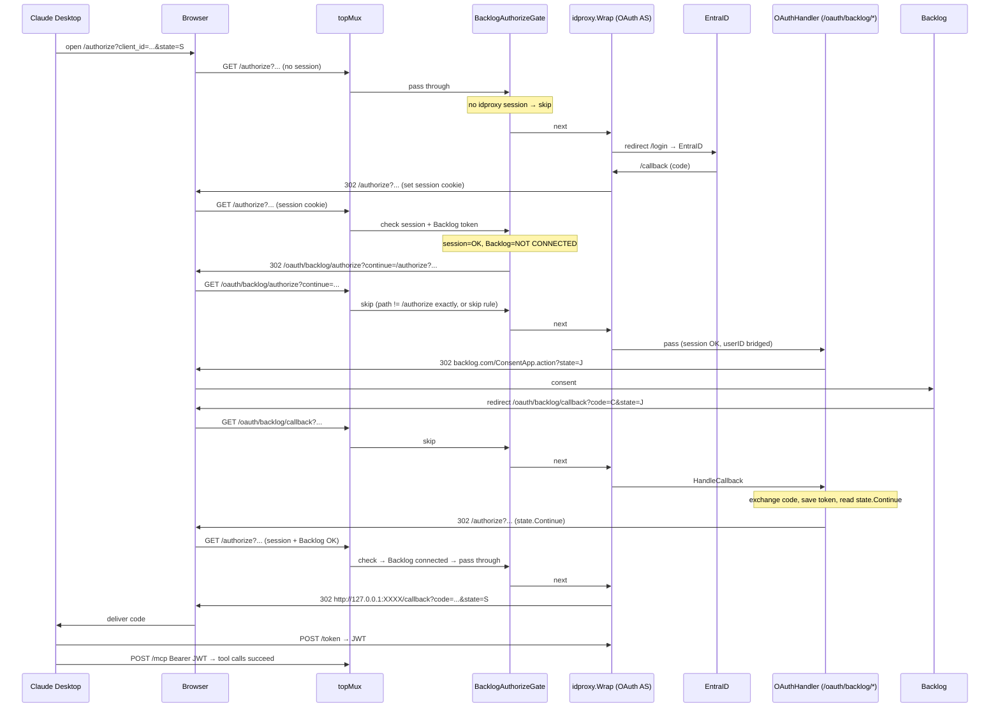
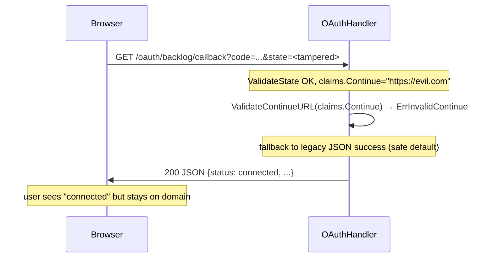
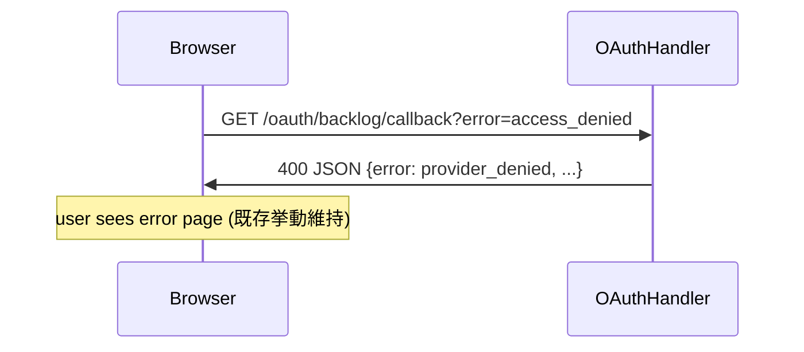
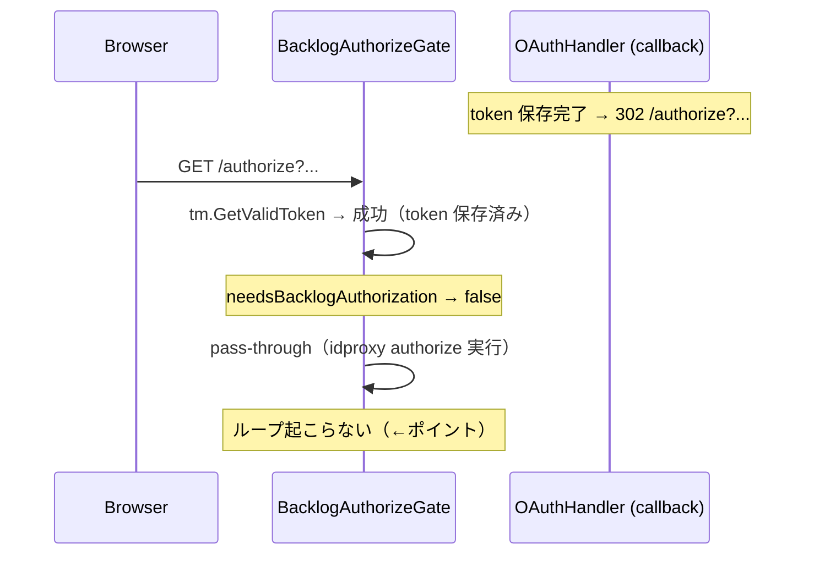

# 計画: MCP OAuth 2.1 `/authorize` に Backlog OAuth を chain する

## Context（なぜこの変更が必要か）

v0.13.0 で Proposal A の `EnsureBacklogConnected` ミドルウェア (`internal/cli/mcp_auto_redirect.go`) を追加したが、**Claude Desktop / Claude Code の MCP 接続フローには全く効いていない**。理由は以下の通り。

**v0.13.0 の前提**: ユーザーがブラウザで `<FUNCTION_URL>/` を開く → OIDC 認証後に `/` に戻ってくる → そこで middleware が発火。

**実際の Claude Desktop / Claude Code の挙動（MCP Authorization spec 2025-03-26）**:

1. MCP クライアントが `POST /mcp` を試行 → idproxy が 401 Bearer を返す
2. クライアントが `/.well-known/oauth-authorization-server` を取得（idproxy の OAuth AS メタデータ）
3. クライアントが Dynamic Client Registration で `/register` を叩き、`client_id` を取得
4. クライアントが **ブラウザを `/authorize?response_type=code&client_id=...&redirect_uri=http://127.0.0.1:XXXX/callback&code_challenge=...&state=...` に飛ばす**
5. idproxy `/authorize` → セッション無 → `/login` → EntraID → `/callback` → セッション cookie 発行 → 元の `/authorize?...` に戻る
6. idproxy `/authorize` → セッション有 → 認可コード生成 → **Claude Desktop の localhost redirect_uri に直接 302**
7. Claude Desktop が code を `/token` で JWT に交換 → 以降 `POST /mcp` に Bearer 付与

**ブラウザは一度も `/` や `/oauth/backlog/authorize` にランディングしない**。OIDC 完了直後に Claude Desktop の localhost へ戻されるため、`EnsureBacklogConnected` の発火点が存在しない。結果、ユーザーは Claude Desktop 側で接続完了したように見えるが、ツールを叩くと `_meta.authorization_url` のエラーが返り、そこに書かれた URL を手動でブラウザに貼り直さないと Backlog 認可画面に到達できない。

**目標**: idproxy の `/authorize` ハンドラが「OIDC 確立 → 認可コード発行 → クライアントに戻す」を実行する**直前**に Backlog トークン未接続を検知し、ブラウザを `/oauth/backlog/authorize` に寄り道させる。Backlog 認可完了後に元の `/authorize?...` へ戻せば、OIDC + Backlog 両方のトークンが揃った状態で Claude Desktop の OAuth ハンドシェイクが完了する。ユーザーの知覚上は「EntraID ログイン → Backlog 認可 → Claude Desktop 接続完了」がシームレスに繋がる。

## スコープ

### 実装範囲
- idproxy `/authorize` をフックする `BacklogAuthorizeGate` middleware を新規追加
- `auth.StateClaims` に `Continue` フィールドを追加（後方互換を保つ）
- `HandleAuthorize` に `?continue=` クエリ受付を追加し、state に格納
- `HandleCallback` に `Continue` が指定された場合の 302 リダイレクト分岐を追加
- `HandleCallback` の継続先 URL バリデーション（open redirect 防止）
- `mcp.go` で新 middleware を `topMux` に配線（`authMW.Wrap` の外側、`/authorize` のみ発火）
- 単体テスト + e2e テスト追加

### スコープ外
- idproxy 本体の改修（`SetOAuthServer` / `PostAuthRedirectURL` 追加など）
- EntraID / OIDC プロバイダー設定変更
- Backlog OAuth のスコープ変更
- Redis / PostgreSQL Store 追加
- `_meta.authorization_url` の Proposal B の再設計（現状維持・ブラウザ再認可 fallback として残す）

## 解決アーキテクチャ

### 新しいリクエストフロー（Claude Desktop 初回接続）



### middleware 配線

`internal/cli/mcp.go` の `topMux` 部分を以下のように変更する（auth 有効 + OAuth 有効時のみ）:

```
topMux:
  /healthz      → healthHandler
  /             → BacklogAuthorizeGate(authMW.Wrap(bridge(EnsureBacklogConnected(innerMux))))
                  └─ /authorize のみ gate が発火、それ以外は素通し
```

- `BacklogAuthorizeGate` は `authMW.Wrap` の**外側**に置く。なぜなら idproxy の `/authorize` ハンドラは `oauthServer` に直接デリゲート（`next` を呼ばない）ため、`authMW.Wrap` の内側に置いても `/authorize` では実行されないため。
- Gate は自前の `*idproxy.SessionManager` を保持し、cookie から直接 Session を取り出して `User.Subject` を得る（`idproxy.NewSessionManager(cfg)` で構築、同じ Store / CookieSecret を共有すれば既存 cookie を復号可能）。
- Gate は `GET /authorize` のみを対象にする。他のパス・他のメソッドは即 pass-through。
- セッション無しなら pass-through（idproxy が login redirect を走らせる）。セッション有 + Backlog 接続済みなら pass-through。セッション有 + Backlog 未接続のみ 302 redirect。

## テスト設計書

### 観点 2 — TDD テスト設計（Red → Green → Refactor）

#### Unit: `internal/auth/state_test.go`（追加）

| ID | 入力 | 期待出力 | 備考 |
|----|------|---------|------|
| S1 | `GenerateStateWithContinue("u1", "space", "/authorize?x=1", secret, 10m)` → 生成 → `ValidateState` | `claims.Continue == "/authorize?x=1"` | 新 API の round trip |
| S2 | 既存 `GenerateState("u1", "space", secret, 10m)` → `ValidateState` | `claims.Continue == ""` | 後方互換：フィールド無しでも既存挙動 |
| S3 | `ValidateContinueURL("/authorize?a=b")` | nil (有効) | 相対パスは許可 |
| S4 | `ValidateContinueURL("https://evil.example/x")` | `ErrInvalidContinue` | 絶対 URL は open redirect のため拒否 |
| S5 | `ValidateContinueURL("//evil.example/x")` | `ErrInvalidContinue` | protocol-relative 拒否 |
| S6 | `ValidateContinueURL("\\\\evil")` | `ErrInvalidContinue` | backslash 拒否 |
| S7 | `ValidateContinueURL("/anything")` | `ErrInvalidContinue` | `/authorize` prefix に限定（allowlist） |
| S8 | `ValidateContinueURL("")` | nil | 空は「継続先なし」として許容 |

#### Unit: `internal/cli/backlog_authorize_gate_test.go`（新規）

| ID | リクエスト | セッション状態 | Backlog 状態 | 期待挙動 |
|----|----------|--------------|-------------|---------|
| G1 | `GET /authorize?client_id=x` | あり | 未接続 | 302 → `/oauth/backlog/authorize?continue=%2Fauthorize%3Fclient_id%3Dx` |
| G2 | `GET /authorize?client_id=x` | あり | 接続済み | pass-through（next 呼び出し） |
| G3 | `GET /authorize?client_id=x` | なし | N/A | pass-through（idproxy が login redirect） |
| G4 | `GET /authorize?client_id=x` | cookie 改ざん | N/A | pass-through（idproxy が再ログイン） |
| G5 | `POST /authorize` | N/A | N/A | pass-through（GET 以外は非対象） |
| G6 | `GET /token` | N/A | N/A | pass-through（パス不一致） |
| G7 | `GET /oauth/backlog/authorize` | あり | 未接続 | pass-through（ループ防止） |
| G8 | `GET /mcp` | N/A | N/A | pass-through |
| G9 | `GET /authorize` + Backlog 状態が `ErrUnauthenticated` | あり | - | pass-through（予期しないエラーは redirect しない、既存 `needsBacklogAuthorization` allowlist と整合） |

#### Unit: `internal/transport/http/oauth_handler_test.go`（追加）

| ID | リクエスト | 期待レスポンス |
|----|----------|---------------|
| H1 | `GET /oauth/backlog/authorize?continue=/authorize?x=1` + userID ctx | 302 → Backlog consent URL、state JWT に `continue` claim が埋まる |
| H2 | `GET /oauth/backlog/authorize?continue=https://evil` | 400 `invalid_request` (open redirect) |
| H3 | `GET /oauth/backlog/authorize`（continue 無し） | 既存動作を維持（302 → Backlog consent, state.Continue="") |
| H4 | `HandleCallback` 正常 + state.Continue="/authorize?x=1" | 302 → `/authorize?x=1`（JSON は返さない） |
| H5 | `HandleCallback` 正常 + state.Continue="" | 既存動作（200 JSON `{"status":"connected",...}`） |
| H6 | `HandleCallback` エラー（provider_error 等） + state.Continue="/authorize?x=1" | 既存の JSON エラー維持（302 しない） |

#### E2E: `internal/cli/mcp_oauth_e2e_test.go`（追加）

新規テスト: `TestOAuthE2E_ClaudeDesktopFlow_ChainsBacklogOAuth`

前提:
- idproxy mock + Backlog OAuth mock を起動
- idproxy.Config の OAuth を有効化（DCR + PKCE 対応済み）
- TokenStore = memory、空の状態でスタート

シナリオ:
1. `POST /register` → DCR クライアント取得
2. `GET /authorize?client_id=...&code_challenge=...&state=S1&redirect_uri=http://127.0.0.1:0/cb` → 302 → `/login?redirect_to=/authorize?...`
3. `GET /login?...` → 302 → mock IdP
4. mock IdP callback → `GET /callback?code=...&state=...` → 302 → `/authorize?...` + session cookie
5. `GET /authorize?...` (with cookie) → **期待: 302 → `/oauth/backlog/authorize?continue=%2Fauthorize...`**（従来は Backlog 未接続でも即 302 to redirect_uri していた）
6. `GET /oauth/backlog/authorize?continue=...` → 302 → Backlog mock consent
7. Backlog mock callback → `GET /oauth/backlog/callback?code=...&state=J` → token 保存 → **期待: 302 → `/authorize?...`**（JSON ではなく redirect）
8. `GET /authorize?...` → 302 → `http://127.0.0.1:0/cb?code=...&state=S1` （Claude Desktop localhost への最終戻し）
9. `POST /token?code=...&code_verifier=...` → JWT 取得
10. `POST /mcp` with Bearer JWT, ツール実行 → 成功（Backlog トークンが store にある）

検証項目:
- 各ステップの Location ヘッダ
- `_meta.authorization_url` エラーが**出ない**こと（最終ツール呼び出しで）
- state JWT の Continue claim が URL encode/decode でラウンドトリップする

既存 E2E の修正:
- `TestOAuthE2E_UnconnectedUserRedirectedToBacklog`（もしあれば）を更新し、旧挙動でなく新挙動（chain flow）を期待する

## 実装手順

### Step 1 — `internal/auth/state.go` に `Continue` を追加
**ファイル**: `/Users/youyo/src/github.com/youyo/logvalet/internal/auth/state.go`

変更:
- `StateClaims` に `Continue string \`json:"continue,omitempty"\`` を追加
- 新 API `GenerateStateWithContinue(userID, tenant, continueURL string, secret []byte, ttl time.Duration) (string, error)` を追加
- 既存 `GenerateState(userID, tenant, secret, ttl)` は**削除せず残す**。内部的に `GenerateStateWithContinue(userID, tenant, "", secret, ttl)` に委譲するよう書き換える。既存テスト・既存呼び出し元は無修正で動く
- `ValidateContinueURL(raw string) error` をエクスポート: 空文字 OK / `/authorize` で始まる相対パスのみ OK / `//`, `\`, `://` 含む場合は `ErrInvalidContinue` を返す
- `ErrInvalidContinue` を errors.go に追加

依存: なし（errors.go は既存）

### Step 2 — `HandleAuthorize` に `continue` 受け付けを追加
**ファイル**: `/Users/youyo/src/github.com/youyo/logvalet/internal/transport/http/oauth_handler.go`

変更:
- `HandleAuthorize` 先頭で `continueURL := r.URL.Query().Get("continue")` を取得
- `auth.ValidateContinueURL(continueURL)` が非 nil なら 400 `invalid_request` を返す
- state 生成を `auth.GenerateStateWithContinue(userID, h.tenant, continueURL, h.stateSecret, h.stateTTL)` に変更（continueURL="" の場合でも新 API でゼロ値フィールドとして正しく扱える）
- 既存 `auth.GenerateState` は温存（他所の呼び出し元・テスト影響回避）

依存: Step 1

### Step 3 — `HandleCallback` に continue リダイレクト分岐を追加
**ファイル**: `/Users/youyo/src/github.com/youyo/logvalet/internal/transport/http/oauth_handler.go`

変更:
- トークン保存成功後（現行 L376-390 付近）に分岐:
  ```go
  if claims.Continue != "" {
      if err := auth.ValidateContinueURL(claims.Continue); err != nil {
          h.logger.WarnContext(ctx, "oauth callback: invalid continue URL in state", ...)
          // fall-through: JSON success を返す（攻撃ベクトルを抑制）
      } else {
          stdhttp.Redirect(w, r, claims.Continue, stdhttp.StatusFound)
          return
      }
  }
  // 既存 writeJSONSuccess(...) を実行
  ```
- エラー経路では continue を見ない（既存の JSON エラーを維持）
- セキュリティ: state に埋めた Continue を callback で再度 allowlist バリデート（二重防御）

依存: Step 1, Step 2

### Step 4 — `BacklogAuthorizeGate` middleware 実装
**ファイル（新規）**: `/Users/youyo/src/github.com/youyo/logvalet/internal/cli/backlog_authorize_gate.go`

責務:
- `idproxy.SessionManager` を保持
- `TokenManager`, providerName, tenant, `backlogAuthorizeURL` を保持
- `http.Handler` middleware として `GET /authorize` を監視
- 発火条件: メソッド=GET, パス= `/authorize`（完全一致）, session 復号 OK, `tm.GetValidToken(ctx, sess.User.Subject, provider, tenant)` が `ErrProviderNotConnected | ErrTokenRefreshFailed | ErrTokenExpired`
- 発火時: `continue = r.URL.RequestURI()` (`/authorize?...` を URL エンコード) → 302 to `${backlogAuthorizeURL}?continue=${url.QueryEscape(continue)}`
- それ以外（他パス, 他メソッド, セッション無, Backlog 接続済, 予期しないエラー）: `next.ServeHTTP`

関数シグネチャ:
```go
func NewBacklogAuthorizeGate(
    sm *idproxy.SessionManager,
    tm auth.TokenManager,
    providerName, tenant, backlogAuthorizeURL string,
) func(http.Handler) http.Handler
```

`needsBacklogAuthorization` は `mcp_auto_redirect.go` で既に定義済み → package-private のまま再利用する。

依存: なし（既存の `auth.TokenManager` と `idproxy.SessionManager` を使う）

### Step 5 — `mcp.go` に gate を配線
**ファイル**: `/Users/youyo/src/github.com/youyo/logvalet/internal/cli/mcp.go`

変更箇所: L209-240（auth 有効時の branch）

変更内容:
- `idproxy.New(ctx, authCfg)` に加えて `sm, err := idproxy.NewSessionManager(authCfg)` を呼び出し（両者とも `authCfg.Store` と `authCfg.CookieSecret` を共有するため session cookie の復号は成立）
- `oauthDeps != nil` のとき `gate := NewBacklogAuthorizeGate(sm, oauthDeps.TokenManager, oauthDeps.Provider.Name(), rc.Config.Space, oauthDeps.AuthorizeURL)` を構築
- `topMux.Handle("/", gate(authMW.Wrap(bridge(finalInner))))` に変更（gate が最外層）
- OAuth 無効時は従来どおり gate 無し
- startup log に `"  MCP OAuth flow: /authorize gated via Backlog connection check"` を追加

依存: Step 4

### Step 6 — 単体テスト作成（Red）
**ファイル（新規）**: 
- `/Users/youyo/src/github.com/youyo/logvalet/internal/cli/backlog_authorize_gate_test.go`
- `/Users/youyo/src/github.com/youyo/logvalet/internal/transport/http/oauth_handler_continue_test.go`（既存 `oauth_handler_test.go` に足してもよい）

**ファイル（追記）**: `/Users/youyo/src/github.com/youyo/logvalet/internal/auth/state_test.go`

テスト設計書のケース S1–S8, G1–G9, H1–H6 を実装する（まず failing テスト）。

依存: なし（Step 1–5 の実装より先に書く＝TDD Red）

### Step 7 — Green: テストが通るまで実装
Step 1–5 の実装を順に行い、各ステップ完了ごとに対応テストが緑になることを確認。

### Step 8 — E2E テスト追加（Red → Green）
**ファイル**: `/Users/youyo/src/github.com/youyo/logvalet/internal/cli/mcp_oauth_e2e_test.go`

既存 harness（idproxy mock + backlog mock + httptest.Server）を再利用し、`TestOAuthE2E_ClaudeDesktopFlow_ChainsBacklogOAuth` を追加。

必要なら harness 側に `httpClient.CheckRedirect = func(req *http.Request, via []*http.Request) error { return http.ErrUseLastResponse }` を設定して redirect chain を 1 hop ずつ検証できるようにする。

依存: Step 1–5 の実装完了

### Step 9 — Refactor
- gate と `EnsureBacklogConnected` の間で重複している `needsBacklogAuthorization` を共通化（現状 `mcp_auto_redirect.go` にある → 新規 `internal/cli/backlog_connection.go` に move、両者から参照）
- Structured log キー名の統一
- `go vet ./...` と `go test ./...` をパスさせる

### Step 10 — README 更新
**ファイル**: `/Users/youyo/src/github.com/youyo/logvalet/README.md`

"Supported Modes" / "Mode B: OIDC + Backlog OAuth" セクションに以下を追記:

- MCP クライアント（Claude Desktop / Claude Code）接続時の新しいシーケンス図（上記 mermaid の簡略版）
- `/oauth/backlog/authorize?continue=<same-origin-path>` の仕様
- `/oauth/backlog/callback` が state.Continue あれば 302 / なければ JSON を返す仕様
- セキュリティノート: `continue` は `/authorize` prefix のみ allowlist

### Step 11 — CHANGELOG
**ファイル**: `/Users/youyo/src/github.com/youyo/logvalet/CHANGELOG.md`（無ければ新規作成は不要、コミットメッセージで代替）

コミットメッセージ案:
- `feat(mcp): chain Backlog OAuth into MCP authorize flow for seamless Claude Desktop/Code connect`

## アーキテクチャ検討

### 既存パターンとの整合性

- `EnsureBacklogConnected` と同じ「middleware で Backlog 接続を検知して 302」のパターンを踏襲
- `needsBacklogAuthorization` のエラー allowlist を共通化して使い回す（ホワイトリスト方針も継承）
- state JWT の claim 拡張は最小（`Continue` 追加のみ）。既存 callback のセキュリティ検証（tenant 一致 / userID 一致）は維持
- `idproxy.NewSessionManager` の使用は Bridge パターンに近い（idproxy の内部 sm と並列に 1 インスタンス持つだけ）。Store と Secret を共有すれば 2 つの sm は相互運用可能

### 新規モジュール設計

1. `BacklogAuthorizeGate` (cli package)
   - 責務: `/authorize` で Backlog 接続チェック → 必要なら 302
   - 非責務: OIDC セッション発行、Backlog トークン取得、DCR 処理
   - 依存: `*idproxy.SessionManager`, `auth.TokenManager`

2. `StateClaims.Continue` + `ValidateContinueURL` (auth package)
   - 責務: 同一オリジン相対パスのみ許可する allowlist
   - 非責務: 外部 URL validation、queryパラメータ個別バリデーション

### なぜ他の選択肢を取らないか

| 案 | 却下理由 |
|----|---------|
| idproxy 本体に `PostAuthRedirectURL` を足す | 上流 OSS に PR が必要で時間がかかる。logvalet 側で完結する方が速い |
| `authMW.SetOAuthServer(wrapper)` で oauthServer ごとラップ | 元の `OAuthServer` を externally 構築し直す必要があり、SessionManager 二重持ち + Store 共有の注意点が多い。gate middleware の方が疎結合 |
| `_meta.authorization_url` を Proposal B 強化のみで解決 | Claude Code の JSON-RPC ハンドリング上、メタデータを自動 follow する保証は無い。結局手動 URL クリックが残る |
| `/` に OIDC セッション付きでランディングさせるよう idproxy callback の redirect_to を書き換え | Claude Desktop は `/authorize` に送るため `/` に来ない。的外れ |

## リスク評価

| リスク | 重大度 | 対策 |
|--------|--------|------|
| `idproxy.NewSessionManager` の二重インスタンス化が cookie 復号に失敗する | Resolved | **idproxy v0.2.2 `session.go` を確認済み**。`NewSessionManager` は `Config` から完全決定的に派生する（`hashKey=cfg.CookieSecret`, `encryptionKey=sha256(cfg.CookieSecret)`, `sessionCookieName="_idproxy_session"` 定数, `store=cfg.Store`）ため、同じ `Config` を共有する限り二つの SM は互換の cookie を相互復号できる。e2e テストでも最終検証する |
| `continue` パラメータ経由の open redirect | Critical | ValidateContinueURL を authorize / callback の両方で適用（二重防御）。allowlist は `/authorize` prefix のみ |
| 既存 `HandleCallback` の JSON レスポンスに依存するクライアント破壊 | Medium | `Continue` が空のときは従来 JSON を維持。REST クライアント（`/oauth/backlog/callback` を直叩きするテスト等）への影響を回避 |
| state JWT サイズ肥大 → Cookie / URL 長制限超過 | Low | Continue の長さは MCP `/authorize` URL に制限される（通常 <1KB）。HS256 JWT はサイズ余裕あり |
| gate が `/authorize` 以外のパスを誤発火 | Medium | パス判定は完全一致 (`r.URL.Path == "/authorize"`) のみ。`/authorize/foo` はヒットさせない |
| idproxy の `PathPrefix` 設定で `/authorize` のパスが変わる | Low | **logvalet は `PathPrefix` を一切設定しないため常に `/authorize` 固定**。gate の比較・`ValidateContinueURL` の allowlist 双方ともハードコードの `"/authorize"` を使う。将来 `PathPrefix` サポートを入れる場合は本プランを再評価する（現時点ではスコープ外） |
| テスト環境で Backlog mock が redirect loop を起こす | Low | e2e で `CheckRedirect` を制御して loop 検出 |
| ブラウザが 302 chain を辿る途中で cookie を落とす | Low | 全ての redirect は同一 origin。Set-Cookie は `SameSite=Lax` を想定（idproxy デフォルト） |

ロールバック計画:
- 新 middleware は OAuth 有効 branch のみ有効。無効化は `BacklogClientID` を空にすれば自動 fallback
- v0.13.x に stuck した場合、gate を外すのは `mcp.go` の 1 行変更で可能

## シーケンス図

### 正常系: Claude Desktop 初回接続

上記 Context 末尾の mermaid 図を参照。

### 異常系 1: state.Continue が改ざんで絶対 URL 化



### 異常系 2: Backlog OAuth 自体が失敗



### 異常系 3: /authorize に再訪時のループ



## チェックリスト（5 観点 27 項目）

### 観点 1: 実装実現可能性と完全性 (5/5)
- [x] 手順の抜け漏れがないか → Step 1–11 で端から端まで網羅
- [x] 各ステップが十分に具体的か → ファイルパス・関数シグネチャ・変更点を明記
- [x] 依存関係が明示されているか → 各 Step に「依存: …」を記載
- [x] 変更対象ファイルが網羅されているか → state.go, oauth_handler.go, backlog_authorize_gate.go(new), mcp.go, テスト 3 本, README
- [x] 影響範囲が正確に特定されているか → OAuth 無効 path には一切影響しない

### 観点 2: TDD テスト設計の品質 (6/6)
- [x] 正常系テストケース網羅（G2, H3, H5, E2E 正常フロー）
- [x] 異常系テストケース定義（G3, G4, G9, H2, H6, 異常系シーケンス図）
- [x] エッジケース考慮（S2=後方互換, S5=protocol-relative, S8=空文字）
- [x] 入出力が具体的（各テストに入力 / 期待出力を明記）
- [x] Red → Green → Refactor 順序（Step 6=Red, Step 7=Green, Step 9=Refactor）
- [x] モック設計適切（idproxy mock + Backlog mock の既存 harness 流用）

### 観点 3: アーキテクチャ整合性 (5/5)
- [x] 既存命名規則に従う（`NewBacklogAuthorizeGate` は `EnsureBacklogConnected` と同じ命名パターン）
- [x] 設計パターン一貫（middleware-based redirect、allowlist バリデーション）
- [x] モジュール分割適切（cli / auth / transport の境界を維持）
- [x] 依存方向正しい（cli → auth / transport、逆向き依存なし）
- [x] 類似機能との統一性（`needsBacklogAuthorization` を共通化して再利用）

### 観点 4: リスク評価と対策 (6/6)
- [x] リスク特定（上記表で 8 項目）
- [x] 対策具体的（e2e 検証、二重防御、ホワイトリスト）
- [x] フェイルセーフ考慮（continue 無効時は既存 JSON fallback）
- [x] パフォーマンス評価（追加コスト: session 復号 1 回 + token lookup 1 回 / `/authorize` リクエスト）
- [x] セキュリティ観点（open redirect 防御 × 2 箇所、state JWT 改ざん検出、userID mismatch チェック維持）
- [x] ロールバック計画（BacklogClientID 空化 / mcp.go 1 行戻し）

### 観点 5: シーケンス図の完全性 (5/5)
- [x] 正常フロー記述（mermaid で 10 ステップ）
- [x] エラーフロー記述（異常系 1, 2, 3）
- [x] ユーザー・システム・外部 API 間の相互作用明確（Claude Desktop / Browser / topMux / idproxy / EntraID / OAuthHandler / Backlog）
- [x] タイミング・同期制御明記（redirect 順序、cookie set タイミング）
- [x] リトライ・タイムアウト等の例外ハンドリング図示（ループ防止、provider_denied 経路）

## 動作確認（Verification）

### 自動テスト
```bash
go test ./internal/auth/... -run TestState -v
go test ./internal/transport/http/... -run TestOAuthHandler -v
go test ./internal/cli/... -run TestBacklogAuthorizeGate -v
go test ./internal/cli/... -run TestOAuthE2E_ClaudeDesktopFlow -v
go test ./...
go vet ./...
```

### 手動 e2e（Lambda デプロイ後）
1. DynamoDB の tokenstore テーブルから現ユーザー行を削除
2. Claude Desktop で MCP connector を "Reconnect"
3. 期待: ブラウザが EntraID → Backlog consent → Claude Desktop 完了 まで 1 セッションで遷移
4. `logvalet_space_info` ツールを実行 → `_meta.authorization_url` エラーが出ず成功
5. DynamoDB にトークン行が新規作成されていることを確認

### 回帰確認
- 従来の「ブラウザで直接 MCP URL を開く」フロー (Proposal A) も影響を受けないことを確認:
  1. シークレットブラウザで `<FUNCTION_URL>/` → EntraID → 自動で Backlog consent → 成功画面
- `/oauth/backlog/status` JSON レスポンスが従来通りであること（Proposal C 影響なし）
- `_meta.authorization_url` が tools call エラーで引き続き返ること（Proposal B 影響なし、ただしトークン保存後は発火しない）

## ドキュメント更新

- `README.md`: "Mode B: OIDC + Backlog OAuth" セクションに chain flow の説明を追記
- `docs/specs/*`: 更新不要（初期構想ドキュメントのため）
- CHANGELOG: コミットメッセージで代替

## Next Action

> このプランを実装するには以下を実行してください:
> `/devflow:implement` — このプランに基づいて実装を開始
> `/devflow:cycle` — 自律ループで連続実行
