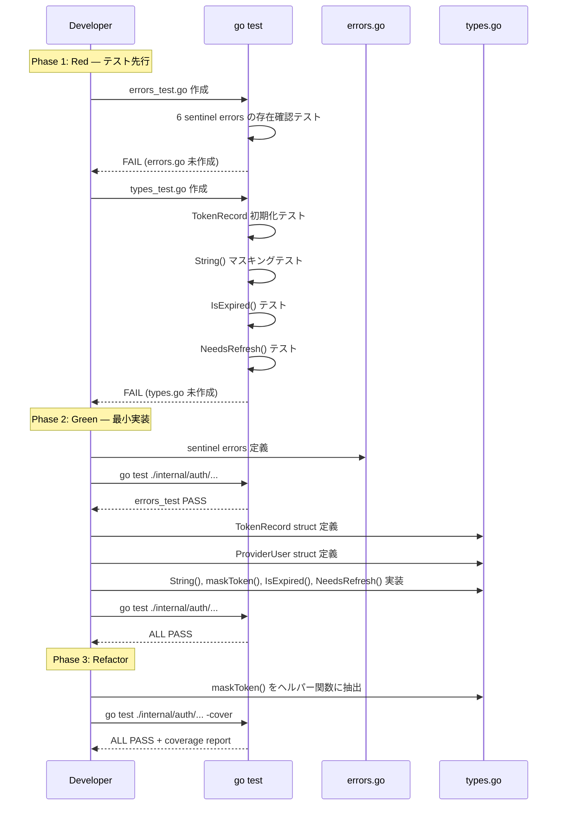

# M01: TokenRecord 型定義とセキュリティ基盤

## Overview

| 項目 | 値 |
|------|---|
| ステータス | 完了 |
| 依存 | なし |
| 対象ファイル | `internal/auth/types.go`, `internal/auth/types_test.go`, `internal/auth/errors.go`, `internal/auth/errors_test.go` |

## Goal

OAuth トークン管理の中核データ型（TokenRecord, ProviderUser）とエラー型を定義し、トークンマスキングを Day 1 から組み込む。

## TDD Test Design

### types_test.go

| # | テストケース | 入力 | 期待出力 |
|---|-------------|------|---------|
| 1 | TokenRecord 全フィールド初期化 | 全フィールドに値をセットした TokenRecord | 各フィールドが正しく保持される |
| 2 | String() がアクセストークンをマスク | AccessToken: "abcdef123456" | `"ab...56"` 形式でマスク |
| 3 | String() がリフレッシュトークンをマスク | RefreshToken: "xyz789abc" | `"xy...bc"` 形式でマスク |
| 4 | String() が短いトークンをマスク | AccessToken: "ab" (4文字以下) | `"***"` |
| 5 | String() が空トークンをマスク | AccessToken: "" | `"***"` |
| 6 | IsExpired() — 未来の expiry | Expiry: time.Now().Add(1h) | false |
| 7 | IsExpired() — 過去の expiry | Expiry: time.Now().Add(-1h) | true |
| 8 | IsExpired() — ゼロ値 expiry | Expiry: time.Time{} | true |
| 9 | NeedsRefresh(5min) — expiry まで 10min | Expiry: now+10min, margin: 5min | false |
| 10 | NeedsRefresh(5min) — expiry まで 3min | Expiry: now+3min, margin: 5min | true |
| 11 | NeedsRefresh(5min) — 既に期限切れ | Expiry: now-1min, margin: 5min | true |

### errors_test.go

| # | テストケース | 入力 | 期待出力 |
|---|-------------|------|---------|
| 1 | ErrUnauthenticated は errors.Is で判定可能 | errors.Is(err, ErrUnauthenticated) | true |
| 2 | ErrProviderNotConnected は errors.Is で判定可能 | errors.Is(err, ErrProviderNotConnected) | true |
| 3 | ErrTokenExpired は errors.Is で判定可能 | errors.Is(err, ErrTokenExpired) | true |
| 4 | ErrTokenRefreshFailed は errors.Is で判定可能 | errors.Is(err, ErrTokenRefreshFailed) | true |
| 5 | ErrProviderUserMismatch は errors.Is で判定可能 | errors.Is(err, ErrProviderUserMismatch) | true |
| 6 | ErrInvalidTenant は errors.Is で判定可能 | errors.Is(err, ErrInvalidTenant) | true |
| 7 | 各エラーの Error() が actionable なメッセージを返す | err.Error() | 非空文字列 |
| 8 | fmt.Errorf でラップしても元エラーが判定可能 | errors.Is(fmt.Errorf("wrap: %w", ErrTokenExpired), ErrTokenExpired) | true |

## Implementation Steps

### Step 1: errors.go — センチネルエラー定義 (Red → Green)

```go
// internal/auth/errors.go
package auth

import "errors"

var (
    ErrUnauthenticated      = errors.New("auth: user not authenticated")
    ErrProviderNotConnected = errors.New("auth: provider not connected for this user")
    ErrTokenExpired         = errors.New("auth: token expired and refresh failed")
    ErrTokenRefreshFailed   = errors.New("auth: token refresh failed")
    ErrProviderUserMismatch = errors.New("auth: provider user does not match")
    ErrInvalidTenant        = errors.New("auth: invalid or missing tenant")
    ErrStateExpired         = errors.New("auth: OAuth state expired")
    ErrStateInvalid         = errors.New("auth: OAuth state invalid")
)
```

### Step 2: types.go — TokenRecord と ProviderUser (Red → Green)

```go
// internal/auth/types.go
package auth

import (
    "fmt"
    "time"
)

type TokenRecord struct {
    UserID         string
    Provider       string
    Tenant         string
    AccessToken    string
    RefreshToken   string
    TokenType      string
    Scope          string
    Expiry         time.Time
    ProviderUserID string
    CreatedAt      time.Time
    UpdatedAt      time.Time
}

type ProviderUser struct {
    ID    string
    Name  string
    Email string
}
```

### Step 3: TokenRecord メソッド (Red → Green)

- `String()` — トークンをマスクした文字列表現
  - 5文字以上: 先頭2文字 + "..." + 末尾2文字
  - 4文字以下または空: "***"
- `IsExpired()` — `time.Now().After(r.Expiry)` or ゼロ値で true
- `NeedsRefresh(margin time.Duration)` — `time.Now().Add(margin).After(r.Expiry)` or ゼロ値で true

### Step 4: Refactor

- マスキングヘルパーを `maskToken(s string) string` として抽出
- テストの重複を削減

## Sequence Diagram



## Risks

| リスク | 影響度 | 発生確率 | 対策 |
|--------|--------|----------|------|
| String() を使わず直接 %+v でログ出力される | 中 | 中 | slog.LogValuer の実装を TODO で記録。M01 では String() + maskToken() で基盤確立 |
| ProviderUser の構造が Backlog API レスポンスと合わない | 低 | 低 | M05 で Backlog `/users/myself` のレスポンス構造に合わせて調整。M01 では汎用構造 |
| IsExpired()/NeedsRefresh() がテスト時の時刻に依存 | 低 | 中 | time.Now() を直接使用するが、テストでは十分なマージン（1時間等）を設定して flaky を回避 |
| sentinel error のメッセージが将来の i18n で問題になる | 低 | 低 | 英語メッセージは内部用。MCP tool 側で actionable なメッセージに変換する設計（M06以降） |
| internal/auth パッケージが既存の internal/credentials と責務重複 | 中 | 低 | 明確に分離: credentials は CLI profile/API key 用、auth は OAuth per-user token 用。CLAUDE.md で記録 |

## Verification

```bash
# テスト実行
go test ./internal/auth/... -v -count=1

# テストカバレッジ確認
go test ./internal/auth/... -cover
```

## Notes

- `internal/auth/` は新規パッケージ。既存の `internal/credentials/` とは別レイヤー
- TokenRecord の JSON タグはこの段階では不要（TokenStore の実装で必要に応じて追加）
- `slog.LogValuer` interface の実装は将来の改善として TODO に記録
