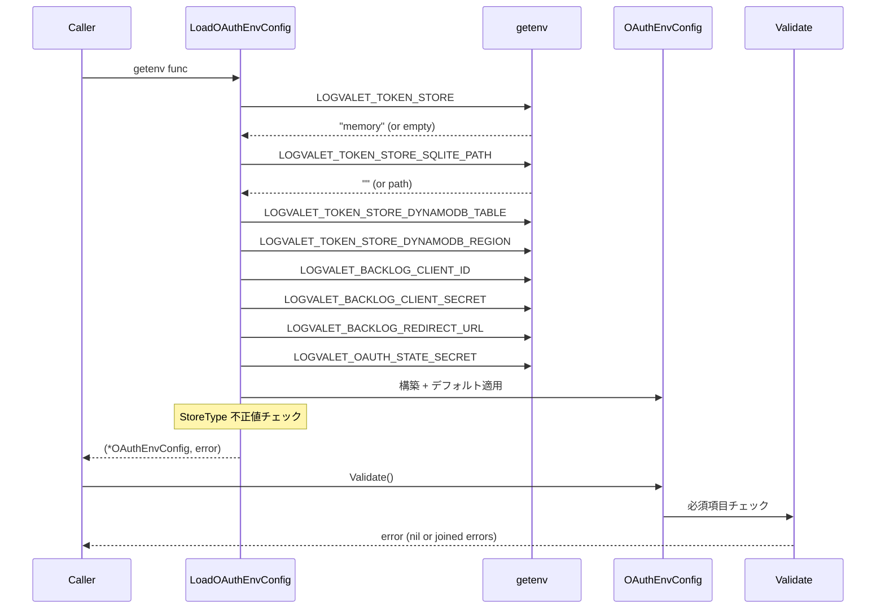

# M03: OAuthConfig 環境変数ローダー 詳細計画

## 概要

Zero config file 方針に基づき、OAuth 関連の全設定を環境変数のみから取得する `OAuthEnvConfig` struct と `LoadOAuthEnvConfig()` 関数を実装する。

## 対象ファイル

| ファイル | 内容 |
|---------|------|
| `internal/auth/config.go` | OAuthEnvConfig struct, LoadOAuthEnvConfig(), Validate() |
| `internal/auth/config_test.go` | TDD テスト |

## 設計

### OAuthEnvConfig struct

```go
// StoreType は TokenStore の種別を表す。
type StoreType string

const (
    StoreTypeMemory   StoreType = "memory"
    StoreTypeSQLite   StoreType = "sqlite"
    StoreTypeDynamoDB StoreType = "dynamodb"
)

// OAuthEnvConfig は OAuth 関連の環境変数設定を保持する。
type OAuthEnvConfig struct {
    // TokenStore 設定
    TokenStoreType       StoreType // LOGVALET_TOKEN_STORE (デフォルト: memory)
    SQLitePath           string    // LOGVALET_TOKEN_STORE_SQLITE_PATH (デフォルト: ./logvalet.db)
    DynamoDBTable        string    // LOGVALET_TOKEN_STORE_DYNAMODB_TABLE
    DynamoDBRegion       string    // LOGVALET_TOKEN_STORE_DYNAMODB_REGION

    // Backlog OAuth 設定
    BacklogClientID      string    // LOGVALET_BACKLOG_CLIENT_ID
    BacklogClientSecret  string    // LOGVALET_BACKLOG_CLIENT_SECRET
    BacklogRedirectURL   string    // LOGVALET_BACKLOG_REDIRECT_URL

    // OAuth State 設定
    OAuthStateSecret     string    // LOGVALET_OAUTH_STATE_SECRET (hex エンコード)
}
```

### LoadOAuthEnvConfig

```go
func LoadOAuthEnvConfig(getenv func(string) string) (*OAuthEnvConfig, error)
```

- `getenv` DI パターン（既存 `internal/config/config.go` の `Resolve()` と同様）
- デフォルト値の適用
- StoreType の正規化（小文字化）と不正値バリデーション

### Validate

```go
func (c *OAuthEnvConfig) Validate() error
```

- OAuth 有効時（ClientID が設定されている場合）の必須項目チェック
- StoreType 別の必須項目チェック（sqlite → SQLitePath, dynamodb → Table + Region）
- 複数エラーの集約

### OAuthEnabled

```go
func (c *OAuthEnvConfig) OAuthEnabled() bool
```

- ClientID が設定されているかで判定

## シーケンス図



## TDD 設計（Red -> Green -> Refactor）

### Red Phase: 失敗するテストを先に書く

#### テストケース一覧

| # | テスト名 | 検証内容 |
|---|---------|---------|
| 1 | `TestLoadOAuthEnvConfig_Defaults` | 全環境変数未設定時にデフォルト値が適用される |
| 2 | `TestLoadOAuthEnvConfig_AllSet` | 全環境変数設定時に正しく読み込まれる |
| 3 | `TestLoadOAuthEnvConfig_StoreTypeMemory` | `LOGVALET_TOKEN_STORE=memory` で StoreTypeMemory |
| 4 | `TestLoadOAuthEnvConfig_StoreTypeSQLite` | `LOGVALET_TOKEN_STORE=sqlite` で StoreTypeSQLite |
| 5 | `TestLoadOAuthEnvConfig_StoreTypeDynamoDB` | `LOGVALET_TOKEN_STORE=dynamodb` で StoreTypeDynamoDB |
| 6 | `TestLoadOAuthEnvConfig_StoreTypeCaseInsensitive` | `LOGVALET_TOKEN_STORE=MEMORY` が正規化される |
| 7 | `TestLoadOAuthEnvConfig_InvalidStoreType` | 不正な StoreType でエラー |
| 8 | `TestValidate_OAuthEnabled_AllRequired` | OAuth有効時に全必須項目設定でエラーなし |
| 9 | `TestValidate_OAuthEnabled_MissingClientID` | ClientID 未設定は OAuth 無効（Validate は成功） |
| 10 | `TestValidate_OAuthEnabled_MissingClientSecret` | ClientID のみ設定で ClientSecret 未設定はエラー |
| 11 | `TestValidate_OAuthEnabled_MissingRedirectURL` | RedirectURL 未設定でエラー |
| 12 | `TestValidate_OAuthEnabled_MissingStateSecret` | StateSecret 未設定でエラー |
| 13 | `TestValidate_SQLite_MissingSQLitePath` | sqlite 選択時に SQLitePath 空でもデフォルト値があるので成功 |
| 14 | `TestValidate_DynamoDB_MissingTable` | dynamodb 選択時に Table 未設定でエラー |
| 15 | `TestValidate_DynamoDB_MissingRegion` | dynamodb 選択時に Region 未設定でエラー |
| 16 | `TestValidate_DynamoDB_AllSet` | dynamodb 選択時に全項目設定で成功 |
| 17 | `TestValidate_MultipleErrors` | 複数の必須項目未設定で全エラーが集約される |
| 18 | `TestOAuthEnabled_True` | ClientID 設定時に true |
| 19 | `TestOAuthEnabled_False` | ClientID 未設定時に false |
| 20 | `TestLoadOAuthEnvConfig_SQLiteDefaultPath` | sqlite 選択時に Path 未指定で `./logvalet.db` |
| 21 | `TestStoreType_String` | StoreType の文字列表現 |
| 22 | `TestValidate_OAuthEnabled_InvalidHexStateSecret` | StateSecret が不正な hex 文字列でエラー |
| 23 | `TestValidate_OAuthEnabled_ValidHexStateSecret` | StateSecret が正しい hex 文字列で成功 |
| 24 | `TestValidate_OAuthEnabled_TooShortStateSecret` | StateSecret が 32 hex chars (16 bytes) 未満でエラー |

### Green Phase: テストを通す最小限の実装

1. `StoreType` 型と定数を定義
2. `OAuthEnvConfig` struct を定義
3. `LoadOAuthEnvConfig()` を実装
   - 環境変数読み込み
   - デフォルト値適用（TokenStoreType=memory, SQLitePath=./logvalet.db）
   - StoreType 正規化（strings.ToLower）
   - 不正 StoreType チェック
4. `Validate()` を実装
   - OAuth 有効時の必須チェック（ClientSecret, RedirectURL, StateSecret）
   - DynamoDB 選択時の必須チェック（Table, Region）
   - errors.Join で複数エラー集約
5. `OAuthEnabled()` を実装

### Refactor Phase

- 環境変数キー名を定数化
- バリデーションエラーメッセージを統一
- テストヘルパー（mockGetenv）の共通化

## 実装ステップ

| Step | 内容 | TDD Phase |
|------|------|-----------|
| 1 | `config_test.go` に全テストケースを Red で記述 | Red |
| 2 | `StoreType` 型・定数定義 | Green |
| 3 | `OAuthEnvConfig` struct 定義 | Green |
| 4 | `LoadOAuthEnvConfig()` 実装 | Green |
| 5 | `Validate()` 実装 | Green |
| 6 | `OAuthEnabled()` 実装 | Green |
| 7 | 全テスト green 確認 | Green |
| 8 | 環境変数キー名定数化、テストヘルパー整理 | Refactor |
| 9 | `go vet ./internal/auth/...` 確認 | Refactor |
| 10 | コミット | — |

## エラー設計

```go
// LoadOAuthEnvConfig が返すエラー
var ErrInvalidStoreType = errors.New("auth: invalid token store type")

// Validate が返すエラー（errors.Join で複数集約）
// 各項目のエラーは fmt.Errorf で具体的なメッセージを含む
// 例: "auth: LOGVALET_BACKLOG_CLIENT_SECRET is required when OAuth is enabled"
```

## 既存パターンとの整合性

| パターン | 既存 (config.go) | M03 (auth/config.go) |
|---------|-----------------|---------------------|
| DI | `getenv func(string) string` | 同じ |
| デフォルト値 | `resolveString()` 内で適用 | `LoadOAuthEnvConfig()` 内で適用 |
| エラー処理 | 単一エラー return | `errors.Join` で複数エラー集約 |
| Bool パース | `ParseBoolEnv()` | 不要（bool フィールドなし） |

## セキュリティ考慮

1. `OAuthStateSecret` は hex エンコードされた文字列として受け取る（バイナリ鍵の安全な受け渡し）。Validate() で hex.DecodeString による形式チェックと最小長チェック（16 bytes = 32 hex chars、HMAC-SHA256 向け）を実施する（デコード結果は M04 が利用）
2. `BacklogClientSecret` は環境変数のみ（ファイルに書かない）
3. `String()` メソッドでシークレットをマスクする（将来的に追加可能）
4. テストでは実際の環境変数を汚染しない（getenv DI で完全隔離）

## リスク評価

| リスク | 影響 | 対策 | 確率 |
|-------|------|------|------|
| StoreType の拡張忘れ | 新 StoreType 追加時にバリデーション漏れ | `parseStoreType()` 一箇所で管理 | 低 |
| Validate と Load の呼び出し順序間違い | 不正な Config が使われる | ドキュメントで明示、Validate を必ず呼ぶ設計 | 中 |
| OAuthStateSecret の hex デコードエラー | state 生成失敗 | M03 では hex 文字列として保持のみ。デコードは M04 の責務 | 低 |
| 環境変数名の typo | 設定が反映されない | 定数化で一元管理 | 低 |

## 依存関係

- **M01 (完了)**: `internal/auth/` パッケージが存在する前提
- **M03 が提供する**: `OAuthEnvConfig`, `LoadOAuthEnvConfig()`, `Validate()`, `OAuthEnabled()`
- **M03 を使う**: M05 (Provider), M07 (Store Factory), M13/M14 (HTTP Handler)

## 完了基準

- [ ] `go test ./internal/auth/...` が全て green
- [ ] `go vet ./internal/auth/...` がエラーなし
- [ ] 21 テストケースが全て実装・通過
- [ ] 環境変数キー名が定数化されている
- [ ] セキュリティ: シークレットが String() でマスクされる設計

---

Plan: M03 OAuthConfig 環境変数ローダー
