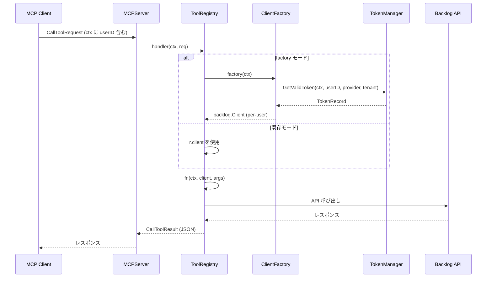

# M11: ToolRegistry Per-User 対応

## 目標

`ToolRegistry` に `ClientFactory` 対応を追加し、MCP ツール呼び出し時にリクエストの
`context.Context` からユーザーを特定して per-user の `backlog.Client` を動的に生成できるようにする。

## 設計決定

| # | 決定 | 理由 |
|---|------|------|
| 1 | `factory` フィールドは匿名関数型 `func(ctx context.Context) (backlog.Client, error)` | `mcp` パッケージから `auth` パッケージへの依存を回避。`auth.ClientFactory` と代入互換 |
| 2 | `NewToolRegistryWithFactory` を追加（既存 `NewToolRegistry` は変更なし） | 後方互換性の維持 |
| 3 | `Register` 内で `r.factory != nil` をチェックし分岐 | factory モードと既存モードを同一メソッドで処理 |
| 4 | factory エラーは `gomcp.NewToolResultError` で返却 | MCP プロトコルに準拠したエラー返却 |
| 5 | `ToolFunc` シグネチャは変更しない | 既存の全ツール実装への影響をゼロに |

## ToolRegistry 構造体変更

```go
type ToolRegistry struct {
    server  *mcpserver.MCPServer
    client  backlog.Client
    factory func(ctx context.Context) (backlog.Client, error)  // 追加
}
```

## API

```go
// 既存（変更なし）
func NewToolRegistry(s *mcpserver.MCPServer, client backlog.Client) *ToolRegistry

// 新規追加
func NewToolRegistryWithFactory(s *mcpserver.MCPServer, factory func(ctx context.Context) (backlog.Client, error)) *ToolRegistry
```

## Register メソッドの分岐ロジック

```go
func (r *ToolRegistry) Register(tool gomcp.Tool, fn ToolFunc) {
    r.server.AddTool(tool, func(ctx context.Context, req gomcp.CallToolRequest) (*gomcp.CallToolResult, error) {
        var c backlog.Client
        if r.factory != nil {
            var err error
            c, err = r.factory(ctx)
            if err != nil {
                return gomcp.NewToolResultError(err.Error()), nil
            }
        } else {
            c = r.client
        }
        result, err := fn(ctx, c, req.GetArguments())
        if err != nil {
            return gomcp.NewToolResultError(err.Error()), nil
        }
        jsonBytes, err := json.Marshal(result)
        if err != nil {
            return gomcp.NewToolResultError("failed to marshal result: " + err.Error()), nil
        }
        return gomcp.NewToolResultText(string(jsonBytes)), nil
    })
}
```

## シーケンス図



## TDD 設計

### Red: テストケース

1. **TestNewToolRegistryWithFactory_RegisterAndCall**
   - factory(ctx) が呼ばれ、返された mock client でツールが実行される
   - factory に渡される ctx が tool handler の ctx と同一であること

2. **TestNewToolRegistryWithFactory_FactoryError**
   - factory がエラーを返した場合、`IsError: true` の `CallToolResult` が返る
   - ツール関数 `fn` は呼ばれない

3. **TestNewToolRegistry_BackwardCompat**
   - 既存 `NewToolRegistry` で作成した ToolRegistry が変更なく動作する

### Green: 最小限の実装

- `ToolRegistry` に `factory` フィールド追加
- `NewToolRegistryWithFactory` コンストラクタ追加
- `Register` 内の分岐ロジック追加

### Refactor

- コード整理（必要に応じて）

## リスク評価

| リスク | 影響度 | 対策 |
|--------|--------|------|
| Register の closure 内で factory(ctx) を呼び忘れ | 高 | テストで factory 呼び出しを検証 |
| 既存テスト壊れ | 中 | `go test ./...` で全テスト実行 |
| import cycle | 低 | 匿名関数型を使用して回避済み |
| factory と client 両方 nil | 低 | NewToolRegistry は client 必須、NewToolRegistryWithFactory は factory 必須 |

## 実装ステップ

1. テストファイル追加（Red）
2. `tools.go` 修正（Green）
3. `go test ./internal/mcp/...` 実行
4. `go test ./...` 実行（全体テスト）
5. リファクタリング（必要に応じて）
6. コミット
