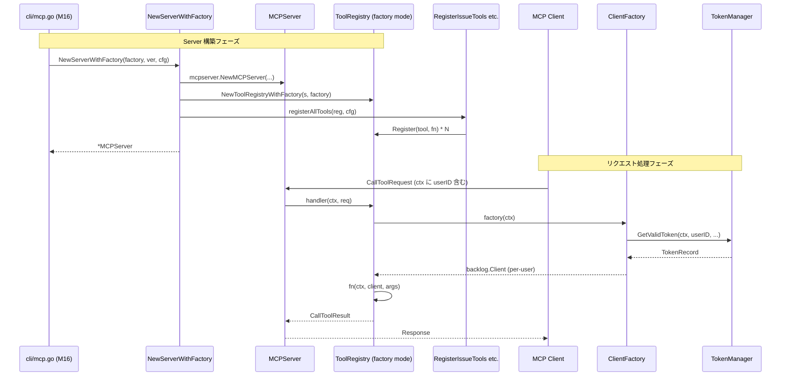

# M12: NewServer Per-User 対応

## 目標

`internal/mcp/server.go` に `NewServerWithFactory(factory auth.ClientFactory, ver string, cfg ServerConfig)` を追加し、
OAuth モードで per-user の `backlog.Client` を動的に生成できる MCP サーバーを構築可能にする。
既存の `NewServer(client backlog.Client, ver string, cfg ServerConfig)` は**変更しない**（後方互換維持）。

## 背景

- M11 で `NewToolRegistryWithFactory(server, factory)` が追加済み。
- M10 で `auth.ClientFactory = func(ctx context.Context) (backlog.Client, error)` が定義済み。
- M16 で `cli/mcp.go` から本関数を使って per-user MCP サーバーを構築する。

## 設計決定

| # | 決定 | 理由 |
|---|------|------|
| 1 | factory の型は `auth.ClientFactory` を**そのまま引数に取らない**（匿名関数型 `func(ctx context.Context) (backlog.Client, error)`） | M11 で `mcp` パッケージから `auth` への import を避けた設計を踏襲。`auth.ClientFactory` は代入互換なので呼び出し側で問題なく渡せる |
| 2 | `NewServerWithFactory` を追加（既存 `NewServer` は変更なし） | 後方互換性の維持（ロードマップ §後方互換性の保証） |
| 3 | 内部実装は `NewToolRegistryWithFactory(server, factory)` を使用 | M11 実装済みの分岐ロジックに委譲、本関数は薄い wrapper |
| 4 | 登録するツール群は `NewServer` と完全に同じ（全 12 カテゴリ） | ツールセットの差異を作らず、OAuth モードでも同一機能を提供 |
| 5 | ツール登録処理は private helper `registerAllTools(reg, cfg)` に抽出して DRY 化 | `NewServer` / `NewServerWithFactory` で同じ 12 行の登録コードを複製しない |
| 6 | factory が nil の場合の扱い | 呼び出し側の責務（呼び出し側で必ず non-nil を渡す契約）。nil チェックは M11 の `Register` 内では不要だが、本関数レベルではガードしない（panic 時の位置が明確） |

## API

```go
// 既存（変更なし）
func NewServer(client backlog.Client, ver string, cfg ServerConfig) *mcpserver.MCPServer

// 新規追加
func NewServerWithFactory(factory func(ctx context.Context) (backlog.Client, error), ver string, cfg ServerConfig) *mcpserver.MCPServer
```

## 実装イメージ

```go
// NewServer は logvalet MCP サーバーを単一 client で初期化して返す。
func NewServer(client backlog.Client, ver string, cfg ServerConfig) *mcpserver.MCPServer {
    s := mcpserver.NewMCPServer(
        "logvalet",
        ver,
        mcpserver.WithToolCapabilities(true),
    )
    reg := NewToolRegistry(s, client)
    registerAllTools(reg, cfg)
    return s
}

// NewServerWithFactory は per-user ClientFactory を使って logvalet MCP サーバーを初期化して返す。
// MCP ツール呼び出し時にリクエストの context.Context からユーザーを特定し、
// そのユーザーの Backlog OAuth トークンで backlog.Client を生成する。
func NewServerWithFactory(factory func(ctx context.Context) (backlog.Client, error), ver string, cfg ServerConfig) *mcpserver.MCPServer {
    s := mcpserver.NewMCPServer(
        "logvalet",
        ver,
        mcpserver.WithToolCapabilities(true),
    )
    reg := NewToolRegistryWithFactory(s, factory)
    registerAllTools(reg, cfg)
    return s
}

// registerAllTools は MCP サーバーに全ツールを登録する共通ヘルパー。
func registerAllTools(reg *ToolRegistry, cfg ServerConfig) {
    RegisterIssueTools(reg)
    RegisterProjectTools(reg)
    RegisterUserTools(reg)
    RegisterActivityTools(reg)
    RegisterDocumentTools(reg)
    RegisterTeamTools(reg)
    RegisterSpaceTools(reg)
    RegisterMetaTools(reg)
    RegisterSharedFileTools(reg)
    RegisterStarTools(reg)
    RegisterWatchingTools(reg)
    RegisterAnalysisTools(reg, cfg)
}
```

## シーケンス図



## TDD 設計

### Red: テストケース

以下を `internal/mcp/server_test.go` に追加:

1. **TestNewServerWithFactory_ReturnsServer**
   - factory を渡して `NewServerWithFactory(factory, "1.0.0", cfg)` が nil でないサーバーを返す
   - (既存 `TestNewServer_ReturnsServer` と対になる smoke test)

2. **TestNewServerWithFactory_RegistersAllTools**
   - `NewServerWithFactory` で作成したサーバーに 42 ツールが登録されていること
   - (既存 `TestNewServer_RegistersAllTools` と同じツール数を期待)

3. **TestNewServerWithFactory_FactoryCalledOnToolInvocation**
   - mock factory を渡し、ツール呼び出し時に factory が呼ばれることを検証
   - factory が返した mock client の `GetIssue` が呼ばれて期待値が返ること
   - **ctx 伝播検証**: `context.WithValue` で sentinel 値を持った ctx を渡し、factory closure 内で同じ sentinel が取り出せることを確認（M11-1 と同じ検証を server レイヤーで行う）
   - ツール例: `logvalet_issue_get`

4. **TestNewServerWithFactory_FactoryError**
   - factory がエラーを返す mock を渡す
   - ツール呼び出しで `IsError: true` の `CallToolResult` が返ることを検証

5. **TestNewServer_BackwardCompat**（既存テストで十分、追加不要）
   - 既存の `TestNewServer_ReturnsServer`, `TestNewServer_VersionPassedThrough`, `TestNewServer_RegistersAllTools` がそのまま通ることが後方互換の証明

### Green: 最小限の実装

- `internal/mcp/server.go` に `NewServerWithFactory` を追加
- `registerAllTools(reg, cfg)` private helper を追加し、`NewServer` の登録処理もこれに委譲
- 既存 `NewServer` の API シグネチャは一切変更しない

### Refactor

- ツール登録ロジックを `registerAllTools` に抽出済みのため、追加のリファクタリングは不要
- コメント（doc comment）を整備

## 対象ファイル

| ファイル | 種別 | 変更内容 |
|---------|------|---------|
| `internal/mcp/server.go` | 修正 | `NewServerWithFactory` 追加、`registerAllTools` 抽出 |
| `internal/mcp/server_test.go` | 修正 | M12 テスト 4 つ追加 |

## リスク評価

| リスク | 影響度 | 対策 |
|--------|--------|------|
| 既存 `NewServer` の挙動が変わる | 高 | 既存テスト (`TestNewServer_ReturnsServer`, `TestNewServer_VersionPassedThrough`, `TestNewServer_RegistersAllTools`) がそのまま通ることを確認。`registerAllTools` 抽出で同じ登録順序を保つ |
| ツール登録漏れ | 中 | `registerAllTools` を両方から呼ぶため、差異が発生しない。ツール数 42 を検証 |
| import cycle (mcp → auth) | 低 | 匿名関数型を使用して回避済み（M11 と同じ方針） |
| factory nil でパニック | 低 | 呼び出し側の契約として non-nil を要求。テストで nil を渡さない。M16 でも分岐条件で必ず non-nil を渡す |
| テスト重複 | 低 | M11 のテストと重複する部分があるが、API レベル (server) での統合検証のために必要 |

## 実装ステップ

1. **Red**: `internal/mcp/server_test.go` に 4 つの M12 テストを追加 → `go test ./internal/mcp/...` で fail 確認
2. **Green**: `internal/mcp/server.go` に `NewServerWithFactory` と `registerAllTools` を追加 → `go test ./internal/mcp/...` で全 green
3. `go test ./...` で全プロジェクトテスト実行
4. `go vet ./...` で lint 確認
5. **Refactor**: 必要に応じてコメント整理（機能変更なし）
6. ロードマップの M12 チェックボックスを `[x]` に更新、Current Focus を M14 に更新
7. コミット: `feat(mcp): NewServerWithFactory を追加し Per-User クライアント対応 (M12)` + Plan フッター

## 後方互換性の確認方法

- `TestNewServer_ReturnsServer`: 既存の `NewServer(mock, "1.0.0", cfg)` 呼び出しが通る
- `TestNewServer_VersionPassedThrough`: 既存のバージョン文字列処理が通る
- `TestNewServer_RegistersAllTools`: 42 ツール登録が維持される
- `TestIssueGetHandler`, `TestProjectGetHandler`, その他ツールハンドラテスト: 既存 client ベースのフローが変わらない
- `TestNewToolRegistry_BackwardCompat` (M11): `ToolRegistry` 自体の後方互換も維持

## M14 への引き継ぎ情報

- `NewServerWithFactory(factory, ver, cfg)` が利用可能
- factory は `auth.NewClientFactory(tm, provider, tenant, baseURL)` で生成したものを渡す
- M16 での使用例:
  ```go
  if c.Auth && oauthCfg != nil {
      factory := auth.NewClientFactory(tm, "backlog", oauthCfg.Space, baseURL)
      s := mcpinternal.NewServerWithFactory(factory, ver, cfg)
  } else {
      s := mcpinternal.NewServer(rc.Client, ver, cfg)
  }
  ```
- OAuth HTTP ハンドラー（M14/M15）は MCP サーバーとは独立。mux レベルで OAuth ハンドラーと MCP サーバーを同居させる（M16 の責務）
