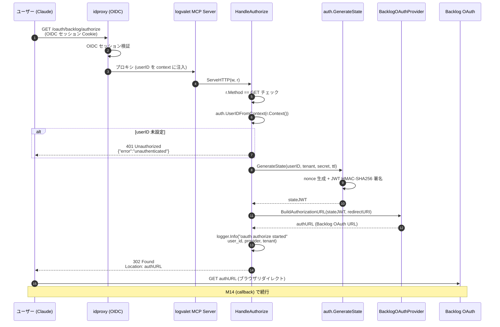

# M13: OAuth HTTP ハンドラー（認可開始） — 詳細計画

## 概要

remote MCP サーバー経由で Backlog OAuth の認可フローを開始するための HTTP ハンドラー `HandleAuthorize` を実装する。
`/oauth/backlog/authorize` に GET されたら、

1. idproxy から注入された userID を context から取得
2. signed state JWT (M04) を生成
3. BacklogOAuthProvider.BuildAuthorizationURL で Backlog OAuth URL を構築
4. 302 Redirect で Backlog の認可画面にリダイレクト

M16 で MCP サーバーに組み込むための純粋な `http.Handler` として実装する（ルーティング統合は M16）。

## スペック参照

- `docs/specs/logvalet_backlog_oauth_coding_agent_prompt.md`
  - §「Backlog Provider 実装要件 - 2. state 管理」
  - §「ユーザーフロー - 初回」
  - §「observability 要件」
- `plans/backlog-oauth-roadmap.md` M13 セクション

## 前提（前マイルストーンからのハンドオフ）

| マイルストーン | 提供物 | 使用箇所 |
|-------------|--------|---------|
| M01 | センチネルエラー `ErrUnauthenticated` / `ErrInvalidTenant` | 401/400 への変換 |
| M03 | `OAuthEnvConfig` (BacklogRedirectURL, OAuthStateSecret hex) | ハンドラー構築時に注入 |
| M04 | `GenerateState(userID, tenant, secret, ttl)` / `DefaultStateTTL` | state JWT 生成 |
| M05 | `provider.OAuthProvider` / `BacklogOAuthProvider` | `BuildAuthorizationURL` 呼び出し |
| M10 | `auth.UserIDFromContext(ctx)` | context から userID 取得 |

## 対象ファイル

| ファイル | 内容 |
|---------|------|
| `internal/transport/http/oauth_handler.go` | `OAuthHandler` struct と `HandleAuthorize` メソッド |
| `internal/transport/http/oauth_handler_test.go` | HandleAuthorize のテスト（`httptest.NewRecorder`） |
| `internal/transport/http/doc.go` | パッケージ概要 godoc |

## 設計

### パッケージ配置方針

- パッケージ名: `http`（`internal/transport/http/` 配下）
- import alias: ユーザー側は `httptransport "github.com/youyo/logvalet/internal/transport/http"` でインポートすることを推奨（標準ライブラリ `net/http` との衝突を避けるため）
- M13 段階ではハンドラーのみ定義し、ルーティング統合は M16 で実施

### OAuthHandler struct

```go
// OAuthHandler は Backlog OAuth フロー用の HTTP ハンドラーを提供する。
// ハンドラーは MCP サーバーに組み込まれる想定で、ルーティングは M16 で行う。
type OAuthHandler struct {
    provider    provider.OAuthProvider // Backlog 等の OAuth プロバイダー
    tenant      string                 // プロバイダー固有のテナント識別子
    redirectURI string                 // OAuth コールバック URI
    stateSecret []byte                 // JWT 署名鍵（hex デコード済み）
    stateTTL    time.Duration          // state JWT の TTL
    logger      *slog.Logger           // 構造化ログ（nil なら slog.Default()）
}
```

### tenant の規約（重要）

`OAuthHandler.tenant` は `BacklogOAuthProvider.space` と**同一値**でなければならない（例: `"example-space"`）。
理由:
- M05 の `BacklogOAuthProvider.ExchangeCode` は `TokenRecord.Tenant = p.space` で保存する
- M14 の callback ハンドラーで「state claims の tenant」と「TokenRecord.Tenant」を比較する
- 両者が異なると M14 での整合性検証が失敗する

**規約**: `tenant` はフルホスト名（`example.backlog.com`）ではなく、Backlog のスペース名（`example`）を使用する。
M16 での統合時は `OAuthEnvConfig` から派生させる（M16 で詳細化）。

**設計判断**:
- `provider.OAuthProvider` interface を受け取る（`BacklogOAuthProvider` 限定にしない）ことで将来の拡張性を確保
- `tenant` は `OAuthHandler` 初期化時に固定（ハンドラーインスタンスごとに1つの Backlog スペース）。複数 tenant 対応は将来検討
- `stateSecret` は hex デコード後の `[]byte` として受け取る（OAuthEnvConfig 側で hex デコードは済ませない設計も可だが、ハンドラーは鍵をバイト列で受け取る方がテストが楽）
- `stateTTL` は `auth.DefaultStateTTL` (10分) をデフォルトとする。ただし NewOAuthHandler では必須引数として受け取る（caller が明示選択）
- `logger` は nil 許容（内部で `slog.Default()` フォールバック）

### コンストラクタ

```go
// NewOAuthHandler は OAuthHandler を構築する。
//
// provider が nil なら panic。tenant が空なら auth.ErrInvalidTenant を返す。
// redirectURI が空なら ErrInvalidRedirectURI を返す。
// stateSecret が nil または空なら auth.ErrStateInvalid を返す。
// stateTTL が 0 以下なら auth.ErrStateInvalid を返す。
// logger が nil なら slog.Default() を使用する。
func NewOAuthHandler(
    provider provider.OAuthProvider,
    tenant, redirectURI string,
    stateSecret []byte,
    stateTTL time.Duration,
    logger *slog.Logger,
) (*OAuthHandler, error)
```

**バリデーション方針**:
- `provider == nil` は programming error なので `panic`（nil dereference を早期に検出）
- その他は呼び出し側のミスである可能性があるため `error` を返す

### ErrInvalidRedirectURI の追加

`internal/auth/errors.go` に新規追加:

```go
// ErrInvalidRedirectURI は OAuth リダイレクト URI が無効な場合に返される。
ErrInvalidRedirectURI = errors.New("auth: invalid or missing redirect URI")
```

### HandleAuthorize メソッド

```go
// HandleAuthorize は /oauth/backlog/authorize の GET ハンドラーを提供する。
// context から userID を取得し、signed state を生成して Backlog OAuth URL にリダイレクトする。
func (h *OAuthHandler) HandleAuthorize(w http.ResponseWriter, r *http.Request)
```

**処理フロー**:

1. **メソッドチェック**: `r.Method != http.MethodGet` なら 405 Method Not Allowed
2. **userID 取得**: `auth.UserIDFromContext(r.Context())` → なければ 401 Unauthorized（JSON エラーボディ）
3. **state 生成**: `auth.GenerateState(userID, h.tenant, h.stateSecret, h.stateTTL)`
   - 失敗時は 500 Internal Server Error（エラー詳細はログのみ、レスポンスは汎用メッセージ）
4. **URL 構築**: `h.provider.BuildAuthorizationURL(state, h.redirectURI)`
   - 失敗時は 500 Internal Server Error
5. **ログ出力**: `logger.InfoContext(ctx, "oauth authorize started", slog.String("user_id", userID), slog.String("provider", h.provider.Name()), slog.String("tenant", h.tenant))`
6. **302 Redirect**: `http.Redirect(w, r, authURL, http.StatusFound)`

### エラーレスポンスフォーマット

統一 JSON 形式（spec §9 とも整合）:

```json
{
  "error": "unauthenticated",
  "message": "user ID is required to start OAuth flow"
}
```

内部ヘルパー `writeJSONError(w, status, code, message)` を定義:

```go
type errorResponse struct {
    Error   string `json:"error"`
    Message string `json:"message"`
}

func writeJSONError(w http.ResponseWriter, status int, code, message string) {
    w.Header().Set("Content-Type", "application/json; charset=utf-8")
    w.WriteHeader(status)
    _ = json.NewEncoder(w).Encode(errorResponse{Error: code, Message: message})
}
```

### エラーコードマッピング

| 状況 | HTTP ステータス | error code |
|------|--------------|-----------|
| userID 未設定 | 401 | `unauthenticated` |
| メソッド違反 | 405 | `method_not_allowed` |
| state 生成失敗 | 500 | `internal_error` |
| URL 構築失敗 | 500 | `internal_error` |

### Observability

- **成功**: `logger.InfoContext(ctx, "oauth authorize started", slog.String("user_id", userID), slog.String("provider", providerName), slog.String("tenant", tenant))`
- **失敗**: `logger.ErrorContext(ctx, "oauth authorize failed", slog.String("reason", reason), slog.String("err", err.Error()))`
- **禁止**: state JWT の生値、stateSecret、access_token 等をログに出力しないこと（M01 マスキング遵守）

## TDD 計画

### Phase 1: Red（失敗するテストを先に書く）

テストは `httptest.NewRecorder()` + `httptest.NewRequest()` で純粋にハンドラーをテストする。
`provider.OAuthProvider` はモック実装（`fakeProvider`）で差し替える。

#### テストケース一覧

| # | テスト名 | 期待結果 |
|---|---------|---------|
| 1 | `TestNewOAuthHandler_NilProvider_Panics` | provider=nil で panic |
| 2 | `TestNewOAuthHandler_EmptyTenant` | tenant="" で `auth.ErrInvalidTenant` |
| 3 | `TestNewOAuthHandler_EmptyRedirectURI` | redirectURI="" で `auth.ErrInvalidRedirectURI` |
| 4 | `TestNewOAuthHandler_NilStateSecret` | stateSecret=nil で `auth.ErrStateInvalid` |
| 5 | `TestNewOAuthHandler_EmptyStateSecret` | stateSecret=[]byte{} で `auth.ErrStateInvalid` |
| 6 | `TestNewOAuthHandler_ZeroTTL` | stateTTL=0 で `auth.ErrStateInvalid` |
| 7 | `TestNewOAuthHandler_NegativeTTL` | stateTTL<0 で `auth.ErrStateInvalid` |
| 8 | `TestNewOAuthHandler_NilLogger_UsesDefault` | logger=nil でも構築成功（default logger 使用） |
| 9 | `TestNewOAuthHandler_Valid` | 正常系で OAuthHandler を返す |
| 10 | `TestHandleAuthorize_MethodNotAllowed` | POST / PUT / DELETE で 405 + JSON error body |
| 11 | `TestHandleAuthorize_Unauthenticated` | userID 未設定 context で 401 + `unauthenticated` code |
| 12 | `TestHandleAuthorize_Redirects` | 正常系で 302、Location ヘッダが Backlog OAuth URL |
| 13 | `TestHandleAuthorize_StateInURL` | Location の state クエリパラメータが有効な JWT（ValidateState 成功） |
| 14 | `TestHandleAuthorize_StateClaimsMatch` | 復号した StateClaims の UserID/Tenant がリクエストと一致 |
| 15 | `TestHandleAuthorize_ProviderError` | provider.BuildAuthorizationURL がエラーを返す場合 500 |
| 16 | `TestHandleAuthorize_Nonce_Unique` | 2回連続呼び出しで state に含まれる nonce が異なる |
| 17 | `TestHandleAuthorize_LogsSuccess` | `slog.New(testHandler)` でキャプチャし、success ログに user_id/provider/tenant が含まれる |
| 18 | `TestHandleAuthorize_DoesNotLogSecret` | success/error ログに state JWT 生値・secret が含まれないこと |

#### fakeProvider の設計

```go
type fakeProvider struct {
    name    string
    buildFn func(state, redirectURI string) (string, error)
}

func (f *fakeProvider) Name() string { return f.name }
func (f *fakeProvider) BuildAuthorizationURL(state, redirectURI string) (string, error) {
    if f.buildFn != nil {
        return f.buildFn(state, redirectURI)
    }
    return "https://example.backlog.com/OAuth2AccessRequest.action?client_id=test&state=" + state + "&redirect_uri=" + redirectURI, nil
}
// ExchangeCode / RefreshToken / GetCurrentUser は M13 では未使用だが interface 満たすため空実装
func (f *fakeProvider) ExchangeCode(ctx context.Context, code, redirectURI string) (*auth.TokenRecord, error) { return nil, errors.New("not implemented") }
func (f *fakeProvider) RefreshToken(ctx context.Context, refreshToken string) (*auth.TokenRecord, error) { return nil, errors.New("not implemented") }
func (f *fakeProvider) GetCurrentUser(ctx context.Context, accessToken string) (*auth.ProviderUser, error) { return nil, errors.New("not implemented") }
```

#### ログキャプチャ

`slog.NewJSONHandler(buf, nil)` で新規 logger を作成し、buf の内容を `json.Decoder` で読んで検証。
個別フィールド (`user_id`, `provider`, `tenant`) の存在と値を assert する。

### Phase 2: Green（テストを通す最小限の実装）

1. `internal/auth/errors.go` に `ErrInvalidRedirectURI` 追加
2. `internal/transport/http/doc.go` 作成（パッケージ godoc のみ）
3. `internal/transport/http/oauth_handler.go` を実装
4. `go test ./...` で全テスト PASS 確認

### Phase 3: Refactor（テストが通る状態でコード整理）

- エラーレスポンス生成を `writeJSONError` ヘルパーに集約
- 成功ログのフィールド生成を `logAuthorizeStarted` ヘルパーに抽出（必要なら）
- godoc コメントの充実
- `errorResponse` 構造体のタグ命名確認（snake_case）

## シーケンス図



## 実装ステップ

1. `internal/auth/errors.go` に `ErrInvalidRedirectURI` を追加（1行、既存パターンに沿って）
2. `internal/transport/http/` ディレクトリを作成
3. `internal/transport/http/doc.go` を作成（パッケージ godoc）
4. `internal/transport/http/oauth_handler_test.go` を作成（全 19 テストケースを Red で記述）
5. `go test ./internal/transport/http/...` で Red 確認（コンパイルエラーのはず）
6. `internal/transport/http/oauth_handler.go` を実装（Green）
7. `go test ./internal/transport/http/...` で全テスト PASS 確認
8. Refactor: `writeJSONError` ヘルパー抽出、godoc 充実
9. `go test ./...` で全体テスト PASS 確認
10. `go vet ./...` で lint チェック
11. roadmap の M13 チェックボックスを `[x]` に更新、Current Focus を M12 に進める
12. git add + git commit（日本語、Conventional Commits、Plan: フッター）

## リスク評価

| リスク | 影響度 | 対策 |
|-------|-------|------|
| `net/http` パッケージ名衝突 | 中 | パッケージ名を `http` のままにし、caller 側で `httptransport` alias 推奨と godoc で明記 |
| state JWT 生値のログ漏洩 | 高 | logger には stateJWT / secret を渡さないテスト (`TestHandleAuthorize_DoesNotLogSecret`) を追加 |
| userID を state だけでなくクエリに漏らす | 中 | `Location` ヘッダ検証テストで user_id クエリがないことを確認（負のテスト） |
| open redirect | 中 | redirectURI は起動時注入のため、リクエストから取得しない設計（open redirect の余地なし） |
| BuildAuthorizationURL のエラー未ハンドル | 低 | テストで `buildFn` がエラーを返すケースを追加 |
| Method チェック忘れ | 低 | 非 GET で 405 を返すテスト追加 |
| nonce が毎回同じ | 低 | `TestHandleAuthorize_Nonce_Unique` で 2 回呼び出し検証 |
| PanicOnNilProvider のテスト書きづらさ | 低 | `require.Panics` で簡潔に |
| ログが stdout に漏れテストを汚染する | 低 | テストで `slog.New(slog.NewJSONHandler(buf, nil))` を注入 |

## セキュリティ考慮

1. **state JWT 必須**: 認可 URL に必ず state を含める（M04 の署名付き state）
2. **TTL 短期**: `auth.DefaultStateTTL` (10分) を使用
3. **userID 必須**: context に userID がなければ即 401（共有 token フォールバック禁止）
4. **Open Redirect 防止**: `redirectURI` は起動時注入であり、リクエストから取得しない
5. **secret/token ログ禁止**: ログには `user_id` / `provider` / `tenant` のみ出力
6. **HTTP メソッド固定**: GET 以外を拒否（405）してサイドエフェクト防止
7. **Method 判定は M16 のルーター側でも可能だが、ハンドラー単体の堅牢性を確保するため二重防御**

## 既存コードへの影響

- `internal/credentials/` — **変更なし**
- `internal/auth/*.go` — `errors.go` に `ErrInvalidRedirectURI` を追加するのみ（既存エラーは変更なし）
- `internal/auth/provider/backlog.go` — **変更なし**（BuildAuthorizationURL を呼び出すだけ）
- `internal/mcp/*.go` — **変更なし**（ルーティング統合は M16）
- `internal/cli/*.go` — **変更なし**
- CLI コマンド全般 — **変更なし**

## 完了条件

- [ ] `internal/transport/http/oauth_handler.go` 実装完了
- [ ] `internal/transport/http/oauth_handler_test.go` 全テスト PASS
- [ ] `internal/auth/errors.go` に `ErrInvalidRedirectURI` 追加
- [ ] `go test ./...` 全体 PASS
- [ ] `go vet ./...` エラーなし
- [ ] `plans/backlog-oauth-roadmap.md` の M13 チェックボックス更新・Current Focus 変更
- [ ] コミット完了（Conventional Commits + Plan: フッター）

## コミット

```
feat(transport): OAuth 認可開始ハンドラー HandleAuthorize を実装 (M13)

Plan: plans/backlog-oauth-m13-authorize-handler.md
```
