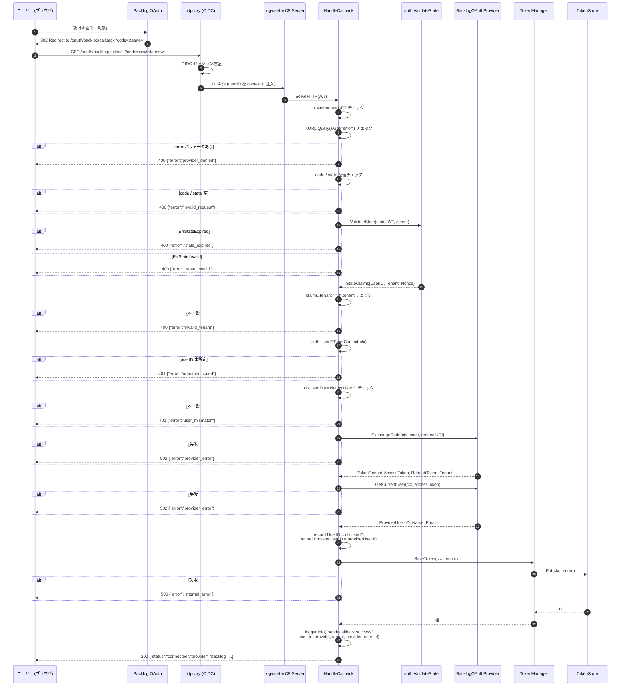

# M14: OAuth HTTP ハンドラー（コールバック） — 詳細計画

## 概要

Backlog OAuth の認可画面での同意完了後、Backlog から `/oauth/backlog/callback?code=...&state=...` へリダイレクトされる。
このコールバックを受け取って、

1. HTTP メソッドが GET であることを確認
2. `error` クエリ（ユーザー拒否など）を優先的にハンドリング
3. `code` / `state` の空値チェック
4. `auth.ValidateState` で JWT state を検証（期限切れ vs 改竄を区別）
5. state claims の Tenant が handler の tenant と一致することを検証
6. context から userID を取得し、state claims の UserID と一致することを検証
7. `provider.ExchangeCode` で code を TokenRecord に交換
8. `provider.GetCurrentUser` でアクセストークンの所有者情報を取得
9. `TokenRecord` の identity fields (UserID / ProviderUserID) を補完
10. `TokenManager.SaveToken` で永続化
11. 200 OK + JSON で `{"status":"connected", "provider_user_id":"...", "provider_user_name":"...", "tenant":"..."}` を返す

M16 で MCP サーバーに統合する純粋な `http.Handler` として、`OAuthHandler` struct にメソッドを追加する形で実装する。

## スペック参照

- `docs/specs/logvalet_backlog_oauth_coding_agent_prompt.md`
  - §「期待する実装成果物 - 1. Backlog OAuth Connector 層」(callback 処理)
  - §「Backlog Provider 実装要件 - 2. state 管理」(検証必須)
  - §「Backlog Provider 実装要件 - 4. トークンの所有者検証」(GetCurrentUser)
  - §「ユーザーフロー - 初回」
  - §「observability 要件」
  - §「セキュリティ要件」
- `plans/backlog-oauth-roadmap.md` M14 セクション
- `plans/backlog-oauth-m13-authorize-handler.md` (OAuthHandler struct、writeJSONError パターン)

## 前提（前マイルストーンからのハンドオフ）

| マイルストーン | 提供物 | 使用箇所 |
|-------------|--------|---------|
| M01 | `ErrUnauthenticated`, `ErrInvalidTenant`, `ErrTokenExpired`, `ErrProviderUserMismatch` | HTTP ステータスへの変換 |
| M03 | `OAuthEnvConfig.OAuthStateSecret` | ハンドラー構築時に注入（変更なし） |
| M04 | `auth.ValidateState`, `ErrStateExpired`, `ErrStateInvalid`, `StateClaims` | state JWT 検証 |
| M05 | `provider.OAuthProvider.ExchangeCode`, `GetCurrentUser` | code → token, token → user |
| M06 | `auth.TokenManager.SaveToken` | 永続化 |
| M10 | `auth.UserIDFromContext(ctx)` | context から userID 取得 |
| M13 | `OAuthHandler` struct, `writeJSONError` ヘルパー, `errorResponse`, 既存 `errCode*` 定数 | 共通基盤を拡張 |

## 対象ファイル

| ファイル | 変更内容 |
|---------|---------|
| `internal/transport/http/oauth_handler.go` | `OAuthHandler` struct に `tokenManager` フィールド追加 + `HandleCallback` メソッド追加 + 新規 `errCode*` 定数 + ヘルパー |
| `internal/transport/http/oauth_handler_test.go` | 既存 `newTestHandler` ヘルパー更新（tokenManager 引数追加）+ 既存 M13 テスト更新 + `HandleCallback` テスト群 + `fakeProvider` に `exchangeFn`/`userFn` 追加 + fake TokenManager 追加 |
| `plans/backlog-oauth-roadmap.md` | M14 を `[x]` に、Current Focus を M15 に更新 |

**新規ファイルは作成しない**（既存 oauth_handler.go に追記）。

## 設計判断

### 判断1: tokenManager は必須引数（nil 不許容）

`NewOAuthHandler` のシグネチャを拡張する。`tokenManager == nil` なら `panic`。

**理由**:
- M14 以降、authorize / callback / status / disconnect の全ハンドラーで TokenManager を使用する
- M13 のみ TokenManager 不要だが、同じ `OAuthHandler` struct を共有するため fallback 設計より明示必須の方が安全
- M13 の既存テストは同じコミット内で dummy TokenManager を注入するように更新する

### 判断2: `error` クエリを最優先処理

Backlog が `?error=access_denied&error_description=...` を返すケースを、code/state バリデーションより前に判定する。

**理由**:
- ユーザーが同意画面で「拒否」した場合、`code` は空で `error=access_denied` のみが返る
- spec §「エラー設計」で provider API エラーを区別する要件がある

**error code マッピング**:
- 値を `provider_denied` とし、HTTP 400 を返す

### 判断3: state.Tenant vs h.tenant 検証必須

state claims の `Tenant` が handler の `tenant` と一致しない場合は `auth.ErrInvalidTenant` → 400 を返す。

**理由**:
- 複数 tenant（Backlog スペース）が将来運用された際のクロステナント攻撃を事前に防御
- 現状は 1 tenant 固定だが、定数化せず検証ロジックを入れておく方が堅牢

### 判断4: ctx userID vs state.UserID 検証必須

context から取得した `ctxUserID` と state claims の `UserID` が一致しない場合は `auth.ErrProviderUserMismatch` → 401 を返す。

**理由**:
- セッションハイジャック対策: idproxy が認可開始時と callback 時で同じ userID を注入することを前提とし、両者一致を明示検証
- spec §「セキュリティ要件 - 4. 他ユーザー token の参照ができない key 設計」と整合

### 判断5: 成功レスポンスは JSON 200

HTML ページや 302 リダイレクトではなく、`application/json` で 200 OK を返す。

**JSON 形式**:
```json
{
  "status": "connected",
  "provider": "backlog",
  "tenant": "example-space",
  "provider_user_id": "12345",
  "provider_user_name": "Taro Yamada"
}
```

**理由**:
- M15 の /status ハンドラーとレスポンス形式を揃える
- PoC では HTML リソースを管理しない方がシンプル
- 将来のリダイレクト先対応は M15+ で改めて検討

### 判断6: provider_user_id の永続化は state.UserID + current user の両方を保持

- `TokenRecord.UserID = state.UserID`（= ctxUserID、idproxy の app user）
- `TokenRecord.ProviderUserID = providerUser.ID`（= Backlog ユーザー ID）

**理由**:
- TokenStore のキー設計 `(userID, provider, tenant)` は app 側 userID を使う
- `ProviderUserID` は「誰の Backlog 接続か」の可視化用（spec §「トークンの所有者検証 - 保存推奨項目」）

## OAuthHandler struct 拡張

```go
type OAuthHandler struct {
    provider     provider.OAuthProvider
    tokenManager auth.TokenManager // ★ M14 で追加
    tenant       string
    redirectURI  string
    stateSecret  []byte
    stateTTL     time.Duration
    logger       *slog.Logger
}
```

### コンストラクタ変更

```go
// NewOAuthHandler は OAuthHandler を構築する。
//
// provider が nil の場合は panic する（programming error として早期検出）。
// tokenManager が nil の場合は panic する（programming error として早期検出）。
// tenant が空の場合は auth.ErrInvalidTenant を返す。
// redirectURI が空の場合は auth.ErrInvalidRedirectURI を返す。
// stateSecret が nil または空の場合は auth.ErrStateInvalid を返す。
// stateTTL が 0 以下の場合は auth.ErrStateInvalid を返す。
// logger が nil の場合は slog.Default() を使用する。
func NewOAuthHandler(
    p provider.OAuthProvider,
    tm auth.TokenManager, // ★ 新規
    tenant, redirectURI string,
    stateSecret []byte,
    stateTTL time.Duration,
    logger *slog.Logger,
) (*OAuthHandler, error)
```

**判断**:
- `tokenManager == nil` は programming error として早期に panic（provider と同じ扱い）
- 引数順: `p, tm, tenant, redirectURI, stateSecret, stateTTL, logger` — provider の直後に tm を配置（関連度順）

## エラーコード定数追加

```go
const (
    // 既存 (M13)
    errCodeUnauthenticated   = "unauthenticated"
    errCodeMethodNotAllowed  = "method_not_allowed"
    errCodeInternalError     = "internal_error"
    errMsgUnauthenticated    = "user ID is required to start OAuth flow"
    errMsgMethodNotAllowed   = "only GET is allowed"
    errMsgInternalError      = "failed to start OAuth flow"

    // 新規 (M14)
    errCodeInvalidRequest  = "invalid_request"
    errCodeStateExpired    = "state_expired"
    errCodeStateInvalid    = "state_invalid"
    errCodeProviderDenied  = "provider_denied"
    errCodeProviderError   = "provider_error"
    errCodeInvalidTenant   = "invalid_tenant"
    errCodeUserMismatch    = "user_mismatch"

    errMsgMissingCode      = "authorization code is required"
    errMsgMissingState     = "state token is required"
    errMsgStateExpired     = "state token expired"
    errMsgStateInvalid     = "state token invalid"
    errMsgInvalidTenant    = "state tenant does not match"
    errMsgUserMismatch     = "session user does not match state user"
    errMsgExchangeFailed   = "failed to exchange authorization code"
    errMsgUserFetchFailed  = "failed to fetch current user"
    errMsgSaveFailed       = "failed to save token"
    errMsgCallbackInternal = "failed to complete OAuth callback"
)
```

**注意**: `errMsgMethodNotAllowed` は既存値 `"only GET is allowed"` を再利用（callback も GET のみ）。

## HandleCallback メソッド

```go
// HandleCallback は /oauth/backlog/callback の GET ハンドラー。
//
// 処理フロー:
//  1. HTTP メソッドが GET であることを確認（それ以外は 405）
//  2. error クエリを優先判定（値があれば 400 provider_denied）
//  3. code / state の空値チェック（400 invalid_request）
//  4. auth.ValidateState で state JWT 検証
//     - ErrStateExpired → 400 state_expired
//     - ErrStateInvalid → 400 state_invalid
//  5. state claims の Tenant が h.tenant と一致することを検証（400 invalid_tenant）
//  6. context から userID を取得し（未設定なら 401）、state.UserID と一致を検証（401 user_mismatch）
//  7. provider.ExchangeCode で code → TokenRecord（失敗で 502 provider_error）
//  8. provider.GetCurrentUser でユーザー情報取得（失敗で 502 provider_error）
//  9. TokenRecord.UserID, ProviderUserID を補完
// 10. tokenManager.SaveToken で永続化（失敗で 500 internal_error）
// 11. 200 OK + JSON レスポンス
//
// セキュリティ: code / state JWT 生値 / access_token / refresh_token / stateSecret は一切ログに出さない。
// ログに出すのは user_id / provider / tenant / provider_user_id / reason / err.Error() のみ。
func (h *OAuthHandler) HandleCallback(w stdhttp.ResponseWriter, r *stdhttp.Request)
```

### エラーコードマッピング

| 状況 | HTTP ステータス | error code |
|------|----------------|-----------|
| メソッド違反 | 405 | `method_not_allowed` |
| `error` クエリあり | 400 | `provider_denied` |
| `code` クエリ空 | 400 | `invalid_request` |
| `state` クエリ空 | 400 | `invalid_request` |
| ValidateState → `ErrStateExpired` | 400 | `state_expired` |
| ValidateState → `ErrStateInvalid` | 400 | `state_invalid` |
| state.Tenant 不一致 | 400 | `invalid_tenant` |
| ctx userID 未設定 | 401 | `unauthenticated` |
| state.UserID と ctx userID 不一致 | 401 | `user_mismatch` |
| ExchangeCode 失敗 | 502 | `provider_error` |
| GetCurrentUser 失敗 | 502 | `provider_error` |
| SaveToken 失敗 | 500 | `internal_error` |

### 成功レスポンス構造

```go
type callbackSuccessResponse struct {
    Status           string `json:"status"`             // "connected"
    Provider         string `json:"provider"`           // "backlog"
    Tenant           string `json:"tenant"`             // "example-space"
    ProviderUserID   string `json:"provider_user_id"`   // "12345"
    ProviderUserName string `json:"provider_user_name"` // "Taro Yamada"
}

func writeJSONSuccess(w stdhttp.ResponseWriter, status int, body any) {
    w.Header().Set("Content-Type", "application/json; charset=utf-8")
    w.WriteHeader(status)
    _ = json.NewEncoder(w).Encode(body)
}
```

## Observability

### 成功時

```go
h.logger.InfoContext(ctx, "oauth callback success",
    slog.String("user_id", userID),
    slog.String("provider", providerName),
    slog.String("tenant", h.tenant),
    slog.String("provider_user_id", providerUser.ID),
)
```

### 失敗時

```go
h.logger.WarnContext(ctx, "oauth callback rejected",
    slog.String("reason", reason),        // "state_expired" / "invalid_tenant" etc.
    slog.String("user_id", userIDOrEmpty),// 取得済みなら
)
// または provider エラーの場合
h.logger.ErrorContext(ctx, "oauth callback failed",
    slog.String("reason", "exchange_failed"),
    slog.String("err_type", fmt.Sprintf("%T", err)), // err.Error() 生値はログに出さない（token echo 対策）
    slog.String("user_id", userID),
    slog.String("provider", providerName),
)
```

**セキュリティ判断（追加）**:
- `credentials.ExchangeCode` は HTTP レスポンスボディをエラーメッセージに echo する可能性がある（upstream 依存）
- そのボディに `code` / `access_token` 値が含まれる恐れがあるため、**`err.Error()` の生値は構造化ログに出さない**
- 代わりに `err_type`（型名）または短い固定ラベルを出力する
- テスト `TestHandleCallback_ExchangeError_NoLeakInLogs` で漏洩ゼロを保証
- `error_description` クエリも PII リスクがあるため **ログから破棄**（reason のみ記録）

### 禁止事項（M01 マスキング遵守）

**絶対にログに出さない**:
- `code` クエリパラメータ
- `state` JWT 生値
- `access_token`
- `refresh_token`
- `stateSecret`

**出してよい**:
- `user_id` (idproxy の app user ID)
- `provider` (backlog 等)
- `tenant` (Backlog スペース名)
- `provider_user_id` (Backlog ユーザー ID)
- `reason` (内部分岐識別子)
- `err.Error()` (ただし上記禁止値を含まないことが前提)

## TDD 計画

### Phase 1: Red（失敗するテストを先に書く）

#### A. 既存 M13 テストの更新

`newTestHandler` ヘルパーを拡張し、既存 M13 全テストを更新する:

```go
// fakeTokenManager は auth.TokenManager のテスト用モック。
type fakeTokenManager struct {
    saveFn   func(ctx context.Context, record *auth.TokenRecord) error
    getFn    func(ctx context.Context, userID, provider, tenant string) (*auth.TokenRecord, error)
    revokeFn func(ctx context.Context, userID, provider, tenant string) error
}

func (f *fakeTokenManager) GetValidToken(ctx context.Context, userID, provider, tenant string) (*auth.TokenRecord, error) {
    if f.getFn != nil { return f.getFn(ctx, userID, provider, tenant) }
    return nil, nil
}
func (f *fakeTokenManager) SaveToken(ctx context.Context, record *auth.TokenRecord) error {
    if f.saveFn != nil { return f.saveFn(ctx, record) }
    return nil
}
func (f *fakeTokenManager) RevokeToken(ctx context.Context, userID, provider, tenant string) error {
    if f.revokeFn != nil { return f.revokeFn(ctx, userID, provider, tenant) }
    return nil
}
var _ auth.TokenManager = (*fakeTokenManager)(nil)

// newTestHandler のシグネチャを拡張
func newTestHandler(t *testing.T, logger *slog.Logger) *httptransport.OAuthHandler {
    return newTestHandlerWithDeps(t, logger, &fakeProvider{}, &fakeTokenManager{})
}

func newTestHandlerWithDeps(t *testing.T, logger *slog.Logger, p provider.OAuthProvider, tm auth.TokenManager) *httptransport.OAuthHandler {
    t.Helper()
    h, err := httptransport.NewOAuthHandler(p, tm, testTenant, testRedirectURI, testSecret, testTTL, logger)
    if err != nil { t.Fatalf("NewOAuthHandler() error = %v", err) }
    return h
}
```

**M13 既存テストの修正点**:
- `TestNewOAuthHandler_NilProvider_Panics`: 引数位置の更新（`p=nil` を先頭に置く）
- `TestNewOAuthHandler_EmptyTenant` 他バリデーション系: 新引数 `tm` を `&fakeTokenManager{}` で注入
- `TestHandleAuthorize_ProviderError`: `httptransport.NewOAuthHandler(fp, &fakeTokenManager{}, ...)` に更新
- `TestHandleAuthorize_LogsSuccess` 他: 同上

#### B. fakeProvider 拡張

```go
type fakeProvider struct {
    name       string
    buildFn    func(state, redirectURI string) (string, error)
    exchangeFn func(ctx context.Context, code, redirectURI string) (*auth.TokenRecord, error) // ★ 追加
    userFn     func(ctx context.Context, accessToken string) (*auth.ProviderUser, error)      // ★ 追加
}

func (f *fakeProvider) ExchangeCode(ctx context.Context, code, redirectURI string) (*auth.TokenRecord, error) {
    if f.exchangeFn != nil { return f.exchangeFn(ctx, code, redirectURI) }
    return nil, errors.New("not implemented")
}

func (f *fakeProvider) GetCurrentUser(ctx context.Context, accessToken string) (*auth.ProviderUser, error) {
    if f.userFn != nil { return f.userFn(ctx, accessToken) }
    return nil, errors.New("not implemented")
}
```

#### C. 新規テストケース（HandleCallback）

| # | テスト名 | セットアップ | 期待結果 |
|---|---------|------------|---------|
| 1 | `TestNewOAuthHandler_NilTokenManager_Panics` | tm=nil | panic |
| 2 | `TestHandleCallback_MethodNotAllowed` | POST / PUT / DELETE / PATCH | 405 `method_not_allowed` |
| 3 | `TestHandleCallback_ErrorQuery` | `?error=access_denied&error_description=xxx` | 400 `provider_denied` |
| 4 | `TestHandleCallback_MissingCode` | `?state=xxx` (code なし) | 400 `invalid_request` |
| 5 | `TestHandleCallback_MissingState` | `?code=abc` (state なし) | 400 `invalid_request` |
| 6 | `TestHandleCallback_BothMissing` | 空クエリ | 400 `invalid_request` |
| 7 | `TestHandleCallback_InvalidState_Expired` | 期限切れ state (ttl=-1min で GenerateState) | 400 `state_expired` |
| 8 | `TestHandleCallback_InvalidState_Tampered` | 別 secret で署名した state | 400 `state_invalid` |
| 9 | `TestHandleCallback_TenantMismatch` | GenerateState の tenant を handler の tenant と変える | 400 `invalid_tenant` |
| 10 | `TestHandleCallback_Unauthenticated` | ctx に userID なし、valid state | 401 `unauthenticated` |
| 11 | `TestHandleCallback_UserMismatch` | ctx userID != state.UserID | 401 `user_mismatch` |
| 12 | `TestHandleCallback_ExchangeCodeFailure` | exchangeFn がエラー | 502 `provider_error` |
| 13 | `TestHandleCallback_GetCurrentUserFailure` | exchangeFn 成功、userFn がエラー | 502 `provider_error` |
| 14 | `TestHandleCallback_SaveTokenFailure` | saveFn がエラー | 500 `internal_error` |
| 15 | `TestHandleCallback_Success_200JSON` | 全正常系 | 200 JSON `status=connected, provider, tenant, provider_user_id, provider_user_name` |
| 16 | `TestHandleCallback_Success_SavesTokenRecord` | 全正常系 | saveFn の record.UserID / ProviderUserID / Provider / Tenant / AccessToken / RefreshToken を assert |
| 17 | `TestHandleCallback_Success_ContextPropagated` | exchangeFn / userFn / saveFn に渡る ctx が request ctx の派生 | userID が ctx に残ることを assert |
| 18 | `TestHandleCallback_LogsSuccess` | 正常系 + JSONHandler でログキャプチャ | `oauth callback success`, user_id / provider / tenant / provider_user_id |
| 19 | `TestHandleCallback_LogsFailure` | exchangeFn エラー + JSONHandler でログキャプチャ | `oauth callback failed`, reason=exchange_failed, err |
| 20 | `TestHandleCallback_DoesNotLogSensitive` | 全正常系 + ログキャプチャ | ログに `code=test-code`, `state=<JWT>`, `access_token`, `refresh_token`, `stateSecret` が**含まれない** |
| 21 | `TestHandleCallback_ProviderDenied_LogsReason` | error クエリ + error_description クエリ | ログ reason=provider_denied のみ。`error_description` の値はログに含めない（PII リスクのため破棄） |
| 22 | `TestHandleCallback_UserMismatch_DoesNotSave` | ctx userID != state.UserID | saveFn が呼ばれないことを assert（呼ばれたら fail） |
| 23 | `TestHandleCallback_ExchangeError_NoLeakInLogs` | exchangeFn が `errors.New("upstream: code=real-code access_token=leaked")` を返す | ログに `real-code` / `access_token=leaked` 文字列が含まれないこと。`err` 詳細は構造化フィールドに格下げする方針 |
| 24 | `TestHandleCallback_Success_ContentTypeJSON` | 正常系 | レスポンス `Content-Type` が `application/json; charset=utf-8` で始まる |
| 25 | `TestHandleCallback_NilProviderUser_Handled` | userFn が `nil, nil` を返す | 502 `provider_error`（nil 防御） |

#### 正常系のセットアップパターン

```go
func setupCallbackSuccess(t *testing.T) (*httptransport.OAuthHandler, *fakeProvider, *fakeTokenManager, string /*state*/) {
    t.Helper()
    saved := make(chan *auth.TokenRecord, 1)
    tm := &fakeTokenManager{
        saveFn: func(ctx context.Context, rec *auth.TokenRecord) error {
            saved <- rec
            return nil
        },
    }
    fp := &fakeProvider{
        exchangeFn: func(ctx context.Context, code, redirectURI string) (*auth.TokenRecord, error) {
            return &auth.TokenRecord{
                Provider:     "backlog",
                Tenant:       testTenant, // ExchangeCode は provider 側で tenant を設定する
                AccessToken:  "at-xxx",
                RefreshToken: "rt-yyy",
                TokenType:    "Bearer",
                Expiry:       time.Now().Add(time.Hour),
                CreatedAt:    time.Now(),
                UpdatedAt:    time.Now(),
            }, nil
        },
        userFn: func(ctx context.Context, accessToken string) (*auth.ProviderUser, error) {
            return &auth.ProviderUser{ID: "12345", Name: "Taro Yamada", Email: "taro@example.com"}, nil
        },
    }
    h := newTestHandlerWithDeps(t, slog.New(slog.NewJSONHandler(io.Discard, nil)), fp, tm)
    state, err := auth.GenerateState(testUserID, testTenant, testSecret, testTTL)
    if err != nil { t.Fatalf("GenerateState: %v", err) }
    return h, fp, tm, state
}
```

### Phase 2: Green（テストを通す最小限の実装）

1. `internal/transport/http/oauth_handler.go` を編集:
   - `OAuthHandler` struct に `tokenManager auth.TokenManager` フィールド追加
   - `NewOAuthHandler` シグネチャ拡張 + nil check
   - `errCode*` / `errMsg*` 定数追加
   - `HandleCallback` 実装
   - `callbackSuccessResponse` struct + `writeJSONSuccess` ヘルパー追加
2. `internal/transport/http/oauth_handler_test.go` を更新:
   - `fakeTokenManager` 追加
   - `fakeProvider` に `exchangeFn` / `userFn` 追加
   - `newTestHandler` / `newTestHandlerWithDeps` 追加
   - 既存 M13 テスト全てを新 signature に更新
   - 新規テスト 22 件追加
3. `go test ./internal/transport/http/...` で全テスト PASS 確認

### Phase 3: Refactor（テストが通る状態でコード整理）

- エラーレスポンス生成箇所の重複を `writeJSONError` に集約（既存通り）
- 内部分岐用のヘルパー `validateCallbackInputs(r) (code, state string, errCode, errMsg string, httpStatus int)` を検討（ただし関数シグネチャが複雑化するなら不要）
- `logCallbackSuccess(ctx, userID, providerName, tenant, providerUserID)` ヘルパー抽出（可読性向上）
- godoc の充実（HandleCallback の処理フロー・エラーマッピング表）
- `errorResponse` / `callbackSuccessResponse` の JSON タグが snake_case であることを確認

## シーケンス図



## 実装ステップ

1. `plans/backlog-oauth-m14-callback-handler.md` 作成（本ファイル）
2. `internal/transport/http/oauth_handler_test.go` を更新:
   - `fakeTokenManager` 型追加（全 M13 テスト実行前に型解決が必要）
   - `fakeProvider` の `exchangeFn` / `userFn` フィールド追加 + メソッド差し替え
   - `newTestHandler` / `newTestHandlerWithDeps` ヘルパー更新
   - 既存 `TestNewOAuthHandler_*` / `TestHandleAuthorize_*` テストの `NewOAuthHandler` 呼び出しを全て更新
   - 新規テスト 22 件を追加
3. `go test ./internal/transport/http/...` を実行（Red 確認、signature エラーと新規テスト失敗を確認）
4. `internal/transport/http/oauth_handler.go` を更新:
   - `OAuthHandler` struct に `tokenManager` フィールド追加
   - `NewOAuthHandler` シグネチャ拡張 + nil check
   - `errCode*` / `errMsg*` 定数追加
   - `HandleCallback` メソッド実装
   - `callbackSuccessResponse` struct + `writeJSONSuccess` ヘルパー追加
5. `go test ./internal/transport/http/...` で全テスト PASS 確認
6. Refactor: 共通ヘルパー抽出・godoc 充実
7. `go test ./...` で全体テスト PASS 確認
8. `go vet ./...` で lint チェック
9. `plans/backlog-oauth-roadmap.md` の M14 チェックボックスを `[x]` に、Current Focus を M15 に更新
10. `git add` + `git commit`（日本語 Conventional Commits + Plan: フッター）

## リスク評価

| リスク | 影響度 | 対策 |
|-------|-------|------|
| M13 既存テストの破壊 | 高 | 同じコミット内で全テストを更新。Phase 1A で明示的に列挙 |
| `tokenManager=nil` での認可開始モードが塞がる | 中 | 方針決定: nil 禁止（panic）。authorize も tokenManager を注入する |
| `code` や `state` 生値がログ漏洩 | 高 | `TestHandleCallback_DoesNotLogSensitive` を必ず追加。err wrapping 時の注意 |
| `ExchangeCode` エラーが access_token を含んだメッセージを返す | 中 | provider 層の err を `fmt.Errorf("exchange failed: %w", err)` の形でラップし、値そのものを含めない。ログ assert でカバー |
| state claim の Tenant 不一致検知漏れ | 中 | `TestHandleCallback_TenantMismatch` を追加 |
| ctxUserID と state.UserID のクロスチェック漏れ | 高 | `TestHandleCallback_UserMismatch` + `TestHandleCallback_UserMismatch_DoesNotSave` を追加 |
| `error` クエリの処理順序間違い（code チェックに負ける） | 中 | テスト順序: error > code > state > validate の順に分岐順序を固定 |
| HTTP メソッドチェック忘れ | 低 | `TestHandleCallback_MethodNotAllowed` を追加 |
| 成功レスポンスの JSON タグが camelCase になる | 低 | `snake_case` を明示、タグ確認テスト可 |
| TokenRecord の Expiry / CreatedAt / UpdatedAt が provider 設定と manager 補完で整合しない | 中 | provider が設定した値をそのまま保存（manager 層を通さない M14 の範囲では保持） |
| SaveToken 後に provider_user_id を可視化できない | 低 | レスポンス JSON に含める (`provider_user_id`) |

## セキュリティ考慮

1. **state 検証必須**: 署名・期限を JWT HMAC-SHA256 で検証（M04 遵守）
2. **Tenant クロスチェック**: state.Tenant と h.tenant を照合
3. **UserID クロスチェック**: ctxUserID と state.UserID を照合
4. **トークン生値ログ禁止**: `access_token` / `refresh_token` / `code` / `state JWT` / `stateSecret`
5. **プロバイダーエラーの露出制限**: `err.Error()` を返すが、token 値がラップされていないか provider 実装で保証済みか再確認（M05 は form 値のみラップ）
6. **HTTP メソッド固定**: GET 以外を拒否（405）
7. **共有トークンへのフォールバック禁止**: ユーザー不一致なら即 401、Save は実行しない
8. **state 再利用防止**: 現時点では nonce を store しないため state は theoretical に再利用可能。ただし TTL=10分 + HMAC 署名で実用十分。将来 replay 検知する場合は M15/M17 で検討

## 既存コードへの影響

| ファイル | 変更の有無 | 内容 |
|---------|---------|------|
| `internal/transport/http/oauth_handler.go` | **変更あり** | struct フィールド追加 + コンストラクタ拡張 + HandleCallback 追加 |
| `internal/transport/http/oauth_handler_test.go` | **変更あり** | 既存テストの NewOAuthHandler 呼び出しを更新 + 新規テスト追加 |
| `internal/auth/errors.go` | **変更なし** | M13 で追加した `ErrInvalidRedirectURI` 他、M01 の sentinel を流用 |
| `internal/auth/state.go` | **変更なし** | ValidateState を利用するのみ |
| `internal/auth/manager.go` | **変更なし** | SaveToken を利用するのみ |
| `internal/auth/provider/backlog.go` | **変更なし** | ExchangeCode / GetCurrentUser を利用するのみ |
| `internal/mcp/*.go` | **変更なし** | ルーティング統合は M16 |
| `internal/cli/*.go` | **変更なし** | CLI 層は不変 |
| CLI コマンド全般 | **変更なし** | 既存パス保持 |

## 後方互換性

- M13 の `NewOAuthHandler` signature を破壊する（`tokenManager` 引数追加）
- **影響範囲**: M13 はまだ MCP サーバー（M16）にも CLI にも統合されていないため、外部利用なし
- 同一コミット内でテストを全て更新するため CI 的な後方互換性問題は発生しない

## 完了条件

- [ ] `internal/transport/http/oauth_handler.go` に `HandleCallback` 実装完了
- [ ] `OAuthHandler` struct + `NewOAuthHandler` に `tokenManager` 引数追加
- [ ] 新規 `errCode*` / `errMsg*` 定数追加
- [ ] `internal/transport/http/oauth_handler_test.go` 全テスト（既存 M13 + 新規 M14） PASS
- [ ] `go test ./...` 全体 PASS
- [ ] `go vet ./...` エラーなし
- [ ] `plans/backlog-oauth-roadmap.md` の M14 チェックボックス更新・Current Focus を M15 に変更
- [ ] コミット完了（Conventional Commits 形式・日本語・Plan: フッター）

## コミット

```
feat(transport): OAuth コールバックハンドラー HandleCallback を実装 (M14)

Plan: plans/backlog-oauth-m14-callback-handler.md
```
