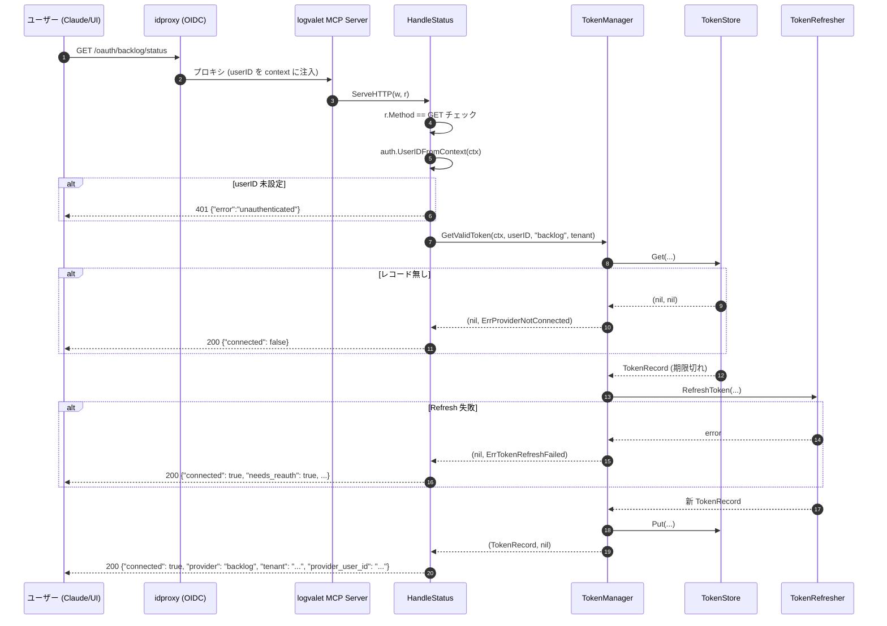
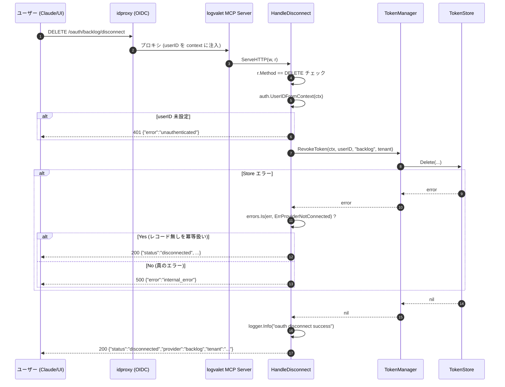

# M15: OAuth ステータス & 切断ハンドラー — 詳細計画

## 概要

Backlog OAuth 接続の **状態確認** と **切断** を行うための HTTP ハンドラー `HandleStatus` / `HandleDisconnect` を、既存 `internal/transport/http/oauth_handler.go` の `OAuthHandler` struct にメソッドとして追加する。

1. `HandleStatus` (GET /oauth/backlog/status)
   - idproxy コンテキストから userID を取得（なければ 401）
   - `tokenManager.GetValidToken` で接続状態を判定
   - 未接続: 200 `{"connected": false}`
   - 期限切れ / リフレッシュ失敗: 200 `{"connected": true, "needs_reauth": true, "provider": "backlog", "tenant": "..."}`
   - 接続済み: 200 `{"connected": true, "provider": "backlog", "tenant": "...", "provider_user_id": "..."}`
2. `HandleDisconnect` (DELETE /oauth/backlog/disconnect)
   - idproxy コンテキストから userID を取得（なければ 401）
   - `tokenManager.RevokeToken` でトークンを削除（存在しなくても冪等）
   - 200 `{"status": "disconnected", "provider": "backlog", "tenant": "..."}`

M13 / M14 で確立したパターン（`writeJSONSuccess` / `writeJSONError` / snake_case JSON / `fakeTokenManager` モック / `errCode*` / `logCallbackFailed` 系構造化ログ）を踏襲する。
ルーティング統合は M16 で行う純粋な `http.Handler` として実装する。

## スペック参照

- `docs/specs/logvalet_backlog_oauth_coding_agent_prompt.md`
  - §「期待する実装成果物 - 5. 未接続時の UX」
  - §「エラー設計」
  - §「observability 要件」
  - §「セキュリティ要件」
- `plans/backlog-oauth-roadmap.md` M15 セクション
- `plans/backlog-oauth-m13-authorize-handler.md` (OAuthHandler struct、writeJSONError パターン)
- `plans/backlog-oauth-m14-callback-handler.md` (writeJSONSuccess、callbackSuccessResponse、fakeTokenManager)

## 前提（前マイルストーンからのハンドオフ）

| マイルストーン | 提供物 | 使用箇所 |
|-------------|--------|---------|
| M01 | `ErrUnauthenticated`, `ErrProviderNotConnected`, `ErrTokenExpired`, `ErrTokenRefreshFailed` | 接続状態判定・401/200 変換 |
| M06 | `auth.TokenManager.GetValidToken` / `RevokeToken` | ストア読み書き |
| M10 | `auth.UserIDFromContext(ctx)` | context から userID 取得 |
| M13 | `OAuthHandler` struct, `writeJSONError`, `errorResponse`, 既存 `errCode*` 定数 | 共通基盤を拡張 |
| M14 | `writeJSONSuccess`, `callbackSuccessResponse` 命名規約, `fakeTokenManager` テストヘルパー, `logCallbackFailed` 系構造化ログパターン | レスポンス JSON / ログ / テストモックを踏襲 |

## 対象ファイル

| ファイル | 変更内容 |
|---------|---------|
| `internal/transport/http/oauth_handler.go` | `HandleStatus` / `HandleDisconnect` メソッド追加、`statusResponse` / `disconnectResponse` struct 追加、新規メッセージ定数追加 |
| `internal/transport/http/oauth_handler_test.go` | `HandleStatus` / `HandleDisconnect` テスト群を追加（既存 `fakeTokenManager` / `newTestHandler` ヘルパーを再利用） |
| `plans/backlog-oauth-roadmap.md` | M15 チェックボックスを `[x]`、Current Focus を M16 に更新 |

**新規ファイルは作成しない**（既存 oauth_handler.go に追記）。

## 設計判断

### 判断1: HTTP メソッド

- `HandleStatus`: **GET のみ**
  - 副作用なし・読み取り専用。セマンティクスに一致
  - GET 以外は 405
- `HandleDisconnect`: **DELETE のみ**
  - RESTful 原則に準拠。トークン削除はリソース削除 (DELETE) が自然
  - POST も許容するアイデアはあるが、選択肢を減らしてテスト項目をシンプルに保つ
  - GET / POST / PUT / PATCH は 405

### 判断2: 接続状態の判定ロジック

`tokenManager.GetValidToken(ctx, userID, "backlog", h.tenant)` の戻り値で分岐する:

| GetValidToken の戻り値 | HTTP ステータス | JSON レスポンス |
|---------------------|--------------|---------------|
| `(record, nil)` | 200 | `{"connected": true, "provider": "backlog", "tenant": "...", "provider_user_id": "..."}` |
| `(nil, ErrProviderNotConnected)` | 200 | `{"connected": false}` |
| `(nil, ErrTokenRefreshFailed)` or `(nil, ErrTokenExpired)` | 200 | `{"connected": true, "needs_reauth": true, "provider": "backlog", "tenant": "..."}` |
| `(nil, その他 error)` | 500 | `{"error": "internal_error", ...}` |

**理由**:
- 「未接続」と「再認可が必要」を区別することで、client 側（Claude skill 等）が適切なメッセージをユーザーに提示できる
- `ErrProviderNotConnected` はユーザーフローの正常分岐であり、HTTP レベルではエラーではなく 200 で返す
- `ErrTokenRefreshFailed` / `ErrTokenExpired` は「トークンレコードは存在するが有効でない」状態。クライアントには再認可誘導を返す（本番では `ErrTokenRefreshFailed` が主に発生する想定）

### 判断3: Disconnect は冪等

`tokenManager.RevokeToken` が呼び出すのは `store.Delete(ctx, userID, provider, tenant)`。
MemoryStore / SQLite / DynamoDB のいずれも「存在しないキーの削除はエラーにしない」実装（M02 のテストで保証済み）。したがってハンドラー側では追加の冪等性処理は不要。

仮に将来 `RevokeToken` が「存在しないレコード」でエラーを返す実装変更があった場合に備え、ハンドラー側では `errors.Is(err, ErrProviderNotConnected)` を 200 扱いする**防御層**を追加しておく（判断3-b）。

### 判断3-b: Revoke の `ErrProviderNotConnected` を吸収

```go
if err := h.tokenManager.RevokeToken(ctx, userID, providerName, h.tenant); err != nil {
    if !errors.Is(err, auth.ErrProviderNotConnected) {
        // 本当のエラー
        h.logDisconnectFailed(ctx, "revoke_failed", err, userID, providerName)
        writeJSONError(w, stdhttp.StatusInternalServerError, errCodeInternalError, errMsgDisconnectFailed)
        return
    }
    // 存在しないだけ → 冪等として成功扱い
}
```

**補足**: 現行の `tokenManager.RevokeToken` は `store.Delete` を呼ぶだけで、Memory/SQLite/DynamoDB の `Delete` はいずれも存在しないキーで `nil` を返すため、このコードパスは**現実装では到達しない**。将来 Revoke が厳格化された場合（例: provider 側 API 呼び出し追加 / 存在しないレコードでエラーを返す実装変更）に備えた防御層。

### 判断4: プロバイダー名の定数化

`"backlog"` リテラルをハンドラー内に複数回書くと変更時に漏れやすいため、`h.provider.Name()` を呼び出して得る。`h.provider` は M13 から非 nil 保証されている。

### 判断5: ログ出力方針

M14 の `logCallbackFailed` パターンを踏襲し、以下のヘルパーを追加:

```go
func (h *OAuthHandler) logStatusResult(ctx context.Context, outcome string, userID, providerName string)
func (h *OAuthHandler) logDisconnectFailed(ctx context.Context, reason string, err error, userID, providerName string)
```

- 成功/失敗の両方で `user_id` / `provider` / `tenant` を記録
- `err.Error()` は出さず、`err_type` (型名) のみ出す（upstream が token を echo するリスクを避ける M14 の判断を継承）
- 機微値 (`access_token` / `refresh_token` / `stateSecret`) は絶対にログに含めない

### 判断6: レスポンス JSON の OmitEmpty 戦略

`statusResponse` は接続状態に応じて異なるフィールドを返すため、`omitempty` タグで未設定時にフィールドを隠す:

```go
type statusResponse struct {
    Connected      bool   `json:"connected"`
    NeedsReauth    bool   `json:"needs_reauth,omitempty"`
    Provider       string `json:"provider,omitempty"`
    Tenant         string `json:"tenant,omitempty"`
    ProviderUserID string `json:"provider_user_id,omitempty"`
}
```

- `Connected: false` のみの場合は他フィールド全て空（omitempty でエンコード時にスキップ）
- `Connected: true, NeedsReauth: true` の場合は provider/tenant 付きで ProviderUserID は空（スキップ）
- `Connected: true` (正常) の場合は全フィールド付き

**注意**: `bool` の `omitempty` は false のときスキップされる。
- `Connected` は常に出力したい → `omitempty` を付けない
- `NeedsReauth` は true のときのみ出したい → `omitempty` を付ける

この tag 設計は M14 の `callbackSuccessResponse` とは少し異なる（callback は全フィールド常時出力） が、仕様文書で「未接続時は connected のみ」「期限切れ時は needs_reauth を付加」と明記されているため適切。

### 判断7: Disconnect レスポンス

```go
type disconnectResponse struct {
    Status   string `json:"status"`   // "disconnected"
    Provider string `json:"provider"` // "backlog"
    Tenant   string `json:"tenant"`   // "example-space"
}
```

M14 の `callbackSuccessResponse` の `status` フィールド命名に揃え、"connected" / "disconnected" で対比させる。

## OAuthHandler 拡張内容

struct 定義自体に変更なし。以下を追加する:

### 新規定数

```go
const (
    // ステータス/切断 (M15)
    errMsgStatusInternal      = "failed to fetch connection status"
    errMsgDisconnectFailed    = "failed to disconnect"
    errMsgStatusUnauth        = "user ID is required to check connection status"
    errMsgDisconnectUnauth    = "user ID is required to disconnect"
)
```

### 新規レスポンス構造体

```go
// statusResponse は /oauth/backlog/status のレスポンス形式。
// connected のみ常時出力、その他は omitempty。
type statusResponse struct {
    Connected      bool   `json:"connected"`
    NeedsReauth    bool   `json:"needs_reauth,omitempty"`
    Provider       string `json:"provider,omitempty"`
    Tenant         string `json:"tenant,omitempty"`
    ProviderUserID string `json:"provider_user_id,omitempty"`
}

// disconnectResponse は /oauth/backlog/disconnect のレスポンス形式。
type disconnectResponse struct {
    Status   string `json:"status"`
    Provider string `json:"provider"`
    Tenant   string `json:"tenant"`
}
```

### HandleStatus

```go
// HandleStatus は /oauth/backlog/status の GET ハンドラー。
//
// 処理フロー:
//  1. HTTP メソッドが GET であることを確認（それ以外は 405）
//  2. context から userID を取得（なければ 401）
//  3. tokenManager.GetValidToken で接続状態を判定
//     - ErrProviderNotConnected → 200 {"connected": false}
//     - ErrTokenRefreshFailed / ErrTokenExpired → 200 {"connected": true, "needs_reauth": true, ...}
//     - その他エラー → 500 internal_error
//     - 成功 (record, nil) → 200 {"connected": true, ..., "provider_user_id": "..."}
//
// セキュリティ: access_token / refresh_token を一切レスポンス・ログに出さない。
func (h *OAuthHandler) HandleStatus(w stdhttp.ResponseWriter, r *stdhttp.Request)
```

### HandleDisconnect

```go
// HandleDisconnect は /oauth/backlog/disconnect の DELETE ハンドラー。
//
// 処理フロー:
//  1. HTTP メソッドが DELETE であることを確認（それ以外は 405）
//  2. context から userID を取得（なければ 401）
//  3. tokenManager.RevokeToken を実行
//     - 成功 or ErrProviderNotConnected → 200 {"status": "disconnected", ...}（冪等）
//     - その他エラー → 500 internal_error
//
// セキュリティ: access_token / refresh_token を一切レスポンス・ログに出さない。
func (h *OAuthHandler) HandleDisconnect(w stdhttp.ResponseWriter, r *stdhttp.Request)
```

## エラーコードマッピング

### HandleStatus

| 状況 | HTTP ステータス | error code |
|------|----------------|-----------|
| メソッド違反 | 405 | `method_not_allowed` |
| ctx userID 未設定 | 401 | `unauthenticated` |
| `ErrProviderNotConnected` | 200 | (成功: `connected: false`) |
| `ErrTokenRefreshFailed` / `ErrTokenExpired` | 200 | (成功: `needs_reauth: true`) |
| その他 GetValidToken エラー | 500 | `internal_error` |
| 成功 | 200 | (成功: `connected: true`) |

### HandleDisconnect

| 状況 | HTTP ステータス | error code |
|------|----------------|-----------|
| メソッド違反 | 405 | `method_not_allowed` |
| ctx userID 未設定 | 401 | `unauthenticated` |
| `ErrProviderNotConnected` | 200 | (冪等成功) |
| その他 RevokeToken エラー | 500 | `internal_error` |
| 成功 | 200 | (成功: `disconnected`) |

## Observability

### HandleStatus

**成功（接続済み）**:
```go
h.logger.InfoContext(ctx, "oauth status checked",
    slog.String("outcome", "connected"),
    slog.String("user_id", userID),
    slog.String("provider", providerName),
    slog.String("tenant", h.tenant),
)
```

**成功（未接続）**:
```go
h.logger.InfoContext(ctx, "oauth status checked",
    slog.String("outcome", "not_connected"),
    slog.String("user_id", userID),
    slog.String("provider", providerName),
    slog.String("tenant", h.tenant),
)
```

**成功（期限切れ / 再認可必要）**:
```go
h.logger.InfoContext(ctx, "oauth status checked",
    slog.String("outcome", "needs_reauth"),
    slog.String("user_id", userID),
    slog.String("provider", providerName),
    slog.String("tenant", h.tenant),
)
```

**失敗（内部エラー）**:
```go
h.logger.ErrorContext(ctx, "oauth status failed",
    slog.String("reason", "store_error"),
    slog.String("err_type", fmt.Sprintf("%T", err)),
    slog.String("user_id", userID),
    slog.String("provider", providerName),
    slog.String("tenant", h.tenant),
)
```

### HandleDisconnect

**成功**:
```go
h.logger.InfoContext(ctx, "oauth disconnect success",
    slog.String("user_id", userID),
    slog.String("provider", providerName),
    slog.String("tenant", h.tenant),
)
```

**失敗**:
```go
h.logger.ErrorContext(ctx, "oauth disconnect failed",
    slog.String("reason", "revoke_failed"),
    slog.String("err_type", fmt.Sprintf("%T", err)),
    slog.String("user_id", userID),
    slog.String("provider", providerName),
    slog.String("tenant", h.tenant),
)
```

### 禁止事項（M01 マスキング遵守）

**絶対にログ・レスポンスに出さない**:
- `access_token`
- `refresh_token`
- `code` / `state` (そもそも status/disconnect では受け取らない)
- `stateSecret`
- raw `err.Error()` （`err_type` のみ）

**出してよい**:
- `user_id` (idproxy の app user ID)
- `provider` (backlog 等)
- `tenant` (Backlog スペース名)
- `provider_user_id` (Backlog ユーザー ID)
- `reason` / `outcome` (内部分岐識別子)

## TDD 計画

### Phase 1: Red（失敗するテストを先に書く）

既存の `newTestHandler` / `newTestHandlerWithDeps` / `fakeTokenManager` / `fakeProvider` / `newCallbackRequest` をそのまま流用する。

#### HandleStatus テストケース

| # | テスト名 | セットアップ | 期待結果 |
|---|---------|------------|---------|
| 1 | `TestHandleStatus_MethodNotAllowed` | POST / PUT / DELETE / PATCH | 405 `method_not_allowed` |
| 2 | `TestHandleStatus_Unauthenticated` | ctx に userID なし | 401 `unauthenticated` |
| 3 | `TestHandleStatus_NotConnected` | `getFn` が `(nil, ErrProviderNotConnected)` | 200 `{"connected": false}`、`provider`/`tenant`/`provider_user_id` 無し |
| 4 | `TestHandleStatus_NeedsReauth_RefreshFailed` | `getFn` が `(nil, ErrTokenRefreshFailed)` | 200 `{"connected": true, "needs_reauth": true, "provider": "backlog", "tenant": "test-space"}` |
| 5 | `TestHandleStatus_NeedsReauth_TokenExpired` | `getFn` が `(nil, ErrTokenExpired)` | 200 `{"connected": true, "needs_reauth": true, ...}` — **防御テスト**: 現 `manager.go` 実装では `ErrTokenExpired` は直接返らないが、将来的な実装変更でセンチネル扱いが変わっても挙動が崩れないよう保証する |
| 6 | `TestHandleStatus_Connected` | `getFn` が `(&TokenRecord{ProviderUserID: "12345", ...}, nil)` | 200 `{"connected": true, "provider": "backlog", "tenant": "test-space", "provider_user_id": "12345"}` |
| 7 | `TestHandleStatus_InternalError` | `getFn` が `errors.New("store down")` | 500 `internal_error` |
| 8 | `TestHandleStatus_ContentTypeJSON` | 正常系（any 分岐） | `Content-Type` が `application/json; charset=utf-8` で始まる |
| 9 | `TestHandleStatus_DoesNotLeakToken` | 接続済み + JSONHandler でログキャプチャ | ログに `access_token=...` / `refresh_token=...` が含まれないこと、レスポンスボディに `access_token` / `refresh_token` キーが含まれないこと |
| 10 | `TestHandleStatus_PassesCorrectArgsToGetValidToken` | `getFn` で引数をキャプチャ | `userID`, `"backlog"`, `testTenant` がそのまま渡ること |
| 11 | `TestHandleStatus_LogsConnected` | 接続済み + JSONHandler | `oauth status checked` / `outcome=connected` / `user_id` / `provider` / `tenant` |
| 12 | `TestHandleStatus_LogsNotConnected` | ErrProviderNotConnected | `outcome=not_connected` |
| 13 | `TestHandleStatus_LogsNeedsReauth` | ErrTokenRefreshFailed | `outcome=needs_reauth` |
| 14 | `TestHandleStatus_LogsInternalError` | store error | `oauth status failed` / `reason=store_error` / `err_type` / `err.Error()` 生値が含まれないこと |

#### HandleDisconnect テストケース

| # | テスト名 | セットアップ | 期待結果 |
|---|---------|------------|---------|
| 15 | `TestHandleDisconnect_MethodNotAllowed` | GET / POST / PUT / PATCH | 405 `method_not_allowed` |
| 16 | `TestHandleDisconnect_Unauthenticated` | ctx に userID なし | 401 `unauthenticated` |
| 17 | `TestHandleDisconnect_Success` | `revokeFn` が `nil` を返す | 200 `{"status": "disconnected", "provider": "backlog", "tenant": "test-space"}` |
| 18 | `TestHandleDisconnect_Idempotent_ProviderNotConnected` | `revokeFn` が `ErrProviderNotConnected` | 200 `{"status": "disconnected", ...}` （冪等扱い） |
| 19 | `TestHandleDisconnect_InternalError` | `revokeFn` が `errors.New("store down")` | 500 `internal_error` |
| 20 | `TestHandleDisconnect_PassesCorrectArgsToRevoke` | `revokeFn` で引数をキャプチャ | `userID`, `"backlog"`, `testTenant` が渡ること |
| 21 | `TestHandleDisconnect_ContentTypeJSON` | 正常系 | `Content-Type` が `application/json; charset=utf-8` |
| 22 | `TestHandleDisconnect_LogsSuccess` | 正常系 + JSONHandler | `oauth disconnect success` / `user_id` / `provider` / `tenant` |
| 23 | `TestHandleDisconnect_LogsFailure` | store error | `oauth disconnect failed` / `reason=revoke_failed` / `err_type` / `err.Error()` 生値が含まれないこと |
| 24 | `TestHandleDisconnect_DoesNotLeakToken` | 正常系 + JSONHandler | ログに `access_token` / `refresh_token` の値が含まれないこと |

#### テスト実装上の注意点

- **JSON デコード型**: `statusResponse` / `disconnectResponse` には `bool` フィールド (`connected`, `needs_reauth`) があるため、`map[string]string` ではデコードできない。テストでは `map[string]any` または型付き struct (`var body statusResponse`) を使うこと
- **フィールド存在チェック**: `TestHandleStatus_NotConnected` のように「フィールドが存在しないこと」を検証する場合は、`map[string]any` にデコード後 `_, ok := body["provider"]` で確認する
- **`errors.Is` の伝播**: `manager.go` は `fmt.Errorf("...: %w", ErrTokenRefreshFailed)` でセンチネルをラップするため、`errors.Is(err, auth.ErrTokenRefreshFailed)` は正しく伝播する（検証済み）

#### ヘルパー

既存 `newCallbackRequest` と類似のヘルパーを再利用もしくは拡張する:

```go
// newStatusRequest は userID context 付きで GET /oauth/backlog/status リクエストを作成する。
func newStatusRequest(userID string) *stdhttp.Request {
    req := httptest.NewRequest(stdhttp.MethodGet, "/oauth/backlog/status", nil)
    if userID != "" {
        req = req.WithContext(auth.ContextWithUserID(req.Context(), userID))
    }
    return req
}

// newDisconnectRequest は userID context 付きで DELETE /oauth/backlog/disconnect リクエストを作成する。
func newDisconnectRequest(userID string) *stdhttp.Request {
    req := httptest.NewRequest(stdhttp.MethodDelete, "/oauth/backlog/disconnect", nil)
    if userID != "" {
        req = req.WithContext(auth.ContextWithUserID(req.Context(), userID))
    }
    return req
}
```

### Phase 2: Green（テストを通す最小限の実装）

1. `internal/transport/http/oauth_handler.go` に以下を追記:
   - `errMsgStatusInternal`, `errMsgDisconnectFailed`, `errMsgStatusUnauth`, `errMsgDisconnectUnauth` 定数
   - `statusResponse`, `disconnectResponse` 構造体
   - `HandleStatus` メソッド
   - `HandleDisconnect` メソッド
   - `logStatusResult`, `logStatusFailed`, `logDisconnectSuccess`, `logDisconnectFailed` ヘルパー
2. `internal/transport/http/oauth_handler_test.go` に以下を追記:
   - `newStatusRequest`, `newDisconnectRequest` ヘルパー
   - HandleStatus テスト 14 件
   - HandleDisconnect テスト 10 件
3. `go test ./internal/transport/http/...` で全テスト PASS 確認

### Phase 3: Refactor（テストが通る状態でコード整理）

- `logStatusResult` は outcome 引数だけでログ構造を統一（code の重複排除）
- `writeJSONError` / `writeJSONSuccess` を継続利用（新規ヘルパーは最小限）
- godoc の充実（HandleStatus / HandleDisconnect の処理フロー・エラーマッピング表をコメント化）
- struct タグの `json:"snake_case,omitempty"` を確認
- `errCodeInternalError` 再利用（M13/M14 で定義済み）

## シーケンス図

### HandleStatus



### HandleDisconnect



## 実装ステップ

1. `plans/backlog-oauth-m15-status-handler.md` 作成（本ファイル）
2. `internal/transport/http/oauth_handler_test.go` を更新:
   - `newStatusRequest` / `newDisconnectRequest` ヘルパーを追加
   - HandleStatus / HandleDisconnect の 24 テストケースを Red で記述
3. `go test ./internal/transport/http/...` 実行 → Red 確認（コンパイルエラー: HandleStatus/HandleDisconnect 未実装）
4. `internal/transport/http/oauth_handler.go` を更新:
   - 新規メッセージ定数追加
   - `statusResponse` / `disconnectResponse` 構造体追加
   - `HandleStatus` メソッド実装
   - `HandleDisconnect` メソッド実装
   - `logStatusResult` / `logStatusFailed` / `logDisconnectSuccess` / `logDisconnectFailed` ヘルパー追加
5. `go test ./internal/transport/http/...` 実行 → 全テスト PASS
6. Refactor: godoc 追加、ヘルパー整理
7. `go test ./...` 実行 → 全体 PASS
8. `go vet ./...` 実行 → エラーなし
9. `plans/backlog-oauth-roadmap.md` を更新:
   - M15 チェックボックスを `[x]`
   - Current Focus を M16 に変更
   - Changelog にエントリ追加
10. `git add` + `git commit`（日本語 Conventional Commits + Plan: フッター）

## リスク評価

| リスク | 影響度 | 対策 |
|-------|-------|------|
| `GetValidToken` が返すエラーの種類を網羅しそこなう | 中 | エラー分岐テスト（#4, #5, #7）を追加。`errors.Is` でセンチネル判定 |
| トークンレコードの生値（AccessToken 等）をレスポンスに含めてしまう | 高 | `statusResponse` に AccessToken / RefreshToken フィールドを一切定義しない。`TestHandleStatus_DoesNotLeakToken` でボディ検査 |
| `TokenManager` の `GetValidToken` がリフレッシュ済みトークンを返すケースで誤って API ユーザーに expose してしまう | 高 | レスポンスに含めるのは `ProviderUserID` のみ。構造体に AccessToken フィールドがなければエンコード時にリスクゼロ |
| Disconnect のメソッドを DELETE 限定にした判断が使い勝手を損ねる可能性 | 低 | M16 で CLI / UI 側ラッパーを提供する前提。将来 POST 追加は容易 |
| `ErrProviderNotConnected` の冪等吸収を忘れる | 中 | `TestHandleDisconnect_Idempotent_ProviderNotConnected` で明示テスト |
| 既存 M13/M14 テストの破壊 | 低 | struct シグネチャは変更なし。純粋な追加のみ |
| `omitempty` タグの挙動で想定外のフィールドが抜ける / 出る | 中 | テスト #3, #4, #6 で各分岐のレスポンスボディ構造を JSON デコード後に検証 |
| ログに `err.Error()` を書いて upstream token が漏洩する | 高 | M14 の `err_type` パターンを継承。`TestHandleStatus_LogsInternalError` / `TestHandleDisconnect_LogsFailure` で検証 |
| methodチェック漏れ（Status で GET 以外、Disconnect で DELETE 以外） | 低 | `TestHandleStatus_MethodNotAllowed` / `TestHandleDisconnect_MethodNotAllowed` を追加 |
| `TokenRecord` の `Provider` / `Tenant` が空の場合のレスポンス | 低 | `statusResponse` は `h.provider.Name()` と `h.tenant` を使う（`record.Provider` には依存しない） |

## セキュリティ考慮

1. **userID 必須**: context に userID がなければ即 401。共有 token フォールバック禁止
2. **他ユーザーのトークン参照不可**: `tokenManager.GetValidToken` / `RevokeToken` に ctx の `userID` のみを渡す（state など外部入力を使わない）
3. **トークン生値ログ禁止**: `access_token` / `refresh_token` / `stateSecret`
4. **プロバイダーエラーの露出制限**: `err.Error()` はレスポンス・ログに出さず、`err_type` のみ記録
5. **HTTP メソッド固定**: Status は GET のみ、Disconnect は DELETE のみ（CSRF 耐性も兼ねる）
6. **Disconnect の認可境界**: ctx の userID に紐づくトークンのみ削除（他ユーザーのを消せない設計）
7. **レスポンスに AccessToken を含めない**: 構造体にフィールドすら定義しない（type-level 保証）
8. **冪等性**: 存在しないレコードの削除も 200 を返すが、実際の副作用はない（攻撃面積を増やさない）

## 既存コードへの影響

| ファイル | 変更の有無 | 内容 |
|---------|---------|------|
| `internal/transport/http/oauth_handler.go` | **変更あり** | メソッド 2 つ + ヘルパー 4 つ + struct 2 つ + 定数 4 つ追加 |
| `internal/transport/http/oauth_handler_test.go` | **変更あり** | ヘルパー 2 つ + テスト 24 件追加。既存テストは無変更 |
| `internal/auth/errors.go` | **変更なし** | 既存センチネルを `errors.Is` で利用するだけ |
| `internal/auth/manager.go` | **変更なし** | `GetValidToken` / `RevokeToken` を利用するのみ |
| `internal/auth/provider/backlog.go` | **変更なし** | 利用せず |
| `internal/mcp/*.go` | **変更なし** | ルーティング統合は M16 |
| `internal/cli/*.go` | **変更なし** | CLI 層は不変 |
| CLI コマンド全般 | **変更なし** | 既存パス保持 |

## 後方互換性

- `OAuthHandler` の struct / `NewOAuthHandler` シグネチャは M14 と同じ（変更なし）
- 既存 M13/M14 テストは全て無変更で PASS する
- 新規メソッド追加のみのため、既存利用者（まだ M16 で統合されていないので外部利用なし）への影響ゼロ

## 完了条件

- [ ] `internal/transport/http/oauth_handler.go` に `HandleStatus` / `HandleDisconnect` 実装完了
- [ ] `statusResponse` / `disconnectResponse` 構造体追加
- [ ] 新規 `errMsg*` 定数追加
- [ ] `internal/transport/http/oauth_handler_test.go` 全テスト（既存 + 新規 24 件） PASS
- [ ] `go test ./...` 全体 PASS
- [ ] `go vet ./...` エラーなし
- [ ] `plans/backlog-oauth-roadmap.md` の M15 チェックボックス更新・Current Focus を M16 に変更
- [ ] コミット完了（Conventional Commits 形式・日本語・Plan: フッター）

## コミット

```
feat(transport): OAuth ステータス & 切断ハンドラーを実装 (M15)

Plan: plans/backlog-oauth-m15-status-handler.md
```
