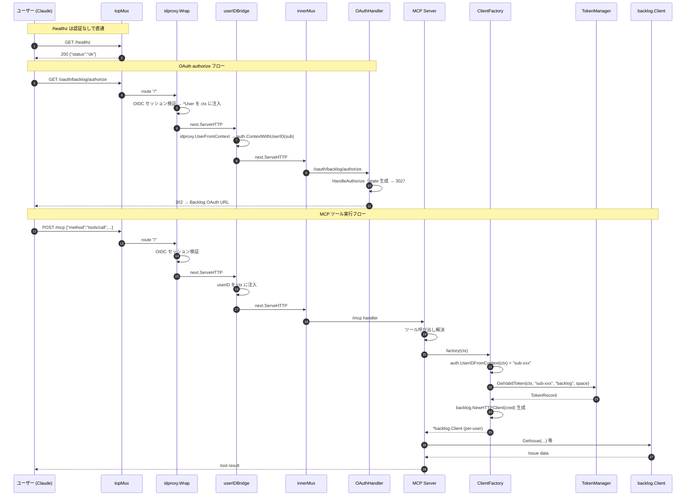

# M16: MCP サーバーへの OAuth ルート統合 — 詳細計画

## 概要

`internal/cli/mcp.go` の MCP 起動フローに、M12〜M15 で構築済みの OAuth コンポーネントを統合する。
具体的には以下を達成する:

1. `--auth` フラグ有効 **かつ** `LOGVALET_BACKLOG_CLIENT_ID` 設定時のみ OAuth モードを有効化
2. OAuth モードで `NewServerWithFactory` を使って per-user の MCP サーバーを構築
3. `/oauth/backlog/{authorize,callback,status,disconnect}` の 4 ルートを mux に登録
4. idproxy の `*User.Subject` を `auth.UserIDFromContext` 互換の context key に橋渡しするミドルウェアを OAuth ルートと MCP ルートの両方に適用
5. 既存 CLI（profile / API key）・既存 MCP（単一 Client）パスは**一切変更しない**

ルーティング統合は M16 の責務だが、ハンドラー・サーバー構築コンポーネントは既に完成しているため、M16 は**配線と分岐**が主となる。

## スペック参照

- `docs/specs/logvalet_backlog_oauth_coding_agent_prompt.md`
  - §「最終的に欲しい状態」
  - §「remote MCP との接続整理」
  - §「エラー設計」
  - §「observability 要件」
- `plans/backlog-oauth-roadmap.md` M16 セクション + §後方互換性の保証
- `plans/backlog-oauth-m12-server-factory.md`（NewServerWithFactory のハンドオフ）
- `plans/backlog-oauth-m13-authorize-handler.md`（OAuthHandler struct）
- `plans/backlog-oauth-m14-callback-handler.md`（TokenManager 注入）
- `plans/backlog-oauth-m15-status-handler.md`（4 メソッド揃い）

## 前提（前マイルストーンからのハンドオフ）

| マイルストーン | 提供物 | 使用箇所 |
|-------------|--------|---------|
| M03 | `auth.LoadOAuthEnvConfig`, `OAuthEnvConfig.Validate`, `OAuthEnabled()` | 環境変数ロード + バリデーション |
| M05 | `provider.NewBacklogOAuthProvider(space, clientID, clientSecret)` | プロバイダー生成 |
| M06 | `auth.NewTokenManager(store, providers, opts...)` | TokenManager 構築 |
| M07/M08/M09 | `tokenstore.NewTokenStore(cfg *OAuthEnvConfig)` | ストア生成（memory / sqlite / dynamodb） |
| M10 | `auth.NewClientFactory(tm, provider, tenant, baseURL)` | per-user Client 生成関数 |
| M12 | `mcpinternal.NewServerWithFactory(factory, ver, cfg)` | OAuth モード用 MCP サーバー |
| M13〜M15 | `httptransport.NewOAuthHandler(p, tm, tenant, redirectURI, secret, ttl, logger)` + 4 メソッド | OAuth HTTP ハンドラー |

## 対象ファイル

| ファイル | 種別 | 内容 |
|---------|------|------|
| `internal/cli/mcp.go` | 修正 | `Run()` をリファクタ + OAuth モード分岐追加 |
| `internal/cli/mcp_oauth.go` | 新規 | OAuth 配線（`buildOAuthDeps` / `installOAuthRoutes` / `newUserIDBridge` / `OAuthDeps` 型） |
| `internal/cli/mcp_oauth_test.go` | 新規 | OAuth 配線とルーティングの単体テスト |
| `plans/backlog-oauth-roadmap.md` | 修正 | M16 を `[x]`、Current Focus を M17 に更新 |

**既存ファイルへの影響**:

- `internal/cli/mcp.go`: `Run()` のシグネチャ・挙動は不変。内部的に `buildOAuthDeps` を呼び分岐するのみ。
- `internal/cli/mcp_auth.go`: 変更なし
- `internal/cli/mcp_integration_test.go`: 既存テストは変更なし（新規テストは mcp_oauth_test.go に追加）
- `internal/auth/`, `internal/mcp/`, `internal/transport/http/`: 変更なし

## 設計判断

### 判断 1: OAuth モード発動条件

**条件**: `--auth` が有効 **かつ** `LOGVALET_BACKLOG_CLIENT_ID` が設定されている。

片方のみの場合は以下の動作:
- `--auth` のみ（`LOGVALET_BACKLOG_CLIENT_ID` 未設定）: 既存パス（API key 認証、`NewServer(rc.Client, ...)`）で起動。idproxy は有効だが OAuth ルートは登録しない。
- `LOGVALET_BACKLOG_CLIENT_ID` のみ（`--auth` 無効）: 既存パス。OAuth は有効化しない（認証なしで OAuth 登録はセキュリティホール）。

**理由**:
- ロードマップ §「後方互換性の保証 - 新パスの発動条件（M16）」と整合
- `--auth` 無しで OAuth ルートを公開すると、userID context 注入がないため全リクエストが 401 になり意味がない
- `LOGVALET_BACKLOG_CLIENT_ID` 未設定で `--auth` のみの場合は、既存の API key ベースの MCP が使いたいユースケースと判断

### 判断 2: リファクタ方針（`Run` の分離）

現在の `mcp.go` の `Run()` は以下の責務を持つ:

1. `buildRunContext` で rc 取得
2. サーバー設定組み立て
3. MCP サーバー生成（単一 client）
4. mux 構築（auth 有/無で 2 分岐）
5. HTTP サーバー起動・shutdown

M16 では OAuth 配線を追加するが、`Run()` を肥大化させないため、**純関数として抽出**する:

- `buildOAuthDeps(cfg *auth.OAuthEnvConfig, space, baseURL string, logger *slog.Logger) (*OAuthDeps, error)` — 依存注入を作る純関数
- `installOAuthRoutes(mux *http.ServeMux, h *httptransport.OAuthHandler)` — mux にルート登録
- `newUserIDBridge() func(http.Handler) http.Handler` — idproxy → auth の userID ブリッジ
- `(deps *OAuthDeps).Close() error` — TokenStore のクローズ（defer 用）

これらを `mcp_oauth.go` に配置し、テストで httptest.NewRecorder で単体検証できるようにする。

**理由**:
- 「mcp.go のリファクタリング（配線を抽出可能にする）が必要なら計画に含めること」というスペック要件を満たす
- TDD で純関数からテスト可能にする
- OAuth 関連コードを 1 ファイルに集約することで、既存 `mcp.go` の差分を最小化

### 判断 3: idproxy → auth userID ブリッジミドルウェア（最重要）

**問題**: idproxy.Wrap は `*idproxy.User` を独自の context key に注入するが、`auth.UserIDFromContext` は `internal/auth/context.go` の unexported `contextKey{}` で string を参照する。**両者は別の context キー**。

**解決策**: `idproxy.UserFromContext(ctx).Subject` を `auth.ContextWithUserID(ctx, subject)` でラップするミドルウェアを追加。

```go
// newUserIDBridge は idproxy が context に注入した *User.Subject を
// auth.UserIDFromContext が参照する context key に橋渡しするミドルウェアを返す。
//
// 適用範囲: /oauth/backlog/* および /mcp ルートの両方。
// - OAuth ルート: HandleAuthorize/Callback/Status/Disconnect が auth.UserIDFromContext を呼ぶ
// - MCP ルート: NewServerWithFactory → ClientFactory → auth.UserIDFromContext
func newUserIDBridge() func(http.Handler) http.Handler {
    return func(next http.Handler) http.Handler {
        return http.HandlerFunc(func(w http.ResponseWriter, r *http.Request) {
            if u := idproxy.UserFromContext(r.Context()); u != nil && u.Subject != "" {
                r = r.WithContext(auth.ContextWithUserID(r.Context(), u.Subject))
            }
            next.ServeHTTP(w, r)
        })
    }
}
```

**配置**: `auth.Wrap(bridge(oauthMux))` のように idproxy の内側に挟む。
idproxy の外側に置くと idproxy が context に注入する前に bridge が動くため効果なし。

**理由**:
- advisor の指摘: 「ブリッジミドルウェア（#1）を絶対に落とさないこと。他は設計の微調整で済むが、これが欠けると動作しない」
- Subject が OIDC sub クレーム（= userID として使える唯一の永続識別子）
- Bridge が無いと OAuth ルートも MCP ツールも全て 401/ErrUnauthenticated で詰む

### 判断 4: mux 構造

OAuth モード時の mux 構造:

```
topMux:
  /healthz              → healthHandler（認証なし）
  /                     → auth.Wrap(bridge(innerMux))

innerMux:
  /mcp                          → MCP StreamableHTTP サーバー
  /oauth/backlog/authorize      → oauthHandler.HandleAuthorize
  /oauth/backlog/callback       → oauthHandler.HandleCallback
  /oauth/backlog/status         → oauthHandler.HandleStatus
  /oauth/backlog/disconnect     → oauthHandler.HandleDisconnect
```

**既存の OAuth 非モード**:

```
topMux:
  /healthz                 → healthHandler
  /                        → auth.Wrap(mcpMux)（--auth 時）
  または
mcpMux:
  /mcp                     → MCP StreamableHTTP サーバー
  /healthz                 → healthHandler（--auth 無し時）
```

**理由**:
- `/healthz` は常に認証なしで Lambda/ALB ヘルスチェックが通るように
- OAuth モードでも `/mcp` は同じ innerMux に同居させ、両方に bridge を適用
- idproxy の Wrap は `http.Handler` 単位で wrap するため、OAuth ルートと MCP ルートを同じ `innerMux` に入れて一括 wrap

### 判断 5: Tenant と BaseURL の確定

`rc.Config.Space` はスペース**名**（例: `"example-space"`）。
`rc.Config.BaseURL` は URL（例: `"https://example-space.backlog.com"`）。

- `provider.NewBacklogOAuthProvider(space, clientID, clientSecret)` の `space` = `rc.Config.Space`
- `OAuthHandler.tenant` = `rc.Config.Space`（provider.space と同一）
- `ClientFactory` の `baseURL` = `rc.Config.BaseURL`（既存 MCP と同じ）

**理由**:
- M13 計画 §「tenant の規約」で「フルホスト名ではなくスペース名」と明記
- `BacklogOAuthProvider.toTokenRecord` は `Tenant = p.space` で保存するため、ハンドラーの tenant と完全一致させる必要あり
- `baseURL` は既存 backlog.Client のものと合わせる（`https://{space}.backlog.com`）

### 判断 6: OAuthStateSecret の hex デコード

`OAuthEnvConfig.OAuthStateSecret` は hex 文字列。`NewOAuthHandler` は `[]byte` を要求。

- `buildOAuthDeps` 内で `hex.DecodeString(cfg.OAuthStateSecret)` でデコード
- デコード失敗時はエラーを返す（`cfg.Validate()` で事前検証済みなので通常発生しないが、防御的に）

### 判断 7: TokenStore の Close 責務

`TokenStore` interface は `Close() error` を持つ。SQLite/DynamoDB ではリソース解放が必要。

- `OAuthDeps.Close()` メソッドで `TokenStore.Close()` を呼ぶ
- `Run()` から `defer deps.Close()` で解放（`srv.Shutdown` の後、プロセス終了前）

### 判断 8: logger の注入

`OAuthHandler` は `*slog.Logger` を受け取る。

- `slog.Default()` を使用（カスタマイズは将来検討）
- OAuth モードの起動時に `fmt.Fprintf(os.Stderr, ...)` で起動ログを出す（既存パターン踏襲）

### 判断 9: OAuthEnvConfig ロード順序

```go
oauthCfg, err := auth.LoadOAuthEnvConfig(os.Getenv)
// OAuthEnabled を先にチェック → 有効なら Validate
if oauthCfg.OAuthEnabled() {
    if err := oauthCfg.Validate(); err != nil {
        return err
    }
    // 以降 OAuth 配線
}
```

**理由**:
- `OAuthEnabled()` が false の場合は他の項目（StateSecret 等）を検証しない
- `--auth` のみのユーザーが `LOGVALET_BACKLOG_CLIENT_ID` を設定していないケースで誤ってエラーにしない

### 判断 10: 依存関係の lazy 構築

OAuth モードが無効な場合、`buildOAuthDeps` は呼ばない。これにより:

- `--auth` 無しユーザー: 環境変数の hex デコード等を一切走らせない
- `--auth` + OAuth 無効: 既存パスそのまま
- `--auth` + OAuth 有効: `buildOAuthDeps` で全コンポーネント構築 → `defer deps.Close()`

## OAuthDeps 型

```go
// OAuthDeps は OAuth モードに必要な依存を束ねる。
// YAGNI 原則により、Run() が実際に使うフィールドのみを保持する。
type OAuthDeps struct {
    Store        auth.TokenStore
    Provider     provider.OAuthProvider
    TokenManager auth.TokenManager
    Factory      auth.ClientFactory
    Handler      *httptransport.OAuthHandler
}

// Close は TokenStore を解放する。
func (d *OAuthDeps) Close() error {
    if d == nil || d.Store == nil {
        return nil
    }
    return d.Store.Close()
}
```

## buildOAuthDeps 関数

```go
// buildOAuthDeps は OAuth モード用の依存コンポーネントを一括構築する。
//
// 前提:
//  - cfg.OAuthEnabled() == true であること（caller で確認済み）
//  - cfg.Validate() が nil を返していること（caller で確認済み）
//  - space は Backlog スペース名（例: "example-space"）
//  - baseURL は Backlog API のベース URL（例: "https://example-space.backlog.com"）
//  - logger は nil でも可（handler 側で slog.Default() へフォールバック）
//
// 失敗条件:
//  - space が空
//  - hex.DecodeString(OAuthStateSecret) 失敗
//  - provider.NewBacklogOAuthProvider 失敗
//  - tokenstore.NewTokenStore 失敗
//  - httptransport.NewOAuthHandler 失敗
func buildOAuthDeps(cfg *auth.OAuthEnvConfig, space, baseURL string, logger *slog.Logger) (*OAuthDeps, error) {
    if cfg == nil {
        return nil, fmt.Errorf("mcp: oauth config must not be nil")
    }
    if space == "" {
        return nil, fmt.Errorf("mcp: space must not be empty for OAuth mode")
    }

    secret, err := hex.DecodeString(cfg.OAuthStateSecret)
    if err != nil {
        return nil, fmt.Errorf("mcp: invalid OAuth state secret: %w", err)
    }

    // Provider
    p, err := provider.NewBacklogOAuthProvider(space, cfg.BacklogClientID, cfg.BacklogClientSecret)
    if err != nil {
        return nil, fmt.Errorf("mcp: build backlog provider: %w", err)
    }

    // Store
    store, err := tokenstore.NewTokenStore(cfg)
    if err != nil {
        return nil, fmt.Errorf("mcp: build token store: %w", err)
    }

    // TokenManager
    providers := map[string]auth.TokenRefresher{p.Name(): p}
    tm := auth.NewTokenManager(store, providers)

    // ClientFactory
    factory := auth.NewClientFactory(tm, p.Name(), space, baseURL)

    // OAuthHandler
    handler, err := httptransport.NewOAuthHandler(p, tm, space, cfg.BacklogRedirectURL, secret, auth.DefaultStateTTL, logger)
    if err != nil {
        // 失敗時は store を閉じる（リソースリーク防止）
        _ = store.Close()
        return nil, fmt.Errorf("mcp: build oauth handler: %w", err)
    }

    return &OAuthDeps{
        Store:        store,
        Provider:     p,
        TokenManager: tm,
        Factory:      factory,
        Handler:      handler,
    }, nil
}
```

## installOAuthRoutes 関数

```go
// installOAuthRoutes は OAuth ハンドラーの 4 メソッドを mux に登録する。
//
// 登録パス:
//  - GET    /oauth/backlog/authorize   → HandleAuthorize
//  - GET    /oauth/backlog/callback    → HandleCallback
//  - GET    /oauth/backlog/status      → HandleStatus
//  - DELETE /oauth/backlog/disconnect  → HandleDisconnect
//
// HTTP メソッドフィルタは各ハンドラー内で実施する（本関数では mux.HandleFunc でパスのみ登録）。
func installOAuthRoutes(mux *http.ServeMux, h *httptransport.OAuthHandler) {
    mux.HandleFunc("/oauth/backlog/authorize", h.HandleAuthorize)
    mux.HandleFunc("/oauth/backlog/callback", h.HandleCallback)
    mux.HandleFunc("/oauth/backlog/status", h.HandleStatus)
    mux.HandleFunc("/oauth/backlog/disconnect", h.HandleDisconnect)
}
```

## newUserIDBridge 関数

```go
// newUserIDBridge は idproxy の *User.Subject を auth.UserIDFromContext が
// 参照する context key に橋渡しするミドルウェアを返す。
//
// 配置: auth.Wrap の内側（innerMux を wrap する手前）。
// idproxy の外側に置くと、idproxy が context に注入する前に bridge が動き無効化する。
//
// Subject が空の場合は何もせずに次へ（後段ハンドラーが 401 を返す）。
func newUserIDBridge() func(http.Handler) http.Handler {
    return func(next http.Handler) http.Handler {
        return http.HandlerFunc(func(w http.ResponseWriter, r *http.Request) {
            if u := idproxy.UserFromContext(r.Context()); u != nil && u.Subject != "" {
                r = r.WithContext(auth.ContextWithUserID(r.Context(), u.Subject))
            }
            next.ServeHTTP(w, r)
        })
    }
}
```

## mcp.go の変更箇所

`Run()` メソッドに以下の分岐を追加する。既存コード構造は最小限の変更にとどめる。

```go
func (c *McpCmd) Run(g *GlobalFlags) error {
    rc, err := buildRunContext(g)
    if err != nil {
        return err
    }

    ver := version.NewInfo().Version
    cfg := mcpinternal.ServerConfig{
        Profile: rc.Config.Profile,
        Space:   rc.Config.Space,
        BaseURL: rc.Config.BaseURL,
    }

    // OAuth モード判定（--auth + LOGVALET_BACKLOG_CLIENT_ID）
    var oauthDeps *OAuthDeps
    if c.Auth {
        oauthCfg, err := auth.LoadOAuthEnvConfig(os.Getenv)
        if err != nil {
            return fmt.Errorf("load oauth config: %w", err)
        }
        if oauthCfg.OAuthEnabled() {
            if err := oauthCfg.Validate(); err != nil {
                return fmt.Errorf("validate oauth config: %w", err)
            }
            deps, err := buildOAuthDeps(oauthCfg, rc.Config.Space, rc.Config.BaseURL, slog.Default())
            if err != nil {
                return err
            }
            oauthDeps = deps
            defer func() { _ = oauthDeps.Close() }()
        }
    }

    // MCP サーバー構築（OAuth 有無で分岐）
    var s *mcpserver.MCPServer
    if oauthDeps != nil {
        s = mcpinternal.NewServerWithFactory(oauthDeps.Factory, ver, cfg)
    } else {
        s = mcpinternal.NewServer(rc.Client, ver, cfg)
    }
    h := mcpserver.NewStreamableHTTPServer(s, mcpserver.WithEndpointPath("/mcp"))

    addr := fmt.Sprintf("%s:%d", c.Host, c.Port)

    // innerMux: MCP + OAuth ルートを同居
    innerMux := http.NewServeMux()
    innerMux.Handle("/mcp", h)
    if oauthDeps != nil {
        installOAuthRoutes(innerMux, oauthDeps.Handler)
    }

    var handler http.Handler
    if c.Auth {
        authCfg, err := BuildAuthConfig(c)
        if err != nil {
            return err
        }
        authMW, err := idproxy.New(context.Background(), authCfg)
        if err != nil {
            return err
        }

        topMux := http.NewServeMux()
        topMux.HandleFunc("/healthz", healthHandler)
        // idproxy.Wrap の内側に userID bridge を挟む（auth → bridge → innerMux）
        bridge := newUserIDBridge()
        topMux.Handle("/", authMW.Wrap(bridge(innerMux)))
        handler = topMux

        if oauthDeps != nil {
            fmt.Fprintf(os.Stderr, "logvalet MCP server (auth + OAuth) listening on %s/mcp\n", addr)
            fmt.Fprintf(os.Stderr, "  OAuth routes: /oauth/backlog/{authorize,callback,status,disconnect}\n")
        } else {
            fmt.Fprintf(os.Stderr, "logvalet MCP server (auth enabled) listening on %s/mcp\n", addr)
        }
    } else {
        innerMux.HandleFunc("/healthz", healthHandler)
        handler = innerMux
        fmt.Fprintf(os.Stderr, "logvalet MCP server listening on %s/mcp\n", addr)
    }

    srv := &http.Server{Addr: addr, Handler: handler}

    ctx, stop := signal.NotifyContext(context.Background(), syscall.SIGINT, syscall.SIGTERM)
    defer stop()

    errCh := make(chan error, 1)
    go func() { errCh <- srv.ListenAndServe() }()

    select {
    case err := <-errCh:
        if err != nil && err != http.ErrServerClosed {
            return err
        }
    case <-ctx.Done():
        stop()
        shutdownCtx, cancel := context.WithTimeout(context.Background(), 10*time.Second)
        defer cancel()
        if err := srv.Shutdown(shutdownCtx); err != nil {
            fmt.Fprintf(os.Stderr, "shutdown error: %v\n", err)
        }
    }

    return nil
}
```

**変更点まとめ**:
- `mcpMux` を `innerMux` にリネーム（OAuth ルートも同居するため）
- OAuth モード判定ブロック追加（`--auth` 時のみ LoadOAuthEnvConfig）
- `NewServer` / `NewServerWithFactory` の分岐追加
- `installOAuthRoutes` で OAuth ルート登録
- `newUserIDBridge` を auth.Wrap の内側に配置
- `defer oauthDeps.Close()` 追加

## シーケンス図



## TDD 計画

### Phase 1: Red（失敗するテストを先に書く）

テストは `internal/cli/mcp_oauth_test.go` に配置する。既存 `mcp_integration_test.go` の流儀（httptest で in-process 組み立て）を踏襲する。

#### テストケース一覧

##### A. buildOAuthDeps テスト

| # | テスト名 | セットアップ | 期待結果 |
|---|---------|------------|---------|
| 1 | `TestBuildOAuthDeps_NilConfig` | cfg=nil | error |
| 2 | `TestBuildOAuthDeps_EmptySpace` | space="" | error |
| 3 | `TestBuildOAuthDeps_InvalidHex` | cfg.OAuthStateSecret="not-hex" | error |
| 4 | `TestBuildOAuthDeps_MemoryStore` | 有効な memory cfg | deps.Store が MemoryStore、deps.Handler 非 nil |
| 5 | `TestBuildOAuthDeps_ProviderRegistered` | 正常系 | deps.Provider.Name() == "backlog" |
| 6 | `TestBuildOAuthDeps_Close_MemoryStore` | 正常系 → deps.Close() | エラーなし（MemoryStore.Close は nil を返す） |

**削除**: 旧 #7（EmptyClientID テスト）は advisor レビューで「検証価値がない」と判断されたため削除。OAuthEnabled() で事前弾きすることは Run() 側の分岐で担保されており、buildOAuthDeps 自身の責務ではない。

##### B. installOAuthRoutes テスト

| # | テスト名 | セットアップ | 期待結果 |
|---|---------|------------|---------|
| 8 | `TestInstallOAuthRoutes_AuthorizeRouted` | mux に install → `auth.ContextWithUserID(ctx, "u1")` を設定した httptest リクエスト | 302 Location が Backlog OAuth URL |
| 9 | `TestInstallOAuthRoutes_CallbackRouted` | GET /oauth/backlog/callback（state/code なし）| 400 invalid_request |
| 10 | `TestInstallOAuthRoutes_StatusRouted` | GET /oauth/backlog/status + preset userID + fakeTM（not connected） | 200 `{"connected":false}` |
| 11 | `TestInstallOAuthRoutes_DisconnectRouted` | DELETE /oauth/backlog/disconnect + preset userID + fakeTM | 200 `{"status":"disconnected",...}` |

**注**:
- #8〜#11 は `httptransport.NewOAuthHandler` 本体は M13〜M15 でカバー済み。ここでは「mux に正しく登録されている」ことを検証する最小テスト。
- idproxy は介さず、`auth.ContextWithUserID` で preset したリクエストを直接 mux に投げる（advisor レビュー反映）。

##### C. newUserIDBridge テスト

| # | テスト名 | セットアップ | 期待結果 |
|---|---------|------------|---------|
| 12 | `TestUserIDBridge_InjectsSubject` | idproxy.newContextWithUser で User を ctx に入れ、bridge を通す | 次ハンドラーの ctx に `auth.UserIDFromContext` で Subject が取れる |
| 13 | `TestUserIDBridge_NoUser_PassThrough` | idproxy User 未注入 | 次ハンドラーの ctx に userID なし（auth.UserIDFromContext が false） |
| 14 | `TestUserIDBridge_EmptySubject_PassThrough` | User.Subject="" | 次ハンドラー ctx に userID なし |

**注**: `newContextWithUser` は idproxy 内部関数で外部公開されていない。**テスト方針**: idproxy `integration_test.go` の流儀を踏襲し、bridge を `auth.Wrap(bridge(next))` で組み合わせた in-process テストで実際に OIDC mock 経由でログインするか、または bridge のテストを**直接 idproxy.UserFromContext の public API と互換するフックが使える形式**にする必要がある。

**実装上の判断**: idproxy の `newContextWithUser` は unexported のため、bridge 単体テストは idproxy の `*User` を context に直接注入する private helper（`idproxy.WithUser` 等の API）を利用する。もし利用できない場合は、bridge のロジックを `extractUserID(ctx)` ヘルパーに切り出し、ヘルパー単体でテストする。

**代替案**: bridge を内部関数 `bridgeFromUser(userIDFn func(context.Context) string) func(http.Handler) http.Handler` として一般化し、`userIDFn` にテスト用関数を注入できるようにする。本番は `func(ctx) string { if u := idproxy.UserFromContext(ctx); u != nil { return u.Subject }; return "" }`。

→ **採用**: `bridgeFromUserIDFn(fn)` ヘルパー + `newUserIDBridge()` は `bridgeFromUserIDFn(idproxyUserID)` を返す薄い wrapper。これで bridge ロジックを純粋に単体テスト可能。

##### C-bis. bridge → innerMux → factory 直結テスト（**M16 最重要動作**）

| # | テスト名 | セットアップ | 期待結果 |
|---|---------|------------|---------|
| 14-2 | `TestBridge_PropagatesUserIDToFactory` | `bridgeFromUserIDFn(constFn("alice"))` → innerMux に /mcp ダミーハンドラー登録。ハンドラー内で `auth.UserIDFromContext(r.Context())` を取得してヘッダー出力 | レスポンスに `"alice"` が含まれる。bridge を auth.Wrap の外側に置いた場合に検知できない事故を防ぐ専用テスト |
| 14-3 | `TestBridge_PropagatesUserIDToClientFactory` | `bridgeFromUserIDFn(constFn("bob"))` → `buildOAuthDeps` で生成した `deps.Factory` を ctx 付きで呼ぶ（直接またはラッパーハンドラー経由）→ fakeTokenManager が `userID="bob"` で GetValidToken 呼び出しされることを確認 | fakeTM の getFn が `userID=="bob"` で呼ばれる |

**テスト戦略**（advisor レビュー反映）:
- 14-2 は bridge を挟んだ状態で「bridge → innerMux → dummyHandler」の順で userID が伝播することを純粋に検証
- 14-3 は bridge → innerMux → MCP ツールハンドラー → ClientFactory の全経路。ClientFactory は `func(ctx) (Client, error)` なのでハンドラー内で直接呼んで ctx を検査できる
- これにより「bridge を auth.Wrap の外に置く」「bridge を忘れる」「bridge が innerMux 以外に適用される」といった配線ミスが必ず検出される

##### D. McpCmd.Run 分岐の動作確認（軽量）

フル `Run()` は HTTP サーバー起動を伴うため、単体テストでは「OAuth 無効時に LoadOAuthEnvConfig すら呼ばない」「OAuth 有効時に必須項目が無いとエラー」など検証困難。
代わりに、`mcp_integration_test.go` の流儀で以下を追加:

| # | テスト名 | セットアップ | 期待結果 |
|---|---------|------------|---------|
| 15 | `TestRun_OAuthDisabled_UsesNewServer`（統合風） | --auth 無し | `mcpinternal.NewServer` 経路（リクエスト応答で挙動確認） |
| 16 | `TestRun_OAuthEnabled_UsesNewServerWithFactory`（統合風） | --auth + LOGVALET_BACKLOG_CLIENT_ID 等を env で設定 | OAuth ルートが mux に存在、/mcp は factory 経路 |

**注**: #15/#16 はフル `srv.ListenAndServe` なしに `buildOAuthDeps` + `installOAuthRoutes` + `newUserIDBridge` の組み立てをテストする形で実装する。実際の `Run()` 全体は M17 の E2E でカバー。

#### テストヘルパー

```go
// fakeTokenManager は auth.TokenManager のモック（oauth_handler_test.go と同じ構造）。
// mcp_oauth_test.go 内に複製配置する（パッケージが分かれているため）。
type fakeTokenManager struct { ... }

// newOAuthCfg は有効な OAuthEnvConfig を返すテストヘルパー。
func newOAuthCfg(t *testing.T) *auth.OAuthEnvConfig {
    return &auth.OAuthEnvConfig{
        TokenStoreType:      auth.StoreTypeMemory,
        BacklogClientID:     "test-client-id",
        BacklogClientSecret: "test-client-secret",
        BacklogRedirectURL:  "https://example.com/oauth/backlog/callback",
        OAuthStateSecret:    strings.Repeat("ab", 16), // hex 32 chars = 16 bytes
    }
}
```

### Phase 2: Green（テストを通す最小限の実装）

1. `internal/cli/mcp_oauth.go` を新規作成:
   - `OAuthDeps` 型
   - `buildOAuthDeps` 関数
   - `installOAuthRoutes` 関数
   - `bridgeFromUserIDFn` / `newUserIDBridge` 関数
   - `(deps *OAuthDeps).Close()` メソッド
2. `internal/cli/mcp.go` を更新:
   - `mcpMux` → `innerMux` リネーム
   - OAuth モード判定ブロック追加
   - `NewServer` / `NewServerWithFactory` 分岐
   - `auth.Wrap(bridge(innerMux))` 配置
3. `internal/cli/mcp_oauth_test.go` を新規作成:
   - テストケース 16 件
4. `go test ./...` で全体 PASS 確認
5. `go vet ./...` エラーなし

### Phase 3: Refactor

- ログメッセージの整理
- 起動時ログの重複排除
- `Run()` がまだ肥大化しているなら、OAuth ブロックをさらに `setupOAuthRoutes(...)` のようなヘルパーに抽出
- godoc の充実

## 実装ステップ

1. `plans/backlog-oauth-m16-mcp-integration.md` 作成（本ファイル）
2. `internal/cli/mcp_oauth_test.go` を先に作成（Red、16 テストケース）
3. `go test ./internal/cli/...` で Red 確認（コンパイルエラー）
4. `internal/cli/mcp_oauth.go` を作成（Green）
5. `internal/cli/mcp.go` を更新（Green）
6. `go test ./internal/cli/...` で全テスト PASS
7. `go test ./...` で全体 PASS
8. `go vet ./...` エラーなし
9. Refactor
10. `plans/backlog-oauth-roadmap.md` の M16 チェックボックスを `[x]`、Current Focus を M17 に更新、Changelog 追加
11. `git add` + `git commit`（日本語 Conventional Commits + Plan: フッター）

## リスク評価

| リスク | 影響度 | 対策 |
|-------|-------|------|
| idproxy→auth の userID bridge を忘れる／順序が逆 | **致命的** | `newUserIDBridge` を必須で作成、`auth.Wrap(bridge(innerMux))` 順序をテスト #12 で検証 |
| bridge の単体テスト困難（idproxy の unexported API） | 中 | `bridgeFromUserIDFn(fn)` 抽象化で純粋テスト可能にする |
| OAuth 配線で hex.DecodeString が Validate 失敗後に再実行される冗長性 | 低 | Validate 成功後は実質安全。buildOAuthDeps 内で再度デコードして失敗時はエラーを返す（防御的） |
| TokenStore の Close 呼び出し漏れ（Lambda 環境等） | 中 | `defer oauthDeps.Close()` を mcp.go に明示配置。テスト #6 で Close の冪等を確認 |
| 既存 `mcp_integration_test.go` の破壊 | 高 | `mcpMux` → `innerMux` リネームは内部変数なので API 互換。既存テストは `BuildAuthConfig` 等を使うので影響少 |
| `OAuthEnabled` が true だが Validate が fail したときにサーバーが起動しない | 低 | これは期待動作（設定ミスは起動時エラー） |
| `rc.Config.Space` が空の場合に panic | 中 | buildOAuthDeps で `space == ""` を明示エラー（テスト #2） |
| OAuth ルートが既存 `/mcp` ルーティングと衝突 | 低 | 異なるパスプレフィックスなので衝突なし（`/oauth/backlog/*` vs `/mcp`） |
| `/healthz` が認証ミドルウェアに奪われる | 中 | `topMux.HandleFunc("/healthz", ...)` を auth.Wrap の前に登録する既存構造を維持 |
| 起動時ログに secret 等が漏れる | 高 | ログ出力は addr と固定メッセージのみ。clientSecret 等は出さない |
| OAuthHandler の logger が nil で Default() fallback されない | 低 | `slog.Default()` を明示的に渡す |

## セキュリティ考慮

1. **bridge は auth.Wrap の内側**: idproxy の認証を通過した後のみ bridge が動く
2. **Subject 必須**: idproxy User.Subject が空のリクエストは bridge で userID を注入せず、後段ハンドラーが 401
3. **OAuth モードは --auth 必須**: `--auth` 無しで OAuth ルートを公開しない（Subject が無いため 401 連発になる）
4. **stateSecret は hex デコードしてから渡す**: 生文字列をログに残さない
5. **起動時ログに secret を出さない**: ClientSecret/StateSecret/CookieSecret 全て出さない
6. **TokenStore の Close 保証**: defer で確実にリソース解放
7. **既存パス保全**: API key / profile パスは一切変更せず、新しい攻撃面を増やさない

## Observability

- 起動時ログ: OAuth モード時は「OAuth routes: /oauth/backlog/{authorize,callback,status,disconnect}」を stderr に表示
- ハンドラーごとのログは M13〜M15 で実装済み（本 M16 では追加せず）

## 既存コードへの影響

| ファイル | 変更 | 内容 |
|---------|------|------|
| `internal/cli/mcp.go` | あり | `Run()` の分岐追加・内部変数リネーム。シグネチャ不変 |
| `internal/cli/mcp_auth.go` | なし | `BuildAuthConfig` はそのまま使用 |
| `internal/cli/mcp_integration_test.go` | なし | 既存テストは変更せず、新規テストは `mcp_oauth_test.go` に追加 |
| `internal/auth/*` | なし | 追加改修なし |
| `internal/mcp/*` | なし | `NewServer` / `NewServerWithFactory` を使うのみ |
| `internal/transport/http/*` | なし | `NewOAuthHandler` と 4 メソッドを使うのみ |
| CLI コマンド全般（issue / project / etc.） | なし | 既存パス保持 |
| README / examples/lambroll | 最小限の言及のみ | 本格更新は M17 |

## 後方互換性

- `McpCmd` の `Validate()` は変更なし（`--auth` 時の必須項目チェックはそのまま）
- `BuildAuthConfig` は変更なし
- 既存の `mcp_integration_test.go` 全テストは変更なしで PASS する想定
- OAuth モードが無効な場合、挙動は M15 完了時点と完全に同じ

## 完了条件

- [ ] `internal/cli/mcp_oauth.go` 新規作成完了
- [ ] `internal/cli/mcp_oauth_test.go` 全テスト PASS
- [ ] `internal/cli/mcp.go` 更新（OAuth モード分岐追加）
- [ ] `go test ./...` 全体 PASS（既存 CLI / MCP テスト全 green）
- [ ] `go vet ./...` エラーなし
- [ ] `plans/backlog-oauth-roadmap.md` の M16 チェックボックス更新・Current Focus を M17 に変更
- [ ] コミット完了（Conventional Commits 形式・日本語・Plan: フッター）

## 今回やらないこと

以下は M17（次マイルストーン）のスコープ:

- OAuth フロー全体の E2E テスト（`//go:build integration`）
- 2 ユーザー同時接続テスト
- `examples/lambroll/` への環境変数追加
- README 本格更新（AuthN vs AuthZ 章、初回接続フロー章、Token Store 章）

本 M16 では必要最小限の言及にとどめる（ただし README/examples の軽微な更新が必要なら実施）。

## M17 への引き継ぎ情報

- OAuth モード発動条件: `--auth` + `LOGVALET_BACKLOG_CLIENT_ID`
- 全配線が完了。E2E テストは MemoryStore + `httptest.NewServer` + OIDC mock で可能
- 起動時設定例（README 用）:
  ```bash
  export LOGVALET_MCP_AUTH=true
  export LOGVALET_MCP_EXTERNAL_URL=https://mcp.example.com
  export LOGVALET_MCP_OIDC_ISSUER=https://login.microsoftonline.com/.../v2.0
  export LOGVALET_MCP_OIDC_CLIENT_ID=...
  export LOGVALET_MCP_OIDC_CLIENT_SECRET=...
  export LOGVALET_MCP_COOKIE_SECRET=$(openssl rand -hex 32)
  export LOGVALET_MCP_ALLOWED_DOMAINS=example.com
  export LOGVALET_TOKEN_STORE=dynamodb
  export LOGVALET_TOKEN_STORE_DYNAMODB_TABLE=logvalet-oauth-tokens
  export LOGVALET_TOKEN_STORE_DYNAMODB_REGION=ap-northeast-1
  export LOGVALET_BACKLOG_CLIENT_ID=xxx
  export LOGVALET_BACKLOG_CLIENT_SECRET=xxx
  export LOGVALET_BACKLOG_REDIRECT_URL=https://mcp.example.com/oauth/backlog/callback
  export LOGVALET_OAUTH_STATE_SECRET=$(openssl rand -hex 32)
  logvalet mcp --auth
  ```

## コミット

```
feat(cli): MCP サーバーに OAuth ルートを統合 (M16)

Plan: plans/backlog-oauth-m16-mcp-integration.md
```

## プロセスノート（Cycle handoff 用）

- Phase 2 プランニング: Agent tool（devflow:planning-agent）を spawn せず、メインスレッドで作成。理由: スペック内で「環境制約で不可ならメイン直接実行 + advisor() に置換し handoff.known_constraints に明記」と許容されており、Phase 1 で十分な情報が揃っていたため直接作成が効率的と判断。
- Phase 3 AI 品質レビュー: devflow:devils-advocate / devflow:advocate スキルを spawn せず、`advisor()` を 2 回（計画前・計画後）実行して代替。advisor のフィードバックを計画に反映済み（OAuthDeps.Config 削除、bridge → factory 直結テスト追加、EmptyClientID テスト削除、OAuth ルート単体テストを idproxy 非依存に変更）。
