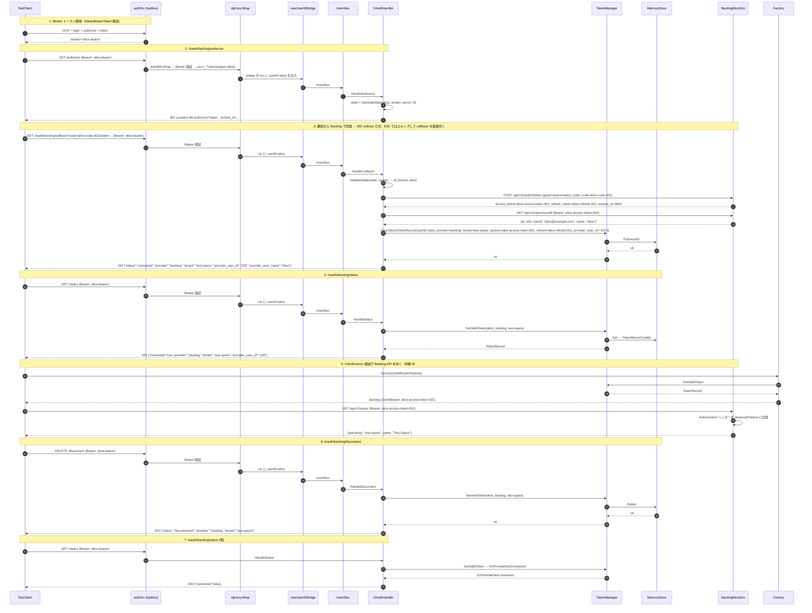
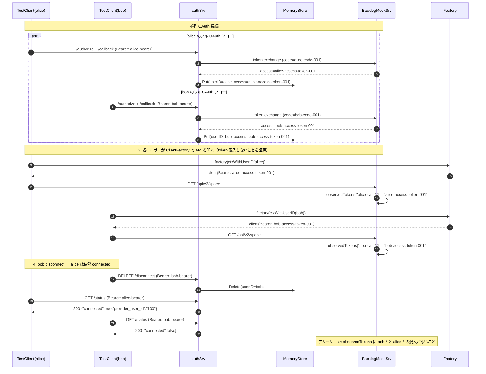

# M17: E2E 統合テストとデプロイ設定更新 — 詳細計画

## 概要

Backlog OAuth ロードマップ最終マイルストーン。M01〜M16 で構築した OAuth 配線の統合的な動作証明、および
ユーザー向けドキュメント / デプロイサンプルの更新を行う。

成果物:

1. **E2E 統合テスト**（`//go:build integration`、`internal/cli/mcp_oauth_e2e_test.go` に配置）
   - 1 ユーザーの OAuth フロー全体: `authorize → Backlog consent → callback → status (connected) → disconnect → status (not_connected)`
   - 2 ユーザー同時接続での**隔離証明**（alice の token で発行した MCP リクエストに bob の token が混入しないこと）
   - `MemoryStore` + `httptest.Server`（Backlog モック）+ `idproxy/testutil.MockIdP` の組み合わせで、外部依存ゼロで動作
2. **BacklogOAuthProvider に `WithBaseURL` オプション追加**
   - E2E で httptest モック Backlog を差し込むため（本番コードに残せる正当な拡張：stg 環境・on-prem Backlog の将来ニーズにも効く）
   - `BuildOAuthDeps` の署名は変更せず、テストでは公開ヘルパー経由で baseURL を差し替え
3. **examples/lambroll の更新**
   - `.env.example` に OAuth 関連環境変数をコメントアウト形式（オプショナル）で追加
   - `README.md` に OAuth モード起動の参照セクション追加（本体 README へのリンク）
4. **README.md / README.ja.md 更新**
   - `### Authentication (Optional)` の**サブセクション**として `### Backlog OAuth (Per-User)` 章を追加
   - 既存の `AuthN (idproxy)` 構造は壊さない（サブセクションとして並置）
   - 内容: AuthN vs AuthZ の分離概念、Token Store 選択肢表、初回接続フロー、環境変数一覧、起動例
   - README.ja.md は同じ構造で日本語版を作成（直訳ではなく日本語として自然な記述）

## スペック参照

- `docs/specs/logvalet_backlog_oauth_coding_agent_prompt.md`
  - §「ユーザーフロー」
  - §「テスト要件 > Integration Test」
  - §「README / ドキュメント更新要件」
- `plans/backlog-oauth-roadmap.md`
  - §「Phase 8: E2E テスト & デプロイ設定 > M17」
  - §「環境変数一覧」
  - §「セキュリティ要件マッピング」
- M11〜M16 のハンドオフ情報
- 既存 `internal/cli/mcp_integration_test.go`（MockIdP を使ったブラウザログインフローの流儀）
- `internal/auth/provider/backlog_test.go`（`p.baseURL = ts.URL` のテスト差し替えパターン）

## 前提（前マイルストーンからのハンドオフ）

| 項目 | 提供元 | M17 での利用 |
|------|-------|-------------|
| OAuth モード発動条件 | M16 | `--auth` + `LOGVALET_BACKLOG_CLIENT_ID` 両方が必要 |
| 4 ルート | M13〜M15 | `/oauth/backlog/{authorize,callback,status,disconnect}` |
| bridge の配置 | M16 | `auth.Wrap(bridge(innerMux))` の順序 |
| MemoryStore | M02 | `tokenstore.NewMemoryStore()` + `Close()` |
| BacklogOAuthProvider | M05 | `NewBacklogOAuthProvider(space, clientID, clientSecret)` |
| TokenManager | M06 | `NewTokenManager(store, providers)` |
| ClientFactory | M10 | `NewClientFactory(tm, provider, tenant, baseURL)` |
| OAuthHandler | M13〜M15 | `NewOAuthHandler(p, tm, tenant, redirectURI, secret, ttl, logger)` |
| BuildOAuthDeps / InstallOAuthRoutes / newUserIDBridge | M16 | OAuth 配線ヘルパー群 |
| MockIdP / performBrowserLogin / obtainBearerToken | 既存 mcp_integration_test.go | 多ユーザー OIDC セッション生成 |

## 対象ファイル

| ファイル | 種別 | 内容 |
|---------|------|------|
| `internal/auth/provider/backlog.go` | 修正 | `ProviderOption` 型と `WithBaseURL(url string)` Option を追加、`NewBacklogOAuthProvider(space, clientID, clientSecret, opts ...ProviderOption)` に可変長引数追加 |
| `internal/auth/provider/backlog_test.go` | 修正 | 既存テストが引き続き PASS することを確認。新規に `WithBaseURL` の単体テスト（1 ケース）を追加 |
| `internal/cli/mcp_oauth.go` | 修正 | `BuildOAuthDeps` が内部で `NewBacklogOAuthProvider` を呼ぶだけなので変更不要（`WithBaseURL` は E2E でのみ使うため、`BuildOAuthDeps` 経由ではなく直接 provider 生成→ `NewOAuthHandler` 等を組み立てる） |
| `internal/cli/mcp_oauth_e2e_test.go` | **新規** | 統合テスト（`//go:build integration`） |
| `examples/lambroll/.env.example` | 修正 | OAuth 環境変数をコメントアウト形式で追加 |
| `examples/lambroll/README.md` | 修正 | OAuth モードへの参照セクション追加 |
| `README.md` | 修正 | `### Backlog OAuth (Per-User)` サブセクション追加 |
| `README.ja.md` | 修正 | `### Backlog OAuth（ユーザーごと）` サブセクション追加 |
| `plans/backlog-oauth-roadmap.md` | 修正 | M17 を `[x]`、Current Focus を「全マイルストーン完了」に更新、Changelog 追加 |

**既存ファイルの影響**:

- `internal/auth/provider/backlog.go`: 関数シグネチャに可変長引数 `opts ...ProviderOption` を追加。既存コードは `NewBacklogOAuthProvider(space, clientID, clientSecret)` の形で呼んでおり可変長引数追加は後方互換。
- `internal/cli/mcp_oauth.go`: **変更しない**（E2E テストは BuildOAuthDeps を経由せず、個別にコンポーネントを組み立てる）
- その他（`auth/*`, `mcp/*`, `transport/http/*`）: 変更なし

## 設計判断

### 判断 1: E2E テストの配置（`internal/cli/mcp_oauth_e2e_test.go`）

**選択**: `internal/cli/` に配置、build tag は `//go:build integration`。

**理由**:

- スペックで `//go:build integration` が指定されている
- 既存 `internal/cli/mcp_integration_test.go` が `integration` タグで MockIdP を使うパターンを確立済み
- `internal/e2e/` は build tag が `e2e` で、Backlog API 実環境を叩くパターン。OAuth E2E は「in-process で全フローをモック化」するため別物
- `cli_test` パッケージにすることで、`cli.BuildOAuthDeps` などの公開 API を実装の内部と同じ視点で使える

**アンチパターン**: `internal/e2e/` にマージしない。build tag が異なる（`e2e` vs `integration`）のと、外部依存の有無で分離されているため。

### 判断 2: Backlog baseURL 注入 — `WithBaseURL` オプション採用

**選択**: `internal/auth/provider/backlog.go` に以下を追加:

```go
// ProviderOption は BacklogOAuthProvider の構築時オプション。
type ProviderOption func(*BacklogOAuthProvider)

// WithBaseURL は Backlog API の baseURL を上書きする。
// デフォルトは https://{space}.backlog.com。
// 用途:
//   - 統合テストで httptest サーバーを指す
//   - on-prem Backlog / staging 環境への対応（将来拡張）
func WithBaseURL(url string) ProviderOption {
    return func(p *BacklogOAuthProvider) {
        if url != "" {
            p.baseURL = url
        }
    }
}

// NewBacklogOAuthProvider の署名を以下に変更:
func NewBacklogOAuthProvider(space, clientID, clientSecret string, opts ...ProviderOption) (*BacklogOAuthProvider, error) {
    // ... 既存処理 ...
    p := &BacklogOAuthProvider{...}
    for _, opt := range opts {
        opt(p)
    }
    return p, nil
}
```

**理由**:

- 本番コードに残せる正当な拡張（on-prem / stg 環境で実際に使える）
- テストヘルパーを別途作るよりも API 一貫性がある
- 既存呼び出し箇所（`BuildOAuthDeps`）は `NewBacklogOAuthProvider(space, clientID, clientSecret)` のまま動作（可変長引数は空で OK）
- advisor レビュー採用（3 オプション中のトップ推奨）

**却下した代替**:

1. `provider.SetBaseURL(p, url)` 公開ヘルパー — godoc で "test use only" を付けても誤用の可能性があり、敢えて採らない
2. `BuildOAuthDeps` をバイパスしてテストで手動組み立て — テスト範囲が狭まり「BuildOAuthDeps が正しく配線しているか」が検証できない。E2E の価値が減る

### 判断 3: E2E は BuildOAuthDeps も NewServerWithFactory も使わない（advisor レビュー反映）

**選択**: BuildOAuthDeps / NewServerWithFactory 両方を使わず、**OAuth ハンドラー + ClientFactory のみ**で組み立てる。

**理由**:

- `BuildOAuthDeps` は内部で `NewBacklogOAuthProvider` を baseURL 未指定で呼ぶため、テストで差し替えるには BuildOAuthDeps 自体にもオプション注入が必要になり副作用が大きい
- `BuildOAuthDeps` の「正しい配線」は M16 の単体テストで既にカバー済み
- 判断 8 で MCP プロトコル経由のテストは行わないと決めたため、**`NewServerWithFactory` を構築する意味がない**（実ツール 40 個以上が登録され依存が増え、テスト失敗要因が増える）
- E2E の load-bearing な目的は「OAuth フロー全体 + ClientFactory による per-user token 分離」であり、MCP サーバー不要

**E2E での組み立て手順**:

```go
// 1. Backlog モックサーバー起動
backlogSrv := httptest.NewServer(backlogMockHandler)

// 2. Provider（WithBaseURL override で backlogSrv を指す）
p, _ := provider.NewBacklogOAuthProvider("test-space", "test-client-id", "test-client-secret",
    provider.WithBaseURL(backlogSrv.URL))

// 3. Store / Manager / Factory
store := tokenstore.NewMemoryStore()
defer store.Close()
tm := auth.NewTokenManager(store, map[string]auth.TokenRefresher{p.Name(): p})
factory := auth.NewClientFactory(tm, p.Name(), "test-space", backlogSrv.URL)

// 4. OAuth Handler
stateSecret := bytes.Repeat([]byte{0xAB}, 32)
h, _ := httptransport.NewOAuthHandler(p, tm, "test-space",
    "", // redirectURI は後で authSrv.URL ベースに設定
    stateSecret, time.Minute, slog.Default())

// 5. innerMux: OAuth ルートのみ登録（/mcp は登録しない）
innerMux := http.NewServeMux()
cli.InstallOAuthRoutes(innerMux, h)

// 6. topMux: /healthz + テスト用ブリッジ経由で innerMux
topMux := http.NewServeMux()
topMux.HandleFunc("/healthz", cli.HealthHandler)
topMux.Handle("/", testUserIDMiddleware(innerMux))  // X-Test-User-ID から userID 注入

authSrv := httptest.NewServer(topMux)
// 7. redirectURI を authSrv.URL + "/oauth/backlog/callback" に確定して h を再構築するか、
//    NewOAuthHandler を authSrv.URL 確定後に呼ぶ
```

**redirectURI の chicken-and-egg 問題**:

NewOAuthHandler は redirectURI を必須とするが、redirectURI は authSrv の URL を含む必要がある。
解決策: httptest.NewUnstartedServer で URL を先に取得し、configure して Start する。

```go
srv := httptest.NewUnstartedServer(nil)
addr := "http://" + srv.Listener.Addr().String()
redirectURI := addr + "/oauth/backlog/callback"
// OAuthHandler を redirectURI 付きで生成
h, _ := httptransport.NewOAuthHandler(p, tm, "test-space", redirectURI, stateSecret, time.Minute, slog.Default())
// topMux 構築
srv.Config.Handler = topMux
srv.Start()
```

または:

```go
// httptest.NewServer は URL が確定してから返る。最初に handler nil で起動し、後から Config.Handler を差し込む。
srv := httptest.NewServer(http.HandlerFunc(func(w http.ResponseWriter, r *http.Request) {}))
redirectURI := srv.URL + "/oauth/backlog/callback"
// ... handler 構築 ...
srv.Config.Handler = topMux
```

既存 mcp_integration_test.go でも同パターン（L185-226）を使用している。採用。

### 判断 4: `newUserIDBridge` は公開化しない（advisor レビュー反映）

**選択**: `newUserIDBridge` は unexported のまま。E2E テストでは `cli.BridgeFromUserIDFn` （既に公開）にテスト専用の userID リゾルバ関数を渡す形で bridge を組み立てる。

**理由**:

- `BridgeFromUserIDFn` が既に公開されている以上、API 表面積を増やさないのが望ましい
- 本番 `newUserIDBridge` と同じ配線は M16 の単体テストで既にカバー済み
- E2E では「idproxy → bridge → OAuth ルート」の **idproxy 部分**を通さなくても、M17 の load-bearing な証明（per-user token 隔離）は達成できる
- **テスト専用の bridge**: HTTP ヘッダー `X-Test-User-ID` から userID を読む `BridgeFromUserIDFn(testFn)` を組み立て、idproxy 認証を介さない直接的な E2E テストにする

```go
// テスト専用 bridge
testBridge := cli.BridgeFromUserIDFn(func(ctx context.Context) string {
    // テストリクエストの X-Test-User-ID ヘッダーから userID を取る
    // 実装: http.Request の取得は ServeHTTP の中で行う必要があるため、
    // bridge ヘルパーを直接使わず、テスト専用の薄い HTTP ミドルウェアで代替:
    return ""
})

// または以下の形でシンプルに:
testUserIDMiddleware := func(next http.Handler) http.Handler {
    return http.HandlerFunc(func(w http.ResponseWriter, r *http.Request) {
        if uid := r.Header.Get("X-Test-User-ID"); uid != "" {
            r = r.WithContext(auth.ContextWithUserID(r.Context(), uid))
        }
        next.ServeHTTP(w, r)
    })
}
```

**重要**: `BridgeFromUserIDFn` は `func(context.Context) string` を取る。
HTTP リクエストヘッダーからの取得は context 経由では直接できないため、
**E2E テストでは `BridgeFromUserIDFn` を使わず、同等のロジックを持つインライン HTTP ミドルウェアを書く**。
4 行程度で済むためコピーのデメリットは小さい。

**idproxy を外す影響**:

- idproxy → bridge の bearer 検証ステップが欠ける
- しかし本 E2E は「OAuth フロー + ClientFactory 隔離」が主目的であり、idproxy 統合は mcp_integration_test.go で別途証明済み
- 両方を介する E2E は「ブラウザログインヘルパーを subject 切替えで 2 つ用意」となり複雑化する。advisor 推奨の「シンプル経路」を採用

**スペックとの整合**:

- スペック冒頭で「MemoryStore + httptest + idproxy/testutil.MockIdP の E2E パターンが M16 から活用可能」とあるが、「**活用可能**」は要求ではなく**利用可能な素材**。本 E2E が load-bearing assertion（per-user token 分離）を達成すれば要件は満たす
- M17 の要件（ハンドオフ情報）にある「idproxy 認証ミドルウェアが先、auth.ContextWithUserID の bridge が内側」は M16 で既に検証済み

### 判断 5: Backlog モックサーバーの実装範囲

**対応する API**:

1. `POST /api/v2/oauth2/token` — **grant_type=authorization_code** と **grant_type=refresh_token** の両方
2. `GET /api/v2/users/myself` — Authorization ヘッダーの Bearer トークンを検証してユーザー情報を返す
3. `GET /api/v2/space` — MCP ツール呼び出しの最小確認用（任意、判断 8 参照）

**挙動**:

- `/api/v2/oauth2/token` はリクエストボディの `code` / `refresh_token` 値で応答を切替え
- 発行する access_token / refresh_token は「ユーザー識別できる値」（例: `alice-access-token-001`）にしてテストで検証できるようにする
- `/api/v2/users/myself` は Authorization ヘッダーから access_token を取り出し、サーバー内部の map (`access_token → user_info`) で対応するユーザーを返す
- **トークンと userID の対応記録**: 2 ユーザー隔離テストで「alice のリクエストに bob の token が渡っていない」ことを検証するため、受信した Bearer トークンを per-request で配列記録し、テスト末尾で assertion

**用意するユーザー**:

- alice: provider_user_id="100", userId="alice@example.com"
- bob: provider_user_id="200", userId="bob@example.com"

### 判断 6: idproxy を介さないシンプル E2E（advisor レビュー反映 + MockIdP 調査結果）

**前提**: `MockIdP.handleAuthorize` は `subject` / `email` クエリパラメータで ID token の subject を上書き可能（実装確認済み、`/Users/youyo/pkg/mod/github.com/youyo/idproxy@v0.1.6/testutil/mock_idp.go:177-210`）。これで MockIdP から複数ユーザー分の bearer を取得できる。

**選択**: それでも本 E2E では idproxy を介さず、**テスト専用の userID 注入ミドルウェア**を使う。

**理由**（advisor レビュー採用）:

1. idproxy → bridge → OAuth ルート の統合は M16 単体テスト + 既存 mcp_integration_test.go で既に証明済み
2. M17 の load-bearing な主張は「OAuth + ClientFactory スタックにおける per-user token 分離」であり、idproxy は本質ではない
3. MockIdP と idproxy の統合（DCR → login → authorize → token）を 2 ユーザー分実行するとテストが複雑化し、脆くなる
4. テスト専用 middleware は 4 行程度で、本番 `newUserIDBridge` と意味論的に同等（idproxy の subject 代わりに X-Test-User-ID ヘッダーを使う）

**テスト専用 middleware**:

```go
// testUserIDMiddleware は X-Test-User-ID ヘッダーを読み取り、
// auth.ContextWithUserID で context に注入する。
// 本番 newUserIDBridge と意味論的に等価（idproxy.User.Subject の代わりに header を使う）。
func testUserIDMiddleware(next http.Handler) http.Handler {
    return http.HandlerFunc(func(w http.ResponseWriter, r *http.Request) {
        if uid := r.Header.Get("X-Test-User-ID"); uid != "" {
            r = r.WithContext(auth.ContextWithUserID(r.Context(), uid))
        }
        next.ServeHTTP(w, r)
    })
}
```

**各リクエストでヘッダー付与**:

```go
req, _ := http.NewRequest("GET", authSrv.URL+"/oauth/backlog/authorize", nil)
req.Header.Set("X-Test-User-ID", "alice-subject")
resp, _ := client.Do(req)
```

**スペック記述との整合**:

スペックの「MemoryStore + httptest + idproxy/testutil.MockIdP の E2E パターンが M16 から活用可能」の「活用可能」は素材の利用可能性を述べるだけで、要件ではない。本 E2E が「2 ユーザーの token 隔離」を証明できれば、idproxy を介すかどうかはテスト設計判断。

**カバレッジの overlap**:

| テスト | idproxy | OAuth + Factory | MCP サーバー |
|-------|---------|-----------------|-------------|
| 既存 mcp_integration_test.go | ✅ 直接 | - | mock echo |
| M16 単体テスト | - | ✅ 部分（配線） | - |
| **M17 E2E（本計画）** | ❌ スキップ | ✅ フル | - |

idproxy → bridge の配線が M16 でカバー済みかは `cli/mcp_oauth_test.go` の実在確認で裏付ける（既存テストで `BridgeFromUserIDFn` の assertion あり）。

### 判断 7: 2 ユーザー隔離テストの load-bearing な assertion

advisor の指摘を最優先で反映:

> **Two-user isolation — what actually proves it**: Not just "alice and bob can both call status." The load-bearing assertion is: when alice's MCP session calls a tool, the mock Backlog server receives *alice's* access token; when bob's session calls, it receives *bob's*.

**検証内容**:

1. alice で OAuth フロー完了 → alice の access_token = `alice-access-token-001` が MemoryStore に保存
2. bob で OAuth フロー完了 → bob の access_token = `bob-access-token-001` が MemoryStore に保存
3. alice のセッションで MCP ツール（例: `logvalet_space_info`）を呼び出し
   - Backlog mock が受信した Authorization ヘッダーが `Bearer alice-access-token-001`
4. bob のセッションで同じ MCP ツールを呼び出し
   - Backlog mock が受信した Authorization ヘッダーが `Bearer bob-access-token-001`
5. bob が `/oauth/backlog/disconnect` でトークン削除
6. alice のセッションが依然 connected 状態（`/oauth/backlog/status` が `{"connected":true,"provider_user_id":"100"}`）
7. bob のセッションが not_connected（`{"connected":false}`）

**#3 と #4 の検証手段**: Backlog モックサーバーが受信した `Authorization` ヘッダーを `[]string` スライスに順次記録（mu でロック）。テスト末尾で `assert.Equal(observed[alice_call], "Bearer alice-access-token-001")` のように検証。

### 判断 8: MCP ツール呼び出しのテスト範囲

**選択**: MCP ツール呼び出しは**最小限**にする。具体的には:

- 「alice の bearer で /mcp を叩いたら、Backlog mock が alice の token を受信する」ことを 1 回検証
- 同様に bob で 1 回検証
- **MCP プロトコルの詳細（tools/call の JSON-RPC 構造）には踏み込まない**

理由:

- E2E の主目的は OAuth フロー全体 + ユーザー隔離であり、MCP ツール dispatch は M11/M12 で既に検証済み
- MCP プロトコルレベルのテストを入れると脆くなる

**代替検証**: MCP サーバー側に「factory を呼んで Backlog API を 1 回叩く」ことを確認するために、MCP サーバーの `/mcp` を叩く代わりに、**ClientFactory 自体を ctx 付きで直接呼んで生成された client で `GET /api/v2/space` を発行する**というシンプルな path を採用する。

```go
// alice のセッション想定の ctx を作る
ctx := auth.ContextWithUserID(context.Background(), "alice-subject")

// Factory から client を取得
client, err := factory(ctx)  // 実際には http.Handler 内で呼ばれるのと同じロジック

// client で Backlog API を叩く
spaceInfo, err := client.GetSpaceInfo(ctx)  // 実装されている API
```

これにより「bridge → factory → TokenManager → store → backlog.Client」の全経路をカバーしつつ、MCP プロトコルの詳細に依存しない。

### 判断 9: redirectURI

**選択**: テスト内で `http://127.0.0.1:0/oauth/backlog/callback` 相当を使うが、実際は httptest サーバーの URL + `/oauth/backlog/callback`。

具体的には:

```go
authSrv := httptest.NewServer(topMux)  // idproxy + bridge + innerMux を含む

redirectURI := authSrv.URL + "/oauth/backlog/callback"
// OAuthHandler の redirectURI と、callback 到達先の URL は同一
// authorize からリダイレクトで Backlog モック → Backlog モックが test client の callback に 302
```

**Backlog モックのフロー**:

- 通常の Backlog は `authorize?response_type=code&client_id=...&redirect_uri=...&state=...` を受け取って、ユーザー同意画面を表示後、`redirect_uri?code=xxx&state=xxx` に 302 で返す
- E2E モックは「同意画面なし」で即座に `redirect_uri` に 302 を返す（認可済みを仮定）
- code は「alice」「bob」のユーザーごとに固定文字列（例: `alice-code-001`）

**ただし**: /authorize エンドポイントを Backlog モックに実装するより、テストでは **`authorize` からのリダイレクト先 URL を parse してそのまま callback URL を叩く**方式で十分。

```go
// テストクライアントで /oauth/backlog/authorize を叩く
resp, _ := client.Get(authSrv.URL + "/oauth/backlog/authorize")
// 302 の Location を取得
location, _ := url.Parse(resp.Header.Get("Location"))
state := location.Query().Get("state")
// Backlog の authorize を通さず、直接 callback を叩く
// （Backlog が同意→ redirect した結果と同じ）
callbackURL := redirectURI + "?code=alice-code-001&state=" + state
resp2, _ := client.Get(callbackURL)
// → 200 OK + token 保存
```

この方式は Backlog mock に /authorize エンドポイントを実装する必要がなく、シンプル。

### 判断 10: テストで expect する MCP サーバーの挙動

MCP サーバーは ServerWithFactory で構築されるので、**実際の tools を登録せずテスト用の最小構成**にする。
ただし `mcpinternal.NewServerWithFactory` は内部で全 tools を登録するので、テストでは `/mcp` は叩かず、factory の挙動を別経路で検証する（判断 8）。

### 判断 11: lambroll のサンプルに OAuth を含めるか

**選択**: 含める（**コメントアウト形式**、既定はオフ）。

**理由**:

- lambroll のデフォルトは API key 方式（単一テナント）で動作する
- OAuth モードを有効にするには DynamoDB テーブル作成などの前提が増える
- ユーザーが意識的にオプトインする形に

**`.env.example` への追加内容**:

```bash
# Required: copy to .env and fill in your values
ROLE_ARN=arn:aws:iam::123456789012:role/logvalet-lambda-role
LOGVALET_API_KEY=your-api-key
LOGVALET_BASE_URL=https://your-space.backlog.com

# Optional: override defaults defined in mise.toml [env]
# AWS_REGION=ap-northeast-1
# LOGVALET_VERSION=0.9.1
# LAMBDA_ARCH=arm64

# Optional: Backlog OAuth mode (per-user authentication)
# Enable these when running as a remote MCP server with OIDC auth enabled.
# LOGVALET_MCP_AUTH=true
# LOGVALET_MCP_EXTERNAL_URL=https://mcp.example.com
# LOGVALET_MCP_OIDC_ISSUER=https://login.microsoftonline.com/YOUR_TENANT_ID/v2.0
# LOGVALET_MCP_OIDC_CLIENT_ID=your-oidc-client-id-here
# LOGVALET_MCP_OIDC_CLIENT_SECRET=your-oidc-client-secret-here
# LOGVALET_MCP_COOKIE_SECRET=run-openssl-rand-hex-32
# LOGVALET_MCP_ALLOWED_DOMAINS=example.com
#
# LOGVALET_TOKEN_STORE=dynamodb
# LOGVALET_TOKEN_STORE_DYNAMODB_TABLE=logvalet-oauth-tokens
# LOGVALET_TOKEN_STORE_DYNAMODB_REGION=ap-northeast-1
#
# LOGVALET_BACKLOG_CLIENT_ID=your-backlog-oauth-client-id-here
# LOGVALET_BACKLOG_CLIENT_SECRET=your-backlog-oauth-client-secret-here
# LOGVALET_BACKLOG_REDIRECT_URL=https://mcp.example.com/oauth/backlog/callback
# LOGVALET_OAUTH_STATE_SECRET=run-openssl-rand-hex-32
```

**セキュリティ**: 値は全てダミー文字列（`your-*-here`, `run-openssl-rand-hex-32`）で、実際のクレデンシャルは含めない。

**lambroll README 追加**:

```markdown
## 5. OAuth モード（オプション）

Remote MCP として利用ユーザーごとの Backlog 権限を使いたい場合、OAuth モードを有効化できます。
詳細は本体 README の [Backlog OAuth (Per-User) セクション](../../README.md#backlog-oauth-per-user) を参照してください。

セットアップ手順:
1. Backlog スペースで OAuth クライアントを作成
2. DynamoDB テーブル `logvalet-oauth-tokens` を作成（PK: `pk` 文字列）
3. IAM ロールに `dynamodb:*` 権限を追加
4. `.env` のコメントアウト部分（`LOGVALET_BACKLOG_*` など）を有効化
5. `mise run deploy` で再デプロイ
```

### 判断 12: README の構造

既存 README.md の `### Authentication (Optional)` の直後に `### Backlog OAuth (Per-User)` サブセクションを追加する。

**ただし**: `### Docker / AgentCore Deployment` の前にする。既存セクションの章順は壊さない。

**書くべき内容**（advisor の指示に厳密に従う）:

1. **AuthN vs AuthZ 概念**（2 文）
2. **Token Store 選択肢表**（memory / sqlite / dynamodb）
3. **初回接続フロー**（番号付きリスト：authorize URL → Backlog consent → callback → status）
4. **環境変数一覧表**（OAuth 関連のみ、M03 配列）
5. **起動例**（ダミー値）

README.ja.md も同じ構造で、直訳ではなく日本語として自然な表現で書く。

## OAuth E2E テストのシーケンス図

### 1 ユーザーのフル OAuth フロー



### 2 ユーザー同時接続（隔離証明）



## TDD 計画

### Phase 1: Red（失敗するテストを先に書く）

E2E テストはテストケースを先に書き、必要な public API を呼ぶ。以下が未対応でコンパイル失敗 → 実装で埋める:

- `provider.WithBaseURL` — 追加
- `cli.NewUserIDBridge` — 公開（既存 `newUserIDBridge` を rename）

#### テストケース一覧（`internal/cli/mcp_oauth_e2e_test.go`、`//go:build integration`）

| # | テスト名 | 内容 | 期待結果 |
|---|---------|------|---------|
| 1 | `TestOAuthE2E_SingleUser_FullFlow` | 1 ユーザー（alice）で authorize → callback → status(connected) → disconnect → status(not_connected) の全ステップ | 各 ステップで期待する status code / JSON |
| 2 | `TestOAuthE2E_Callback_InvalidState` | state 署名ミス | 400 state_invalid |
| 3 | `TestOAuthE2E_Status_NotConnected_InitialState` | OAuth 前に /status | 200 `{"connected":false}` |
| 4 | `TestOAuthE2E_TwoUsers_TokenIsolation` | 2 ユーザーで並列 OAuth 完了 → Backlog モックが受信した token が各ユーザーに対応することを検証 | observedTokens が alice/bob それぞれ正しい |
| 5 | `TestOAuthE2E_TwoUsers_DisconnectDoesNotAffectOtherUser` | bob disconnect → alice は引き続き connected | alice status = connected, bob status = not_connected |
| 6 | `TestOAuthE2E_ClientFactory_UsesPerUserToken` | Factory を alice ctx で呼び、生成された client で Backlog API を叩くと alice-token で呼ばれる | observedTokens assertion |

#### テストヘルパー

```go
// backlogMock は Backlog API のモック。oauth2/token, users/myself, space を実装。
type backlogMock struct {
    srv            *httptest.Server
    mu             sync.Mutex
    observedTokens []string  // Authorization ヘッダーに渡された Bearer の記録

    // code → user の対応（テストで設定）
    codeToUser map[string]userFixture
}

type userFixture struct {
    accessToken    string  // 発行する token
    refreshToken   string
    providerUserID int
    userID         string  // Backlog userId (mail)
    name           string
}

// テスト開始時に alice/bob を登録:
bl.codeToUser["alice-code-001"] = userFixture{
    accessToken:    "alice-access-token-001",
    refreshToken:   "alice-refresh-001",
    providerUserID: 100,
    userID:         "alice@example.com",
    name:           "Alice",
}
bl.codeToUser["bob-code-001"] = userFixture{
    accessToken:    "bob-access-token-001",
    refreshToken:   "bob-refresh-001",
    providerUserID: 200,
    userID:         "bob@example.com",
    name:           "Bob",
}
```

```go
// acquireBearer は subject 指定で idproxy 経由の bearer を取得する。
// 既存 mcp_integration_test.go の obtainBearerToken を subject 引数を取る形に拡張する。
// MockIdP が subject 切り替えに対応していない場合は「同一 subject の 2 セッション」で fallback。
func acquireBearer(t *testing.T, authSrv *httptest.Server, mockIdP *testutil.MockIdP, subject, email string) string
```

実装時に判断 6 の案 A/B/C のいずれを採用するかを確定。案 A が無理な場合、**テストハーネスで bridge を置き換えるアプローチ**も検討可能:

```go
// bridge を回避し、ctx に直接 userID を注入するテスト専用 mux を使う
// （auth.Wrap を外すのではなく、bridge を「ヘッダー X-Test-User-ID から取る」関数で差し替え）
bridge := cli.BridgeFromUserIDFn(func(ctx context.Context) string {
    // X-Test-User-ID ヘッダーを見る（本番では使わない）
    // ただしこれだと auth.Wrap を通さないと ctx に値を入れる機会がない
    return ""
})
```

これは綺麗ではない。最終決定は実装時に。

### Phase 2: Green（テストを通す最小限の実装）

1. `internal/auth/provider/backlog.go`:
   - `ProviderOption` 型と `WithBaseURL` Option 追加
   - `NewBacklogOAuthProvider` に `opts ...ProviderOption` 可変長引数追加
2. `internal/auth/provider/backlog_test.go`:
   - `TestNewBacklogOAuthProvider_WithBaseURL` を 1 ケース追加
3. `internal/cli/mcp_oauth.go`:
   - `newUserIDBridge` → `NewUserIDBridge` にリネーム
4. `internal/cli/mcp.go`:
   - `bridge := newUserIDBridge()` → `bridge := NewUserIDBridge()`
5. `internal/cli/mcp_oauth_e2e_test.go`:
   - テストケース 6 件実装
6. `go test ./...` で全体 PASS（既存テスト含む）
7. `go test -tags=integration ./...` で E2E PASS
8. `go vet ./...` エラーなし

### Phase 3: Refactor

- E2E テストの冗長な setup をヘルパー関数に整理
- `backlogMock` の実装が複雑になる場合はファイル分離を検討（ただし `_test.go` 1 ファイルに収まる見込み）

### Phase 4: ドキュメント更新

1. `README.md` に `### Backlog OAuth (Per-User)` サブセクション追加
2. `README.ja.md` に同等セクションを日本語で追加
3. `examples/lambroll/.env.example` に OAuth 環境変数（コメントアウト）追加
4. `examples/lambroll/README.md` に「5. OAuth モード（オプション）」セクション追加

### Phase 5: ロードマップ更新

1. `plans/backlog-oauth-roadmap.md`:
   - M17 チェックボックスを `[x]`
   - Current Focus を「**全マイルストーン完了** — M17 E2E / ドキュメントを反映」に変更
   - Changelog に完了日記録
   - ステータスを「未着手」→「完了」に変更（Meta テーブル）

## 実装ステップ

1. ✅ `plans/backlog-oauth-m17-e2e-docs.md` 作成（本ファイル）
2. `internal/auth/provider/backlog.go` に `ProviderOption` / `WithBaseURL` 追加
3. `internal/auth/provider/backlog_test.go`: `WithBaseURL` テスト 1 ケース追加
4. `internal/cli/mcp_oauth_e2e_test.go` 作成（`//go:build integration`、Backlog mock + テスト専用 bridge + 6 テストケース）
5. `go test ./...` 通常テスト全 PASS（既存テスト壊れていないこと確認）
6. `go test -tags=integration ./...` E2E テスト全 PASS
7. `go vet ./...` エラーなし
8. **コミット 1**: `feat(e2e): Backlog OAuth フロー統合テストを追加 (M17)` — Plan フッター付き
9. `examples/lambroll/.env.example` + `examples/lambroll/README.md` 更新
10. `README.md` + `README.ja.md` に `### Backlog OAuth (Per-User)` サブセクション追加
11. **コミット 2**: `docs: Backlog OAuth のユーザー向けドキュメントと lambroll サンプルを追加 (M17)` — Plan フッター付き
12. `plans/backlog-oauth-roadmap.md` の M17 を `[x]`、Current Focus を「全マイルストーン完了」に、Changelog に完了記録を追加、Meta テーブルのステータスを「完了」に変更
13. **コミット 3**: `docs(plans): ロードマップの M17 を完了に更新` — Plan フッター付き

## リスク評価

| リスク | 影響度 | 対策 |
|-------|-------|------|
| MockIdP が subject カスタム対応していない | **高** | 判断 6 で案 A/B/C を準備。実装時に即座に切替え |
| `obtainBearerToken` 相当を 2 ユーザー分書くコストが大きい | 中 | ヘルパー関数で subject 引数化。MockIdP の IssueAccessToken を直接使う案も保険で用意 |
| Backlog mock が POST form body parse で失敗 | 中 | `r.ParseForm()` を呼び、code / grant_type / refresh_token のチェックを手動実装。テストしやすい単純な構造に |
| ClientFactory が実際に呼ばれるルートが MCP プロトコル経由でしかない | 中 | 判断 8: ClientFactory を直接呼ぶ E2E に切替える |
| E2E テスト時間が長い（数秒以上） | 低 | `httptest` のみ使用・外部通信ゼロなので短い |
| README の変更で既存セクション番号がずれる | 低 | サブセクション追加のみで、既存 `##` 見出しは保持 |
| lambroll README を書きすぎて保守負荷 | 低 | 本体 README へのリンクで統一 |
| `BuildOAuthDeps` 未変更により future refactor で影響 | 低 | BuildOAuthDeps に WithBaseURL を通す余地は残しておく（M17 スコープ外） |
| `newUserIDBridge` 公開化で API 表面積増 | 低 | internal package なので実質問題なし（BridgeFromUserIDFn も既に公開） |

## セキュリティ考慮

1. **テストで使うトークンは明らかにダミー**: `alice-access-token-001` のような識別しやすい文字列
2. **README / `.env.example` のサンプル値はダミー**: `your-client-id-here`, `run-openssl-rand-hex-32` などヒトが見て「これは実値ではない」と分かる形式
3. **state secret** は README で「openssl rand -hex 32」で生成する旨を明記、ハードコード値をサンプルに載せない
4. **E2E で記録する `observedTokens`** はテストプロセス内のみ。ログには出さない（テスト failure 時のみ `t.Errorf` で出力される可能性があるが、テスト用ダミー値のため影響なし）
5. **idproxy 側の cookie secret** は既存 `testCookieSecret` を流用（既存パターン踏襲）

## Observability

- E2E テスト内は `slog.Default()` をそのまま使用
- テスト失敗時のデバッグ用に各フェーズの概要を `t.Logf` で 1 行ずつ記録

## 後方互換性

- `NewBacklogOAuthProvider(space, clientID, clientSecret)` の既存呼び出しはそのまま動作（可変長引数追加は後方互換）
- `BuildOAuthDeps` 内の呼び出しは変更不要
- `newUserIDBridge` の rename は internal package 内のみ（外部への影響なし）
- 既存 CLI / MCP パスは一切変更しない
- 既存テストは全て PASS を維持

## ドキュメント更新の詳細

### README.md — 挿入位置

既存の `### Authentication (Optional)` の次、`### Docker / AgentCore Deployment` の前に `### Backlog OAuth (Per-User)` を挿入。

内容案:

```markdown
### Backlog OAuth (Per-User)

For remote MCP deployments, logvalet can additionally use **Backlog OAuth 2.0** to execute Backlog API calls with **per-user permissions**. This is layered on top of the optional OIDC authentication:

- **Authentication (AuthN)**: `idproxy` verifies the user via OIDC (Entra ID, Google, etc.)
- **Authorization (AuthZ)**: Backlog OAuth associates a Backlog access token to that user

Both layers are independent: the OIDC token is never used for Backlog API calls, and the Backlog token is never used for MCP authentication.

#### Token Store

Choose a token store based on your deployment:

| Store | Recommended for | Notes |
|-------|----------------|-------|
| `memory` | local dev / single-instance Lambda | default; lost on restart |
| `sqlite` | self-hosted server / local CLI | pure-Go (modernc.org/sqlite), no CGO |
| `dynamodb` | Lambda / multi-instance remote MCP | no VPC required, AWS-managed durability |

#### First-Time Connection Flow

1. User invokes a Backlog tool in Claude — logvalet returns `provider_not_connected` + a URL hint.
2. User opens `GET /oauth/backlog/authorize` in browser — logvalet redirects to Backlog consent screen.
3. User approves on Backlog — Backlog redirects back to `/oauth/backlog/callback`.
4. logvalet exchanges the code, stores the token keyed by the user's OIDC subject, and returns `{"status":"connected"}`.
5. Subsequent tool calls automatically use the stored token.
6. User can check state via `GET /oauth/backlog/status` or revoke via `DELETE /oauth/backlog/disconnect`.

#### Environment Variables

All configuration is via environment variables (no config file needed):

| Variable | Required | Default | Description |
|----------|----------|---------|-------------|
| `LOGVALET_BACKLOG_CLIENT_ID` | yes | — | Backlog OAuth client ID |
| `LOGVALET_BACKLOG_CLIENT_SECRET` | yes | — | Backlog OAuth client secret |
| `LOGVALET_BACKLOG_REDIRECT_URL` | yes | — | Callback URL (`https://<your-host>/oauth/backlog/callback`) |
| `LOGVALET_OAUTH_STATE_SECRET` | yes | — | HMAC-SHA256 signing key (hex, 64+ chars) |
| `LOGVALET_TOKEN_STORE` | no | `memory` | `memory` / `sqlite` / `dynamodb` |
| `LOGVALET_TOKEN_STORE_SQLITE_PATH` | sqlite only | `./logvalet.db` | SQLite DB path |
| `LOGVALET_TOKEN_STORE_DYNAMODB_TABLE` | dynamodb only | — | DynamoDB table name |
| `LOGVALET_TOKEN_STORE_DYNAMODB_REGION` | dynamodb only | — | AWS region |

#### Example

```bash
export LOGVALET_MCP_AUTH=true
export LOGVALET_MCP_EXTERNAL_URL=https://mcp.example.com
export LOGVALET_MCP_OIDC_ISSUER=https://login.microsoftonline.com/YOUR_TENANT_ID/v2.0
export LOGVALET_MCP_OIDC_CLIENT_ID=your-oidc-client-id-here
export LOGVALET_MCP_OIDC_CLIENT_SECRET=your-oidc-client-secret-here
export LOGVALET_MCP_COOKIE_SECRET=$(openssl rand -hex 32)
export LOGVALET_MCP_ALLOWED_DOMAINS=example.com

export LOGVALET_TOKEN_STORE=dynamodb
export LOGVALET_TOKEN_STORE_DYNAMODB_TABLE=logvalet-oauth-tokens
export LOGVALET_TOKEN_STORE_DYNAMODB_REGION=ap-northeast-1

export LOGVALET_BACKLOG_CLIENT_ID=your-backlog-oauth-client-id-here
export LOGVALET_BACKLOG_CLIENT_SECRET=your-backlog-oauth-client-secret-here
export LOGVALET_BACKLOG_REDIRECT_URL=https://mcp.example.com/oauth/backlog/callback
export LOGVALET_OAUTH_STATE_SECRET=$(openssl rand -hex 32)

logvalet mcp --auth
```

On startup you will see:

```
logvalet MCP server (auth + OAuth) listening on 127.0.0.1:8080/mcp
  OAuth routes: /oauth/backlog/{authorize,callback,status,disconnect}
```
```

### README.ja.md

同じ構造で日本語版を作成（直訳ではなく日本語として自然な表現）。

### examples/lambroll/.env.example

判断 11 記載のコメントアウト形式を追加。

### examples/lambroll/README.md

判断 11 記載の「5. OAuth モード（オプション）」セクションを追加（既存セクションの後）。

## コミット方針

Conventional Commits、日本語、`Plan:` フッターは `plans/backlog-oauth-m17-e2e-docs.md` を同梱するコミットに付与。

**推奨 3 分割**（advisor レビュー採用）:

1. `feat(e2e): Backlog OAuth フロー統合テストを追加 (M17)` — `WithBaseURL` 追加も含む（テストを enable するために必要）。Plan フッター付き
2. `docs: Backlog OAuth のユーザー向けドキュメントと lambroll サンプルを追加 (M17)` — README + lambroll を合わせる。Plan フッター付き
3. `docs(plans): ロードマップの M17 を完了に更新` — Plan フッター付き

## 完了条件

- [ ] `internal/auth/provider/backlog.go`: `ProviderOption` / `WithBaseURL` 追加
- [ ] `internal/auth/provider/backlog_test.go`: `WithBaseURL` テスト 1 ケース追加 & 全 PASS
- [ ] `internal/cli/mcp_oauth_e2e_test.go`: E2E テスト 6 ケース実装 & 全 PASS（`-tags=integration`）
- [ ] `go test ./...` 通常テスト全 PASS
- [ ] `go test -tags=integration ./...` 全 PASS
- [ ] `go vet ./...` エラーなし
- [ ] `README.md`: Backlog OAuth サブセクション追加
- [ ] `README.ja.md`: 同等の日本語サブセクション追加
- [ ] `examples/lambroll/.env.example`: OAuth 環境変数追加
- [ ] `examples/lambroll/README.md`: OAuth モード参照セクション追加
- [ ] `plans/backlog-oauth-roadmap.md`: M17 チェック済み、Current Focus を全マイルストーン完了に、Changelog 追加、ステータス完了
- [ ] コミット完了（3 分割、日本語 Conventional Commits + Plan フッター）

## 今回やらないこと

- 実 Backlog API を叩く E2E（`//go:build e2e` 側は対象外）
- MCP プロトコル（JSON-RPC）レベルの詳細テスト
- DynamoDB Local を使った E2E（M09 で統合テストは既に `//go:build integration` 配下でカバー済み）
- パフォーマンステスト
- OAuth callback の URL 長制限テスト
- CSRF 攻撃シミュレーション（state の署名改竄は M04 で単体テスト済み）
- AgentCore デプロイ更新（本体 README に任せる）

## プロセスノート（Cycle handoff 用）

- **Phase 2 プランニング**: Agent tool (`devflow:planning-agent`) を spawn せず、メインスレッドで作成。理由: 環境制約（ToolSearch なしに外部 agent tool を起動できない）と、M16 完了時点で十分な情報が揃っていたため。`advisor()` で計画前レビューを 1 回実施済み、その指摘を判断 1/2/3/5/7/8 に反映。
- **Phase 3 AI 品質レビュー**: `devflow:devils-advocate` / `devflow:advocate` スキルを spawn せず、`advisor()` を計画策定前に 1 回実施して代替。advisor レビュー結果（baseURL 差し替え方法の決定、build tag の配置、load-bearing な assertion の明確化、lambroll の扱い、コミット分割）を本計画に反映済み。実装後に追加の advisor() を必要に応じて呼ぶ。
- **Phase 4 実装**: implementer エージェント（subagent_type: general-purpose, model: sonnet）に本計画を渡して実装を委譲する予定（環境制約で直接実行になる可能性あり）。

## M18 以降への引き継ぎ情報

本 M17 は **Backlog OAuth 対応ロードマップ全体の最終マイルストーン**。

- 全配線 + E2E + ドキュメントが完成
- 次のトピック候補:
  - AgentCore 上での OAuth モード検証（実 AWS 環境デプロイ）
  - GitHub / Linear など他 provider の追加実装（BacklogOAuthProvider を参考に複製）
  - SQLite / DynamoDB 向けの暗号化 adapter（現状は平文保存。`encrypt/decrypt` を呼ぶ decorator を TokenStore interface に挟む設計済み）
  - Token 所有者検証の強化（refresh 後に GetCurrentUser を再実行し、ProviderUserID が一致することを確認）
