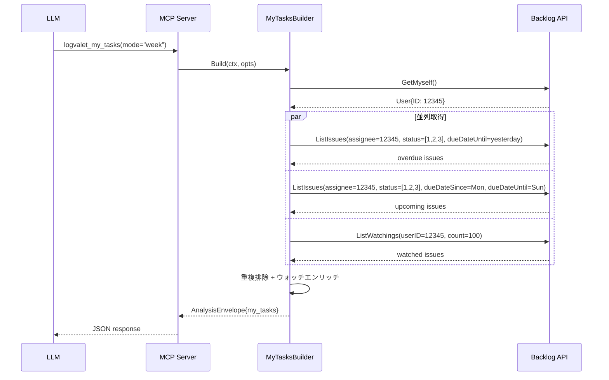

# MCP サーバーツール拡充 — スキルとのギャップ解消

## 概要

logvalet の 14 スキルと 41 MCP ツールの差分を解消し、MCP 経由でもスキルと同等の操作を実現する。

## コンテキスト

E2E テストで「石澤の今週のタスク」を取得しようとした際、`logvalet_issue_list` に assignee/status/due_date フィルタがなく、全件取得 → jq フィルタが必要になった。結果がトークン上限を超過し、MCP 単体では実用に耐えないことが判明。

スキル 14 個のうち、LLM 判断が主体のもの（draft, intelligence, risk, triage, decisions, spec-to-issues）は既存 MCP ツールがデータソースとして十分。**不足しているのはデータ取得レイヤーの 3 点:**

## ギャップ分析

| スキル | MCP 対応状況 | ギャップ |
|--------|------------|---------|
| context | `issue_context` | OK |
| health | `project_health` | OK |
| triage | `issue_triage_materials` | OK |
| decisions | `issue_timeline` | OK |
| digest-periodic | `digest_weekly`/`digest_daily` | OK |
| intelligence | `activity_stats` + `project_health` | OK（LLM 分析） |
| risk | `project_health` + `project_blockers` + `issue_stale` | OK（LLM 分析） |
| draft | `issue_context` + `issue_comment_add` | OK（LLM 起草） |
| issue-create | `issue_create` + meta tools | OK |
| **my-week** | **なし** | **issue_list にフィルタなし + 複合ツールなし** |
| **my-next** | **なし** | **同上** |
| **report** | **部分的** | **ユーザー別アクティビティ取得なし** |
| logvalet (meta) | N/A | 情報スキル、MCP 不要 |

## スコープ

### 実装範囲

1. **Task 1: `logvalet_issue_list` フィルタ拡充**（CRITICAL）
2. **Task 2: `logvalet_my_tasks` 複合ツール新設**（HIGH）
3. **Task 3: `logvalet_activity_list` ユーザー別対応**（MEDIUM）

### スコープ外

- LLM 判断系スキルの MCP 化（intelligence, risk, draft, triage, decisions）
- spec-to-issues の MCP 化（LLM 分解ロジックが本体）
- CLI コマンドの変更（MCP 側のみ拡充）

---

## Task 1: `logvalet_issue_list` フィルタ拡充

### 背景

CLI は 9 フィルタ、MCP は 5 フィルタ。Client API（`ListIssuesOptions`）は 13 フィールドをサポート。

| フィルタ | CLI | MCP（現在） | MCP（追加後） |
|---------|-----|-----------|-------------|
| project_key | 複数 | 単一 | 複数（カンマ区切り） |
| assignee | "me"/ID/名前 | なし | "me"/ID |
| status | "not-closed"/名前/ID | なし | "not-closed"/ID |
| due_date | overdue/this-week/日付 | なし | overdue/this-week/日付範囲 |
| sort | あり | あり | あり |
| order | あり | あり | あり |
| limit/count | あり(100) | あり(20) | あり |
| offset | あり | あり | あり |

### 設計判断

**resolve ヘルパーの共有方法:**
`internal/cli/resolve.go` から共有ロジックを `internal/resolve/resolve.go` に抽出。MCP と CLI の両方が import する。

**due_date パラメータ:**
CLI と同じ単一パラメータ方式。キーワード（`"overdue"`, `"this-week"`, `"today"`, `"this-month"`）または日付範囲（`"YYYY-MM-DD:YYYY-MM-DD"`）を受け付ける。`resolveDueDate` が since/until の両方を返す。

**status_id パラメータ:**
`"not-closed"` キーワード → statusID `[1,2,3]`（未対応・処理中・処理済み）。数値 ID のカンマ区切りも可。

**assignee_id パラメータ:**
`"me"` → `client.GetMyself()` で解決。数値 ID も可。名前解決は API コスト高のため MCP では省略（CLI のみ）。

### 追加パラメータ

```
gomcp.WithString("assignee_id",  Description("'me' or numeric user ID"))
gomcp.WithString("status_id",    Description("'not-closed' or comma-separated numeric IDs"))
gomcp.WithString("due_date",     Description("'overdue','this-week','today','this-month','YYYY-MM-DD', or 'YYYY-MM-DD:YYYY-MM-DD'"))
gomcp.WithString("project_keys", Description("Comma-separated project keys (replaces project_key for multi-project)"))
```

`project_key`（単数）は後方互換のため維持。両方指定時はマージ。

### テスト設計

| ID | テスト | 入力 | 期待結果 |
|----|--------|------|---------|
| T1-1 | AssigneeMe | `assignee_id: "me"` | `GetMyself` 呼出、`opts.AssigneeIDs` にユーザーID |
| T1-2 | AssigneeNumeric | `assignee_id: "12345"` | `opts.AssigneeIDs = [12345]` |
| T1-3 | StatusNotClosed | `status_id: "not-closed"` | `opts.StatusIDs = [1,2,3]` |
| T1-4 | StatusNumeric | `status_id: "1,2"` | `opts.StatusIDs = [1,2]` |
| T1-5 | DueDateOverdue | `due_date: "overdue"` | `opts.DueDateUntil` = 昨日 |
| T1-6 | DueDateThisWeek | `due_date: "this-week"` | since=月曜, until=日曜 |
| T1-7 | DueDateRange | `due_date: "2026-04-01:2026-04-10"` | 両日付設定 |
| T1-8 | MultipleProjectKeys | `project_keys: "PROJ1,PROJ2"` | `opts.ProjectIDs` 2件 |
| T1-9 | BackwardCompat | `project_key: "PROJ"`（旧パラメータ） | 動作変更なし |

### 変更ファイル

| ファイル | 変更内容 |
|---------|---------|
| `internal/resolve/resolve.go` (NEW) | 共有 resolve 関数を抽出 |
| `internal/resolve/resolve_test.go` (NEW) | resolve 関数のテスト |
| `internal/cli/resolve.go` | `resolve` パッケージに委譲 |
| `internal/mcp/tools_issue.go` | 4 パラメータ追加 + ハンドラ拡充 |
| `internal/mcp/tools_test.go` | テスト追加（T1-1〜T1-9） |

---

## Task 2: `logvalet_my_tasks` 複合ツール新設

### 背景

`my-week`/`my-next` スキルは 3 つの CLI コマンドを並列実行し、重複排除・エンリッチ後に表示する。MCP ではこの複合処理が 1 ツール呼び出しで完結する必要がある。

### パラメータ

| パラメータ | 型 | 必須 | 説明 |
|-----------|---|------|------|
| `mode` | string | No | `"week"`（月〜日、デフォルト）/ `"next"`（今日+4営業日） |
| `stale_days` | number | No | ウォッチ中の停滞判定日数（デフォルト7） |

### 処理フロー

```
1. client.GetMyself() → 自分のユーザーID
2. 並列実行:
   a. ListIssues(AssigneeIDs=[myID], StatusIDs=[1,2,3], DueDateUntil=yesterday)  → overdue
   b. ListIssues(AssigneeIDs=[myID], StatusIDs=[1,2,3], DueDateSince/Until=range) → upcoming
   c. ListWatchings(myID, Count=100) → watching
3. 担当課題のキーセットを構築（重複排除用）
4. ウォッチ中: 担当済み除外、完了除外、overdue/stale シグナル付与
5. AnalysisEnvelope で返却（resource: "my_tasks"）
```

### 営業日計算（"next" モード）

| 曜日 | カレンダー日数のオフセット |
|------|----------------------|
| 月 | +4 |
| 火〜金 | +6 |
| 土 | +5 |
| 日 | +4 |

### レスポンス構造

```go
type MyTasksResult struct {
    User      domain.UserRef    `json:"user"`
    Mode      string            `json:"mode"`
    DateRange DateRange         `json:"date_range"`
    Overdue   []TaskItem        `json:"overdue"`
    Upcoming  []TaskItem        `json:"upcoming"`
    Watching  []WatchedTaskItem `json:"watching"`
    Summary   MyTasksSummary    `json:"summary"`
}

type TaskItem struct {
    IssueKey   string     `json:"issue_key"`
    Summary    string     `json:"summary"`
    Status     string     `json:"status"`
    Priority   string     `json:"priority"`
    DueDate    *time.Time `json:"due_date"`
    ProjectKey string     `json:"project_key"`
}

type WatchedTaskItem struct {
    TaskItem
    Assignee        string `json:"assignee"`
    IsOverdue       bool   `json:"is_overdue"`
    IsStale         bool   `json:"is_stale"`
    DaysSinceUpdate int    `json:"days_since_update"`
}

type MyTasksSummary struct {
    OverdueCount  int `json:"overdue_count"`
    UpcomingCount int `json:"upcoming_count"`
    WatchingCount int `json:"watching_count"`
    TotalCount    int `json:"total_count"`
}
```

### テスト設計

| ID | テスト | 検証内容 |
|----|--------|---------|
| T2-1 | WeekMode_Basic | overdue/upcoming 分離、日付範囲が月〜日 |
| T2-2 | NextMode_DateRange | 各曜日の営業日計算 |
| T2-3 | WatchingDedup | 担当+ウォッチ重複 → 担当側のみ |
| T2-4 | WatchingClosedExcluded | 完了ウォッチは除外 |
| T2-5 | WatchingStaleSignal | 7日以上未更新 → `is_stale: true` |
| T2-6 | WatchingOverdueSignal | 期限超過 → `is_overdue: true` |
| T2-7 | MCPTool_Registered | ツール登録確認 |
| T2-8 | MCPTool_DefaultMode | 引数なし → `mode: "week"` |
| T2-9 | MCPTool_GetMyselfError | GetMyself 失敗 → エラー |

### 変更ファイル

| ファイル | 変更内容 |
|---------|---------|
| `internal/analysis/my_tasks.go` (NEW) | Builder + Result 型 |
| `internal/analysis/my_tasks_test.go` (NEW) | T2-1〜T2-6 |
| `internal/mcp/tools_analysis.go` | `logvalet_my_tasks` 登録 |
| `internal/mcp/tools_analysis_test.go` | T2-7〜T2-9 |
| `internal/mcp/tools_test.go` | `expectedCount` 41→42 |

---

## Task 3: `logvalet_activity_list` ユーザー別対応

### 背景

Client に `ListUserActivities` メソッドがあるが、MCP ではスペースレベルのアクティビティしか取得できない。`report` スキルがユーザー別アクティビティを必要とする。

### 追加パラメータ

| パラメータ | 型 | 説明 |
|-----------|---|------|
| `user_id` | string | `"me"` または数値ID。指定時は `ListUserActivities` を呼ぶ |
| `project_key` | string | プロジェクトキー。指定時は `ListProjectActivities` を呼ぶ |

`user_id` と `project_key` は排他。両方指定時はエラー。

### テスト設計

| ID | テスト | 検証内容 |
|----|--------|---------|
| T3-1 | WithUserId | `ListUserActivities` 呼出 |
| T3-2 | WithUserIdMe | `GetMyself` → `ListUserActivities` |
| T3-3 | WithProjectKey | `ListProjectActivities` 呼出 |
| T3-4 | Default | `ListSpaceActivities`（後方互換） |
| T3-5 | BothParams_Error | 排他エラー |

### 変更ファイル

| ファイル | 変更内容 |
|---------|---------|
| `internal/mcp/tools_activity.go` | パラメータ追加 + ルーティング |
| `internal/mcp/tools_activity_test.go` (NEW) | T3-1〜T3-5 |

---

## 実装順序

```
Phase 1: Task 1 — issue_list フィルタ拡充（CRITICAL）
  Step 1: internal/resolve/ パッケージ作成・ヘルパー抽出
  Step 2: CLI のリグレッションテスト確認
  Step 3: MCP テスト作成（Red）→ 実装（Green）→ リファクタ

Phase 2: Task 3 — activity_list ユーザー別対応（MEDIUM）
  Step 1: テスト作成（Red）→ 実装（Green）
  ※ Task 1 とは独立。クイックウィン。

Phase 3: Task 2 — my_tasks 複合ツール新設（HIGH）
  Step 1: Builder テスト（Red）→ Builder 実装（Green）
  Step 2: MCP ツールテスト（Red）→ 登録・ハンドラ（Green）
  Step 3: リファクタ、ツールカウント更新
```

## リスク評価

| リスク | 重大度 | 対策 |
|--------|--------|------|
| resolve パッケージ抽出で CLI テスト破損 | 高 | 抽出後即座に `go test ./...` で全パッケージ検証 |
| assignee 名前解決の API コスト | 中 | MCP では `"me"` と数値 ID のみサポート（名前解決は CLI のみ） |
| my_tasks の大量データ返却 | 中 | overdue/upcoming 各 100 件上限、超過時 warning 付与 |
| ListWatchings の Issue フルオブジェクト | 低 | Builder で必要フィールドのみ抽出し TaskItem に変換 |

## シーケンス図

### logvalet_my_tasks（week モード）



## 検証方法

```bash
# 1. ユニットテスト
go test ./internal/resolve/ ./internal/analysis/ ./internal/mcp/ -v

# 2. 全パッケージリグレッション
go test ./...

# 3. E2E テスト（MCP サーバー起動後）
# Task 1: フィルタ付き issue_list
# → logvalet_issue_list(assignee_id="me", status_id="not-closed", due_date="this-week")

# Task 2: my_tasks ツール
# → logvalet_my_tasks(mode="week")
# → logvalet_my_tasks(mode="next")

# Task 3: ユーザー別 activity
# → logvalet_activity_list(user_id="me", count=5)
```

## ドキュメント更新

- `README.md`: MCP ツール一覧セクションに新パラメータ・新ツールを追記
- `docs/specs/logvalet_SKILL.md`: MCP ツールとスキルの対応表を更新
- CHANGELOG: v0.8.0 として feat エントリ追加

---

## Next Action

> **このプランが承認されました。以下を順番に実行してください:**
>
> 1. `Skill(devflow:implement)` — このプランに基づいて実装を開始
>
> ユーザーの追加指示は不要です。即座に実行してください。
