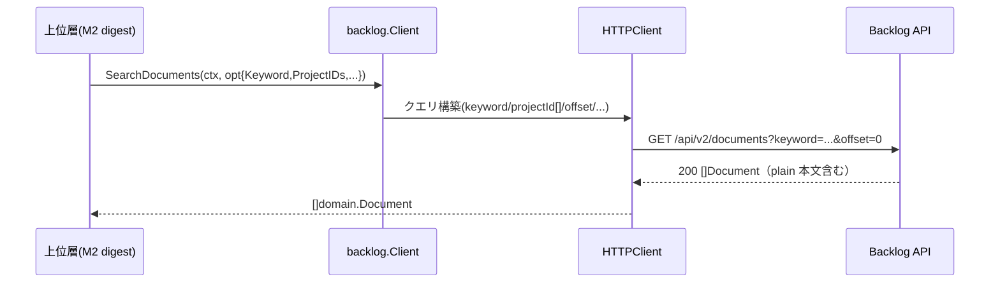

# M1: backlog client — SearchDocuments

## Overview
| 項目 | 値 |
|------|---|
| ステータス | 未着手 |
| 依存 | なし（基盤マイルストーン） |
| 対象ファイル | `internal/backlog/options.go` / `client.go` / `http_client.go` / `mock_client.go` / `options_test.go` / `http_client_test.go` |

## Goal

Backlog ドキュメントをキーワードで横断検索する client メソッド `SearchDocuments` を TDD で追加する。
既存 `ListDocuments` は一切変更しない（AD1）。本文 `plain` を含む `[]domain.Document` をそのまま返し、
スニペット抽出・整形は M2（digest 層）の責務とする。

**スコープ前提**: 「単一スペース内・全プロジェクト横断」（AD6）。`SearchDocuments` は単一スペースの
`HTTPClient` 1 つに対する呼び出しであり、複数スペース横断は上位の `RegisterWithSpaces` fan-out が担う。
本メソッドは projectId 任意（空＝当該スペースの全プロジェクト）。

**責務境界**: `count` の既定値（100）と上限クランプ（≤100、V4 対策）は **M3（CLI/MCP 層）の責務**。
M1 の `SearchDocuments` は受け取った `Count` を忠実に送るだけ（`Count>0` のとき `count=` を付与）。

## 事前検証（M1 着手前に実 API で軽く確認・ロードマップ V1）

- **V1**: `GET /api/v2/documents?keyword=...&offset=0`（projectId[] 無し）が当該スペースの全プロジェクト
  ドキュメントを横断して返すか。エラー/空なら M3 で「全プロジェクト ID 列挙 → projectId[] に詰める」
  フォールバックが必要になり、`SearchDocumentsOptions.ProjectIDs` の使われ方が変わる。
  → M1 のクエリ構築自体（projectId[] 任意送出）は V1 の結果に関わらず正しいため、M1 は先行実装可。

## API 仕様（確定）

```
GET /api/v2/documents
  keyword     任意   検索語（ドキュメント内容を検索）
  projectId[] 任意   複数可。空なら全プロジェクト横断
  sort        任意   "created" | "updated"
  order       任意   "asc" | "desc"（既定 desc）
  offset      必須   ページネーション開始位置
  count       任意   1-100（既定 20）
```
レスポンス: `[]domain.Document`（各要素に `plain` 本文を含む）。

## 設計

### SearchDocumentsOptions（options.go）

```go
// SearchDocumentsOptions は SearchDocuments リクエストのオプション。
// Backlog API: GET /api/v2/documents（keyword 検索）
type SearchDocumentsOptions struct {
    Keyword    string // 検索語（空可だが通常は指定）
    ProjectIDs []int  // 絞り込み対象プロジェクト ID（空＝スペース全体横断）
    Sort       string // "created" | "updated"（空＝API デフォルト）
    Order      string // "asc" | "desc"（空＝API デフォルト）
    Offset     int    // ページネーション開始位置
    Count      int    // 取得件数 1-100（0＝API デフォルト）
}
```

### Client interface（client.go、Documents セクション末尾に追加）

```go
// SearchDocuments はキーワードでドキュメントを横断検索する。
// Backlog API: GET /api/v2/documents?keyword=...&projectId[]=...&offset=N
SearchDocuments(ctx context.Context, opt SearchDocumentsOptions) ([]domain.Document, error)
```

### HTTPClient 実装（http_client.go、ListDocuments の直後に追加）

`ListDocuments` のクエリ構築（`q.Add("projectId[]", ...)`, `q.Set("offset", ...)`, `q.Set("count", ...)`, `newRequest`/`do`）を踏襲する。

```go
// SearchDocuments はキーワードでドキュメントを横断検索する。
// GET /api/v2/documents?keyword=...&projectId[]=...&offset=N
func (c *HTTPClient) SearchDocuments(ctx context.Context, opt SearchDocumentsOptions) ([]domain.Document, error) {
    q := url.Values{}
    q.Set("offset", strconv.Itoa(opt.Offset)) // 必須
    if opt.Keyword != "" {
        q.Set("keyword", opt.Keyword)
    }
    for _, pid := range opt.ProjectIDs {
        q.Add("projectId[]", strconv.Itoa(pid))
    }
    if opt.Sort != "" {
        q.Set("sort", opt.Sort)
    }
    if opt.Order != "" {
        q.Set("order", opt.Order)
    }
    if opt.Count > 0 {
        q.Set("count", strconv.Itoa(opt.Count))
    }
    req, err := c.newRequest(ctx, http.MethodGet, "/api/v2/documents", q)
    if err != nil {
        return nil, err
    }
    var docs []domain.Document
    if err := c.do(req, &docs); err != nil {
        return nil, err
    }
    return docs, nil
}
```

### MockClient（mock_client.go）

- フィールド追加: `SearchDocumentsFunc func(ctx context.Context, opt SearchDocumentsOptions) ([]domain.Document, error)`
- メソッド追加: `SearchDocumentsFunc` を呼び出すラッパー（既存 `ListDocuments` モックと同形）

## Sequence Diagram



## TDD Test Design

### options_test.go — クエリ/構造体
| # | テストケース | 入力 | 期待 |
|---|-------------|------|------|
| 1 | ゼロ値オプション | `SearchDocumentsOptions{}` | 全フィールドゼロ値で構築可能 |
| 2 | 全フィールド設定 | Keyword/ProjectIDs/Sort/Order/Offset/Count を設定 | 各フィールドが保持される |

### http_client_test.go — リクエスト構築（httptest でクエリ検証）
| # | テストケース | 入力 | 期待クエリ |
|---|-------------|------|-----------|
| 1 | keyword のみ・横断 | `{Keyword:"OAuth", Offset:0}` | `keyword=OAuth&offset=0`、`projectId[]` なし |
| 2 | 複数プロジェクト絞り込み | `{Keyword:"k", ProjectIDs:[]int{1,2}, Offset:0}` | `projectId[]=1&projectId[]=2` の2要素 |
| 3 | sort/order/count 指定 | `{Sort:"updated", Order:"desc", Count:50, Offset:20}` | `sort=updated&order=desc&count=50&offset=20` |
| 4 | offset 常に送出 | `{Keyword:"k"}`（Offset=0） | `offset=0` が必ず含まれる |
| 5 | レスポンスデコード | API が plain 付き2件返す | `len(docs)==2` かつ `docs[0].Plain` が非空 |
| 6 | API エラー | 400/500 応答 | エラーが返る（既存 `do` のエラー整形に従う） |
| 7 | count 未指定 | `{Keyword:"k"}`（Count=0） | `count=` を**送らない**（API デフォルト 20 に委ねる） |
| 8 | count 境界 | `{Count:1}` / `{Count:100}` | それぞれ `count=1` / `count=100` を送出（クランプは M3 の責務でありここでは素通し） |

## Implementation Steps（TDD: Red → Green → Refactor）
- [ ] Step 1 (Red): `options_test.go` に SearchDocumentsOptions テストを追加 → コンパイルエラー/失敗
- [ ] Step 2 (Green): `options.go` に `SearchDocumentsOptions` を追加
- [ ] Step 3 (Red): `http_client_test.go` に上記6ケースを追加 → 失敗
- [ ] Step 4 (Green): `client.go` interface に `SearchDocuments` を追加、`http_client.go` に実装、`mock_client.go` に `SearchDocumentsFunc` を追加（interface 充足）
- [ ] Step 5 (Green確認): `go test ./internal/backlog/...` グリーン
- [ ] Step 6 (Refactor): クエリ構築の重複を確認（ListDocuments と共通化はしない＝AD1 でスコープ分離維持）、`go vet ./...`

## Risks
| リスク | 影響度 | 対策 |
|--------|--------|------|
| `MockClient` に新メソッド未追加で interface 不充足→全テストがコンパイル不能 | 高 | Step 4 で interface・http・mock を同時追加。`var _ Client = (*MockClient)(nil)` の静的アサートがあれば即検知 |
| keyword 検索のスコープ（タイトルのみ vs 本文）が想定と異なる | 中 | M5 実 API スモークで確認。M1 はクエリ送出の正しさのみ検証 |
| offset 必須を送り忘れ全件取得や 400 になる | 中 | テストケース4で offset=0 でも必ず送出することを保証 |
| `projectId[]` の複数指定が単一キーに化ける | 低 | テストケース2で `url.Values` が2要素を保持することを検証 |

## Definition of Done
- `go test ./internal/backlog/...` / `go vet ./...` がグリーン
- 既存 `ListDocuments` 関連テストが無変更で通り続ける（インターフェース非破壊）
- `SearchDocuments` が Client interface・HTTPClient・MockClient の3箇所で揃っている
