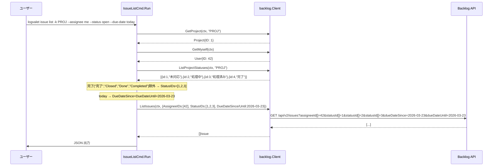
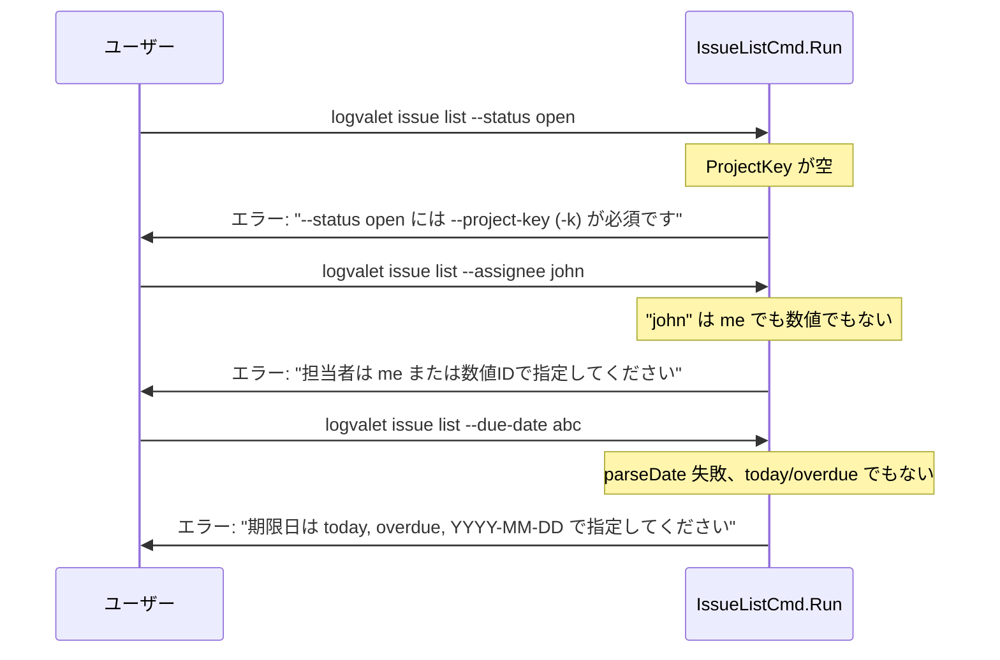

# issue list フィルタ追加

## コンテキスト

logvalet で「今日自分がやるべきタスク」を把握するために、`issue list` に担当者・ステータス・期限日でのフィルタリング機能が必要。
Backlog API (`GET /api/v2/issues`) は `assigneeId[]`, `statusId[]`, `dueDateSince`, `dueDateUntil` をサポート済みであり、CLI 側でフラグをマッピングすれば実現可能。

**調査結果**: `issue list` 以外のサブコマンド（issue digest, project digest, user digest, comment list 等）は単一エンティティの詳細表示か API 側でフィルタ非対応のため、フィルタ追加の対象は `issue list` のみ。

## スコープ

### 実装範囲
- `issue list` に `--assignee`, `--status`, `--due-date` フラグ追加
- `ListIssuesOptions` の型修正（string → []int）+ DueDate フィールド追加
- `HTTPClient.ListIssues` の API パラメータ名バグ修正（`assigneeUserId[]` → `assigneeId[]`）
- テスト追加（HTTP レイヤー + CLI レイヤー）

### スコープ外
- 他サブコマンドへのフィルタ追加（調査済み、不要と判断）
- ページネーションの自動化
- ソート順指定

## 変更対象ファイル

| # | ファイル | 変更内容 |
|---|---------|---------|
| 1 | `internal/backlog/options.go` | `ListIssuesOptions` 型修正 + フィールド追加 |
| 2 | `internal/backlog/http_client.go` | `ListIssues` クエリパラメータ修正 |
| 3 | `internal/backlog/http_client_test.go` | 既存テスト修正 + 新規パラメータテスト |
| 4 | `internal/cli/issue.go` | `IssueListCmd` フラグ追加 + 解決ロジック |
| 5 | `internal/cli/issue_list_test.go` (新規) | CLI フィルタ解決ロジックのテスト |
| 6 | `README.md` | `issue list` フィルタフラグの利用例追加 |
| 7 | `README.ja.md` | 同上（日本語版） |

再利用する既存コード（変更不要）:
- `internal/cli/resolve.go` — `resolveNameOrID`, `resolveNamesOrIDs`, `parseDate`, `toIDNamesFromStatuses`
- `internal/backlog/client.go` — `GetMyself`, `ListProjectStatuses` インターフェース
- `internal/backlog/mock_client.go` — テスト用モック

## 実装手順

### Step 1: ListIssuesOptions 型修正 + HTTP レイヤー修正

**ファイル**: `internal/backlog/options.go`, `internal/backlog/http_client.go`, `internal/backlog/http_client_test.go`
**依存**: なし

#### options.go の変更

```go
type ListIssuesOptions struct {
    ProjectIDs   []int
    AssigneeIDs  []int       // 旧: Assignee string
    StatusIDs    []int       // 旧: Status string
    DueDateSince *time.Time  // 新規
    DueDateUntil *time.Time  // 新規
    Limit        int
    Offset       int
}
```

#### http_client.go の変更 (ListIssues メソッド、行259-288)

- `assigneeUserId[]` → `assigneeId[]` （パラメータ名修正）
- string 単値 → `q.Add` ループで []int 複数値対応
- `dueDateSince`, `dueDateUntil` パラメータ追加（`"2006-01-02"` フォーマット）

#### http_client_test.go の変更

- 既存 TestHTTPClientListIssues の `ListIssuesOptions` 型修正
- 新規テストケース追加（assigneeId[], statusId[], dueDateSince/Until）

### Step 2: IssueListCmd フラグ追加 + 解決ロジック

**ファイル**: `internal/cli/issue.go`, `internal/cli/issue_list_test.go` (新規)
**依存**: Step 1

#### IssueListCmd 構造体

```go
type IssueListCmd struct {
    ListFlags
    ProjectKey []string `short:"k" help:"プロジェクトキー"`
    Assignee   string   `help:"担当者 (me, 数値ID, またはユーザー名)"`
    Status     string   `help:"ステータス (open, 名前, カンマ区切り, 数値ID)。名前/open は --project-key 必須"`
    DueDate    string   `help:"期限日フィルタ (today, overdue, YYYY-MM-DD)"`
}
```

#### Run メソッドのフィルタ解決ロジック

**--assignee 解決:**
1. `"me"` → `rc.Client.GetMyself(ctx)` → `opt.AssigneeIDs = []int{user.ID}`
2. 数値文字列 → `strconv.Atoi` → `opt.AssigneeIDs = []int{id}`
3. 名前文字列 → `rc.Client.ListUsers(ctx)` → ユーザー名で検索（case-insensitive 完全一致）→ `opt.AssigneeIDs = []int{user.ID}`。一致0件/複数件はエラー

**--status 解決:**
1. `"open"` → `ProjectKey` が空ならエラー。各 projectKey の `ListProjectStatuses` で完了以外の全ステータス ID を収集（重複除去）
2. カンマ区切り → `strings.Split` → 各要素:
   - 数値 → そのまま ID
   - 名前 → `ProjectKey` 必須。`resolveNameOrID` で変換
3. 単一数値 → `opt.StatusIDs = []int{id}` (projectKey 不要)

**完了ステータスの判定**: 定数化した完了パターン (`"完了"`, `"Closed"`, `"Done"`, `"Completed"`) に名前が一致するものを除外。
**複数プロジェクト対応**: プロジェクトごとに独立して `resolveNameOrID` を実行し、解決した ID をマージ・重複除去する（全プロジェクトのステータスを混ぜて一括解決しない）。

**--due-date 解決:**
1. `"today"` → `DueDateSince = DueDateUntil = 今日`
2. `"overdue"` → `DueDateUntil = 昨日` (DueDateSince は nil)
3. `"YYYY-MM-DD"` → `parseDate` → `DueDateSince = DueDateUntil = 指定日` (単日指定、today と一貫性を持たせる)

## シーケンス図



### エラーフロー



## テスト設計書

### HTTP レイヤー (http_client_test.go)

#### 正常系

| ID | テスト名 | 入力 | 期待クエリ |
|----|---------|------|-----------|
| H1 | assigneeId 単一値 | `AssigneeIDs: []int{42}` | `assigneeId[]=42` |
| H2 | assigneeId 複数値 | `AssigneeIDs: []int{1, 2}` | `assigneeId[]=1&assigneeId[]=2` |
| H3 | statusId 配列 | `StatusIDs: []int{1, 2, 3}` | `statusId[]=1&statusId[]=2&statusId[]=3` |
| H4 | dueDateSince/Until | `Since: 2026-03-23, Until: 2026-03-23` | `dueDateSince=2026-03-23&dueDateUntil=2026-03-23` |
| H5 | 空フィールド除外 | `AssigneeIDs: nil, StatusIDs: nil` | パラメータ不在 |
| H6 | 既存テスト互換 | `ProjectIDs: [42,99], Limit: 10` | 既存動作維持 |

### CLI レイヤー (issue_list_test.go)

#### 正常系

| ID | テスト名 | フラグ | Mock 設定 | 期待 opt |
|----|---------|--------|-----------|---------|
| C1 | assignee me | `--assignee me` | GetMyself→{ID:42} | AssigneeIDs=[42] |
| C2 | assignee 数値 | `--assignee 99` | - | AssigneeIDs=[99] |
| C2b | assignee 名前 | `--assignee "田中太郎"` | ListUsers→[{ID:50,Name:"田中太郎"},...] | AssigneeIDs=[50] |
| C3 | status open | `--status open -k PROJ` | ListProjectStatuses→4件 | StatusIDs=[1,2,3] |
| C4 | status 名前 | `--status 未対応 -k PROJ` | ListProjectStatuses | StatusIDs=[1] |
| C5 | status カンマ区切り | `--status "未対応,処理中" -k PROJ` | ListProjectStatuses | StatusIDs=[1,2] |
| C6 | status 数値 | `--status 1` | - | StatusIDs=[1] |
| C7 | due-date today | `--due-date today` | - | Since=Until=今日 |
| C8 | due-date overdue | `--due-date overdue` | - | Until=昨日, Since=nil |
| C9 | due-date 日付 | `--due-date 2026-12-31` | - | Since=Until=2026-12-31 |
| C10 | フィルタなし | (なし) | - | 全フィールド空 |
| C11 | 全フィルタ組合せ | `--assignee me --status open --due-date today -k PROJ` | GetMyself+Statuses | 全フィールド設定 |

#### 異常系

| ID | テスト名 | フラグ | 期待エラー |
|----|---------|--------|-----------|
| E1 | assignee 名前一致なし | `--assignee "存在しないユーザー"` | ListUsers で一致0件 → エラー |
| E1b | assignee 名前複数一致 | `--assignee "田中"` | ListUsers で複数一致 → エラー |
| E2 | status open に project-key なし | `--status open` | --project-key 必須 |
| E3 | status 名前に project-key なし | `--status 未対応` | --project-key 必須 |
| E4 | due-date 不正形式 | `--due-date abc` | 期限日の形式が不正 |
| E5 | GetMyself 失敗 | `--assignee me` (API error) | エラー伝播 |
| E6 | ListProjectStatuses 失敗 | `--status open -k PROJ` (API error) | エラー伝播 |

#### エッジケース

| ID | テスト名 | 条件 | 期待動作 |
|----|---------|------|---------|
| X1 | カスタムステータスのみ (ID=4 なし) | Statuses=[{100,"ToDo"},{200,"Done"}] | "Done" 除外候補なし → 全ステータスが open |
| X2 | 完了のみ存在 | Statuses=[{4,"完了"}] | StatusIDs=[] (結果0件) |
| X3 | カンマ区切り + 数値混在 | `--status "1,未対応" -k PROJ` | 1はそのまま、"未対応"はresolve |
| X4 | 複数 project-key + open | `-k A -k B --status open` | 各プロジェクトごとに独立解決、ID マージ・重複除去 |
| X5 | 複数 project-key + ステータス名 | `-k A -k B --status 未対応` | 各プロジェクトで独立 resolve、ID マージ |
| X6 | assignee 整数オーバーフロー | `--assignee 99999999999` | strconv.Atoi エラー → バリデーションエラー |

## リスク評価

| リスク | 重大度 | 対策 |
|--------|--------|------|
| ListIssuesOptions 破壊的変更 | 高 | options.go + http_client.go + テストを同一コミットで変更。`go test ./...` で確認 |
| 完了ステータス判定の誤り | 中 | 定数化した4パターン ("完了","Closed","Done","Completed") で判定。カスタムステータスで異なる命名の場合は対象外。将来的に設定可能にする余地あり |
| time.Now() テスタビリティ | 中 | MockClient の ListIssuesFunc 内で opt の日付値を検証。日付の絶対値ではなく相対関係で検証 |
| 既存テストの破損 | 中 | 型変更に伴う http_client_test.go 修正を含める |
| API パラメータ名の正確性 | 低 | Backlog API ドキュメントで `assigneeId[]` を確認済み |

## コミット戦略

| # | 内容 | メッセージ |
|---|------|-----------|
| 1 | API レイヤー修正 | `fix(backlog): ListIssuesOptions の型修正と assigneeId[] パラメータ名修正` |
| 2 | CLI フィルタ追加 | `feat(cli): issue list に --assignee, --status, --due-date フィルタを追加` |

## チェックリスト

### 観点1: 実装実現可能性と完全性
- [x] 手順の抜け漏れがないか
- [x] 各ステップが十分に具体的か
- [x] 依存関係が明示されているか
- [x] 変更対象ファイルが網羅されているか
- [x] 影響範囲が正確に特定されているか

### 観点2: TDDテスト設計の品質
- [x] 正常系テストケースが網羅されているか (C1-C11, H1-H6)
- [x] 異常系テストケースが定義されているか (E1-E6)
- [x] エッジケースが考慮されているか (X1-X4)
- [x] 入出力が具体的に記述されているか
- [x] Red→Green→Refactorの順序が守られているか
- [x] モック/スタブの設計が適切か (MockClient 再利用)

### 観点3: アーキテクチャ整合性
- [x] 既存の命名規則に従っているか
- [x] 設計パターンが一貫しているか (resolveNameOrID パターン踏襲)
- [x] モジュール分割が適切か (backlog 層 / cli 層)
- [x] 依存方向が正しいか (cli → backlog → domain)
- [x] 類似機能との統一性があるか (issue create/update と同じ resolve パターン)

### 観点4: リスク評価と対策
- [x] リスクが適切に特定されているか
- [x] 対策が具体的か
- [x] フェイルセーフが考慮されているか (フラグ未指定時は既存動作維持)
- [x] パフォーマンスへの影響が評価されているか (API 呼び出し最小化)
- [x] セキュリティ観点が含まれているか (ユーザー入力バリデーション)
- [x] ロールバック計画があるか (2コミット分離で個別 revert 可能)

### 観点5: シーケンス図の完全性
- [x] 正常フローが記述されているか
- [x] エラーフローが記述されているか
- [x] ユーザー・システム・外部API間の相互作用が明確か
- [x] タイミング・同期的な処理の制御が明記されているか
- [x] リトライ・タイムアウト等の例外ハンドリングが図に含まれているか (N/A — 既存の HTTP クライアント層で対応済み)

## ドキュメント更新

- `README.md` — `issue list` の利用例に `--assignee`, `--status`, `--due-date` を追加
- `README.ja.md` — 同上（日本語版）

---

## バグ修正: --assignee me が空配列を返す (2026-03-23 追加)

### 症状
```bash
./logvalet issue list --project-key HEP_ISSUES          # → 結果あり
./logvalet issue list --assignee me --project-key HEP_ISSUES  # → []
```

### 調査方針
1. `./logvalet issue list --assignee 1537084 --project-key HEP_ISSUES` で数値ID直接指定がそもそも動くか確認
2. `./logvalet auth whoami` で GetMyself が返す user.ID を確認
3. `--verbose` で実際の HTTP リクエスト URL を確認し、`assigneeId[]` パラメータの値とエンコーディングを検証
4. 全フィルタオプション（`--status open`, `--due-date today` 等）を実 API で動作確認
5. 発見したバグを修正 + テスト追加

### 考えられる原因
- `assigneeId[]` パラメータ名が Backlog GET /api/v2/issues で正しくない可能性
- URL エンコーディングの問題（`%5B%5D` vs リテラル `[]`）
- `GetMyself` が返す `user.ID` と課題の `assignee.id` が一致しない可能性

### 検証コマンド一覧
```bash
# 基本動作確認
./logvalet auth whoami
./logvalet issue list --project-key HEP_ISSUES --count 3

# --assignee テスト
./logvalet issue list --assignee me --project-key HEP_ISSUES
./logvalet issue list --assignee 1537084 --project-key HEP_ISSUES
./logvalet issue list --assignee "Naoto Ishizawa" --project-key HEP_ISSUES

# --status テスト
./logvalet issue list --status open --project-key HEP_ISSUES
./logvalet issue list --status 1 --project-key HEP_ISSUES
./logvalet issue list --status "未対応" --project-key HEP_ISSUES

# --due-date テスト
./logvalet issue list --due-date today --project-key HEP_ISSUES
./logvalet issue list --due-date overdue --project-key HEP_ISSUES
./logvalet issue list --due-date 2026-03-24 --project-key HEP_ISSUES

# 組み合わせテスト
./logvalet issue list --assignee me --status open --project-key HEP_ISSUES
./logvalet issue list --assignee me --due-date today --project-key HEP_ISSUES
```
