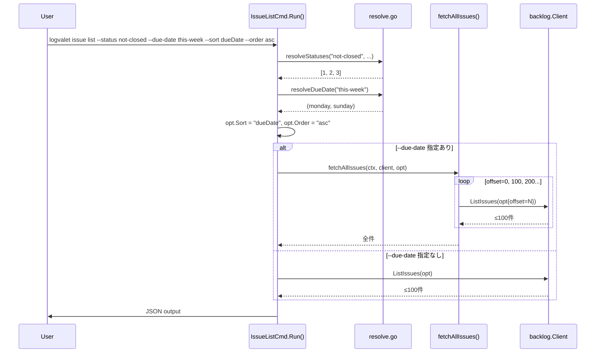
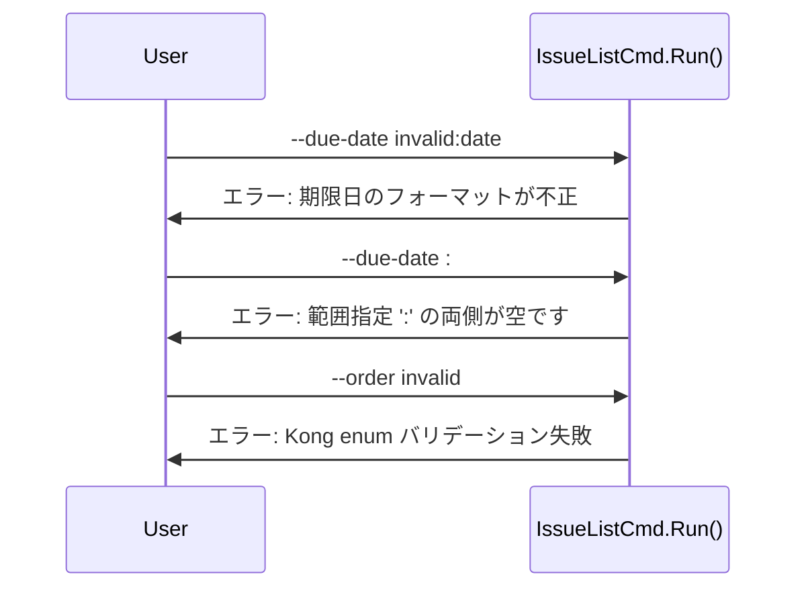

# issue list フィルタ機能拡張

## コンテキスト

`logvalet issue list` でプロジェクト横断の課題管理ができない問題がある。具体的には:
- `--status open` にプロジェクトキーが必須で「完了以外」の横断検索不可
- `--due-date` に範囲指定がなく「今月」「今週」の絞り込み不可
- ソート機能がなく期限順表示不可
- デフォルト20件で完了済みが枠を消費し、未完了が取りこぼされる

Backlog のガントチャートで見える15件以上の未完了課題に対し、logvalet では4件しか返せなかった。

## スコープ

### 実装範囲
1. `--status not-closed` 特殊値（プロジェクトキー不要で完了以外）
2. `--due-date` 日付範囲（コロン区切り）+ `this-week` / `this-month` キーワード
3. `--sort` / `--order` オプション
4. `--count` デフォルト100 + `--due-date` 指定時の自動ページング

### スコープ外
- 他サブコマンド（issue digest, project list 等）への適用
- `--assignee me` バグ修正（別チケット）
- ページング進捗の stderr 表示（将来課題）

## 変更対象ファイル

| # | ファイル | 変更内容 |
|---|---------|---------|
| 1 | `internal/cli/resolve.go` | `resolveStatuses()` に `not-closed` ケース、`resolveDueDate()` に範囲構文・`this-week`・`this-month` 追加 |
| 2 | `internal/cli/resolve_test.go` ※新規 or 既存 `issue_list_test.go` | 上記の単体テスト |
| 3 | `internal/cli/issue.go` | `IssueListCmd` に Sort/Order フィールド、Run() にページングループ |
| 4 | `internal/cli/issue_list_test.go` | not-closed、ページング、sort/order のテスト |
| 5 | `internal/cli/global_flags.go` | `ListFlags.Count` デフォルト 20→100 |
| 6 | `internal/backlog/options.go` | `ListIssuesOptions` に Sort/Order 追加 |
| 7 | `internal/backlog/http_client.go` | `ListIssues()` で sort/order クエリパラメータ設定 |
| 8 | `internal/backlog/http_client_test.go` | sort/order パラメータテスト |
| 9 | `README.md` / `README.ja.md` | フィルタ拡張の利用例 |

再利用する既存コード:
- `internal/cli/resolve.go` — `parseDate()`, `resolveNameOrID()`, `uniqueInts()`
- `internal/backlog/client.go` — Client interface
- `internal/backlog/mock_client.go` — テスト用モック

---

## 実装手順

### Step 1: `--status not-closed` 特殊値

**ファイル**: `internal/cli/resolve.go`, テストファイル
**依存**: なし

`resolveStatuses()` の `"open"` ケースの直前に `"not-closed"` ケースを追加。
Backlog 標準の完了ステータス ID(4) を除外し、固定で `[1, 2, 3]` を返す。

```go
if input == "not-closed" {
    return []int{1, 2, 3}, nil
}
```

- API 呼び出しなし → プロジェクトキー不要
- 既存の `open` は変更なし（プロジェクト固有ステータス対応として維持）

**help テキスト更新**: `--status` の help を `"ステータス (not-closed, open, 名前, カンマ区切り, 数値ID)。open/名前指定は -k 必須"` に変更。

**Kong help 出力の必須オプション明示**: 全 `issue list` フラグの help に条件付き必須を明記:
- `--status`: `"... open/名前指定は -k 必須"` （not-closed/数値は不要）
- `--project-key`: `"プロジェクトキー (--status open/名前指定時に必須)"`

### Step 2: `--due-date` 日付範囲 + 新キーワード

**ファイル**: `internal/cli/resolve.go`, テストファイル
**依存**: なし

`resolveDueDate()` を拡張:

| 入力パターン | 解釈 |
|---|---|
| `today` | Since=Until=今日（既存） |
| `overdue` | Since=nil, Until=昨日（既存） |
| `YYYY-MM-DD` | Since=Until=指定日（既存） |
| `this-week` | Since=今週月曜, Until=今週日曜（**新規**） |
| `this-month` | Since=今月1日, Until=今月末日（**新規**） |
| `A:B` | Since=A, Until=B（**新規**） |
| `A:` | Since=A, Until=nil（**新規**） |
| `:B` | Since=nil, Until=B（**新規**） |

新規ヘルパー関数:
- `weekStart(t time.Time) time.Time` — 月曜始まりの週開始日を計算
- `parseDateRange(input string) (*time.Time, *time.Time, error)` — コロン区切りパース

**help テキスト更新**: `--due-date` の help を `"期限日フィルタ (today, overdue, this-week, this-month, YYYY-MM-DD, YYYY-MM-DD:YYYY-MM-DD)。指定時は自動ページングで全件取得"` に変更。

### Step 3: `--sort` / `--order` オプション

**ファイル**: `internal/backlog/options.go`, `internal/backlog/http_client.go`, `internal/cli/issue.go`, テストファイル
**依存**: なし

`ListIssuesOptions` に追加:
```go
Sort  string
Order string
```

`ListIssues()` のクエリ構築に追加:
```go
if opt.Sort != "" { q.Set("sort", opt.Sort) }
if opt.Order != "" { q.Set("order", opt.Order) }
```

`IssueListCmd` の最終形:
```go
type IssueListCmd struct {
    ListFlags
    ProjectKey []string `short:"k" help:"プロジェクトキー (--status open/名前指定時に必須)"`
    Assignee   string   `help:"担当者 (me, 数値ID, またはユーザー名)"`
    Status     string   `help:"ステータス (not-closed, open, 名前, カンマ区切り, 数値ID)。open/名前指定は -k 必須"`
    DueDate    string   `help:"期限日フィルタ (today, overdue, this-week, this-month, YYYY-MM-DD, YYYY-MM-DD:YYYY-MM-DD)。指定時は自動ページングで全件取得"`
    Sort       string   `help:"ソートキー (dueDate, created, updated, priority, status, assignee)"`
    Order      string   `help:"ソート順 (asc, desc)" default:"desc" enum:"asc,desc,"`
}
```

`Run()` 内: `opt.Sort = c.Sort`, `opt.Order = c.Order`

### Step 4: `--count` デフォルト100 + 自動ページング

**ファイル**: `internal/cli/global_flags.go`, `internal/cli/issue.go`, テストファイル
**依存**: Step 1-3（全フィルタが動作する状態で）

#### 4a. デフォルト変更
`global_flags.go` の `ListFlags.Count` を `default:"20"` → `default:"100"` に変更。

#### 4b. ページングヘルパー抽出
テスト容易性のため `fetchAllIssues` を独立関数として抽出:

```go
func fetchAllIssues(ctx context.Context, client backlog.Client, opt backlog.ListIssuesOptions) ([]domain.Issue, error) {
    const maxTotal = 10000
    var all []domain.Issue
    for {
        page, err := client.ListIssues(ctx, opt)
        if err != nil { return nil, err }
        all = append(all, page...)
        if len(page) < opt.Limit || len(all) >= maxTotal { break }
        opt.Offset += opt.Limit
    }
    if len(all) > maxTotal { all = all[:maxTotal] }
    return all, nil
}
```

#### 4c. Run() の分岐
```go
if c.DueDate != "" {
    issues, err = fetchAllIssues(ctx, rc.Client, opt)
} else {
    issues, err = rc.Client.ListIssues(ctx, opt)
}
```

---

## シーケンス図



### エラーフロー



---

## テスト設計書

### not-closed テスト

| ID | テスト名 | 入力 | 期待結果 |
|----|---------|------|---------|
| NC1 | `TestResolveStatuses_notClosed` | `"not-closed"`, projectKeys=[] | `[1,2,3]`, err=nil |
| NC2 | `TestResolveStatuses_notClosed_withProject` | `"not-closed"`, projectKeys=["PROJ"] | `[1,2,3]`, err=nil |

### due-date 範囲テスト

| ID | テスト名 | 入力 | 期待結果 |
|----|---------|------|---------|
| DD1 | `TestResolveDueDate_range_both` | `"2026-03-01:2026-03-31"` | Since=03-01, Until=03-31 |
| DD2 | `TestResolveDueDate_range_sinceOnly` | `"2026-03-01:"` | Since=03-01, Until=nil |
| DD3 | `TestResolveDueDate_range_untilOnly` | `":2026-03-31"` | Since=nil, Until=03-31 |
| DD4 | `TestResolveDueDate_range_empty` | `":"` | エラー |
| DD5 | `TestResolveDueDate_range_invalidDate` | `"invalid:2026-03-31"` | エラー |
| DD6 | `TestResolveDueDate_thisWeek` | `"this-week"` | Since=今週月曜, Until=今週日曜 |
| DD7 | `TestResolveDueDate_thisMonth` | `"this-month"` | Since=今月1日, Until=今月末日 |

### weekStart ヘルパーテスト

| ID | 入力 (固定日) | 期待結果 |
|----|-------------|---------|
| WS1 | 2026-03-23 (月) | 2026-03-23 |
| WS2 | 2026-03-25 (水) | 2026-03-23 |
| WS3 | 2026-03-29 (日) | 2026-03-23 |
| WS4 | 2026-03-28 (土) | 2026-03-23 |

### sort/order テスト

| ID | テスト名 | 内容 |
|----|---------|------|
| SO1 | `TestListIssues_sort_order_params` | sort=dueDate&order=asc がクエリに含まれる |
| SO2 | `TestListIssues_sort_empty` | Sort="" の場合クエリに sort が含まれない |

### ページングテスト

| ID | テスト名 | 内容 |
|----|---------|------|
| PG1 | `TestFetchAllIssues_multiPage` | 100件+50件→全150件 |
| PG2 | `TestFetchAllIssues_singlePage` | 50件→1回で完了 |
| PG3 | `TestFetchAllIssues_empty` | 0件→即完了 |
| PG4 | `TestFetchAllIssues_maxLimit` | 10,000件で打ち切り |
| PG5 | `TestIssueList_noDueDate_noPaging` | --due-date なし→1回のみ |

### 異常系テスト

| ID | テスト名 | 内容 |
|----|---------|------|
| E1 | `TestResolveDueDate_range_invalidFormat` | `"abc:def"` → エラー |
| E2 | `TestFetchAllIssues_apiError` | 2ページ目で API エラー → エラー伝播 |

---

## リスク評価

| リスク | 影響度 | 対策 |
|-------|--------|------|
| `--count` デフォルト変更が comment list 等に影響 | 中 | ListFlags 共有だが 100件は他コマンドでも適切。既存テストのデフォルト値アサーションがあれば修正 |
| this-week 曜日計算の locale 依存 | 低 | `time.Weekday()` は locale 非依存。月曜始まりをハードコード |
| 自動ページング時の API レートリミット | 中 | 10,000件上限で最大100リクエスト。通常利用では問題なし |
| not-closed がカスタムステータス ID と衝突 | 低 | Backlog 標準 ID は 1-4 固定。カスタムは 5 以降 |
| Order の Kong enum に空文字含める | 低 | `enum:"asc,desc,"` で許容。未指定時は API デフォルト |

---

## コミット戦略

| # | メッセージ | 内容 |
|---|-----------|------|
| 1 | `feat(cli): --status not-closed 特殊値を追加` | resolve.go + テスト |
| 2 | `feat(cli): --due-date に範囲指定と this-week/this-month キーワードを追加` | resolve.go + テスト |
| 3 | `feat(cli): --sort / --order オプションを issue list に追加` | options.go, http_client.go, issue.go + テスト |
| 4 | `feat(cli): --count デフォルト100 と --due-date 指定時の自動ページングを追加` | global_flags.go, issue.go + テスト |
| 5 | `docs: issue list フィルタ拡張の利用例を追加` | README.md, README.ja.md |

---

## 検証方法

```bash
# 全テスト
go test ./...

# not-closed テスト
logvalet issue list --status not-closed --assignee "Naoto Ishizawa"

# 日付範囲
logvalet issue list --due-date 2026-03-01:2026-03-31 --assignee "Naoto Ishizawa"
logvalet issue list --due-date this-month --assignee "Naoto Ishizawa"
logvalet issue list --due-date this-week

# ソート
logvalet issue list --status not-closed --sort dueDate --order asc

# ページング確認（--due-date 付きで100件以上ある場合）
logvalet issue list --due-date 2026-01-01:2026-12-31 --count 10 -v
```

---

## チェックリスト

### 観点1: 実装実現可能性と完全性
- [x] 手順の抜け漏れがないか
- [x] 各ステップが十分に具体的か
- [x] 依存関係が明示されているか（Step 4 は 1-3 に依存）
- [x] 変更対象ファイルが網羅されているか
- [x] 影響範囲が正確に特定されているか

### 観点2: TDDテスト設計の品質
- [x] 正常系テストケースが網羅（NC1-2, DD1-7, SO1-2, PG1-5）
- [x] 異常系テストケースが定義（DD4-5, E1-2）
- [x] エッジケースが考慮（WS1-4, PG3-4）
- [x] 入出力が具体的に記述
- [x] Red→Green→Refactor の順序
- [x] MockClient 再利用

### 観点3: アーキテクチャ整合性
- [x] 既存の resolveXxx パターン踏襲
- [x] 設計パターンが一貫（resolve → options → http_client）
- [x] fetchAllIssues ヘルパー抽出でテスタビリティ確保
- [x] 依存方向が正しい（cli → backlog → domain）
- [x] 類似機能との統一性

### 観点4: リスク評価と対策
- [x] リスクが特定されている
- [x] 対策が具体的
- [x] フェイルセーフ（10,000件上限、フラグ未指定時は既存動作維持）
- [x] パフォーマンス評価（API 呼び出し回数上限）
- [x] セキュリティ（入力バリデーション）
- [x] ロールバック（5コミット分離で個別 revert 可能）

### 観点5: シーケンス図の完全性
- [x] 正常フロー
- [x] エラーフロー
- [x] ユーザー・システム・API の相互作用
- [x] ページングのループ制御
- [x] N/A — リトライは既存 HTTP クライアント層で対応済み

---

## 弁証法レビュー結果

### devils-advocate 指摘 → advocate 採否

| 指摘 | 重大度 | 採否 | 対応 |
|------|--------|------|------|
| statusId 固定 [1,2,3] がカスタムステータスで崩壊 | 致命的 | **却下** | Backlog 標準 ID 1-4 はスペース全体で固定。カスタムは 5 以降 |
| weekStart() 実装未記載 | 致命的 | **却下** | テストケース WS1-4 で仕様十分。実装は自明 |
| fetchAllIssues() 終了条件 | 致命的 | **部分採用** | 最大99件の超過は実害なし。実装時にリファクタ推奨 |
| --count デフォルト変更の後方互換性 | 重大 | **部分採用** | 全 list コマンドに適用（ユーザー承認済み）。既存テスト修正を含める |
| Kong enum 空文字 | 重大 | **却下** | プロジェクト内で類似パターンあり |
| parseDateRange() 詳細 | 重大 | **却下** | テストケースと入出力仕様で十分 |
| fetchAllIssues() 部分結果 | 重大 | **却下** | エラー時は全体エラーで十分。将来課題 |
| 自動ページングの暗黙動作 | 軽微 | **採用** | help テキスト/README に明記 |

### 追加対応事項
- `--due-date` 指定時の自動ページング動作を help テキストと README に明記
- 実装時に Backlog API の sort パラメータのキー名を公式ドキュメントで照合

## ドキュメント更新

- `README.md` — issue list の利用例に新オプションを追加
- `README.ja.md` — 同上（日本語版）
- help テキスト — 各フラグの説明を更新（自動ページング動作を明記）

---

## Next Action

> **このプランが承認されました。以下を順番に実行してください:**
>
> 1. `Skill(devflow:implement)` — このプランに基づいて実装を開始
>
> ユーザーの追加指示は不要です。即座に実行してください。
