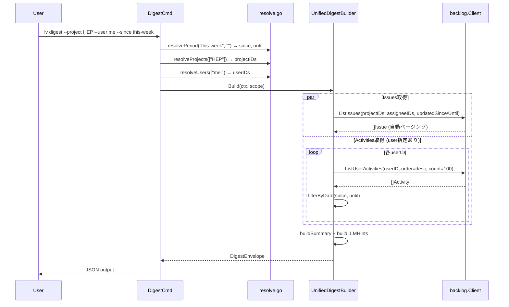
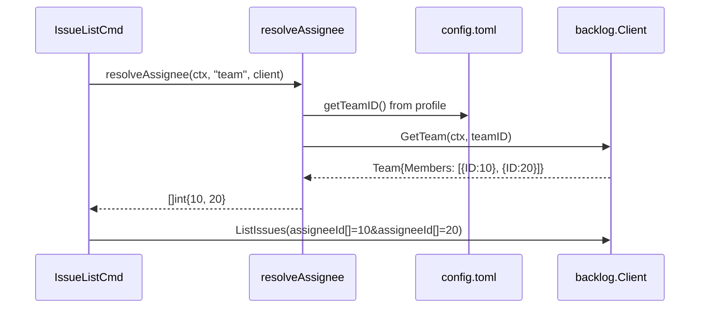

# lv digest 統一コマンド & --assignee team サポート

## コンテキスト

logvalet の既存 digest コマンドは `issue digest`, `project digest`, `user digest`, `team digest` にバラバラに散在しており、中身もスカスカ（project digest は課題を含まない、team digest はメンバー一覧なし等）。LLM が実績レポートを作成するには「誰が何をいつやったか」を期間指定で取得する統一コマンドが必要。

また、`--assignee team` で「チームメンバー全員の課題」を一覧表示する機能も求められている。

## スコープ

### 実装範囲
1. `lv digest` 統一コマンド（フラグでスコープ指定、issues + activities）
2. `--assignee team` サポート（issue list でチーム全員の課題取得）

### スコープ外
- digest の markdown/text レンダリング（JSON のみ）

### 廃止対象
- `lv issue digest` → `lv digest --issue` に移行
- `lv project digest` → `lv digest --project` に移行
- `lv user digest` → `lv digest --user` に移行
- `lv team digest` → `lv digest --team` に移行
- 上記コマンド定義（CLI struct + Run メソッド）を削除
- 既存の DigestBuilder（IssueDigestBuilder, ProjectDigestBuilder 等）は UnifiedDigestBuilder に置き換え

---

## 機能1: `lv digest` コマンド

### コマンド設計

```bash
lv digest [--project X...] [--user X...] [--team X...] [--issue X...] --since VALUE --until VALUE
```

- 全フラグ複数指定可能（Kong `[]string`）
- ミックス指定 = AND 条件: `--project HEP --user "Ishizawa"` → HEP 内の Ishizawa 担当
- `--since`/`--until`: `today`, `this-week`, `this-month`, `YYYY-MM-DD` をサポート
- フラグなし + since/until → スペース全体

### データ取得戦略

| データ | API | 期間の意味 |
|--------|-----|-----------|
| **issues** | `GET /api/v2/issues?updatedSince=...&updatedUntil=...` | 期間内に**更新された**課題 |
| **activities** | space/project/user activities API | 期間内の**操作履歴**（コメント含む） |

#### issues 取得
- `updatedSince`/`updatedUntil` で期間フィルタ（Backlog API 公式サポート）
- `projectId[]`/`assigneeId[]` でスコープフィルタ
- 自動ページング（既存 `fetchAllIssues` を流用）

#### activities 取得
- **API は日付フィルタ未サポート**（minId/maxId のみ）
- **クライアント側で `created` フィールドを見て日付フィルタ**:
  1. `order=desc`, `count=100` で取得
  2. `created > until` → スキップ
  3. `created < since` → ループ終了
  4. 上限 10,000件
- スコープに応じた API:
  - `--user` あり → `GET /api/v2/users/{id}/activities`（各ユーザー並列）
  - `--project` のみ → `GET /api/v2/projects/{key}/activities`（各プロジェクト並列）
  - フラグなし → `GET /api/v2/space/activities`

#### `--team` の解決
- `GET /api/v2/teams/{teamId}` のレスポンスに `members[]` 配列が含まれる
- メンバーの userID を `assigneeId[]`（issues）と activities 取得に展開

### 出力構造

```json
{
  "schema_version": "1",
  "resource": "digest",
  "scope": {
    "projects": [{"id": 1, "key": "HEP", "name": "ヘプタゴン"}],
    "users": [{"id": 42, "name": "Ishizawa"}],
    "teams": [],
    "issues": [],
    "since": "2026-03-01",
    "until": "2026-03-31"
  },
  "digest": {
    "issues": [...],
    "activities": [...],
    "summary": {
      "issue_count": 24,
      "activity_count": 150,
      "by_status": {"未対応": 9, "処理中": 15},
      "by_user": {"Ishizawa": {"issues": 24, "activities": 150}},
      "period": {"since": "2026-03-01", "until": "2026-03-31"}
    },
    "llm_hints": {
      "primary_entities": ["HEP_ISSUES", "Naoto Ishizawa"],
      "suggested_next_actions": []
    }
  },
  "warnings": []
}
```

---

## 機能2: `--assignee team`

### 設計
- `resolveAssignee()` に `"team"` ケースを追加
- config.toml の ProfileConfig に `team_id` フィールドを追加
- `GET /api/v2/teams/{teamId}` でメンバー取得 → assigneeId[] に展開

```toml
[profiles.work]
space = "heptagon"
base_url = "https://heptagon.backlog.com"
auth_ref = "heptagon"
team_id = 173843
```

```bash
lv issue list --assignee team --status not-closed --due-date this-week
```

---

## シーケンス図

### digest コマンド



### --assignee team



---

## 変更対象ファイル

### 新規

| ファイル | 用途 |
|---------|------|
| `internal/cli/digest_cmd.go` | DigestCmd（Kong コマンド定義） |
| `internal/cli/digest_cmd_test.go` | テスト |
| `internal/digest/unified.go` | UnifiedDigestBuilder |
| `internal/digest/unified_test.go` | テスト |
| `internal/digest/activity_filter.go` | activities 日付フィルタ |
| `internal/digest/activity_filter_test.go` | テスト |

### 変更

| ファイル | 変更内容 |
|---------|----------|
| `internal/domain/domain.go` | `TeamWithMembers` 型追加 |
| `internal/backlog/client.go` | `GetTeam(ctx, teamID)` メソッド追加 |
| `internal/backlog/http_client.go` | `GetTeam` 実装、`ListIssues` に updatedSince/Until 追加 |
| `internal/backlog/mock_client.go` | `GetTeamFunc` 追加 |
| `internal/backlog/options.go` | `ListIssuesOptions` に UpdatedSince/Until 追加 |
| `internal/cli/root.go` | CLI struct に `Digest DigestCmd` 追加 |
| `internal/cli/resolve.go` | `resolveAssignee` に "team" ケース、`resolvePeriod` 関数追加 |
| `internal/config/config.go` | `ProfileConfig` に `TeamID int` 追加 |
| `README.md` / `README.ja.md` | コマンド一覧 + 利用例 |

### 削除

| ファイル | 理由 |
|---------|------|
| `internal/cli/issue.go` の `IssueDigestCmd` | `lv digest --issue` に移行 |
| `internal/cli/project.go` の `ProjectDigestCmd` | `lv digest --project` に移行 |
| `internal/cli/user.go` の `UserDigestCmd` | `lv digest --user` に移行 |
| `internal/cli/team.go` の `TeamDigestCmd` | `lv digest --team` に移行 |
| `internal/digest/issue.go` | UnifiedDigestBuilder に置き換え |
| `internal/digest/project.go` | 同上 |
| `internal/digest/user.go` | 同上 |
| `internal/digest/team.go` | 同上 |
| 関連テストファイル | 同上 |

---

## テスト設計書

### 基盤層

| ID | テスト | 入力 | 期待結果 |
|----|--------|------|---------|
| A1 | `TestListIssues_updatedSinceUntil` | UpdatedSince/Until 設定 | クエリに含まれる |
| A2 | `TestListIssues_updatedEmpty` | nil | パラメータ不在 |
| A3 | `TestHTTPClient_GetTeam` | teamID=173843 | TeamWithMembers{Members: [...]} |
| A4 | `TestHTTPClient_GetTeam_notFound` | teamID=999 | ErrNotFound |

### resolve 層

| ID | テスト | 入力 | 期待結果 |
|----|--------|------|---------|
| B1 | `TestResolveAssignee_team` | "team", config.teamID=173843 | メンバーID一覧 |
| B2 | `TestResolveAssignee_team_noConfig` | "team", teamID=0 | エラー |
| B3 | `TestResolveAssignee_team_emptyMembers` | "team", members=[] | エラー |
| B4 | `TestResolvePeriod_thisWeek` | "this-week", "" | since=月曜, until=日曜 |
| B5 | `TestResolvePeriod_thisMonth` | "this-month", "" | since=1日, until=末日 |
| B6 | `TestResolvePeriod_date` | "2026-03-01", "2026-03-31" | 指定通り |

### activities 日付フィルタ

| ID | テスト | 内容 |
|----|--------|------|
| C1 | `TestFilterActivitiesByDate_normal` | 10件中3件が範囲内 → 3件 |
| C2 | `TestFilterActivitiesByDate_skipFuture` | until より新しいものをスキップ |
| C3 | `TestFilterActivitiesByDate_stopPast` | since より古いもので終了 |
| C4 | `TestFetchActivitiesWithDateFilter_multiPage` | 2ページにまたがる取得 |
| C5 | `TestFetchActivitiesWithDateFilter_maxLimit` | 10,000件で打ち切り |

### UnifiedDigestBuilder

| ID | テスト | 内容 |
|----|--------|------|
| D1 | `TestBuild_projectAndUser` | project + user → issues + user activities |
| D2 | `TestBuild_spaceWide` | フラグなし → space activities + 全 issues |
| D3 | `TestBuild_teamScope` | team → メンバー展開 → issues + activities |
| D4 | `TestBuild_issueScope` | issue → 1件 + project activities |
| D5 | `TestBuild_mixed` | project + user（AND 条件） |
| D6 | `TestBuild_partialSuccess` | issues OK, activities NG → warning 付き |

### --assignee team

| ID | テスト | 内容 |
|----|--------|------|
| F1 | `TestIssueList_assigneeTeam` | --assignee team → メンバー全員の assigneeId |
| F2 | `TestProfileConfig_TeamID` | TOML に team_id → 正しくパース |

---

## リスク評価

| リスク | 影響度 | 対策 |
|-------|--------|------|
| `TeamWithMembers` の members デシリアライズ | 高 | 実 API レスポンスで確認してから型定義 |
| activities 大量取得でタイムアウト | 中 | 10,000件上限、ctx.Done() チェック、並列化 |
| Client interface への GetTeam 追加 | 中 | MockClient に GetTeamFunc 追加で全テスト通過 |
| activities API の既存 Since/Until 実装との齟齬 | 中 | クライアント側フィルタを優先。API パラメータは送信しても害なし |
| --since/--until と --due-date の混同 | 低 | digest は updatedSince。期限日とは別概念であることを help に明記 |

---

## コミット戦略

| # | メッセージ | 内容 |
|---|-----------|------|
| 1 | `feat(domain): TeamWithMembers 型を追加` | domain.go |
| 2 | `feat(backlog): GetTeam メソッドと updatedSince/Until を追加` | client.go, http_client.go, options.go, mock + テスト |
| 3 | `feat(config): ProfileConfig に team_id フィールドを追加` | config.go + テスト |
| 4 | `feat(cli): resolveAssignee に "team" ケースを追加` | resolve.go + テスト |
| 5 | `feat(digest): activities 日付フィルタを実装` | activity_filter.go + テスト |
| 6 | `feat(digest): UnifiedDigestBuilder を実装` | unified.go + テスト |
| 7 | `feat(cli): lv digest コマンドを追加` | digest_cmd.go, root.go + テスト |
| 8 | `docs: lv digest と --assignee team の利用例を追加` | README, docs |

---

## 検証方法

```bash
# 全テスト
go test ./...

# digest: プロジェクト + ユーザー + 今月
logvalet digest --project HEP_ISSUES --user "Naoto Ishizawa" --since this-month --pretty

# digest: スペース全体の今週
logvalet digest --since this-week --pretty

# digest: チーム
logvalet digest --team 173843 --since this-week --pretty

# --assignee team
logvalet issue list --assignee team --status not-closed --due-date this-week
```

---

## チェックリスト

### 観点1: 実装実現可能性と完全性
- [x] 手順の抜け漏れがないか
- [x] 各ステップが十分に具体的か
- [x] 依存関係が明示されているか
- [x] 変更対象ファイルが網羅されているか
- [x] 影響範囲が正確に特定されているか

### 観点2: TDDテスト設計の品質
- [x] 正常系テストケースが網羅
- [x] 異常系テストケースが定義
- [x] エッジケースが考慮
- [x] 入出力が具体的に記述
- [x] Red→Green→Refactor の順序
- [x] MockClient 再利用

### 観点3: アーキテクチャ整合性
- [x] 既存パターン踏襲（BaseDigestBuilder, resolveAssignee）
- [x] 設計パターンが一貫
- [x] モジュール分割が適切
- [x] 依存方向が正しい（cli → digest → backlog → domain）
- [x] 類似機能との統一性

### 観点4: リスク評価と対策
- [x] リスクが特定されている
- [x] 対策が具体的
- [x] フェイルセーフ（partial success, 上限件数）
- [x] パフォーマンス評価（並列化, 上限）
- [x] セキュリティ（入力バリデーション）
- [x] ロールバック（8コミット分離）

### 観点5: シーケンス図の完全性
- [x] 正常フロー
- [x] activities 日付フィルタフロー
- [x] --assignee team フロー
- [x] 並列取得の制御
- [x] N/A — リトライは既存 HTTP クライアント層で対応済み

---

## ドキュメント更新

- `README.md` / `README.ja.md` — `lv digest` コマンドと `--assignee team` の利用例
- `docs/specs/` — digest 仕様の更新（必要に応じて）
- help テキスト — 各フラグの説明

---

## Next Action

> **このプランが承認されました。以下を順番に実行してください:**
>
> 1. `Skill(devflow:implement)` — このプランに基づいて実装を開始
>
> ユーザーの追加指示は不要です。即座に実行してください。
