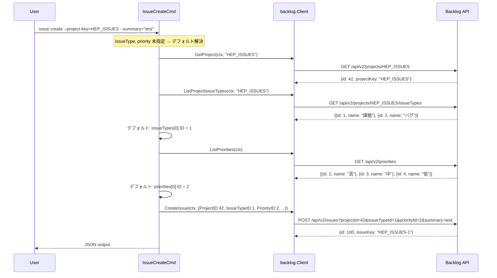
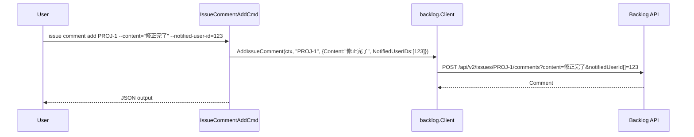

# 更新系コマンドの全面修正（API仕様準拠）

## Context

`logvalet issue create --project-key=HEP_ISSUES --summary="test" --issue-type="課題"` が HTTP 400 `Expect projectId.` で失敗。
Backlog API 公式ドキュメント（https://developer.nulab.com/ja/docs/backlog/）と実装を突合した結果、全更新系コマンドに問題を発見。

## API 仕様と実装の突合結果

### POST /api/v2/issues（課題の追加）

| パラメータ | API仕様 | 現行実装(http_client.go:292-318) | 状態 |
|-----------|---------|------|------|
| projectId | **必須** int | `projectKey`（文字列）を送信 | 🔴 **パラメータ名・型が間違い** |
| summary | **必須** string | ✅ 正しい | ✅ |
| issueTypeId | **必須** int | 文字列を直接送信 | 🟠 名前→ID変換なし |
| priorityId | **必須** int | オプション扱い（空なら送信しない） | 🔴 **必須パラメータをスキップ** |
| description | オプション string | ✅ 正しい | ✅ |
| assigneeId | オプション int | `assigneeUserId` で送信 | 🔴 **パラメータ名が間違い** |
| categoryId[] | オプション int[] | CLI受取あり・API未送信 | 🔴 未実装 |
| versionId[] | オプション int[] | CLI受取あり・API未送信 | 🔴 未実装 |
| milestoneId[] | オプション int[] | CLI受取あり・API未送信 | 🔴 未実装 |
| startDate | オプション string(yyyy-MM-dd) | CLI受取あり・API未送信 | 🔴 未実装 |
| dueDate | オプション string(yyyy-MM-dd) | CLI受取あり・API未送信 | 🔴 未実装 |
| parentIssueId | オプション int | CLI未定義 | ⬜ 未実装（今回対応） |
| notifiedUserId[] | オプション int[] | CLI未定義 | ⬜ 未実装（今回対応） |
| estimatedHours | オプション int | CLI未定義 | ⬜ スコープ外 |
| actualHours | オプション int | CLI未定義 | ⬜ スコープ外 |
| attachmentId[] | オプション int[] | CLI未定義 | ⬜ スコープ外 |

### PATCH /api/v2/issues/:issueIdOrKey（課題情報の更新）

| パラメータ | API仕様 | 現行実装(http_client.go:322-343) | 状態 |
|-----------|---------|------|------|
| summary | オプション string | ✅ 正しい | ✅ |
| description | オプション string | ✅ 正しい | ✅ |
| statusId | オプション int | `statusId` に文字列送信 | 🟠 名前→ID変換なし |
| priorityId | オプション int | CLI受取あり・API未送信 | 🔴 未実装 |
| assigneeId | オプション int | CLI受取あり・API未送信 | 🔴 未実装 |
| issueTypeId | オプション int | CLI未定義 | ⬜ 未実装（今回対応） |
| categoryId[] | オプション int[] | CLI受取あり・API未送信 | 🔴 未実装 |
| versionId[] | オプション int[] | CLI受取あり・API未送信 | 🔴 未実装 |
| milestoneId[] | オプション int[] | CLI受取あり・API未送信 | 🔴 未実装 |
| startDate | オプション string(yyyy-MM-dd) | CLI受取あり・API未送信 | 🔴 未実装 |
| dueDate | オプション string(yyyy-MM-dd) | CLI受取あり・API未送信 | 🔴 未実装 |
| resolutionId | オプション int | CLI未定義 | ⬜ スコープ外 |
| parentIssueId | オプション int | CLI未定義 | ⬜ スコープ外 |
| notifiedUserId[] | オプション int[] | CLI未定義 | ⬜ 未実装（今回対応） |
| comment | オプション string | CLI未定義 | ⬜ 未実装（今回対応） |
| estimatedHours | オプション int | CLI未定義 | ⬜ スコープ外 |
| actualHours | オプション int | CLI未定義 | ⬜ スコープ外 |

### POST /api/v2/issues/:issueIdOrKey/comments（コメントの追加）

| パラメータ | API仕様 | 現行実装(http_client.go:368-380) | 状態 |
|-----------|---------|------|------|
| content | **必須** string | ✅ 正しい | ✅ |
| notifiedUserId[] | オプション int[] | CLI未定義 | ⬜ 未実装（今回対応） |
| attachmentId[] | オプション int[] | CLI未定義 | ⬜ スコープ外 |

### PATCH /api/v2/issues/:issueIdOrKey/comments/:commentId（コメントの更新）

| パラメータ | API仕様 | 現行実装(http_client.go:384-397) | 状態 |
|-----------|---------|------|------|
| content | **必須** string | ✅ 正しい | ✅ 問題なし |

### POST /api/v2/documents（ドキュメントの追加）

| パラメータ | API仕様 | 現行実装(http_client.go:533-550) | 状態 |
|-----------|---------|------|------|
| projectId | **必須** int | ✅ 正しい（CLI層で変換済み） | ✅ |
| title | オプション string | `name` で送信 | 🔴 **パラメータ名が間違い？要確認** |
| content | オプション string | ✅ 正しい | ✅ |
| parentId | オプション string | `parentDocumentId` で送信 | 🔴 **パラメータ名が間違い？要確認** |
| emoji | オプション string | CLI未定義 | ⬜ 未実装（今回対応） |
| addLast | オプション boolean | CLI未定義 | ⬜ 未実装（今回対応） |

## スコープ

### 実装範囲

**issue create（致命的バグ修正 + 全パラメータ実装）:**
- `projectKey` → `projectId` 変換（GetProject で解決）
- `issueTypeId`: 必須 → CLI ではオプション化、未指定時はデフォルト（先頭の課題種別）
- `priorityId`: 必須 → CLI ではオプション化、未指定時はデフォルト（「中」= 先頭の優先度）
- `assigneeUserId` → `assigneeId` パラメータ名修正
- Categories/Versions/Milestones/DueDate/StartDate の API 送信
- `parentIssueId`, `notifiedUserId[]` フラグ追加
- 名前→ID 変換ロジック（IssueType, Priority, Categories, Versions, Milestones）

**issue update（全パラメータ実装）:**
- Priority/Assignee/IssueType/Categories/Versions/Milestones/DueDate/StartDate の API 送信
- Status/Priority/IssueType の名前→ID 変換
- `issueTypeId`, `notifiedUserId[]`, `comment` フラグ追加

**comment add（オプションパラメータ追加）:**
- `notifiedUserId[]` フラグ追加

**document create（パラメータ名修正 + オプション追加）:**
- `name` → `title` パラメータ名確認・修正（API仕様と突合）
- `parentDocumentId` → `parentId` パラメータ名確認・修正
- `emoji`, `addLast` フラグ追加

**共通基盤:**
- Client interface に `ListProjectIssueTypes`, `ListPriorities` 追加
- 名前→ID 変換ヘルパー（`resolve.go`）
- テストコード

### スコープ外
- `estimatedHours`, `actualHours`（工数管理機能は将来対応）
- `attachmentId[]`（ファイル添付は将来対応）
- `resolutionId`（完了理由は将来対応）
- `customField_{id}`（カスタムフィールドはID直接入力前提）
- POST body 形式への移行（現在 URL query params で動作、M06 で整備予定）
  - API仕様は `Content-Type: application/x-www-form-urlencoded` を要求
  - 現行の URL query params 方式でも動作するため、今回は変更しない

## テスト設計書

### A. 新規 API メソッド（`http_client_test.go`）

| ID | テスト | 入力 | 期待出力 |
|----|--------|------|---------|
| T1 | TestHTTPClientListProjectIssueTypes | projectKey="PROJ" | GET `/api/v2/projects/PROJ/issueTypes`、`[]domain.IDName` 返却 |
| T2 | TestHTTPClientListPriorities | なし | GET `/api/v2/priorities`、`[]domain.IDName` 返却 |

### B. CreateIssue HTTP テスト（`http_client_test.go`）

| ID | テスト | 入力 | 期待出力 |
|----|--------|------|---------|
| T3 | TestHTTPClientCreateIssue_sendsProjectId | ProjectID=42 | `projectId=42`（`projectKey` ではない） |
| T4 | TestHTTPClientCreateIssue_allParams | 全フィールド設定 | `projectId`, `issueTypeId`, `priorityId`, `assigneeId`, `categoryId[]`, `versionId[]`, `milestoneId[]`, `dueDate`, `startDate`, `parentIssueId`, `notifiedUserId[]` |
| T5 | TestHTTPClientCreateIssue_optionalSkip | AssigneeID=0 | `assigneeId` が含まれない |

### C. UpdateIssue HTTP テスト（`http_client_test.go`）

| ID | テスト | 入力 | 期待出力 |
|----|--------|------|---------|
| T6 | TestHTTPClientUpdateIssue_allParams | 全フィールド設定 | `statusId`, `priorityId`, `assigneeId`, `issueTypeId`, `categoryId[]`, `versionId[]`, `milestoneId[]`, `dueDate`, `startDate`, `notifiedUserId[]`, `comment` |
| T7 | TestHTTPClientUpdateIssue_nilSkip | 全 nil | 追加パラメータなし |

### D. AddIssueComment HTTP テスト（`http_client_test.go`）

| ID | テスト | 入力 | 期待出力 |
|----|--------|------|---------|
| T7a | TestHTTPClientAddIssueComment_withNotify | Content + NotifiedUserIDs=[1,2] | `content`, `notifiedUserId[]=1`, `notifiedUserId[]=2` |

### E. CreateDocument HTTP テスト（`http_client_test.go`）

| ID | テスト | 入力 | 期待出力 |
|----|--------|------|---------|
| T7b | TestHTTPClientCreateDocument_allParams | 全フィールド | `projectId`, `title`(※API仕様名), `content`, `parentId`(※API仕様名), `emoji`, `addLast` |

### F. 名前→ID 変換ヘルパー（`resolve_test.go` 新規）

| ID | テスト | 入力 | 期待出力 |
|----|--------|------|---------|
| T8 | TestResolveNameOrID_byName | "課題", [{1,"課題"},{2,"バグ"}] | 1, nil |
| T9 | TestResolveNameOrID_byID | "2", [{1,"課題"},{2,"バグ"}] | 2, nil |
| T10 | TestResolveNameOrID_notFound | "不明", [{1,"課題"}] | 0, error |
| T11 | TestResolveNameOrID_empty | "", [{1,"課題"}] | 0, error |
| T11a | TestResolveNameOrID_caseInsensitive | "bug", [{1,"Bug"},{2,"Task"}] | 1, nil |
| T11b | TestResolveNameOrID_duplicateName | "課題", [{1,"課題"},{2,"課題"}] | 0, error（「複数一致」） |
| T12 | TestParseDate_valid | "2026-03-19" | time.Date(2026,3,19,...), nil |
| T13 | TestParseDate_invalid | "invalid" | nil, error |

### G. CLI 層モックテスト（`issue_write_test.go`）

| ID | テスト | 入力 | 期待出力 |
|----|--------|------|---------|
| T14 | TestIssueCreateCmd_run_resolvesProjectKey | GetProject→{ID:42}, IssueTypes→[{1,"課題"}], Priorities→[{3,"中"}] | ProjectID=42, IssueTypeID=1, PriorityID=3 |
| T15 | TestIssueCreateCmd_run_allFieldsPassed | 全フラグ指定 | 全フィールドが CreateIssueRequest に含まれる |
| T16 | TestIssueCreateCmd_run_issueTypeDefault | IssueType="" | デフォルト: 先頭要素の ID |
| T16a | TestIssueCreateCmd_run_priorityDefault | Priority="" | デフォルト: 先頭要素の ID |
| T16b | TestIssueCreateCmd_run_issueTypeNotFound | IssueType="不明" | エラー + 利用可能一覧 |
| T17 | TestIssueUpdateCmd_run_allFieldsPassed | 全フラグ指定 | 全フィールドが UpdateIssueRequest に含まれる |

## 実装手順

### Step 1: 名前→ID 変換ヘルパー追加

**新規**: `internal/cli/resolve.go`
- `resolveNameOrID(input string, items []domain.IDName) (int, error)` — 数値ならそのまま、文字列なら case-insensitive 完全一致。複数一致→エラー。エラーに利用可能一覧を含む
- `resolveNamesOrIDs(inputs []string, items []domain.IDName) ([]int, error)` — 複数値版
- `parseDate(s string) (*time.Time, error)` — `YYYY-MM-DD` → `*time.Time`
- `toIDNames` 系ヘルパー — Category/Version/Status → IDName 変換

**0 値セマンティクス**: int 型フィールドの 0 = 未指定。HTTP クライアントは 0 をスキップ

**新規**: `internal/cli/resolve_test.go` — T8〜T13

### Step 2: Client interface + HTTPClient に 2 メソッド追加

**`internal/backlog/client.go`**:
- `ListProjectIssueTypes(ctx, projectKey string) ([]domain.IDName, error)` — GET /api/v2/projects/{key}/issueTypes
- `ListPriorities(ctx) ([]domain.IDName, error)` — GET /api/v2/priorities

**`internal/backlog/http_client.go`**: 上記2メソッド実装（既存の ListProjectStatuses と同パターン）

**`internal/backlog/mock_client.go`**: Func フィールド + 委譲メソッド追加

### Step 3-7: 型修正 + HTTP実装 + CLI修正（一括変更）

> ⚠️ Step 3〜7 は型変更の連鎖があるため**一括で変更**し、全ファイルが整合した状態でコミットすること。

### Step 3: Request 型修正

**`internal/backlog/types.go`**:

```go
// CreateIssueRequest — Before → After
type CreateIssueRequest struct {
    ProjectID       int               // ProjectKey string → ProjectID int
    Summary         string
    IssueTypeID     int               // IssueType string → int
    Description     string
    PriorityID      int               // Priority string → int
    AssigneeID      int               // Assignee string → int (0=未指定)
    CategoryIDs     []int             // Categories []string → []int
    VersionIDs      []int             // Versions []string → []int
    MilestoneIDs    []int             // Milestones []string → []int
    DueDate         *time.Time
    StartDate       *time.Time
    ParentIssueID   int               // 新規 (0=未指定)
    NotifiedUserIDs []int             // 新規
    CustomFields    map[string]string
}

// UpdateIssueRequest — Before → After
type UpdateIssueRequest struct {
    Summary         *string
    Description     *string
    StatusID        *int              // Status *string → *int
    PriorityID      *int              // Priority *string → *int
    AssigneeID      *int              // Assignee *string → *int
    IssueTypeID     *int              // 新規
    CategoryIDs     []int             // Categories []string → []int
    VersionIDs      []int             // Versions []string → []int
    MilestoneIDs    []int             // Milestones []string → []int
    DueDate         *time.Time
    StartDate       *time.Time
    NotifiedUserIDs []int             // 新規
    Comment         *string           // 新規
    CustomFields    map[string]string
}

// AddCommentRequest — Before → After
type AddCommentRequest struct {
    Content         string
    NotifiedUserIDs []int             // 新規
}

// CreateDocumentRequest — パラメータ名確認後に修正
// (emoji, addLast 追加)
type CreateDocumentRequest struct {
    ProjectID int
    Title     string
    Content   string
    ParentID  *string
    Emoji     string                  // 新規
    AddLast   bool                    // 新規
}
```

### Step 4: HTTPClient の更新系メソッド修正

**`internal/backlog/http_client.go`**:

#### CreateIssue (line 292-318) — 全面書き直し:
```go
q.Set("projectId", strconv.Itoa(reqBody.ProjectID))       // 修正: projectKey → projectId
q.Set("summary", reqBody.Summary)
q.Set("issueTypeId", strconv.Itoa(reqBody.IssueTypeID))   // 修正: string → int
q.Set("priorityId", strconv.Itoa(reqBody.PriorityID))     // 修正: 必須に変更
if reqBody.Description != "" { q.Set("description", ...) }
if reqBody.AssigneeID > 0 { q.Set("assigneeId", ...) }    // 修正: assigneeUserId → assigneeId
if reqBody.ParentIssueID > 0 { q.Set("parentIssueId", ...) }  // 新規
for _, id := range reqBody.CategoryIDs { q.Add("categoryId[]", ...) }   // 新規
for _, id := range reqBody.VersionIDs { q.Add("versionId[]", ...) }     // 新規
for _, id := range reqBody.MilestoneIDs { q.Add("milestoneId[]", ...) } // 新規
for _, id := range reqBody.NotifiedUserIDs { q.Add("notifiedUserId[]", ...) } // 新規
if reqBody.DueDate != nil { q.Set("dueDate", .Format("2006-01-02")) }     // 新規
if reqBody.StartDate != nil { q.Set("startDate", .Format("2006-01-02")) } // 新規
```

#### UpdateIssue (line 322-343) — 全パラメータ追加:
```go
if reqBody.Summary != nil { q.Set("summary", ...) }
if reqBody.Description != nil { q.Set("description", ...) }
if reqBody.StatusID != nil { q.Set("statusId", strconv.Itoa(*reqBody.StatusID)) }
if reqBody.PriorityID != nil { q.Set("priorityId", ...) }    // 新規
if reqBody.AssigneeID != nil { q.Set("assigneeId", ...) }    // 新規（パラメータ名修正）
if reqBody.IssueTypeID != nil { q.Set("issueTypeId", ...) }  // 新規
for _, id := range reqBody.CategoryIDs { q.Add("categoryId[]", ...) }
for _, id := range reqBody.VersionIDs { q.Add("versionId[]", ...) }
for _, id := range reqBody.MilestoneIDs { q.Add("milestoneId[]", ...) }
for _, id := range reqBody.NotifiedUserIDs { q.Add("notifiedUserId[]", ...) }
if reqBody.DueDate != nil { q.Set("dueDate", ...) }
if reqBody.StartDate != nil { q.Set("startDate", ...) }
if reqBody.Comment != nil { q.Set("comment", ...) }          // 新規
```

#### AddIssueComment (line 368-380) — notifiedUserId[] 追加:
```go
q.Set("content", reqBody.Content)
for _, id := range reqBody.NotifiedUserIDs { q.Add("notifiedUserId[]", ...) }
```

#### CreateDocument (line 533-550) — パラメータ名修正 + 新規追加:
```go
q.Set("projectId", strconv.Itoa(reqBody.ProjectID))
q.Set("title", reqBody.Title)           // 要確認: name → title ?
q.Set("content", reqBody.Content)
if reqBody.ParentID != nil { q.Set("parentId", *reqBody.ParentID) }  // 要確認: parentDocumentId → parentId ?
if reqBody.Emoji != "" { q.Set("emoji", reqBody.Emoji) }    // 新規
if reqBody.AddLast { q.Set("addLast", "true") }             // 新規
```

### Step 5: IssueCreateCmd の修正

**`internal/cli/issue.go`**

#### CLI フラグ変更:
```go
type IssueCreateCmd struct {
    WriteFlags
    ProjectKey      string   `required:"" help:"プロジェクトキー"`
    Summary         string   `required:"" help:"課題のサマリー"`
    IssueType       string   `help:"課題種別 (名前またはID)。未指定時はプロジェクトのデフォルト種別"`  // required 削除
    Description     string   `help:"課題の説明"`
    DescriptionFile string   `help:"課題の説明をファイルから読み込む"`
    Priority        string   `help:"優先度 (名前またはID)。未指定時はデフォルト優先度"`  // ← help改善
    Assignee        string   `help:"担当者のユーザーID"`
    Category        []string `help:"カテゴリ (名前またはID、複数指定可)"`
    Version         []string `name:"versions" help:"バージョン (名前またはID、複数指定可)"`
    Milestone       []string `help:"マイルストーン (名前またはID、複数指定可)"`
    DueDate         string   `help:"期限日 (YYYY-MM-DD)"`
    StartDate       string   `help:"開始日 (YYYY-MM-DD)"`
    ParentIssueID   int      `help:"親課題のID"`                        // 新規
    NotifiedUserID  []int    `help:"通知先ユーザーID (複数指定可)"`      // 新規
}
```

#### Run メソッド — 名前→ID 変換ロジック:
```go
// 1. projectKey → projectId
proj, err := rc.Client.GetProject(ctx, c.ProjectKey)

// 2. issueType 解決（未指定時はデフォルト = 先頭要素）
issueTypes, err := rc.Client.ListProjectIssueTypes(ctx, c.ProjectKey)
var issueTypeID int
if c.IssueType == "" {
    if len(issueTypes) == 0 { return error }
    issueTypeID = issueTypes[0].ID  // デフォルト
} else {
    issueTypeID, err = resolveNameOrID(c.IssueType, issueTypes)
}

// 3. priority 解決（未指定時はデフォルト = 先頭要素）← API必須パラメータ
priorities, err := rc.Client.ListPriorities(ctx)
var priorityID int
if c.Priority == "" {
    if len(priorities) == 0 { return error }
    priorityID = priorities[0].ID  // デフォルト
} else {
    priorityID, err = resolveNameOrID(c.Priority, priorities)
}

// 4. assignee（数値直接入力）
var assigneeID int
if c.Assignee != "" { assigneeID, err = strconv.Atoi(c.Assignee) }

// 5. categories 名前→ID
var categoryIDs []int
if len(c.Category) > 0 {
    cats, _ := rc.Client.ListProjectCategories(ctx, c.ProjectKey)
    categoryIDs, _ = resolveNamesOrIDs(c.Category, toIDNames(cats))
}

// 6. versions / milestones — 同じ API (ListProjectVersions)
// 7. dates → parseDate
// 8. API 呼び出し
```

### Step 6: IssueUpdateCmd の修正

**`internal/cli/issue.go`**

#### CLI フラグ追加:
```go
type IssueUpdateCmd struct {
    // ...既存フィールド...
    IssueType      *string  `help:"課題種別 (名前またはID)"`            // 新規
    NotifiedUserID []int    `help:"通知先ユーザーID (複数指定可)"`      // 新規
    Comment        *string  `help:"更新時のコメント"`                    // 新規
}
```

#### Run メソッド:
- issueKey からプロジェクトキー抽出（`strings.Split(key, "-")[0]` or issueKey の prefix）
- Status/Priority/IssueType の名前→ID 変換（指定時のみ）
- Categories/Versions/Milestones の名前→ID 変換
- DueDate/StartDate の parseDate
- 全フィールドを UpdateIssueRequest に含める

### Step 6a: IssueCommentAddCmd の修正

**`internal/cli/issue.go`**

#### CLI フラグ追加:
```go
type IssueCommentAddCmd struct {
    // ...既存フィールド...
    NotifiedUserID []int `help:"通知先ユーザーID (複数指定可)"`  // 新規
}
```

#### Run メソッド:
- `NotifiedUserIDs` を `AddCommentRequest` に含める

### Step 6b: DocumentCreateCmd の修正

**`internal/cli/document.go`**

#### CLI フラグ追加:
```go
type DocumentCreateCmd struct {
    // ...既存フィールド...
    Emoji   string `help:"タイトル横の絵文字"`        // 新規
    AddLast bool   `help:"末尾に追加する"`             // 新規
}
```

#### Run メソッド + HTTPClient:
- `Emoji`, `AddLast` を Request に含める
- パラメータ名を API 仕様に合わせて確認・修正

### Step 7: 既存テストの修正 + 新規テスト

- `types_test.go`: フィールド名変更対応
- `http_client_test.go`: T1〜T7, T7a, T7b 追加
- `issue_write_test.go`: T14〜T17 追加
- `resolve_test.go`: T8〜T13（Step 1 で作成済み）

### Step 8: ドキュメント更新

#### `README.md`:
- issue create の例を更新（`--issue-type` はオプション、名前/ID 両方可）
- issue update の例に `--priority`, `--assignee` 等を追加
- comment add の例に `--notified-user-id` を追加
- document create の例に `--emoji`, `--add-last` を追加
- Safety セクション: 名前→ID 自動解決の説明追加

#### `skills/logvalet/SKILL.md`:
- issue create セクション:
  - `--issue-type` を required から外す記述に更新
  - デフォルト動作の説明（未指定時はプロジェクトのデフォルト種別/優先度を使用）
  - 名前指定例: `--issue-type "課題"`, `--priority "中"`
  - `--parent-issue-id`, `--notified-user-id` フラグ追加
- issue update セクション:
  - `--issue-type`, `--notified-user-id`, `--comment` フラグ追加
  - 名前指定例: `--status "処理中"`, `--priority "高"`
- comment add セクション:
  - `--notified-user-id` フラグ追加
- document create セクション:
  - `--emoji`, `--add-last` フラグ追加
- Recommended patterns セクション:
  - パターン3「Resolve metadata before mutating issues」を更新
  - 名前→ID 自動解決があるため meta コマンドの事前呼び出しは不要になった旨を記載
- Minimal command set: issue create から `--issue-type` を外す

## シーケンス図

### issue create（修正後）



### comment add（修正後）



## リスク評価

| リスク | 重大度 | 対策 |
|--------|--------|------|
| types.go 型変更でコンパイルエラー多発 | 中 | Step 3-7 を一括変更。コンパイラが全箇所を検出 |
| document create のパラメータ名（name vs title, parentDocumentId vs parentId） | 中 | API仕様に従い修正。既存テストで回帰確認 |
| priorityId デフォルト値が「高」になる可能性 | 低 | ListPriorities の先頭が何かは確認必要。「中」が一般的だが保証はない |
| issueTypes API の displayOrder ソート保証なし | 低 | API ドキュメントにソート順の記載なし。先頭要素を使用（通常は最初に作成された種別） |

## チェックリスト

### 観点1: 実装実現可能性と完全性
- [x] 手順の抜け漏れがないか（issue/comment/document 全更新系カバー）
- [x] 各ステップが十分に具体的か
- [x] 依存関係が明示されているか（Step 3-7 一括）
- [x] 変更対象ファイルが網羅されているか
- [x] 影響範囲が正確に特定されているか

### 観点2: TDD テスト設計の品質
- [x] 正常系テストケースが網羅されているか
- [x] 異常系テストケースが定義されているか
- [x] エッジケースが考慮されているか（デフォルト解決、case-insensitive、複数一致）
- [x] 入出力が具体的に記述されているか
- [x] Red→Green→Refactor の順序が守られているか
- [x] モック/スタブの設計が適切か

### 観点3: アーキテクチャ整合性
- [x] 既存の命名規則に従っているか
- [x] 設計パターンが一貫しているか（DocumentCreateCmd パターン踏襲）
- [x] モジュール分割が適切か
- [x] 依存方向が正しいか
- [x] API 仕様のパラメータ名と一致しているか（**今回の主要修正点**）

### 観点4: リスク評価と対策
- [x] リスクが適切に特定されているか
- [x] 対策が具体的か
- [x] フェイルセーフが考慮されているか
- [x] パフォーマンスへの影響が評価されているか
- [x] セキュリティ観点が含まれているか
- [x] ロールバック計画があるか

### 観点5: シーケンス図の完全性
- [x] 正常フローが記述されているか
- [x] デフォルト解決フローが記述されているか
- [x] comment add の修正フローが記述されているか
- [x] 条件分岐が明記されているか
- [x] N/A: リトライ・タイムアウト

## 変更ファイル一覧

| ファイル | 変更内容 |
|---------|---------|
| `internal/cli/resolve.go` | **新規**: resolveNameOrID, resolveNamesOrIDs, parseDate, toIDNames |
| `internal/cli/resolve_test.go` | **新規**: T8〜T13 |
| `internal/backlog/client.go` | ListProjectIssueTypes, ListPriorities 追加 |
| `internal/backlog/http_client.go` | 2メソッド追加 + CreateIssue/UpdateIssue/AddIssueComment/CreateDocument 修正 |
| `internal/backlog/types.go` | CreateIssueRequest, UpdateIssueRequest, AddCommentRequest, CreateDocumentRequest 型修正 |
| `internal/backlog/mock_client.go` | 2メソッド追加 |
| `internal/backlog/http_client_test.go` | T1〜T7b 追加 |
| `internal/cli/issue.go` | IssueCreateCmd, IssueUpdateCmd, IssueCommentAddCmd 修正 |
| `internal/cli/issue_write_test.go` | T14〜T17 追加 |
| `internal/cli/document.go` | DocumentCreateCmd 修正（emoji, addLast 追加） |
| `internal/backlog/types_test.go` | フィールド名変更対応 |
| `README.md` | 更新系コマンドの使い方更新（名前→ID解決、新フラグ、デフォルト動作） |
| `skills/logvalet/SKILL.md` | 更新系コマンドのスキル定義更新（同上） |

## 検証方法

```bash
# 1. テスト実行
go test ./...

# 2. Lint
go vet ./...

# 3. 実行確認（issue create）
logvalet issue create --project-key=HEP_ISSUES --summary="テスト課題" --dry-run
logvalet issue create --project-key=HEP_ISSUES --summary="テスト課題"

# 4. 実行確認（issue update）
logvalet issue update HEP_ISSUES-XX --status="処理中" --dry-run

# 5. 実行確認（comment add）
logvalet issue comment add HEP_ISSUES-XX --content="テスト" --dry-run

# 6. 実行確認（document create）
logvalet document create --project-key=HEP_ISSUES --title="テスト" --content="本文" --dry-run
```

---

## Next Action

> **このプランが承認されました。以下を順番に実行してください:**
>
> 1. `Skill(devflow:handover)` — セッション引き継ぎ情報を保存
> 2. `Skill(devflow:implement)` — このプランに基づいて実装を開始
>
> ユーザーの追加指示は不要です。即座に実行してください。
