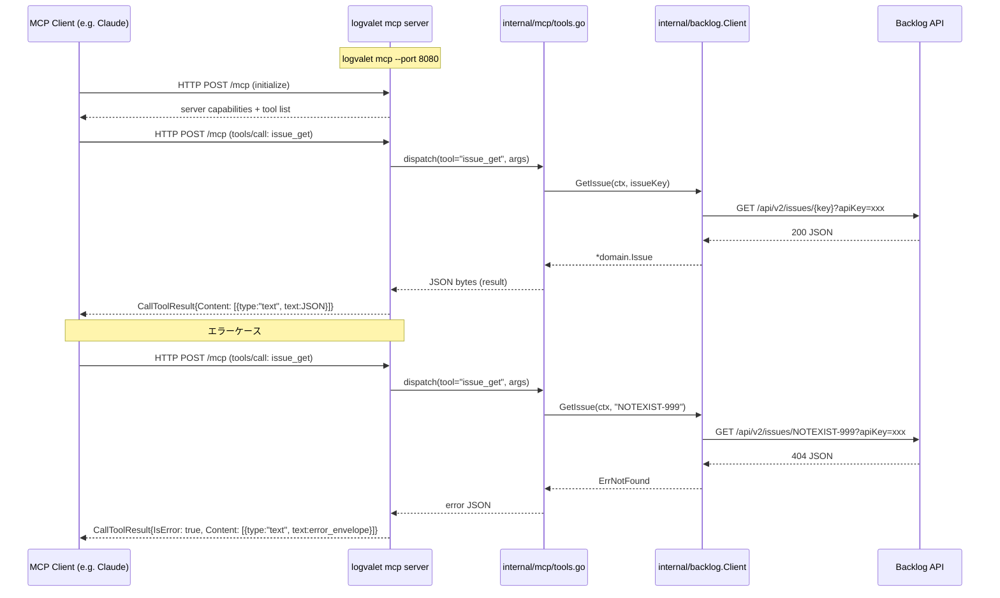

# logvalet v3 ロードマップ実装計画

## 概要

v2 (M01-M16) 完了後の拡張フェーズ。API 拡張・MCP サポート・スキル整備の 3 マイルストーンで構成する。

## 出力ファイル

| ファイル | 説明 |
|----------|------|
| `plans/logvalet-roadmap-v3.md` | v3 ロードマップ全体 |
| `plans/logvalet-m17-api-ext.md` | M17: API 拡張（共有ファイル・添付ファイル・スター） |
| `plans/logvalet-m18-mcp.md` | M18: MCP サブコマンド |
| `plans/logvalet-m19-skill-rename.md` | M19: スキル prefix リネーム |

---

## M17: API 拡張（共有ファイル + 課題添付ファイル + スター追加）

### 変更対象ファイル

**新規作成:**
- `internal/domain/shared_file.go` — SharedFile ドメインモデル
- `internal/backlog/shared_file.go` — 共有ファイル API 実装
- `internal/cli/shared_file.go` — `logvalet shared-file` コマンド
- `internal/cli/shared_file_test.go`
- `internal/backlog/star.go` — スター追加 API 実装
- `internal/cli/star.go` — `logvalet star` コマンド
- `internal/cli/star_test.go`

**更新:**
- `internal/domain/domain.go` — IssueAttachment 型追加（Attachment を issue 用に特化）
- `internal/backlog/client.go` — 6 メソッド追加
- `internal/backlog/http_client.go` — 6 メソッド実装追加
- `internal/backlog/mock_client.go` — 6 Func フィールド追加
- `internal/backlog/types.go` — AddStarRequest 追加
- `internal/backlog/options.go` — ListSharedFilesOptions, ListIssueAttachmentsOptions 追加
- `internal/cli/root.go` — SharedFile, Star コマンド登録
- `internal/cli/issue.go` — IssueAttachmentCmd 追加

### Client インターフェース追加メソッド（6本）

```go
// Shared files
ListSharedFiles(ctx context.Context, projectKey string, opt ListSharedFilesOptions) ([]domain.SharedFile, error)
GetSharedFile(ctx context.Context, projectKey string, fileID int64) (*domain.SharedFile, error)
DownloadSharedFile(ctx context.Context, projectKey string, fileID int64) ([]byte, string, error) // []byte=body, string=filename

// Issue attachments
ListIssueAttachments(ctx context.Context, issueKey string) ([]domain.IssueAttachment, error)
DeleteIssueAttachment(ctx context.Context, issueKey string, attachmentID int64) error
DownloadIssueAttachment(ctx context.Context, issueKey string, attachmentID int64) ([]byte, string, error)

// Stars
AddStar(ctx context.Context, req AddStarRequest) error
```

### ドメインモデル

```go
// internal/domain/shared_file.go
type SharedFile struct {
    ID          int64      `json:"id"`
    Type        string     `json:"type"`          // "file" or "directory"
    Dir         string     `json:"dir"`
    Name        string     `json:"name"`
    Size        int64      `json:"size"`
    CreatedUser *User      `json:"createdUser,omitempty"`
    Created     *time.Time `json:"created,omitempty"`
    UpdatedUser *User      `json:"updatedUser,omitempty"`
    Updated     *time.Time `json:"updated,omitempty"`
}

// internal/domain/domain.go に追加
type IssueAttachment struct {
    ID          int64      `json:"id"`
    Name        string     `json:"name"`
    Size        int64      `json:"size"`
    CreatedUser *User      `json:"createdUser,omitempty"`
    Created     *time.Time `json:"created,omitempty"`
}
```

### Options / Request 追加

```go
// options.go に追加
type ListSharedFilesOptions struct {
    Path   string
    Limit  int
    Offset int
    Order  string // "asc" | "desc"
}

// types.go に追加
type AddStarRequest struct {
    IssueID              *int64
    CommentID            *int64
    WikiID               *int64
    PullRequestID        *int64
    PullRequestCommentID *int64
}
```

### CLI コマンド設計

```
logvalet shared-file list --project KEY [--path PATH] [--limit N] [--offset N]
logvalet shared-file get --project KEY FILE-ID
logvalet shared-file download --project KEY FILE-ID [--output PATH]

logvalet issue attachment list ISSUE-KEY
logvalet issue attachment delete ISSUE-KEY ATTACHMENT-ID [--force]
logvalet issue attachment download ISSUE-KEY ATTACHMENT-ID [--output PATH]

logvalet star add (--issue-id ID | --comment-id ID | --wiki-id ID | --pr-id ID | --pr-comment-id ID)
```

注: download 系はバイナリをファイルに書き出す。stdout には書かない（JSON renderer と衝突するため）。
`--output` 省略時はカレントディレクトリにファイル名で保存。

### TDD テスト設計書（M17）

#### 正常系

| テストケース | 入力 | 期待出力 |
|------------|------|---------|
| ListSharedFiles 基本 | projectKey="TEST", opt={} | []SharedFile |
| ListSharedFiles path フィルタ | opt.Path="/docs" | クエリに `path=/docs` が付与されること |
| ListSharedFiles limit/offset | opt.Limit=10, Offset=20 | クエリ `count=10&offset=20` |
| GetSharedFile 基本 | projectKey="TEST", fileID=123 | *SharedFile |
| DownloadSharedFile | projectKey="TEST", fileID=123 | バイナリ data + filename |
| ListIssueAttachments | issueKey="TEST-1" | []IssueAttachment |
| DeleteIssueAttachment | issueKey="TEST-1", attachmentID=456 | nil error |
| AddStar issueId 指定 | req.IssueID=ptr(789) | nil error |
| AddStar 排他バリデーション pass | issueId のみ | nil error |

#### 異常系

| テストケース | 入力 | 期待エラー |
|------------|------|-----------|
| GetSharedFile 存在しない | fileID=999 | ErrNotFound |
| DeleteIssueAttachment 権限なし | 403 | ErrForbidden |
| AddStar 全フィールドnil | req={} | ErrValidation / CLIバリデーションエラー |
| AddStar 複数フィールド指定 | issueId + commentId | バリデーションエラー（Kong exclusive flags） |

#### エッジケース

| テストケース | 説明 |
|------------|------|
| DownloadSharedFile サイズ 0 | 空ファイルのダウンロード |
| ListSharedFiles 空リスト | API が [] 返却 |
| DownloadIssueAttachment Content-Disposition ヘッダなし | fallback でファイル名生成 |

---

## M18: MCP サブコマンド

### アーキテクチャ方針

- Go SDK: `mark3labs/mcp-go`（最も成熟した Go MCP SDK）
- トランスポート: Streamable HTTP (MCP 2025-03-26 仕様)
- 変換レイヤー: `internal/mcp/` パッケージを新設
- 既存 CLI コマンドの Run メソッドを MCP tool として再利用
- 認証: 既存 GlobalFlags / credentials.ResolveCredential を継続使用

### 変更対象ファイル

**新規作成:**
- `internal/mcp/server.go` — MCPServer struct と Start()
- `internal/mcp/tools.go` — CLI → MCP tool マッピングレジストリ
- `internal/mcp/tools_issue.go` — issue 系ツール定義
- `internal/mcp/tools_project.go` — project 系ツール定義
- `internal/mcp/tools_user.go` — user 系ツール定義
- `internal/mcp/tools_activity.go` — activity 系ツール定義
- `internal/mcp/tools_document.go` — document 系ツール定義
- `internal/mcp/tools_team.go` — team 系ツール定義
- `internal/mcp/tools_space.go` — space 系ツール定義
- `internal/mcp/server_test.go`
- `internal/mcp/tools_issue_test.go`
- `internal/cli/mcp_cmd.go` — `logvalet mcp` コマンド
- `internal/cli/mcp_cmd_test.go`

**更新:**
- `internal/cli/root.go` — MCP コマンド登録
- `go.mod` / `go.sum` — mark3labs/mcp-go 依存追加

### MCP tool 一覧（MVP）

| tool 名 | 対応 CLI コマンド | 説明 |
|---------|----------------|------|
| `issue_get` | `issue get` | 課題取得 |
| `issue_list` | `issue list` | 課題一覧 |
| `issue_create` | `issue create` | 課題作成 |
| `issue_update` | `issue update` | 課題更新 |
| `issue_comment_list` | `issue comment list` | コメント一覧 |
| `issue_comment_add` | `issue comment add` | コメント追加 |
| `project_get` | `project get` | プロジェクト取得 |
| `project_list` | `project list` | プロジェクト一覧 |
| `user_list` | `user list` | ユーザー一覧 |
| `user_get` | `user get` | ユーザー取得 |
| `space_info` | `space info` | スペース情報 |
| `activity_list` | `activity list` | アクティビティ一覧 |
| `document_get` | `document get` | ドキュメント取得 |
| `document_list` | `document list` | ドキュメント一覧 |
| `document_create` | `document create` | ドキュメント作成 |

### CLI コマンド設計

```
logvalet mcp [--port PORT] [--host HOST]
```

| フラグ | デフォルト | 説明 |
|-------|-----------|------|
| `--port` | `8080` | リスンポート |
| `--host` | `0.0.0.0` | リスンホスト |

### MCP サーバー処理フロー（Mermaid）



### 変換レイヤー設計

```go
// internal/mcp/tools.go
type ToolFunc func(ctx context.Context, client backlog.Client, args map[string]interface{}) (interface{}, error)

type ToolRegistry struct {
    tools map[string]mcp.Tool
    funcs map[string]ToolFunc
}

func (r *ToolRegistry) Register(tool mcp.Tool, fn ToolFunc)
func (r *ToolRegistry) Build(client backlog.Client) *mcp.Server
```

各 tools_*.go は `RegisterXxxTools(r *ToolRegistry)` を提供する。
tools.go の `NewToolRegistry()` が全 RegisterXxx を呼び出す。

### TDD テスト設計書（M18）

#### 正常系

| テストケース | 説明 | 期待 |
|------------|------|------|
| サーバー起動 | Start() が goroutine で HTTP を bind する | nil error |
| issue_get 呼び出し | MockClient.GetIssueFunc セット | JSON レスポンス含む CallToolResult |
| issue_list 呼び出し | MockClient.ListIssuesFunc セット | JSON 配列 |
| project_get 呼び出し | MockClient.GetProjectFunc セット | JSON レスポンス |
| ツール一覧 | ListTools() | 15 ツール以上 |

#### 異常系

| テストケース | 説明 | 期待 |
|------------|------|------|
| issue_get ErrNotFound | MockClient が ErrNotFound を返す | IsError: true, error envelope JSON |
| 未知ツール名 | 存在しない tool name | エラーレスポンス |
| 必須パラメータ欠落 | issueKey なしで issue_get | バリデーションエラー |

#### エッジケース

| テストケース | 説明 |
|------------|------|
| ポート競合 | 既使用ポートで起動 | bind error |
| コンテキストキャンセル | ctx.Cancel() でリクエスト中断 | context.Canceled エラー |

---

## M19: スキル prefix リネーム

### 変更内容

| 旧パス | 新パス | 旧 name | 新 name |
|--------|--------|---------|---------|
| `skills/backlog/report/` | `skills/logvalet-report/` | `backlog:report` | `logvalet:report` |
| `skills/backlog/my-week/` | `skills/logvalet-my-week/` | `backlog:my-week` | `logvalet:my-week` |
| `skills/backlog/my-next/` | `skills/logvalet-my-next/` | `backlog:my-next` | `logvalet:my-next` |
| `skills/backlog/issue-create/` | `skills/logvalet-issue-create/` | `backlog:issue-create` | `logvalet:issue-create` |

旧 `skills/backlog/` ディレクトリは削除。

### npx skills add 対応

各スキルディレクトリ直下に `SKILL.md` を配置する形式（現状と同じ）で問題なし。
`npx @anthropic-ai/skills add logvalet:report` の形式でインストール可能になる前提で、
スキル名を `logvalet:` prefix に統一する。

### 変更対象ファイル

**ディレクトリ操作:**
- `skills/backlog/report/SKILL.md` → `skills/logvalet-report/SKILL.md`
- `skills/backlog/my-week/SKILL.md` → `skills/logvalet-my-week/SKILL.md`
- `skills/backlog/my-next/SKILL.md` → `skills/logvalet-my-next/SKILL.md`
- `skills/backlog/issue-create/SKILL.md` → `skills/logvalet-issue-create/SKILL.md`
- `skills/backlog/` — 空になったら削除

**各 SKILL.md 内の更新:**
- frontmatter `name:` フィールドを `backlog:xxx` → `logvalet:xxx` に変更
- `description:` 内の `backlog:` 参照を `logvalet:` に変更
- 本文中の「`backlog:report` スキル」等の参照を `logvalet:report` に変更
- ただし Backlog（サービス名）の言及はそのまま保持

**テスト:**
M19 はファイル操作のみのため Go テストなし。
SKILL.md の frontmatter 検証は手動確認またはシェルスクリプトで行う。

---

## リスク評価

| リスク | 発生確率 | 影響度 | 対策 |
|--------|---------|--------|------|
| mark3labs/mcp-go の Streamable HTTP 未対応 | 中 | 高 | 実装前に go get して動作確認。SSE フォールバックも検討 |
| DownloadSharedFile の大容量ファイル | 低 | 中 | streaming read + io.Copy でメモリ効率化。PoC で確認 |
| AddStar の排他パラメータ検証 | 低 | 低 | Kong の exclusive flags または Run() 内バリデーション |
| MCP tool 数増加によるメモリ使用 | 低 | 低 | 1 tool あたり軽量な closure のため問題なし |
| スキルリネームによる既存ユーザーの影響 | 中 | 中 | MIGRATION.md またはエイリアスで旧名を一定期間サポート |

---

## 5観点27項目セルフレビューチェックリスト

### 1. 設計整合性（6項目）

- [ ] 1-1. 既存 Client interface パターンに完全準拠している（newRequest + do + typed error）
- [ ] 1-2. MockClient に全新規 Func フィールドが追加されている
- [ ] 1-3. domain モデルの JSON タグが Backlog API レスポンスの camelCase に準拠している
- [ ] 1-4. CLIコマンドが Kong struct パターンで定義されており、root.go に登録されている
- [ ] 1-5. MCP ツール名が snake_case で CLI コマンドと一対一対応している
- [ ] 1-6. AddStarRequest の排他制約が明示されており、バリデーションロジックが実装されている

### 2. TDD 遵守（5項目）

- [ ] 2-1. 全新規 Client メソッドにモックテストが存在する（Red → Green を確認済み）
- [ ] 2-2. 全 CLI コマンドに正常系・異常系テストが存在する
- [ ] 2-3. MCP tools に tool 呼び出し単体テストが存在する
- [ ] 2-4. `go test ./...` がパスする（テスト全件グリーン）
- [ ] 2-5. テストが実 Backlog API を呼ばない（モックのみ使用）

### 3. エラーハンドリング（5項目）

- [ ] 3-1. BacklogError の typed error (ErrNotFound, ErrForbidden 等) が正しくラップされている
- [ ] 3-2. CLI コマンドのエラーが JSON エンベロープ形式で stdout に出力される
- [ ] 3-3. MCP tool のエラーが `CallToolResult{IsError: true}` で返される
- [ ] 3-4. download 系コマンドのファイル書き込みエラーが適切に処理される
- [ ] 3-5. DownloadSharedFile / DownloadIssueAttachment のファイル名が安全にサニタイズされる

### 4. セキュリティ・品質（6項目）

- [ ] 4-1. DownloadSharedFile / DownloadIssueAttachment の出力先パスがディレクトリトラバーサル対策済み
- [ ] 4-2. MCP サーバーの認証が既存 API key 認証を引き継いでいる
- [ ] 4-3. MCP サーバーが外部ネットワークに晒される想定でポートバインドが明示されている
- [ ] 4-4. `go vet ./...` がクリーンである
- [ ] 4-5. スキルファイルの `name:` フィールドが全て `logvalet:` prefix になっている
- [ ] 4-6. `skills/backlog/` 旧ディレクトリが完全に削除されている

### 5. ドキュメント・計画整合（5項目）

- [ ] 5-1. `plans/logvalet-roadmap-v3.md` に全 3 マイルストーンが記載されている
- [ ] 5-2. 各マイルストーン計画ファイルに変更対象ファイル一覧が記載されている
- [ ] 5-3. Architecture Decisions テーブルに MCP SDK 選定理由が記録されている
- [ ] 5-4. `plans/logvalet-roadmap-v2.md` の Current Focus がv3移行後も参照可能な状態
- [ ] 5-5. CLAUDE.md または MEMORY.md に MCP 追加で生じる運用変化が記録されている

---

## アーキテクチャ決定記録（ADR）

| # | 決定 | 理由 | 日付 |
|---|------|------|------|
| v3-1 | MCP SDK に mark3labs/mcp-go を採用 | Go 向け最成熟 SDK。Streamable HTTP 対応。Apache 2.0 ライセンス | 2026-03-29 |
| v3-2 | MCP tool の結果は JSON 文字列テキストで返す | LLM がパースしやすい。既存 render パッケージと整合 | 2026-03-29 |
| v3-3 | Download 系は `--output` フラグでファイル保存、stdout には出力しない | バイナリを JSON エンベロープに混在させると壊れる | 2026-03-29 |
| v3-4 | スキル prefix を `backlog:` から `logvalet:` に統一 | ツール名がサービス名でなくプロダクト名を指すべき。npx skills add の名前空間整合 | 2026-03-29 |
| v3-5 | M17-M18-M19 の順序でマイルストーンを分割 | API 拡張 → プロトコル拡張 → リソース整理の自然な依存順序 | 2026-03-29 |

