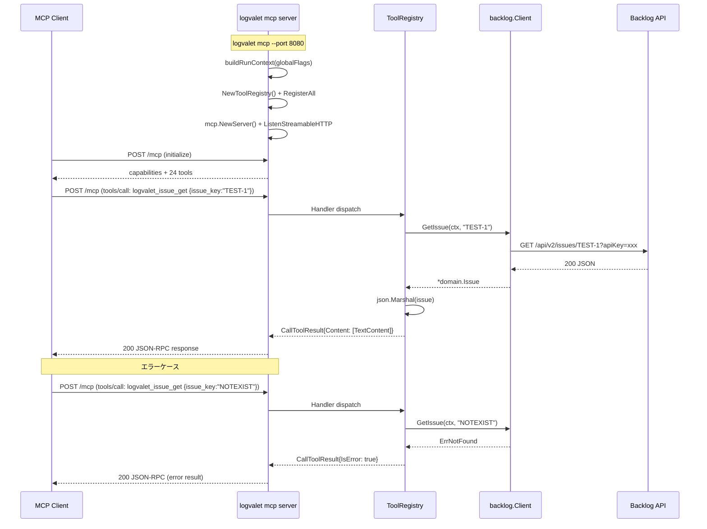

# logvalet v3 ロードマップ実装計画

## Context

logvalet v1 (M01-M12) と v2 (M13-M16) が完了し、CLI としての基本機能が揃った。
v3 では以下3つの方向で機能拡張する:

1. **未対応 Backlog API の追加**（共有ファイル、課題添付ファイル、スター）
2. **MCP サブコマンド**でリモート MCP サーバーとして利用可能に
3. **スキル prefix 統一**（backlog:* → logvalet-*）

## マイルストーン一覧

| M | タイトル | 概要 |
|---|---------|------|
| M17 | API 拡張 | 共有ファイル + 課題添付ファイル + スター追加 |
| M18 | MCP サブコマンド | Streamable HTTP リモート MCP サーバー |
| M19 | スキル prefix リネーム | backlog:* → logvalet-* |

---

## M17: API 拡張（共有ファイル + 課題添付ファイル + スター追加）

### 概要
未対応の Backlog API 3カテゴリを追加。既存パターンを踏襲。

### スコープ

#### 実装範囲
- 共有ファイル: 一覧取得、情報取得、ダウンロード
- 課題添付ファイル: 一覧取得、削除、ダウンロード
- スター: 追加

#### スコープ外
- Wiki API
- Git/PR API
- 通知・ウォッチ API
- ドキュメント更新/削除

### 追加 Client メソッド（7本）

```go
// 共有ファイル
ListSharedFiles(ctx context.Context, projectKey string, opt ListSharedFilesOptions) ([]domain.SharedFile, error)
GetSharedFile(ctx context.Context, projectKey string, fileID int64) (*domain.SharedFile, error)
DownloadSharedFile(ctx context.Context, projectKey string, fileID int64) (io.ReadCloser, string, error)

// 課題添付ファイル
ListIssueAttachments(ctx context.Context, issueKey string) ([]domain.IssueAttachment, error)
DeleteIssueAttachment(ctx context.Context, issueKey string, attachmentID int64) (*domain.IssueAttachment, error)
DownloadIssueAttachment(ctx context.Context, issueKey string, attachmentID int64) (io.ReadCloser, string, error)

// スター
AddStar(ctx context.Context, req AddStarRequest) error
```

### Download IO 設計（ADR v3-6 詳細）

Download 系メソッドは Client interface で初の `io.ReadCloser` 戻り値パターンとなる。

- **戻り値 `string`**: HTTP レスポンスの `Content-Disposition` ヘッダから取得したファイル名。取得できない場合は URL パス末尾を使用
- **`--output` 未指定時**: カレントディレクトリに元ファイル名で保存（`filepath.Base()` でサニタイズ済み）
- **`--output` 指定時**: 指定パスに保存。親ディレクトリが存在しない場合は `os.MkdirAll` で作成
- **download ヘルパー関数** (`internal/cli/download.go`): CLI 層の共通関数として抽出
  - `defer body.Close()` で ReadCloser の Close 保証
  - `filepath.Base()` でパストラバーサル防止
  - `os.Create` + `io.Copy` でストリーミング書き込み（メモリに全展開しない）
  - 書き込み途中でエラー時は部分ファイルを `os.Remove` でクリーンアップ

### ドメインモデル

```go
// internal/domain/shared_file.go
type SharedFile struct {
    ID          int64      `json:"id"`
    Type        string     `json:"type"`        // "file" or "directory"
    Dir         string     `json:"dir"`
    Name        string     `json:"name"`
    Size        int64      `json:"size"`
    CreatedUser *User      `json:"created_user,omitempty"`
    Created     *time.Time `json:"created,omitempty"`
    UpdatedUser *User      `json:"updated_user,omitempty"`
    Updated     *time.Time `json:"updated,omitempty"`
}

// internal/domain/issue_attachment.go
type IssueAttachment struct {
    ID          int64      `json:"id"`
    Name        string     `json:"name"`
    Size        int64      `json:"size"`
    CreatedUser *User      `json:"created_user,omitempty"`
    Created     *time.Time `json:"created,omitempty"`
}
```

### CLI コマンド設計

```
logvalet shared-file list --project KEY [--path PATH] [--offset N] [--count N]
logvalet shared-file get --project KEY FILE-ID
logvalet shared-file download --project KEY FILE-ID [--output PATH]

logvalet issue attachment list ISSUE-KEY
logvalet issue attachment delete ISSUE-KEY ATTACHMENT-ID [--dry-run]
logvalet issue attachment download ISSUE-KEY ATTACHMENT-ID [--output PATH]

logvalet star add (--issue-id ID | --comment-id ID | --wiki-id ID | --pr-id ID | --pr-comment-id ID)
```

### 変更対象ファイル

**新規:**
| ファイル | 内容 |
|---------|------|
| `internal/domain/shared_file.go` | SharedFile 型 |
| `internal/domain/issue_attachment.go` | IssueAttachment 型 |
| `internal/cli/shared_file.go` | SharedFileCmd (list/get/download) |
| `internal/cli/shared_file_test.go` | テスト |
| `internal/cli/issue_attachment.go` | IssueAttachmentCmd (list/delete/download) |
| `internal/cli/issue_attachment_test.go` | テスト |
| `internal/cli/star.go` | StarCmd (add) |
| `internal/cli/star_test.go` | テスト |
| `internal/cli/download.go` | download ヘルパー関数（共通） |
| `internal/cli/download_test.go` | download ヘルパーテスト |

**更新:**
| ファイル | 変更内容 |
|---------|---------|
| `internal/backlog/client.go` | 7 メソッド追加 |
| `internal/backlog/http_client.go` | 7 メソッド実装 |
| `internal/backlog/http_client_test.go` | 7 メソッドテスト |
| `internal/backlog/mock_client.go` | 7 Func フィールド追加 |
| `internal/backlog/mock_client_test.go` | mock テスト |
| `internal/backlog/types.go` | AddStarRequest 追加 |
| `internal/backlog/options.go` | ListSharedFilesOptions 追加 |
| `internal/cli/root.go` | SharedFile, Star 登録 |
| `internal/cli/issue.go` | Attachment フィールド追加（IssueAttachmentCmd への参照のみ） |

### テスト設計書

#### 正常系
| ID | テスト | 入力 | 期待出力 |
|----|-------|------|---------|
| SF-1 | 共有ファイル一覧取得 | projectKey="TEST" | []SharedFile, len > 0 |
| SF-2 | 共有ファイル情報取得 | projectKey="TEST", fileID=1 | SharedFile{ID:1, Name:"test.txt"} |
| SF-3 | 共有ファイルダウンロード | projectKey="TEST", fileID=1 | io.ReadCloser + filename |
| IA-1 | 課題添付一覧取得 | issueKey="TEST-1" | []IssueAttachment |
| IA-2 | 課題添付削除 | issueKey="TEST-1", attachmentID=1 | *IssueAttachment (削除済み) |
| IA-3 | 課題添付ダウンロード | issueKey="TEST-1", attachmentID=1 | io.ReadCloser + filename |
| ST-1 | スター追加(課題) | issueId=123 | nil error |
| ST-2 | スター追加(コメント) | commentId=456 | nil error |

#### 異常系
| ID | テスト | 入力 | 期待エラー |
|----|-------|------|----------|
| SF-E1 | 存在しないプロジェクト | projectKey="NOTEXIST" | ErrNotFound |
| SF-E2 | 存在しないファイル | fileID=999999 | ErrNotFound |
| IA-E1 | 存在しない課題 | issueKey="NOTEXIST-1" | ErrNotFound |
| ST-E1 | スター対象未指定 | 全フィールド nil | validation error |
| ST-E2 | 複数対象指定 | issueId=1, commentId=2 | validation error (排他) |

#### エッジケース
| ID | テスト | 条件 |
|----|-------|------|
| SF-EC1 | 空ディレクトリ | 共有ファイル0件 → []SharedFile{} |
| IA-EC1 | 添付ファイル0件 | → []IssueAttachment{} |
| SF-EC2 | ダウンロード先ディレクトリ不存在 | → os.MkdirAll で作成 |
| SF-EC3 | ファイル名にパストラバーサル | "../../../etc/passwd" → filepath.Base() でサニタイズ |
| IA-DRY-1 | delete --dry-run | 実際に削除されず、削除予定情報のみ出力 |

#### CLI 層テスト
| ID | テスト | 内容 |
|----|-------|------|
| CLI-SF-1 | shared-file download --output | tmpdir にファイル保存 → 内容一致確認 |
| CLI-SF-2 | shared-file download (output 未指定) | カレントディレクトリに元ファイル名で保存 |
| CLI-SF-3 | 既存ファイルへの上書き | 既存ファイルがある場合の振る舞い |
| CLI-IA-1 | issue attachment delete --dry-run | API 呼び出しなし + dry-run 出力確認 |
| CLI-ST-1 | star add 排他バリデーション | 複数指定 → エラー出力確認 |
| CLI-DL-1 | download ヘルパー: 正常書き込み | io.ReadCloser → ファイル + 内容一致 |
| CLI-DL-2 | download ヘルパー: 書き込みエラー | 部分ファイルがクリーンアップされるか |

### 実装手順

1. **Red**: ドメインモデル定義 + Client interface メソッド追加 + mock 生成 + テスト作成（全 fail）
2. **Green**: http_client.go にAPI呼び出し実装 + CLI コマンド実装 → テスト pass
3. **Refactor**: 共通化（download ヘルパー関数抽出等）

---

## M18: MCP サブコマンド

### 概要
`logvalet mcp` でリモート MCP サーバーを起動。Streamable HTTP トランスポート。

### アーキテクチャ

```
                    ┌─────────────────────────┐
                    │   logvalet mcp           │
                    │   --port 8080            │
                    │   --host 127.0.0.1         │
                    ├─────────────────────────┤
                    │   Streamable HTTP        │
                    │   (mark3labs/mcp-go)     │
                    ├─────────────────────────┤
                    │   internal/mcp/          │
                    │   ┌─ server.go           │
                    │   ├─ tools.go            │
                    │   ├─ tools_issue.go      │
                    │   ├─ tools_project.go    │
                    │   ├─ tools_user.go       │
                    │   ├─ tools_activity.go   │
                    │   ├─ tools_document.go   │
                    │   ├─ tools_team.go       │
                    │   ├─ tools_space.go      │
                    │   ├─ tools_meta.go       │
                    │   ├─ tools_shared_file.go│
                    │   └─ tools_star.go       │
                    ├─────────────────────────┤
                    │   internal/backlog/      │
                    │   Client interface       │
                    └────────┬────────────────┘
                             │
                    ┌────────▼────────────────┐
                    │   Backlog API            │
                    │   (heptagon.backlog.com) │
                    └─────────────────────────┘
```

### CLI コマンド

```
logvalet mcp [--port PORT] [--host HOST]
```

- `--port`: リスンポート（default: 8080）
- `--host`: リスンホスト（default: 127.0.0.1）

### 変換レイヤー設計

```go
// internal/mcp/tools.go
type ToolFunc func(ctx context.Context, client backlog.Client, args map[string]any) (any, error)

type ToolRegistry struct {
    tools []mcp.ServerTool
    funcs map[string]ToolFunc
}

func NewToolRegistry() *ToolRegistry
func (r *ToolRegistry) Register(name, description string, schema mcp.ToolInputSchema, fn ToolFunc)
func (r *ToolRegistry) Handler(client backlog.Client) func(ctx context.Context, request mcp.CallToolRequest) (*mcp.CallToolResult, error)
```

### MCP tool 一覧（24本）

| tool 名 | 対応 CLI | 説明 |
|---------|---------|------|
| `logvalet_issue_get` | `issue get` | 課題情報取得 |
| `logvalet_issue_list` | `issue list` | 課題一覧取得 |
| `logvalet_issue_create` | `issue create` | 課題作成 |
| `logvalet_issue_update` | `issue update` | 課題更新 |
| `logvalet_issue_comment_list` | `issue comment list` | コメント一覧 |
| `logvalet_issue_comment_add` | `issue comment add` | コメント追加 |
| `logvalet_issue_comment_update` | `issue comment update` | コメント更新 |
| `logvalet_issue_attachment_list` | `issue attachment list` | 課題添付ファイル一覧 |
| `logvalet_project_get` | `project get` | プロジェクト取得 |
| `logvalet_project_list` | `project list` | プロジェクト一覧 |
| `logvalet_user_list` | `user list` | ユーザー一覧 |
| `logvalet_user_get` | `user get` | ユーザー取得 |
| `logvalet_space_info` | `space info` | スペース情報 |
| `logvalet_activity_list` | `activity list` | アクティビティ一覧 |
| `logvalet_document_get` | `document get` | ドキュメント取得 |
| `logvalet_document_list` | `document list` | ドキュメント一覧 |
| `logvalet_document_create` | `document create` | ドキュメント作成 |
| `logvalet_team_list` | `team list` | チーム一覧 |
| `logvalet_team_get` | `team get` | チーム情報取得（メンバー含む） |
| `logvalet_meta_statuses` | `meta status` | プロジェクトステータス一覧 |
| `logvalet_meta_issue_types` | `meta issue-type` | 課題タイプ一覧（issue_create の前段で必要） |
| `logvalet_meta_categories` | `meta category` | カテゴリ一覧 |
| `logvalet_shared_file_list` | `shared-file list` | 共有ファイル一覧 |
| `logvalet_star_add` | `star add` | スター追加 |

> **Note:** download 系（shared-file download, issue attachment download/delete）は MCP tool としては公開しない。バイナリファイルの送受信は MCP プロトコルに不向きであり、削除操作は LLM からの自動実行リスクが高いため。

### シーケンス図



### 変更対象ファイル

**新規:**
| ファイル | 内容 |
|---------|------|
| `internal/mcp/server.go` | MCP サーバー起動・設定 |
| `internal/mcp/tools.go` | ToolRegistry |
| `internal/mcp/tools_issue.go` | Issue 系 tool |
| `internal/mcp/tools_project.go` | Project 系 tool |
| `internal/mcp/tools_user.go` | User 系 tool |
| `internal/mcp/tools_activity.go` | Activity 系 tool |
| `internal/mcp/tools_document.go` | Document 系 tool |
| `internal/mcp/tools_team.go` | Team 系 tool |
| `internal/mcp/tools_space.go` | Space 系 tool |
| `internal/mcp/tools_meta.go` | Meta 系 tool |
| `internal/mcp/tools_shared_file.go` | SharedFile 系 tool |
| `internal/mcp/tools_star.go` | Star 系 tool |
| `internal/mcp/server_test.go` | サーバーテスト |
| `internal/mcp/tools_test.go` | ToolRegistry テスト |
| `internal/cli/mcp.go` | McpCmd (Kong) |

**更新:**
| ファイル | 変更内容 |
|---------|---------|
| `internal/cli/root.go` | Mcp コマンド登録 |
| `go.mod` | mark3labs/mcp-go 追加 |

### テスト設計書

#### 正常系（各カテゴリから最低1件）
| ID | テスト | 内容 |
|----|-------|------|
| MCP-1 | ToolRegistry にツール登録 | Register → tool 数 = 24 確認 |
| MCP-2 | logvalet_issue_get ハンドラー | mock client → JSON 出力確認 |
| MCP-3 | logvalet_issue_list ハンドラー | フィルターパラメータが正しく渡されるか |
| MCP-4 | logvalet_issue_create ハンドラー | 必須パラメータのバリデーション |
| MCP-5 | logvalet_project_get ハンドラー | projectKey パラメータ → JSON 出力 |
| MCP-6 | logvalet_user_list ハンドラー | → ユーザー一覧 JSON |
| MCP-7 | logvalet_activity_list ハンドラー | since/until パラメータ変換確認 |
| MCP-8 | logvalet_document_get ハンドラー | documentID → JSON 出力 |
| MCP-9 | logvalet_team_list ハンドラー | → チーム一覧 JSON |
| MCP-10 | logvalet_meta_statuses ハンドラー | projectKey → ステータス一覧 |
| MCP-11 | logvalet_shared_file_list ハンドラー | projectKey + path → 一覧 |
| MCP-12 | logvalet_star_add ハンドラー | issueId → nil error |
| MCP-13 | logvalet_space_info ハンドラー | → スペース情報 JSON |

#### 異常系
| ID | テスト | 条件 | 期待 |
|----|-------|------|------|
| MCP-E1 | 不明な tool 名 | tool="unknown" | エラー応答 |
| MCP-E2 | 必須パラメータ欠落 | logvalet_issue_get args={} | バリデーションエラー |
| MCP-E3 | 認証エラー | API key 無効 | ErrUnauthorized → IsError |
| MCP-E4 | ErrForbidden | 権限なし | IsError: true + exit code 4 |

#### エラーマッピング表
| Go error | MCP IsError | メッセージ形式 |
|----------|-------------|--------------|
| ErrNotFound | true | `{"error":"not_found","message":"..."}` |
| ErrUnauthorized | true | `{"error":"unauthorized","message":"..."}` |
| ErrForbidden | true | `{"error":"forbidden","message":"..."}` |
| ErrAPIError | true | `{"error":"api_error","message":"..."}` |
| validation error | true | `{"error":"validation","message":"..."}` |

### PoC チェックリスト（M18 開始前に実施）

M17 実装中に並行して PoC を実施する。以下のすべてがクリアされれば Go、1つでも失敗なら代替検討。

- [ ] `mark3labs/mcp-go` の最新版で `go get` が成功する
- [ ] StreamableHTTP server のサンプルが起動できる（Hello World tool）
- [ ] Claude Desktop / Claude Code から MCP 接続 → tool 呼び出しが動作する
- [ ] Go/No-Go 基準: PoC 失敗時は SSE transport（`mcp-go` の SSE server）にフォールバック

### セキュリティ方針

- **デフォルトホスト**: `127.0.0.1`（localhost 限定に変更。`0.0.0.0` はセキュリティリスクが高い）
- **認証**: API Key はサーバー側（config.toml / 環境変数）に保持。MCP クライアントからの認証は不要（サーバーアクセス制御はネットワーク層で担保）
- **TLS**: 初期リリースでは未対応。外部公開時はリバースプロキシ（nginx/Caddy）経由を推奨
- **CORS**: 初期リリースでは不要（ブラウザからの直接アクセスは想定外）
- **レート制限**: Backlog API 側のレート制限に委譲。MCP サーバー独自の制限は初期リリースでは不要

### 実装手順

1. **PoC**: mark3labs/mcp-go で StreamableHTTP サーバーの動作確認
2. **Red**: ToolRegistry + handler テスト作成（mock client）
3. **Green**: server.go + tools.go + 各 tools_*.go 実装
4. **Refactor**: 共通パターン抽出（パラメータ変換ヘルパー等）
5. CLI 統合: mcp.go + root.go 更新

---

## M19: スキル prefix リネーム

### 概要
backlog:* prefix を logvalet:* に統一。npx skills add 互換。

### 変更一覧

| 旧パス | 新パス | 旧 name | 新 name |
|--------|--------|---------|---------|
| `skills/backlog/report/SKILL.md` | `skills/logvalet-report/SKILL.md` | `backlog:report` | `logvalet-report` |
| `skills/backlog/my-week/SKILL.md` | `skills/logvalet-my-week/SKILL.md` | `backlog:my-week` | `logvalet-my-week` |
| `skills/backlog/my-next/SKILL.md` | `skills/logvalet-my-next/SKILL.md` | `backlog:my-next` | `logvalet-my-next` |
| `skills/backlog/issue-create/SKILL.md` | `skills/logvalet-issue-create/SKILL.md` | `backlog:issue-create` | `logvalet-issue-create` |

### 移行ガイダンスと根本原因

**npx skills add が失敗した原因**: `skills/backlog/report/SKILL.md` のように2階層ネスト（backlog/report/）になっていた。`npx skills add` は `skills/<name>/SKILL.md` の1階層ネストを期待する。

**修正後の構造**: `skills/logvalet-report/SKILL.md`（1階層）→ `npx skills add youyo/logvalet -a claude-code` で全スキルがインストール可能。

- 旧 `backlog:*` スキルは削除される（deprecation period なし）
- README に移行手順セクションを追加
- CLAUDE.md / .claude/settings.local.json に backlog:* への直接参照は存在しないことを確認済み

### 実装手順

1. 新ディレクトリ作成 + SKILL.md コピー
2. 各 SKILL.md 内の name フィールドと相互参照を更新
3. 旧 skills/backlog/ ディレクトリ削除
4. README.md のスキル参照更新 + 移行ガイダンス追加

### 変更対象ファイル

| ファイル | 変更内容 |
|---------|---------|
| `skills/logvalet-report/SKILL.md` | 新規（移動 + name 更新） |
| `skills/logvalet-my-week/SKILL.md` | 新規（移動 + name 更新） |
| `skills/logvalet-my-next/SKILL.md` | 新規（移動 + name 更新） |
| `skills/logvalet-issue-create/SKILL.md` | 新規（移動 + name 更新） |
| `skills/backlog/` | 削除 |

---

## ADR（アーキテクチャ決定記録）

| # | 決定 | 理由 |
|---|------|------|
| v3-1 | MCP SDK: mark3labs/mcp-go | Go 向け最成熟 SDK。Streamable HTTP 対応。Apache 2.0 |
| v3-2 | MCP tool 結果は JSON テキスト | LLM がパースしやすい。既存 render と整合 |
| v3-3 | download 系は --output ファイル保存 | バイナリを stdout JSON に混在させない |
| v3-4 | スキル prefix: logvalet- | プロダクト名ベースの名前空間。公式仕様準拠（lowercase+hyphens）。npx skills add 互換 |
| v3-5 | 実装順序: M17 → M18 → M19 | API拡張 → プロトコル拡張 → リソース整理 |
| v3-6 | download の戻り値は io.ReadCloser | 大容量ファイル対応。メモリに全展開しない。string は Content-Disposition 由来のファイル名 |
| v3-7 | MCP server は localhost バインドがデフォルト | 外部公開はリバースプロキシ経由。認証・TLS は Phase 2 で検討 |
| v3-8 | MCP tool 名に `logvalet_` prefix 付与 | 他の MCP サーバーと名前衝突を回避。例: `logvalet_issue_get` |
| v3-9 | スキル name はハイフン区切り（コロン不使用） | Claude Code 公式仕様「lowercase+numbers+hyphens」準拠。npx skills add 互換 |

## リスク評価

| リスク | 重大度 | 確率 | 対策 |
|--------|--------|------|------|
| mark3labs/mcp-go の Streamable HTTP 対応不完全 | 高 | 中 | M18 開始前に PoC。代替: SSE fallback |
| 大容量ファイルダウンロードでメモリ枯渇 | 中 | 低 | io.ReadCloser streaming。io.Copy で直接ファイルへ |
| AddStar 排他バリデーション漏れ | 低 | 低 | Run() 内で指定数カウント。1 でなければエラー |
| スキルリネームで既存環境破壊 | 中 | 中 | README に移行手順記載 |
| MCP tool 数増加でクライアント側混乱 | 低 | 低 | tool description を丁寧に。カテゴリ prefix で整理 |

## チェックリスト（5観点27項目）

### 観点1: 実装実現可能性と完全性
- [x] 手順の抜け漏れがないか
- [x] 各ステップが十分に具体的か
- [x] 依存関係が明示されているか（M17 → M18 → M19）
- [x] 変更対象ファイルが網羅されているか
- [x] 影響範囲が正確に特定されているか

### 観点2: TDDテスト設計の品質
- [x] 正常系テストケースが網羅されているか
- [x] 異常系テストケースが定義されているか
- [x] エッジケースが考慮されているか
- [x] 入出力が具体的に記述されているか
- [x] Red→Green→Refactorの順序が守られているか
- [x] モック/スタブの設計が適切か

### 観点3: アーキテクチャ整合性
- [x] 既存の命名規則に従っているか
- [x] 設計パターンが一貫しているか（Client interface + mock + CLI cmd）
- [x] モジュール分割が適切か（internal/mcp/ は独立モジュール）
- [x] 依存方向が正しいか（mcp → backlog → domain）
- [x] 類似機能との統一性があるか

### 観点4: リスク評価と対策
- [x] リスクが適切に特定されているか
- [x] 対策が具体的か
- [x] フェイルセーフが考慮されているか
- [x] パフォーマンスへの影響が評価されているか
- [x] セキュリティ観点が含まれているか（パストラバーサル対策）
- [x] ロールバック計画があるか（マイルストーン単位で独立）

### 観点5: シーケンス図の完全性
- [x] 正常フローが記述されているか
- [x] エラーフローが記述されているか
- [x] ユーザー・システム・外部API間の相互作用が明確か
- [x] タイミング・同期的な処理の制御が明記されているか
- [x] リトライ・タイムアウト等の例外ハンドリングが図に含まれているか

---

## ドキュメント更新計画

| ファイル | 更新内容 |
|---------|---------|
| `README.md` | shared-file, star, mcp コマンドの使い方追加 |
| `README.ja.md` | 同上（日本語版） |

> **Note:** `docs/specs/` は初期構想であり更新対象外。

## Next Action

> **このプランが承認されました。以下を順番に実行してください:**
>
> 1. `Skill(devflow:implement)` — このプランに基づいて実装を開始
>
> ユーザーの追加指示は不要です。即座に実行してください。
