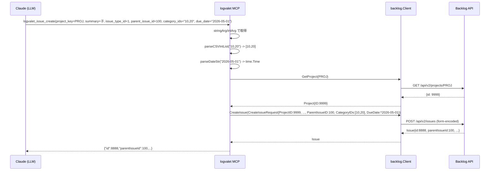
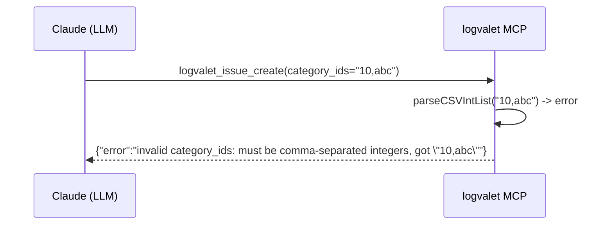
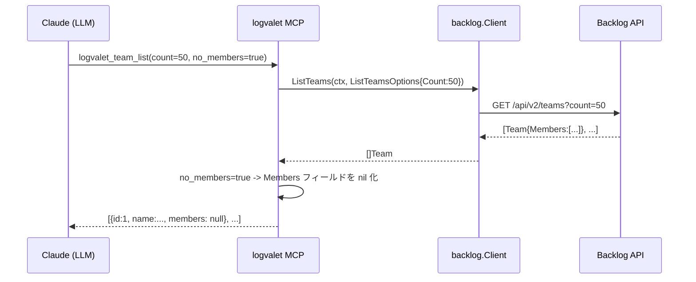

# M01 既存 MCP ツール 6 種のパラメータ充足 詳細計画

## 1. 目的

MCP 側で不足している 5 ツール (`logvalet_issue_create` / `issue_update` / `issue_list` / `issue_comment_add` / `team_list`) のパラメータを追加し、CLI と同等の操作を MCP 経由でも可能にする。

> 注: 親プランでは 6 ツール（`activity_list` を含む）の予定だったが、`activity_list` の追加候補パラメータのうち `offset` は Backlog API 非サポート、`activity_type_ids` と `order` のみが実装価値あり、という結論により **A5 のスコープを縮小** した（詳細は §3 決定事項）。

## 2. スコープ

### 実装対象
- A1: `logvalet_issue_create` - 追加 7 パラメータ
- A2: `logvalet_issue_update` - 追加 7 パラメータ
- A3: `logvalet_issue_list` - 追加 3 パラメータ
- A4: `logvalet_issue_comment_add` - 追加 1 パラメータ
- A5: `logvalet_activity_list` - 追加 2 パラメータ（`activity_type_ids`, `order`）
- A6: `logvalet_team_list` - 追加 3 パラメータ

### スコープ外
- `custom_fields` 対応（CLI 側も送信未実装のため）
- `activity_list.offset` の追加（Backlog API 非サポート - §3 決定事項1）
- `--dry-run` MCP 対応
- 命名・型統一（M03）
- 新規 MCP ツールの追加（M02）

## 3. 決定事項

### 決定事項1: `activity_list.offset` は追加しない

**背景:** 親プランでは `offset` 追加を予定していたが、調査で以下が判明した。
- `ListSpaceActivitiesOptions` / `ListUserActivitiesOptions` は `MinId` / `MaxId` / `Count` / `Order` のみサポート
- Backlog Activities API 仕様上、`offset` / `since` / `until` はサーバ側でサポートされていない（コード内コメント明記）
- 親プラン原則「Backlog API の新機能追加はスコープ外」と整合しない

**選択肢:**
- (a) `offset` を計画から外す ✓ **採用**
- (b) `offset` をパラメータとして受け入れ Client 層で無視 - 却下（動作しない API を公開することになる）

**採用理由:** 仕様と整合し、LLM に誤解を与えないため。Backlog Activity API のページング相当操作は `min_id`/`max_id` 経由で将来検討（本計画外）。

### 決定事項2: CSV 文字列方式で配列パラメータを統一

親プランと同じ。`WithString` + `strings.Split(...,",")` + `strconv.Atoi` 変換。

### 決定事項3: `issue_comment_add.notified_user_ids` は CSV 文字列で統一

親プランの表では `array<number>` と記載されていたが、既存パターン（CSV）との一貫性を優先し **`string` (CSV)** で実装する。根拠: 親プラン §M01 冒頭の「配列パラメータは CSV 文字列方式に統一」が上位決定。

### 決定事項4: 日付パースは既存 `parseDateStr` を再利用

`internal/mcp/tools.go:146` の `parseDateStr` を流用。新規ヘルパは作らない。

### 決定事項5: CSV → `[]int` 変換ヘルパを共通化

既存 `resolveStatusIDsForMCP` のパターンを参考に、汎用 `parseCSVIntList(input, paramName string) ([]int, error)` を `internal/mcp/tools.go` に追加する。以下でエラーメッセージが一貫する:
- `invalid <paramName>: must be comma-separated integers, got %q`

### 決定事項6: `start_date` 解決は単一日付のみ受け付ける（A3）

`issue_list.start_date` は親プランでは `today/this-week/this-month/YYYY-MM-DD/YYYY-MM-DD:YYYY-MM-DD` とあるが、**CLI 側の実装を優先する**。調査の結果、範囲指定の共通ヘルパ `resolveDueDateForMCP` が流用可能なため、`due_date` と同じ仕様（キーワード + 範囲）を採用する。これにより A3 の実装コストが最小化される。

関数名は `resolveDateFilterForMCP` に一般化せず、`resolveDueDateForMCP` の中身を関数分離して汎用化するのは過剰設計なので、**`start_date` 用に別関数 `resolveStartDateForMCP` を追加**（`overdue` キーワードが不要なので除外する）。

## 4. TDD 実装ステップ

### Red フェーズ: 失敗するテストを先に書く

各ツールに以下のテストを追加する:

#### A1. `issue_create` 追加テスト (`tools_issue_test.go`)
- `TestIssueCreate_WithParentIssueID` - 子課題作成
- `TestIssueCreate_ParentIssueIDZero` - エッジケース(A1-G2): 未指定時 `req.ParentIssueID == 0`（http_client は 0 を送信しない仕様）
- `TestIssueCreate_WithCategoryIDs_CSV` - カテゴリ CSV
- `TestIssueCreate_WithVersionIDs_CSV`
- `TestIssueCreate_WithMilestoneIDs_CSV`
- `TestIssueCreate_WithNotifiedUserIDs_CSV`
- `TestIssueCreate_WithDueDate` - `2026-05-01`
- `TestIssueCreate_WithStartDate`
- `TestIssueCreate_InvalidDueDate` - 異常系: `"invalid"` でエラー
- `TestIssueCreate_InvalidCategoryIDs` - 異常系: `"10,abc"` でエラー
- `TestIssueCreate_EmptyCategoryIDs` - エッジケース: 空文字列 → `CategoryIDs` が `nil`
- `TestIssueCreate_SingleCategoryID` - エッジケース: `"10"` → `[]int{10}`

#### A2. `issue_update` 追加テスト
- `TestIssueUpdate_WithIssueTypeID` - `*int` に値設定
- `TestIssueUpdate_WithCategoryIDs_CSV`
- `TestIssueUpdate_WithVersionIDs_CSV`
- `TestIssueUpdate_WithMilestoneIDs_CSV`
- `TestIssueUpdate_WithNotifiedUserIDs_CSV`
- `TestIssueUpdate_WithDueDate`
- `TestIssueUpdate_WithStartDate`
- `TestIssueUpdate_InvalidDueDate`

#### A3. `issue_list` 追加テスト
- `TestIssueList_StartDateThisWeek` - `StartDateSince`/`Until` が今週範囲
- `TestIssueList_StartDateToday`
- `TestIssueList_StartDateSingleDate`
- `TestIssueList_UpdatedSince` - `UpdatedSince` 設定
- `TestIssueList_UpdatedUntil`
- `TestIssueList_UpdatedSinceInvalid` - 異常系

#### A4. `issue_comment_add` 追加テスト
- `TestIssueCommentAdd_WithNotifiedUserIDs_CSV` - `req.NotifiedUserIDs` に設定
- `TestIssueCommentAdd_EmptyNotifiedUserIDs` - 空文字列 → `nil`
- `TestIssueCommentAdd_InvalidNotifiedUserIDs` - 異常系

#### A5. `activity_list` 追加テスト (`tools_activity_test.go`)
- `TestActivityList_WithActivityTypeIDs` - `ActivityTypeIDs` に設定
- `TestActivityList_WithOrder` - `Order: "asc"`
- `TestActivityList_InvalidActivityTypeIDs` - 異常系

#### A6. `team_list` 追加テスト (新規 `tools_team_test.go`)
- `TestTeamList_Default` - 既存動作確認
- `TestTeamList_WithCount` - Count 設定（※ §5.6 参照）
- `TestTeamList_WithOffset`
- `TestTeamList_WithNoMembers_True` - メンバー情報除外 → `members` フィールドが出力に含まれない
- `TestTeamList_WithNoMembers_False` - デフォルト動作と同一（メンバー情報含む）

#### A6-B. backlog 層 `ListTeams` 追加テスト (`http_client_test.go`, `mock_client_test.go`)
- `TestHTTPClient_ListTeams_WithCount` - クエリパラメータ `count=50` 送信を確認
- `TestHTTPClient_ListTeams_WithOffset` - クエリパラメータ `offset=10` 送信を確認
- `TestHTTPClient_ListTeams_NoOptions` - 空 options で従来動作維持
- `TestMockClient_ListTeams_PassesOptions` - モックに options が伝搬することを確認

### Green フェーズ: 最小実装

1. `internal/mcp/tools.go` に `parseCSVIntList` 追加
2. `internal/mcp/tools_issue.go` の `logvalet_issue_create` に 7 パラメータ追加 + ハンドラ実装
3. 同 `logvalet_issue_update` に 7 パラメータ追加 + ハンドラ実装
4. 同 `logvalet_issue_list` に 3 パラメータ追加（`start_date`, `updated_since`, `updated_until`）+ `resolveStartDateForMCP` 実装
5. 同 `logvalet_issue_comment_add` に `notified_user_ids` 追加
6. `internal/mcp/tools_activity.go` の `logvalet_activity_list` に `activity_type_ids`, `order` 追加
7. `internal/mcp/tools_team.go` の `logvalet_team_list` に `count`, `offset`, `no_members` 追加

### Refactor フェーズ

- パラメータ抽出ロジックの重複排除
- テストヘルパの整理
- `go vet ./...` で警告ゼロ維持

## 5. 個別設計詳細

### 5.1 A1 `issue_create`

追加 7 パラメータ → `CreateIssueRequest` のフィールドへ以下マッピング:

| MCP パラメータ | 型 | → Request フィールド | description 文言 |
|---|---|---|---|
| `parent_issue_id` | number | `ParentIssueID` (int, 0=未指定) | `"Parent issue ID for creating a child issue"` |
| `category_ids` | string (CSV) | `CategoryIDs` ([]int) | `"Comma-separated category IDs (e.g. \"10,20\")"` |
| `version_ids` | string (CSV) | `VersionIDs` ([]int) | `"Comma-separated version IDs"` |
| `milestone_ids` | string (CSV) | `MilestoneIDs` ([]int) | `"Comma-separated milestone IDs"` |
| `notified_user_ids` | string (CSV) | `NotifiedUserIDs` ([]int) | `"Comma-separated user IDs to notify"` |
| `due_date` | string (YYYY-MM-DD) | `DueDate` (*time.Time) | `"Due date in YYYY-MM-DD format"` |
| `start_date` | string (YYYY-MM-DD) | `StartDate` (*time.Time) | `"Start date in YYYY-MM-DD format"` |

> 注意: ここでの `start_date` は **単一日付** 形式のみを受け付ける。A3 の `issue_list.start_date` とは **意味と形式が異なる**（A3 はフィルタ用で範囲・キーワード対応）。ツール description で明確に区別する。

実装パターン:
```go
if s, ok := stringArg(args, "category_ids"); ok && s != "" {
    ids, err := parseCSVIntList(s, "category_ids")
    if err != nil {
        return nil, err
    }
    req.CategoryIDs = ids
}
if s, ok := stringArg(args, "due_date"); ok && s != "" {
    t, err := parseDateStr(s)
    if err != nil {
        return nil, fmt.Errorf("invalid due_date: %w", err)
    }
    req.DueDate = &t
}
```

### 5.2 A2 `issue_update`

全フィールドポインタ型。`IssueTypeID *int` は「未指定 = nil」「設定 = &value」。

```go
if id, ok := intArg(args, "issue_type_id"); ok {
    req.IssueTypeID = &id  // 0 でも明示的に設定（0 を送りたいケースは稀だが API に任せる）
}
```

**注意:** 親プランの A2-G1（全パラメータ省略）はテストに含めず、現状の MCP 実装に合わせて「全省略でも CreateIssue 呼び出しが発生」としておく。Backlog API は空の UpdateIssue を許容しないため API 側でエラーになるが、それは想定動作。

### 5.3 A3 `issue_list`

追加パラメータ:

| MCP パラメータ | 型 | description 文言 |
|---|---|---|
| `start_date` | string | `"Start date filter: today, this-week, this-month, YYYY-MM-DD, or YYYY-MM-DD:YYYY-MM-DD"` |
| `updated_since` | string | `"Updated since (YYYY-MM-DD)"` |
| `updated_until` | string | `"Updated until (YYYY-MM-DD)"` |

> 注意: `issue_list.start_date` は A1/A2 の `start_date`（単一日付）とは **意味が異なる**（フィルタ用で範囲・キーワード対応）。ツール description で明確に区別する。

新規ヘルパ `resolveStartDateForMCP(input, now) (*time.Time, *time.Time, error)`:
- `today` → today/today
- `this-week` → monday/sunday
- `this-month` → firstDay/lastDay
- `YYYY-MM-DD:YYYY-MM-DD` → range
- `YYYY-MM-DD` → single/single

`overdue` は対象外（start_date に overdue 概念はないため）。

### 5.4 A4 `issue_comment_add`

追加 `notified_user_ids` (CSV string) → `AddCommentRequest.NotifiedUserIDs`。

### 5.5 A5 `activity_list`

追加:
- `activity_type_ids` (CSV string) → `ActivityTypeIDs`
- `order` (string) → `Order` ("asc"/"desc")

`ListActivitiesOptions` と `ListUserActivitiesOptions` に両方反映（既存コードと同様）。

### 5.6 A6 `team_list`

追加:
- `count` (number, default 100) - Backlog API `/api/v2/teams?count=` サポート
- `offset` (number) - Backlog API `/api/v2/teams?offset=` サポート
- `no_members` (boolean, default false) - MCP ハンドラ層での後処理

**Backlog Client インターフェース調査結果（Phase 1 調査）:** `client.ListTeams(ctx)` は現状引数なし。シグネチャ変更の影響範囲（blast radius）:

```
internal/backlog/client.go:139            (interface 定義)
internal/backlog/http_client.go:740       (HTTPClient 実装)
internal/backlog/mock_client.go:57,321    (MockClient 定義と実装)
internal/backlog/mock_client_test.go:165,185 (既存テスト)
internal/mcp/tools_team.go:18             (MCP 呼び出し側)
internal/cli/resolve.go:75,495            (CLI 内部呼び出し)
internal/cli/team.go:26                   (CLI team サブコマンド)
internal/cli/team_test.go:34,69           (CLI テスト)
```

**Team 型調査結果:**
- `TeamWithMembers.Members []User` は **非ポインタスライス** で `json` タグに `omitempty` **なし**
- `nil` 代入すると JSON 出力は `"members": null` となり、LLM に曖昧なシグナル（空リストとも解釈可能）
- → **no_members の実装は「nil 化」ではなく「別型への射影（copy-strip）」を採用**

**no_members 実装方針（copy-strip 戦略）:**
MCP ハンドラは `no_members=true` の場合、`[]TeamWithMembers` を `[]domain.Team`（ID/Name のみ）に射影して返す。`json` 出力は:
- `no_members=false` (default): `[{"id":1,"name":"A","members":[...]}, ...]`
- `no_members=true`: `[{"id":1,"name":"A"}, ...]` ← members キーそのものが消える

`domain.Team` は既存型（ID/Name のみ）で新規定義不要。射影は以下の単純なループで実装:
```go
out := make([]domain.Team, 0, len(teams))
for _, t := range teams {
    out = append(out, domain.Team{ID: t.ID, Name: t.Name})
}
return out, nil
```

**採用方針:**
- `count`/`offset` は API サポート範囲なので、**Backlog クライアントに `ListTeamsOptions` を追加し実装する**（既存実装の素直な拡張）
- 既存の全ての `ListTeams(ctx)` 呼び出し元を `ListTeams(ctx, backlog.ListTeamsOptions{})` または「空 options」で更新する
- `no_members` は MCP ハンドラ層でレスポンスを `[]domain.Team` に射影して返す後処理で実装

### 5.7 共通ヘルパ `parseCSVIntList`

```go
// parseCSVIntList は "1,2,3" 形式の文字列を []int に変換する。
// 空文字列は nil を返す（未指定扱い）。
// 無効な整数が含まれる場合はエラー。
func parseCSVIntList(input, paramName string) ([]int, error) {
    if input == "" {
        return nil, nil
    }
    parts := strings.Split(input, ",")
    ids := make([]int, 0, len(parts))
    for _, part := range parts {
        part = strings.TrimSpace(part)
        if part == "" {
            continue
        }
        id, err := strconv.Atoi(part)
        if err != nil {
            return nil, fmt.Errorf("invalid %s: must be comma-separated integers, got %q", paramName, input)
        }
        ids = append(ids, id)
    }
    return ids, nil
}
```

## 6. シーケンス図

### 正常系: 子課題作成 (A1)



### 異常系: `category_ids` に不正な整数混入



### A6 `team_list` with no_members



## 7. 変更ファイル一覧

### 新規
- `plans/logvalet-m01-cli-mcp-param-parity.md` (このファイル)
- `internal/mcp/tools_team_test.go`

### 編集
- `internal/mcp/tools.go` (parseCSVIntList 追加)
- `internal/mcp/tools_issue.go` (A1〜A4 ハンドラ拡張 + `resolveStartDateForMCP` 追加)
- `internal/mcp/tools_issue_test.go` (A1〜A4 テスト追加)
- `internal/mcp/tools_activity.go` (A5 ハンドラ拡張)
- `internal/mcp/tools_activity_test.go` (A5 テスト追加)
- `internal/mcp/tools_team.go` (A6 ハンドラ拡張)
- `internal/backlog/options.go` (ListTeamsOptions 追加)
- `internal/backlog/client.go` (ListTeams シグネチャ変更)
- `internal/backlog/http_client.go` (ListTeams クエリパラメータ対応)
- `internal/backlog/mock_client.go` (モック更新)

### ドキュメント
- `README.md` の MCP セクション（M01 追加範囲を明記、範囲外の `activity_list.offset` 方針注記）

## 8. リスク評価

| ID | リスク | 重大度 | 確度 | 対策 |
|----|--------|--------|------|------|
| R1 | `ListTeams` シグネチャ変更による CLI 側の破壊 | 中 | 高 | CLI 側の `ListTeams()` 呼び出し箇所を全て更新。ビルドエラーで検出可能 |
| R2 | `IssueTypeID *int` の 0 値扱い | 低 | 中 | `intArg` の ok 判定で 0 も含めて明示送信とする（Backlog 側の挙動に委ねる） |
| R3 | `no_members=true` でのレスポンス改変が予期せぬ副作用 | 低 | 低 | ハンドラ内で明示的に Members を nil 化。型は既存の `[]Team` をそのまま使用 |
| R4 | CSV パーサの既存 `resolveStatusIDsForMCP` と重複 | 低 | 中 | 本計画では共通化しない（refactor は将来タスク。破壊的リファクタの連鎖を避ける） |
| R5 | 親プラン表と本計画の差分（offset 外し、notified_user_ids の CSV 化）による整合性の混乱 | 低 | 高 | 本計画 §3 決定事項に明記、PR 説明に追記 |
| R6 | `activity_list` に `offset` を期待していたユーザーの混乱 | 低 | 低 | そもそも未実装のため後方互換問題なし。CHANGELOG で将来方針を示す |

## 9. テスト実行計画

- `go test ./internal/mcp/...` - MCP ツールテスト全パス
- `go test ./internal/backlog/...` - ListTeams 変更後も全パス
- `go test ./...` - 全体グリーン
- `go vet ./...` - 警告ゼロ

## 10. 完了条件

- [ ] 全 Red テストがまず失敗すること確認済み
- [ ] Green フェーズ後、全テストグリーン
- [ ] `go vet ./...` 警告ゼロ
- [ ] backlog 層 `ListTeams` のテスト（count/offset クエリパラメータ検証）追加済み
- [ ] 既存 `ListTeams(ctx)` 呼び出し元（CLI 3 箇所、test 3 箇所、MCP 1 箇所）全てを新シグネチャに更新
- [ ] README.md の MCP セクションに M01 範囲の追加パラメータを記載
- [ ] Conventional Commits (日本語) + `Plan:` フッター付きコミット作成
- [ ] push は不要（PR 作成は別タスク）

## 11. ロールバック

- コミット単位を小さく保ち（理想: A1〜A6 とヘルパで別コミット、または機能単位）、問題時は `git revert`

---

## 次アクション
1. `go test ./internal/mcp/...` で現状ベースライン確認
2. Red フェーズ: テスト追加 → `go test` で fail 確認
3. Green フェーズ: 実装追加 → `go test` でグリーン確認
4. Refactor フェーズ: コード整理 → `go test` でグリーン維持
5. README 更新
6. コミット
