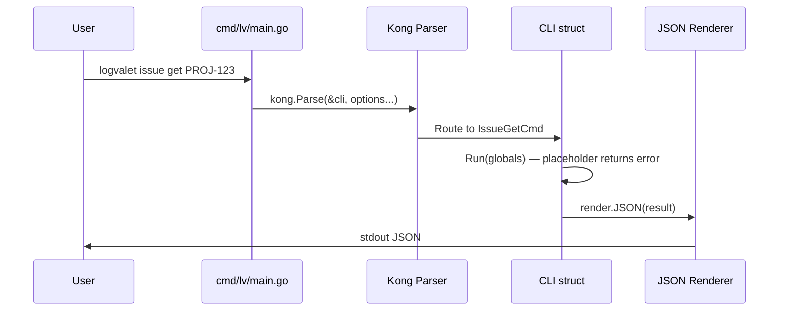

# M01: Project scaffold & CLI foundation

## Overview
| 項目 | 値 |
|------|---|
| ステータス | 未着手 |
| 依存 | なし（最初のマイルストーン） |
| 対象ファイル | go.mod, cmd/lv/main.go, internal/cli/*.go, internal/version/version.go, internal/render/json.go, internal/render/render.go, internal/app/exitcode.go |

## Goal
logvalet CLI の骨格を構築する。`logvalet --help` が動作し、全サブコマンドのプレースホルダーが Kong で登録され、JSON 出力とシェル補完が機能する状態にする。

## Sequence Diagram

## TDD Test Design

| # | テストケース | テスト対象 | 入力 | 期待出力 |
|---|-------------|-----------|------|---------|
| 1 | Version パッケージのデフォルト値 | internal/version | — | Version="dev", Commit="none", Date="unknown" |
| 2 | Exit code 定数が正しい | internal/app/exitcode | — | Success=0, GenericError=1, ..., ConfigError=10 |
| 3 | JSON renderer で struct を出力 | internal/render | 任意の struct | 正しい JSON bytes |
| 4 | JSON renderer pretty-print | internal/render | struct + Pretty=true | インデント付き JSON |
| 5 | Kong root CLI が parse できる | internal/cli | `--help` | エラーなし |
| 6 | GlobalFlags が env から設定される | internal/cli | env LOGVALET_FORMAT=yaml | Format="yaml" |
| 7 | 未実装コマンドのプレースホルダー | internal/cli | `issue get PROJ-1` | "not implemented" エラー + exit 1 |
| 8 | Completion 出力に logvalet が含まれる | internal/cli | `completion zsh` | "logvalet" を含む出力 |
| 9 | --short で lv エイリアスも含む | internal/cli | `completion zsh --short` | "lv" を含む出力 |

## Implementation Steps (TDD: Red → Green → Refactor)

### Step 1: go.mod 初期化 & ディレクトリ構造
- [ ] `go mod init github.com/youyo/logvalet`
- [ ] ディレクトリ作成: cmd/lv/, internal/{app,cli,version,render}/
- [ ] 空の main.go を配置して `go build` が通ることを確認

### Step 2: Version package (Red → Green → Refactor)
- [ ] **Red**: `internal/version/version_test.go` — デフォルト値テスト
- [ ] **Green**: `internal/version/version.go` — var Version/Commit/Date
- [ ] **Refactor**: 不要なら省略

### Step 3: Exit code 定義 (Red → Green → Refactor)
- [ ] **Red**: `internal/app/exitcode_test.go` — 各コード値のテスト
- [ ] **Green**: `internal/app/exitcode.go` — const 定義 (0-10)
- [ ] **Refactor**: 不要なら省略

### Step 4: JSON renderer (Red → Green → Refactor)
- [ ] **Red**: `internal/render/json_test.go` — struct→JSON, pretty-print テスト
- [ ] **Green**: `internal/render/render.go` — Renderer interface 定義
- [ ] **Green**: `internal/render/json.go` — JSONRenderer 実装
- [ ] **Refactor**: 共通ヘルパー抽出があれば

### Step 5: GlobalFlags & shared option groups
- [ ] **Red**: `internal/cli/global_flags_test.go` — env タグのテスト、デフォルト値テスト
- [ ] **Green**: `internal/cli/global_flags.go` — GlobalFlags / DigestFlags / ListFlags / WriteFlags struct
- [ ] **Refactor**: 不要なら省略

### Step 6: Root CLI struct & Kong bootstrap
- [ ] **Red**: `internal/cli/root_test.go` — kong.Parse テスト、--help テスト
- [ ] **Green**: `internal/cli/root.go` — CLI struct with all command placeholders
- [ ] **Green**: 各コマンド stub ファイル (auth.go, issue.go, project.go, activity.go, user.go, document.go, meta.go, team.go, space.go) — 各 Run() は "not implemented" エラーを返す
- [ ] **Green**: `cmd/lv/main.go` — Kong エントリポイント
- [ ] **Refactor**: コマンド stub の共通パターン抽出

### Step 7: Completion commands (Red → Green → Refactor)
- [ ] **Red**: `internal/cli/completion_test.go` — zsh/bash/fish 出力テスト、--short テスト
- [ ] **Green**: `internal/cli/completion.go` — Kong の completion 機能を利用
- [ ] **Refactor**: 不要なら省略

### Step 8: 統合確認
- [ ] `go build ./cmd/lv/` が成功
- [ ] `go test ./...` が全パス
- [ ] `./lv --help` が全サブコマンドを表示
- [ ] `./lv completion zsh --short` が logvalet + lv の補完を出力
- [ ] `go vet ./...` がクリーン

## Key Files

| ファイル | 責務 |
|---------|------|
| `cmd/lv/main.go` | エントリポイント。Kong parse + version 注入 |
| `internal/cli/root.go` | CLI struct（全コマンドハブ） |
| `internal/cli/global_flags.go` | GlobalFlags / DigestFlags / ListFlags / WriteFlags |
| `internal/cli/completion.go` | シェル補完生成 |
| `internal/cli/auth.go` | auth コマンド stub |
| `internal/cli/issue.go` | issue コマンド stub (spec §17.4 のスケルトン) |
| `internal/cli/project.go` | project コマンド stub |
| `internal/cli/activity.go` | activity コマンド stub |
| `internal/cli/user.go` | user コマンド stub |
| `internal/cli/document.go` | document コマンド stub |
| `internal/cli/meta.go` | meta コマンド stub |
| `internal/cli/team.go` | team コマンド stub |
| `internal/cli/space.go` | space コマンド stub |
| `internal/version/version.go` | Version / Commit / Date 変数 |
| `internal/app/exitcode.go` | Exit code 定数 |
| `internal/render/render.go` | Renderer interface |
| `internal/render/json.go` | JSON renderer |

## Risks
| リスク | 影響度 | 対策 |
|--------|--------|------|
| Kong の Go 1.26.1 互換性 | 中 | 最新の Kong バージョンを確認し、互換性問題があれば pin |
| Completion の --short フラグ実装 | 低 | Kong 標準の completion に lv エイリアス用の追加処理が必要。カスタム completion handler で対応 |
| コマンド stub が多く手間がかかる | 低 | 共通の "not implemented" パターンで統一し、コピペを最小化 |

## Verification
1. `go test ./...` — 全テストパス
2. `go build -o lv ./cmd/lv/ && ./lv --help` — 全コマンドが表示される
3. `./lv --version` — "dev (none) unknown" 相当の出力
4. `./lv completion zsh --short | head -5` — 補完スクリプトが出力される
5. `./lv issue get PROJ-1` — "not implemented" エラーで exit 1
