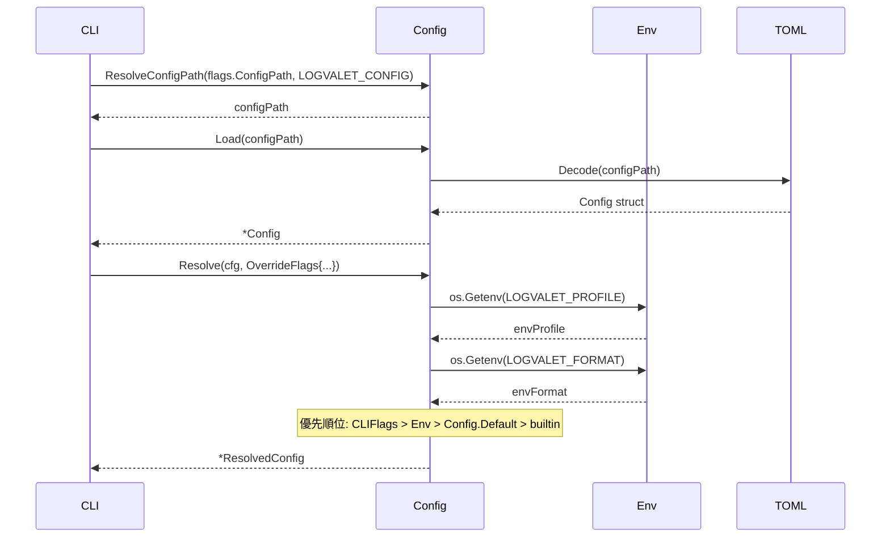

# M02: Config system — 詳細計画

## メタ情報
| 項目 | 値 |
|------|---|
| マイルストーン | M02 |
| スラッグ | config |
| 依存 | M01 完了 (コミット d2eaa88) |
| 作成日 | 2026-03-13 |
| ステータス | 計画中 |

## 目標

`internal/config/` パッケージを実装し、以下を実現する:

1. `config.toml` スキーマ定義・ローダー (spec §5)
2. Profile 解決ロジック（デフォルトプロファイル + 指定プロファイル）
3. 環境変数オーバーライド（`LV_` ではなく `LOGVALET_` プレフィックス — spec §4 準拠）
4. Boolean env parsing (`1/true/yes/on` → true, `0/false/no/off` → false)
5. 設定値優先順位: CLI flags > env > config.toml > built-in defaults

## スペック参照

spec §4 (Global Flags / Environment variables / Precedence / Boolean env parsing)
spec §5 (Configuration and Authentication / config.toml schema)

### config.toml スキーマ (spec §5)

```toml
version = 1
default_profile = "work"
default_format = "json"

[profiles.work]
space = "example-space"
base_url = "https://example-space.backlog.com"
auth_ref = "example-space"
```

### 環境変数 (spec §4)

```
LOGVALET_PROFILE
LOGVALET_FORMAT
LOGVALET_PRETTY
LOGVALET_CONFIG
LOGVALET_API_KEY
LOGVALET_ACCESS_TOKEN
LOGVALET_BASE_URL
LOGVALET_SPACE
LOGVALET_VERBOSE
LOGVALET_NO_COLOR
```

### 優先順位 (spec §4)

```
CLI flags > environment variables > config.toml > built-in defaults
```

### Boolean env parsing (spec §4)

| 値 | 解釈 |
|---|---|
| `1`, `true`, `yes`, `on` | true |
| `0`, `false`, `no`, `off` | false |
| その他 | エラー |

## アーキテクチャ設計

### パッケージ構成

```
internal/config/
  config.go        — Config struct, ProfileConfig struct, Loader
  config_test.go   — テスト
  testdata/
    valid.toml     — 正常なconfig
    empty.toml     — 空のconfig
```

### Go struct 定義

```go
// Config はconfig.tomlの全体構造。
type Config struct {
    Version        int                       `toml:"version"`
    DefaultProfile string                    `toml:"default_profile"`
    DefaultFormat  string                    `toml:"default_format"`
    Profiles       map[string]ProfileConfig  `toml:"profiles"`
}

// ProfileConfig は単一プロファイルの設定。
type ProfileConfig struct {
    Space   string `toml:"space"`
    BaseURL string `toml:"base_url"`
    AuthRef string `toml:"auth_ref"`
}

// ResolvedConfig は優先順位解決後の最終設定値。
// CLI flags > env > config.toml > defaults の順で決定される。
type ResolvedConfig struct {
    Profile  string
    Format   string
    Pretty   bool
    Space    string
    BaseURL  string
    AuthRef  string
    Verbose  bool
    NoColor  bool
    ConfigPath string
}
```

### Loader インターフェース

```go
// Loader はconfig.tomlをロードし、優先順位解決を行う。
type Loader interface {
    Load(path string) (*Config, error)
    Resolve(cfg *Config, flags OverrideFlags, getenv func(string) string) (*ResolvedConfig, error)
}

// OverrideFlags はCLI flagsからの上書き値（空文字列=未指定）。
// bool フィールドは *bool でポインタ型にして「未指定」と「明示的false」を区別する。
type OverrideFlags struct {
    Profile    string
    Format     string
    Pretty     *bool
    Space      string
    BaseURL    string
    Verbose    *bool
    NoColor    *bool
    ConfigPath string
}
```

> **設計ノート (advocate 確認済み)**:
> `Resolve` の第3引数に `getenv func(string) string` を渡すことで、
> Kong の GlobalFlags との二重管理を避け、テスト時に環境変数を注入可能にする。
> 本番コードでは `os.Getenv` を渡す。

### 設定ファイルパス解決

```
1. OverrideFlags.ConfigPath が非空なら使用
2. LOGVALET_CONFIG 環境変数が非空なら使用
3. $XDG_CONFIG_HOME/logvalet/config.toml（XDG_CONFIG_HOME が設定されている場合）
4. ~/.config/logvalet/config.toml（デフォルト）
```

### Profile 解決ロジック

```
1. OverrideFlags.Profile が非空なら使用（CLI flag / env経由）
2. Config.DefaultProfile が非空なら使用
3. "default" をフォールバック
```

## TDD 設計 (Red → Green → Refactor)

### Step 1: ParseBoolEnv のテストと実装

**Red: テスト先行**
```go
func TestParseBoolEnv(t *testing.T) {
    tests := []struct {
        input   string
        want    bool
        wantErr bool
    }{
        {"1", true, false},
        {"true", true, false},
        {"yes", true, false},
        {"on", true, false},
        {"TRUE", true, false},   // case-insensitive
        {"0", false, false},
        {"false", false, false},
        {"no", false, false},
        {"off", false, false},
        {"invalid", false, true},
        {"", false, true},
    }
}
```

**Green:** `ParseBoolEnv(s string) (bool, error)` を実装

**Refactor:** エラーメッセージを統一

### Step 2: ConfigPath 解決のテストと実装

**Red:**
```go
func TestDefaultConfigPath(t *testing.T)      // XDG_CONFIG_HOME, ~/.config
func TestResolveConfigPath(t *testing.T)      // 優先順位テスト
```

**Green:** `DefaultConfigPath()` と `ResolveConfigPath(override, envVar string)` を実装

### Step 3: Config ロードのテストと実装

**Red:**
```go
func TestLoad_Valid(t *testing.T)       // testdata/valid.toml
func TestLoad_NotFound(t *testing.T)    // ファイルなし → ゼロ値Config + nil error
func TestLoad_Invalid(t *testing.T)     // 不正なTOML → error
```

**Green:** `Load(path string) (*Config, error)` を実装

TOML ライブラリ: `github.com/BurntSushi/toml`（軽量・実績あり）

**Refactor:** エラーメッセージに ConfigPath を含める

### Step 4: Resolve (優先順位解決) のテストと実装

**Red:**
```go
func TestResolve_CLIFlagsOverride(t *testing.T)
func TestResolve_EnvOverride(t *testing.T)
func TestResolve_ConfigDefault(t *testing.T)
func TestResolve_BuiltInDefault(t *testing.T)
func TestResolve_ProfileNotFound(t *testing.T)
```

**Green:** `Resolve(cfg *Config, flags OverrideFlags) (*ResolvedConfig, error)` を実装

**Refactor:** 環境変数読み取りを内部ヘルパーに整理

### Step 5: DefaultLoader の実装

**Red:**
```go
func TestDefaultLoader_LoadAndResolve(t *testing.T)
```

**Green:** `DefaultLoader` struct (Loader interface の実装) を実装

## シーケンス図



## 実装ステップ（順序）

1. `internal/config/config_test.go` にテスト全体を書く（Red）
2. `go get github.com/BurntSushi/toml`
3. `internal/config/config.go` に実装（Green）
4. `go test ./internal/config/ -v` で全テストpass確認
5. リファクタリング（Refactor）
6. `go test ./...` で全パッケージpass確認
7. `go vet ./...` でクリーン確認
8. コミット

## testdata ファイル

### testdata/valid.toml

```toml
version = 1
default_profile = "work"
default_format = "json"

[profiles.work]
space = "example-space"
base_url = "https://example-space.backlog.com"
auth_ref = "example-space"

[profiles.dev]
space = "example-dev"
base_url = "https://example-dev.backlog.com"
auth_ref = "example-dev"
```

### testdata/empty.toml

```toml
# 空の設定ファイル
```

## 依存関係

- `github.com/BurntSushi/toml` — TOML パーサー
  - 採用理由: 軽量、実績豊富、シンプルなAPI
  - バージョン: latest stable

## リスク評価

| リスク | 影響 | 確率 | 対策 |
|--------|------|------|------|
| TOML ライブラリの互換性 | 低 | 低 | BurntSushi/toml は成熟したライブラリ |
| XDG_CONFIG_HOME のプラットフォーム差異 | 低 | 低 | テストでは tmpdir を使用 |
| 環境変数テストの干渉 | 中 | 中 | テスト内で t.Setenv を使用（自動クリーンアップ） |
| config.toml 不在時の挙動 | 中 | 高 | ファイル不在は正常ケース（デフォルト値を使用） |

## Exit codes

設定エラーには `app.ExitConfigError (10)` を使用（spec §8 準拠）。

## 完了基準

- [ ] `internal/config/config.go` 実装完了
- [ ] `internal/config/config_test.go` 全テストpass
- [ ] `go test ./...` pass
- [ ] `go vet ./...` クリーン
- [ ] HANDOVER.md 更新
- [ ] コミット: `feat(config): M02 設定システムを実装`
