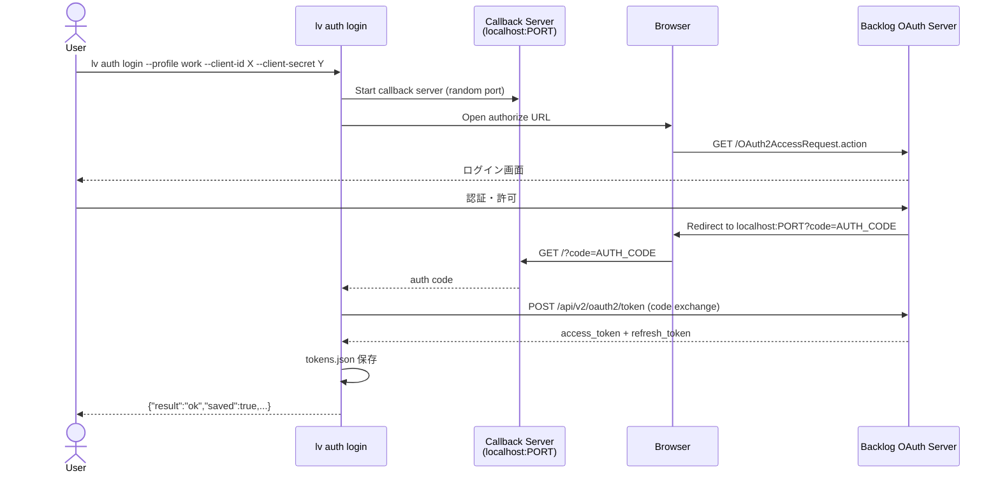
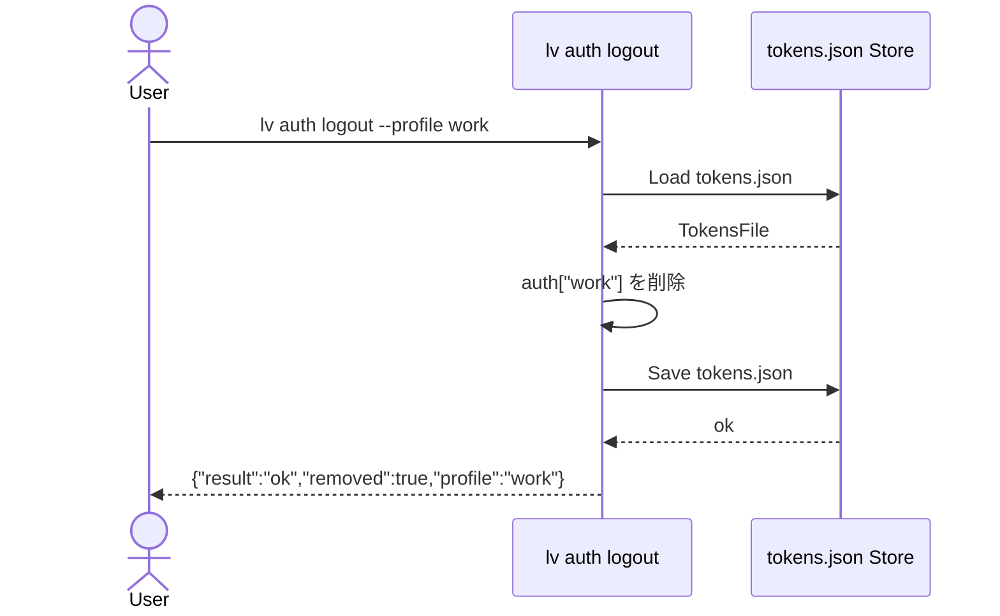
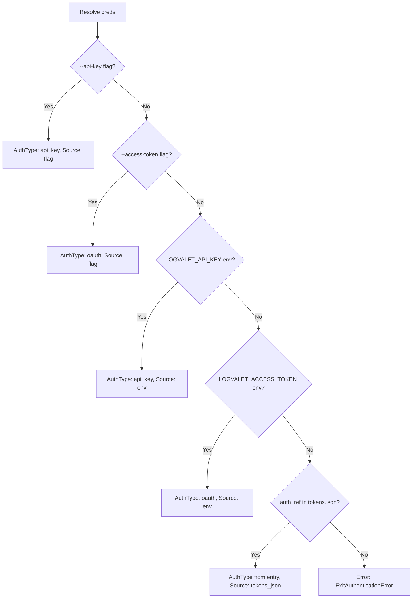

# M03: Credential system & auth commands

## Meta
| 項目 | 値 |
|------|---|
| マイルストーン | M03 |
| タイトル | Credential system & auth commands |
| 前提 | M02 完了 (ccf1284) — config パッケージ実装済み |
| 作成日 | 2026-03-13 |
| 状態 | Draft |

## 目的

`~/.config/logvalet/tokens.json` を信頼できるシングルソースとして、認証情報の保存・解決・OAuth フローを実装する。
spec §5 で定義された `auth login / logout / whoami / list` コマンドを TDD で構築する。

---

## 実装スコープ

### 1. `internal/credentials/` パッケージ（新規）

#### 1.1 tokens.json スキーマ型

```go
// TokensFile は tokens.json 全体構造
type TokensFile struct {
    Version int                    `json:"version"`
    Auth    map[string]AuthEntry   `json:"auth"`
}

// AuthEntry は1プロファイル分の認証エントリ
type AuthEntry struct {
    AuthType     string  `json:"auth_type"`           // "oauth" | "api_key"
    AccessToken  string  `json:"access_token,omitempty"`
    RefreshToken string  `json:"refresh_token,omitempty"`
    TokenExpiry  string  `json:"token_expiry,omitempty"`  // ISO 8601
    APIKey       string  `json:"api_key,omitempty"`
}
```

#### 1.2 CredentialStore インターフェース

```go
type Store interface {
    Load() (*TokensFile, error)
    Save(tokens *TokensFile) error
    DefaultTokensPath() string
}
```

#### 1.3 Credential Resolver

優先順位（spec §4 Credential resolution）:
1. `--api-key` / `--access-token`（CLI flags）
2. 環境変数 `LOGVALET_API_KEY` / `LOGVALET_ACCESS_TOKEN`
3. `tokens.json`（auth_ref キーで参照）

```go
type ResolvedCredential struct {
    AuthType    string  // "oauth" | "api_key" | "env" | "flag"
    AccessToken string
    APIKey      string
    Source      string  // "flag" | "env" | "tokens_json"
}

type Resolver interface {
    Resolve(authRef string, flags CredentialFlags, getenv func(string) string) (*ResolvedCredential, error)
}
```

#### 1.4 OAuth localhost callback フロー

```
lv auth login --profile work
  → 1. Backlog OAuth authorize URL を構築
  → 2. localhost:PORT でコールバックサーバー起動
  → 3. ブラウザを開く（os.OpenBrowser）
  → 4. コールバック受信 → authorization code 取得
  → 5. code → access_token + refresh_token 交換
  → 6. tokens.json に保存
  → 7. JSON 結果を stdout に出力
```

**Backlog OAuth エンドポイント:**
- Authorize: `https://{space}.backlog.com/OAuth2AccessRequest.action`
- Token: `https://{space}.backlog.com/api/v2/oauth2/token`

**実装上の注意:**
- OAuth クライアントID/シークレットはどこから取得するか？→ `--client-id` / `--client-secret` フラグ、または `config.toml` の `[oauth]` セクション（M03 では `--client-id` / `--client-secret` フラグで受け取る方針）
- M03 では OAuth フローの基本実装。refresh token の自動更新は M04 以降で実装する

#### 1.5 API key サポート

- `--api-key` フラグで直接指定
- `LOGVALET_API_KEY` 環境変数
- `tokens.json` の `auth_type: api_key` エントリ

---

### 2. `internal/cli/auth.go` の更新

既存 stub を実装に置き換える:

| コマンド | 動作 |
|---------|------|
| `auth login` | OAuth フロー実行 → tokens.json 保存 |
| `auth logout` | tokens.json から指定プロファイルのエントリ削除 |
| `auth whoami` | tokens.json 読み込み → ユーザー情報表示（M04 以前は API 呼び出しなし、credential 情報のみ表示） |
| `auth list` | tokens.json の全エントリ一覧表示 |

**M03 スコープ制限:**
- `auth whoami` は Backlog API へのアクセスなしで実装（tokens.json の内容のみ表示）
- Backlog API 呼び出しは M04 の API クライアント完成後に追加

---

## TDD 設計（Red → Green → Refactor）

### ステップ 1: TokensFile スキーマ & Store（Red→Green→Refactor）

**Red フェーズ（テスト先行）:**
```go
// credentials_test.go

func TestDefaultTokensPath(t *testing.T) {
    // XDG_CONFIG_HOME が設定されている場合
    // 未設定の場合（~/.config/logvalet/tokens.json）
}

func TestStore_Load(t *testing.T) {
    // ファイルが存在しない場合 → ゼロ値 TokensFile を返す
    // 正常な JSON の場合 → パースして返す
    // 不正な JSON の場合 → エラーを返す
}

func TestStore_Save(t *testing.T) {
    // ディレクトリが存在しない場合 → 作成してから保存
    // 保存後に Load すると同じ内容が取得できる
    // ファイルパーミッション: 0600（owner read/write のみ）
}
```

**Green フェーズ:** 最小限の実装
**Refactor フェーズ:** エラーメッセージ改善、型安全性向上

### ステップ 2: Credential Resolver（Red→Green→Refactor）

**Red フェーズ:**
```go
func TestResolver_Resolve(t *testing.T) {
    // フラグ優先: --api-key が設定されている場合
    // フラグ優先: --access-token が設定されている場合
    // 環境変数: LOGVALET_API_KEY
    // 環境変数: LOGVALET_ACCESS_TOKEN
    // tokens.json: auth_ref で参照
    // 全て未設定: エラー（ExitAuthenticationError）
}
```

### ステップ 3: OAuth フロー（Red→Green→Refactor）

**テスト戦略:**
- OAuth フロー全体のテストは統合テスト不可（ブラウザ・外部サーバーが必要）
- 各コンポーネントを単体テスト可能に分割:
  - `BuildAuthorizeURL(space, clientID, redirectURI, state string) string`
  - `ExchangeCode(ctx, tokenURL, clientID, clientSecret, code, redirectURI string) (*TokenResponse, error)`  ← httptest.Server でモック
  - `StartCallbackServer(ctx, port int) (code <-chan string, err error)` ← ローカルサーバー起動テスト

**Red フェーズ:**
```go
func TestBuildAuthorizeURL(t *testing.T) { ... }
func TestExchangeCode(t *testing.T) { ... }  // httptest.Server 使用
```

### ステップ 4: auth コマンド（Red→Green→Refactor）

**Red フェーズ:**
```go
// auth_test.go (internal/cli パッケージ)
func TestAuthLoginCmd_Run(t *testing.T) {
    // OAuth フロー実行テスト（モック使用）
}
func TestAuthLogoutCmd_Run(t *testing.T) {
    // tokens.json からエントリ削除テスト
}
func TestAuthWhoamiCmd_Run(t *testing.T) {
    // tokens.json の内容表示テスト
}
func TestAuthListCmd_Run(t *testing.T) {
    // 全エントリ一覧表示テスト
}
```

---

## Mermaid シーケンス図

### auth login (OAuth フロー)



### auth logout



### Credential Resolver



---

## ファイル構成

```
internal/credentials/
├── credentials.go        — TokensFile, AuthEntry, Store, Resolver
├── credentials_test.go   — Store/Resolver テスト
├── oauth.go             — OAuth フロー（BuildAuthorizeURL, ExchangeCode, StartCallbackServer）
├── oauth_test.go         — OAuth コンポーネントテスト
└── testdata/
    ├── tokens_valid.json  — 正常なトークンファイル
    └── tokens_invalid.json — 不正なJSONファイル

internal/cli/
├── auth.go              — auth コマンド実装（stub → 実装）
└── auth_test.go         — auth コマンドテスト（新規）
```

---

## 実装ステップ

### Step 1: credentials パッケージの基盤（TDD）
1. `internal/credentials/credentials_test.go` 作成（Red）
2. `internal/credentials/credentials.go` 実装（Green）
3. リファクタリング（Refactor）

### Step 2: OAuth フロー（TDD）
1. `internal/credentials/oauth_test.go` 作成（Red）
2. `internal/credentials/oauth.go` 実装（Green）
3. リファクタリング（Refactor）

### Step 3: auth コマンド実装（TDD）
1. `internal/cli/auth_test.go` 作成（Red）
2. `internal/cli/auth.go` stub → 実装に更新（Green）
3. リファクタリング（Refactor）

### Step 4: 統合確認
```bash
go test ./...
go vet ./...
go build -o /tmp/lv-test ./cmd/lv/
/tmp/lv-test auth --help
/tmp/lv-test auth list --help
```

---

## リスク評価

### リスク 1: OAuth ブラウザ起動のプラットフォーム差異
- **影響度**: 中
- **発生確率**: 低（macOS メイン開発）
- **対策**: `open` コマンド呼び出し部分をインターフェースで抽象化（`BrowserOpener interface`）
  - デフォルト実装: `exec.Command("open", url)` (macOS) / `xdg-open` (Linux) / `start` (Windows)
  - テスト: モック実装で URL を検証

### リスク 2: OAuth コールバックのポート競合
- **影響度**: 低
- **発生確率**: 中
- **対策**: `:0` でリッスン（OS がランダムポートを割り当て）
  - リスナーから実際のポートを取得して redirect_uri を構築

### リスク 3: tokens.json のファイルパーミッション
- **影響度**: 高（セキュリティリスク）
- **発生確率**: 高（デフォルトのパーミッションは 0644）
- **対策**: `Save()` 時に `os.WriteFile(path, data, 0600)` を使用

### リスク 4: Backlog OAuth エンドポイントの仕様
- **影響度**: 高
- **発生確率**: 中（仕様変更の可能性）
- **対策**:
  - `BuildAuthorizeURL` / `ExchangeCode` をインターフェースで分離
  - M03 では動作確認は手動テストで行う（本物のBacklog 環境が必要）

### リスク 5: auth whoami が API 呼び出しなし
- **影響度**: 低（M03 スコープ制限）
- **発生確率**: 確実
- **対策**: spec の whoami 出力例（`"user":{...}`）はユーザー情報を含むが、M03 では credential 情報のみを表示し `"user": null` とする。`token_expiry` から有効期限情報（`"expires_at"`, `"expired": bool`）を追加して実用性を高める。M04 以降で API 呼び出しを追加。

### リスク 6: OAuth コールバック無限待機
- **影響度**: 高（UX 破壊）
- **発生確率**: 中（ユーザーがブラウザを閉じた場合など）
- **対策**: `context.WithTimeout(ctx, 120*time.Second)` でコールバック待機にタイムアウトを設定。タイムアウト時は `ExitGenericError` でメッセージ付きエラーを返す。

### リスク 7: tokens.json の非アトミック書き込み
- **影響度**: 高（データ破損リスク）
- **発生確率**: 低だが発生時の影響大
- **対策**: tempfile + rename パターンを採用
  1. 同ディレクトリに一時ファイル（`tokens.json.tmp.{pid}`）を作成（パーミッション 0600）
  2. 内容を書き込み
  3. `os.Rename()` でアトミックに置き換え
  4. エラー時は一時ファイルを削除

### リスク 8: OAuth クライアントID/シークレットの管理
- **影響度**: 高（フロー全体が動作しない）
- **発生確率**: 確実
- **対策**: M03 では `--client-id` / `--client-secret` フラグ、または環境変数 `LOGVALET_CLIENT_ID` / `LOGVALET_CLIENT_SECRET` で受け取る方針。`config.toml` の `[profiles.work]` に `client_id` / `client_secret` フィールドを追加（M03 で config パッケージを拡張）。優先順位: フラグ > 環境変数 > config.toml。

### リスク 9: 既存トークンエントリの上書き動作
- **影響度**: 低
- **発生確率**: 高（既存ユーザーが再認証する場合）
- **対策**: M03 では常に上書き（確認なし）。非対話型 CLI として一貫した動作を優先。

---

## 依存関係

### 新規追加なし（標準ライブラリのみ）
- `encoding/json` — tokens.json の読み書き
- `net/http` — OAuth token exchange
- `net` — localhost callback server
- `os/exec` — ブラウザ起動

### 既存依存
- `github.com/BurntSushi/toml` (M02 から)
- `github.com/alecthomas/kong` (M01 から)

---

## 出力スキーマ定義（spec §5 準拠）

### auth login レスポンス
```json
{
  "schema_version": "1",
  "result": "ok",
  "profile": "work",
  "space": "example-space",
  "base_url": "https://example-space.backlog.com",
  "auth_type": "oauth",
  "saved": true
}
```

### auth logout レスポンス
```json
{
  "schema_version": "1",
  "result": "ok",
  "profile": "work",
  "removed": true
}
```

### auth whoami レスポンス（M03: API なし版）
```json
{
  "schema_version": "1",
  "profile": "work",
  "space": "example-space",
  "auth_type": "oauth",
  "expires_at": "2026-03-13T15:04:05Z",
  "expired": false,
  "user": null
}
```

### auth list レスポンス
```json
{
  "schema_version": "1",
  "profiles": [
    {
      "profile": "work",
      "space": "example-space",
      "base_url": "https://example-space.backlog.com",
      "auth_type": "oauth",
      "authenticated": true
    }
  ]
}
```

---

## コミットメッセージ

```
feat(auth): M03 認証情報管理とauthコマンドを実装

- internal/credentials/ パッケージを追加
  - TokensFile / AuthEntry スキーマ定義
  - CredentialStore: tokens.json の読み書き（パーミッション 0600）
  - CredentialResolver: flag > env > tokens.json の優先順位解決
  - OAuth localhost callback フロー実装
- auth login / logout / whoami / list コマンドを実装

Plan: plans/logvalet-m03-auth.md
```
