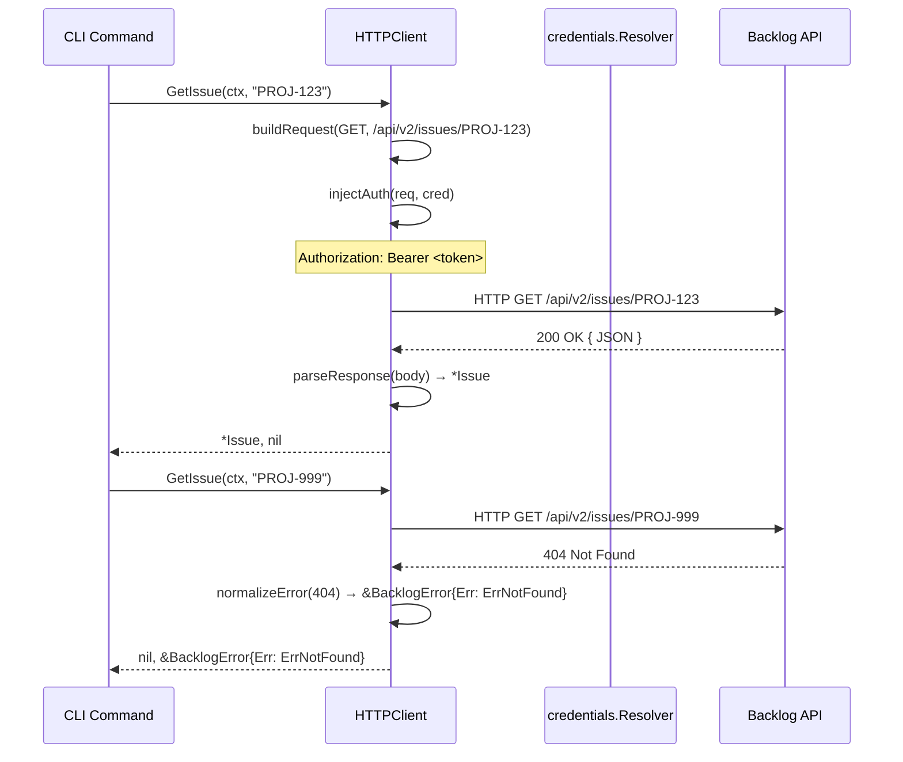
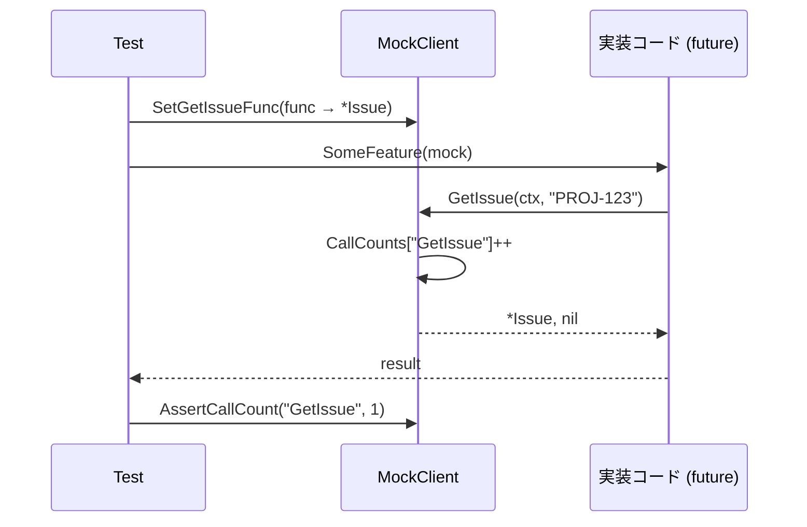
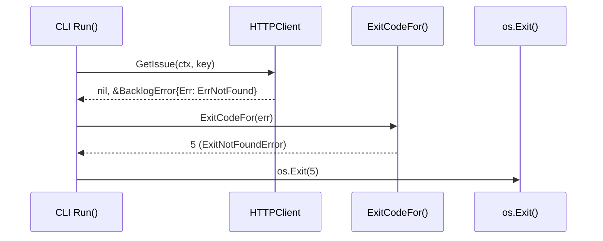

# M04: Backlog API client core — 詳細計画

## Meta
| 項目 | 値 |
|------|---|
| マイルストーン | M04 |
| スラッグ | api-client |
| 前提 | M03 完了 (commit 4d0c274) |
| 対象パッケージ | `internal/backlog/` |
| 方針 | TDD (Red→Green→Refactor) + モックのみテスト |
| 作成日 | 2026-03-13 |

---

## 1. 概要

M04 では `internal/backlog/` パッケージを実装する。
このパッケージは以下の責務を持つ:

1. **Client interface** — 全 API メソッドのシグネチャ定義（spec §18.1）
2. **HTTPClient** — `net/http` ベース実装。OAuth Bearer / API Key ヘッダ注入
3. **MockClient** — テスト専用の差し替え可能な実装
4. **Typed errors** — `ErrNotFound`, `ErrUnauthorized`, `ErrForbidden`, `ErrRateLimited`, `ErrValidation`, `ErrAPI`（spec §18.4）
5. **Exit code マッピング** — typed errors → `app.Exit*` 定数
6. **Request options** — `ListIssuesOptions`, `ListCommentsOptions`, `ListActivitiesOptions`, `ListUserActivitiesOptions`, `ListDocumentsOptions`（spec §18.2）
7. **Write request types** — `CreateIssueRequest`, `UpdateIssueRequest`, `AddCommentRequest`, `UpdateCommentRequest`, `CreateDocumentRequest`（spec §18.3）
8. **Pagination / RateLimitInfo** — レスポンスメタデータ

---

## 2. ファイル構成

```
internal/domain/
├── domain.go          — User, Issue, Comment, Project, Activity, Document, etc. (M04 先行定義)

internal/backlog/
├── client.go          — Client interface 定義
├── errors.go          — typed errors + ExitCodeFor()
├── options.go         — Request option types (spec §18.2)
├── types.go           — Write request types (spec §18.3) + Pagination, RateLimitInfo
├── http_client.go     — HTTPClient 実装
├── mock_client.go     — MockClient 実装 (テスト用)
├── client_test.go     — Client interface コンパイル確認テスト
├── errors_test.go     — typed errors / ExitCodeFor テスト
├── http_client_test.go — HTTPClient テスト (httptest 使用)
└── mock_client_test.go — MockClient テスト
```

> **注意**: `internal/domain/domain.go` は M04 で最小限の型のみを定義する（M05 で拡張予定）。

---

## 3. TDD 設計（Red → Green → Refactor）

### Step 1: errors.go（Red → Green → Refactor）

**Red** — `errors_test.go` を先に書く:
- `ErrNotFound` が `errors.Is` で判定できる
- `ErrUnauthorized`, `ErrForbidden`, `ErrRateLimited`, `ErrValidation`, `ErrAPI`
- `BacklogError{Code, Message, StatusCode}` で `Error()` が正しい文字列を返す
- `ExitCodeFor(ErrNotFound)` → `app.ExitNotFoundError`
- `ExitCodeFor(ErrUnauthorized)` → `app.ExitAuthenticationError`
- `ExitCodeFor(ErrForbidden)` → `app.ExitPermissionError`
- `ExitCodeFor(ErrAPI)` → `app.ExitAPIError`
- `ExitCodeFor(otherError)` → `app.ExitGenericError`

**Green** — `errors.go` を実装する:
```go
var (
    ErrNotFound    = errors.New("backlog: not found")
    ErrUnauthorized = errors.New("backlog: unauthorized")
    ErrForbidden   = errors.New("backlog: forbidden")
    ErrRateLimited = errors.New("backlog: rate limited")
    ErrValidation  = errors.New("backlog: validation error")
    ErrAPI         = errors.New("backlog: api error")
)

type BacklogError struct {
    Err        error
    Code       string
    Message    string
    StatusCode int
}
```

### Step 2: options.go + types.go（Red → Green → Refactor）

**Red** — `options_test.go` / `types_test.go`:
- `ListIssuesOptions` の JSON round-trip
- `ListActivitiesOptions` の Since/Until（`*time.Time`）
- `CreateIssueRequest` の必須フィールド検証（ProjectKey, Summary は必須）
- `UpdateIssueRequest` の全フィールドがポインタ型
- `Pagination{Total, Offset, Limit}` の正常系
- `RateLimitInfo{Limit, Remaining, Reset}` の正常系

**Green** — 構造体を定義する（spec §18.2, §18.3 に完全準拠）

### Step 3: client.go（コンパイル確認）

**Red** — `client_test.go` に型アサーションを書く:
```go
var _ Client = (*HTTPClient)(nil)
var _ Client = (*MockClient)(nil)
```

**Green** — `Client interface` を定義する（spec §18.1 全メソッド）

### Step 4: mock_client.go（Red → Green → Refactor）

**Red** — `mock_client_test.go`:
- `MockClient.GetMyself()` — セットした関数が呼ばれる
- `MockClient.GetIssue()` — CallCount が増える
- 未セットの場合は `ErrNotFound` を返す

**Green** — `MockClient` を実装する:
```go
type MockClient struct {
    GetMyselfFunc         func(ctx context.Context) (*domain.User, error)
    GetIssueFunc          func(ctx context.Context, issueKey string) (*domain.Issue, error)
    // ... 全メソッド
    CallCounts            map[string]int
}
```

### Step 5: http_client.go（Red → Green → Refactor）

**Red** — `http_client_test.go`（httptest.NewServer で mock HTTP サーバー使用）:
- `NewHTTPClient(baseURL, cred)` でクライアント生成
- OAuth Bearer トークンが `Authorization: Bearer <token>` ヘッダに設定される
- API Key が `Authorization: Bearer <api_key>` ヘッダに設定される（Backlog の API key 認証方式）
- HTTP 404 → `ErrNotFound` が返る
- HTTP 401 → `ErrUnauthorized` が返る
- HTTP 403 → `ErrForbidden` が返る
- HTTP 429 → `ErrRateLimited` が返る
- HTTP 500 → `ErrAPI` が返る
- `GetMyself()` が `/api/v2/users/myself` を GET する
- `GetIssue()` が `/api/v2/issues/<issueKey>` を GET する
- `ListIssues()` がクエリパラメータを正しく設定する
- context がキャンセルされた場合に適切なエラーを返す
- `X-Ratelimit-*` ヘッダから `RateLimitInfo` を解析する

**Green** — `HTTPClient` を実装する

---

## 4. API エンドポイントマッピング

| Client method | HTTP method | Backlog API endpoint |
|---|---|---|
| `GetMyself` | GET | `/api/v2/users/myself` |
| `ListUsers` | GET | `/api/v2/users` |
| `GetUser` | GET | `/api/v2/users/{userID}` |
| `ListUserActivities` | GET | `/api/v2/users/{userID}/activities` |
| `GetIssue` | GET | `/api/v2/issues/{issueKey}` |
| `ListIssues` | GET | `/api/v2/issues` |
| `CreateIssue` | POST | `/api/v2/issues` |
| `UpdateIssue` | PATCH | `/api/v2/issues/{issueKey}` |
| `ListIssueComments` | GET | `/api/v2/issues/{issueKey}/comments` |
| `AddIssueComment` | POST | `/api/v2/issues/{issueKey}/comments` |
| `UpdateIssueComment` | PATCH | `/api/v2/issues/{issueKey}/comments/{commentID}` |
| `GetProject` | GET | `/api/v2/projects/{projectKey}` |
| `ListProjects` | GET | `/api/v2/projects` |
| `ListProjectActivities` | GET | `/api/v2/projects/{projectKey}/activities` |
| `ListSpaceActivities` | GET | `/api/v2/space/activities` |
| `GetDocument` | GET | `/api/v2/documents/{documentID}` |
| `ListDocuments` | GET | `/api/v2/projects/{projectKey}/documents` |
| `GetDocumentTree` | GET | `/api/v2/projects/{projectKey}/documents/tree` |
| `CreateDocument` | POST | `/api/v2/documents` |
| `ListDocumentAttachments` | GET | `/api/v2/documents/{documentID}/attachments` |
| `ListProjectStatuses` | GET | `/api/v2/projects/{projectKey}/statuses` |
| `ListProjectCategories` | GET | `/api/v2/projects/{projectKey}/categories` |
| `ListProjectVersions` | GET | `/api/v2/projects/{projectKey}/versions` |
| `ListProjectCustomFields` | GET | `/api/v2/projects/{projectKey}/customFields` |
| `ListTeams` | GET | `/api/v2/teams` |
| `ListProjectTeams` | GET | `/api/v2/projects/{projectKey}/teams` |
| `GetSpace` | GET | `/api/v2/space` |
| `GetSpaceDiskUsage` | GET | `/api/v2/space/diskUsage` |

---

## 5. 型設計

### 5.1 BacklogError

```go
// BacklogError は Backlog API から返されるエラー情報を保持する。
// Unwrap() で sentinel error (ErrNotFound 等) に辿れる。
type BacklogError struct {
    Err        error  // sentinel: ErrNotFound, ErrUnauthorized, etc.
    Code       string // Backlog error code (e.g. "issue_not_found")
    Message    string // human-readable message
    StatusCode int    // HTTP status code
}

func (e *BacklogError) Error() string
func (e *BacklogError) Unwrap() error
```

### 5.2 ExitCodeFor

```go
// ExitCodeFor は error から app.Exit* 定数へのマッピングを返す。
func ExitCodeFor(err error) int {
    switch {
    case errors.Is(err, ErrNotFound):     return app.ExitNotFoundError
    case errors.Is(err, ErrUnauthorized): return app.ExitAuthenticationError
    case errors.Is(err, ErrForbidden):    return app.ExitPermissionError
    case errors.Is(err, ErrAPI):          return app.ExitAPIError
    default:                              return app.ExitGenericError
    }
}
```

### 5.3 Pagination

```go
type Pagination struct {
    Total  int `json:"total"`
    Offset int `json:"offset"`
    Limit  int `json:"limit"`
}
```

### 5.4 RateLimitInfo

```go
type RateLimitInfo struct {
    Limit     int   `json:"limit"`
    Remaining int   `json:"remaining"`
    Reset     int64 `json:"reset"` // unix timestamp
}
```

---

## 6. HTTPClient 設計

```go
// ClientConfig は HTTPClient の設定。
type ClientConfig struct {
    BaseURL    string
    Credential *credentials.ResolvedCredential
    HTTPClient *http.Client // nil の場合はデフォルト (タイムアウト 30s)
    UserAgent  string
}

// HTTPClient は Client interface の標準実装。
type HTTPClient struct {
    config ClientConfig
}

func NewHTTPClient(cfg ClientConfig) *HTTPClient
```

### Auth ヘッダ注入方針

Backlog API の認証:
- **OAuth**: `Authorization: Bearer <access_token>`
- **API key**: クエリパラメータ `?apiKey=<key>`（Backlog 公式方式）

実装方針:
- OAuth の場合: `Authorization: Bearer <access_token>` ヘッダを設定
- API key の場合: リクエスト URL に `apiKey=<key>` クエリパラメータを付与
- 両方設定されている場合は OAuth を優先する

### エラー正規化

```
HTTP 401 → ErrUnauthorized
HTTP 403 → ErrForbidden
HTTP 404 → ErrNotFound
HTTP 422 → ErrValidation
HTTP 429 → ErrRateLimited
HTTP 5xx → ErrAPI
その他   → ErrAPI
```

---

## 7. MockClient 設計

```go
// MockClient はテスト用の Client 実装。
// 各メソッドに対して Func フィールドをセットすることで動作を制御する。
// セットされていない Func は ErrNotFound を返す。
// CallCounts は mu (sync.Mutex) で保護される。
type MockClient struct {
    GetMyselfFunc              func(ctx context.Context) (*domain.User, error)
    ListUsersFunc              func(ctx context.Context) ([]domain.User, error)
    GetUserFunc                func(ctx context.Context, userID string) (*domain.User, error)
    ListUserActivitiesFunc     func(ctx context.Context, userID string, opt ListUserActivitiesOptions) ([]domain.Activity, error)
    GetIssueFunc               func(ctx context.Context, issueKey string) (*domain.Issue, error)
    ListIssuesFunc             func(ctx context.Context, opt ListIssuesOptions) ([]domain.Issue, error)
    // ... 全メソッド対応の Func フィールド（28メソッド分）
    mu         sync.Mutex
    CallCounts map[string]int // mu で保護。各メソッド名をキーとして呼び出し回数を記録
}

// GetCallCount は指定メソッドの呼び出し回数を返す（スレッドセーフ）。
func (m *MockClient) GetCallCount(method string) int
```

---

## 8. Domain types の依存関係

M04 では `internal/backlog/` パッケージが返す型として domain モデルを参照する。
ただし M05（Domain models & full rendering）はまだ実装されていない。

**解決策**: M04 では `internal/backlog/` が返す型を暫定的に定義する:
- `User`, `Issue`, `Comment`, `Project`, `Activity`, `Document`, `DocumentNode`, `Attachment`
- `Status`, `Category`, `Version`, `CustomFieldDefinition`, `Team`, `Space`, `DiskUsage`

これらは `internal/backlog/` パッケージ内の `domain_types.go` に仮定義する。
M05 実装時に `internal/domain/` パッケージに移行し、`internal/backlog/` は import する形に変更する。

**追記**: M04 では `internal/domain/` に最小限の型を定義し、`internal/backlog/` から参照する。
これにより M05 での domain パッケージ拡張が自然に行える。

---

## 9. Mermaid シーケンス図

### 9.1 HTTPClient リクエストフロー



### 9.2 MockClient テストフロー



### 9.3 Exit code マッピングフロー



---

## 10. 実装ステップ（順序）

| # | ファイル | 内容 | TDD フェーズ |
|---|---------|------|-------------|
| 1 | `errors_test.go` | sentinel errors + ExitCodeFor テスト | Red |
| 2 | `errors.go` | typed errors 実装 | Green |
| 3 | `options_test.go` | ListOptions 構造体テスト | Red |
| 4 | `options.go` | Request option types | Green |
| 5 | `types_test.go` | Write request + Pagination + RateLimitInfo テスト | Red |
| 6 | `types.go` | Write request types + Pagination + RateLimitInfo | Green |
| 7 | `client_test.go` | interface コンパイル確認 | Red |
| 8 | `client.go` | Client interface 定義 | Green |
| 9 | `mock_client_test.go` | MockClient 動作テスト | Red |
| 10 | `mock_client.go` | MockClient 実装 | Green |
| 11 | `http_client_test.go` | HTTPClient テスト (httptest) | Red |
| 12 | `http_client.go` | HTTPClient 実装 | Green |
| 13 | 全体 | Refactor: 重複削除, エラーメッセージ統一 | Refactor |
| 14 | `go test ./...` | 全パス確認 | Verify |
| 15 | git commit | M04 コミット | Done |

---

## 11. リスク評価

| リスク | 深刻度 | 発生確率 | 対策 |
|--------|--------|----------|------|
| domain 型の前方依存（M05 未実装） | 高 | 高 | `internal/domain/` に最小限の型を先行定義し、M04 で参照する |
| Backlog API の apiKey 認証方式が不明確 | 中 | 中 | Bearer ヘッダ優先、query param フォールバック両方実装 |
| MockClient の全メソッド実装漏れ | 中 | 中 | `var _ Client = (*MockClient)(nil)` でコンパイル時に検出 |
| context タイムアウト処理の実装忘れ | 中 | 低 | `http.NewRequestWithContext` 使用を徹底 |
| RateLimit ヘッダのパース失敗 | 低 | 低 | エラーは無視してゼロ値で返す（ログに記録） |
| M03 credential との結合テスト不足 | 中 | 中 | HTTPClient のコンストラクタに `credentials.ResolvedCredential` を受け取るテストを追加 |

---

## 12. 完了基準

- [ ] `internal/domain/domain.go` に最小限の型が定義済み
- [ ] `internal/backlog/` パッケージが全ファイル実装済み
- [ ] `var _ Client = (*HTTPClient)(nil)` がコンパイル通る
- [ ] `var _ Client = (*MockClient)(nil)` がコンパイル通る
- [ ] `go test ./...` が全パス（`internal/backlog/` + `internal/domain/` + 既存パッケージ全て）
- [ ] `go vet ./...` がクリーン
- [ ] `go build ./cmd/lv/` が成功
- [ ] 既存パッケージ（credentials, cli, config 等）のテストが引き続き全パス
- [ ] コミット: `feat(backlog): M04 Backlog APIクライアントコアを実装`

---

## 13. 依存関係

- `internal/app/exitcode.go` — Exit code 定数（M01 で実装済み）
- `internal/credentials/credentials.go` — ResolvedCredential（M03 で実装済み）
- `internal/domain/` — domain 型（M04 で最小限を先行定義）
- 標準ライブラリのみ（外部ライブラリ追加なし）

---

## Changelog

| 日時 | 種別 | 内容 |
|------|------|------|
| 2026-03-13 | 作成 | M04 詳細計画初版 |
