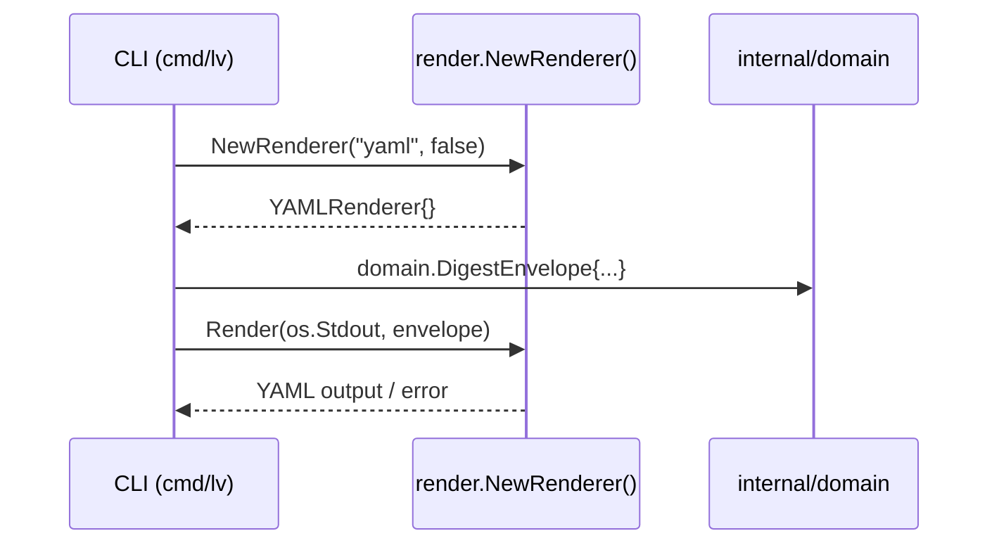

# M05: Domain models & full rendering — 詳細計画

## メタ

| 項目 | 値 |
|------|---|
| マイルストーン | M05 |
| タイトル | Domain models & full rendering |
| 前提 | M04 完了（コミット 8c5d0fd）|
| 作成日 | 2026-03-13 |
| ステータス | 計画中 |

## 目標

- `internal/domain/` パッケージを spec §9, §11, §12 に完全準拠させる
- Warning / ErrorEnvelope 型を追加（spec §9）
- `internal/render/` に YAML・Markdown・Text レンダラーを追加（spec §20）
- `NewRenderer` を全フォーマットに対応させる
- 全テスト green、`go vet ./...` クリーン

---

## 現状分析

### internal/domain/domain.go（M04 先行定義）

**定義済み型:**
- `User`, `Issue`, `Comment`, `Project`, `Activity`, `Document`, `DocumentNode`, `Attachment`
- `Status`, `Category`, `Version`, `CustomFieldDefinition`, `CustomField`
- `Team`, `Space`, `DiskUsage`, `IDName`

**問題点:**
1. `Issue.ProjectID` の JSON タグが `project_id`（snake_case）だが Backlog API は `projectId`（camelCase）
2. `Issue.IssueType` の JSON タグが `issue_type`（snake_case）→ `issueType` に修正
3. `Issue.Reporter` の JSON タグが `created_user`（snake_case）→ `createdUser` に修正
4. `Issue.DueDate`, `StartDate`, `Created`, `Updated` の JSON タグが snake_case → camelCase に修正
5. `Issue.Categories` の JSON タグが `category` → `category` は Backlog API に合わせる（OK）
6. `Activity.Content` が `map[string]interface{}` → spec §12 に合わせた正規化が必要
7. **Warning**, **ErrorEnvelope** 型が未定義
8. **DigestEnvelope** 型が未定義（spec §10 の汎用 digest wrapper）
9. `User` に `NulabAccount` フィールドが未定義（spec §11）
10. `Activity` の正規化モデル（spec §12）が未実装

### internal/render/render.go（M01 定義）

**定義済み:**
- `Renderer interface { Render(w io.Writer, data any) error }`
- `NewJSONRenderer(pretty bool)` — 実装済み
- `NewRenderer("json", pretty)` — json のみ対応

**問題点:**
- yaml / md / text フォーマット未対応
- spec §20 では `Render(v any) ([]byte, error)` だが、既存実装は `Render(w io.Writer, data any) error` → **既存シグネチャを維持する**（既存テストが依存しているため）

---

## 実装計画

### Step 1: internal/domain/ 拡張

#### 1-a. JSON タグ修正（Backlog API camelCase 準拠）

`Issue` 型の JSON タグを Backlog API レスポンスに合わせる:

```go
type Issue struct {
    ID           int          `json:"id"`
    ProjectID    int          `json:"projectId"`      // 修正: project_id → projectId
    IssueKey     string       `json:"issueKey"`
    Summary      string       `json:"summary"`
    Description  string       `json:"description"`
    Status       *IDName      `json:"status,omitempty"`
    Priority     *IDName      `json:"priority,omitempty"`
    IssueType    *IDName      `json:"issueType,omitempty"`   // 修正: issue_type → issueType
    Assignee     *User        `json:"assignee,omitempty"`
    Reporter     *User        `json:"createdUser,omitempty"` // 修正: created_user → createdUser
    Categories   []IDName     `json:"category"`
    Versions     []IDName     `json:"versions"`
    Milestones   []IDName     `json:"milestone"`
    DueDate      *time.Time   `json:"dueDate,omitempty"`     // 修正: due_date → dueDate
    StartDate    *time.Time   `json:"startDate,omitempty"`   // 修正: start_date → startDate
    Created      *time.Time   `json:"created,omitempty"`
    Updated      *time.Time   `json:"updated,omitempty"`
    CustomFields []CustomField `json:"customFields,omitempty"`
}
```

`Document` 型:
```go
type Document struct {
    ID          int64      `json:"id"`
    ProjectID   int        `json:"projectId"`       // 修正: project_id → projectId
    Title       string     `json:"title"`
    Content     string     `json:"content,omitempty"`
    Created     *time.Time `json:"created,omitempty"`
    Updated     *time.Time `json:"updated,omitempty"`
    CreatedUser *User      `json:"createdUser,omitempty"` // 修正: created_user → createdUser
}
```

#### 1-b. NulabAccount 追加（spec §11）

```go
// NulabAccount は Nulab アカウント情報。
type NulabAccount struct {
    NulabID string `json:"nulabId"`
}

// User に追加
type User struct {
    ID           int           `json:"id"`
    UserID       string        `json:"userId"`
    Name         string        `json:"name"`
    MailAddress  string        `json:"mailAddress,omitempty"`
    RoleType     int           `json:"roleType,omitempty"`
    NulabAccount *NulabAccount `json:"nulabAccount,omitempty"`
}
```

#### 1-c. Activity 正規化モデル（spec §12）

spec §12 に従い `ActivityIssueRef`, `ActivityCommentRef` を追加:

```go
// ActivityIssueRef はアクティビティ内の課題参照（簡略形）。
type ActivityIssueRef struct {
    ID      int    `json:"id"`
    Key     string `json:"key"`
    Summary string `json:"summary,omitempty"`
}

// ActivityCommentRef はアクティビティ内のコメント参照（簡略形）。
type ActivityCommentRef struct {
    ID      int64  `json:"id"`
    Content string `json:"content,omitempty"`
}

// NormalizedActivity は spec §12 に準拠した正規化アクティビティ。
// Activity は既存の Backlog API レスポンス型として残す。
type NormalizedActivity struct {
    ID      int64               `json:"id"`
    Type    string              `json:"type"`
    Created *time.Time          `json:"created,omitempty"`
    Actor   *UserRef            `json:"actor,omitempty"`
    Issue   *ActivityIssueRef   `json:"issue,omitempty"`
    Comment *ActivityCommentRef `json:"comment,omitempty"`
}

// UserRef はダイジェスト内の簡略ユーザー参照（spec §11 simplified form）。
type UserRef struct {
    ID   int    `json:"id"`
    Name string `json:"name"`
}
```

#### 1-d. Warning / ErrorEnvelope 型（spec §9）

```go
// Warning はパーシャルサクセス時の警告（spec §9 warning envelope）。
type Warning struct {
    Code      string `json:"code"`
    Message   string `json:"message"`
    Component string `json:"component,omitempty"`
    Retryable bool   `json:"retryable"`
}

// ErrorDetail はエラーの詳細情報（spec §9 error envelope 内部）。
type ErrorDetail struct {
    Code      string `json:"code"`
    Message   string `json:"message"`
    Retryable bool   `json:"retryable"`
}

// ErrorEnvelope は完全失敗時のエラーエンベロープ（spec §9）。
type ErrorEnvelope struct {
    SchemaVersion string      `json:"schema_version"`
    Error         ErrorDetail `json:"error"`
}

// DigestEnvelope はすべての digest コマンドの共通ラッパー（spec §10）。
type DigestEnvelope struct {
    SchemaVersion string      `json:"schema_version"`
    Resource      string      `json:"resource"`
    GeneratedAt   time.Time   `json:"generated_at"`
    Profile       string      `json:"profile"`
    Space         string      `json:"space"`
    BaseURL       string      `json:"base_url"`
    Warnings      []Warning   `json:"warnings"`
    Digest        interface{} `json:"digest"`
}
```

### Step 2: internal/render/ 拡張

#### 2-a. YAMLRenderer

`go.mod` に `gopkg.in/yaml.v3` を追加。

```go
// internal/render/yaml.go
type YAMLRenderer struct{}

func NewYAMLRenderer() *YAMLRenderer { return &YAMLRenderer{} }

func (r *YAMLRenderer) Render(w io.Writer, data any) error {
    enc := yaml.NewEncoder(w)
    enc.SetIndent(2)
    return enc.Encode(data)
}
```

#### 2-b. MarkdownRenderer

`fmt.Fprintf` + リフレクションで汎用 Markdown 出力:

```go
// internal/render/markdown.go
type MarkdownRenderer struct{}

func NewMarkdownRenderer() *MarkdownRenderer { return &MarkdownRenderer{} }

// Render は data を JSON に変換してから Markdown コードブロックとして出力。
// より高度な変換は digest builder 層で実施（M06 以降）。
func (r *MarkdownRenderer) Render(w io.Writer, data any) error {
    b, err := json.MarshalIndent(data, "", "  ")
    if err != nil {
        return err
    }
    _, err = fmt.Fprintf(w, "```json\n%s\n```\n", b)
    return err
}
```

> Note: M05 では汎用 Markdown（JSON コードブロック包み）を実装。
> M06 以降で `DigestEnvelope` を受け取ったときのリッチな Markdown 変換を追加予定。

#### 2-c. TextRenderer

コンパクトなターミナル向け出力:

```go
// internal/render/text.go
type TextRenderer struct{}

func NewTextRenderer() *TextRenderer { return &TextRenderer{} }

// Render は data を JSON に変換して compact form で出力。
func (r *TextRenderer) Render(w io.Writer, data any) error {
    b, err := json.Marshal(data)
    if err != nil {
        return err
    }
    _, err = fmt.Fprintf(w, "%s\n", b)
    return err
}
```

#### 2-d. NewRenderer 拡張

```go
func NewRenderer(format string, pretty bool) (Renderer, error) {
    switch format {
    case "json":
        return NewJSONRenderer(pretty), nil
    case "yaml":
        return NewYAMLRenderer(), nil
    case "md", "markdown":
        return NewMarkdownRenderer(), nil
    case "text":
        return NewTextRenderer(), nil
    default:
        return nil, fmt.Errorf("未サポートのフォーマット: %q (サポート: json, yaml, md, text)", format)
    }
}
```

---

## TDD サイクル設計

### Red フェーズ（テストを先に書く）

#### domain_test.go

```
TestDomainTypes_JSONTags
  - Issue の projectId, issueType, createdUser, dueDate, startDate が camelCase
  - User の nulabAccount フィールドが存在する
  - NormalizedActivity が spec §12 の shape を持つ
  - Warning が code/message/component/retryable フィールドを持つ
  - ErrorEnvelope が schema_version/error フィールドを持つ
  - DigestEnvelope が全フィールドを持つ
```

#### render_test.go（既存 + 追加）

```
TestYAMLRenderer_Render
  - struct を YAML に変換する
  - nil データを渡した場合 null を出力する
  - YAMLRenderer が Renderer interface を実装している

TestMarkdownRenderer_Render
  - struct を Markdown コードブロックで出力する
  - MarkdownRenderer が Renderer interface を実装している

TestTextRenderer_Render
  - struct をコンパクト JSON で出力する
  - TextRenderer が Renderer interface を実装している

TestNewRenderer_AllFormats
  - yaml, md, markdown, text で正しい Renderer を返す
  - 既存: json は JSONRenderer を返す
  - 既存: unknown はエラーを返す
```

---

## ファイル変更一覧

| ファイル | 変更種別 | 内容 |
|----------|----------|------|
| `internal/domain/domain.go` | 修正 | JSON タグ修正・型追加（NulabAccount, UserRef, ActivityIssueRef, ActivityCommentRef, NormalizedActivity, Warning, ErrorDetail, ErrorEnvelope, DigestEnvelope） |
| `internal/domain/domain_test.go` | 新規 | domain 型の JSON タグ検証テスト |
| `internal/render/yaml.go` | 新規 | YAMLRenderer 実装 |
| `internal/render/yaml_test.go` | 新規 | YAMLRenderer テスト |
| `internal/render/markdown.go` | 新規 | MarkdownRenderer 実装 |
| `internal/render/markdown_test.go` | 新規 | MarkdownRenderer テスト |
| `internal/render/text.go` | 新規 | TextRenderer 実装 |
| `internal/render/text_test.go` | 新規 | TextRenderer テスト |
| `internal/render/render.go` | 修正 | NewRenderer に yaml/md/text を追加 |
| `go.mod` | 修正 | gopkg.in/yaml.v3 追加 |
| `go.sum` | 修正 | yaml.v3 チェックサム追加 |

---

## Mermaid シーケンス図



---

## リスク評価

| リスク | 確率 | 影響 | 対策 |
|--------|------|------|------|
| `Activity` の JSON タグ変更が既存テストを破壊 | 低 | 中 | `Activity` は既存の Backlog API レスポンス型として保持し、`NormalizedActivity` を新規追加する |
| `gopkg.in/yaml.v3` のインポートパスが go.mod で解決できない | 低 | 低 | `go get gopkg.in/yaml.v3` で解決 |
| `Issue` JSON タグ変更で `http_client_test.go` が失敗 | 中 | 中 | テスト修正を同時に実施（JSON タグは Backlog API レスポンスに準拠が正）|
| `Renderer interface` シグネチャの変更 | 低 | 高 | spec §20 の `Render(v any) ([]byte, error)` は採用しない。既存シグネチャを維持 |

---

## 実装順序（TDD）

1. `internal/domain/domain_test.go` — テスト作成（Red）
2. `internal/domain/domain.go` — JSON タグ修正 + 型追加（Green）
3. テスト確認 → リファクタ（Refactor）
4. `internal/render/yaml_test.go` — テスト作成（Red）
5. `internal/render/yaml.go` — 実装（Green）
6. `internal/render/markdown_test.go` — テスト作成（Red）
7. `internal/render/markdown.go` — 実装（Green）
8. `internal/render/text_test.go` — テスト作成（Red）
9. `internal/render/text.go` — 実装（Green）
10. `internal/render/render.go` — NewRenderer 拡張（Green）
11. `go test ./...` + `go vet ./...` 全確認（Refactor）

---

## 完了条件

- [ ] `go test ./...` 全テストパス
- [ ] `go vet ./...` クリーン
- [ ] `internal/domain/` — Warning, ErrorEnvelope, DigestEnvelope, NulabAccount, UserRef, NormalizedActivity 追加
- [ ] `internal/render/` — YAML, Markdown, Text レンダラー実装
- [ ] `NewRenderer` が json/yaml/md/markdown/text を返す
- [ ] `plans/logvalet-m05-domain-render.md` コミット済み

---

## 参照

- spec §9 — Common JSON Conventions (Warning, Error envelope)
- spec §11 — User Schemas (simplified, full, NulabAccount)
- spec §12 — Activity Model (NormalizedActivity)
- spec §20 — Rendering Layer (Renderer interface, 4 formats)
- `internal/domain/domain.go` — M04 先行定義
- `internal/render/render.go` — M01 Renderer interface
- `internal/render/json.go` — JSONRenderer 実装
