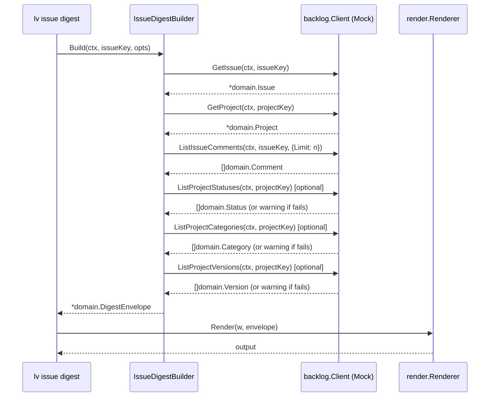

# M06: Issue read & digest — 詳細計画

## メタ情報

| 項目 | 値 |
|------|---|
| マイルストーン | M06 |
| タイトル | Issue read & digest |
| 前提 | M05 完了（コミット 6cdf6af） |
| 作成日 | 2026-03-13 |
| ステータス | 計画策定済み |

## 目標

- `issue get <issue_key>` — 課題を JSON/YAML/MD/Text で出力
- `issue list` — フィルタ+ページネーション対応の課題一覧
- `IssueDigestBuilder` — spec §19 に従い、issue から DigestEnvelope を構築
- `issue digest <issue_key>` — IssueDigest JSON を出力
- Golden tests — `testdata/*.golden` で digest 出力を固定
- MockClient を使ったテスト（実際の API 呼び出しなし）

## アーキテクチャ概要

```
internal/
  digest/
    issue.go          — IssueDigestBuilder 実装（インターフェース + 本実装）
    issue_test.go     — MockClient を使ったテスト + Golden test
    testdata/
      issue_digest.golden — digest JSON 期待値
  cli/
    issue.go          — Run() に実ロジック注入
```

### シーケンス図（issue digest）



## 実装コンポーネント詳細

### 1. `internal/digest/issue.go`

#### 型定義（spec §13.1, §19 準拠）

```go
// IssueDigestOptions は IssueDigestBuilder.Build() のオプション。
type IssueDigestOptions struct {
    MaxComments     int  // デフォルト 5
    IncludeActivity bool // デフォルト true
}

// IssueDigestBuilder インターフェース（spec §19）
type IssueDigestBuilder interface {
    Build(ctx context.Context, issueKey string, opt IssueDigestOptions) (*domain.DigestEnvelope, error)
}

// DefaultIssueDigestBuilder は IssueDigestBuilder の標準実装。
type DefaultIssueDigestBuilder struct {
    client    backlog.Client
    profile   string
    space     string
    baseURL   string
}
```

#### IssueDigest 内部構造体

```go
// IssueDigest は digest.issue フィールドに格納される（spec §13.1）。
type IssueDigest struct {
    Issue    DigestIssue    `json:"issue"`
    Project  DigestProject  `json:"project"`
    Meta     DigestMeta     `json:"meta"`
    Comments []DigestComment `json:"comments"`
    Activity []interface{}  `json:"activity"`
    Summary  DigestSummary  `json:"summary"`
    LLMHints DigestLLMHints `json:"llm_hints"`
}

// DigestIssue は digest 内の課題情報。
type DigestIssue struct {
    ID          int                `json:"id"`
    Key         string             `json:"key"`
    Summary     string             `json:"summary"`
    Description string             `json:"description"`
    Status      *domain.IDName     `json:"status,omitempty"`
    Priority    *domain.IDName     `json:"priority,omitempty"`
    IssueType   *domain.IDName     `json:"issue_type,omitempty"`
    Assignee    *domain.UserRef    `json:"assignee,omitempty"`
    Reporter    *domain.UserRef    `json:"reporter,omitempty"`
    Categories  []string           `json:"categories"`
    Versions    []string           `json:"versions"`
    Milestones  []string           `json:"milestones"`
    CustomFields []domain.CustomField `json:"custom_fields"`
    Created     *time.Time         `json:"created,omitempty"`
    Updated     *time.Time         `json:"updated,omitempty"`
    DueDate     *time.Time         `json:"due_date,omitempty"`
    StartDate   *time.Time         `json:"start_date,omitempty"`
}

// DigestProject は digest 内のプロジェクト情報。
type DigestProject struct {
    ID   int    `json:"id"`
    Key  string `json:"key"`
    Name string `json:"name"`
}

// DigestMeta は digest 内のメタ情報。
type DigestMeta struct {
    Statuses     []domain.Status               `json:"statuses"`
    Categories   []domain.Category             `json:"categories"`
    Versions     []domain.Version              `json:"versions"`
    CustomFields []domain.CustomFieldDefinition `json:"custom_fields"`
}

// DigestComment は digest 内のコメント情報。
type DigestComment struct {
    ID      int64            `json:"id"`
    Content string           `json:"content"`
    Author  *domain.UserRef  `json:"author,omitempty"`
    Created *time.Time       `json:"created,omitempty"`
}

// DigestSummary は決定論的サマリー（spec §13.1）。
type DigestSummary struct {
    Headline              string `json:"headline"`
    CommentCountIncluded  int    `json:"comment_count_included"`
    ActivityCountIncluded int    `json:"activity_count_included"`
    HasDescription        bool   `json:"has_description"`
    HasAssignee           bool   `json:"has_assignee"`
    StatusName            string `json:"status_name"`
    PriorityName          string `json:"priority_name"`
}

// DigestLLMHints は LLM 向けヒント情報（spec §13.1）。
type DigestLLMHints struct {
    PrimaryEntities      []string `json:"primary_entities"`
    OpenQuestions        []string `json:"open_questions"`
    SuggestedNextActions []string `json:"suggested_next_actions"`
}
```

#### Build() メソッドの動作

1. `GetIssue(ctx, issueKey)` — 必須: 失敗なら即エラーリターン
2. `GetProject(ctx, projectKey)` — 必須: 失敗なら即エラーリターン
3. `ListIssueComments(ctx, issueKey, {Limit: opts.MaxComments})` — オプション: 失敗時は warning 追加して続行
4. `ListProjectStatuses / ListProjectCategories / ListProjectVersions / ListProjectCustomFields` — オプション: 失敗時は warning 追加して続行
5. DigestIssue を組み立て（UserRef 変換含む）
6. DigestSummary を決定論的に構築
7. LLMHints を構築（primary_entities = [issueKey, projectKey, ...milestone names]）
8. DigestEnvelope に格納してリターン

### 2. `internal/digest/issue_test.go`

#### テストケース設計（TDD: Red → Green → Refactor）

```
TestDefaultIssueDigestBuilder_Build_success
  - GetIssueFunc, GetProjectFunc, ListIssueCommentsFunc をセット
  - ListProjectStatuses等はErrNotFoundを返す（warning が追加されること確認）
  - envelope.Resource == "issue" を確認
  - envelope.Digest.(IssueDigest).Issue.Key == "PROJ-123" を確認
  - Golden test: JSON をファイルと比較

TestDefaultIssueDigestBuilder_Build_issueNotFound
  - GetIssueFunc が ErrNotFound を返す
  - Build() がエラーを返すことを確認

TestDefaultIssueDigestBuilder_Build_projectNotFound
  - GetIssueFunc は成功、GetProjectFunc が ErrNotFound を返す
  - Build() がエラーを返すことを確認

TestDefaultIssueDigestBuilder_Build_commentsWarning
  - ListIssueComments が ErrNotFound
  - Build() は成功し、envelope.Warnings が 1 件あることを確認

TestDefaultIssueDigestBuilder_Build_maxComments
  - MaxComments=2 でコメントが 5 件返ってくる場合
  - 結果のコメント数が <= 2 であることを確認（MockClientはLimit通りに返すため）
```

#### Golden Test

- `testdata/issue_digest.golden` に期待 JSON を保存
- `UPDATE_GOLDEN=1 go test ./internal/digest/ -run TestGolden` でファイル更新
- 通常実行では `bytes.Equal` でファイルと比較

### 3. `internal/cli/issue.go` — Run() 実装

#### `IssueGetCmd.Run()`

```go
func (c *IssueGetCmd) Run(g *GlobalFlags) error {
    // 1. クライアントを構築（現時点では MockClient / 将来は HTTPClient）
    // 2. client.GetIssue(ctx, c.IssueIDOrKey)
    // 3. render.NewRenderer(g.Format, g.Pretty)
    // 4. renderer.Render(os.Stdout, issue)
}
```

#### `IssueListCmd.Run()`

```go
func (c *IssueListCmd) Run(g *GlobalFlags) error {
    // 1. client.ListIssues(ctx, backlog.ListIssuesOptions{...})
    // 2. ページネーション情報と items を結合して出力
    // 出力スキーマ: { items: [...], count: n, limit: n, offset: n }
}
```

#### `IssueDigestCmd.Run()`

```go
func (c *IssueDigestCmd) Run(g *GlobalFlags) error {
    // 1. digest.NewDefaultIssueDigestBuilder(client, profile, space, baseURL)
    // 2. builder.Build(ctx, c.IssueKey, {MaxComments, IncludeActivity})
    // 3. renderer.Render(os.Stdout, envelope)
}
```

**注意**: M06時点では credential/config システムが未完成のため、CLI の Run() は
「設定が取得できない場合は ErrNotImplemented を返す」という最小実装にする。
digest パッケージのロジック自体は MockClient で完全テスト可能にする。

#### `IssueDigestCmd` の修正点

現在:
```go
type IssueDigestCmd struct {
    DigestFlags
    ProjectKey string `arg:"" required:"" help:"プロジェクトキー"`
}
```

spec §14.3 に合わせて修正:
```go
type IssueDigestCmd struct {
    IssueKey    string `arg:"" required:"" help:"課題キー (例: PROJ-123)"`
    Comments    int    `short:"c" help:"取得するコメント数" default:"5"`
    NoActivity  bool   `help:"アクティビティを含めない"`
}
```

### 4. `internal/digest/` ディレクトリ構造

```
internal/digest/
  issue.go           — IssueDigestBuilder interface + DefaultIssueDigestBuilder
  issue_test.go      — TDD テスト
  testdata/
    issue_digest.golden — Golden JSON
```

## TDD 実装順序

### Step 1: Red — テストを先に書く

`internal/digest/issue_test.go` に失敗するテストを書く:
- `TestBuildSuccess` — envelope が正しく組み立てられること
- `TestBuildIssueNotFound` — エラーが返ること
- `TestBuildPartialSuccess` — comment fetch 失敗時に warning が追加されること

### Step 2: Green — 最小実装

`internal/digest/issue.go` を実装してテストを通す。

### Step 3: Refactor

- summary 構築ロジックをプライベート関数に切り出す
- llm_hints 構築ロジックを整理
- Golden test を追加（`issue_digest.golden` ファイル生成）

## リスク評価

| リスク | 影響 | 対策 |
|--------|------|------|
| CLI の Run() でクライアント生成が困難 | 中 | Run() は常に NotImplemented を返す最小実装にし、digest ロジック本体はテスト可能にする |
| DigestEnvelope.Digest が interface{} 型 | 低 | IssueDigest を `interface{}` として格納し、テストでは型アサーションで確認 |
| golden ファイルの time.Time フィールドが非決定論的 | 中 | build 時に `GeneratedAt` を引数化するか、テスト時はパース後に比較 |

## 完了基準

- [ ] `go test ./internal/digest/ -v` が全てパス
- [ ] `go test ./internal/cli/ -v` が全てパス（既存テストも含む）
- [ ] `go test ./...` が全てパス
- [ ] `go vet ./...` がクリーン
- [ ] `go build ./cmd/lv/` が成功
- [ ] `testdata/issue_digest.golden` が存在し、内容が正しい
- [ ] issue get / list / digest コマンドが `lv --help` に正しく表示される

## コミットメッセージ

```
feat(issue): M06 issueコマンドとIssueDigestBuilderを実装

- internal/digest/issue.go: IssueDigestBuilder interface + DefaultIssueDigestBuilder
- internal/digest/issue_test.go: MockClient を使ったテスト（TDD）
- internal/cli/issue.go: IssueDigestCmd フラグ修正
- testdata/issue_digest.golden: Golden test ファイル

Plan: plans/logvalet-m06-issue-read.md
```
