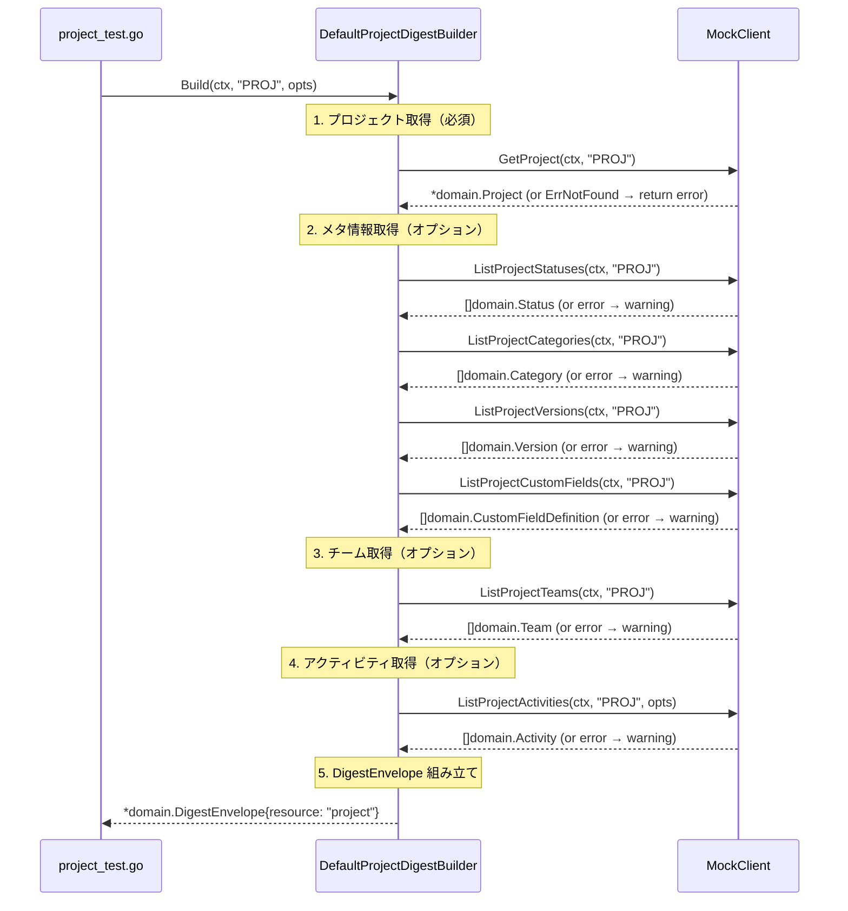

# M07: Project & meta commands — 詳細実装計画

## Meta
| 項目 | 値 |
|------|---|
| マイルストーン | M07 |
| タイトル | Project & meta commands |
| 前マイルストーン | M06（IssueDigestBuilder 実装完了、コミット 65f4f0a） |
| 作成日 | 2026-03-13 |
| ステータス | 計画 |

## ゴール

- `project get` / `project list` コマンドの digest パッケージロジック実装
- `ProjectDigestBuilder` の実装（spec §13.2 準拠）
- `project digest` コマンドの digest パッケージロジック実装
- `meta status` / `meta category` / `meta version` / `meta custom-field` コマンドの digest パッケージロジック実装
- MockClient を使った全テスト

CLI の `Run()` 統合は M06 と同様に **NotImplemented のまま**。
Credential/Config システム完成後（将来マイルストーン）に統合する。

---

## 仕様参照

### spec §13.2 Project Digest

Project Digest に含まれるフィールド:
```
- project    （プロジェクト基本情報）
- meta       （statuses / categories / versions / custom_fields）
- teams      （プロジェクトのチーム一覧）
- recent_activity （最近のアクティビティ）
- summary    （決定論的サマリー）
- llm_hints  （LLM向けヒント）
```

### spec §14.9 `lv project get <project_key>`
- 構造化プロジェクト JSON を返す

### spec §14.10 `lv project list`
- プロジェクト一覧 JSON を返す

### spec §14.11 `lv project digest <project_key>`
- Project Digest を返す

### spec §14.23 `lv meta status <project_key>`
- プロジェクトのステータス一覧を返す

### spec §14.24 `lv meta category <project_key>`
- プロジェクトのカテゴリ一覧を返す

### spec §14.25 `lv meta version <project_key>`
- プロジェクトのバージョン/マイルストーン一覧を返す

### spec §14.26 `lv meta custom-field <project_key>`
- プロジェクトのカスタムフィールド定義一覧を返す

---

## アーキテクチャ

### 新規ファイル

| ファイル | 役割 |
|---------|------|
| `internal/digest/project.go` | ProjectDigestBuilder インターフェース + DefaultProjectDigestBuilder 実装 |
| `internal/digest/project_test.go` | TDD テスト |
| `internal/digest/testdata/project_digest.golden` | Golden test 期待値 |

### 変更ファイル

| ファイル | 変更内容 |
|---------|---------|
| `internal/cli/project.go` | Run() は NotImplemented のまま（プレースホルダー維持） |
| `internal/cli/meta.go` | Run() は NotImplemented のまま（プレースホルダー維持） |

### M06 との一貫性

- `DefaultIssueDigestBuilder` と同じ設計パターンを踏襲
- `backlog.Client` interface 既存メソッドのみ使用（新規 API メソッド不要）
- MockClient の既存 Func フィールドのみ使用（mock_client.go 変更不要）
- `DigestProject` / `DigestMeta` 構造体は `issue.go` で定義済みのものを再利用

---

## データ構造設計

### ProjectDigest（digest フィールド）

```go
type ProjectDigest struct {
    Project        DigestProjectDetail  `json:"project"`
    Meta           DigestMeta           `json:"meta"`
    Teams          []domain.Team        `json:"teams"`
    RecentActivity []interface{}        `json:"recent_activity"`
    Summary        ProjectDigestSummary `json:"summary"`
    LLMHints       DigestLLMHints       `json:"llm_hints"`
}

type DigestProjectDetail struct {
    ID         int    `json:"id"`
    Key        string `json:"key"`
    Name       string `json:"name"`
    Archived   bool   `json:"archived"`
}

type ProjectDigestSummary struct {
    Headline              string `json:"headline"`
    TeamCount             int    `json:"team_count"`
    ActivityCountIncluded int    `json:"activity_count_included"`
    StatusCount           int    `json:"status_count"`
    CategoryCount         int    `json:"category_count"`
    VersionCount          int    `json:"version_count"`
    IsArchived            bool   `json:"is_archived"`
}
```

### ProjectDigestBuilder インターフェース

```go
type ProjectDigestOptions struct{}  // 将来の拡張のためのプレースホルダー

type ProjectDigestBuilder interface {
    Build(ctx context.Context, projectKey string, opt ProjectDigestOptions) (*domain.DigestEnvelope, error)
}
```

---

## TDD 設計（Red → Green → Refactor）

### Red フェーズ（先にテストを書く）

`internal/digest/project_test.go` に以下のテストを記述（コンパイルエラー状態）:

1. **TestDefaultProjectDigestBuilder_Build_success**
   - 全データ正常取得
   - envelope.Resource == "project"
   - digest.Project.Key == "PROJ"
   - digest.Teams に1件
   - digest.Meta.Statuses に2件
   - digest.Summary.Headline が "PROJ" を含む

2. **TestDefaultProjectDigestBuilder_Build_projectNotFound**
   - GetProject → ErrNotFound → error を返す
   - 必須データ失敗時はエラーリターン

3. **TestDefaultProjectDigestBuilder_Build_teamsWarning**
   - ListProjectTeams → error → warning + 空チーム
   - 部分成功で DigestEnvelope を返す

4. **TestDefaultProjectDigestBuilder_Build_metaWarnings**
   - ListProjectStatuses 等 → error → warnings
   - 部分成功で DigestEnvelope を返す

5. **TestProjectGolden**
   - testdata/project_digest.golden との比較
   - UPDATE_GOLDEN=1 で更新可能

### Green フェーズ（実装）

`internal/digest/project.go` を実装:
- GetProject → 失敗時はエラーリターン（必須）
- ListProjectStatuses, ListProjectCategories, ListProjectVersions, ListProjectCustomFields → 失敗時 warning（オプション）
- ListProjectTeams → 失敗時 warning（オプション）
- ListProjectActivities → 失敗時 warning（オプション）
- ProjectDigest 組み立て
- DigestEnvelope 組み立て（resource: "project"）

### Refactor フェーズ

- 重複コードがあれば共通ヘルパーに抽出
- 型アサーション確認
- `go vet ./...` クリーン確認

---

## 実装ステップ（順序）

### Step 1: テストファイル作成（Red）

`internal/digest/project_test.go` を作成:
- パッケージ: `digest_test`（issue_test.go と同じ）
- テストヘルパー: `newTestProjectForDigest()` を定義
- 5テストケース全て記述
- `compile error` 状態であることを確認

### Step 2: 実装ファイル作成（Green）

`internal/digest/project.go` を作成:
- `ProjectDigestOptions` 構造体
- `ProjectDigestBuilder` インターフェース
- `DefaultProjectDigestBuilder` 構造体
- `NewDefaultProjectDigestBuilder()` コンストラクタ
- `DigestProjectDetail` 構造体
- `ProjectDigestSummary` 構造体
- `ProjectDigest` 構造体
- `Build()` メソッド
- ヘルパー関数

### Step 3: テスト実行

```bash
cd /Users/youyo/src/github.com/youyo/logvaret
go test ./internal/digest/... -run TestDefaultProjectDigestBuilder
go test ./internal/digest/... -run TestProjectGolden
go test ./...
go vet ./...
```

### Step 4: Golden test ファイル生成

```bash
UPDATE_GOLDEN=1 go test ./internal/digest/... -run TestProjectGolden
```

### Step 5: CLI プレースホルダー確認

`internal/cli/project.go` と `internal/cli/meta.go` は既に適切なプレースホルダーがある。
変更不要（Run() は NotImplemented のまま）。

---

## シーケンス図



---

## リスク評価

| リスク | 確率 | 影響 | 対策 |
|-------|------|------|------|
| DigestProject と DigestProjectDetail の名前衝突 | 中 | 中 | DigestProjectDetail を新規追加し、issue.go の DigestProject と区別する |
| issue_test.go と project_test.go の変数名衝突 | 中 | 低 | project_test.go では `newTestProjectForDigest()` と別名を使う |
| Golden test の GeneratedAt 不一致 | 低 | 低 | env.GeneratedAt = testTime で固定（issue_test.go と同じパターン） |
| ListProjectActivities の Options 型 | 低 | 低 | backlog.ListActivitiesOptions{} をゼロ値で渡す |

---

## 完了基準

- [ ] `internal/digest/project.go` 実装完了
- [ ] `internal/digest/project_test.go` 全テスト pass
- [ ] `internal/digest/testdata/project_digest.golden` 生成
- [ ] `go test ./...` 全テスト pass（9パッケージ、M06との後退なし）
- [ ] `go vet ./...` クリーン
- [ ] `go build ./cmd/lv/` 成功
- [ ] git commit（Conventional Commits 形式、日本語）

## 未対応（将来マイルストーン）

- CLI `Run()` への統合（credential/config 完成後）
- `project get` / `project list` の実際の API 呼び出し
- `meta status` 等の実際の API 呼び出し
