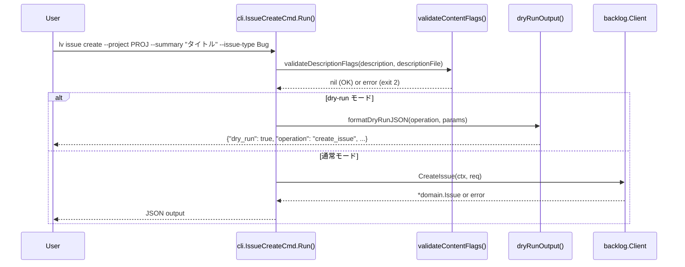
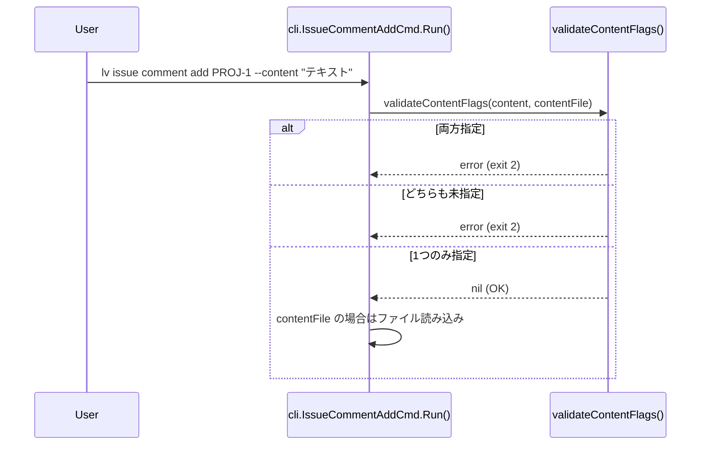

# M08: Issue write operations — 詳細計画

## Meta
| 項目 | 値 |
|------|---|
| マイルストーン | M08 |
| 作成日 | 2026-03-13 |
| ステータス | 計画中 |
| 担当 | implementer |
| 前提 | M07 完了（コミット f294dc9）|

## 目的

`issue create` / `issue update` / `issue comment list` / `issue comment add` / `issue comment update` コマンドに実装を追加する。
現在の `internal/cli/issue.go` では全コマンドが `ErrNotImplemented` を返すプレースホルダー。
M08 では CLI 層のバリデーションロジック（フラグ検証・dry-run 動作）と、
MockClient を用いた単体テストを完全実装する。

> **スコープ注意**: M08 は CLI バリデーション層のみ。
> BacklogClient への実際の HTTP 呼び出し統合は credential/config システム完成後に行う（将来マイルストーン）。
> 今回は `--dry-run` フラグと引数バリデーションの動作を実装し、テスト可能な状態にする。

---

## 実装対象コマンド

### §14.4 `lv issue create`

**フラグ:**
- `--project <key>` (必須)
- `--summary <text>` (必須)
- `--issue-type <name|id>` (必須)
- `--description <text>` (オプション)
- `--description-file <path>` (オプション)
- `--priority <name>` (オプション)
- `--assignee <user>` (オプション)
- `--category <name>` (オプション、複数可)
- `--version <name>` (オプション、複数可)
- `--milestone <name>` (オプション、複数可)
- `--due-date <YYYY-MM-DD>` (オプション)
- `--start-date <YYYY-MM-DD>` (オプション)
- `--dry-run` (WriteFlags に含まれる)

**バリデーション:**
- `--description` と `--description-file` は排他 → exit code 2
- `--dry-run` 時は何も書き込まず、予定操作の JSON を stdout に出力して exit 0

### §14.5 `lv issue update <issue_key>`

**フラグ（全てオプション、ただし1つ以上必須）:**
- `--summary <text>`
- `--description <text>`
- `--description-file <path>`
- `--status <name>`
- `--priority <name>`
- `--assignee <user>`
- `--category <name>` (複数可)
- `--version <name>` (複数可)
- `--milestone <name>` (複数可)
- `--due-date <YYYY-MM-DD>`
- `--start-date <YYYY-MM-DD>`
- `--dry-run`

**バリデーション:**
- フラグが1つも指定されていない → exit code 2
- `--description` と `--description-file` は排他 → exit code 2
- `--dry-run` 時は何も書き込まず、予定操作の JSON を stdout に出力して exit 0

### §14.6 `lv issue comment list <issue_key>`

- 引数: `<issue_key>` (必須)
- フラグ: `--limit` (ListFlags から)、`--offset` (ListFlags から)
- dry-run 不要（read 操作）

### §14.7 `lv issue comment add <issue_key>`

**フラグ:**
- `--content <text>` (--content-file と排他)
- `--content-file <path>` (--content と排他)
- `--dry-run`

**バリデーション:**
- `--content` か `--content-file` のいずれか1つ必須 → どちらもなければ exit code 2
- 両方指定 → exit code 2

### §14.8 `lv issue comment update <issue_key> <comment_id>`

**フラグ:**
- `--content <text>` (--content-file と排他)
- `--content-file <path>` (--content と排他)
- `--dry-run`

**バリデーション:**
- `--content` か `--content-file` のいずれか1つ必須
- 両方指定 → exit code 2

---

## シーケンス図





---

## TDD 設計（Red → Green → Refactor）

### Red フェーズ（テスト先行）

`internal/cli/issue_write_test.go` を作成し、以下のテストを書く:

#### IssueCreateCmd テスト
1. `TestIssueCreateCmd_validate_descriptionExclusive` — `--description` と `--description-file` 両指定でエラー
2. `TestIssueCreateCmd_validate_dryRun` — `--dry-run` で何も呼ばれない
3. `TestIssueCreateCmd_validate_missingRequired` — 必須フラグ欠落でエラー

#### IssueUpdateCmd テスト
4. `TestIssueUpdateCmd_validate_noFlags` — 更新フラグなしで exit code 2
5. `TestIssueUpdateCmd_validate_descriptionExclusive` — `--description` と `--description-file` 両指定でエラー
6. `TestIssueUpdateCmd_validate_dryRun` — `--dry-run` で何も呼ばれない

#### IssueCommentListCmd テスト
7. `TestIssueCommentListCmd_validate_issueKey` — issueKey が渡される

#### IssueCommentAddCmd テスト
8. `TestIssueCommentAddCmd_validate_noContent` — --content も --content-file もないとエラー
9. `TestIssueCommentAddCmd_validate_bothContent` — 両方指定でエラー
10. `TestIssueCommentAddCmd_validate_contentFile` — ファイル読み込みが正しく行われる
11. `TestIssueCommentAddCmd_validate_dryRun` — `--dry-run` で何も呼ばれない

#### IssueCommentUpdateCmd テスト
12. `TestIssueCommentUpdateCmd_validate_noContent` — --content も --content-file もないとエラー
13. `TestIssueCommentUpdateCmd_validate_bothContent` — 両方指定でエラー

### Green フェーズ（最小実装）

`internal/cli/issue.go` に以下を実装:

1. **バリデーターヘルパー関数**:
   - `validateDescriptionFlags(description, descriptionFile string) error`
   - `validateContentFlags(content, contentFile string) error`
   - `validateAtLeastOneUpdateFlag(req *backlog.UpdateIssueRequest) error`
   - `readContentFromFile(path string) (string, error)`
   - `formatDryRun(operation string, params map[string]interface{}) ([]byte, error)`

2. **各コマンドの Run() 実装**:
   - `IssueCreateCmd.Run()` — バリデーション → dry-run → NotImplemented（API呼び出し部分）
   - `IssueUpdateCmd.Run()` — バリデーション → dry-run → NotImplemented
   - `IssueCommentListCmd.Run()` — NotImplemented（バリデーション不要）
   - `IssueCommentAddCmd.Run()` — バリデーション → dry-run → NotImplemented
   - `IssueCommentUpdateCmd.Run()` — バリデーション → dry-run → NotImplemented

### Refactor フェーズ

- ヘルパー関数を `internal/cli/validate.go` に切り出し（if 3コマンド以上で共有される場合）
- dry-run 出力フォーマットの一元化

---

## ファイル構成

```
internal/cli/
  issue.go                  — 既存（Run()を実装で更新）
  issue_write_test.go       — 新規（write コマンドテスト）
  validate.go               — 新規（共通バリデーターヘルパー）
  validate_test.go          — 新規（バリデーターテスト）
```

---

## 実装ステップ（順序）

1. `internal/cli/issue_write_test.go` 作成（Redフェーズ）— テストを先に書く
2. `go test ./internal/cli/...` で RED 確認
3. `internal/cli/validate.go` 作成（validateDescriptionFlags, validateContentFlags, 等）
4. `internal/cli/issue.go` の Run() 実装（Greenフェーズ）
5. `go test ./internal/cli/...` で GREEN 確認
6. `go test ./...` で全パス確認
7. `go vet ./...` でクリーン確認
8. Refactor: 必要に応じてリファクタリング

---

## dry-run 出力スキーマ

```json
{
  "dry_run": true,
  "operation": "create_issue",
  "params": {
    "project_key": "PROJ",
    "summary": "バグ修正",
    "issue_type": "Bug",
    "description": "詳細説明",
    "priority": null,
    "assignee": null
  }
}
```

```json
{
  "dry_run": true,
  "operation": "add_comment",
  "params": {
    "issue_key": "PROJ-123",
    "content": "コメント内容"
  }
}
```

---

## exit code マッピング

| 状況 | exit code |
|------|----------|
| 排他フラグ違反 | 2 |
| 更新フラグなし | 2 |
| コンテンツフラグなし | 2 |
| ファイル読み込みエラー | 1 |
| dry-run 成功 | 0 |
| API 呼び出し成功 | 0 |

---

## リスク評価

| リスク | 影響 | 対策 |
|--------|------|------|
| ファイル読み込みのエラーハンドリング | 中 | os.ReadFile のエラーを適切に wrap して exit code 1 |
| dry-run と実際の API 呼び出しの分岐 | 低 | BacklogClient がまだ統合されていないため、dry-run 後は NotImplemented でOK |
| UpdateIssueRequest の「変更フラグなし」検出 | 中 | 専用の isEmptyUpdateRequest 関数で nil チェック |
| issue comment list の ListFlags 追加 | 低 | IssueCommentListCmd に ListFlags を embed する |

---

## 完了基準

- [ ] `go test ./...` が全パス
- [ ] `go vet ./...` がクリーン
- [ ] `go build ./cmd/lv/` が成功
- [ ] 全13テストケースが GREEN
- [ ] バリデーションロジックが spec §14.4-14.8 準拠
- [ ] `--dry-run` フラグが正常動作
- [ ] `--content` / `--content-file` 排他バリデーション実装
- [ ] `--description` / `--description-file` 排他バリデーション実装
