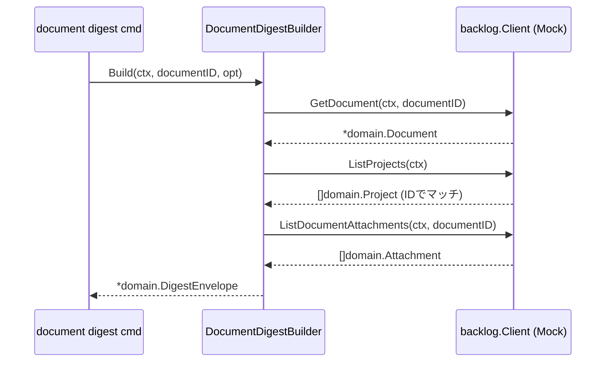
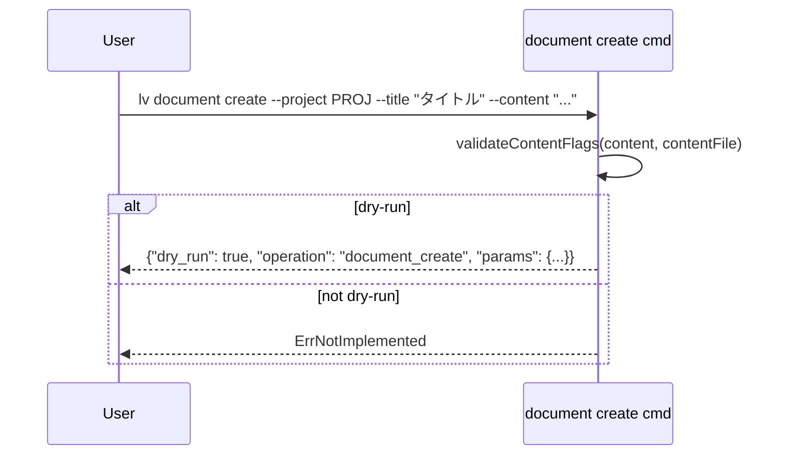

# M09: Document commands — 詳細計画

## メタ情報

| 項目 | 値 |
|------|---|
| マイルストーン | M09 |
| タイトル | Document commands |
| 担当 | 実装エージェント |
| 前提 | M08 完了（コミット 2ae450c） |
| 作成日 | 2026-03-13 |
| ステータス | 計画中 |

---

## 目標

spec §14.18–14.22 の document コマンド群と §13.5 の DocumentDigestBuilder を実装する。
M08 と同様に **CLI バリデーション + dry-run のみ実装**し、実際の BacklogClient HTTP 呼び出しは credential/config システム完成後に統合予定。

---

## 実装対象

### 1. `internal/digest/document.go` — DocumentDigestBuilder（spec §13.5）

**構造体:**

```go
type DocumentDigestOptions struct {
    // 将来の拡張用プレースホルダー
}

type DocumentDigestBuilder interface {
    Build(ctx context.Context, documentID int64, opt DocumentDigestOptions) (*domain.DigestEnvelope, error)
}

type DefaultDocumentDigestBuilder struct {
    client  backlog.Client
    profile string
    space   string
    baseURL string
}

// Digest フィールド群（spec §13.5）
type DocumentDigest struct {
    Document    DigestDocumentDetail  `json:"document"`
    Project     DigestProject         `json:"project"`
    Attachments []domain.Attachment   `json:"attachments"`
    Summary     DocumentDigestSummary `json:"summary"`
    LLMHints    DigestLLMHints        `json:"llm_hints"`
}

type DigestDocumentDetail struct {
    ID          int64            `json:"id"`
    ProjectID   int              `json:"project_id"`
    Title       string           `json:"title"`
    Content     string           `json:"content,omitempty"`
    Created     *time.Time       `json:"created,omitempty"`
    Updated     *time.Time       `json:"updated,omitempty"`
    CreatedUser *domain.UserRef  `json:"created_user,omitempty"`
}

type DocumentDigestSummary struct {
    Headline           string `json:"headline"`
    AttachmentCount    int    `json:"attachment_count"`
    HasContent         bool   `json:"has_content"`
    ContentLength      int    `json:"content_length"`
}
```

**Build() ロジック:**
1. `GetDocument(ctx, documentID)` — 必須
2. `GetProject(ctx, projectKey)` — ドキュメントの `ProjectID` からプロジェクトキーが取れないため、別途 `ListProjects` を使うか `ProjectID` を int として `GetProject` 側が受け入れられないため → `ListProjects` で全一覧取得して ID でマッチ。失敗は warning。
3. `ListDocumentAttachments(ctx, documentID)` — オプション
4. DigestEnvelope 組み立て

**注意:** spec は `GetProject(projectKey string)` を string 引数で定義。Document には `ProjectID int` があるが `projectKey` がない。M09 では `ListProjects` で全件取得して ID マッチ方式を採用し、警告として注記する。

### 2. `internal/digest/document_test.go` — テスト

TDD: まずテストを書いてから実装する。

テストケース:
- `TestDocumentDigestBuilder_Build_success` — 正常系
- `TestDocumentDigestBuilder_Build_document_not_found` — GetDocument 失敗
- `TestDocumentDigestBuilder_Build_attachments_fetch_failed` — 添付ファイル取得失敗（warning）
- `TestDocumentDigestBuilder_Build_project_fetch_failed` — プロジェクト取得失敗（warning）

### 3. `internal/cli/document.go` — document コマンド群の更新（spec §14.18-14.22）

**DocumentGetCmd の更新:**
- `NodeID` フィールドを `DocumentID int64` に変更（spec §14.18: `document get <document_id>`）
- Run() は `ErrNotImplemented` のまま（BacklogClient 統合は後回し）

**DocumentListCmd の更新:**
- `ProjectKey` を `--project` フラグに変更（spec §14.19: `--project <key>` が必須フラグ）
- `ListFlags` embed 済み（--limit/--offset）

**DocumentCreateCmd の更新:**
- `Content string` と `ContentFile string` フラグを追加
- `ParentID *int64` フラグを追加
- Run() に content バリデーション（`validateContentFlags` 使用）と dry-run 実装

### 4. テスト: `internal/cli/document_test.go`（新規作成）

TDD: テストを先に書く。

テストケース:
- `TestDocumentCreateCmd_run_dry_run` — dry-run 正常系
- `TestDocumentCreateCmd_run_content_conflict` — --content と --content-file の排他エラー
- `TestDocumentCreateCmd_run_content_required` — どちらも未指定エラー
- `TestDocumentCreateCmd_run_content_file` — --content-file からの読み込み

---

## TDD サイクル

### Red フェーズ（テスト先行）

1. `internal/digest/document_test.go` を作成（インターフェース参照のみ・コンパイルエラー可）
2. `internal/cli/document_test.go` を作成（コンパイルエラー可）

### Green フェーズ（最小実装）

3. `internal/digest/document.go` を実装してテストを通す
4. `internal/cli/document.go` を更新してテストを通す

### Refactor フェーズ

5. `go vet ./...` でクリーン確認
6. テストが全パスしていることを確認

---

## ファイル一覧

| ファイル | 操作 | 内容 |
|--------|------|------|
| `internal/digest/document.go` | 新規作成 | DocumentDigestBuilder |
| `internal/digest/document_test.go` | 新規作成 | TDD テスト |
| `internal/cli/document.go` | 更新 | コマンド定義更新 + dry-run |
| `internal/cli/document_test.go` | 新規作成 | CLI テスト |
| `plans/logvalet-m09-document.md` | 新規作成 | 本ファイル |

---

## シーケンス図





---

## リスク評価

| リスク | 確率 | 影響 | 対策 |
|--------|------|------|------|
| `projectKey` が Document に含まれないため `GetProject` が呼べない | 高 | 中 | `ListProjects` + ID マッチで解決。失敗は warning |
| M08 の `validateContentFlags` がパッケージ非公開で CLI テストから使えない | 低 | 低 | `validate.go` で定義済みでパッケージ内からアクセス可能 |
| `DocumentID` が文字列 arg から int64 への変換が必要 | 中 | 低 | Kong の型変換で対応（`int64` 型フィールドを使用） |

---

## 完了条件

- [ ] `go test ./...` が全パス
- [ ] `go build ./cmd/lv/` が成功
- [ ] `go vet ./...` がクリーン
- [ ] DocumentDigestBuilder が正常系テストと partial success テストをカバー
- [ ] DocumentCreateCmd が dry-run、content 排他バリデーションをカバー
- [ ] コミット作成済み

---

## 変更ログ

| 日時 | 種別 | 内容 |
|------|------|------|
| 2026-03-13 | 作成 | M09 詳細計画初版 |
