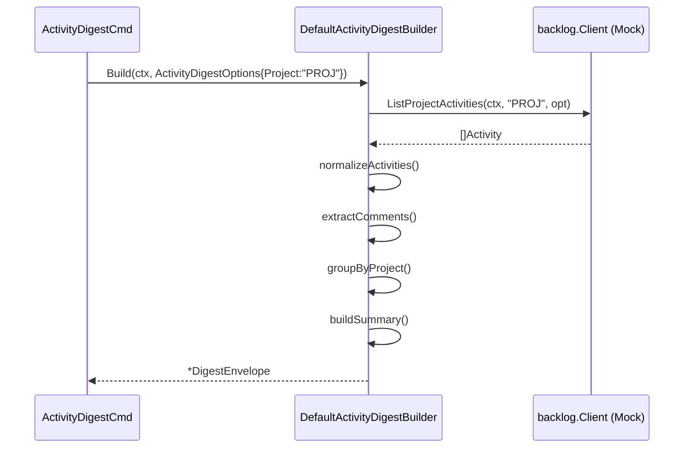

# M10: Activity & User Commands — 詳細実装計画

> 作成日: 2026-03-13
> ステータス: 実装中
> 担当: implementer agent

## 概要

M10 では activity コマンド群と user コマンド群を実装する。
スペック §13.3（ActivityDigest）, §13.4（UserDigest）, §14.12-14.17 準拠。

## 実装コンポーネント

### 1. internal/digest/activity.go — ActivityDigestBuilder

**型定義:**

```go
// ActivityDigestOptions は ActivityDigestBuilder.Build() のオプション（spec §19）。
type ActivityDigestOptions struct {
    Project string
    Since   *time.Time
    Until   *time.Time
    Limit   int
}

// ActivityDigestBuilder はインターフェース（spec §19）。
type ActivityDigestBuilder interface {
    Build(ctx context.Context, opt ActivityDigestOptions) (*domain.DigestEnvelope, error)
}
```

**ActivityDigest 構造体（spec §13.3）:**

```go
type ActivityDigest struct {
    Scope      ActivityScope                     `json:"scope"`
    Activities []domain.NormalizedActivity       `json:"activities"`
    Comments   []DigestComment                   `json:"comments"`
    Projects   map[string]ActivityProjectSummary `json:"projects"`
    Summary    ActivityDigestSummary             `json:"summary"`
    LLMHints   DigestLLMHints                    `json:"llm_hints"`
}

type ActivityScope struct {
    Project string     `json:"project,omitempty"`
    Since   *time.Time `json:"since,omitempty"`
    Until   *time.Time `json:"until,omitempty"`
    Limit   int        `json:"limit"`
}

type ActivityProjectSummary struct {
    ActivityCount int `json:"activity_count"`
    CommentCount  int `json:"comment_count"`
}

type ActivityDigestSummary struct {
    Headline           string         `json:"headline"`
    TotalActivity      int            `json:"total_activity"`
    CommentCount       int            `json:"comment_count"`
    Types              map[string]int `json:"types"`
    RelatedIssueKeys   []string       `json:"related_issue_keys"`
    RelatedProjectKeys []string       `json:"related_project_keys"`
}
```

**Build() ロジック:**

1. `opt.Project` が指定されていれば `ListProjectActivities(ctx, projectKey, opt)` を呼ぶ
2. 指定なければ `ListSpaceActivities(ctx, opt)` を呼ぶ
3. アクティビティを `NormalizedActivity` に変換（type 番号 → 文字列）
4. コメントをアクティビティから抽出（`issue_commented` タイプのもの）
5. プロジェクト別サマリーを集計
6. `ActivityDigestSummary` を構築
7. `DigestEnvelope` を返す

### 2. internal/digest/user.go — UserDigestBuilder

**型定義:**

```go
// UserDigestOptions は UserDigestBuilder.Build() のオプション（spec §19）。
type UserDigestOptions struct {
    Since   *time.Time
    Until   *time.Time
    Limit   int
    Project string
}

// UserDigestBuilder はインターフェース（spec §19）。
type UserDigestBuilder interface {
    Build(ctx context.Context, userID string, opt UserDigestOptions) (*domain.DigestEnvelope, error)
}
```

**UserDigest 構造体（spec §13.4）:**

```go
type UserDigest struct {
    User       DigestUser                        `json:"user"`
    Scope      UserScope                         `json:"scope"`
    Activities []domain.NormalizedActivity       `json:"activities"`
    Comments   []DigestComment                   `json:"comments"`
    Projects   map[string]ActivityProjectSummary `json:"projects"`
    Summary    UserDigestSummary                 `json:"summary"`
    LLMHints   DigestLLMHints                    `json:"llm_hints"`
}

type DigestUser struct {
    ID   int    `json:"id"`
    Name string `json:"name"`
}

type UserScope struct {
    Since *time.Time `json:"since,omitempty"`
    Until *time.Time `json:"until,omitempty"`
}

type UserDigestSummary struct {
    Headline           string         `json:"headline"`
    TotalActivity      int            `json:"total_activity"`
    CommentCount       int            `json:"comment_count"`
    Types              map[string]int `json:"types"`
    RelatedIssueKeys   []string       `json:"related_issue_keys"`
    RelatedProjectKeys []string       `json:"related_project_keys"`
}
```

**Build() ロジック:**

1. `GetUser(ctx, userID)` — 必須（失敗時 error）
2. `ListUserActivities(ctx, userID, opt)` — オプション（失敗は warning）
3. アクティビティを `NormalizedActivity` に変換
4. コメントをアクティビティから抽出
5. プロジェクト別サマリーを集計
6. `UserDigestSummary` を構築
7. `DigestEnvelope` を返す（Resource: "user"）

### 3. internal/cli/activity.go — activity コマンド群（更新）

スペック §14.12-14.13 準拠:

```go
type ActivityListCmd struct {
    ListFlags
    Project string     `help:"プロジェクトキーでフィルタ" short:"p"`
    Since   string     `help:"開始日時（ISO8601 または duration: 30d, 1w 等）"`
}

type ActivityDigestCmd struct {
    DigestFlags
    Project string     `help:"プロジェクトキーでフィルタ" short:"p"`
    Since   string     `help:"開始日時（ISO8601 または duration）"`
}
```

### 4. internal/cli/user.go — user コマンド群（更新）

スペック §14.14-14.17 準拠:

```go
type UserListCmd struct {
    ListFlags
}

type UserGetCmd struct {
    UserID int `arg:"" required:"" help:"ユーザーID"`
}

type UserActivityCmd struct {
    DigestFlags
    UserID  int    `arg:"" required:"" help:"ユーザーID"`
    Since   string `help:"開始日時（ISO8601 または duration）"`
    Project string `help:"プロジェクトキーでフィルタ" short:"p"`
}

type UserDigestCmd struct {
    DigestFlags
    UserID  int    `arg:"" required:"" help:"ユーザーID"`
    Since   string `help:"開始日時（ISO8601 または duration）"`
    Project string `help:"プロジェクトキーでフィルタ" short:"p"`
}
```

## TDD 設計（Red → Green → Refactor）

### テストケース: digest/activity_test.go

1. `TestActivityDigestBuilder_Build_space_activities` — ProjectKey なし → ListSpaceActivities 呼び出し
2. `TestActivityDigestBuilder_Build_project_activities` — ProjectKey あり → ListProjectActivities 呼び出し
3. `TestActivityDigestBuilder_Build_activities_fetch_failed` — アクティビティ取得失敗（partial success）
4. `TestActivityDigestBuilder_Build_empty_activities` — アクティビティなし（空のダイジェスト）
5. `TestActivityDigestBuilder_Build_with_comments` — コメントが含まれるアクティビティ

### テストケース: digest/user_test.go

1. `TestUserDigestBuilder_Build_success` — 正常系
2. `TestUserDigestBuilder_Build_user_not_found` — GetUser 失敗（必須 → error）
3. `TestUserDigestBuilder_Build_activities_fetch_failed` — ListUserActivities 失敗（partial success）
4. `TestUserDigestBuilder_Build_empty_activities` — アクティビティなし（空のダイジェスト）
5. `TestUserDigestBuilder_Build_with_comments` — コメントが含まれるアクティビティ

### テストケース: cli/activity_test.go

1. `TestActivityListCmd_run_not_implemented` — ErrNotImplemented 確認
2. `TestActivityDigestCmd_run_not_implemented` — ErrNotImplemented 確認

### テストケース: cli/user_test.go

1. `TestUserListCmd_run_not_implemented` — ErrNotImplemented 確認
2. `TestUserGetCmd_run_not_implemented` — ErrNotImplemented 確認
3. `TestUserActivityCmd_run_not_implemented` — ErrNotImplemented 確認
4. `TestUserDigestCmd_run_not_implemented` — ErrNotImplemented 確認

## Activity Type マッピング

Backlog API の type 番号 → 文字列変換（spec §12 準拠）:

| type | 文字列 |
|------|--------|
| 1  | issue_created |
| 2  | issue_updated |
| 3  | issue_commented |
| 4  | issue_deleted |
| 5  | wiki_created |
| 6  | wiki_updated |
| 7  | wiki_deleted |
| 8  | file_added |
| 9  | file_updated |
| 10 | file_deleted |
| 11 | svn_committed |
| 12 | git_pushed |
| 13 | git_created |
| 14 | issue_multi_updated |
| 15 | project_user_added |
| 16 | project_user_deleted |
| 17 | comment_notification |
| 18 | pr_created |
| 19 | pr_updated |
| 20 | pr_commented |
| 21 | pr_merged |
| (その他) | unknown_{type} |

## Mermaid シーケンス図



## リスク評価

| リスク | 影響 | 対策 |
|--------|------|------|
| Activity.Content の型が `map[string]interface{}` で非型安全 | 中 | コメント抽出時は型アサーションにガードを設ける |
| `issue_commented` 抽出ロジックの複雑さ | 低 | シンプルなヘルパー関数に分離 |
| `NormalizedActivity` の `Project` フィールドがない | 低 | プロジェクト分類はスペースアクティビティでは省略、project 指定時のみ対応 |

## 実装ステップ

1. `internal/digest/activity_test.go` — テスト先行（Red）
2. `internal/digest/activity.go` — 実装（Green）
3. `internal/digest/user_test.go` — テスト先行（Red）
4. `internal/digest/user.go` — 実装（Green）
5. `internal/cli/activity.go` — フラグ更新 + テスト
6. `internal/cli/user.go` — フラグ更新 + テスト
7. `go test ./...` — 全テストパス確認
8. `go vet ./...` — クリーン確認
9. コミット

## 完了基準

- [ ] `go test ./...` が全パス
- [ ] `go vet ./...` がクリーン
- [ ] `go build ./cmd/lv/` が成功
- [ ] ActivityDigestBuilder のテストが 5 件以上
- [ ] UserDigestBuilder のテストが 5 件以上
- [ ] CLI フラグが spec §14.12-14.17 準拠
