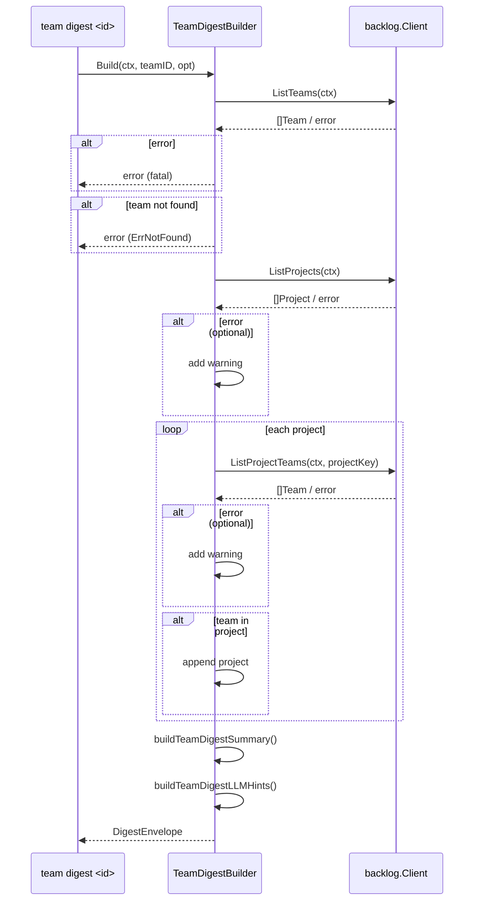
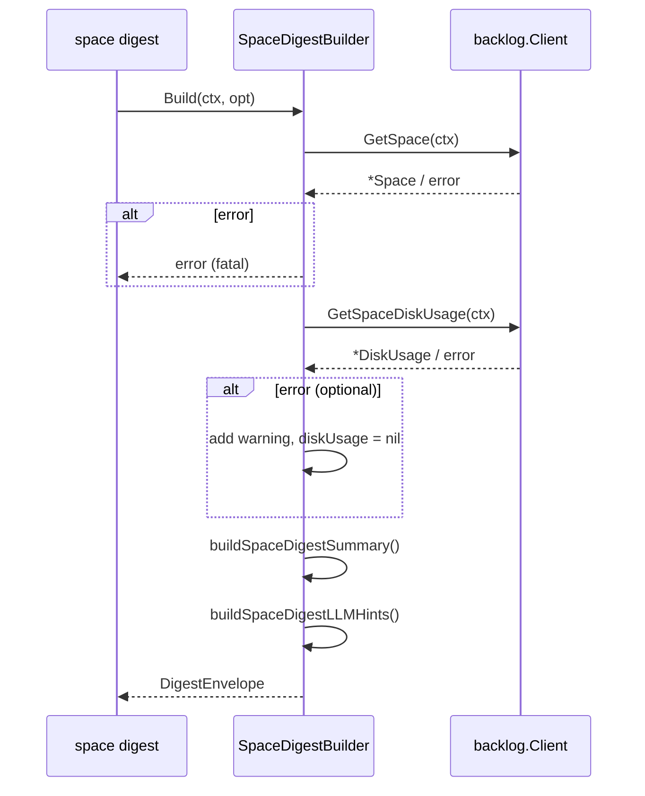

# M11: Team & space commands — 詳細実装計画

## Meta

| 項目 | 値 |
|------|---|
| マイルストーン | M11 |
| タイトル | Team & space commands |
| 前提 | M10 完了（コミット 8160121）|
| 作成日 | 2026-03-13 |
| ステータス | 実装中 |

---

## 対象 spec セクション

- §13.6 — TeamDigestBuilder（team / projects / summary / llm_hints）
- §13.7 — SpaceDigestBuilder（space / disk_usage / summary / llm_hints）
- §14.27 — `lv team list`
- §14.28 — `lv team project <project_key>`
- §14.29 — `lv team digest <team_id|name>`
- §14.30 — `lv space info`
- §14.31 — `lv space disk-usage`
- §14.32 — `lv space digest`

---

## 実装概要

### Team サブシステム

#### TeamDigestBuilder (spec §13.6)

`internal/digest/team.go` に実装する。

**Input:**
- `teamID int` — チーム ID（必須）

**Build() ロジック:**
1. `ListTeams(ctx)` でスペース全体のチーム一覧を取得し、`teamID` に一致するチームを検索
   - チームが見つからない場合は `ErrNotFound` を返す（必須）
2. `ListProjects(ctx)` で全プロジェクト一覧を取得し、各プロジェクトに対して `ListProjectTeams` を呼んでこのチームが属するプロジェクトを収集（オプション: 失敗は warning）
3. `TeamDigest` を構築し `DigestEnvelope` にラップする

**TeamDigest 構造体（spec §13.6）:**
```go
type TeamDigest struct {
    Team     DigestTeam           `json:"team"`
    Projects []domain.Project     `json:"projects"`
    Summary  TeamDigestSummary    `json:"summary"`
    LLMHints DigestLLMHints       `json:"llm_hints"`
}

type DigestTeam struct {
    ID   int    `json:"id"`
    Name string `json:"name"`
}

type TeamDigestSummary struct {
    Headline     string `json:"headline"`
    ProjectCount int    `json:"project_count"`
}
```

**partial success:** プロジェクト一覧の取得失敗・`ListProjectTeams` の失敗は warning として処理し、空 `[]domain.Project{}` を返す。

---

#### SpaceDigestBuilder (spec §13.7)

`internal/digest/space.go` に実装する。

**Build() ロジック:**
1. `GetSpace(ctx)` でスペース情報を取得（必須）
2. `GetSpaceDiskUsage(ctx)` でディスク使用量を取得（オプション: 失敗は warning）
3. `SpaceDigest` を構築し `DigestEnvelope` にラップする

**SpaceDigest 構造体（spec §13.7）:**
```go
type SpaceDigest struct {
    Space    DigestSpace          `json:"space"`
    DiskUsage *domain.DiskUsage   `json:"disk_usage,omitempty"`
    Summary  SpaceDigestSummary   `json:"summary"`
    LLMHints DigestLLMHints       `json:"llm_hints"`
}

type DigestSpace struct {
    SpaceKey           string `json:"space_key"`
    Name               string `json:"name"`
    OwnerID            int    `json:"owner_id"`
    Lang               string `json:"lang"`
    Timezone           string `json:"timezone"`
    TextFormattingRule string `json:"text_formatting_rule"`
}

type SpaceDigestSummary struct {
    Headline      string `json:"headline"`
    HasDiskUsage  bool   `json:"has_disk_usage"`
    CapacityBytes int64  `json:"capacity_bytes,omitempty"`
    UsedBytes     int64  `json:"used_bytes,omitempty"`
}
```

---

### CLI コマンド（内部実装は stub のまま）

`internal/cli/team.go` と `internal/cli/space.go` は現在 `ErrNotImplemented` を返す stub になっている。M11 では Digest コマンドを通じた `DigestBuilder` の連携実装はしない（CLI Run() に BacklogClient を統合するのは credential/config 完成後の別マイルストーンの予定）。

M11 でのスコープ:
- `TeamDigestCmd.TeamID` の型を確認・調整（現状 `int`、spec は `team_id|name` → `int` で十分）
- `cli/team.go` と `cli/space.go` は現状のまま（変更不要）

---

## TDD 設計

### Red → Green → Refactor サイクル

#### Phase R1: team_test.go を書く（失敗する）

**テストケース:**

| テスト名 | 内容 |
|---------|------|
| `TestTeamDigestBuilder_Build_success` | 正常系: チーム発見・プロジェクト取得成功 |
| `TestTeamDigestBuilder_Build_team_not_found` | `ListTeams` がチームを返さない → ErrNotFound |
| `TestTeamDigestBuilder_Build_teams_fetch_failed` | `ListTeams` 失敗 → error |
| `TestTeamDigestBuilder_Build_projects_fetch_failed` | `ListProjects` 失敗 → partial success（warning） |
| `TestTeamDigestBuilder_Build_project_teams_fetch_failed` | `ListProjectTeams` 失敗 → partial success（warning） |

#### Phase R2: space_test.go を書く（失敗する）

**テストケース:**

| テスト名 | 内容 |
|---------|------|
| `TestSpaceDigestBuilder_Build_success` | 正常系: スペース・ディスク使用量取得成功 |
| `TestSpaceDigestBuilder_Build_space_fetch_failed` | `GetSpace` 失敗 → error |
| `TestSpaceDigestBuilder_Build_disk_usage_fetch_failed` | `GetSpaceDiskUsage` 失敗 → partial success（warning） |

---

## 実装ステップ

### Step 1: internal/digest/team_test.go（Red）

`backlog.MockClient` を使い 5 テストケースを記述。
`TeamDigestBuilder`, `TeamDigest`, `DigestTeam`, `TeamDigestSummary` は未定義のため `go test` は失敗する。

### Step 2: internal/digest/team.go（Green）

- `TeamDigestOptions` struct（プレースホルダー）
- `TeamDigestBuilder` interface
- `DefaultTeamDigestBuilder` struct
- `NewDefaultTeamDigestBuilder` コンストラクタ
- `TeamDigest`, `DigestTeam`, `TeamDigestSummary` 構造体
- `Build()` 実装
- `buildTeamDigestSummary()` ヘルパー
- `buildTeamDigestLLMHints()` ヘルパー

全テストが green になるまで実装。

### Step 3: Refactor（team.go）

コードの整理・コメント追加。テストは引き続き green。

### Step 4: internal/digest/space_test.go（Red）

3 テストケースを記述。`SpaceDigestBuilder` 等未定義 → 失敗。

### Step 5: internal/digest/space.go（Green）

- `SpaceDigestOptions` struct
- `SpaceDigestBuilder` interface
- `DefaultSpaceDigestBuilder` struct
- `NewDefaultSpaceDigestBuilder` コンストラクタ
- `SpaceDigest`, `DigestSpace`, `SpaceDigestSummary` 構造体
- `Build()` 実装
- `buildSpaceDigestSummary()` ヘルパー
- `buildSpaceDigestLLMHints()` ヘルパー

全テストが green になるまで実装。

### Step 6: Refactor（space.go）

コードの整理・コメント追加。テストは引き続き green。

### Step 7: 全テスト確認

```bash
go test ./...
go vet ./...
go build ./cmd/lv/
```

### Step 8: コミット

```bash
git add internal/digest/team.go internal/digest/team_test.go \
        internal/digest/space.go internal/digest/space_test.go \
        plans/logvalet-m11-team-space.md
git commit -m "feat(team,space): M11 team/spaceコマンドとDigestBuilderを実装

Plan: plans/logvalet-m11-team-space.md"
```

---

## シーケンス図

### TeamDigestBuilder.Build()



### SpaceDigestBuilder.Build()



---

## リスク評価

| リスク | 発生確率 | 影響度 | 対策 |
|--------|---------|--------|------|
| `ListProjectTeams` の呼び出し数が多い | 中（プロジェクト数に比例） | 低（テストはモック） | 実装時はループ内で呼び出し。本番統合後にキャッシュ検討 |
| チーム名で検索する場合の曖昧性 | 低（M11 では int teamID のみ対応） | 低 | 将来 string name サポートは別タスク |
| DiskUsage が `nil` の場合の JSON 出力 | 低 | 低 | `omitempty` タグで対応 |

---

## 完了基準

- [ ] `internal/digest/team.go` — 実装完了
- [ ] `internal/digest/team_test.go` — 5テストケース全パス
- [ ] `internal/digest/space.go` — 実装完了
- [ ] `internal/digest/space_test.go` — 3テストケース全パス
- [ ] `go test ./...` — 全テストパス
- [ ] `go build ./cmd/lv/` — ビルド成功
- [ ] `go vet ./...` — クリーン
- [ ] コミット完了
