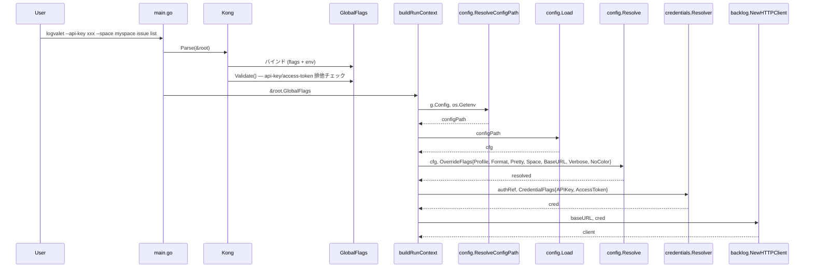

# M13: GlobalFlags 完全実装 — 詳細計画

## 概要

spec §4 / §17.1 で定義された GlobalFlags のうち、現在 `internal/cli/global_flags.go` に欠落している 6 つのフラグを追加し、`buildRunContext()` がそれらを正しく `config.OverrideFlags` および `credentials.CredentialFlags` に渡すようにする。

## 現状分析

### 実装済みフラグ (4/10)
| フラグ | 短縮 | 環境変数 | 状態 |
|--------|------|----------|------|
| `--format` | `-f` | `LOGVALET_FORMAT` | 実装済み |
| `--pretty` | — | `LOGVALET_PRETTY` | 実装済み |
| `--profile` | `-p` | `LOGVALET_PROFILE` | 実装済み |
| `--verbose` | `-v` | `LOGVALET_VERBOSE` | 実装済み |

### 欠落フラグ (6/10)
| フラグ | 短縮 | 環境変数 | 種別 |
|--------|------|----------|------|
| `--api-key` | — | `LOGVALET_API_KEY` | 認証 |
| `--access-token` | — | `LOGVALET_ACCESS_TOKEN` | 認証 |
| `--base-url` | — | `LOGVALET_BASE_URL` | 設定 |
| `--space` | `-s` | `LOGVALET_SPACE` | 設定 |
| `--config` | `-c` | `LOGVALET_CONFIG` | 設定 |
| `--no-color` | — | `LOGVALET_NO_COLOR` | 表示 |

### buildRunContext の現状の問題
1. `configPath` が `config.DefaultConfigPath()` 固定 — `--config` / `LOGVALET_CONFIG` を無視
2. `config.OverrideFlags` に `Space`, `BaseURL`, `NoColor`, `ConfigPath`, `Pretty`, `Verbose` を渡していない
3. `credentials.CredentialFlags{}` が空 — `--api-key` / `--access-token` を渡していない
4. `--api-key` と `--access-token` の排他バリデーションが未実装 (spec §17 Validation rules)

## TDD 設計

### Red Phase: 失敗するテストを先に書く

#### テスト 1: GlobalFlags の新フラグが Kong でパース可能
- ファイル: `internal/cli/global_flags_test.go`
- `--api-key`, `--access-token`, `--base-url`, `--space`, `--config`, `--no-color` を CLI 引数で渡し、struct にバインドされることを確認
- 各環境変数 (`LOGVALET_API_KEY` 等) でも設定可能であることを確認
- ショートフラグ (`-s`, `-c`) のテスト

#### テスト 2: --api-key と --access-token の排他バリデーション
- ファイル: `internal/cli/global_flags_test.go`
- 両方指定時に `Validate()` がエラーを返すことを確認

### Green Phase: テストを通す最小限の実装

#### Step 1: GlobalFlags に 6 フラグを追加
```go
type GlobalFlags struct {
    // ... 既存フラグ ...
    APIKey      string `help:"API キーを直接指定する" env:"LOGVALET_API_KEY"`
    AccessToken string `help:"アクセストークンを直接指定する" env:"LOGVALET_ACCESS_TOKEN"`
    BaseURL     string `help:"Backlog ベース URL を直接指定する" env:"LOGVALET_BASE_URL"`
    Space       string `short:"s" help:"Backlog スペース名を直接指定する" env:"LOGVALET_SPACE"`
    Config      string `short:"c" help:"設定ファイルパスを指定する" type:"path" env:"LOGVALET_CONFIG"`
    NoColor     bool   `help:"カラー出力を無効にする" env:"LOGVALET_NO_COLOR"`
}
```

#### Step 2: Validate メソッドを追加
```go
func (g *GlobalFlags) Validate() error {
    if g.APIKey != "" && g.AccessToken != "" {
        return fmt.Errorf("--api-key と --access-token は同時に指定できません")
    }
    return nil
}
```

#### Step 3: buildRunContext を修正
- `configPath` を `config.ResolveConfigPath(g.Config, os.Getenv)` で決定
- `config.OverrideFlags` に全フィールドを渡す:
  - `Profile`, `Format` (既存)
  - `Space`, `BaseURL`, `ConfigPath` (新規)
  - `Pretty`, `Verbose`, `NoColor` は bool → `*bool` 変換が必要
- `credentials.CredentialFlags` に `APIKey`, `AccessToken` を渡す

#### bool → *bool 変換方針
Kong の bool フラグは未指定=false、指定=true で、「未指定」と「明示的 false」を区別できない。
しかし config.OverrideFlags の `*bool` は「nil=未指定、非nil=明示指定」を意味する。

**方針**: GlobalFlags の `Pretty`, `Verbose`, `NoColor` は bool のまま保持し、
buildRunContext 内で常に `*bool` に変換して OverrideFlags に渡す。
これにより Kong で `--pretty` が指定されなくても `false` が OverrideFlags に渡されるが、
config.Resolve は env > config > default の順でフォールバックするため、
CLI フラグの false は「CLI が明示的に false を指定した」と同じ扱いになる。

**影響**: 環境変数 `LOGVALET_PRETTY=true` を設定しても、CLI フラグの false が勝つ。
ただし Kong 自体が `env:"LOGVALET_PRETTY"` タグで環境変数を処理するため、
環境変数が設定されていれば Kong が GlobalFlags.Pretty を true にセットする。
つまり Kong の env 処理 → OverrideFlags → config.Resolve の順になり、問題なし。

### Refactor Phase
- 重複排除、命名統一
- `boolPtr()` ヘルパー関数

## 実装ステップ（詳細）

### Step 1: テスト追加（Red）
1. `internal/cli/global_flags_test.go` に新フラグのパーステストを追加
2. `Validate()` のテストを追加

### Step 2: GlobalFlags struct 更新 + Validate（Green）
1. `internal/cli/global_flags.go` に 6 フラグと `Validate()` を追加

### Step 3: runner.go の修正（Green）
1. `config.ResolveConfigPath()` を使用
2. `OverrideFlags` に全フィールドを渡す（`boolPtr()` ヘルパー使用）
3. `CredentialFlags` に APIKey/AccessToken を渡す

### Step 4: テスト green 確認 & リファクタリング
1. `go test ./...` 全 green
2. `go vet ./...` クリーン
3. コード整理

## シーケンス図



## リスク評価

| リスク | 影響度 | 確率 | 対策 |
|--------|--------|------|------|
| `--api-key` と `--access-token` 同時指定 | 中 | 低 | `GlobalFlags.Validate()` で排他チェック。Kong が自動で呼び出す |
| `--no-color` の bool → *bool 変換 | 低 | 低 | Kong が env タグも処理するため、bool のまま `boolPtr()` で変換して問題なし |
| 既存テストの破壊 | 低 | 低 | GlobalFlags にフィールド追加のみ。既存フィールドは変更しない |
| `--config` の type:"path" タグ | 低 | 低 | Kong の `type:"path"` は補完ヒントのみ。存在チェックは行わない |

## AI レビュー記録

### Devil's Advocate 批評 (Phase 3.1)
1. --api-key/--access-token の排他制御が欠如 → **修正: Validate() メソッドを追加**
2. buildRunContextWith() の DI リファクタリングは過剰 → **修正: DI リファクタは取りやめ**
3. type:"path" の挙動が未検証 → **問題なし（補完ヒントのみ）**
4. bool → *bool 変換方針が不明 → **修正: 方針を明記**
5. Pretty/Verbose の OverrideFlags 伝播が既存バグ → **修正: M13 で修正**

### Advocate 判定 (Phase 3.2)
**APPROVED** — 上記修正を反映済み

## 完了条件

- [ ] 6 フラグが GlobalFlags struct に追加されている
- [ ] 各フラグが対応する環境変数でオーバーライド可能
- [ ] `--api-key` と `--access-token` の排他バリデーション実装
- [ ] `buildRunContext()` が全フラグを正しく OverrideFlags/CredentialFlags に伝播する
- [ ] Pretty/Verbose の既存バグ修正
- [ ] `go test ./...` が全 green
- [ ] `go vet ./...` がクリーン
