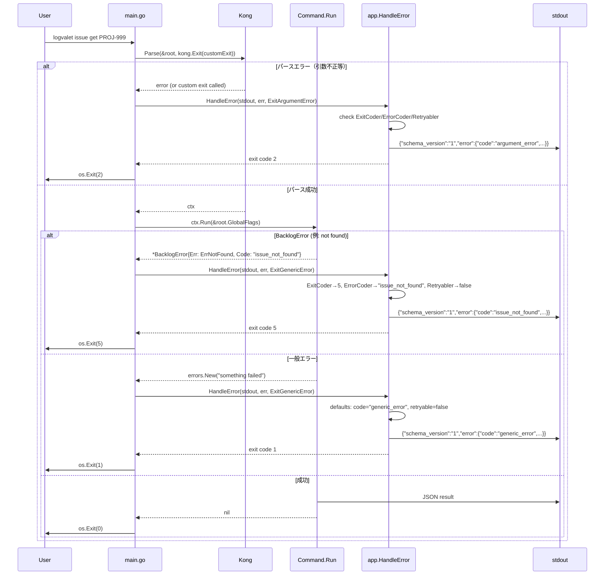

# M14: JSON エラーエンベロープ (§9) — 詳細計画

## 概要

spec §9 に定義された JSON エラーエンベロープを CLI 全体に統合する。
エラー発生時に stderr のテキストメッセージではなく、stdout に構造化 JSON エラーエンベロープを出力し、適切な exit code で終了する。

## 現状分析

### 既に存在するもの
- `internal/domain/domain.go`: `ErrorEnvelope`, `ErrorDetail`, `Warning` 型が定義済み
- `internal/backlog/errors.go`: `BacklogError`, sentinel errors, `ExitCodeFor()` が定義済み
- `internal/app/exitcode.go`: 全 exit code 定数が定義済み

### 不足しているもの
- `cmd/logvalet/main.go` がエラーを stderr にテキスト出力しているだけ（JSON エンベロープ未使用）
- エラーから `ErrorEnvelope` を構築するヘルパーがない
- エラーコード文字列（`"issue_not_found"` 等）のマッピングがない
- Kong パースエラー（引数不正等）の JSON エンベロープ対応がない

### 重要な制約: 循環参照の回避
- `internal/backlog/errors.go` は `internal/app` を import している
- したがって `internal/app` から `internal/backlog` を import **できない**
- 解決策: **`internal/app` パッケージでは backlog sentinel errors を直接参照しない**
  - `ErrorEnvelopeFromError` は `interface{ ExitCode() int; ErrorCode() string; Retryable() bool }` のようなインターフェースで判定する
  - または `backlog.ExitCodeFor()` を呼び出す側（`cmd/logvalet/main.go`）で exit code を決定し、`app.HandleError` に渡す

## スペック要件 (§9)

```json
{
  "schema_version": "1",
  "error": {
    "code": "issue_not_found",
    "message": "Issue PROJ-999 was not found.",
    "retryable": false
  }
}
```

## 設計: 循環参照を避けるアーキテクチャ

### 方針: app パッケージにインターフェースを定義し、backlog パッケージが実装する

```
cmd/logvalet/main.go
  ├── import internal/app      (ErrorEnvelope, HandleError, ExitCoder interface)
  └── import internal/backlog  (BacklogError は app.ExitCoder を実装)

internal/app/
  ├── exitcode.go           (既存: exit code 定数)
  ├── error_envelope.go     (新規: ExitCoder interface + HandleError + NewErrorEnvelope)
  └── error_envelope_test.go

internal/backlog/errors.go
  └── import internal/app   (既存: ExitCodeFor が app.Exit* を使用)
  └── BacklogError は app.ExitCoder interface を暗黙的に実装
```

### `app.ExitCoder` インターフェース

```go
// ExitCoder は exit code を返せるエラーを表す。
type ExitCoder interface {
    error
    ExitCode() int
}

// ErrorCoder はエラーコード文字列を返せるエラーを表す。
type ErrorCoder interface {
    ErrorCode() string
}

// Retryabler は retryable フラグを返せるエラーを表す。
type Retryabler interface {
    Retryable() bool
}
```

### BacklogError への追加メソッド

```go
// ExitCode は BacklogError に対応する exit code を返す。
func (e *BacklogError) ExitCode() int { return ExitCodeFor(e) }

// ErrorCode はエラーコード文字列を返す。
func (e *BacklogError) ErrorCode() string { return e.Code }

// Retryable はリトライ可能かを返す。
func (e *BacklogError) Retryable() bool {
    return errors.Is(e.Err, ErrRateLimited) || errors.Is(e.Err, ErrAPI)
}
```

## TDD 設計

### Red Phase（失敗するテストを先に書く）

#### テスト 1: `internal/app/error_envelope_test.go`
- `NewErrorEnvelope(code, message, retryable)` が正しい JSON 構造を返すこと
- `HandleError(w, err, ExitGenericError)` が stdout に JSON エンベロープを出力すること
- `HandleError` が ExitCoder 実装エラーから正しい exit code を抽出すること
- `HandleError` が ErrorCoder 実装エラーから正しい code を抽出すること
- `HandleError` が Retryabler 実装エラーから正しい retryable を抽出すること
- `HandleError` が一般エラーで `generic_error` を使うこと
- 出力が valid JSON であること
- `schema_version` が `"1"` であること

#### テスト 2: `internal/backlog/errors_test.go`（追加）
- `BacklogError.ExitCode()` が正しい exit code を返すこと
- `BacklogError.ErrorCode()` が Code フィールドの値を返すこと
- `BacklogError.Retryable()` が ErrRateLimited/ErrAPI で true を返すこと

### Green Phase（テストを通す最小実装）

#### Step 1: `internal/app/error_envelope.go`
```go
// ExitCoder は exit code を持つエラー用インターフェース。
type ExitCoder interface { error; ExitCode() int }

// ErrorCoder はエラーコード文字列を持つエラー用インターフェース。
type ErrorCoder interface { ErrorCode() string }

// Retryabler は retryable フラグを持つエラー用インターフェース。
type Retryabler interface { Retryable() bool }

// NewErrorEnvelope はエラーエンベロープを構築する。
func NewErrorEnvelope(code, message string, retryable bool) *domain.ErrorEnvelope

// HandleError は err を JSON エンベロープとして w に出力し、exit code を返す。
// defaultExitCode は ExitCoder を実装しないエラーに使うデフォルト値。
func HandleError(w io.Writer, err error, defaultExitCode int) int
```

#### Step 2: `internal/backlog/errors.go` — BacklogError にメソッド追加
```go
func (e *BacklogError) ExitCode() int
func (e *BacklogError) ErrorCode() string
func (e *BacklogError) Retryable() bool
```

#### Step 3: `cmd/logvalet/main.go` — 統合
- Kong パースエラー: `kong.Exit()` でカスタム exit handler を設定し、JSON エンベロープを出力
- `ctx.Run()` エラー: `app.HandleError(os.Stdout, err, app.ExitGenericError)` を呼ぶ

### Refactor Phase
- エラーコードのデフォルト値（`generic_error`）を定数化
- exit code → error code 文字列のマッピングテーブルを追加

## 実装ステップ

### Step 1: テストファイル作成（Red）
1. `internal/app/error_envelope_test.go` — 全テストケース
2. `internal/backlog/errors_test.go` — 追加テストケース

### Step 2: app パッケージ実装（Green）
1. `internal/app/error_envelope.go` — インターフェース + NewErrorEnvelope + HandleError

### Step 3: backlog パッケージ拡張（Green）
1. `internal/backlog/errors.go` — BacklogError にメソッド追加

### Step 4: main.go 統合
1. `cmd/logvalet/main.go` 修正:
   - `kong.Exit()` でカスタム exit handler を設定
   - エラー時に `app.HandleError` を呼ぶ
   - 成功時は `os.Exit(0)`

### Step 5: Refactor & テスト確認
1. `go test ./...` 全テスト green
2. エッジケーステスト追加
3. exit code → error code マッピングの定数化

## Mermaid シーケンス図



## エラーコードマッピング表

| 判定方法 | error code 文字列 | exit code | retryable |
|---|---|---|---|
| ErrorCoder.ErrorCode() が非空 | その値をそのまま使用 | ExitCoder.ExitCode() | Retryabler.Retryable() |
| exit code == ExitNotFoundError (5) | `not_found` | 5 | false |
| exit code == ExitAuthenticationError (3) | `unauthorized` | 3 | false |
| exit code == ExitPermissionError (4) | `forbidden` | 4 | false |
| exit code == ExitArgumentError (2) | `argument_error` | 2 | false |
| exit code == ExitAPIError (6) | `api_error` | 6 | true |
| exit code == ExitConfigError (10) | `config_error` | 10 | false |
| exit code == ExitDigestError (7) | `digest_error` | 7 | false |
| デフォルト | `generic_error` | 1 | false |

**exit code からの code 文字列マッピング**: ExitCoder は実装しているが ErrorCoder を実装しないエラー用。

## Kong パースエラーの対応

### 問題
- `kong.UsageOnError()` が設定されており、パースエラー時に usage を stderr に出力後 `os.Exit(1)` を呼ぶ
- `kong.Exit()` でカスタム exit handler を渡せる

### 対策
- `kong.Exit(func(code int) { ... })` を設定し、パースエラー時に JSON エンベロープを出力してから exit
- または `kong.UsageOnError()` を外し、エラーを `kong.Parse` の戻り値で受け取って処理

### 採用案: kong.Parse のエラーを直接ハンドリング

```go
ctx, err := kong.Parse(...)  // ← 現在は戻り値を受け取っていない
if err != nil {
    // パースエラー → JSON エンベロープを stdout に出力
    exitCode := app.HandleError(os.Stdout, err, app.ExitArgumentError)
    os.Exit(exitCode)
}
```

**注意**: 現在の main.go は `ctx := kong.Parse(...)` でエラーを無視している。Kong のデフォルト動作は、パースエラー時に usage を stderr に表示して `os.Exit(1)` する。JSON エンベロープ対応には `kong.NoDefaultHelp()` + `kong.Exit(func(int){})` の組み合わせ、またはパースロジックの変更が必要。

**最終採用案**: `kong.Exit()` でパニックを使った recovery パターンではなく、Kong のエラーハンドリングオプションを調整する。

```go
parser, err := kong.New(&root, ...)
if err != nil { ... }
ctx, err := parser.Parse(os.Args[1:])
if err != nil {
    parser.FatalIfErrorf(err) // stderr に出力（usage含む）
    // ↑ これだと os.Exit してしまう
}
```

**実用的な採用案**: `kong.Exit()` に `panic` するカスタム関数を渡し、`recover` でキャッチして JSON エンベロープを出力する。

```go
var parseErr error
kong.Parse(&root,
    kong.Exit(func(code int) {
        // パースエラー時に panic で制御フローを脱出
        panic(kongExitError{code: code})
    }),
    ...
)
```

**最もシンプルな案（採用）**: `kong.New` + `parser.Parse` に分離し、エラーを直接受け取る。

```go
parser, err := kong.New(&root, ...)
if err != nil { /* 致命的 */ }
ctx, err := parser.Parse(os.Args[1:])
if err != nil {
    // usage を stderr に出力
    parser.Errorf("%s", err)
    // JSON エンベロープを stdout に出力
    exitCode := app.HandleError(os.Stdout, err, app.ExitArgumentError)
    os.Exit(exitCode)
}
```

## ファイル変更一覧

| ファイル | 操作 | 内容 |
|---|---|---|
| `internal/app/error_envelope.go` | 新規 | ExitCoder/ErrorCoder/Retryabler interface, NewErrorEnvelope, HandleError, ExitCodeToErrorCode |
| `internal/app/error_envelope_test.go` | 新規 | テスト |
| `internal/backlog/errors.go` | 変更 | BacklogError に ExitCode(), ErrorCode(), Retryable() メソッド追加 |
| `internal/backlog/errors_test.go` | 変更 | 追加メソッドのテスト |
| `cmd/logvalet/main.go` | 変更 | kong.New + parser.Parse に分離、HandleError 呼び出し |

## リスク評価

| リスク | 影響 | 対策 |
|---|---|---|
| 循環参照 (app ↔ backlog) | 致命的 | interface を app に定義、backlog が暗黙実装。app から backlog を import しない |
| Kong パースエラーのハンドリング | 中 | kong.New + parser.Parse 分離で error を直接受け取る |
| kong.UsageOnError の副作用 | 中 | usage 出力は stderr のまま維持。JSON エンベロープは stdout |
| --format が json 以外の場合のエラー出力形式 | 中 | エラーエンベロープは常に JSON（spec §9）。format フラグに関わらず JSON で出力 |
| 既存テストの破損 | 低 | 各コマンドの Run() 返り値は変わらない。main.go のみ変更 |
| BacklogError.Code が空の場合 | 低 | exit code → error code マッピングテーブルでフォールバック |

## 設計判断

1. **エラーエンベロープは常に JSON**: `--format yaml` でもエラーは JSON で出力。spec §9 がそう定義している
2. **HandleError は io.Writer を受け取る**: テスタビリティのため
3. **interface ベースの設計で循環参照を回避**: app パッケージに ExitCoder/ErrorCoder/Retryabler を定義
4. **BacklogError.Code を優先**: API が返す具体的なエラーコード（例: `"issue_not_found"`）をそのまま使用
5. **exit code → error code のフォールバックテーブル**: ErrorCoder 未実装時の救済
6. **kong.New + parser.Parse 分離**: パースエラーを直接受け取れるようにする
