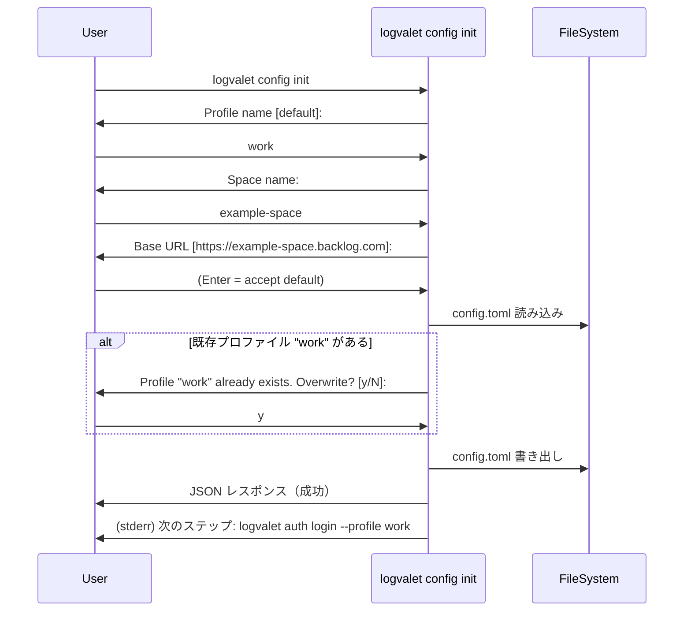

# M15: logvalet config init コマンド（対話型セットアップ）

## 概要

`logvalet config init` コマンドを実装し、`aws configure` 相当の対話型セットアップを提供する。
`logvalet configure` をトップレベルエイリアスとして追加する。

## 要件

1. **ConfigInitCmd**: 対話プロンプトで profile 名、space 名、base_url を入力
2. `~/.config/logvalet/config.toml` を生成・追記
3. 既存プロファイルがある場合は上書き確認（対話モード時のみ）
4. `logvalet configure` をトップレベルエイリアスとして追加
5. `auth login` との連携導線（config init 完了後に auth login を案内）
6. `internal/config/writer.go`: config.toml の書き出しロジック

## 設計

### コマンドツリー変更

```text
logvalet
├── config
│   └── init       ← 新規
├── configure      ← 新規（config init のエイリアス、Kong embedding）
├── auth
│   ├── login
│   ...
```

### 対話フロー



### 入力フィールド

| フィールド | プロンプト | デフォルト値 | 必須 | バリデーション |
|-----------|-----------|-------------|------|--------------|
| profile | `Profile name` | `"default"` | Yes | 空不可 |
| space | `Space name` | なし | Yes | 空不可 |
| base_url | `Base URL` | `https://{space}.backlog.com` | Yes | 空の場合はspaceから自動生成 |

### 自動設定フィールド

| フィールド | 条件 | 値 |
|-----------|------|-----|
| `auth_ref` | 常に自動設定 | プロファイル名と同じ値 |
| `default_profile` | `config.default_profile` が空の場合のみ | 入力したプロファイル名 |
| `version` | `config.version` が 0 の場合のみ | `1` |

### 非対話モード

フラグで値を直接指定可能（CI/自動化用）:

```
logvalet config init --profile work --space example-space --base-url https://example-space.backlog.com
```

**非対話モードの判定**: `--profile` と `--space` の両方がフラグで指定された場合、対話プロンプトをスキップする。

**非対話モードでの上書き動作**: 既存プロファイルがあっても確認なしに上書きする（CI/自動化の利便性のため）。

### 出力

#### stdout (JSON)

```json
{
  "schema_version": "1",
  "result": "ok",
  "profile": "work",
  "space": "example-space",
  "base_url": "https://example-space.backlog.com",
  "config_path": "~/.config/logvalet/config.toml",
  "created": true
}
```

`created` は新規プロファイル作成時に `true`、既存上書き時に `false`。

#### stderr

```
設定を保存しました: ~/.config/logvalet/config.toml
次のステップ: logvalet auth login --profile work
```

## アーキテクチャ

### 新規ファイル

1. `internal/config/writer.go` - config.toml の書き出しロジック
2. `internal/config/writer_test.go` - writer のテスト
3. `internal/cli/config_cmd.go` - ConfigCmd / ConfigInitCmd / ConfigureCmd の定義と実行
4. `internal/cli/config_cmd_test.go` - ConfigInitCmd のテスト

### 変更ファイル

1. `internal/cli/root.go` - Config / Configure コマンド登録

### internal/config/writer.go

```go
// Writer は config.toml の書き出しを担当する。
type Writer interface {
    Write(path string, cfg *Config) error
}
```

- 渡された `*Config` をそのまま TOML として書き出す（呼び出し側がマージ済みの Config を渡す）
- ディレクトリが存在しない場合は作成（0700）
- ファイルパーミッション 0600
- TOML エンコード（BurntSushi/toml）

### internal/cli/config_cmd.go

```go
// ConfigCmd は config サブコマンド群。
type ConfigCmd struct {
    Init ConfigInitCmd `cmd:"" help:"対話型で設定を初期化する"`
}

// ConfigureCmd は config init のトップレベルエイリアス。
// Kong では型エイリアスではなく、embedding で実現する。
type ConfigureCmd struct {
    ConfigInitCmd `cmd:""`
}

// ConfigInitCmd は config init コマンド。
type ConfigInitCmd struct {
    ProfileName string `help:"プロファイル名" name:"profile" default:"default"`
    Space       string `help:"Backlog スペース名"`
    BaseURL     string `help:"Backlog ベース URL" name:"base-url"`
}
```

**注意**: `ConfigInitCmd.ProfileName` は GlobalFlags.Profile との衝突を避けるためフィールド名を変えるが、Kong の `name` タグで `--profile` にマッピングする。ただし GlobalFlags.Profile と衝突する場合は `--init-profile` や別名に変更する可能性あり。実装時に Kong の挙動を確認して決定する。

### 対話入力の抽象化

テスタビリティのため、`Prompter` interface で抽象化:

```go
type Prompter interface {
    Prompt(label string, defaultValue string) (string, error)
    Confirm(label string, defaultYes bool) (bool, error)
}

// stdinPrompter は os.Stdin / os.Stderr を使った実装。
type stdinPrompter struct {
    reader io.Reader
    writer io.Writer
}
```

- 実プロンプター: `os.Stdin` から読み取り、`os.Stderr` にプロンプト出力（stdout は機械可読出力のみ）
- テスト用: `strings.Reader` ベースのモック Prompter

### auth_ref の自動設定

`auth_ref` はプロファイル名と同じ値を自動的に設定する。これにより `auth login --profile work` で保存された認証情報が `config init` で作成したプロファイルと自動的に紐付く。

```go
profileCfg := config.ProfileConfig{
    Space:   space,
    BaseURL: baseURL,
    AuthRef: profileName,  // プロファイル名と同じ
}
```

## TDD 設計

### Phase 1: Red - config/writer のテスト

1. `TestWriter_WriteNewFile` - 新規ファイル作成。正しい TOML が出力される
2. `TestWriter_WriteExistingFile` - 既存ファイルの上書き
3. `TestWriter_CreateDirectory` - ディレクトリ自動作成
4. `TestWriter_FilePermissions` - パーミッション確認（0600）

### Phase 2: Green - config/writer 実装

- `config.Writer` interface + `defaultWriter` 実装
- `Write(path, cfg)` メソッド

### Phase 3: Red - cli/config_cmd のテスト

5. `TestConfigInit_AllFlags_NewProfile` - 全フラグ指定、新規プロファイル（非対話）
6. `TestConfigInit_AllFlags_ExistingProfile` - 全フラグ指定、既存プロファイル上書き（非対話、確認なし）
7. `TestConfigInit_Interactive` - 対話入力モック
8. `TestConfigInit_Interactive_ExistingProfile_OverwriteYes` - 対話、上書き確認 Yes
9. `TestConfigInit_Interactive_ExistingProfile_OverwriteNo` - 対話、上書き確認 No（中断）
10. `TestConfigInit_DefaultBaseURL` - space からの base_url 自動生成
11. `TestConfigInit_AuthRef_AutoSet` - auth_ref がプロファイル名と同じ値で設定される
12. `TestConfigInit_DefaultProfile_AutoSet` - default_profile が空の場合のみ自動設定
13. `TestConfigInit_OutputJSON` - stdout JSON レスポンス形式確認
14. `TestConfigInit_StderrGuidance` - stderr にauth login 案内が出る

### Phase 4: Green - cli/config_cmd 実装

- `ConfigInitCmd.Run()` (GlobalFlags 引数)
- `ConfigInitCmd.RunWithDeps()` (テスト用DI: Prompter, Writer, configPath)
- `Prompter` interface + `stdinPrompter` 実装

### Phase 5: Red - root.go 変更テスト

15. `TestCLI_ConfigInitParse` - Kong パース: `config init --profile x --space y`
16. `TestCLI_ConfigureParse` - Kong パース: `configure --profile x --space y`

### Phase 6: Green - root.go 変更

- CLI struct に `Config ConfigCmd` と `Configure ConfigureCmd` を追加

### Phase 7: Refactor

- コード整理、コメント追加
- `go vet ./...` パス確認

## 実装ステップ

1. `internal/config/writer_test.go` を作成（Red）
2. `internal/config/writer.go` を実装（Green）
3. リファクタ: writer のコード整理
4. `internal/cli/config_cmd_test.go` を作成（Red）
5. `internal/cli/config_cmd.go` を実装（Green）
6. `internal/cli/root.go` を更新（Config + Configure コマンド追加）
7. `go test ./...` で全テスト green 確認
8. `go vet ./...` パス確認
9. Refactor: 全体コード整理

## リスク評価

| リスク | 影響度 | 対策 |
|--------|--------|------|
| TOML 書き出し時のコメント消失 | 低 | logvalet が生成した config のみ対象。ユーザーコメントは非保証 |
| 対話プロンプトのテスト困難 | 中 | Prompter interface で抽象化。テストではモック使用 |
| Kong での configure エイリアス | 中 | 型エイリアスは不可。ConfigureCmd に ConfigInitCmd を embedding して対応。実装時に Kong の挙動を検証 |
| 既存 config.toml の破損 | 高 | 既存ファイルを Load → マージ → Write。テストで既存ファイル→マージ→出力を検証 |
| GlobalFlags.Profile との衝突 | 中 | ConfigInitCmd では独自の `ProfileName` フィールドを使用。Kong の name タグで調整。実装時に検証 |
| auth_ref の不整合 | 中 | auth_ref はプロファイル名と同じ値を自動設定。auth login と一貫性を保つ |

## 依存関係

- `github.com/BurntSushi/toml`（既に go.mod にある）
- `internal/config` パッケージ（既存の Config/ProfileConfig 構造体を流用）

## 弁証法レビュー記録

### 第1回批評 (devils-advocate)
1. TTY判定の欠如 → 対応: 非対話モードの判定条件を明確化（--profile + --space 指定時）
2. TOML フィールド順序変更 → 対応不要（logvalet が生成するファイル）
3. **型エイリアスが Kong で動作しない** → 対応: embedding 方式に変更
4. default_profile の自動設定条件が曖昧 → 対応: 「default_profile が空の場合のみ」と明確化
5. **非対話モードの上書き動作不明** → 対応: 非対話モードでは確認なし上書きと明記
6. **auth_ref の生成ロジック欠如** → 対応: プロファイル名と同じ値を自動設定と追記

### advocate 判定
- 第1回: REJECTED → 批評 3, 5, 6 を反映して修正
- 第2回: APPROVED

## 完了基準

- [ ] `logvalet config init` が対話的にプロファイルを作成できる
- [ ] フラグ指定で非対話モードが動作する
- [ ] 対話モードで既存プロファイルの上書き確認が機能する
- [ ] 非対話モードで既存プロファイルを確認なし上書きする
- [ ] `logvalet configure` がエイリアスとして動作する
- [ ] auth_ref がプロファイル名と同じ値で自動設定される
- [ ] default_profile が空の場合のみ自動設定される
- [ ] config.toml が正しい TOML 形式で書き出される
- [ ] stderr に次のステップ（auth login）が案内される
- [ ] 全テストが green
- [ ] `go vet ./...` パス
