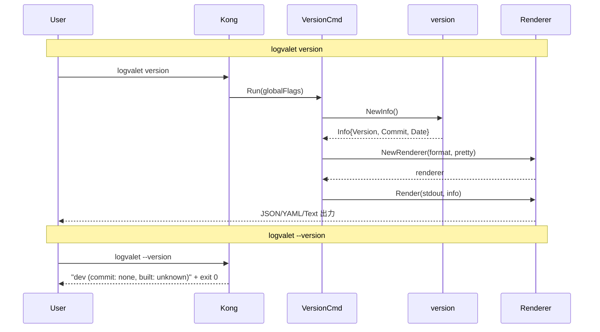

# M16: `logvalet version` コマンド — 詳細計画

## Meta
| 項目 | 値 |
|------|---|
| マイルストーン | M16 |
| 目標 | `logvalet version` サブコマンドと `--version` グローバルフラグの実装 |
| 前提 | internal/version パッケージ (Version/Commit/Date + String()) が既存 |
| スペック参照 | §23 Version Metadata |
| 作成日 | 2026-03-18 |
| レビュー | 弁証法レビュー済み（名前衝突・DI・text出力の指摘を反映） |

## 要件

### R1: `logvalet version` サブコマンド
- JSON 出力（デフォルト）: `{"version":"dev","commit":"none","date":"unknown"}`
- テキスト出力: text レンダラーは compact JSON を出力する仕様のため、全フォーマットで構造化出力
- YAML/Markdown 出力も GlobalFlags.Format に応じて対応
- 認証不要（buildRunContext を呼ばない）
- exit code 0

### R2: `logvalet --version` グローバルフラグ
- Kong の `VersionFlag` 型を活用
- テキスト形式で `version.String()` を出力して exit 0

## アーキテクチャ

### 変更対象ファイル

| ファイル | 変更内容 |
|---------|---------|
| `internal/cli/version_cmd.go` | 新規: VersionCmd struct + Run メソッド（io.Writer DI 対応） |
| `internal/cli/version_cmd_test.go` | 新規: VersionCmd のテスト |
| `internal/cli/root.go` | CLI struct に `VersionInfo VersionCmd` フィールド追加（名前衝突回避） |
| `internal/cli/global_flags.go` | VersionFlag フィールド追加 |
| `internal/cli/global_flags_test.go` | --version フラグのテスト追加 |
| `internal/version/version.go` | Info struct 追加（JSON シリアライズ用） |
| `internal/version/version_test.go` | Info テスト追加 |

### 設計判断

1. **VersionCmd は認証不要**: `Run(*GlobalFlags)` シグネチャで、buildRunContext を呼ばず直接 render する
2. **Info struct**: JSON タグ付きの構造体を version パッケージに追加し、JSON/YAML 出力に対応
3. **Kong VersionFlag**: GlobalFlags に `VersionFlag kong.VersionFlag` を追加。Kong が自動的にバージョン文字列を出力して exit する
4. **レンダラー直接生成**: version コマンド内で `render.NewRenderer()` を呼び、GlobalFlags.Format と GlobalFlags.Pretty を使用
5. **名前衝突回避**: CLI struct のフィールド名は `VersionInfo VersionCmd` とし、Kong の `cmd:"version"` タグでコマンド名を `version` に固定。これにより GlobalFlags の embedded `Version string` (kong:"-") との衝突を回避
6. **io.Writer DI**: VersionCmd に `Stdout io.Writer` フィールドを持たせ、nil の場合は os.Stdout にフォールバック。テストで bytes.Buffer を注入可能
7. **text 出力**: text レンダラーは compact JSON を出力する仕様（render/text.go 確認済み）。version コマンドでも同様に振る舞う。特別なテキスト出力が必要な場合は `--version` フラグを使う

## シーケンス図



## TDD 設計 (Red → Green → Refactor)

### Step 1: version.Info struct (Red → Green → Refactor)

**Red**: `internal/version/version_test.go` に Info テストを追加
- `TestNewInfo`: NewInfo() が現在の Version/Commit/Date を反映した Info を返す
- `TestInfo_JSON`: JSON マーシャルで `{"version":"dev","commit":"none","date":"unknown"}` が得られる

**Green**: `internal/version/version.go` に Info struct + NewInfo() を追加
```go
type Info struct {
    Version string `json:"version" yaml:"version"`
    Commit  string `json:"commit"  yaml:"commit"`
    Date    string `json:"date"    yaml:"date"`
}

func NewInfo() Info {
    return Info{Version: Version, Commit: Commit, Date: Date}
}
```

**Refactor**: なし（シンプルで十分）

### Step 2: VersionCmd (Red → Green → Refactor)

**Red**: `internal/cli/version_cmd_test.go` にテストを追加
- `TestVersionCmd_JSON`: デフォルト JSON 出力で version/commit/date キーが存在
- `TestVersionCmd_PrettyJSON`: --pretty で整形 JSON
- `TestVersionCmd_YAML`: --format=yaml で YAML 出力
- `TestVersionCmd_NoAuth`: Kong パーサー経由で version コマンドを実行し、認証エラーにならないことを確認

**Green**: `internal/cli/version_cmd.go` を実装
```go
type VersionCmd struct {
    Stdout io.Writer `kong:"-"` // テスト用 DI。nil の場合 os.Stdout
}

func (c *VersionCmd) Run(g *GlobalFlags) error {
    info := version.NewInfo()
    format := g.Format
    if format == "" {
        format = "json"
    }
    renderer, err := render.NewRenderer(format, g.Pretty)
    if err != nil {
        return err
    }
    w := c.Stdout
    if w == nil {
        w = os.Stdout
    }
    return renderer.Render(w, info)
}
```

**Refactor**: なし

### Step 3: CLI struct + --version フラグ (Red → Green → Refactor)

**Red**: `internal/cli/root_test.go` / `internal/cli/global_flags_test.go` にテスト追加
- `TestRootCLI_VersionCommand`: `version` サブコマンドが Kong パーサーで認識される
- `TestGlobalFlags_VersionFlag`: `--version` フラグが Kong パーサーで認識される

**Green**:
- `internal/cli/root.go`: `VersionInfo VersionCmd \`cmd:"version" help:"バージョン情報を表示する"\`` 追加
- `internal/cli/global_flags.go`: `VersionFlag kong.VersionFlag \`help:"バージョン情報を表示して終了する"\`` 追加

**Refactor**: 全テストが通ることを確認

## 実装ステップ

1. **internal/version/version.go**: Info struct + NewInfo() 追加
2. **internal/version/version_test.go**: Info テスト追加 → `go test ./internal/version/...`
3. **internal/cli/version_cmd.go**: VersionCmd 新規作成
4. **internal/cli/version_cmd_test.go**: VersionCmd テスト新規作成
5. **internal/cli/root.go**: CLI struct に `VersionInfo VersionCmd` フィールド追加
6. **internal/cli/global_flags.go**: VersionFlag 追加
7. **internal/cli/global_flags_test.go**: --version テスト追加
8. **internal/cli/root_test.go**: version サブコマンドテスト追加
9. **go test ./...**: 全テスト green 確認
10. **plans/logvalet-roadmap-v2.md**: M16 完了マーク

## リスク評価

| リスク | 影響度 | 対策 |
|--------|--------|------|
| Kong VersionFlag と version サブコマンドの名前衝突 | 中 | Kong の VersionFlag は `--version` フラグ専用。サブコマンド `version` とは独立して動作する。テストで確認 |
| GlobalFlags.Version と CLI.VersionInfo の Go embedding 衝突 | 高 | CLI struct のフィールド名を `VersionInfo` にリネームし、`cmd:"version"` タグでコマンド名を固定。GlobalFlags.Version は `kong:"-"` で Kong から不可視 |
| VersionCmd の stdout テスタビリティ | 低 | `Stdout io.Writer` フィールドで DI。nil fallback で本番コードへの影響なし |
| text レンダラーの出力形式 | なし | text レンダラーは compact JSON を出力する仕様（確認済み）。特別な対応不要 |

## テスト戦略

- **単体テスト**: version.NewInfo()、version.Info の JSON マーシャル
- **コマンドテスト**: VersionCmd.Run() に bytes.Buffer を注入して出力を検証
- **統合テスト**: Kong パーサー経由で `version` サブコマンド、`--version` フラグをテスト
- **回帰テスト**: `go test ./...` で既存テストに影響なしを確認
