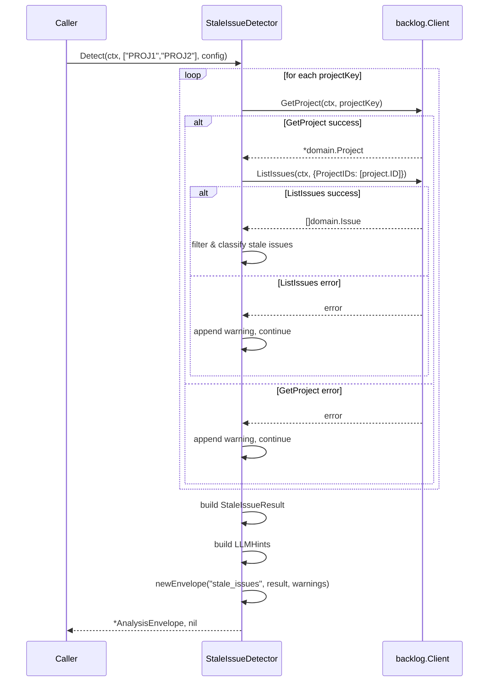

# M23: StaleIssueDetector ロジック

Plan: plans/logvalet-m23-stale-detector.md
Roadmap: plans/logvalet-roadmap-v3.md

## 概要

停滞課題検出アルゴリズム（StaleIssueDetector）を TDD で実装する。
デフォルト7日閾値 + ステータス別閾値 + 除外ステータスをサポート。

## スコープ

### 実装範囲

- `internal/analysis/stale.go` — StaleIssueDetector, StaleConfig, StaleIssueResult, StaleIssue 型
- `internal/analysis/stale_test.go` — 7+ テストケース

### スコープ外

- CLI コマンド（M24）
- MCP ツール（M24）
- README / docs 更新（M24 以降）
- `docs/specs/` への変更

## 型定義

### StaleConfig

```go
// StaleConfig は停滞判定の設定。
type StaleConfig struct {
    DefaultDays   int            // デフォルト閾値（日数）。0以下の場合 DefaultStaleDays を使用。
    StatusDays    map[string]int // ステータス名→独自閾値（例: "処理中": 3）
    ExcludeStatus []string       // 除外ステータス名（例: "完了", "対応済み"）
}
```

### StaleIssueResult

```go
// StaleIssueResult は停滞課題検出の結果。
type StaleIssueResult struct {
    Issues        []StaleIssue          `json:"issues"`
    TotalCount    int                   `json:"total_count"`
    ThresholdDays int                   `json:"threshold_days"`
    LLMHints      digest.DigestLLMHints `json:"llm_hints"`
}
```

### StaleIssue

```go
// StaleIssue は停滞と判定された個別課題。
type StaleIssue struct {
    IssueKey        string          `json:"issue_key"`
    Summary         string          `json:"summary"`
    Status          string          `json:"status"`
    Assignee        *domain.UserRef `json:"assignee,omitempty"`
    DaysSinceUpdate int             `json:"days_since_update"`
    LastUpdated     *time.Time      `json:"last_updated,omitempty"`
    DueDate         *time.Time      `json:"due_date,omitempty"`
    IsOverdue       bool            `json:"is_overdue"`
}
```

### StaleIssueDetector

```go
// StaleIssueDetector は停滞課題を検出する。
type StaleIssueDetector struct {
    BaseAnalysisBuilder
}

// NewStaleIssueDetector は StaleIssueDetector を生成する。
func NewStaleIssueDetector(client backlog.Client, profile, space, baseURL string, opts ...Option) *StaleIssueDetector

// Detect は指定プロジェクトの停滞課題を検出する。
func (d *StaleIssueDetector) Detect(ctx context.Context, projectKeys []string, config StaleConfig) (*AnalysisEnvelope, error)
```

## テスト設計書（Red フェーズ）

### テストヘルパー

既存の `helperIssue()`, `helperStatuses()` を活用。
追加で `helperIssues()` を新設（複数課題を返す）。

### 正常系ケース

| ID | テスト名 | 入力 | 期待出力 | 備考 |
|----|---------|------|---------|------|
| T1 | TestStaleDetector_Detect_FiltersStaleOnly | 5課題（2件stale: 10日前, 8日前; 3件fresh: 3日前, 1日前, 5日前） | Issues=2件, TotalCount=2, ThresholdDays=7 | DefaultDays=7（デフォルト） |
| T2 | TestStaleDetector_Detect_ExcludeStatus | 3課題（1件stale+完了, 1件stale+未対応, 1件fresh） | Issues=1件（未対応のみ）, "完了"は除外 | ExcludeStatus=["完了"] |
| T3 | TestStaleDetector_Detect_StatusDays | 3課題（1件"処理中"4日前, 1件"未対応"4日前, 1件fresh） | Issues=1件（"処理中"のみ stale） | StatusDays={"処理中": 3}, DefaultDays=7 |
| T4 | TestStaleDetector_Detect_NoStaleIssues | 3課題（全て1-3日前に更新） | Issues=空配列, TotalCount=0 | |
| T5 | TestStaleDetector_Detect_Overdue | 2件stale（1件DueDate過去, 1件DueDate未来） | 両方stale、1件IsOverdue=true | |
| T6 | TestStaleDetector_Detect_MultiProject | projectKeys=["PROJ1","PROJ2"], 各プロジェクトに課題あり | 両プロジェクトの stale 課題を統合 | |
| T7 | TestStaleDetector_Detect_LLMHints | 2件stale | primary_entities に "project:PROJ" 含む, open_questions に件数含む | |

### 異常系ケース

| ID | テスト名 | 入力 | 期待エラー | 備考 |
|----|---------|------|----------|------|
| T8 | TestStaleDetector_Detect_ProjectError | ListIssues がエラー | warnings 付き部分結果（error=nil） | 部分失敗パターン |
| T9 | TestStaleDetector_Detect_AllProjectsError | 全プロジェクトの ListIssues がエラー | error=nil, Issues=空, warnings=2件 | 全失敗でも error は返さない |

### エッジケース

| ID | テスト名 | 入力 | 期待出力 | 備考 |
|----|---------|------|---------|------|
| T10 | TestStaleDetector_Detect_EmptyProjectKeys | projectKeys=[] | Issues=空, TotalCount=0, warnings=空 | |
| T11 | TestStaleDetector_Detect_NilUpdated | Updated=nil の課題 | その課題はスキップ（stale 判定不可） | |
| T12 | TestStaleDetector_Detect_DefaultDaysZero | DefaultDays=0 | DefaultStaleDays(7) にフォールバック | |
| T13 | TestStaleDetector_Detect_NilStatus | Status=nil の課題（10日前更新） | DefaultDays で stale 判定、ExcludeStatus/StatusDays はスキップ | Status nil 安全 |

## 実装手順（TDD サイクル）

### Step 1: Red — テストを先に書く

ファイル: `internal/analysis/stale_test.go`

1. テストヘルパー `helperIssues()` を追加
2. T1-T12 の全テストケースを記述
3. `go test ./internal/analysis/...` → コンパイルエラー（型未定義）

### Step 2: Green — 最小限の実装

ファイル: `internal/analysis/stale.go`

1. 型定義: StaleConfig, StaleIssueResult, StaleIssue, StaleIssueDetector
2. NewStaleIssueDetector コンストラクタ
3. Detect メソッド本体:
   - DefaultDays のフォールバック（0以下 → DefaultStaleDays）
   - プロジェクトごとに ListIssues を呼び出し（errgroup 不使用、逐次でも可）
   - 部分失敗 → warnings に追加して continue
   - 各課題に対して:
     a. ExcludeStatus チェック → スキップ
     b. Updated が nil → スキップ
     c. threshold 決定: StatusDays[status.Name] || DefaultDays
     d. daysSinceUpdate 計算
     e. stale 判定（daysSinceUpdate >= threshold）
     f. IsOverdue 判定（DueDate != nil && DueDate.Before(now)）
   - StaleIssueResult 組み立て
   - LLMHints 生成
   - newEnvelope で包んで返却
4. `go test ./internal/analysis/...` → 全テストパス

### Step 3: Refactor

1. stale 判定ロジックを private 関数に抽出（`isStale`, `buildStaleIssue`）
2. LLMHints 生成を private 関数に抽出（`buildStaleLLMHints`）
3. `go test ./internal/analysis/...` → 全テストパス
4. `go vet ./...` → クリーン

## アーキテクチャ検討

### 既存パターンとの整合性

- BaseAnalysisBuilder 埋め込み: IssueContextBuilder と同一パターン
- WithClock による clock injection: テスト用 time.Now 差し替え
- newEnvelope による AnalysisEnvelope 生成: 共通ヘルパー使用
- toUserRef による User → UserRef 変換: 既存関数の再利用
- 部分失敗 → warnings パターン: IssueContextBuilder と同一

### ListIssues の呼び出し方針

Backlog API の ListIssues は `statusId[]` パラメータでフィルタ可能だが、
M23 では `ExcludeStatus` がステータス名ベース（ID ではない）のため、
クライアント側でフィルタリングする方針とする。

理由:
1. ExcludeStatus は名前ベース → ID への変換に ListProjectStatuses 追加呼び出しが必要
2. M23 はロジックのみ（CLI/MCP は M24）→ シンプルさを優先
3. 将来 M24 で StatusID フィルタを追加する余地は残す

### 逐次 vs 並行プロジェクト取得

プロジェクト数は通常少ない（1-3件）ため、逐次呼び出しで十分。
errgroup による並行化は M24 以降のパフォーマンス改善で検討。

## リスク評価

| リスク | 重大度 | 対策 |
|--------|--------|------|
| ListIssues の結果が大量（100+件） | Low | Backlog API のデフォルト上限（100件）に依存。M24 でページネーション対応を検討 |
| ExcludeStatus の名前一致が case-sensitive | Low | 日本語ステータス名が多いため問題少。必要なら strings.EqualFold を後から追加 |
| Updated が nil の課題 | Medium | テスト T11 でカバー。nil の場合はスキップ（stale 判定不可） |
| DefaultStaleDays との重複定義 | Low | context.go の DefaultStaleDays を stale.go でも参照するため重複なし |

## シーケンス図



## 検証コマンド

```bash
# テスト実行
go test ./internal/analysis/... -v

# 全テスト
go test ./...

# Lint
go vet ./...
```

## チェックリスト

### 観点1: 実装実現可能性（5項目）
- [x] 手順の抜け漏れがないか
- [x] 各ステップが十分に具体的か
- [x] 依存関係が明示されているか（Step 1 → Step 2 → Step 3）
- [x] 変更対象ファイルが網羅されているか（stale.go, stale_test.go）
- [x] 影響範囲が正確に特定されているか（analysis パッケージ内のみ）

### 観点2: TDDテスト設計（6項目）
- [x] 正常系テストケースが網羅されているか（T1-T7）
- [x] 異常系テストケースが定義されているか（T8-T9）
- [x] エッジケースが考慮されているか（T10-T12）
- [x] 入出力が具体的に記述されているか
- [x] Red→Green→Refactorの順序が守られているか
- [x] モック/スタブの設計が適切か（MockClient の ListIssuesFunc）

### 観点3: アーキテクチャ整合性（5項目）
- [x] 既存の命名規則に従っているか（StaleIssueDetector, StaleConfig 等）
- [x] 設計パターンが一貫しているか（BaseAnalysisBuilder 埋め込み）
- [x] モジュール分割が適切か（analysis パッケージ内）
- [x] 依存方向が正しいか（analysis → backlog, domain, digest）
- [x] 類似機能との統一性があるか（IssueContextBuilder と同パターン）

### 観点4: リスク評価と対策（6項目）
- [x] リスクが適切に特定されているか
- [x] 対策が具体的か
- [x] フェイルセーフが考慮されているか（部分失敗 → warnings）
- [x] パフォーマンスへの影響が評価されているか（逐次取得で十分）
- [x] セキュリティ観点が含まれているか（N/A: 読み取り専用操作）
- [x] ロールバック計画があるか（新規ファイルのみ → 削除で元に戻る）

### 観点5: シーケンス図（5項目）
- [x] 正常フローが記述されているか
- [x] エラーフローが記述されているか（warning パス）
- [x] システム・外部API間の相互作用が明確か
- [x] 同期的な処理の制御が明記されているか（逐次ループ）
- [x] 例外ハンドリングが図に含まれているか

## ListIssues 呼び出しの方針（確定）

ListIssuesOptions の `ProjectIDs []int` に対し、Detect の引数は `projectKeys []string`。
プロジェクトキーから ProjectID への変換が必要。

**確定方針**: projectKey ごとに GetProject → ListIssues の2段階呼び出し。

フロー:
1. projectKeys をループし、各反復で:
   a. `GetProject(ctx, projectKey)` で Project を取得
   b. GetProject 失敗 → warnings に追加して次の projectKey へ continue
   c. `ListIssues(ctx, ListIssuesOptions{ProjectIDs: []int{project.ID}})` で課題一覧を取得
   d. ListIssues 失敗 → warnings に追加して次の projectKey へ continue
2. 全プロジェクトの結果を統合してフィルタリング

テスト T8 では GetProject または ListIssues のエラーを検証する。

## 追加仕様（advocate レビュー反映）

- **ThresholdDays**: config.DefaultDays（フォールバック後の値）をセットする
- **resource 名**: `"stale_issues"` を使用。T1 で `env.Resource == "stale_issues"` を検証する
- **Status nil 安全**: Issue.Status が nil の場合、ExcludeStatus/StatusDays チェックをスキップし DefaultDays で判定
- **ソート順**: DaysSinceUpdate 降順をデフォルトにする（sort.Slice で実装）

## 次のマイルストーン

M23 完了後 → M24（Stale Issues CLI + MCP）へ進む。
M24 では:
- `internal/cli/issue_stale.go` に `issue stale` コマンドを追加
- `internal/mcp/tools_analysis.go` に `logvalet_issue_stale` MCP ツールを追加
- ページネーション対応を検討

---

## Next Action

> **このプランが承認されました。以下を順番に実行してください:**
>
> 1. `Skill(devflow:implement)` -- このプランに基づいて実装を開始
>
> ユーザーの追加指示は不要です。即座に実行してください。
