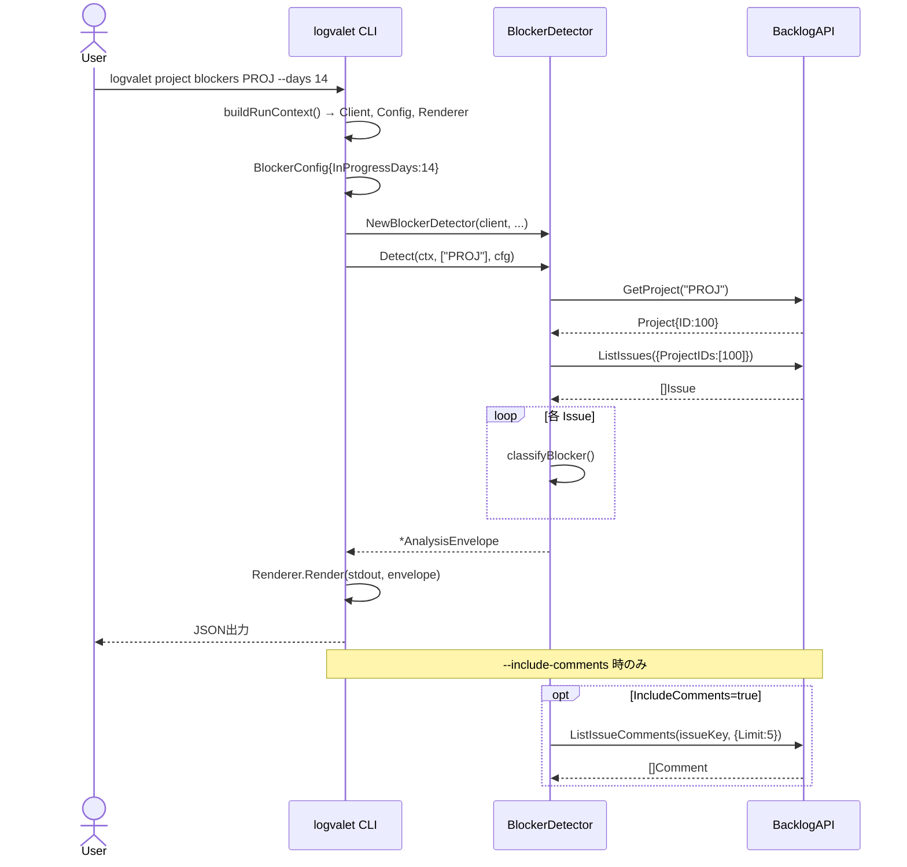
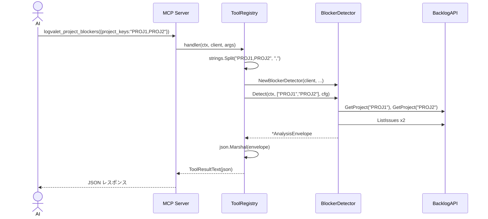

# マイルストーン M26: Project Blockers CLI + MCP

## 概要

M25で実装済みの `BlockerDetector.Detect()` を CLI コマンド (`logvalet project blockers`) と MCP ツール (`logvalet_project_blockers`) から呼び出せるようにする。M24（Stale Issues CLI + MCP）パターンを踏襲した実装。

## スコープ

### 実装範囲

- `internal/cli/project_blockers.go` — 新規作成（ProjectBlockersCmd）
- `internal/cli/project_blockers_test.go` — 新規作成（Kong パーステスト）
- `internal/cli/project.go` — ProjectCmd に Blockers フィールドを追加
- `internal/mcp/tools_analysis.go` — `logvalet_project_blockers` ツール追加
- `internal/mcp/tools_test.go` — expectedCount 26 → 27 に更新

### スコープ外

- BlockerDetector ロジック自体の変更（M25で完了済み）
- analysis パッケージへの変更
- 他の CLI コマンドへの影響

---

## テスト設計書（TDD: Red → Green → Refactor）

### CLI テスト（`internal/cli/project_blockers_test.go`）

#### 正常系ケース

| ID | テスト名 | 入力 | 期待出力 |
|----|---------|------|---------|
| T1 | デフォルト値パース | `project blockers PROJ` | ProjectKey="PROJ", Days=14, IncludeComments=false, ExcludeStatus="" |
| T2 | フラグ付きパース | `project blockers PROJ --days 7 --include-comments --exclude-status "完了,対応済み"` | Days=7, IncludeComments=true, ExcludeStatus="完了,対応済み" |
| T3 | 引数なしでエラー | `project blockers`（PROJECT 引数なし） | パースエラーが返る |

#### 異常系ケース

| ID | テスト名 | 入力 | 期待エラー |
|----|---------|------|----------|
| T3 | PROJECT 引数省略 | `project blockers` | kong が required エラーを返す |

### MCP ツールテスト（`internal/mcp/tools_test.go`）

#### 既存テスト更新

| ID | テスト名 | 変更内容 |
|----|---------|---------|
| MCP-1 | TestNewServer_RegistersAllTools | expectedCount: 26 → 27 |

#### 新規テスト追加

| ID | テスト名 | 入力 | 期待出力 |
|----|---------|------|---------|
| MCP-26 | TestProjectBlockersHandler_Basic | project_keys="PROJ", mock returns 0 issues | IsError=false, JSON に total_count フィールドあり |
| MCP-27 | TestProjectBlockersHandler_MissingProjectKeys | project_keys 省略 | IsError=true |

---

## 実装手順

### Step 1: Red — CLI テストを先に書く

**ファイル**: `internal/cli/project_blockers_test.go`（新規作成）

M24 の `issue_stale_test.go` を参考に、以下 3 テストを実装:
1. `TestProjectBlockers_KongParse_Default` — デフォルト値（Days=14）
2. `TestProjectBlockers_KongParse_WithFlags` — フラグ付き（--days, --include-comments, --exclude-status）
3. `TestProjectBlockers_KongParse_MissingProjectKey` — 引数なしエラー

テスト実行: `go test ./internal/cli/... -run TestProjectBlockers` → **失敗することを確認**

### Step 2: Red — MCP テストを更新

**ファイル**: `internal/mcp/tools_test.go`

- `expectedCount` を `26` → `27` に変更
- `TestProjectBlockersHandler_Basic` テストを追加（mock client で total_count=0 を返す）
- `TestProjectBlockersHandler_MissingProjectKeys` テストを追加

テスト実行: `go test ./internal/mcp/... -run TestNewServer_RegistersAllTools` → **失敗することを確認**

### Step 3: Green — CLI 実装

**ファイル**: `internal/cli/project_blockers.go`（新規作成）

```go
package cli

import (
    "context"
    "os"
    "strings"

    "github.com/youyo/logvalet/internal/analysis"
)

// ProjectBlockersCmd は project blockers コマンド。
// 指定プロジェクトの進行阻害課題を検出する。
type ProjectBlockersCmd struct {
    ProjectKey      string `arg:"" required:"" help:"project key"`
    Days            int    `help:"days threshold for in-progress stagnation detection" default:"14"`
    IncludeComments bool   `help:"enable blocked-by-keyword detection via comments"`
    ExcludeStatus   string `help:"comma-separated status names to exclude (e.g. '完了,対応済み')"`
}

// Run は project blockers コマンドを実行する。
func (c *ProjectBlockersCmd) Run(g *GlobalFlags) error {
    ctx := context.Background()
    rc, err := buildRunContext(g)
    if err != nil {
        return err
    }

    // --exclude-status をカンマ分割
    var excludeStatus []string
    if c.ExcludeStatus != "" {
        excludeStatus = strings.Split(c.ExcludeStatus, ",")
    }

    cfg := analysis.BlockerConfig{
        InProgressDays:  c.Days,
        ExcludeStatus:   excludeStatus,
        IncludeComments: c.IncludeComments,
    }

    detector := analysis.NewBlockerDetector(
        rc.Client,
        rc.Config.Profile,
        rc.Config.Space,
        rc.Config.BaseURL,
    )

    envelope, err := detector.Detect(ctx, []string{c.ProjectKey}, cfg)
    if err != nil {
        return err
    }

    return rc.Renderer.Render(os.Stdout, envelope)
}
```

**ファイル**: `internal/cli/project.go`（更新）

```go
// ProjectCmd は project コマンド群のルート。
type ProjectCmd struct {
    Get      ProjectGetCmd      `cmd:"" help:"get project"`
    List     ProjectListCmd     `cmd:"" help:"list projects"`
    Blockers ProjectBlockersCmd `cmd:"" help:"detect project blockers"`
}
```

テスト実行: `go test ./internal/cli/... -run TestProjectBlockers` → **成功することを確認**

### Step 4: Green — MCP ツール実装

**ファイル**: `internal/mcp/tools_analysis.go`（更新）

`RegisterAnalysisTools` 関数末尾に追加:

```go
// logvalet_project_blockers
r.Register(gomcp.NewTool("logvalet_project_blockers",
    gomcp.WithDescription("Detect project blocker issues (high priority unassigned, long in-progress, overdue)"),
    gomcp.WithString("project_keys",
        gomcp.Required(),
        gomcp.Description("Comma-separated project keys (e.g. 'PROJ1,PROJ2')"),
    ),
    gomcp.WithNumber("days",
        gomcp.Description("Days threshold for in-progress stagnation (default 14)"),
    ),
    gomcp.WithBoolean("include_comments",
        gomcp.Description("Enable blocked-by-keyword detection via latest comment (default false)"),
    ),
    gomcp.WithString("exclude_status",
        gomcp.Description("Comma-separated status names to exclude (e.g. '完了,対応済み')"),
    ),
), func(ctx context.Context, client backlog.Client, args map[string]any) (any, error) {
    projectKeysStr, ok := stringArg(args, "project_keys")
    if !ok || projectKeysStr == "" {
        return nil, fmt.Errorf("project_keys is required")
    }

    projectKeys := strings.Split(projectKeysStr, ",")

    blockerCfg := analysis.BlockerConfig{}
    if days, ok := intArg(args, "days"); ok && days > 0 {
        blockerCfg.InProgressDays = days
    }
    if includeComments, ok := boolArg(args, "include_comments"); ok {
        blockerCfg.IncludeComments = includeComments
    }
    if excludeStatusStr, ok := stringArg(args, "exclude_status"); ok && excludeStatusStr != "" {
        blockerCfg.ExcludeStatus = strings.Split(excludeStatusStr, ",")
    }

    detector := analysis.NewBlockerDetector(client, cfg.Profile, cfg.Space, cfg.BaseURL)
    return detector.Detect(ctx, projectKeys, blockerCfg)
})
```

テスト実行: `go test ./internal/mcp/... -run TestNewServer_RegistersAllTools` → **成功することを確認**

### Step 5: 全テスト確認

```bash
go test ./...
```

全テスト GREEN を確認。

### Step 6: Refactor

- コメントの整合性確認
- help テキストの表現統一（他コマンドとの一貫性）
- 不要なコードがないか確認

---

## アーキテクチャ検討

### 既存パターンとの整合性

M24（`issue stale`）パターンを完全踏襲:

| 項目 | M24 (Stale) | M26 (Blockers) |
|------|------------|----------------|
| CLI 引数スタイル | `-k` フラグ（複数可） | positional arg（単一） |
| Days デフォルト | 7 | 14 |
| 追加フラグ | `--exclude-status` | `--include-comments`, `--exclude-status` |
| MCP 登録 | `RegisterAnalysisTools` | 同上 |

> **注意**: Stale は `-k PROJECT` 複数可だが、Blockers は `PROJECT` positional 引数（単一）。
> これはハンドオフ情報「CLI推奨形式: `logvalet project blockers PROJECT`」に従ったもの。
> 必要なら後から `-k` フラグに変更可能。

### 新規モジュール設計

`ProjectBlockersCmd` は `IssueStaleCmd` と同構造:
- `Run()` が `buildRunContext()` でクライアント取得
- `analysis.BlockerConfig` にパラメータをマッピング
- `analysis.NewBlockerDetector()` でディテクター生成
- `detector.Detect()` で実行
- `rc.Renderer.Render()` で出力

---

## リスク評価

| リスク | 重大度 | 対策 |
|--------|--------|------|
| ProjectCmd の Blockers フィールド追加で既存テストが壊れる | 低 | project_test.go が存在する場合は追加テストも通るか確認 |
| tools_test.go の expectedCount 変更漏れ | 中 | Step 2 で Red テストを先に実行し失敗を確認してから実装 |
| BlockerDetector がマルチプロジェクトで N+1 API 呼び出し | 低 | 既存実装が `GetProject` + `ListIssues(ProjectIDs)` で設計済み。CLI は単一プロジェクト引数のため問題なし |
| IncludeComments=true 時のコメント API N+1 | 低 | デフォルト false、ユーザーが明示的に有効化した場合のみ発生（設計上の妥協点） |

---

## シーケンス図





---

## 変更対象ファイル一覧

| ファイル | 種別 | 変更内容 |
|---------|------|---------|
| `internal/cli/project_blockers.go` | 新規作成 | ProjectBlockersCmd 実装 |
| `internal/cli/project_blockers_test.go` | 新規作成 | Kong パーステスト 3件 |
| `internal/cli/project.go` | 更新 | ProjectCmd に Blockers フィールド追加 |
| `internal/mcp/tools_analysis.go` | 更新 | logvalet_project_blockers ツール追加 |
| `internal/mcp/tools_test.go` | 更新 | expectedCount 26→27、新規テスト 2件追加 |

---

## チェックリスト

### 観点1: 実装実現可能性（5項目）
- [x] 手順の抜け漏れがないか（Red→Green→Refactor の順序が明確）
- [x] 各ステップが十分に具体的か（ファイル名・コード例・テスト名まで明記）
- [x] 依存関係が明示されているか（Step 1,2 Red → Step 3,4 Green → Step 5 全確認）
- [x] 変更対象ファイルが網羅されているか（5ファイル全列挙）
- [x] 影響範囲が正確に特定されているか（project.go の既存テストへの影響を明示）

### 観点2: TDDテスト設計（6項目）
- [x] 正常系テストケースが網羅されているか（T1, T2, MCP-26）
- [x] 異常系テストケースが定義されているか（T3, MCP-27）
- [x] エッジケースが考慮されているか（引数なし、project_keys 省略）
- [x] 入出力が具体的に記述されているか（Days=14 デフォルト、IsError=false/true 等）
- [x] Red→Green→Refactorの順序が守られているか（Step 1,2 が Red）
- [x] モック/スタブの設計が適切か（backlog.NewMockClient() + Func フィールドパターン）

### 観点3: アーキテクチャ整合性（5項目）
- [x] 既存の命名規則に従っているか（ProjectBlockersCmd, Run, GlobalFlags）
- [x] 設計パターンが一貫しているか（M24 IssueStaleCmd と同構造）
- [x] モジュール分割が適切か（CLI → analysis 依存のみ、逆方向なし）
- [x] 依存方向が正しいか（cli → analysis → backlog の一方向）
- [x] 類似機能との統一性があるか（IssueStaleCmd パターンを完全踏襲）

### 観点4: リスク評価と対策（6項目）
- [x] リスクが適切に特定されているか（4項目）
- [x] 対策が具体的か（各リスクに具体的な対策）
- [x] フェイルセーフが考慮されているか（部分失敗時は warning + 残りプロジェクト継続、M25実装済み）
- [x] パフォーマンスへの影響が評価されているか（N+1 API の設計上の制約を明示）
- [x] セキュリティ観点が含まれているか（入力値はAPIキー/プロジェクトキーのみ、危険な操作なし）
- [x] ロールバック計画があるか（コード変更のみ、データ変更なし、git revert で即座に戻せる）

### 観点5: シーケンス図（5項目）
- [x] 正常フローが記述されているか（CLI・MCP 両方）
- [x] エラーフローが記述されているか（--include-comments opt-in 注記）
- [x] ユーザー・システム・外部API間の相互作用が明確か
- [x] タイミング・同期的な処理の制御が明記されているか
- [x] リトライ・タイムアウト等の例外ハンドリングが図に含まれているか（warning パターン）

---

## コミット計画

```
feat(cli): project blockers コマンドを追加 (M26)
feat(mcp): logvalet_project_blockers MCP ツールを追加 (M26)

Plan: plans/logvalet-m26-project-blockers-cli-mcp.md
```

---

## Next Action

> **このプランが承認されました。以下を順番に実行してください:**
>
> 1. `Skill(devflow:implement)` — このプランに基づいて実装を開始
>
> ユーザーの追加指示は不要です。即座に実行してください。
