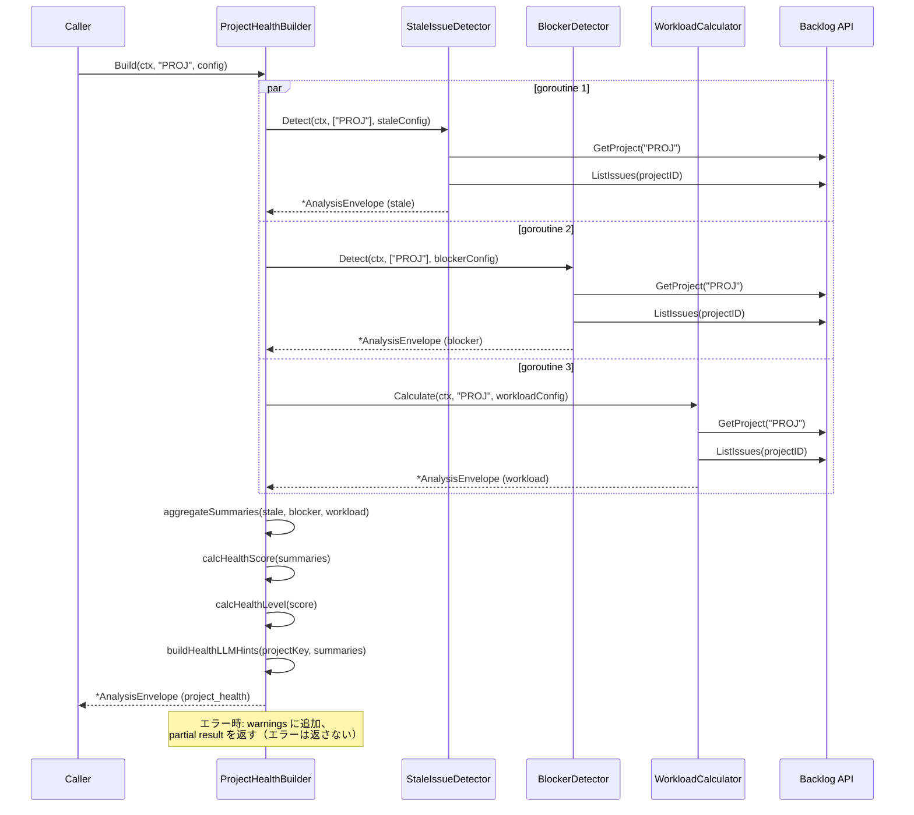

# マイルストーン M29: Enhanced Project Digest

## 概要

`internal/analysis/health.go` に `ProjectHealthBuilder` を新設し、M23（stale）・M25（blocker）・M27（workload）の分析結果を1回の呼び出しで統合的に集約する。M30 の `project health` CLI + MCP の**ロジック層**として機能する。

## スコープ

### 実装範囲

- `internal/analysis/health.go` — `ProjectHealthBuilder.Build()` 新規実装
- `internal/analysis/health_test.go` — TDD テスト
- `plans/logvalet-m29-enhanced-project-digest.md` — このファイル

### スコープ外

- CLI コマンド（`project health`）→ M30 で実装
- MCP ツール（`logvalet_project_health`）→ M30 で実装
- 既存の `project digest` 出力への変更 → 行わない（digest と analysis の責務分離を維持）
- `docs/` 更新 → M31（スキル・ドキュメント整備）で実施

### 設計判断: analysis/ に統合ビルダーを作る

**選択**: `internal/analysis/health.go` に `ProjectHealthBuilder` を新設する。

**却下案**: 既存の `digest/` パッケージを拡張する。
- 却下理由: `digest`（what: 何があるか）と `analysis`（so what: だから何か）の責務分離原則に反する
- 却下理由: `digest` パッケージは `DigestEnvelope` を返すが、`ProjectHealth` は `AnalysisEnvelope` が適切

**採択理由**:
- ロードマップの `internal/analysis/health.go — ProjectHealthBuilder（統合）` の記載と一致
- `StaleIssueDetector`・`BlockerDetector`・`WorkloadCalculator` と同一パターン
- M30 の CLI 実装時に自然に接続できる

## 出力スキーマ設計

```json
{
  "schema_version": "1",
  "resource": "project_health",
  "generated_at": "2026-04-01T12:00:00Z",
  "profile": "default",
  "space": "heptagon",
  "base_url": "https://heptagon.backlog.com",
  "warnings": [],
  "analysis": {
    "project_key": "PROJ",
    "stale_summary": {
      "total_count": 3,
      "threshold_days": 7,
      "overdue_count": 1
    },
    "blocker_summary": {
      "total_count": 2,
      "high_count": 1,
      "medium_count": 1
    },
    "workload_summary": {
      "total_issues": 20,
      "unassigned_count": 3,
      "overloaded_count": 1,
      "high_load_count": 2
    },
    "health_score": 65,
    "health_level": "warning",
    "llm_hints": {
      "primary_entities": ["project:PROJ"],
      "open_questions": ["3件の停滞課題があります"],
      "suggested_next_actions": []
    }
  }
}
```

### health_score の計算ロジック

スコアは 0〜100。減点方式:

| 条件 | 減点 |
|------|------|
| stale issue 1件ごと | -5 |
| blocker HIGH 1件ごと | -10 |
| blocker MEDIUM 1件ごと | -5 |
| overloaded メンバー 1人ごと | -8 |
| unassigned 課題 total の 20% 超 | -10 |

**health_level**:
- 80-100: `healthy`
- 60-79: `warning`
- 0-59: `critical`

## テスト設計書

### T01: 正常系 — stale/blocker/workload が全て返る

```
入力:
  projectKey: "PROJ"
  config: ProjectHealthConfig{} (デフォルト)

モック設定:
  GetProject → Project{ID:1, Key:"PROJ"}
  ListIssues → [
    {IssueKey:"PROJ-1", Updated: now-10d, Status:"処理中"},   // stale + blocker(long_in_progress)
    {IssueKey:"PROJ-2", Updated: now-1d, Status:"未対応"},    // 正常
    {IssueKey:"PROJ-3", DueDate: now-2d, Assignee: &User{ID:10, Name:"A"}}, // overdue → blocker HIGH
  ]

期待:
  envelope.Resource == "project_health"
  analysis.project_key == "PROJ"
  analysis.stale_summary.total_count == 1
  analysis.blocker_summary.high_count == 1
  analysis.health_level in ["warning", "critical"]
  len(envelope.warnings) == 0
```

### T02: 正常系 — 課題ゼロのプロジェクト（health_score == 100）

```
入力: projectKey: "EMPTY"
モック: ListIssues → []
期待:
  analysis.stale_summary.total_count == 0
  analysis.blocker_summary.total_count == 0
  analysis.workload_summary.total_issues == 0
  analysis.health_score == 100
  analysis.health_level == "healthy"
```

### T03: 正常系 — health_score の減点計算

```
入力: 設定を固定した決定論的シナリオ
モック: stale×2, blocker(HIGH)×1, overloaded×1

期待:
  health_score == 100 - (2*5) - (1*10) - (1*8) = 72
  health_level == "warning"
```

### T04: 異常系 — GetProject 失敗

```
モック: GetProject → error
期待:
  envelope.warnings[0].code == "project_fetch_failed"
  analysis.health_score == 0  (または 100 — 仕様を health_score=0 とする)
  エラーは返さない（nil error）
```

### T05: 異常系 — ListIssues 失敗

```
モック: GetProject → OK, ListIssues → error
期待:
  envelope.warnings[0].code == "issues_fetch_failed"
  analysis.stale_summary.total_count == 0
  エラーは返さない（nil error）
```

### T06: WithClock オプション — 時刻注入

```
固定時刻を注入して stale 判定の再現性を確保
now := time.Date(2026, 1, 10, 0, 0, 0, 0, time.UTC)
Updated = 2026-01-01 → daysSince=9 >= 7 → stale
```

### T07: エッジケース — health_score が 0 を下回らない

```
stale×20 → 減点 100 → health_score = max(0, 100-100) = 0
health_level == "critical"
```

### T08: エッジケース — unassigned_ratio > 20%

```
total_issues=10, unassigned=3 → 30% > 20% → -10
期待: health_score に -10 が反映される
```

## 実装手順

### Step 1: Red — 失敗するテストを書く（health_test.go）

**ファイル**: `internal/analysis/health_test.go`

```go
package analysis

import (
    "context"
    "testing"
    "time"
)

// T01-T08 のテストケースを実装
// NewProjectHealthBuilder, ProjectHealthConfig, ProjectHealthResult の型を参照
// この時点でビルドエラーが発生する（型未定義）→ Red フェーズ完了
```

### Step 2: Green — 最小限の実装（health.go）

**ファイル**: `internal/analysis/health.go`

実装する型と関数:

```go
// ProjectHealthConfig はプロジェクト健全性評価の設定。
type ProjectHealthConfig struct {
    StaleConfig  StaleConfig
    BlockerConfig BlockerConfig
    WorkloadConfig WorkloadConfig
}

// StaleSummary は stale 課題のサマリー（ProjectHealthResult に埋め込む）。
type StaleSummary struct {
    TotalCount    int `json:"total_count"`
    ThresholdDays int `json:"threshold_days"`
    OverdueCount  int `json:"overdue_count"`
}

// BlockerSummary はブロッカーのサマリー。
type BlockerSummary struct {
    TotalCount  int `json:"total_count"`
    HighCount   int `json:"high_count"`
    MediumCount int `json:"medium_count"`
}

// WorkloadSummary はワークロードのサマリー。
type WorkloadSummary struct {
    TotalIssues     int `json:"total_issues"`
    UnassignedCount int `json:"unassigned_count"`
    OverloadedCount int `json:"overloaded_count"`
    HighLoadCount   int `json:"high_load_count"`
}

// ProjectHealthResult はプロジェクト健全性評価の結果。
type ProjectHealthResult struct {
    ProjectKey      string          `json:"project_key"`
    StaleSummary    StaleSummary    `json:"stale_summary"`
    BlockerSummary  BlockerSummary  `json:"blocker_summary"`
    WorkloadSummary WorkloadSummary `json:"workload_summary"`
    HealthScore     int             `json:"health_score"`
    HealthLevel     string          `json:"health_level"`  // "healthy" | "warning" | "critical"
    LLMHints        digest.DigestLLMHints `json:"llm_hints"`
}

// ProjectHealthBuilder はプロジェクト健全性を評価する。
type ProjectHealthBuilder struct {
    BaseAnalysisBuilder
}

// NewProjectHealthBuilder は ProjectHealthBuilder を生成する。
func NewProjectHealthBuilder(client backlog.Client, profile, space, baseURL string, opts ...Option) *ProjectHealthBuilder

// Build はプロジェクトの健全性評価を実行する。
func (b *ProjectHealthBuilder) Build(ctx context.Context, projectKey string, config ProjectHealthConfig) (*AnalysisEnvelope, error)
```

**実装戦略**: 各分析器（StaleIssueDetector, BlockerDetector, WorkloadCalculator）を内部的に呼び出し、結果をサマリーに変換する。N+1 を避けるため goroutine で並列実行（`errgroup` 使用）。

### Step 3: Refactor — コード整理

- `calcHealthScore` を独立関数として抽出（テスト容易性向上）
- `calcHealthLevel` を独立関数として抽出
- `buildHealthLLMHints` を独立関数として抽出
- 重複する warning マージロジックを共通化

## アーキテクチャ検討

### 既存パターンとの整合性

| 項目 | 既存パターン | M29 の適用 |
|------|------------|-----------|
| struct 名 | `StaleIssueDetector`, `BlockerDetector`, `WorkloadCalculator` | `ProjectHealthBuilder` |
| コンストラクタ | `NewXxx(client, profile, space, baseURL, opts...)` | 同じシグネチャ |
| メソッド名 | `Detect(ctx, args, config)` / `Calculate(ctx, key, config)` | `Build(ctx, projectKey, config)` |
| 返り値 | `(*AnalysisEnvelope, error)` | 同じ |
| Resource 名 | `"stale_issues"`, `"project_blockers"`, `"user_workload"` | `"project_health"` |
| Clock injection | `WithClock(now)` | 同じオプション |

### 並列実行設計

```
Build(ctx, projectKey, config)
  │
  ├─ (goroutine 1) StaleIssueDetector.Detect(ctx, []string{projectKey}, config.StaleConfig)
  ├─ (goroutine 2) BlockerDetector.Detect(ctx, []string{projectKey}, config.BlockerConfig)
  └─ (goroutine 3) WorkloadCalculator.Calculate(ctx, projectKey, config.WorkloadConfig)
       │
       全て完了 → サマリー集約 → health_score 計算 → AnalysisEnvelope 生成
```

**注意**: 各分析器がそれぞれ `GetProject` + `ListIssues` を呼ぶため、合計6回のAPI呼び出しが発生する。M30 以降で最適化の余地はあるが、M29 では正確性を優先する。

### 依存関係

```
analysis/health.go
  → analysis/stale.go   (StaleIssueDetector)
  → analysis/blocker.go (BlockerDetector)
  → analysis/workload.go (WorkloadCalculator)
  → analysis/analysis.go (BaseAnalysisBuilder, AnalysisEnvelope)
  → digest/common.go     (DigestLLMHints)
  → backlog.Client
```

## シーケンス図



## リスク評価

| リスク | 重大度 | 対策 |
|--------|--------|------|
| API呼び出し数が3×2=6回に増加 | Medium | goroutine 並列化で待ち時間を削減。M30以降で課題一括取得に最適化 |
| health_score の計算ロジックが恣意的 | Low | 減点テーブルを定数として明示し、テスト T03 で数値検証 |
| 各分析器の warnings が重複する可能性 | Low | warnings は全てマージして返す。重複は許容（情報過多より情報欠損を避ける） |
| `context.Context` のキャンセルが goroutine 内で伝播しない | Medium | `errgroup.WithContext` を使用し、1つの goroutine 失敗で他をキャンセル可能に |

## チェックリスト

### 観点1: 実装実現可能性

- [x] 手順の抜け漏れがないか — Red→Green→Refactor の3ステップで完結
- [x] 各ステップが十分に具体的か — 型定義、関数シグネチャまで記載
- [x] 依存関係が明示されているか — 既存3分析器への依存を明記
- [x] 変更対象ファイルが網羅されているか — health.go, health_test.go の2ファイル
- [x] 影響範囲が正確に特定されているか — 既存ファイルへの変更なし

### 観点2: TDDテスト設計の品質

- [x] 正常系テストケースが網羅されているか — T01,T02,T03
- [x] 異常系テストケースが定義されているか — T04,T05
- [x] エッジケースが考慮されているか — T07(スコア下限),T08(unassigned_ratio),T06(clock)
- [x] 入出力が具体的に記述されているか — フィールド名と期待値を明記
- [x] Red→Green→Refactorの順序が守られているか — Step 1=Red, Step 2=Green, Step 3=Refactor
- [x] モック/スタブの設計が適切か — `backlog.MockClient` の Func フィールドパターンを使用

### 観点3: アーキテクチャ整合性

- [x] 既存の命名規則に従っているか — `ProjectHealthBuilder`, `Build()`, `ProjectHealthConfig`
- [x] 設計パターンが一貫しているか — BaseAnalysisBuilder 継承、WithClock オプション
- [x] モジュール分割が適切か — analysis パッケージ内で完結、digest パッケージを変更しない
- [x] 依存方向が正しいか — health → stale/blocker/workload → analysis/backlog（上位→下位）
- [x] 類似機能との統一性があるか — 3つの既存分析器と同一パターン

### 観点4: リスク評価と対策

- [x] リスクが適切に特定されているか — API呼び出し数増加、score恣意性、warnings重複
- [x] 対策が具体的か — errgroup並列化、定数テーブル、マージ許容
- [x] フェイルセーフが考慮されているか — 各分析器失敗時も partial result を返す
- [x] パフォーマンスへの影響が評価されているか — goroutine並列で待ち時間削減
- [x] セキュリティ観点が含まれているか — 読み取り専用のため N/A
- [x] ロールバック計画があるか — 新規ファイルのみ追加のため、削除で完全ロールバック可能

### 観点5: シーケンス図の完全性

- [x] 正常フローが記述されているか — 並列実行 → 集約の流れ
- [x] エラーフローが記述されているか — Note に記載
- [x] ユーザー・システム・外部API間の相互作用が明確か
- [x] タイミング・同期的な処理の制御が明記されているか — par ブロックで並列を表現
- [x] リトライ・タイムアウト等の例外ハンドリングが図に含まれているか — errgroup のキャンセル

## ドキュメント更新（M29 スコープ外）

以下は M31 で実施:
- `README.md` — `project health` コマンドの追加（M30後）
- `CHANGELOG.md` — M29-M30 のエントリ

---

## Next Action

> **このプランが承認されました。以下を順番に実行してください:**
>
> 1. `Skill(devflow:implement)` — このプランに基づいて実装を開始
>
> ユーザーの追加指示は不要です。即座に実行してください。
