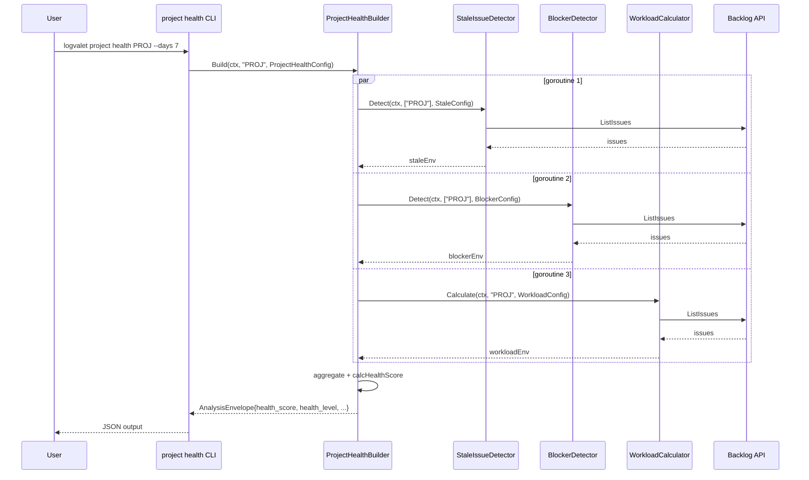

# マイルストーン M30: Project Health CLI + MCP

## 概要

M29で実装済みの `ProjectHealthBuilder.Build()` を CLI コマンドと MCP ツールから呼び出せるようにする。既存の `project blockers` パターンをそのまま踏襲し、最小限の変更で完成させる。

---

## スコープ

### 実装範囲

- `internal/cli/project_health.go` — `ProjectHealthCmd` の新規作成
- `internal/cli/project_health_test.go` — Kong パースのユニットテスト
- `internal/cli/project.go` — `ProjectCmd` に `Health` フィールド追加
- `internal/mcp/tools_analysis.go` — `logvalet_project_health` ツール追加
- `internal/mcp/tools_test.go` — `expectedCount` を 28 → 29 に更新

### スコープ外

- `internal/analysis/health.go` の変更（M29で完成済み）
- 新規 analysis パッケージの追加
- 出力フォーマットの変更

---

## コマンド仕様

```
logvalet project health PROJECT_KEY [--days N] [--include-comments] [--exclude-status "完了,対応済み"]
```

| フラグ | 型 | デフォルト | 説明 |
|--------|-----|-----------|------|
| `PROJECT_KEY` | string（arg） | 必須 | プロジェクトキー |
| `--days` | int | 7 | stale/blocker 判定日数閾値 |
| `--include-comments` | bool | false | コメントキーワード検出を有効化 |
| `--exclude-status` | string | "" | 除外ステータス（カンマ区切り） |

### `ProjectHealthConfig` マッピング

```
--days           → StaleConfig.DefaultDays, BlockerConfig.InProgressDays, WorkloadConfig.StaleDays
--include-comments → BlockerConfig.IncludeComments
--exclude-status → StaleConfig.ExcludeStatus, BlockerConfig.ExcludeStatus, WorkloadConfig.ExcludeStatus
```

---

## MCP ツール仕様

**ツール名**: `logvalet_project_health`

| パラメータ | 型 | 必須 | 説明 |
|-----------|-----|------|------|
| `project_key` | string | ✓ | プロジェクトキー |
| `days` | number | — | stale/blocker 判定日数閾値 |
| `include_comments` | boolean | — | コメントキーワード検出 |
| `exclude_status` | string | — | 除外ステータス（カンマ区切り） |

---

## テスト設計書（TDD: Red → Green → Refactor）

### 対象ファイル: `internal/cli/project_health_test.go`

#### T1: デフォルト値パース（正常系）

```
入力: ["project", "health", "PROJ"]
期待:
  cmd.ProjectKey == "PROJ"
  cmd.Days == 7
  cmd.IncludeComments == false
  cmd.ExcludeStatus == ""
```

#### T2: フラグ付きパース（正常系）

```
入力: ["project", "health", "PROJ", "--days", "14", "--include-comments", "--exclude-status", "完了,対応済み"]
期待:
  cmd.ProjectKey == "PROJ"
  cmd.Days == 14
  cmd.IncludeComments == true
  cmd.ExcludeStatus == "完了,対応済み"
```

#### T3: PROJECT_KEY 省略 → エラー（異常系）

```
入力: ["project", "health"]
期待: err != nil
```

### 対象ファイル: `internal/mcp/tools_test.go`

#### MCP-28: ツール数 29 件確認（更新）

```
expectedCount = 29
```

#### MCP-30: logvalet_project_health ハンドラー基本動作（正常系）

```
入力: project_key = "PROJ"
mock: GetProject → {ID:100, ProjectKey:"PROJ"}
      ListIssues → []
期待: result.IsError == false
      envelope["analysis"]["health_score"] 存在
      envelope["analysis"]["health_level"] 存在
```

#### MCP-31: project_key 省略 → IsError: true（異常系）

```
入力: {} (空)
期待: result.IsError == true
```

---

## 実装手順

### Step 1: Red — 失敗するテストを先に書く

**ファイル**: `internal/cli/project_health_test.go`

```go
package cli_test

import (
    "bytes"
    "testing"
    "github.com/alecthomas/kong"
    "github.com/youyo/logvalet/internal/cli"
)

// T1: "project health PROJ" のパースとデフォルト値
func TestProjectHealth_KongParse_Default(t *testing.T) { ... }

// T2: フラグ付きパース
func TestProjectHealth_KongParse_WithFlags(t *testing.T) { ... }

// T3: PROJECT 引数なしでエラー
func TestProjectHealth_KongParse_MissingProjectKey(t *testing.T) { ... }
```

この時点では `root.Project.Health` フィールドが存在しないためコンパイルエラー → **Red**。

### Step 2: Green — コンパイルを通す最小限の実装

**ファイル**: `internal/cli/project_health.go`

```go
package cli

import (
    "context"
    "os"
    "strings"

    "github.com/youyo/logvalet/internal/analysis"
)

// ProjectHealthCmd は project health コマンド。
type ProjectHealthCmd struct {
    ProjectKey      string `arg:"" required:"" help:"project key"`
    Days            int    `help:"days threshold for stale/blocker detection" default:"7"`
    IncludeComments bool   `help:"enable blocked-by-keyword detection via comments"`
    ExcludeStatus   string `help:"comma-separated status names to exclude (e.g. '完了,対応済み')"`
}

// Run は project health コマンドを実行する。
func (c *ProjectHealthCmd) Run(g *GlobalFlags) error {
    ctx := context.Background()
    rc, err := buildRunContext(g)
    if err != nil {
        return err
    }

    var excludeStatus []string
    if c.ExcludeStatus != "" {
        excludeStatus = strings.Split(c.ExcludeStatus, ",")
    }

    cfg := analysis.ProjectHealthConfig{
        StaleConfig: analysis.StaleConfig{
            DefaultDays:   c.Days,
            ExcludeStatus: excludeStatus,
        },
        BlockerConfig: analysis.BlockerConfig{
            InProgressDays:  c.Days,
            ExcludeStatus:   excludeStatus,
            IncludeComments: c.IncludeComments,
        },
        WorkloadConfig: analysis.WorkloadConfig{
            StaleDays:     c.Days,
            ExcludeStatus: excludeStatus,
        },
    }

    builder := analysis.NewProjectHealthBuilder(
        rc.Client,
        rc.Config.Profile,
        rc.Config.Space,
        rc.Config.BaseURL,
    )

    envelope, err := builder.Build(ctx, c.ProjectKey, cfg)
    if err != nil {
        return err
    }

    return rc.Renderer.Render(os.Stdout, envelope)
}
```

**ファイル**: `internal/cli/project.go` — `Health` フィールド追加

```go
type ProjectCmd struct {
    Get      ProjectGetCmd      `cmd:"" help:"get project"`
    List     ProjectListCmd     `cmd:"" help:"list projects"`
    Blockers ProjectBlockersCmd `cmd:"" help:"detect project blockers"`
    Health   ProjectHealthCmd   `cmd:"" help:"show project health summary"`  // 追加
}
```

テストが **Green** になることを確認。

### Step 3: MCP ツール追加

**ファイル**: `internal/mcp/tools_analysis.go` — `RegisterAnalysisTools` 末尾に追加

```go
// logvalet_project_health
r.Register(gomcp.NewTool("logvalet_project_health",
    gomcp.WithDescription("Get project health summary (stale, blockers, workload, score)"),
    gomcp.WithString("project_key",
        gomcp.Required(),
        gomcp.Description("Project key (e.g. PROJ)"),
    ),
    gomcp.WithNumber("days",
        gomcp.Description("Days threshold for stale/blocker detection (default 7)"),
    ),
    gomcp.WithBoolean("include_comments",
        gomcp.Description("Enable blocked-by-keyword detection via comments (default false)"),
    ),
    gomcp.WithString("exclude_status",
        gomcp.Description("Comma-separated status names to exclude (e.g. '完了,対応済み')"),
    ),
), func(ctx context.Context, client backlog.Client, args map[string]any) (any, error) {
    projectKey, ok := stringArg(args, "project_key")
    if !ok || projectKey == "" {
        return nil, fmt.Errorf("project_key is required")
    }

    var excludeStatus []string
    if excludeStatusStr, ok := stringArg(args, "exclude_status"); ok && excludeStatusStr != "" {
        excludeStatus = strings.Split(excludeStatusStr, ",")
    }

    days := 0
    if d, ok := intArg(args, "days"); ok && d > 0 {
        days = d
    }
    includeComments := false
    if ic, ok := boolArg(args, "include_comments"); ok {
        includeComments = ic
    }

    healthCfg := analysis.ProjectHealthConfig{
        StaleConfig: analysis.StaleConfig{
            DefaultDays:   days,
            ExcludeStatus: excludeStatus,
        },
        BlockerConfig: analysis.BlockerConfig{
            InProgressDays:  days,
            ExcludeStatus:   excludeStatus,
            IncludeComments: includeComments,
        },
        WorkloadConfig: analysis.WorkloadConfig{
            StaleDays:     days,
            ExcludeStatus: excludeStatus,
        },
    }

    builder := analysis.NewProjectHealthBuilder(client, cfg.Profile, cfg.Space, cfg.BaseURL)
    return builder.Build(ctx, projectKey, healthCfg)
})
```

### Step 4: tools_test.go の expectedCount 更新

```go
expectedCount := 29  // 28 → 29
```

### Step 5: MCP テスト追加

`internal/mcp/tools_test.go` に以下を追加:

```go
// MCP-30: logvalet_project_health ハンドラーが mock client から JSON を返すこと
func TestProjectHealthHandler_Basic(t *testing.T) { ... }

// MCP-31: project_key 省略 → IsError: true
func TestProjectHealthHandler_MissingProjectKey(t *testing.T) { ... }
```

### Step 6: Refactor — コードレビューと整理

- 不要なコメントを除去
- `ProjectHealthCmd.Run` の`days=0` 時のデフォルト挙動が `analysis` パッケージ側に委ねられることを確認
- `go vet ./...` パス確認

### Step 7: テスト全体確認

```bash
go test ./...
go vet ./...
```

---

## アーキテクチャ検討

### 既存パターンとの整合性

`ProjectBlockersCmd` を完全に踏襲する:

| 比較項目 | project blockers | project health |
|---------|----------------|----------------|
| struct フィールド | ProjectKey, Days, IncludeComments, ExcludeStatus | 同一構成 |
| Days デフォルト | 14 | 7（stale 系デフォルト値に合わせる） |
| Config 変換 | BlockerConfig | ProjectHealthConfig（内部で3つに展開） |
| Render | rc.Renderer.Render | 同一 |

### 設計上の注意点

`--days` フラグは3つの Config（Stale/Blocker/Workload）すべてに伝播する。
値が 0 の場合は analysis パッケージ側の各デフォルト（DefaultStaleDays=7, DefaultInProgressDays=14 等）が使用される。
CLI では `default:"7"` を指定するため、`days=0` で呼び出されることはない。

---

## リスク評価

| リスク | 重大度 | 対策 |
|--------|--------|------|
| `--days` が Stale/Blocker で異なるデフォルトを持つ | Low | 統一値として 7 を使用。ユーザーが明示的に上書き可能 |
| tools_test.go の expectedCount 更新漏れ | Medium | Step 4 で明示的に更新し go test で即検出 |
| ProjectHealthConfig の3Config に正しく days が伝播しない | Low | テスト T1/T2 で間接確認。MCP テストでもカバー |
| goroutine 並列実行でのデータ競合 | None | M29で sync.WaitGroup + sync.Mutex 実装済み |

---

## シーケンス図



---

## 変更ファイル一覧

| ファイル | 変更種別 | 内容 |
|---------|---------|------|
| `internal/cli/project_health.go` | 新規作成 | ProjectHealthCmd の実装 |
| `internal/cli/project_health_test.go` | 新規作成 | Kong パースのユニットテスト（T1〜T3） |
| `internal/cli/project.go` | 変更 | ProjectCmd に Health フィールド追加 |
| `internal/mcp/tools_analysis.go` | 変更 | logvalet_project_health ツール追加 |
| `internal/mcp/tools_test.go` | 変更 | expectedCount 28→29、MCP-30/31 テスト追加 |

---

## チェックリスト

### 観点1: 実装実現可能性

- [x] 手順の抜け漏れがないか（Step 1〜7 で一貫した流れ）
- [x] 各ステップが十分に具体的か（コードスニペット付き）
- [x] 依存関係が明示されているか（Step 1→2→3→4→5→6→7）
- [x] 変更対象ファイルが網羅されているか（上記5ファイル）
- [x] 影響範囲が正確に特定されているか（analysis パッケージは変更なし）

### 観点2: TDDテスト設計

- [x] 正常系テストケースが網羅されているか（T1, T2, MCP-30）
- [x] 異常系テストケースが定義されているか（T3, MCP-31）
- [x] エッジケースが考慮されているか（days=0, exclude_status=""）
- [x] 入出力が具体的に記述されているか（テスト設計書を参照）
- [x] Red→Green→Refactorの順序が守られているか（Step 1→2→6）
- [x] モック/スタブの設計が適切か（backlog.MockClient の GetProject/ListIssues）

### 観点3: アーキテクチャ整合性

- [x] 既存の命名規則に従っているか（ProjectHealthCmd, ProjectHealthConfig）
- [x] 設計パターンが一貫しているか（project blockers と同一パターン）
- [x] モジュール分割が適切か（cli/ は thin, analysis/ にロジック集約）
- [x] 依存方向が正しいか（cli → analysis → backlog）
- [x] 類似機能との統一性があるか（project blockers と構造一致）

### 観点4: リスク評価

- [x] リスクが適切に特定されているか（4リスク列挙）
- [x] 対策が具体的か（各リスクに具体的な対策）
- [x] フェイルセーフが考慮されているか（partial result: 分析器失敗は warning に格納）
- [x] パフォーマンスへの影響が評価されているか（並列実行済み、追加コストなし）
- [x] セキュリティ観点が含まれているか（N/A: 認証は既存インフラで処理）
- [x] ロールバック計画があるか（tools_test.go の go test で即検出可能）

### 観点5: シーケンス図

- [x] 正常フローが記述されているか（上記 Mermaid 図）
- [x] エラーフローが記述されているか（partial result パターン: analysis/ で処理済み）
- [x] ユーザー・システム・外部API間の相互作用が明確か
- [x] タイミング・同期的な処理の制御が明記されているか（par/and で並列を表現）
- [x] リトライ・タイムアウト等の例外ハンドリングが図に含まれているか（warning への格納）

---

## ドキュメント更新（実装後）

- `README.md`: `project health` コマンドを新規コマンド一覧に追加
- CHANGELOG: M30 完了エントリを追加

---

## Next Action

> **このプランが承認されました。以下を順番に実行してください:**
>
> 1. `Skill(devflow:implement)` — このプランに基づいて実装を開始
>
> ユーザーの追加指示は不要です。即座に実行してください。
