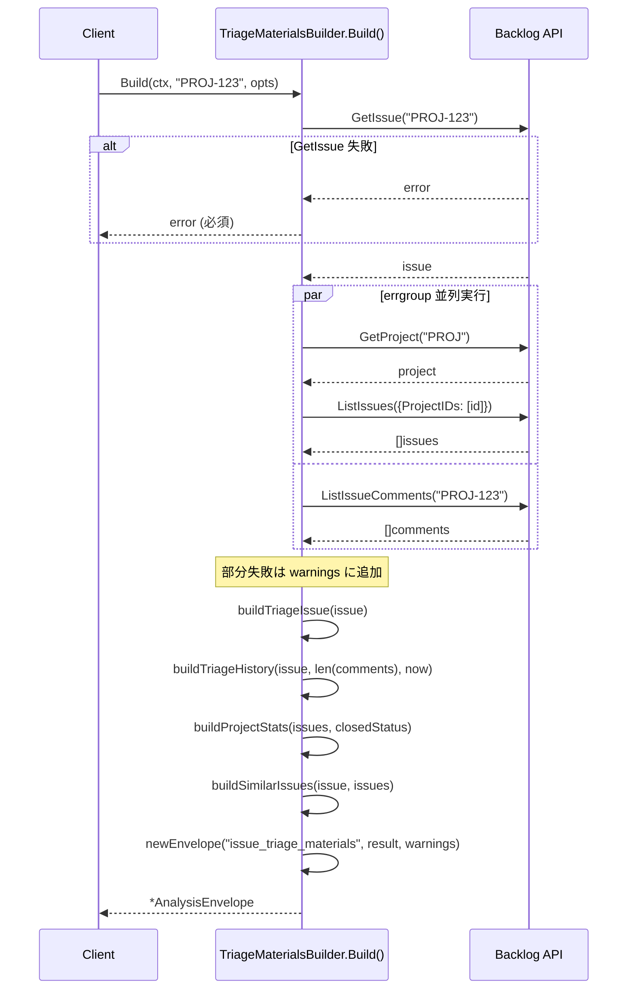

# マイルストーン M33: TriageMaterials ロジック

## 概要

課題の triage（仕分け）に必要な材料を収集して構造化 JSON で返す分析器を実装する。
**判断（priority/assignee の提案）は行わない。材料のみを deterministic に提供する。**

---

## スコープ

### 実装範囲

- `internal/analysis/triage.go` — TriageMaterialsBuilder の実装
- `internal/analysis/triage_test.go` — TDD テストスイート

### スコープ外

- CLI コマンド（M34 で実装）
- MCP ツール（M34 で実装）
- LLM 判断ロジック（SKILL 側で実装）

---

## 設計方針

### deterministic な材料提供に徹する

ロードマップ v3 Phase 2 の設計方針に従い、logvalet 本体は材料提供のみ。

| 責務 | 担当 |
|------|------|
| 課題属性・履歴・プロジェクト統計の構造化 JSON | `TriageMaterialsBuilder`（本 M33） |
| priority/assignee の提案 | `logvalet-triage` SKILL（M37） |

### 既存パターンの踏襲

- `IssueContextBuilder`（context.go）を最も近いパターンとして参照
- `BaseAnalysisBuilder` 継承 + `newEnvelope()` 使用
- `errgroup` による並列 API 呼び出し
- 部分失敗は `warnings` に追加（error は返さない）

---

## 出力構造（JSON）

```json
{
  "schema_version": "1",
  "resource": "issue_triage_materials",
  "generated_at": "2026-04-01T12:00:00Z",
  "profile": "default",
  "space": "heptagon",
  "base_url": "https://heptagon.backlog.com",
  "warnings": [],
  "analysis": {
    "issue": {
      "issue_key": "PROJ-123",
      "summary": "課題タイトル",
      "status": {"id": 1, "name": "未対応"},
      "priority": {"id": 2, "name": "高"},
      "issue_type": {"id": 1, "name": "バグ"},
      "assignee": {"id": 101, "name": "田中太郎"},
      "reporter": {"id": 102, "name": "佐藤花子"},
      "categories": [{"id": 1, "name": "フロントエンド"}],
      "milestones": [{"id": 1, "name": "v1.0"}],
      "due_date": "2026-04-30T00:00:00Z",
      "created": "2026-03-01T09:00:00Z",
      "updated": "2026-03-28T15:30:00Z"
    },
    "history": {
      "comment_count": 5,
      "days_since_created": 31,
      "days_since_updated": 4,
      "is_overdue": false,
      "is_stale": false
    },
    "project_stats": {
      "total_issues": 42,
      "by_status": {"未対応": 15, "処理中": 20, "完了": 7},
      "by_priority": {"高": 8, "中": 25, "低": 9},
      "by_assignee": {"田中太郎": 12, "佐藤花子": 8, "未割当": 22},
      "avg_close_days": 14.5
    },
    "similar_issues": {
      "same_category_count": 8,
      "same_milestone_count": 12,
      "priority_distribution": {"高": 3, "中": 4, "低": 1},
      "assignee_distribution": {"田中太郎": 5, "佐藤花子": 3}
    }
  }
}
```

---

## 型定義

```go
// TriageMaterials は triage 用材料の全体構造。
type TriageMaterials struct {
    Issue        TriageIssue        `json:"issue"`
    History      TriageHistory      `json:"history"`
    ProjectStats TriageProjectStats `json:"project_stats"`
    SimilarIssues TriageSimilar     `json:"similar_issues"`
}

// TriageIssue は対象課題の基本属性。
type TriageIssue struct {
    IssueKey  string          `json:"issue_key"`
    Summary   string          `json:"summary"`
    Status    *domain.IDName  `json:"status,omitempty"`
    Priority  *domain.IDName  `json:"priority,omitempty"`
    IssueType *domain.IDName  `json:"issue_type,omitempty"`
    Assignee  *domain.UserRef `json:"assignee,omitempty"`
    Reporter  *domain.UserRef `json:"reporter,omitempty"`
    Categories []domain.IDName `json:"categories"`
    Milestones []domain.IDName `json:"milestones"`
    DueDate   *time.Time      `json:"due_date,omitempty"`
    Created   *time.Time      `json:"created,omitempty"`
    Updated   *time.Time      `json:"updated,omitempty"`
}

// TriageHistory は課題の履歴サマリー。
type TriageHistory struct {
    CommentCount     int  `json:"comment_count"`
    DaysSinceCreated int  `json:"days_since_created"`
    DaysSinceUpdated int  `json:"days_since_updated"`
    IsOverdue        bool `json:"is_overdue"`
    IsStale          bool `json:"is_stale"`
}

// TriageProjectStats はプロジェクト全体の統計情報。
type TriageProjectStats struct {
    TotalIssues  int            `json:"total_issues"`
    ByStatus     map[string]int `json:"by_status"`
    ByPriority   map[string]int `json:"by_priority"`
    ByAssignee   map[string]int `json:"by_assignee"`
    AvgCloseDays float64        `json:"avg_close_days"`
}

// TriageSimilar は類似課題の分布情報。
type TriageSimilar struct {
    SameCategoryCount    int            `json:"same_category_count"`
    SameMilestoneCount   int            `json:"same_milestone_count"`
    PriorityDistribution map[string]int `json:"priority_distribution"`
    AssigneeDistribution map[string]int `json:"assignee_distribution"`
}
```

---

## API 呼び出し設計

### 必須（失敗 → error 返却）

1. `GetIssue(ctx, issueKey)` — 対象課題取得

### 並列取得（失敗 → warnings に追加）

errgroup で以下を並列実行:

2. `GetProject(ctx, projectKey)` → `ListIssues(ctx, {ProjectIDs: [id]})` — プロジェクト全課題
3. `ListIssueComments(ctx, issueKey, {})` — コメント一覧（件数のみ使用）

### 統計計算（API 結果から計算）

- `by_status`: issues の Status.Name でグループ化
- `by_priority`: issues の Priority.Name でグループ化
- `by_assignee`: issues の Assignee.Name でグループ化（nil は "未割当"）
- `avg_close_days`: `Created` → `Updated` の差分（完了ステータスのみ）
- `same_category_count`: 対象課題と同じカテゴリIDを持つ課題数
- `same_milestone_count`: 対象課題と同じマイルストーンIDを持つ課題数
- `priority_distribution`: 類似課題の優先度分布
- `assignee_distribution`: 類似課題の担当者分布

### avg_close_days の完了ステータス判定

完了系ステータス名として以下をデフォルト使用（`TriageMaterialsOptions.ClosedStatus` で上書き可）:
`["完了", "対応済み", "Closed", "Done", "Resolved"]`

---

## テスト設計書

### テストファイル

`internal/analysis/triage_test.go` — `package analysis`

### 正常系テストケース

| ID | テスト名 | 概要 |
|----|---------|------|
| T1 | `TestTriageMaterials_Build_BasicAttributes` | issue 基本属性が正しくマッピングされる |
| T2 | `TestTriageMaterials_Build_History` | history（コメント数・経過日数・stale/overdue）が正確 |
| T3 | `TestTriageMaterials_Build_ProjectStats_ByStatus` | by_status の集計が正確 |
| T4 | `TestTriageMaterials_Build_ProjectStats_ByPriority` | by_priority の集計が正確 |
| T5 | `TestTriageMaterials_Build_ProjectStats_ByAssignee` | by_assignee（未割当含む）が正確 |
| T6 | `TestTriageMaterials_Build_ProjectStats_AvgCloseDays` | avg_close_days が完了課題のみ計算 |
| T7 | `TestTriageMaterials_Build_SimilarIssues_Category` | 同カテゴリ課題の分布が正確 |
| T8 | `TestTriageMaterials_Build_SimilarIssues_Milestone` | 同マイルストーン課題の分布が正確 |
| T9 | `TestTriageMaterials_Build_NilFields` | assignee/category/milestone が nil でも panic しない |
| T10 | `TestTriageMaterials_Build_Envelope` | resource="issue_triage_materials"、warnings=[] |

### 異常系テストケース

| ID | テスト名 | 概要 |
|----|---------|------|
| E1 | `TestTriageMaterials_Build_IssueGetError` | GetIssue 失敗 → error 返却 |
| E2 | `TestTriageMaterials_Build_ProjectFetchError` | GetProject 失敗 → warning に追加、部分結果返却 |
| E3 | `TestTriageMaterials_Build_CommentsFetchError` | ListIssueComments 失敗 → warning に追加、コメント数 0 |
| E4 | `TestTriageMaterials_Build_ListIssuesError` | ListIssues 失敗 → warning に追加、stats は零値 |

### エッジケース

| ID | テスト名 | 概要 |
|----|---------|------|
| EC1 | `TestTriageMaterials_Build_EmptyProject` | プロジェクト課題 0件 → by_status/{} 空マップ |
| EC2 | `TestTriageMaterials_Build_NoCategoryMatch` | 同カテゴリなし → same_category_count=0 |
| EC3 | `TestTriageMaterials_Build_NoMilestoneMatch` | 同マイルストーンなし → same_milestone_count=0 |
| EC4 | `TestTriageMaterials_Build_NoClosedIssues` | 完了課題なし → avg_close_days=0 |
| EC5 | `TestTriageMaterials_Build_ClockInjection` | WithClock でテスト時刻を固定して days_since_updated を検証 |

### Mock 設計

```go
mc := backlog.NewMockClient()
mc.GetIssueFunc = func(ctx context.Context, issueKey string) (*domain.Issue, error) { ... }
mc.GetProjectFunc = func(ctx context.Context, projectKey string) (*domain.Project, error) { ... }
mc.ListIssuesFunc = func(ctx context.Context, opt backlog.ListIssuesOptions) ([]domain.Issue, error) { ... }
mc.ListIssueCommentsFunc = func(ctx context.Context, issueKey string, opt backlog.ListCommentsOptions) ([]domain.Comment, error) { ... }
```

---

## 実装手順

### Step 1: Red — テストファイル作成（失敗するテストを先に書く）

**ファイル**: `internal/analysis/triage_test.go`

- `package analysis` で宣言
- T1〜T10（正常系）, E1〜E4（異常系）, EC1〜EC5（エッジケース）を実装
- `backlog.MockClient` を使用
- `WithClock` で時刻を固定（`time.Date(2026, 4, 1, 12, 0, 0, 0, time.UTC)`）
- `go test ./internal/analysis/... -run TestTriageMaterials` で全テスト **Red** を確認

### Step 2: Green — 最小実装

**ファイル**: `internal/analysis/triage.go`

実装ステップ:

1. 型定義（`TriageMaterials`, `TriageIssue`, `TriageHistory`, `TriageProjectStats`, `TriageSimilar`）
2. `TriageMaterialsOptions` 型定義
3. `TriageMaterialsBuilder` 型定義 + `NewTriageMaterialsBuilder` コンストラクタ
4. `Build(ctx, issueKey, opt)` の実装:
   a. `GetIssue` — 失敗時 error 返却
   b. `errgroup` で `GetProject`+`ListIssues` と `ListIssueComments` を並列実行
   c. `buildTriageIssue(issue)` — 基本属性マッピング
   d. `buildTriageHistory(issue, commentCount, now)` — 履歴計算
   e. `buildProjectStats(issues, closedStatus)` — 統計集計
   f. `buildSimilarIssues(issue, issues)` — 類似課題分布
   g. `newEnvelope("issue_triage_materials", result, warnings)` — envelope 組み立て

### Step 3: Green 確認

```bash
go test ./internal/analysis/... -run TestTriageMaterials -v
go test ./...
go vet ./...
```

### Step 4: Refactor

- 重複コード（nil ガード、empty map 初期化）の共通化
- 関数の命名統一（`build` プレフィックス）
- コメントの整備

---

## シーケンス図



---

## アーキテクチャ整合性

### 既存パターンとの整合性

| 項目 | 既存パターン | 本実装 |
|------|------------|-------|
| 構造体継承 | `BaseAnalysisBuilder` 埋め込み | 同様 |
| コンストラクタ | `NewXxxBuilder(client, profile, space, baseURL, opts...)` | 同様 |
| メインメソッド | `Build(ctx, key, options) (*AnalysisEnvelope, error)` | 同様 |
| 並列処理 | `errgroup.WithContext` | 同様 |
| 部分失敗 | `warnings` スライスに追加 | 同様 |
| テスト時刻 | `WithClock(func() time.Time)` | 同様 |
| resource 名 | スネークケース文字列 | `"issue_triage_materials"` |

### 依存パッケージ

```go
import (
    "context"
    "fmt"
    "sync"
    "time"

    "github.com/youyo/logvalet/internal/backlog"
    "github.com/youyo/logvalet/internal/domain"
    "golang.org/x/sync/errgroup"
)
```

> `digest.DigestLLMHints` は **含めない**。TriageMaterials は材料のみで LLM ヒントは不要（LLM 判断は SKILL 側）。

---

## リスク評価

| リスク | 重大度 | 対策 |
|--------|--------|------|
| `avg_close_days` の完了判定が不正確 | Medium | デフォルト閉鎖ステータスリストを設定可能にする（`TriageMaterialsOptions.ClosedStatus`） |
| N+1 問題（ListIssues で大量課題）| Low | errgroup で並列化、ページネーションなし（Backlog API のデフォルト上限は100件） |
| 類似課題の定義が曖昧 | Low | 同カテゴリ OR 同マイルストーンで独立集計（AND 条件は不採用） |
| `similar_issues` が対象課題自身を含む | Low | 集計時に自課題を除外（`issue.IssueKey != targetKey`） |
| map の nil アクセス | Low | 各 build 関数で空 map を初期化してから集計 |

---

## チェックリスト

### 観点1: 実装実現可能性

- [x] 手順の抜け漏れがないか（Step 1〜4 で一貫した流れ）
- [x] 各ステップが十分に具体的か（関数名・引数まで明記）
- [x] 依存関係が明示されているか（Step 1 → Step 2 → Step 3 → Step 4）
- [x] 変更対象ファイルが網羅されているか（triage.go + triage_test.go）
- [x] 影響範囲が正確に特定されているか（既存ファイルへの変更なし）

### 観点2: TDDテスト設計の品質

- [x] 正常系テストケースが網羅されているか（T1〜T10）
- [x] 異常系テストケースが定義されているか（E1〜E4）
- [x] エッジケースが考慮されているか（EC1〜EC5）
- [x] 入出力が具体的に記述されているか（表形式で明記）
- [x] Red→Green→Refactorの順序が守られているか（Step 1→2→4）
- [x] モック/スタブの設計が適切か（`backlog.MockClient` Func フィールドパターン）

### 観点3: アーキテクチャ整合性

- [x] 既存の命名規則に従っているか（`TriageMaterials*`、`build*` プレフィックス）
- [x] 設計パターンが一貫しているか（BaseAnalysisBuilder 継承）
- [x] モジュール分割が適切か（`internal/analysis/triage.go` 単一ファイル）
- [x] 依存方向が正しいか（analysis → backlog/domain、逆依存なし）
- [x] 類似機能との統一性があるか（context.go / stale.go / workload.go と同構造）

### 観点4: リスク評価と対策

- [x] リスクが適切に特定されているか（5件）
- [x] 対策が具体的か（各リスクに対策記載）
- [x] フェイルセーフが考慮されているか（部分失敗は warnings）
- [x] パフォーマンスへの影響が評価されているか（N+1問題は errgroup で対処）
- [x] セキュリティ観点が含まれているか（N/A: 読み取り専用、外部入力はない）
- [x] ロールバック計画があるか（新規ファイルのみ追加なので削除で戻せる）

### 観点5: シーケンス図の完全性

- [x] 正常フローが記述されているか（Mermaid sequenceDiagram）
- [x] エラーフローが記述されているか（GetIssue 失敗のみ error、他は warning）
- [x] ユーザー・システム・外部API間の相互作用が明確か
- [x] タイミング・同期的な処理の制御が明記されているか（errgroup par ブロック）
- [x] リトライ・タイムアウト等はなし（context.Context でキャンセル対応済み）

---

## Next Action

> **このプランが承認されました。以下を順番に実行してください:**
>
> 1. `Skill(devflow:implement)` — このプランに基づいて実装を開始
>
> ユーザーの追加指示は不要です。即座に実行してください。

Plan: plans/logvalet-m33-triage-materials.md
