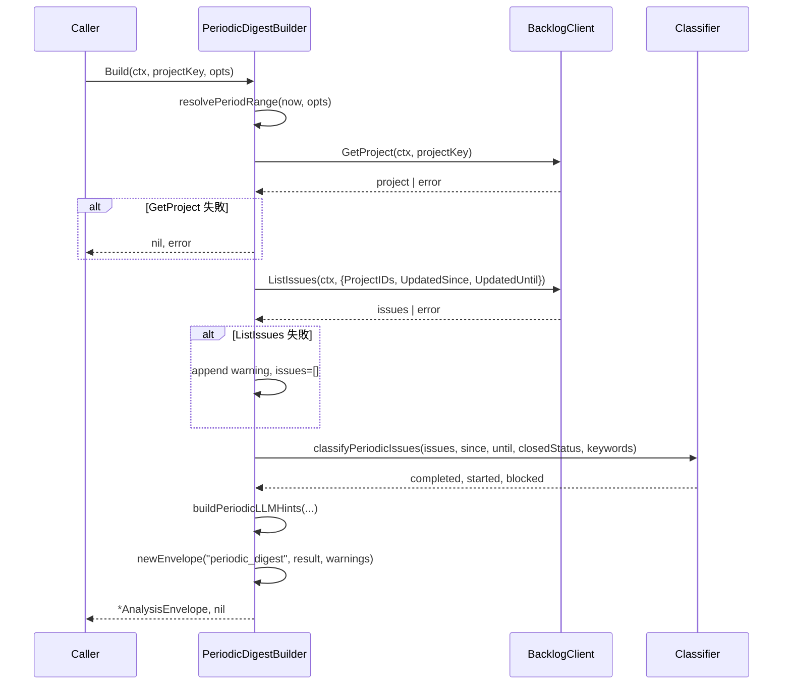
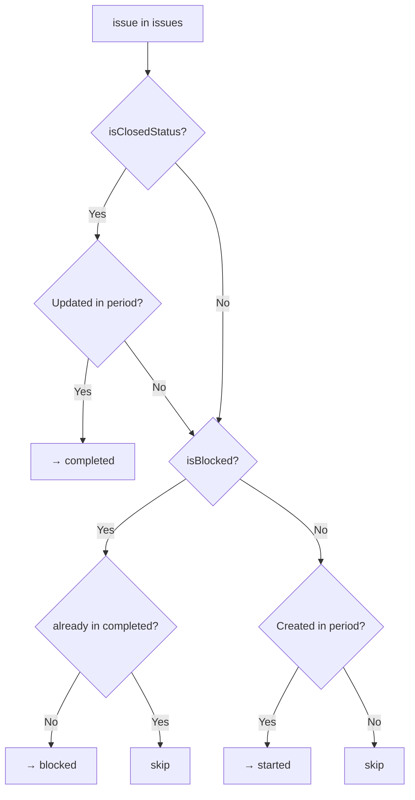

# マイルストーン M35: Weekly/Daily Digest ロジック

## 概要

期間ベースの課題活動集約（completed/started/blocked）を deterministic に返す `PeriodicDigestBuilder` を `internal/analysis/periodic.go` に実装する。M36 の CLI/MCP コマンド実装の基盤となる。

## スコープ

### 実装範囲
- `internal/analysis/periodic.go` — `PeriodicDigestBuilder` と関連型
- `internal/analysis/periodic_test.go` — TDD ユニットテスト

### スコープ外
- CLI コマンド (`logvalet digest weekly/daily`) → M36
- MCP tool (`logvalet_digest_weekly/daily`) → M36
- LLM 判断・テキスト要約 → SKILL 側（M37）
- 複数プロジェクト並列取得のバッチ最適化 → M36 以降で検討

---

## データ設計

### PeriodicDigestOptions（入力）

```go
type PeriodicDigestOptions struct {
    // Period は集計種別。"weekly" | "daily"。
    Period string
    // Since は集計開始日時（UTC）。ゼロ値の場合は now - 7days (weekly) / now - 1day (daily)。
    Since *time.Time
    // Until は集計終了日時（UTC）。ゼロ値の場合は now。
    Until *time.Time
    // ClosedStatus は完了とみなすステータス名リスト。空の場合は defaultClosedStatus を使用。
    ClosedStatus []string
    // BlockedKeywords はブロッカー判定キーワード（ステータス名または課題タイトル）。
    BlockedKeywords []string
}
```

### PeriodicDigest（出力 — analysis フィールド）

```json
{
  "project_key": "PROJ",
  "period": "weekly",
  "since": "2026-03-25T00:00:00Z",
  "until": "2026-04-01T00:00:00Z",
  "summary": {
    "completed_count": 5,
    "started_count": 3,
    "blocked_count": 1,
    "total_active_count": 12
  },
  "completed": [
    {
      "issue_key": "PROJ-10",
      "summary": "ログイン機能実装",
      "assignee": {"id": 101, "name": "田中太郎"},
      "completed_at": "2026-03-28T09:00:00Z"
    }
  ],
  "started": [
    {
      "issue_key": "PROJ-20",
      "summary": "ダッシュボード実装",
      "assignee": {"id": 102, "name": "佐藤花子"},
      "started_at": "2026-03-27T14:00:00Z"
    }
  ],
  "blocked": [
    {
      "issue_key": "PROJ-30",
      "summary": "外部API連携",
      "assignee": {"id": 101, "name": "田中太郎"},
      "block_signals": ["ステータス名がブロッカーキーワードに一致"]
    }
  ],
  "llm_hints": {
    "primary_entities": ["project:PROJ"],
    "open_questions": [],
    "suggested_next_actions": []
  }
}
```

### 判定ロジック

| 分類 | 判定条件 |
|------|---------|
| **completed** | `Updated` が `[since, until]` 内 かつ `Status.Name` が `ClosedStatus` に含まれる |
| **started** | `Created` が `[since, until]` 内 かつ `Status.Name` が `ClosedStatus` に含まれない |
| **blocked** | `Status.Name` または `Summary` が `BlockedKeywords` のいずれかに一致する（期間問わず・進行中のみ） |

**blocked のデフォルトキーワード**: `["対応中断", "保留", "ブロック", "blocked", "on hold"]`

**API 呼び出し戦略**:
- `ListIssues` に `UpdatedSince=since, UpdatedUntil=until` を渡して期間フィルタ（completed/started の取得効率化）
- blocked は別途 `ListIssues` をキーワードなしで呼び出し（全件から検出）← N+1 回避のため1回で取得してメモリ内フィルタ

**注意**: Backlog API の `UpdatedSince/Until` フィルタは `Updated` フィールドに基づく。`Created` も期間内に収めるため、`started` の精度は近似値となる（`Created` が `since` より前でも `Updated` が期間内なら取得される）。この近似は acceptable とし、警告なし。

---

## TDD テスト設計書

### Red フェーズ（先にテストを書く）

#### TC-01: 正常系 — weekly 集計（完了・開始・ブロック混在）

```
入力:
  projectKey: "PROJ"
  options.Period: "weekly"
  options.Since: 2026-03-25T00:00:00Z
  options.Until: 2026-04-01T00:00:00Z
  options.ClosedStatus: ["完了"]
  options.BlockedKeywords: ["ブロック"]

モックデータ:
  GetProject → {ID: 1, ProjectKey: "PROJ"}
  ListIssues（期間フィルタ付き） →
    - PROJ-10: Status="完了", Updated=2026-03-28, Created=2026-03-20
    - PROJ-20: Status="処理中", Updated=2026-03-27, Created=2026-03-27
    - PROJ-30: Status="ブロック", Updated=2026-03-29, Created=2026-03-15

期待出力:
  summary.completed_count: 1  (PROJ-10)
  summary.started_count: 1    (PROJ-20: Created が since 以降)
  summary.blocked_count: 1    (PROJ-30)
  completed[0].issue_key: "PROJ-10"
  started[0].issue_key: "PROJ-20"
  blocked[0].issue_key: "PROJ-30"
  envelope.resource: "periodic_digest"
```

#### TC-02: 正常系 — daily 集計

```
入力:
  Period: "daily"
  Since: 2026-04-01T00:00:00Z（ゼロ値 → now - 1day = 2026-03-31T00:00:00Z）
  Until: ゼロ値 → now

モックデータ:
  GetProject → {ID: 1}
  ListIssues → 空スライス

期待出力:
  summary: {completed_count: 0, started_count: 0, blocked_count: 0, total_active_count: 0}
  completed: []
  started: []
  blocked: []
```

#### TC-03: 正常系 — Since/Until ゼロ値でデフォルト計算

```
入力:
  Period: "weekly"
  Since: nil（ゼロ値）
  Until: nil（ゼロ値）
  now: 2026-04-01T12:00:00Z（clock injection）

期待:
  API呼び出し時の UpdatedSince ≈ 2026-03-25T12:00:00Z（7日前）
  API呼び出し時の UpdatedUntil ≈ 2026-04-01T12:00:00Z
  envelope.analysis.since == 2026-03-25T12:00:00Z
  envelope.analysis.until == 2026-04-01T12:00:00Z
```

#### TC-04: 異常系 — GetProject 失敗

```
入力: projectKey: "NONEXIST"
モック: GetProject → errors.New("not found")

期待:
  error != nil（Build がエラーを返す）
```

#### TC-05: 異常系 — ListIssues 失敗（partial result）

```
モック:
  GetProject → 成功
  ListIssues → errors.New("API error")

期待:
  error == nil（部分結果で返す）
  envelope.warnings に "issues_fetch_failed" コード
  summary: {completed: 0, started: 0, blocked: 0}
```

#### TC-06: エッジケース — ClosedStatus 空（デフォルト使用）

```
入力: ClosedStatus: nil（空）
期待: defaultClosedStatus（"完了", "対応済み", "Closed", "Done", "Resolved"）が使われる
```

#### TC-07: エッジケース — completed と started の重複除外

```
シナリオ: Period 内に Created かつ Updated が完了ステータスの課題
期待: completed に含まれる（started には含まれない）
```

#### TC-08: エッジケース — blocked が completed と重複する場合

```
シナリオ: blocked キーワードに一致するが Updated も期間内で ClosedStatus でもある
期待: completed に含まれる（blocked には含まれない — completed 優先）
```

#### TC-09: エッジケース — assignee nil の課題

```
入力: assignee が nil の課題が completed/started/blocked に含まれる
期待: assignee フィールドが null（JSON では省略されない、null を返す）
```

#### TC-10: 正常系 — LLMHints 生成

```
入力: completed=3, started=2, blocked=1
期待:
  llm_hints.primary_entities: ["project:PROJ"]
  llm_hints.open_questions: ["1件のブロック課題があります"]（blocked > 0 の場合）
```

### Green フェーズ（テストが通る最小限の実装）

1. 型定義（`PeriodicDigestOptions`, `PeriodicDigest`, `PeriodicSummary`, `PeriodicIssueRef`）
2. `PeriodicDigestBuilder` 構造体 + `NewPeriodicDigestBuilder` コンストラクタ
3. `Build()` メソッド：
   a. Since/Until のデフォルト計算
   b. `GetProject` → エラー時は error 返却
   c. `ListIssues(UpdatedSince, UpdatedUntil)` → エラー時は warning + partial
   d. `classifyIssues()` で completed/started/blocked を分類
   e. `buildPeriodicLLMHints()` でヒント生成
   f. `newEnvelope("periodic_digest", ...)` で包んで返却

### Refactor フェーズ

- `classifyIssues()` のロジックを小さい純粋関数に分割
- `buildPeriodicLLMHints()` の条件分岐を整理
- テーブル駆動テストの共通フィクスチャを helper 関数に抽出

---

## 実装手順

### Step 1: テストファイル作成（Red）

**ファイル**: `internal/analysis/periodic_test.go`
**内容**: TC-01〜TC-10 を実装

```go
package analysis

import (
    "context"
    "errors"
    "testing"
    "time"

    "github.com/youyo/logvalet/internal/backlog"
    "github.com/youyo/logvalet/internal/domain"
)

var fixedNowPeriodic = time.Date(2026, 4, 1, 12, 0, 0, 0, time.UTC)
```

依存: なし

### Step 2: 型定義と Builder 骨格（Red → Green 途中）

**ファイル**: `internal/analysis/periodic.go`
**内容**:
- `PeriodicDigestOptions` 型
- `PeriodicDigest`, `PeriodicSummary`, `PeriodicIssueRef`, `PeriodicBlockedIssue` 型
- `PeriodicDigestBuilder` 構造体
- `NewPeriodicDigestBuilder` コンストラクタ
- `Build()` シグネチャのみ（stub: `return nil, errors.New("not implemented")`）

依存: Step 1

### Step 3: Build() 実装（Green）

**ファイル**: `internal/analysis/periodic.go`
**内容**: Build() の全実装

```go
func (b *PeriodicDigestBuilder) Build(
    ctx context.Context,
    projectKey string,
    opt PeriodicDigestOptions,
) (*AnalysisEnvelope, error) {
    // 1. Since/Until 解決
    since, until := resolvePeriodRange(b.now(), opt)

    // 2. ClosedStatus 解決
    closedStatus := opt.ClosedStatus
    if len(closedStatus) == 0 {
        closedStatus = defaultClosedStatus
    }

    // 3. BlockedKeywords 解決
    blockedKeywords := opt.BlockedKeywords
    if len(blockedKeywords) == 0 {
        blockedKeywords = defaultBlockedKeywords
    }

    // 4. GetProject（必須）
    project, err := b.client.GetProject(ctx, projectKey)
    if err != nil {
        return nil, fmt.Errorf("get project %s: %w", projectKey, err)
    }

    // 5. ListIssues（期間フィルタ付き）
    var warnings []domain.Warning
    issues, err := b.client.ListIssues(ctx, backlog.ListIssuesOptions{
        ProjectIDs:   []int{project.ID},
        UpdatedSince: &since,
        UpdatedUntil: &until,
    })
    if err != nil {
        warnings = append(warnings, domain.Warning{
            Code:      "issues_fetch_failed",
            Message:   fmt.Sprintf("failed to list issues: %v", err),
            Component: "periodic_digest",
            Retryable: true,
        })
        issues = []domain.Issue{}
    }

    // 6. 課題分類
    completed, started, blocked := classifyPeriodicIssues(issues, since, until, closedStatus, blockedKeywords)

    // 7. 結果組み立て
    result := &PeriodicDigest{
        ProjectKey: projectKey,
        Period:     opt.Period,
        Since:      since,
        Until:      until,
        Summary: PeriodicSummary{
            CompletedCount:   len(completed),
            StartedCount:     len(started),
            BlockedCount:     len(blocked),
            TotalActiveCount: len(issues),
        },
        Completed: completed,
        Started:   started,
        Blocked:   blocked,
        LLMHints:  buildPeriodicLLMHints(projectKey, len(completed), len(started), len(blocked)),
    }

    return b.newEnvelope("periodic_digest", result, warnings), nil
}
```

依存: Step 2

### Step 4: ヘルパー関数実装

**ファイル**: `internal/analysis/periodic.go`（続き）
**内容**:
- `resolvePeriodRange(now time.Time, opt PeriodicDigestOptions) (since, until time.Time)`
- `classifyPeriodicIssues(issues, since, until, closedStatus, blockedKeywords) (completed, started, blocked)`
- `buildPeriodicLLMHints(projectKey string, completedN, startedN, blockedN int) digest.DigestLLMHints`
- `isBlockedIssue(issue *domain.Issue, keywords []string, closedSet map[string]bool) bool`

依存: Step 3

### Step 5: テスト全通過確認（Green 完了）

```bash
go test ./internal/analysis/... -run TestPeriodicDigest -v
go test ./internal/analysis/...
go vet ./...
```

依存: Step 4

### Step 6: Refactor

- テストコードの helper 関数整理
- `classifyPeriodicIssues()` の純粋関数分割
- コメント・変数名整備

依存: Step 5（テスト全通過後）

---

## アーキテクチャ整合性

### 既存パターンとの整合性

| 観点 | 既存パターン | M35 の準拠 |
|------|------------|-----------|
| 構造体 | `BaseAnalysisBuilder` 埋め込み | PeriodicDigestBuilder も同様 |
| コンストラクタ | `NewXxxBuilder(client, profile, space, baseURL, opts...)` | 同様 |
| clock injection | `WithClock(now)` オプション | 同様 |
| 部分失敗 | GetProject 失敗 → error、ListIssues 失敗 → warning | 同様（triage.go パターン準拠） |
| 出力 | `newEnvelope("resource_name", result, warnings)` | 同様 |
| defaultClosedStatus | triage.go で定義済み | 再利用（同ファイル内定数を参照） |

### 新規型

```
PeriodicDigestBuilder    ← analysis パッケージ内、既存 Builder と同等
PeriodicDigest           ← Analysis フィールドの型
PeriodicSummary          ← サマリー集計
PeriodicIssueRef         ← completed/started の課題参照
PeriodicBlockedIssue     ← blocked の課題参照（block_signals フィールド追加）
PeriodicDigestOptions    ← Build() のオプション
```

---

## シーケンス図

### 正常フロー



### 分類ロジック（classifyPeriodicIssues）



---

## リスク評価

| リスク | 重大度 | 対策 |
|--------|--------|------|
| `UpdatedSince/Until` フィルタが Backlog API で不完全動作 | Medium | `since/until` をメモリ内再フィルタで補完（二重チェック） |
| `started` の近似精度（Created が期間外でも ListIssues に含まれる可能性） | Low | ドキュメントに「近似値」を明記し、分類時に `Created` を追加チェック |
| `defaultBlockedKeywords` が日本語固有でグローバル環境に不適合 | Low | `options.BlockedKeywords` で上書き可能な設計とする |
| `blocked` と `completed` の重複（完了だが以前ブロックだった） | Low | 優先度: completed > blocked > started で排他制御 |
| TotalActiveCount の定義が不明確 | Low | 「ListIssues で取得した件数（期間フィルタ適用後）」と明記 |
| Go 1.26 の最新機能の利用 | Low | 既存コードと同じ慣用表現のみ使用 |

---

## ドキュメント更新計画（実装後）

### README.md / README.ja.md
M36 完了後に更新（CLI コマンド追加時）。M35 単体では公開コマンド追加なし。

### CHANGELOG
M35 完了コミット後に追記:
```
### Added
- internal/analysis: PeriodicDigestBuilder — Weekly/Daily Digest ロジック (M35)
```

---

## チェックリスト: プラン完成度確認

### 観点1: 実装実現可能性（5項目）
- [x] 手順の抜け漏れがないか（Step 1〜6 で一貫した流れ）
- [x] 各ステップが十分に具体的か（ファイル名・関数シグネチャ・依存明示）
- [x] 依存関係が明示されているか（「Step X の後で Step Y」と明記）
- [x] 変更対象ファイルが網羅されているか（periodic.go, periodic_test.go）
- [x] 影響範囲が正確に特定されているか（M36 の CLI/MCP 実装に影響）

### 観点2: TDDテスト設計の品質（6項目）
- [x] 正常系テストケースが網羅されているか（TC-01, TC-02, TC-03, TC-10）
- [x] 異常系テストケースが定義されているか（TC-04, TC-05）
- [x] エッジケースが考慮されているか（TC-06〜TC-09）
- [x] 入出力が具体的に記述されているか（具体的な時刻・期待値を明記）
- [x] Red→Green→Refactorの順序が守られているか（Step 1→3→6）
- [x] モック/スタブの設計が適切か（backlog.MockClient の Func フィールドパターン）

### 観点3: アーキテクチャ整合性（5項目）
- [x] 既存の命名規則に従っているか（PeriodicDigestBuilder、Build() メソッド）
- [x] 設計パターンが一貫しているか（BaseAnalysisBuilder 埋め込みパターン）
- [x] モジュール分割が適切か（analysis パッケージ内、CLI/MCP とは分離）
- [x] 依存方向が正しいか（analysis → backlog → domain の方向を維持）
- [x] 類似機能との統一性があるか（triage.go / health.go と同構造）

### 観点4: リスク評価と対策（6項目）
- [x] リスクが適切に特定されているか（API フィルタの精度、重複分類等）
- [x] 対策が具体的か（メモリ内再フィルタ、優先度排他制御）
- [x] フェイルセーフが考慮されているか（ListIssues 失敗 → warning + 空結果）
- [x] パフォーマンスへの影響が評価されているか（API 呼び出し1回で完結）
- [x] セキュリティ観点が含まれているか（N/A — 読み取り専用、既存 auth を踏襲）
- [x] ロールバック計画があるか（新規ファイル追加のみ、既存コードへの変更なし）

### 観点5: シーケンス図の完全性（5項目）
- [x] 正常フローが記述されているか（Mermaid シーケンス図）
- [x] エラーフローが記述されているか（GetProject 失敗、ListIssues 失敗）
- [x] ユーザー・システム・外部APIの相互作用が明確か（Caller → Builder → BacklogClient）
- [x] タイミング・同期的な処理の制御が明記されているか（同期処理、goroutine なし）
- [x] リトライ・タイムアウト等の例外ハンドリングが図に含まれているか（alt ブロックで明記）

---

## Next Action

> **このプランが承認された場合、以下を順番に実行してください:**
>
> 1. `internal/analysis/periodic_test.go` を作成（TC-01〜TC-10）— Red フェーズ
> 2. `internal/analysis/periodic.go` を作成（型定義 + Build() + helper 関数）— Green フェーズ
> 3. `go test ./internal/analysis/...` でテスト全通過を確認
> 4. `go vet ./...` でコード品質確認
> 5. Refactor フェーズ（テストを緑のまま整理）
> 6. `git add internal/analysis/periodic.go internal/analysis/periodic_test.go`
> 7. `git commit -m "feat(analysis): PeriodicDigestBuilder を TDD で実装 (M35)"`

Plan: plans/logvalet-m35-periodic-digest.md
