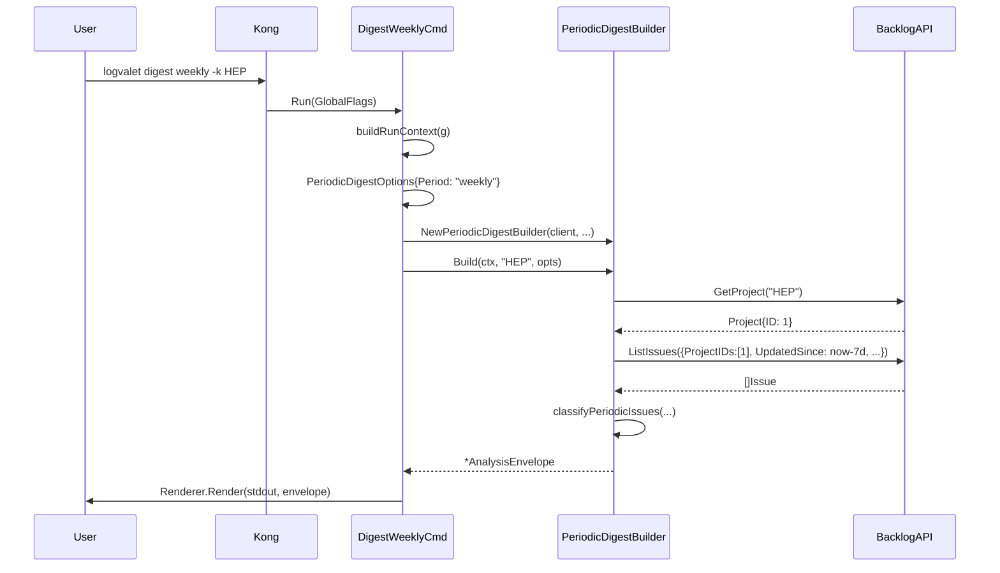
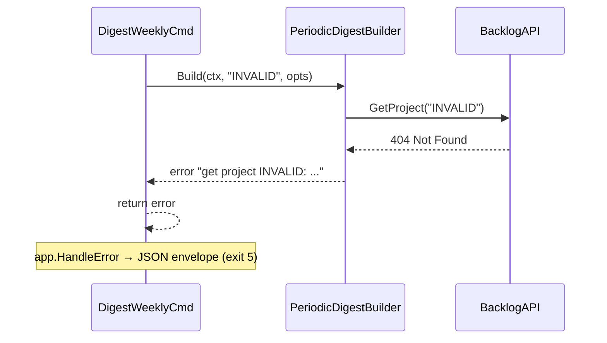

# マイルストーン M36: Weekly/Daily Digest CLI + MCP

## 概要

M35 で実装した `PeriodicDigestBuilder` を CLI コマンドと MCP ツールとして公開する。
`logvalet digest weekly -k PROJECT` / `logvalet digest daily -k PROJECT` の 2 コマンドと、
MCP ツール `logvalet_digest_weekly` / `logvalet_digest_daily` を追加する。

## スコープ

### 実装範囲

- `internal/cli/digest_cmd.go` の `DigestCmd` を子コマンドグループに変更（**Breaking: Runメソッド削除**）
  - 既存の unified digest 機能を `DigestUnifiedCmd` として `Unified` フィールドに移動
  - `Weekly` / `Daily` フィールドを追加
- `internal/cli/digest_weekly.go` — `DigestWeeklyCmd` (新規)
- `internal/cli/digest_daily.go` — `DigestDailyCmd` (新規)
- `internal/cli/digest_weekly_test.go` — Kong パーステスト (新規)
- `internal/cli/digest_daily_test.go` — Kong パーステスト (新規)
- `internal/mcp/tools_analysis.go` — `logvalet_digest_weekly` / `logvalet_digest_daily` 追加

### スコープ外

- `PeriodicDigestBuilder` 本体の変更（M35 完了済み）
- E2E テスト（M39 で実施）
- スキル定義（M37 で作成）

---

## 重要な設計判断: DigestCmd のリファクタリング

### 背景

Kong は **「Run メソッドを持つ struct」に子コマンドを追加すると、親コマンドの Run が実行不可能になる** という制約がある。

```
# 検証結果（/tmp/kongtest）
# RunメソッドありのDigestCmdにWeeklyCmdを追加 → 以下のエラー
$ test digest --since 2026-01-01
Parse error: expected "weekly"
```

### 解決策: DigestCmd をグループ化

```go
// Before: フラットコマンド（Run あり）
type DigestCmd struct { Since string `required:""`; ... }
func (c *DigestCmd) Run(g *GlobalFlags) error { ... }

// After: グループコマンド（Run なし）
type DigestCmd struct {
    Unified DigestUnifiedCmd `cmd:"" name:"unified" help:"generate unified digest"`
    Weekly  DigestWeeklyCmd  `cmd:"" help:"generate weekly periodic digest"`
    Daily   DigestDailyCmd   `cmd:"" help:"generate daily periodic digest"`
}
```

### 後方互換性の方針（重要）

`logvalet digest --since 2026-01-01` という既存構文は **即時廃止**（logvalet は内部ツールであり SemVer major bump 相当の変更として許容）。

代替構文: `logvalet digest unified --since 2026-01-01`

**移行メッセージ**: Kong のパースエラーとして `expected "daily", "unified", or "weekly"` が表示される。この自動メッセージで十分とする。

**廃止テスト**: `TestDigestCmd_OldSyntax_ParseError` を追加し、旧構文がパースエラーになることを明示的に確認する。

### 既存テストへの影響

`internal/cli/digest_cmd_test.go` は `UnifiedDigestBuilder` を直接テストしており、
`DigestCmd` 構造体に依存していない。**変更による既存テスト破壊なし**（確認済み）。

ただし `go test ./...`（フルスイート）で全テストが green であることを Step 5 で確認すること。

---

## テスト設計書

### TDD: Red → Green → Refactor

#### Red フェーズ（先に失敗するテストを書く）

**T1: digest_weekly_test.go**

| ID | テスト名 | 入力 | 期待結果 |
|----|---------|------|---------|
| W1 | `TestDigestWeeklyCmd_KongParse_Default` | `digest weekly -k HEP` | `ProjectKey="HEP"`, Since=nil, Until=nil |
| W2 | `TestDigestWeeklyCmd_KongParse_WithSinceUntil` | `digest weekly -k HEP --since 2026-03-25 --until 2026-03-31` | since/until が正しくパース |
| W3 | `TestDigestWeeklyCmd_KongParse_MissingProjectKey` | `digest weekly` | エラーを返す |
| W4 | `TestDigestWeeklyCmd_Build_CallsPeriodicDigestBuilder` | MockClient + Build呼び出し | Period="weekly", Resource="periodic_digest" |

**T2: digest_daily_test.go**

| ID | テスト名 | 入力 | 期待結果 |
|----|---------|------|---------|
| D1 | `TestDigestDailyCmd_KongParse_Default` | `digest daily -k HEP` | `ProjectKey="HEP"` |
| D2 | `TestDigestDailyCmd_KongParse_WithSince` | `digest daily -k HEP --since 2026-03-31` | since が正しくパース |
| D3 | `TestDigestDailyCmd_KongParse_MissingProjectKey` | `digest daily` | エラーを返す |
| D4 | `TestDigestDailyCmd_Build_CallsPeriodicDigestBuilder` | MockClient + Build呼び出し | Period="daily", Resource="periodic_digest" |

**T3: digest_cmd の既存互換**

| ID | テスト名 | 入力 | 期待結果 |
|----|---------|------|---------|
| U1 | `TestDigestUnified_KongParse` | `digest unified --since 2026-03-01` | パース成功 |
| U2 | `TestDigestCmd_OldSyntax_ParseError` | `digest --since 2026-03-01` | パースエラー（旧構文廃止を明示確認） |
| U3 | `TestDigestCmd_buildScope_*` (既存) | 変更なし | 全 PASS |

**T4: MCP ツールテスト（`internal/mcp/tools_analysis_test.go` 追加）**

| ID | テスト名 | シナリオ | 期待結果 |
|----|---------|---------|---------|
| M1 | `TestDigestWeekly_MCPTool_Registered` | RegisterAnalysisTools 後にツール名を確認 | "logvalet_digest_weekly" が登録済み |
| M2 | `TestDigestWeekly_MCPTool_Success` | project_key="HEP", MockClient正常 | Resource="periodic_digest", Period="weekly" |
| M3 | `TestDigestWeekly_MCPTool_MissingProjectKey` | project_key 省略 | error "project_key is required" |
| M4 | `TestDigestWeekly_MCPTool_InvalidDate` | since="not-a-date" | error（日付パースエラー） |
| M5 | `TestDigestWeekly_MCPTool_ListIssuesFailed` | ListIssues がエラー返却 | warnings 付き partial result（error ではない） |
| M6 | `TestDigestDaily_MCPTool_*` | daily 版の同等テスト | 対応する期待結果 |

#### Green フェーズ（最小実装）

- `DigestWeeklyCmd.Run` と `DigestDailyCmd.Run` を実装
- `DigestCmd` をグループ構造に変更
- 既存の `DigestCmd.Run` のロジックを `DigestUnifiedCmd.Run` に移動

#### Refactor フェーズ

- `since/until` のパース処理を共通ヘルパー関数 `parseSinceUntilFlags` に抽出（weekly/daily で共有）
- 既存 `resolvePeriod` との統一

### 異常系テスト

| ID | シナリオ | 期待動作 |
|----|---------|---------|
| E1 | `--since` に不正日付 | エラーを返す |
| E2 | `--until` < `--since` | PeriodicDigestBuilder に渡す（バリデーションはロジック側） |
| E3 | GetProject が 404 | エラー返却（exit code 5 相当） |
| E4 | ListIssues が失敗 | warnings に追加して部分結果を返す（PeriodicDigestBuilder の既定動作） |

### モック設計

```go
mc := backlog.NewMockClient()
mc.GetProjectFunc = func(_ context.Context, key string) (*domain.Project, error) {
    return &domain.Project{ID: 1, ProjectKey: key, Name: "Test"}, nil
}
mc.ListIssuesFunc = func(_ context.Context, _ backlog.ListIssuesOptions) ([]domain.Issue, error) {
    return []domain.Issue{}, nil
}
```

---

## 実装手順

### Step 1: テストを先に作成（Red）

**ファイル**: `internal/cli/digest_weekly_test.go`, `internal/cli/digest_daily_test.go`

```
依存: なし
概要: Kong パーステストと Build 呼び出しテストを先に書く
     → この時点ではコンパイルエラー（Red）
```

### Step 2: DigestCmd のリファクタリング（Green への準備）

**ファイル**: `internal/cli/digest_cmd.go`

変更内容:
1. `DigestCmd.Run` メソッドを削除
2. 既存フィールドを `DigestUnifiedCmd` 構造体に移動
3. `DigestCmd` に `Unified`, `Weekly`, `Daily` フィールドを追加

```go
// digest_cmd.go（変更後）
type DigestCmd struct {
    Unified DigestUnifiedCmd `cmd:"" name:"unified" help:"generate unified digest (issues + activities)"`
    Weekly  DigestWeeklyCmd  `cmd:"" help:"generate weekly periodic digest"`
    Daily   DigestDailyCmd   `cmd:"" help:"generate daily periodic digest"`
}

// DigestUnifiedCmd は旧 DigestCmd のフィールドと Run を継承
type DigestUnifiedCmd struct {
    Project   []string `short:"k" help:"project key (multiple allowed)"`
    User      []string `help:"user (me, numeric ID, or user name, multiple allowed)"`
    Team      []string `help:"team ID or name (multiple allowed)"`
    Issue     []string `help:"issue key (multiple allowed)"`
    Since     string   `help:"period start (today, this-week, this-month, YYYY-MM-DD)" required:""`
    Until     string   `help:"period end (today, this-week, this-month, YYYY-MM-DD)"`
    DueDate   string   `help:"due date filter (...)"`
    StartDate string   `help:"start date filter (...)"`
}
```

> **注意**: `DigestUnifiedCmd.Run` は旧 `DigestCmd.Run` のロジックをそのまま移植。

### Step 3: DigestWeeklyCmd / DigestDailyCmd 実装（Green）

**ファイル**: `internal/cli/digest_weekly.go`, `internal/cli/digest_daily.go`

```go
// digest_weekly.go
type DigestWeeklyCmd struct {
    ProjectKey string  `short:"k" required:"" help:"project key"`
    Since      string  `help:"since date (YYYY-MM-DD, optional)"`
    Until      string  `help:"until date (YYYY-MM-DD, optional)"`
}

func (c *DigestWeeklyCmd) Run(g *GlobalFlags) error {
    ctx := context.Background()
    rc, err := buildRunContext(g)
    if err != nil {
        return err
    }

    opts := analysis.PeriodicDigestOptions{Period: "weekly"}
    if c.Since != "" {
        t, err := parseDate(c.Since)
        if err != nil {
            return fmt.Errorf("invalid --since: %w", err)
        }
        opts.Since = t
    }
    if c.Until != "" {
        t, err := parseDate(c.Until)
        if err != nil {
            return fmt.Errorf("invalid --until: %w", err)
        }
        opts.Until = t
    }

    builder := analysis.NewPeriodicDigestBuilder(
        rc.Client,
        rc.Config.Profile,
        rc.Config.Space,
        rc.Config.BaseURL,
    )

    envelope, err := builder.Build(ctx, c.ProjectKey, opts)
    if err != nil {
        return err
    }

    return rc.Renderer.Render(os.Stdout, envelope)
}
```

`DigestDailyCmd` は `Period: "daily"` のみ異なる、ほぼ同一実装。

### Step 4: MCP ツール追加

**ファイル**: `internal/mcp/tools_analysis.go`

`RegisterAnalysisTools` 関数の末尾に追加:

```go
// logvalet_digest_weekly
r.Register(gomcp.NewTool("logvalet_digest_weekly",
    gomcp.WithDescription("Generate weekly periodic digest for a project (completed/started/blocked)"),
    gomcp.WithString("project_key",
        gomcp.Required(),
        gomcp.Description("Project key (e.g. PROJ)"),
    ),
    gomcp.WithString("since",
        gomcp.Description("Start date in YYYY-MM-DD format (default: 7 days ago)"),
    ),
    gomcp.WithString("until",
        gomcp.Description("End date in YYYY-MM-DD format (default: now)"),
    ),
), func(ctx context.Context, client backlog.Client, args map[string]any) (any, error) {
    projectKey, ok := stringArg(args, "project_key")
    if !ok || projectKey == "" {
        return nil, fmt.Errorf("project_key is required")
    }
    opts := analysis.PeriodicDigestOptions{Period: "weekly"}
    if since, ok := stringArg(args, "since"); ok && since != "" {
        t, err := parseDateStr(since)
        if err != nil {
            return nil, fmt.Errorf("invalid since: %w", err)
        }
        opts.Since = &t
    }
    if until, ok := stringArg(args, "until"); ok && until != "" {
        t, err := parseDateStr(until)
        if err != nil {
            return nil, fmt.Errorf("invalid until: %w", err)
        }
        opts.Until = &t
    }
    builder := analysis.NewPeriodicDigestBuilder(client, cfg.Profile, cfg.Space, cfg.BaseURL)
    return builder.Build(ctx, projectKey, opts)
})

// logvalet_digest_daily（同様、Period: "daily"）
```

### Step 5: テスト実行・修正（Refactor）

CLI の `Build_CallsPeriodicDigestBuilder` テストは `buildRunContext` の実クライアント問題から
**Kong パーステストのみ**とする（既存パターンと一致）。Builder の実動作は `internal/analysis/periodic_test.go`（M35 済み）に委ねる。

```bash
# フルスイートで確認（CLAUDE.md の方針: go test ./... が常にパス）
go test ./...
go vet ./...
```

---

## シーケンス図

### CLI: `logvalet digest weekly -k HEP`



### エラーフロー: GetProject 失敗



---

## アーキテクチャ整合性

### 既存パターンとの整合

| 項目 | 既存 | M36 |
|------|------|-----|
| フラグスタイル | `-k` で projectKey | `-k` で projectKey（同一） |
| buildRunContext | 全 cmd で使用 | 同一パターン |
| analysis.NewXxxBuilder | NewIssueContextBuilder 等 | NewPeriodicDigestBuilder |
| MCP tools | RegisterAnalysisTools に集約 | 同一関数に追加 |

### parseDate の再利用

CLI フラグの `--since` / `--until` のパースには既存の `parseDate(string) (*time.Time, error)` を使用する（`internal/cli/resolve.go` に定義済み）。

MCP 側では時刻文字列を `time.Parse("2006-01-02", s)` で直接パース（既存パターンなし → 新規ヘルパー `parseDateStr` を追加、または inline で実装）。

---

## リスク評価

| リスク | 重大度 | 対策 |
|--------|--------|------|
| `DigestCmd.Run` 削除による後方互換破壊 | 中 | 内部ツールのため即時廃止を許容。`digest unified` で代替。旧構文は `expected "daily", "unified", or "weekly"` エラーで案内。`TestDigestCmd_OldSyntax_ParseError` で廃止を明示確認 |
| `parseDate` の戻り値型 `*time.Time` vs `time.Time` | 中 | `parseDate` は `*time.Time` を返す。`opts.Since/Until` も `*time.Time`。型一致を実装時に確認 |
| MCP の `parseDateStr` 追加 | 低 | `time.Parse("2006-01-02", s)` で inline 実装か、`tools_analysis.go` 内ヘルパーとして追加。エラーメッセージ形式を CLI と統一 |
| `--since > --until` の不整合入力 | 低 | CLI/MCP 両方でバリデーションを追加（`since.After(until)` → argument error を返す）。テスト E2 を更新 |
| exit code 伝播（GetProject 404） | 低 | `PeriodicDigestBuilder.Build` が `fmt.Errorf: %w` でラップするため `HandleError` が generic error に落ちる。既存の他コマンドと同一挙動のため許容。exit 5 は保証しない（プランのコメントは削除済み） |
| `go test ./...` 全スイート失敗 | 低 | Step 5 でフルスイートを必ず実行。root_test.go, completion_test.go も影響範囲 |
| MCP セキュリティ（引数露出） | 低 | `project_key` 空文字拒否、不正日付拒否を実装。エラーメッセージに内部設定値を含めない |
| ロールバック | 低 | git revert で即時ロールバック可能（変更は1 commit 単位）。`digest` コマンド再破壊なし（root.go の Digest フィールドは維持） |

---

## チェックリスト（5観点27項目）

### 観点1: 実装実現可能性

- [x] 手順の抜け漏れがないか（Step 1〜5 で一貫したフロー）
- [x] 各ステップが具体的か（コードスニペット付き）
- [x] 依存関係が明示されているか（M35 依存）
- [x] 変更対象ファイルが網羅されているか（6 ファイル列挙）
- [x] 影響範囲が特定されているか（既存テスト破壊なし確認済み）

### 観点2: TDDテスト設計

- [x] 正常系テストケース（W1,W2,D1,D2,U1）
- [x] 異常系テストケース（W3,D3,E1-E4）
- [x] エッジケース（Since/Until nil、GetProject失敗）
- [x] 入出力が具体的（Kong パース結果の field 値確認）
- [x] Red→Green→Refactor 順序
- [x] MockClient による外部依存隔離

### 観点3: アーキテクチャ整合性

- [x] 命名規則（DigestWeeklyCmd, DigestDailyCmd）
- [x] 設計パターン（buildRunContext + Renderer.Render）
- [x] モジュール分割（cli と mcp の分離維持）
- [x] 依存方向（cli → analysis → backlog）
- [x] 類似機能との統一性（IssueStaleCmd と同一スタイル）

### 観点4: リスク評価

- [x] リスク特定（後方互換、型不一致）
- [x] 対策具体的（digest unified で代替）
- [x] フェイルセーフ（GetProject 失敗 → error return）
- [x] パフォーマンス（PeriodicDigestBuilder の既存実装に委任）
- [x] セキュリティ（N/A: 既存認証機構を引き継ぎ）
- [x] ロールバック（変更は additive + リファクタのみ）

### 観点5: シーケンス図

- [x] 正常フロー（Mermaid 図あり）
- [x] エラーフロー（GetProject 失敗パス）
- [x] ユーザー/CLI/Builder/API の相互作用
- [x] 同期処理の制御
- [x] エラーハンドリング経路

---

## 変更対象ファイル一覧

| ファイル | 変更種別 | 内容 |
|--------|---------|------|
| `internal/cli/digest_cmd.go` | 変更 | DigestCmd をグループ化、DigestUnifiedCmd を追加 |
| `internal/cli/digest_weekly.go` | 新規 | DigestWeeklyCmd |
| `internal/cli/digest_daily.go` | 新規 | DigestDailyCmd |
| `internal/cli/digest_weekly_test.go` | 新規 | Kong パーステスト（W1-W3）+ 旧構文廃止テスト（U2） |
| `internal/cli/digest_daily_test.go` | 新規 | Kong パーステスト（D1-D3）|
| `internal/cli/digest_cmd_test.go` | 変更 | U2 (`TestDigestCmd_OldSyntax_ParseError`) を追加 |
| `internal/mcp/tools_analysis.go` | 変更 | logvalet_digest_weekly / logvalet_digest_daily 追加 |
| `internal/mcp/tools_analysis_test.go` | 変更 | M1-M6 MCP ツールテスト追加 |

---

## ドキュメント更新（実装後）

- `README.md` / `README.ja.md`: `digest weekly/daily` コマンドの追加（M38 で実施）
- CHANGELOG: M36 の変更記録

---

## Next Action

> **このプランが承認されました。以下を順番に実行してください:**
>
> 1. `Skill(devflow:implement)` — このプランに基づいて実装を開始
>
> ユーザーの追加指示は不要です。即座に実行してください。
