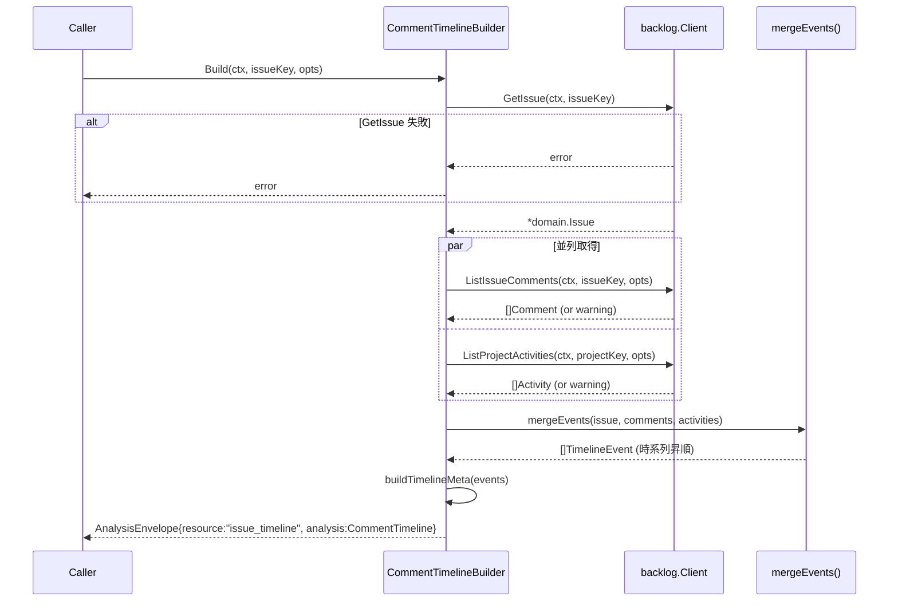

# M40: CommentTimeline ロジック

## 概要

課題のコメント + プロジェクトアクティビティ（更新履歴）を時系列に統合し、
`issue_timeline` という analysis リソースとして返す。
DecisionLog（M44: `logvalet-decisions` SKILL）の材料提供が主目的。

## スコープ

### 実装範囲

- `internal/analysis/timeline.go` — CommentTimelineBuilder 実装
- `internal/analysis/timeline_test.go` — TDD テスト
- Resource 名: `"issue_timeline"`

### スコープ外

- CLI コマンド（M41 担当）
- MCP ツール（M41 担当）
- プロジェクト横断タイムライン（M41 以降で検討）

## 設計上の制約・重要知見

### Backlog API の制約

Backlog API には「特定課題の更新履歴のみを取得する」エンドポイントが存在しない。
取り得るアプローチ:

| アプローチ | API | 課題 |
|-----------|-----|------|
| A: コメントのみ | `ListIssueComments` | 更新履歴が取れない |
| **B: コメント + プロジェクトアクティビティのフィルタ** | `ListIssueComments` + `ListProjectActivities` | activities.content.id でフィルタ可能 |
| C: コメント + スペースアクティビティのフィルタ | `ListIssueComments` + `ListSpaceActivities` | プロジェクトスコープがないため冗長 |

**採用: アプローチ B**

`ListProjectActivities` でアクティビティを取得し（ページネーションあり）、
`activity.Content["id"]` が対象 `issue.ID` に一致するものを抽出して更新イベントとして扱う。
type=1（issue_created）, type=2（issue_updated）, type=14（issue_multi_updated）をフィルタ対象とする（type=3 issue_commented は ListIssueComments の結果を優先し重複を避ける）。

### ページネーション戦略（Critical 対策）

`ListProjectActivities` は1回あたり最大 100 件。大規模プロジェクトでは対象課題の更新履歴が
取得範囲外になる可能性がある。以下の戦略を採用する:

1. **最大ページ数制限**: デフォルト最大 `MaxActivityPages=5`（= 最大 500 件）
2. **打ち切り条件**: 取得したアクティビティの最古 `created` が `Since` オプション（または issue.Created）より古くなった時点で打ち切り
3. **打ち切り warning**: `"activity_pagination_truncated"` warning を追加し、実際に取得したページ数と件数を含める
4. **オプション設定**: `MaxActivityPages` を `CommentTimelineOptions` に追加し、呼び出し側で制御可能にする

### Activity.Content の構造

Backlog API の activity レスポンス例（type=2: issue_updated）:
```json
{
  "id": 12345,
  "type": 2,
  "created": "2026-04-01T10:00:00Z",
  "createdUser": { "id": 101, "name": "田中太郎" },
  "content": {
    "id": 456,         ← issue.ID
    "key_id": 123,     ← issue 番号
    "summary": "課題サマリー",
    "comment": { "id": 789, "content": "コメント内容" },
    "changes": [ { "field": "status", "old_value": "未対応", "new_value": "処理中" } ]
  }
}
```

`content["id"]` が issue.ID に一致するものを issue 関連アクティビティとして判定する。

## データモデル

### TimelineEvent（統一イベント型）

```go
type TimelineEventKind string

const (
    TimelineEventKindComment TimelineEventKind = "comment"
    TimelineEventKindUpdate  TimelineEventKind = "update"
    TimelineEventKindCreated TimelineEventKind = "created"
)

type TimelineChange struct {
    Field    string `json:"field"`
    OldValue string `json:"old_value,omitempty"`
    NewValue string `json:"new_value,omitempty"`
}

type TimelineEvent struct {
    ID           int64             `json:"id"`
    Kind         TimelineEventKind `json:"kind"`              // "comment" | "update" | "created"
    ActivityType string            `json:"activity_type,omitempty"` // raw type name（例: "issue_updated", "issue_multi_updated"）
    Timestamp    *time.Time        `json:"timestamp,omitempty"`
    Actor        *domain.UserRef   `json:"actor,omitempty"`
    Content      string            `json:"content,omitempty"`   // comment text
    Changes      []TimelineChange  `json:"changes,omitempty"`   // update fields
}
```

`ActivityType` フィールドにより `issue_updated` と `issue_multi_updated` の区別を保持する。
`digest/activity.go` の `activityTypeName()` を参照（コピーではなく共通化は M41 以降で検討）。

### CommentTimeline（analysis 結果型）

```go
type CommentTimeline struct {
    IssueKey     string          `json:"issue_key"`
    IssueSummary string          `json:"issue_summary"`  // issue.Summary そのまま
    Events       []TimelineEvent `json:"events"`         // 時系列昇順
    Meta         TimelineMeta    `json:"meta"`
}

type TimelineMeta struct {
    TotalEvents      int `json:"total_events"`
    CommentCount     int `json:"comment_count"`      // フィルタ後に含まれたコメント数
    UpdateCount      int `json:"update_count"`       // フィルタ後に含まれた更新数
    ParticipantCount int `json:"participant_count"`  // 全イベントのユニーク actor 数（nil 除外）
}
```

`IssueSummary` は `issue.Summary` をそのまま格納（LLM 向けコンテキスト）。timeline 要約の生成は SKILL 側で行う。

### CommentTimelineOptions

```go
type CommentTimelineOptions struct {
    // MaxComments は時刻フィルタ後に表示するコメント最大数（0 = 全件）
    // 適用順: 全件取得 → Since/Until 時刻フィルタ → MaxComments で件数制限
    MaxComments int
    // IncludeUpdates は更新履歴（activities）を含めるか
    // ゼロ値（false）のため、Build() 内で「未指定 = true として扱う」補正が必要。
    // 設計: Build() 冒頭で `if !opt.includeUpdatesSet { opt.IncludeUpdates = true }` 相当の処理。
    // 実装上は IncludeUpdates *bool か専用フラグで実現する。
    IncludeUpdates *bool  // nil = デフォルト true
    // MaxActivityPages は ListProjectActivities のページネーション上限（デフォルト: 5）
    MaxActivityPages int
    // Since は取得開始時刻（nil = 制限なし）。コメントにはローカルフィルタで適用。
    Since *time.Time
    // Until は取得終了時刻（nil = 制限なし）。コメントにはローカルフィルタで適用。
    Until *time.Time
}
```

**フィルタ適用順の明文化:**
1. ListIssueComments: 全件取得（API にフィルタなし）
2. ListProjectActivities: ページネーションで順次取得 → 打ち切り条件で停止
3. コメント: Since/Until でローカルフィルタ → MaxComments で件数制限
4. アクティビティ: Since/Until でローカル再判定 → issue.ID マッチングでフィルタ
5. マージ後: 時系列昇順ソート（同時刻は kind priority: created > update > comment → id asc）

**participant の定義**: コメント投稿者 + アクティビティアクター（nil actor は除外）のユニーク UserRef.ID の数。

## シーケンス図



## TDD テスト設計

### Red フェーズ: 先に書くテスト

#### 正常系

| ID | テスト名 | 入力 | 期待出力 |
|----|---------|------|---------|
| T01 | コメントと更新履歴が時系列昇順に統合される | issue + 2コメント + 2activities | events 4件、timestamp 昇順 |
| T02 | events の kind が正しく設定される | comment/activity 混在 | "comment" / "update" / "created" |
| T03 | meta のカウントが正確 | 3コメント + 2更新 | comment_count=3, update_count=2, total=5 |
| T04 | IncludeUpdates=false でコメントのみ返る | コメント2件 + アクティビティ2件 | events 2件（コメントのみ） |
| T05 | Since/Until フィルタが適用される | 5件中3件が範囲内 | events 3件 |
| T06 | participant_count がユニーク集計される | 同一ユーザーの複数コメント | participant_count=1 |
| T07 | changes が TimelineChange に変換される | activity.Content.changes あり | changes スライスに正しく変換 |
| T08 | AnalysisEnvelope で包まれる | 正常入力 | resource="issue_timeline" |

#### 異常系・エッジケース

| ID | テスト名 | 入力 | 期待出力 |
|----|---------|------|---------|
| T09 | GetIssue 失敗は error を返す | GetIssue → error | エラー返却（warnings ではない） |
| T10 | ListIssueComments 失敗は warning に留まる | comments → error | warnings に追加、events は activities のみ |
| T11 | ListProjectActivities 失敗は warning に留まる | activities → error | warnings に追加、events はコメントのみ |
| T12 | コメント・アクティビティが空の場合 | 両方 nil | events=[], meta.total_events=0 |
| T13 | activity.Content["id"] が issue.ID に一致しないものはスキップ | 他課題のアクティビティ混在 | 対象課題のものだけ |
| T14 | Timestamp が nil のイベントはソートで末尾に寄る | timestamp nil | ソートで安全処理される |
| T15 | IncludeUpdates=nil（未指定）でも更新履歴が含まれる | IncludeUpdates=nil | events に update イベントが含まれる（デフォルト true） |
| T16 | MaxComments=0 は全件取得 | 10コメント、MaxComments=0 | events にコメント10件全て |
| T17 | warnings が nil でなく空スライスで返る | 正常入力、エラーなし | warnings = `[]` |
| T18 | 同時刻イベントのソートが決定的 | 3イベント同時刻（created/update/comment） | created → update → comment の順 |
| T19 | activity_pagination_truncated warning が出る | MaxActivityPages=1で101件 | warnings に truncated が含まれる |
| T20 | content["id"] が float64 でも正しくフィルタされる | JSON number 型の activity | 対象 issue の activity として含まれる |
| T21 | changes parse 失敗時に activity_changes_parse_failed warning が出る | malformed changes | warnings に parse_failed warning が含まれる |
| T22 | AnalysisEnvelope のメタデータ（profile/space/base_url/generated_at）が正しく設定される | WithClock 注入 | envelope.Profile, Space, BaseURL, GeneratedAt が一致 |
| T23 | participant_count は mixed events（コメント + 更新）のユニーク actor 数 | 2ユーザーが各1コメント+1更新 | participant_count=2 |

### Green フェーズ: 最小実装

1. `timeline_test.go` にテストケース全件記述（Red）
2. `timeline.go` に型定義 + `CommentTimelineBuilder` + `Build()` 実装（Green）
3. `go test ./internal/analysis/... -run TestCommentTimeline` 全通過確認

### Refactor フェーズ

- `mergeAndSortEvents()` を独立ヘルパーとして抽出
- `buildTimelineMeta()` を独立ヘルパーとして抽出
- `extractChanges()` を独立ヘルパーとして抽出
- テスト用ヘルパー関数（`helperTimelineIssue()` 等）をテストファイルに整理

## 実装手順

### Step 1: テスト先行作成（Red）

**ファイル**: `internal/analysis/timeline_test.go`

```go
package analysis

import (
    "context"
    "testing"
    "time"
    "github.com/youyo/logvalet/internal/backlog"
    "github.com/youyo/logvalet/internal/domain"
)

var fixedNowTimeline = time.Date(2026, 4, 1, 12, 0, 0, 0, time.UTC)

func TestCommentTimelineBuilder_Build_MergesEventsInOrder(t *testing.T) { ... }
func TestCommentTimelineBuilder_Build_KindsAreCorrect(t *testing.T) { ... }
func TestCommentTimelineBuilder_Build_MetaCountsAreAccurate(t *testing.T) { ... }
// ... T04〜T14
```

**依存**: T01-T14 全テストを記述してから実装へ進む。

### Step 2: 型定義（timeline.go 骨格）

**ファイル**: `internal/analysis/timeline.go`

```go
package analysis

import (
    "context"
    "sort"
    "time"
    "github.com/youyo/logvalet/internal/backlog"
    "github.com/youyo/logvalet/internal/domain"
    "golang.org/x/sync/errgroup"
)

type TimelineEventKind string
// ... 型定義一式
```

### Step 3: Build() 実装（Green）

並列取得（errgroup）→ mergeAndSortEvents() → buildTimelineMeta() → newEnvelope() の流れで実装。

### Step 4: リファクタ

- ヘルパー関数の抽出
- `go vet ./...` 通過確認
- `go test ./internal/analysis/...` 再確認

### Step 5: `go test ./...` 全通過確認

既存テスト（context_test.go, triage_test.go 等）への影響がないことを確認。

## アーキテクチャ整合性チェック

- BaseAnalysisBuilder 埋め込み ✅
- `newEnvelope(resource, analysis, warnings)` ヘルパー使用 ✅
- errgroup で並列取得 + 部分失敗は warnings ✅
- `toUserRef()` 利用 ✅
- MockClient の `ListIssueCommentsFunc` + `ListProjectActivitiesFunc` 使用 ✅
- テスト時刻は `WithClock(func() time.Time { return fixedNow })` で注入 ✅

## リスク評価

| リスク | 重大度 | 対策 |
|--------|--------|------|
| ListProjectActivities のページネーション不足による更新履歴欠落 | **高** | MaxActivityPages=5（デフォルト）でページネーション。打ち切り時は `activity_pagination_truncated` warning を出力 |
| `activity.Content["id"]` の型揺れ（float64/int/int64/json.Number） | 高 | `extractIntFromContent(m, key)` ヘルパーを実装し全型を吸収。型アサーション失敗は当該 activity をスキップ |
| `IncludeUpdates` ゼロ値が false になる Go の仕様 | 中 | `*bool` 型を使用し nil = デフォルト true として扱う。テストで明示的に検証 |
| `activity.Content["changes"]` のパース失敗 | 中 | パース失敗時は changes=nil とし `activity_changes_parse_failed` warning を追加（activity ID 含む） |
| type=3（issue_commented）の二重カウント | 中 | type=1,2,14 のみを activity として扱い、type=3 は ListIssueComments の結果を優先してスキップ |
| 同時刻イベントのソート不決定性 | 中 | tie-break: kind priority（created > update > comment）→ id asc で決定的にソート |
| nil timestamp ソートでパニック | 低 | nil timestamp は末尾扱い。sort.SliceStable で nil 安全コンパレータを実装 |
| `participant_count` の定義不一致 | 低 | コメント投稿者 + アクティビティアクター（nil 除外）のユニーク ID 数。定義をドキュメントに明記 |

## 実装観点チェックリスト

### 観点1: 実装実現可能性（5項目）
- [x] 手順の抜け漏れがないか（GetIssue → 並列取得 → merge → envelope）
- [x] 各ステップが十分に具体的か（型定義・ヘルパー関数名まで明示）
- [x] 依存関係が明示されているか（Step 1 → 2 → 3 → 4 → 5）
- [x] 変更対象ファイルが網羅されているか（timeline.go, timeline_test.go）
- [x] 影響範囲が正確か（既存ファイルへの変更なし）

### 観点2: TDD テスト設計（6項目）
- [x] 正常系テストケースが網羅されているか（T01-T08）
- [x] 異常系テストケースが定義されているか（T09-T11）
- [x] エッジケースが考慮されているか（T12-T14）
- [x] 入出力が具体的か（型・件数・フィールド値まで記述）
- [x] Red→Green→Refactor の順序が守られているか（Step 1→3→4）
- [x] モック/スタブの設計が適切か（MockClient の Func フィールドパターン）

### 観点3: アーキテクチャ整合性（5項目）
- [x] 既存の命名規則に従っているか（Builder/Options/Meta パターン）
- [x] 設計パターンが一貫しているか（BaseAnalysisBuilder 埋め込み）
- [x] モジュール分割が適切か（analysis パッケージ内、CLI/MCP は M41）
- [x] 依存方向が正しいか（analysis → backlog → domain）
- [x] 類似機能との統一性があるか（IssueContextBuilder/TriageMaterialsBuilder と同構造）

### 観点4: リスク評価（6項目）
- [x] リスクが適切に特定されているか（5件）
- [x] 対策が具体的か（型アサーション、ベストエフォート処理）
- [x] フェイルセーフが考慮されているか（部分失敗は warnings、error は GetIssue のみ）
- [x] パフォーマンスへの影響（Limit=100 デフォルト）
- [ ] セキュリティ観点: N/A（読み取り専用 API 呼び出し）
- [x] ロールバック計画: N/A（新規ファイルのみ、既存コード変更なし）

### 観点5: シーケンス図（5項目）
- [x] 正常フローが記述されているか
- [x] エラーフロー（GetIssue 失敗）が記述されているか
- [x] 並列処理（par）が明記されているか
- [x] 部分失敗（warning）の経路が明確か
- [x] タイムアウト: errgroup の context キャンセル伝播に委ねる

---

## Next Action

> **このプランが承認されました。以下を順番に実行してください:**
>
> 1. `Skill(devflow:implement)` — このプランに基づいて TDD で実装を開始
>
> ユーザーの追加指示は不要です。即座に実行してください。
