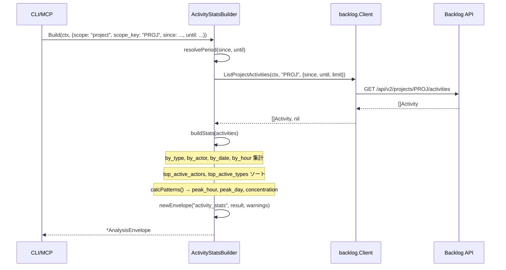
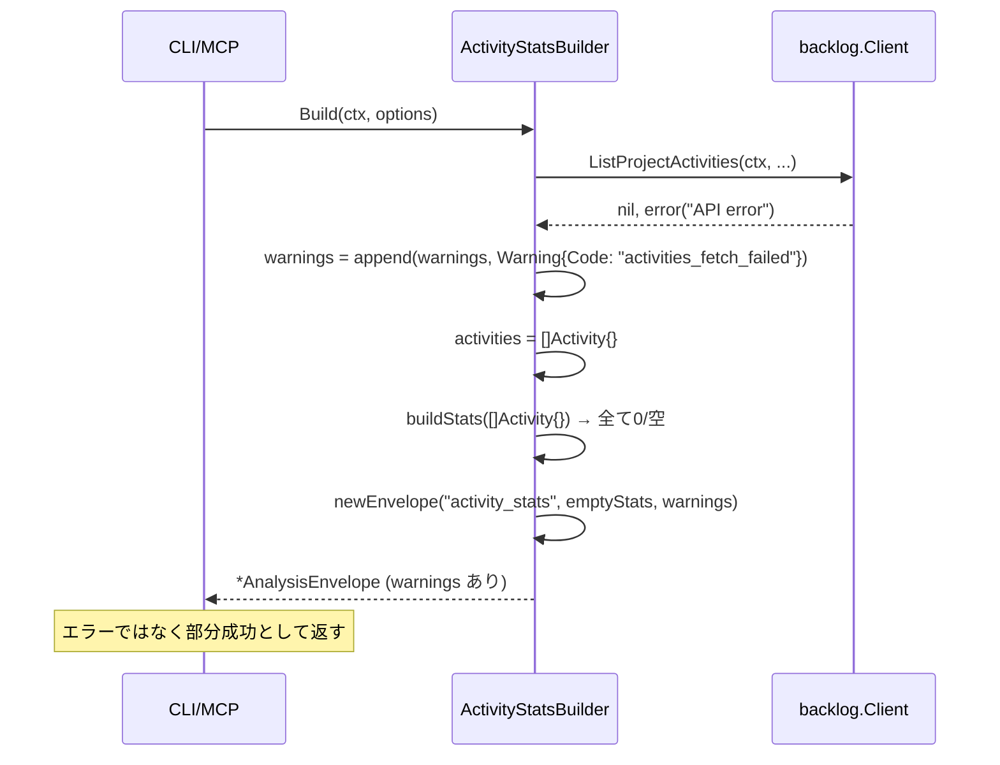

# マイルストーン M42: ActivityStats ロジック

## 概要

アクティビティの統計・偏り・パターンを数値集約する `ActivityStatsBuilder` を `internal/analysis/` に追加する。
logvalet は deterministic な材料提供に徹し、LLM 判断は SKILL 側に委ねる。

## スコープ

### 実装範囲

- `internal/analysis/activity_stats.go` — `ActivityStatsBuilder` と関連型
- `internal/analysis/activity_stats_test.go` — TDD テスト（MockClient 使用）
- `internal/analysis/testdata/activity_stats_golden.json` — Golden テスト用スナップショット（任意）

### スコープ外

- CLI コマンド（M43 で対応）
- MCP ツール（M43 で対応）
- LLM 判断ロジック（SKILL 側で対応）
- `digest/activity.go` の変更（既存は触れない）

## 設計

### データ取得戦略

`ActivityStatsBuilder.Build()` は以下の API を呼び出す:

| スコープ | API メソッド |
|---------|------------|
| プロジェクト | `ListProjectActivities(ctx, projectKey, opt)` |
| ユーザー | `ListUserActivities(ctx, userID, opt)` |
| スペース全体 | `ListSpaceActivities(ctx, opt)` |

スコープは `ActivityStatsOptions.Scope` で制御（`"project"` / `"user"` / `"space"`）。

### 集計内容

| フィールド | 説明 |
|-----------|------|
| `total_count` | アクティビティ総数 |
| `by_type` | タイプ別カウント（`map[string]int`） |
| `by_actor` | アクター（ユーザー名）別カウント（`map[string]int`） |
| `by_date` | 日付別カウント（`map[string]int`, キー: `"YYYY-MM-DD"`） |
| `by_hour` | 時間帯別カウント（`map[int]int`, キー: 0-23） |
| `top_active_actors` | 上位アクター一覧（`[]ActorStat`） |
| `top_active_types` | 上位タイプ一覧（`[]TypeStat`） |
| `date_range` | 集計期間 `{since, until}` |
| `patterns` | パターン分析（`ActivityPatterns`） |

### ActivityPatterns（パターン分析）

```json
{
  "peak_hour": 14,           // 最もアクティビティが多い時間帯（0-23）
  "peak_day_of_week": "Mon", // 最もアクティビティが多い曜日
  "actor_concentration": 0.72, // 上位3アクターの集中度（0.0-1.0）
  "type_concentration": 0.58   // 上位3タイプの集中度（0.0-1.0）
}
```

concentration（集中度）: `top3 の合計 / 総数`。0.0（均一分散）〜 1.0（単一集中）。

### 出力 JSON 構造

```json
{
  "schema_version": "1",
  "resource": "activity_stats",
  "generated_at": "2026-04-01T12:00:00Z",
  "profile": "default",
  "space": "heptagon",
  "base_url": "https://heptagon.backlog.com",
  "warnings": [],
  "analysis": {
    "scope": "project",
    "scope_key": "MYPROJECT",
    "since": "2026-03-25T00:00:00Z",
    "until": "2026-04-01T12:00:00Z",
    "total_count": 42,
    "by_type": {
      "issue_created": 10,
      "issue_updated": 20,
      "issue_commented": 12
    },
    "by_actor": {
      "alice": 25,
      "bob": 17
    },
    "by_date": {
      "2026-03-29": 8,
      "2026-03-30": 15
    },
    "by_hour": {
      "9": 5,
      "14": 12
    },
    "top_active_actors": [
      {"name": "alice", "count": 25, "ratio": 0.595}
    ],
    "top_active_types": [
      {"type": "issue_updated", "count": 20, "ratio": 0.476}
    ],
    "date_range": {
      "since": "2026-03-25T00:00:00Z",
      "until": "2026-04-01T12:00:00Z"
    },
    "patterns": {
      "peak_hour": 14,
      "peak_day_of_week": "Mon",
      "actor_concentration": 0.595,
      "type_concentration": 0.476
    }
  }
}
```

## テスト設計書

### Red → Green → Refactor の原則

1. **Red**: テストファイルを先に作成し、`ActivityStatsBuilder` の全メソッドが定義されていない状態で `go test` が失敗することを確認
2. **Green**: 最小実装でテストを通す
3. **Refactor**: コードを整理（重複排除、命名改善）

### 正常系テストケース

| ID | 入力 | 期待出力 | 備考 |
|----|------|---------|------|
| T01 | scope=project, 5件のアクティビティ（2タイプ、2アクター） | by_type/by_actor に正しいカウント | 基本集計 |
| T02 | scope=project, アクティビティ0件 | total_count=0, 全 map が空 | 空スライス正規化 |
| T03 | scope=user, 3件のアクティビティ | ListUserActivities が呼ばれる | スコープ分岐 |
| T04 | scope=space, 3件のアクティビティ | ListSpaceActivities が呼ばれる | スコープ分岐 |
| T05 | Since/Until 指定 | date_range に反映 | 期間フィルタ |
| T06 | 24時間分のアクティビティ | by_hour に 0-23 の正しいカウント | 時間集計 |
| T07 | 7日分のアクティビティ | by_date にキー "YYYY-MM-DD" | 日付集計 |
| T08 | actor_concentration 計算 | top3 / total の正しい値 | パターン分析 |
| T09 | peak_hour の特定 | 最大 by_hour のキー | パターン分析 |
| T10 | peak_day_of_week の特定 | 最多曜日の文字列（"Mon"等） | パターン分析 |
| T11 | top_active_actors（TopN=3指定） | ratio が total_count で正規化 | TopN 指定 |
| T12 | WithClock で固定時刻 | generated_at が固定値 | clock injection |

### 異常系テストケース

| ID | 入力 | 期待エラー/動作 | 備考 |
|----|------|--------------|------|
| E01 | ListProjectActivities が error | warnings に `activities_fetch_failed`、空結果を返す | 部分失敗 |
| E02 | ListUserActivities が error | warnings に `activities_fetch_failed`、空結果を返す | 部分失敗 |
| E03 | scope="" (空文字) | デフォルトで "space" スコープとして動作 | デフォルト処理 |
| E04 | アクター名が空のアクティビティ | "unknown" としてカウント | nil 安全 |

### エッジケース

| ID | シナリオ | 期待動作 |
|----|---------|---------|
| EC01 | アクティビティが全て同一アクター | actor_concentration = 1.0 |
| EC02 | Since/Until が nil | デフォルト期間（Since: now-7days, Until: now）を使用 |
| EC03 | TopN が 0 | デフォルト TopN=5 を使用 |
| EC04 | by_hour のキーが int（0-23） | ゼロ値のキーも存在する（明示的初期化） |

### モック設計

`backlog.MockClient` の `ListProjectActivitiesFunc`、`ListUserActivitiesFunc`、`ListSpaceActivitiesFunc` を使用。
clock injection は `WithClock(func() time.Time { return fixedTime })` オプションを使用。

## 実装手順

### Step 1: テストファイル作成（Red）

**ファイル**: `internal/analysis/activity_stats_test.go`

- `TestActivityStatsBuilder_Build_Project` — T01〜T12 の正常系
- `TestActivityStatsBuilder_Build_Errors` — E01〜E04 の異常系
- `TestActivityStatsBuilder_Build_EdgeCases` — EC01〜EC04 のエッジケース
- `TestBuildByDate` — by_date 集計の単体テスト
- `TestBuildByHour` — by_hour 集計の単体テスト
- `TestCalcConcentration` — 集中度計算の単体テスト
- `TestCalcPeakHour` — ピーク時間帯の単体テスト

この時点で `go test ./internal/analysis/...` が **失敗する**（Red）。

### Step 2: ActivityStatsBuilder 実装（Green）

**ファイル**: `internal/analysis/activity_stats.go`

```go
package analysis

// ActivityStatsOptions は ActivityStatsBuilder.Build() のオプション。
type ActivityStatsOptions struct {
    Scope    string     // "project" | "user" | "space"（デフォルト: "space"）
    ScopeKey string     // プロジェクトキー or ユーザーID（scope に応じて使用）
    Since    *time.Time // 集計開始日時（nil: now - 7days）
    Until    *time.Time // 集計終了日時（nil: now）
    TopN     int        // top_active_actors/types の表示件数（デフォルト: 5）
}

// ActivityStats は activity_stats の analysis フィールドの型。
type ActivityStats struct {
    Scope            string              `json:"scope"`
    ScopeKey         string              `json:"scope_key,omitempty"`
    Since            time.Time           `json:"since"`
    Until            time.Time           `json:"until"`
    TotalCount       int                 `json:"total_count"`
    ByType           map[string]int      `json:"by_type"`
    ByActor          map[string]int      `json:"by_actor"`
    ByDate           map[string]int      `json:"by_date"`
    ByHour           map[int]int         `json:"by_hour"`
    TopActiveActors  []ActorStat         `json:"top_active_actors"`
    TopActiveTypes   []TypeStat          `json:"top_active_types"`
    DateRange        ActivityDateRange   `json:"date_range"`
    Patterns         ActivityPatterns    `json:"patterns"`
}

// ActorStat はアクター別アクティビティ統計。
type ActorStat struct {
    Name  string  `json:"name"`
    Count int     `json:"count"`
    Ratio float64 `json:"ratio"`
}

// TypeStat はタイプ別アクティビティ統計。
type TypeStat struct {
    Type  string  `json:"type"`
    Count int     `json:"count"`
    Ratio float64 `json:"ratio"`
}

// ActivityDateRange は集計期間。
type ActivityDateRange struct {
    Since time.Time `json:"since"`
    Until time.Time `json:"until"`
}

// ActivityPatterns はアクティビティパターン分析。
type ActivityPatterns struct {
    PeakHour           int     `json:"peak_hour"`
    PeakDayOfWeek      string  `json:"peak_day_of_week"`
    ActorConcentration float64 `json:"actor_concentration"`
    TypeConcentration  float64 `json:"type_concentration"`
}

// ActivityStatsBuilder はアクティビティ統計を集計する。
type ActivityStatsBuilder struct {
    BaseAnalysisBuilder
}

func NewActivityStatsBuilder(client backlog.Client, profile, space, baseURL string, opts ...Option) *ActivityStatsBuilder
func (b *ActivityStatsBuilder) Build(ctx context.Context, opt ActivityStatsOptions) (*AnalysisEnvelope, error)
```

この時点で `go test ./internal/analysis/...` が **成功する**（Green）。

### Step 3: Refactor

- `buildByDate`、`buildByHour`、`calcConcentration`、`calcPeakHour`、`calcPeakDayOfWeek` をプライベート関数として抽出
- `sortActorStats`、`sortTypeStats` でソート安定化（count 降順 → name 昇順）
- `digest/activity.go` の `activityTypeName` と重複しないよう、`analysis` パッケージ内で再定義または `internal/domain` に移動を検討（スコープ外: M42 では `analysis` パッケージ内に独自定義）

### Step 4: `go test ./...` の確認

```bash
go test ./internal/analysis/... -v
go test ./...
go vet ./...
```

全テストがパスすることを確認。

## アーキテクチャ検討

### 既存パターンとの整合性

| 項目 | 既存パターン | M42 での採用 |
|------|------------|------------|
| Builder 名 | `XxxBuilder` | `ActivityStatsBuilder` |
| コンストラクタ | `NewXxxBuilder(client, profile, space, baseURL, opts...)` | 同パターン |
| Build メソッド | `Build(ctx, options) (*AnalysisEnvelope, error)` | 同パターン |
| Resource 名 | `"xxx_yyy"` 形式 | `"activity_stats"` |
| 部分失敗 | warnings に追加して部分結果を返す | 同パターン |
| clock injection | `WithClock(func() time.Time)` | 同パターン |
| 空スライス正規化 | `if x == nil { x = []T{} }` | 同パターン |

### `activityTypeName` の扱い

`digest/activity.go` に既に `activityTypeName(int) string` が定義されている。
`analysis` パッケージから `digest` パッケージを参照することは現状（`periodic.go`, `workload.go` が `digest.DigestLLMHints` を使用）から許容されている。
ただし、`activityTypeName` はパッケージ内プライベート関数のため、`analysis` パッケージ内に同一実装を持つか、`domain` パッケージに移動するか検討が必要。

**M42 での判断**: `analysis/activity_stats.go` 内に `activityTypeName` の参照コピーを持つ（重複は許容、`domain` への移動は M43 以降の別タスク）。

### 依存方向

```
analysis/activity_stats.go
  ↓ imports
backlog.Client (interface)
domain.Activity
domain.Warning
```

`digest` パッケージへの依存は不要（LLMHints は今回追加しない、`digest.DigestLLMHints` も不使用）。

## リスク評価

| リスク | 重大度 | 対策 |
|--------|--------|------|
| `activityTypeName` の重複実装 | Warning | M42 では analysis 内にコピー。M43 以降で `domain` への移動を検討 |
| by_hour の JSON シリアライズ | Warning | `map[int]int` は JSON キーが数値文字列になる。テストで確認 |
| アクティビティ0件時のパターン計算 | Warning | `total_count=0` の場合は patterns フィールドをゼロ値で返す（division-by-zero 回避） |
| API レート制限 | Info | 1回の API 呼び出しのみ。`Limit` オプションで上限制御 |
| 時刻タイムゾーン | Info | `by_date` のキーは UTC 基準の `YYYY-MM-DD`。clock injection で一貫性を保証 |
| セキュリティ | Info | ユーザーIDは文字列型引数として受け取る。バリデーションは backlog.Client 側で対応済み |

## シーケンス図

### 正常フロー（scope=project）



### エラーフロー（API 失敗）



## チェックリスト

### 観点1: 実装実現可能性（5項目）

- [x] 手順の抜け漏れがないか（テスト作成→実装→リファクタ→CI検証の一貫した流れ）
- [x] 各ステップが十分に具体的か（関数シグネチャ・型定義を明記）
- [x] 依存関係が明示されているか（Step 1（テスト）→ Step 2（実装）→ Step 3（リファクタ）→ Step 4（CI））
- [x] 変更対象ファイルが網羅されているか（`activity_stats.go`, `activity_stats_test.go`）
- [x] 影響範囲が正確に特定されているか（analysis パッケージのみ。CLI/MCP は M43）

### 観点2: TDDテスト設計の品質（6項目）

- [x] 正常系テストケースが網羅されているか（T01〜T12）
- [x] 異常系テストケースが定義されているか（E01〜E04）
- [x] エッジケースが考慮されているか（EC01〜EC04：0件、nil、TopN=0）
- [x] 入出力が具体的に記述されているか（scope, ScopeKey, Since, Until, TopN 全て明記）
- [x] Red→Green→Refactorの順序が守られているか（Step 1→2→3）
- [x] モック/スタブの設計が適切か（`backlog.MockClient` の Func フィールドパターン使用）

### 観点3: アーキテクチャ整合性（5項目）

- [x] 既存の命名規則に従っているか（`ActivityStatsBuilder`, `NewActivityStatsBuilder`, `Build`）
- [x] 設計パターンが一貫しているか（`BaseAnalysisBuilder` 埋め込み）
- [x] モジュール分割が適切か（analysis パッケージ内、CLI/MCP は別マイルストーン）
- [x] 依存方向が正しいか（analysis → backlog(interface), domain のみ）
- [x] 類似機能との統一性があるか（PeriodicDigestBuilder, WorkloadCalculator と同構造）

### 観点4: リスク評価と対策（6項目）

- [x] リスクが適切に特定されているか（JSON シリアライズ、ゼロ除算、重複実装）
- [x] 対策が具体的か（ゼロ値返却、テストで確認）
- [x] フェイルセーフが考慮されているか（API 失敗時は warnings + 空結果を返す）
- [x] パフォーマンスへの影響が評価されているか（API 1回のみ、Limit オプション）
- [x] セキュリティ観点が含まれているか（userID バリデーションは Client 側）
- [x] ロールバック計画があるか（新規ファイル追加のみ、既存コードを変更しない）

### 観点5: シーケンス図の完全性（5項目）

- [x] 正常フローが記述されているか（scope=project の正常シーケンス図）
- [x] エラーフローが記述されているか（API 失敗時のフロー図）
- [x] ユーザー・システム・外部API間の相互作用が明確か（CLI/MCP → Builder → Client → API）
- [x] タイミング・同期的な処理の制御が明記されているか（同期処理、errgroup 不使用）
- [x] リトライ・タイムアウト等の例外ハンドリングが図に含まれているか（warnings への追加）

---

## Next Action

> **このプランが承認されました。以下を順番に実行してください:**
>
> 1. `Skill(devflow:implement)` — このプランに基づいて TDD で実装を開始
>
> ユーザーの追加指示は不要です。即座に実行してください。
