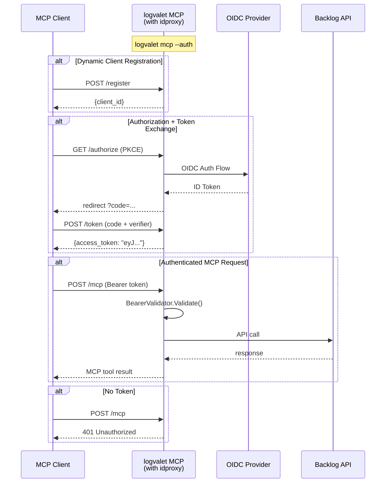

# logvalet MCP サーバー認証 + AgentCore デプロイ

## 概要

idproxy ライブラリを利用して logvalet MCP サーバーに OIDC/OAuth 2.1 認証を追加し、AWS Bedrock AgentCore Runtime でデプロイ可能にする。

## コンテキスト

### 現状
- `logvalet mcp` は Streamable HTTP で MCP サーバーを起動（`internal/cli/mcp.go`）
- MCP エンドポイントに認証なし（Backlog API 認証はサーバープロセスの credential で処理）
- ローカル利用が前提（`127.0.0.1:8080`）

### 課題
- リモート環境（AWS 等）にデプロイする場合、MCP エンドポイントが無防備
- AgentCore Runtime からアクセスする際に OAuth 2.1 認証が必要

### 解決策
- idproxy の `Auth.Wrap()` ミドルウェアで MCP エンドポイントを保護
- `--auth` フラグで認証の有効/無効を切り替え（既存の `logvalet mcp` は影響なし）
- Dockerfile で AgentCore Runtime デプロイ対応

## スコープ

### 実装範囲
- `McpCmd` に認証フラグ群を追加（`--auth`, `--external-url`, `--oidc-*`, `--cookie-secret`）
- idproxy ライブラリをインポートし、`Auth.Wrap()` で MCP ハンドラーをラップ
- `/healthz` エンドポイント（認証バイパス）
- Graceful shutdown（既存 TODO 解消）
- Dockerfile（multi-stage, distroless）
- AgentCore デプロイドキュメント

### スコープ外
- 永続ストア（Redis, PostgreSQL 等）— MemoryStore で十分
- 署名鍵の永続化 — コンテナ再起動時のトークン失効は許容
- AgentCore CDK construct 定義 — ドキュメントのみ

## アプローチ比較

### A: 新サブコマンド `logvalet mcp-auth`

| 評価軸 | 結果 |
|--------|------|
| シンプルさ | `Run()` が2箇所に分散、80%+ のコード重複 |
| 保守性 | MCP サーバー変更時に2箇所修正が必要 |
| UX | ローカル/リモートで異なるコマンドは混乱の元 |
| デプロイ | Dockerfile CMD を切り替える必要あり |

### B: `--auth` フラグを `logvalet mcp` に追加（推奨）

| 評価軸 | 結果 |
|--------|------|
| シンプルさ | 単一 `Run()` に条件分岐1箇所のみ |
| 保守性 | auth は加法的レイヤー（`auth.Wrap(mux)`） |
| UX | 同じコマンド、環境変数で切替 |
| デプロイ | 同一 CMD、env で auth 有効化 |

**決定: アプローチ B** — ワイヤリングの差は `auth.Wrap(mux)` の1行のみ。

## アーキテクチャ

### Handler Topology（認証あり）

```
topMux
  |-- /healthz  -->  healthHandler（認証バイパス）
  |-- /         -->  auth.Wrap(mcpMux)
                       |-- /mcp               -->  StreamableHTTPServer
                       |-- /login, /callback   -->  idproxy BrowserAuth
                       |-- /register, /authorize, /token  -->  idproxy OAuthServer
                       |-- /.well-known/*      -->  OAuth メタデータ
```

### Handler Topology（認証なし）

```
mux
  |-- /mcp      -->  StreamableHTTPServer
  |-- /healthz  -->  healthHandler
```

### シーケンス図（OAuth 2.1 フロー）



## 実装手順

### Step 0: idproxy 依存追加

**ファイル:** `go.mod`

```bash
go get github.com/youyo/idproxy
```

新規の推移的依存:
- `github.com/coreos/go-oidc/v3`
- `golang.org/x/oauth2`
- `github.com/gorilla/securecookie`
- `github.com/golang-jwt/jwt/v5`

### Step 1: McpCmd に認証フラグを追加

**ファイル:** `internal/cli/mcp.go`

```go
type McpCmd struct {
    Port int    `help:"listen port" default:"8080"`
    Host string `help:"listen host" default:"127.0.0.1"`

    // Auth flags (Kong group + env var で設定可能)
    Auth             bool   `help:"enable idproxy authentication" group:"auth" env:"LOGVALET_MCP_AUTH"`
    ExternalURL      string `help:"external URL for OAuth callbacks" group:"auth" env:"LOGVALET_MCP_EXTERNAL_URL"`
    OIDCIssuer       string `help:"OIDC issuer URL" group:"auth" env:"LOGVALET_MCP_OIDC_ISSUER"`
    OIDCClientID     string `help:"OIDC client ID" group:"auth" env:"LOGVALET_MCP_OIDC_CLIENT_ID"`
    OIDCClientSecret string `help:"OIDC client secret" group:"auth" env:"LOGVALET_MCP_OIDC_CLIENT_SECRET"`
    CookieSecret     string `help:"cookie encryption key (hex-encoded, 64+ chars = 32+ bytes)" group:"auth" env:"LOGVALET_MCP_COOKIE_SECRET"`
    AllowedDomains   string `help:"comma-separated allowed email domains" group:"auth" env:"LOGVALET_MCP_ALLOWED_DOMAINS"`
    AllowedEmails    string `help:"comma-separated allowed email addresses" group:"auth" env:"LOGVALET_MCP_ALLOWED_EMAILS"`
}
```

- Kong の `group:"auth"` タグで `--help` 出力をグループ化し、視認性を向上
- `Validate()` メソッドで `Auth=true` 時のみ必須フィールドを検証
- CookieSecret は「64文字以上の hex 文字列（= 32バイト以上）」と明記

### Step 2: buildAuthConfig ヘルパー

**新規ファイル:** `internal/cli/mcp_auth.go`

- `buildAuthConfig(c *McpCmd) (idproxy.Config, error)`
- Hex CookieSecret デコード
- ECDSA P-256 署名鍵を起動時に生成
- カンマ区切りの AllowedDomains/AllowedEmails をパース
- `store.NewMemoryStore()` で初期化
- `idproxy.Config` を構築して返す

### Step 3: McpCmd.Run() リファクタ

**ファイル:** `internal/cli/mcp.go`

- `Auth=true` の場合: `idproxy.New()` → `auth.Wrap(mcpMux)` → topMux に配置
- `Auth=false` の場合: 既存動作を維持
- 両方で `/healthz` を追加
- `http.ListenAndServe` → `http.Server` + graceful shutdown

### Step 4: Graceful shutdown

**ファイル:** `internal/cli/mcp.go`

- `os.Signal` (SIGINT/SIGTERM) を監視
- `srv.Shutdown(ctx)` with 10 秒タイムアウト
- MemoryStore の `Close()` を呼び出し

### Step 5: healthHandler

**ファイル:** `internal/cli/mcp.go`

```go
func healthHandler(w http.ResponseWriter, r *http.Request) {
    w.Header().Set("Content-Type", "application/json")
    w.WriteHeader(http.StatusOK)
    w.Write([]byte(`{"status":"ok"}`))
}
```

### Step 6: Dockerfile

**新規ファイル:** `Dockerfile`

```dockerfile
FROM golang:1.26.1-alpine AS builder
WORKDIR /build
COPY go.mod go.sum ./
RUN go mod download
COPY . .
RUN CGO_ENABLED=0 GOOS=linux go build -trimpath -ldflags="-s -w" -o /logvalet ./cmd/logvalet/

FROM gcr.io/distroless/base-debian12:nonroot
COPY --from=builder /logvalet /logvalet
EXPOSE 8080
USER nonroot:nonroot
ENTRYPOINT ["/logvalet"]
CMD ["mcp", "--host", "0.0.0.0"]
```

### Step 7: ドキュメント

**新規ファイル:** `docs/agentcore-deployment.md`

環境変数リファレンス:

| 変数 | 必須 | 説明 |
|------|------|------|
| `LOGVALET_MCP_AUTH` | Yes | `true` で認証有効化 |
| `LOGVALET_MCP_EXTERNAL_URL` | Yes (auth時) | OAuth コールバック URL |
| `LOGVALET_MCP_OIDC_ISSUER` | Yes (auth時) | OIDC Issuer URL |
| `LOGVALET_MCP_OIDC_CLIENT_ID` | Yes (auth時) | OIDC Client ID |
| `LOGVALET_MCP_OIDC_CLIENT_SECRET` | No | OIDC Client Secret |
| `LOGVALET_MCP_COOKIE_SECRET` | Yes (auth時) | Hex 32+ byte |
| `LOGVALET_MCP_ALLOWED_DOMAINS` | No | メールドメイン制限 |
| `LOGVALET_MCP_ALLOWED_EMAILS` | No | メールアドレス制限 |
| `LOGVALET_API_KEY` / `LOGVALET_ACCESS_TOKEN` | Yes | Backlog API 認証 |
| `LOGVALET_BASE_URL` | Yes | Backlog スペース URL |

## テスト設計書

### 正常系ケース

| ID | テスト | 入力 | 期待出力 |
|----|--------|------|----------|
| T1 | McpCmd デフォルトフラグ | パース済み McpCmd | Port=8080, Host="127.0.0.1", Auth=false |
| T2 | Auth フラグパース | `--auth --external-url X --oidc-issuer Y --oidc-client-id Z --cookie-secret HEX` | 全フィールド正しくセット |
| T3 | Auth 環境変数 | `LOGVALET_MCP_AUTH=true` + 関連 env | 正しい struct 値 |
| T7 | buildAuthConfig 正常 | 有効な全フィールド | idproxy.Config が正しく構築 |
| T10 | AllowedDomains パース | `"a.com,b.com"` | `[]string{"a.com", "b.com"}` |
| T11 | 空オプション | AllowedDomains="" | nil スライス |
| T12 | 署名鍵生成 | buildAuthConfig 呼び出し | OAuth.SigningKey が非nil ECDSA P-256 |
| T13 | healthHandler 200 | GET /healthz | 200 + `{"status":"ok"}` |
| T15 | 認証なし MCP アクセス | Auth=false, POST /mcp | MCP ハンドラーに到達 |

### 異常系ケース

| ID | テスト | 入力 | 期待エラー |
|----|--------|------|-----------|
| T4 | Auth 必須フィールド欠落 | Auth=true, ExternalURL="" | バリデーションエラー |
| T5 | Auth=false で検証スキップ | Auth=false, 全 auth フィールド空 | エラーなし |
| T6 | CookieSecret 短すぎ | 16 byte の hex | バリデーションエラー |
| T8 | 不正な hex | CookieSecret="ZZZZ" | デコードエラー |
| T16 | 認証あり トークンなし | Auth=true, POST /mcp (no Bearer) | 401 Unauthorized |

### エッジケース

| ID | テスト | 入力 | 期待動作 |
|----|--------|------|----------|
| T9 | CookieSecret 正確に32byte | 64文字 hex | エラーなし |
| T17 | Auth あり healthz | Auth=true, GET /healthz | 200（認証バイパス） |
| T18 | Auth あり /login | Auth=true, GET /login | idproxy ログインページ表示 |

## リスク評価

| リスク | 重大度 | 対策 |
|--------|--------|------|
| `auth.Wrap()` パスルーティング競合 | 高 | topMux で /healthz を分離、統合テスト T16-T18 で検証 |
| OIDC discovery テスト時に失敗 | 中 | httptest.NewServer で fake OIDC メタデータを提供 |
| MemoryStore goroutine リーク | 中 | Graceful shutdown で Close() を呼び出し |
| 推移的依存の競合 | 中 | 同一 Go 1.26.1、`go mod tidy` で検証 |
| コンテナ再起動でトークン失効 | 中 | MVP では許容。将来: 署名鍵の永続化（AWS Secrets Manager / ファイルマウント）で対応 |
| デフォルト host `127.0.0.1` がコンテナで外部アクセス不可 | 高 | Dockerfile CMD に `--host 0.0.0.0` 明記 |
| Distroless イメージに CA 証明書が必要 | 高 | `distroless/base-debian12` を使用（CA certs 内蔵）、`static` は不可 |
| AgentCore Runtime 固有要件が未確認 | 中 | デプロイ前に AWS ドキュメントで health check・networking・secret injection を調査。Dockerfile は汎用コンテナ仕様で作成し、AgentCore 固有設定は CDK/manifest で対応 |

## チェックリスト

### 観点1: 実装実現可能性（5項目）
- [x] 手順の抜け漏れがないか — Step 0-7 で端から端まで網羅
- [x] 各ステップが十分に具体的か — コード例・ファイルパス付き
- [x] 依存関係が明示されているか — Step 0 → 1,2,5（並列）→ 3 → 4 → 6,7（並列）
- [x] 変更対象ファイルが網羅されているか — 6ファイル列挙済み
- [x] 影響範囲が正確に特定されているか — 既存 `logvalet mcp` は Auth=false で動作変更なし

### 観点2: TDDテスト設計の品質（6項目）
- [x] 正常系テストケースが網羅されているか — T1-T3, T7, T10-T13, T15
- [x] 異常系テストケースが定義されているか — T4-T6, T8, T16
- [x] エッジケースが考慮されているか — T9, T17, T18
- [x] 入出力が具体的に記述されているか — テーブル形式で明記
- [x] Red→Green→Refactor の順序が守られているか — 各 Step でテスト先行を明記
- [x] モック/スタブの設計が適切か — httptest.NewServer で fake OIDC

### 観点3: アーキテクチャ整合性（5項目）
- [x] 既存の命名規則に従っているか — `mcp_auth.go` は `mcp.go` と同パッケージ
- [x] 設計パターンが一貫しているか — `buildRunContext` パターンを踏襲
- [x] モジュール分割が適切か — auth ロジックは `mcp_auth.go` に分離
- [x] 依存方向が正しいか — cli → idproxy（外部ライブラリ、循環なし）
- [x] 類似機能との統一性があるか — GlobalFlags の env タグパターンを踏襲

### 観点4: リスク評価と対策（6項目）
- [x] リスクが適切に特定されているか — 7項目
- [x] 対策が具体的か — テスト番号・手法を明記
- [x] フェイルセーフが考慮されているか — Auth=false がデフォルト
- [x] パフォーマンスへの影響が評価されているか — ミドルウェア1層追加のみ
- [x] セキュリティ観点が含まれているか — CookieSecret 最小長、nonroot ユーザー
- [x] ロールバック計画があるか — `--auth` フラグ削除で元に戻る

### 観点5: シーケンス図（5項目）
- [x] 正常フローが記述されているか — OAuth 2.1 + MCP リクエスト
- [x] エラーフローが記述されているか — 401 Unauthorized
- [x] 相互作用が明確か — Client, Server, IdP, Backlog の4者
- [x] タイミングが明記されているか — 登録→認可→トークン→MCP の順序
- [x] 例外ハンドリングが含まれているか — トークンなしの 401 フロー

## 弁証法レビュー結果

### 採用した修正
1. **Dockerfile ベースイメージ変更**: `distroless/static` → `distroless/base-debian12`（CA 証明書内蔵）
2. **Kong group タグ**: 認証フラグに `group:"auth"` を追加し `--help` の視認性向上
3. **CookieSecret 仕様明確化**: 「64文字以上の hex（= 32バイト以上）」と明記
4. **AgentCore 固有リスク追加**: デプロイ前の要件調査をリスク評価に追記
5. **署名鍵再起動問題のリスク格上げ**: 低 → 中、将来の永続化方針を明記

### 却下した指摘（False Positive）
1. **Handler Topology 欠陥**: idproxy の `auth.Wrap()` は `/login`, `/authorize`, `/token` 等を**内部で先にルーティング**してから Bearer 検証に進む。OAuth フローは正しく動作する。
2. **MemoryStore リーク**: idproxy の `store.NewMemoryStore()` は TTL 自動クリーンアップ goroutine 内蔵。
3. **Graceful shutdown 破壊**: SIGINT/SIGTERM 処理追加は標準的改善。既存 TODO の解消。
4. **Backlog API credential 共有**: 単一テナント MCP サーバーの設計意図通り。

## 変更ファイル一覧

| ファイル | 操作 | 概要 |
|----------|------|------|
| `go.mod` | 変更 | idproxy 依存追加 |
| `internal/cli/mcp.go` | 変更 | Auth フラグ追加、Run() リファクタ、healthHandler、graceful shutdown |
| `internal/cli/mcp_auth.go` | 新規 | buildAuthConfig() ヘルパー |
| `internal/cli/mcp_test.go` | 新規 | McpCmd パース・バリデーションテスト |
| `internal/cli/mcp_auth_test.go` | 新規 | buildAuthConfig テスト |
| `internal/cli/mcp_handler_test.go` | 新規 | healthHandler + 認証統合テスト |
| `Dockerfile` | 新規 | Multi-stage ビルド、distroless |
| `docs/agentcore-deployment.md` | 新規 | デプロイガイド |

---

## Next Action

> **このプランが承認されました。以下を順番に実行してください:**
>
> 1. `Skill(devflow:implement)` — このプランに基づいて実装を開始
>
> ユーザーの追加指示は不要です。即座に実行してください。
