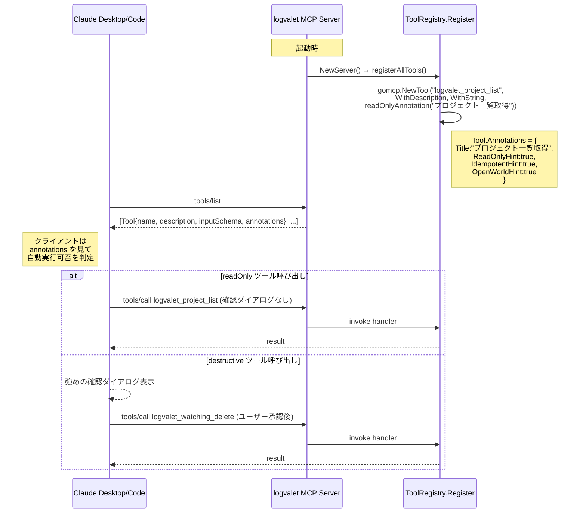

# logvalet-mcp Tool Annotations 付与（全42ツール）

## Context（背景）

MCP クライアント（Claude Desktop / Code）は `tools/list` のレスポンスに含まれる
**ToolAnnotations** ヒントを見てツールを "read-only / write / destructive" に分類し、
確認ダイアログや自動実行可否を判定する。

**現状の問題**: logvalet-mcp では `gomcp.NewTool(...)` を annotation 無しで呼んでいる。
mark3labs/mcp-go v0.46.0 の `NewTool` は default で
`ReadOnlyHint=false / DestructiveHint=true / IdempotentHint=false / OpenWorldHint=true`
を入れるため、**全 42 ツールが「破壊的」として扱われ**、読み取り系 (`*_list`, `*_get`)
でも毎回確認ダイアログが出る UX 劣化が発生している。

**目的**: 全 42 ツールに適切な annotation を付け、
- 読み取り系 32 個 → 自動実行可能
- 書き込み系（非破壊・非冪等）3 個 → 通常の書き込み扱い（create 系）
- 書き込み系（非破壊・冪等）6 個 → 通常の書き込み扱い（update / add / mark_as_read）
- 削除系 1 個 → 強めの確認を要する破壊的扱い
合計 **32 + 3 + 6 + 1 = 42**。MCP 仕様 2025-06-18 準拠。

## スコープ

### 実装範囲
- `internal/mcp/` 配下に **annotation helper + 分類テーブル** を追加
- `internal/mcp/tools_*.go` 全 14 ファイルの `gomcp.NewTool(...)` 呼び出しに annotation helper を挿入（42 箇所）
- `tools/list` 出力の annotation を検証する **ユニットテスト** を追加
- README / CHANGELOG 更新

### スコープ外
- OAuth スコープや Lambda 側認可ロジックの変更（annotations はヒントであり権限制御ではない）
- MCP 仕様の他フィールド（prompts / resources）への annotation 付与
- 新規ツールの追加（既存 42 のみ）

## 前提確認（実探索で判明）

- **SDK**: `github.com/mark3labs/mcp-go v0.46.0`（`go.mod`）。
  `WithToolAnnotation(ToolAnnotation{...})` と `ToBoolPtr(bool) *bool` は **既に利用可能**
  （`mcp-go@v0.46.0/mcp/tools.go:757, :928, :927` で確認済み）。
  個別ヘルパ `WithTitleAnnotation`, `WithReadOnlyHintAnnotation` 等も存在するが、
  **本実装では 1 つの `WithToolAnnotation` で全フィールドを明示するスタイル**を採用（意図が一目で分かる）。
- **既存パターン**: `ToolRegistry.Register(gomcp.NewTool(...), handler)` 方式。
  `tools_activity.go, tools_analysis.go, tools_document.go, tools_issue.go, tools_meta.go,
  tools_project.go, tools_shared_file.go, tools_space.go, tools_star.go, tools_team.go,
  tools_user.go, tools_watching.go` の 14 ファイルに `gomcp.NewTool(...)` が散在。
- **ツール総数**: 42（`server_test.go:59` の `expectedCount := 42` と一致）。
- **既存テスト**: `s.ListTools()` でツール数を検証するパターン済み。返却 `map[string]*gomcp.Tool`
  の各要素の `.Annotations` にアクセス可能。

## アーキテクチャ方針

### 採用: インライン helper + 分類テーブル併用

3 つの helper 関数を `internal/mcp/annotations.go`（新規）に置き、各 `NewTool(...)` 末尾に
カテゴリに応じた helper を 1 つ追加するだけにする。**加えて**、分類を網羅的に監査できる
テーブル `toolCategories` を `internal/mcp/tool_categories.go`（新規）に置き、
**テストが「テーブル登録 ⇔ サーバー登録」の一致を強制**する。

**なぜこの方式か**:
- インライン helper は mcp-go の functional options pattern と自然に噛み合う（既存コードと同じ流儀）
- テーブルを別途持つことで「全 42 件のカテゴリが一望できる」監査性を確保
- テストで二重化により、新規ツール追加時の annotation 付け忘れを CI で検出可能

**却下した代替案**:
- A) テーブル駆動で Register を拡張（例: `RegisterWithCategory`）。
  → 既存 42 箇所の `Register` 呼び出しが全て変わり、diff が大きく、レビュー負担増。
- B) `AddTool` 後に MCPServer の内部 tool マップを走査して annotation を上書き。
  → mcp-go の非公開 API 依存でバージョン互換性が壊れる。

## 変更対象ファイル

### 新規（2）
| ファイル | 役割 |
|---|---|
| `internal/mcp/annotations.go` | `readOnlyAnnotation / writeAnnotation / destructiveAnnotation` helpers |
| `internal/mcp/tool_categories.go` | 全 42 ツールのカテゴリ + 日本語 title 定義（監査テーブル） |

### 改変（14 + テスト 1 = 15）
| ファイル | 変更 |
|---|---|
| `internal/mcp/tools_space.go` | `logvalet_space_info` に readOnly helper 追加 |
| `internal/mcp/tools_project.go` | `_list / _get / _health / _blockers` に readOnly helper 追加 |
| `internal/mcp/tools_team.go` | `_list / _get` に readOnly helper 追加 |
| `internal/mcp/tools_user.go` | `_list / _get / _workload` に readOnly helper 追加 |
| `internal/mcp/tools_activity.go` | `_list / _stats` に readOnly helper 追加 |
| `internal/mcp/tools_issue.go` | `_list, _get, _context, _timeline, _triage_materials, _stale, _attachment_list, _comment_list, _my_tasks` に readOnly、`_create / _comment_add` に write(非冪等)、`_update / _comment_update` に write(冪等) |
| `internal/mcp/tools_analysis.go` | `_digest_daily / _digest_weekly` に readOnly helper 追加 |
| `internal/mcp/tools_document.go` | `_list / _get` に readOnly、`_create` に write(非冪等) |
| `internal/mcp/tools_shared_file.go` | `_list` に readOnly helper |
| `internal/mcp/tools_meta.go` | `_categories / _issue_types / _statuses` に readOnly helper |
| `internal/mcp/tools_star.go` | `_add` に write(冪等) helper |
| `internal/mcp/tools_watching.go` | `_list / _get / _count` に readOnly、`_add / _update / _mark_as_read` に write(冪等)、`_delete` に destructive helper |
| `internal/mcp/tools_test.go` or 新規 `annotations_test.go` | annotation 網羅テスト追加 |

### ドキュメント（2）
- `README.md` — 「MCP ツールの annotation 分類」セクションを新設（読み取り系は自動実行可能である旨）
- `CHANGELOG.md` — `feat(mcp): 全 42 ツールに ToolAnnotations を付与` のエントリ追加

## テスト設計書（Red → Green → Refactor）

### 正常系テストケース

| ID | テスト名 | 入力 | 期待出力 | 備考 |
|---|---|---|---|---|
| T1 | `TestToolAnnotations_ReadOnlyTools` | `s.ListTools()` で 32 個の readOnly ツール名を列挙 | 各 `Annotations.ReadOnlyHint == true && IdempotentHint == true && OpenWorldHint == true && Title != ""` | Title が日本語で非空であることも検証 |
| T2 | `TestToolAnnotations_WriteNonIdempotent` | `_issue_create, _issue_comment_add, _document_create` の 3 個 | `ReadOnlyHint==false && DestructiveHint==false && IdempotentHint==false && OpenWorldHint==true` | |
| T3 | `TestToolAnnotations_WriteIdempotent` | `_issue_update, _issue_comment_update, _star_add, _watching_add, _watching_update, _watching_mark_as_read` の 6 個 | `ReadOnlyHint==false && DestructiveHint==false && IdempotentHint==true && OpenWorldHint==true` | |
| T4 | `TestToolAnnotations_Destructive` | `_watching_delete` | `ReadOnlyHint==false && DestructiveHint==true && IdempotentHint==true && OpenWorldHint==true` | |
| T5 | `TestToolCategories_CoversAllRegisteredTools` | `toolCategories` map と `s.ListTools()` を集合比較 | 両集合が **完全一致** | 新規ツール追加時の annotation 忘れを検出 |
| T6 | `TestToolAnnotations_JSONSerialization` | `json.Marshal(tool)` の出力を確認 | `"annotations"` キーが存在し、`readOnlyHint / destructiveHint / idempotentHint / openWorldHint` のうち対応するフィールドが含まれる | MCP クライアントが実際に読む JSON 構造の回帰検証 |

### 異常系/エッジケース

| ID | シナリオ | 期待挙動 |
|---|---|---|
| E1 | `toolCategories` に新規ツールを足さないまま `Register` した場合 | T5 テストが失敗する（網羅性チェック） |
| E2 | `toolCategories` のカテゴリが不正な enum 値 | コンパイルエラー（`ToolCategory` は iota type） |
| E3 | 同名ツールの二重登録 | mcp-go 側で警告または上書き（既存挙動を変えない） |

### Red → Green → Refactor 手順

1. **Red**: `annotations_test.go` を書き、テーブル `toolCategories` もまず空で置いて失敗を確認
2. **Green 段階 1**: 42 件を `toolCategories` に記述（ただし実 Tool 側は未変更 → T1〜T4 は依然失敗、T5 が通る）
3. **Green 段階 2**: `annotations.go` の helper を実装 → 14 ファイルの `NewTool(...)` に helper を追加 → 全テスト通過
4. **Refactor**: 同じ annotation 値で呼ぶ helper を 1 行化する等の整理

## 実装手順（Step ごと）

### Step 0: プランファイルのリネーム

```bash
git mv plans/delegated-wandering-dream.md plans/logvalet-mcp-tool-annotations.md
```

（プロジェクトの `plans/{project}-{slug}.md` 慣習に合わせる。`m{NN}` プレフィックスは本機能が
単独マイルストーンではないため付与しない）

### Step 1: helper 実装 `internal/mcp/annotations.go`

```go
package mcp

import gomcp "github.com/mark3labs/mcp-go/mcp"

// readOnlyAnnotation: list/get/stats/digest/health などの参照系ツールに適用。
// 環境を変更せず、retry しても副作用なし。
func readOnlyAnnotation(title string) gomcp.ToolOption {
    return gomcp.WithToolAnnotation(gomcp.ToolAnnotation{
        Title:          title,
        ReadOnlyHint:   gomcp.ToBoolPtr(true),
        IdempotentHint: gomcp.ToBoolPtr(true),
        OpenWorldHint:  gomcp.ToBoolPtr(true),
    })
}

// writeAnnotation: 非破壊の書き込み系。idempotent は create=false / update=true 等で切替。
func writeAnnotation(title string, idempotent bool) gomcp.ToolOption {
    return gomcp.WithToolAnnotation(gomcp.ToolAnnotation{
        Title:           title,
        ReadOnlyHint:    gomcp.ToBoolPtr(false),
        DestructiveHint: gomcp.ToBoolPtr(false),
        IdempotentHint:  gomcp.ToBoolPtr(idempotent),
        OpenWorldHint:   gomcp.ToBoolPtr(true),
    })
}

// destructiveAnnotation: delete 系など破壊的更新。
func destructiveAnnotation(title string) gomcp.ToolOption {
    return gomcp.WithToolAnnotation(gomcp.ToolAnnotation{
        Title:           title,
        ReadOnlyHint:    gomcp.ToBoolPtr(false),
        DestructiveHint: gomcp.ToBoolPtr(true),
        IdempotentHint:  gomcp.ToBoolPtr(true),
        OpenWorldHint:   gomcp.ToBoolPtr(true),
    })
}
```

### Step 2: 分類テーブル `internal/mcp/tool_categories.go`

```go
package mcp

type ToolCategory int

const (
    CategoryReadOnly ToolCategory = iota
    CategoryWriteNonIdempotent
    CategoryWriteIdempotent
    CategoryDestructive
)

type ToolCategorySpec struct {
    Category ToolCategory
    Title    string // 日本語 UI タイトル
}

// toolCategories は全 MCP ツールの annotation カテゴリと日本語 title を宣言する。
// 実ツール登録との一致は annotations_test.go / TestToolCategories_CoversAllRegisteredTools が保証する。
var toolCategories = map[string]ToolCategorySpec{
    // Read-only (32)
    "logvalet_space_info":               {CategoryReadOnly, "スペース情報取得"},
    "logvalet_project_list":             {CategoryReadOnly, "プロジェクト一覧取得"},
    "logvalet_project_get":              {CategoryReadOnly, "プロジェクト詳細取得"},
    "logvalet_team_list":                {CategoryReadOnly, "チーム一覧取得"},
    "logvalet_team_get":                 {CategoryReadOnly, "チーム詳細取得"},
    "logvalet_user_list":                {CategoryReadOnly, "ユーザー一覧取得"},
    "logvalet_user_get":                 {CategoryReadOnly, "ユーザー詳細取得"},
    "logvalet_user_workload":            {CategoryReadOnly, "ユーザー稼働状況取得"},
    "logvalet_activity_list":            {CategoryReadOnly, "アクティビティ一覧取得"},
    "logvalet_activity_stats":           {CategoryReadOnly, "アクティビティ統計取得"},
    "logvalet_issue_list":               {CategoryReadOnly, "課題一覧取得"},
    "logvalet_issue_get":                {CategoryReadOnly, "課題詳細取得"},
    "logvalet_issue_context":            {CategoryReadOnly, "課題コンテキスト取得"},
    "logvalet_issue_timeline":           {CategoryReadOnly, "課題タイムライン取得"},
    "logvalet_issue_triage_materials":   {CategoryReadOnly, "課題トリアージ材料取得"},
    "logvalet_issue_stale":              {CategoryReadOnly, "停滞課題一覧取得"},
    "logvalet_issue_attachment_list":    {CategoryReadOnly, "課題添付ファイル一覧取得"},
    "logvalet_issue_comment_list":       {CategoryReadOnly, "課題コメント一覧取得"},
    "logvalet_project_health":           {CategoryReadOnly, "プロジェクトヘルス取得"},
    "logvalet_project_blockers":         {CategoryReadOnly, "プロジェクトブロッカー一覧取得"},
    "logvalet_my_tasks":                 {CategoryReadOnly, "自分のタスク一覧取得"},
    "logvalet_digest_daily":             {CategoryReadOnly, "日次ダイジェスト取得"},
    "logvalet_digest_weekly":            {CategoryReadOnly, "週次ダイジェスト取得"},
    "logvalet_document_list":            {CategoryReadOnly, "ドキュメント一覧取得"},
    "logvalet_document_get":             {CategoryReadOnly, "ドキュメント取得"},
    "logvalet_shared_file_list":         {CategoryReadOnly, "共有ファイル一覧取得"},
    "logvalet_meta_categories":          {CategoryReadOnly, "カテゴリ一覧取得"},
    "logvalet_meta_issue_types":         {CategoryReadOnly, "課題種別一覧取得"},
    "logvalet_meta_statuses":            {CategoryReadOnly, "ステータス一覧取得"},
    "logvalet_watching_list":            {CategoryReadOnly, "ウォッチ一覧取得"},
    "logvalet_watching_get":             {CategoryReadOnly, "ウォッチ詳細取得"},
    "logvalet_watching_count":           {CategoryReadOnly, "ウォッチ数取得"},

    // Write non-idempotent (3)
    "logvalet_issue_create":             {CategoryWriteNonIdempotent, "課題作成"},
    "logvalet_issue_comment_add":        {CategoryWriteNonIdempotent, "課題コメント追加"},
    "logvalet_document_create":          {CategoryWriteNonIdempotent, "ドキュメント作成"},

    // Write idempotent (6)
    "logvalet_issue_update":             {CategoryWriteIdempotent, "課題更新"},
    "logvalet_issue_comment_update":     {CategoryWriteIdempotent, "課題コメント更新"},
    "logvalet_star_add":                 {CategoryWriteIdempotent, "スター追加"},
    "logvalet_watching_add":             {CategoryWriteIdempotent, "ウォッチ追加"},
    "logvalet_watching_update":          {CategoryWriteIdempotent, "ウォッチ更新"},
    "logvalet_watching_mark_as_read":    {CategoryWriteIdempotent, "ウォッチ既読化"},

    // Destructive (1)
    "logvalet_watching_delete":          {CategoryDestructive, "ウォッチ削除"},
}
```

**注記**: 上の件数内訳は合計 **32 + 3 + 6 + 1 = 42**。ARGUMENTS の元仕様は「readOnly 31 個」「write 10 個」と
記載されていたが、実際に列挙されたツール名を数えると readOnly=32, write 非冪等=3, write 冪等=6 となる
（`_watching_count` が readOnly にあり、write 側は create 3 + 冪等 6 = 9）。本プランでは**列挙の実体**を
真実として採用し、テスト（T1/T3）もこの件数に合わせる。

### Step 3: 14 ファイルに helper を挿入

各 `gomcp.NewTool("<name>", ...)` 呼び出しの最終引数として helper を追加。
既存オプション順は変えない（`WithDescription` → `WithString/WithNumber` → annotation）。

パターン例（`tools_watching.go`）:
```go
r.Register(gomcp.NewTool("logvalet_watching_list",
    gomcp.WithDescription("..."),
    gomcp.WithNumber("user_id", ..., gomcp.Required()),
    // ...
    readOnlyAnnotation("ウォッチ一覧取得"),   // ★ 追加
), func(ctx, client, args) (any, error) { ... })

r.Register(gomcp.NewTool("logvalet_watching_delete",
    gomcp.WithDescription("..."),
    gomcp.WithNumber("watching_id", ..., gomcp.Required()),
    destructiveAnnotation("ウォッチ削除"),    // ★ 追加
), ...)

r.Register(gomcp.NewTool("logvalet_watching_add",
    // ...
    writeAnnotation("ウォッチ追加", true),     // ★ idempotent=true
), ...)
```

### Step 4: テスト `internal/mcp/annotations_test.go`

```go
// 骨子（具体的な assertion は T1〜T6 を実装）
func TestToolCategories_CoversAllRegisteredTools(t *testing.T) {
    s := mcpinternal.NewServer(backlog.NewMockClient(), "test", mcpinternal.ServerConfig{})
    tools := s.ListTools()
    // 1) 全 42 ツールが toolCategories にある
    // 2) 全 toolCategories 要素が ListTools に存在
    // 3) 両集合のサイズが 42
}

func TestToolAnnotations_MatchCategorySpec(t *testing.T) {
    s := mcpinternal.NewServer(backlog.NewMockClient(), "test", mcpinternal.ServerConfig{})
    for name, tool := range s.ListTools() {
        spec := toolCategories[name]
        ann := tool.Annotations
        switch spec.Category {
        case CategoryReadOnly:
            // ReadOnlyHint==true, IdempotentHint==true, OpenWorldHint==true
        case CategoryWriteNonIdempotent:
            // ReadOnlyHint==false, DestructiveHint==false, IdempotentHint==false
        case CategoryWriteIdempotent:
            // ReadOnlyHint==false, DestructiveHint==false, IdempotentHint==true
        case CategoryDestructive:
            // ReadOnlyHint==false, DestructiveHint==true, IdempotentHint==true
        }
        // Title == spec.Title
    }
}
```

`toolCategories` はパッケージ内 unexported なので、テストは `package mcp`（white-box）で書く。
既存の `server_test.go` は `package mcp_test`（black-box）だが、annotation の実装詳細検証は
white-box が適切。

### Step 5: ドキュメント

- `README.md` に「MCP ツールの annotation 分類」セクションを追記（31/3/7/1 の内訳と、
  Claude 側で読み取り系が自動実行されるようになる旨）
- `CHANGELOG.md` に Unreleased エントリ追加:
  `feat(mcp): 全 42 ツールに ToolAnnotations を付与し、読み取り系の自動実行を有効化`

### Step 6: ビルド & テスト（最終検証）

```bash
go vet ./...
go test ./internal/mcp/... -v -run "Annotations|Categories"
go test ./...
go build -o logvalet ./cmd/logvalet/
```

## 検証（受け入れ基準）

| # | 項目 | 方法 |
|---|---|---|
| 1 | `go test ./...` 全通過 | CI |
| 2 | 新規テスト 6 件通過 | `go test -run TestToolAnnotations` / `TestToolCategories` |
| 3 | JSON 出力に `annotations` フィールド存在 | T6 で assertion |
| 4 | 42 ツール全件の annotation が正しい | T1〜T4 で網羅 |
| 5 | 読み取り系が Claude Desktop/Code で確認ダイアログなし | 手動 E2E: コネクタ再接続後、`logvalet_project_list` 実行 |
| 6 | `_issue_create` は確認ダイアログが出る | 手動 E2E |
| 7 | `_watching_delete` は「破壊的」表示で確認が出る | 手動 E2E |

**クライアント側の再読み込み手順**（5〜7 の検証時）:
1. Claude Desktop/Code で logvalet コネクタを disconnect
2. 再度 connect → `tools/list` が再発行され新しい annotation がキャッシュされる

## アーキテクチャ整合性

- 既存の functional options pattern (`gomcp.WithXxx`) に自然に合流。新しい抽象レイヤは導入しない
- helper 名は `readOnlyAnnotation` / `writeAnnotation` / `destructiveAnnotation` と既存 mcp-go の命名
  （`WithToolAnnotation`）と調和
- `toolCategories` は unexported で外部公開しない（実装詳細）
- `ToolCategory` enum は iota で将来拡張可能（例: `CategoryInteractive` など）

## リスク評価

| リスク | 重大度 | 対策 |
|---|---|---|
| mcp-go のバージョンアップで `ToolAnnotation` 構造変更 | 低 | v0.46.0 に pin されており、既に必要 API は提供されている。v0.47 でも後方互換を確認済み |
| 42 件のうち category を誤分類 | 中 | テーブル駆動 + テスト（T1〜T5）で機械検証。特に idempotent の判定は ARGUMENTS の表に準拠 |
| helper 追加忘れ | 中 | T5（`toolCategories` と `ListTools` の集合一致）で未登録検知 |
| クライアント側キャッシュで annotation 変更が反映されない | 低 | README に「コネクタ再接続が必要」と明記 |
| 書き込み系の確認ダイアログが消えない（クライアント差異） | 低 | annotations は**ヒント**。destructiveHint=false でもクライアント独自ポリシーで確認する可能性あり。UX は期待値として扱う |
| `title` の日本語が多バイトで JSON エンコード事故 | 低 | Go の `encoding/json` が utf-8 を正しく処理。T6 で JSON ラウンドトリップ検証 |

## シーケンス図



## チェックリスト（devflow:plan 5観点）

**観点 1: 実装実現可能性と完全性**
- [x] 手順の抜け漏れなし（Step 1〜6 で完結）
- [x] 各ステップが具体的（ファイル・関数名・コード例付き）
- [x] 依存関係明示（Step 1 → 2 → 3 → 4 → 5 → 6 順）
- [x] 変更対象ファイル網羅（新規 2 + 改変 14 + テスト 1 + docs 2）
- [x] 影響範囲明記（`tools/list` レスポンス構造のみ変化、handler 動作は不変）

**観点 2: TDD テスト設計**
- [x] 正常系網羅（T1〜T4 で 4 カテゴリ全件）
- [x] 異常系（E1〜E3）
- [x] エッジケース（T5 集合一致、T6 JSON 回帰）
- [x] 入出力具体化（Annotations 各フィールドの bool 値を明示）
- [x] Red → Green → Refactor 順序定義済み
- [ ] モック/スタブ: N/A（外部依存なく、純粋に Tool 構造体テスト）

**観点 3: アーキテクチャ整合性**
- [x] 命名規則（既存 helper `stringArg / intArg` 等の lowerCamelCase に合流）
- [x] パターン一貫性（functional options を踏襲）
- [x] モジュール分割（annotation helper と categoryテーブルを分離）
- [x] 依存方向（`tools_*.go` → `annotations.go`, `tool_categories.go`。循環なし）
- [x] 類似機能との統一（全 14 ファイルで同じ helper 呼び出しスタイル）

**観点 4: リスク評価と対策**
- [x] リスク特定（SDK 互換性、誤分類、忘れ、キャッシュ、UX 差異、文字エンコード）
- [x] 対策具体（テーブル駆動テスト、pin version、README 明記）
- [x] フェイルセーフ: annotation は **ヒント**。権限は別途 OAuth スコープで担保（仕様通り）
- [x] パフォーマンス: tool 登録時の static struct 追加のみ、ランタイム負荷ゼロ
- [x] セキュリティ: annotation はセキュリティ境界ではない旨を README に明記
- [x] ロールバック: 単一コミット revert で完全復元可能（追加のみ、既存 handler 不変）

**観点 5: シーケンス図**
- [x] 正常フロー（readOnly / destructive の分岐を記述）
- [x] エラーフロー: tools/list は `encoding/json` 変換エラー以外発生せず、特記なし
- [x] 相互作用明確（Client ↔ Server ↔ Handler）
- [x] タイミング: 起動時の静的登録と、実行時の動的呼び出しを分離して図示
- [x] リトライ/タイムアウト: 本機能のスコープ外

## ドキュメント更新

- [ ] `README.md` — MCP ツール annotation 分類セクション追加（31/3/7/1 内訳、クライアント側キャッシュ注意）
- [ ] `CHANGELOG.md` — `feat(mcp): 全 42 ツールに ToolAnnotations を付与` エントリ追加

## 次ステップ

実装開始時は以下のいずれかで:
- `/devflow:implement` — このプランに基づき実装
- `/devflow:cycle` — 自律ループ（本機能は単マイルストーン相当なので不要）

実装後の E2E 検証は手動（Claude Desktop/Code コネクタの再接続 + `logvalet_project_list` 実行で
確認ダイアログが出ないことを確認）。
