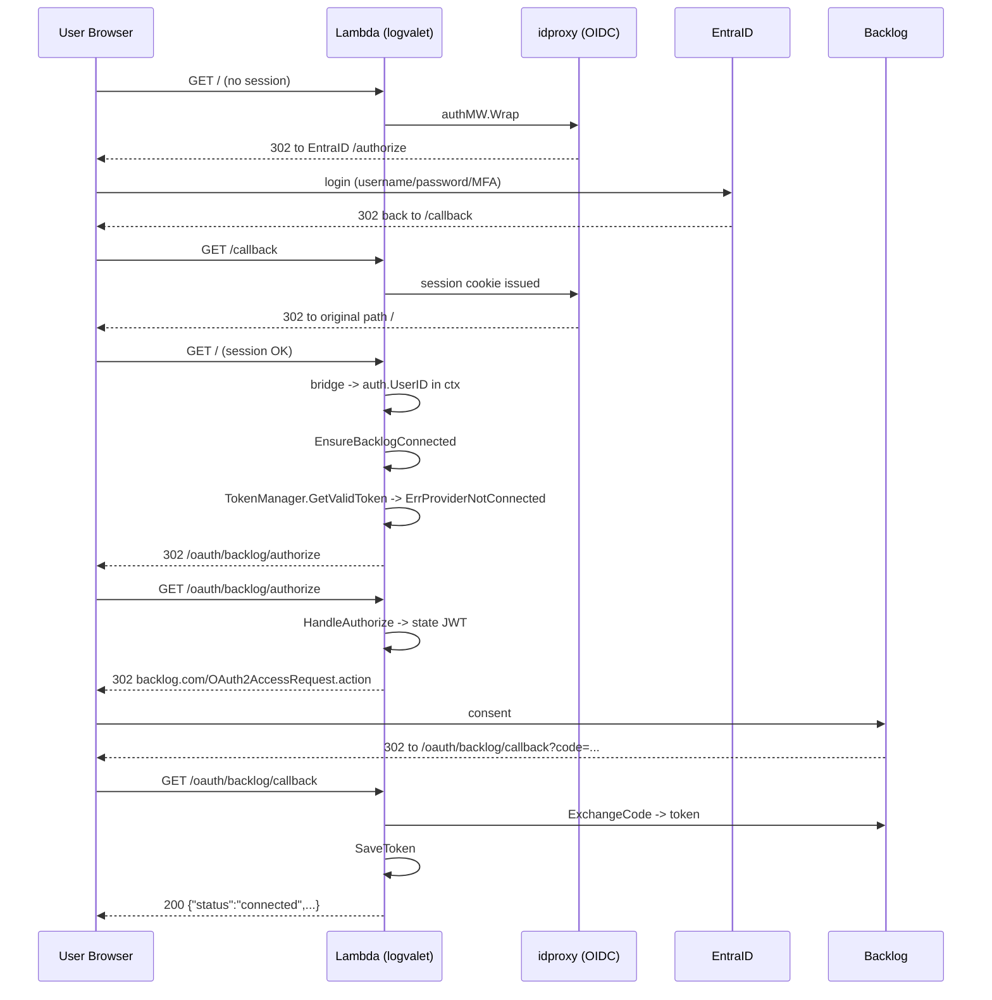
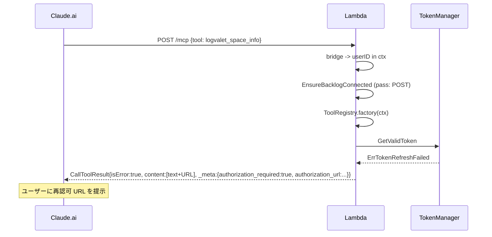
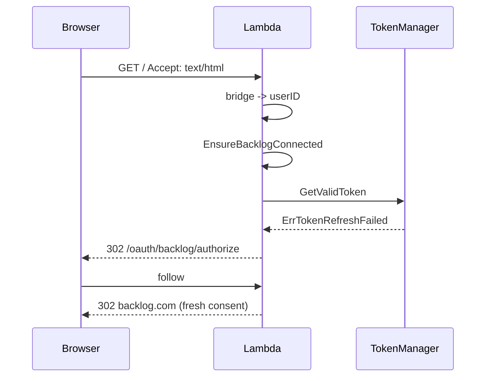

# Backlog OAuth 未接続ユーザーの自動誘導 (v0.13 候補)

## Context

### 背景
logvalet v0.12.0 で Lambda マルチインスタンス対応（signing-key 外部化 + idproxy DynamoDBStore）が完了し、Function URL 経由の OIDC (idproxy) + Backlog OAuth (Mode B) が運用に入った。しかし実運用で下記 UX 問題が顕在化している。

1. ブラウザで MCP サーバー URL にアクセス → EntraID 認証は通るが、その後のウェルカム画面で停止する。
2. Claude.ai コネクタから MCP ツールを呼ぶと `auth: provider not connected for this user` という生文字列だけが返る。
3. ユーザーは `<FUNCTION_URL>/oauth/backlog/authorize` を手で叩かない限り Backlog OAuth 同意画面に到達できない。Claude.ai は接続済み前提で動くため案内が出ない。

### 目的（期待結果）
- ブラウザで Function URL を開くだけで EntraID → Backlog OAuth → 完了画面まで一息で進める。
- MCP ツールから認可 URL を機械判読可能な形で返し、将来的に Claude.ai 側が UI 表示できる土台を作る。
- status エンドポイントから UI ポーラーが認可 URL を取得できる。

### 参照依頼
`github.com/heptagon-inc/logvalet-mcp/plans/logvalet-auto-backlog-oauth-redirect.md` の Proposal A / B / C を **同一 PR** で実装する。

---

## Scope

### 実装範囲（本 PR）
| # | Proposal | 概要 |
|---|----------|------|
| A | ブラウザ自動リダイレクト | `GET /` など `Accept: text/html` のリクエストで Backlog 未接続ならば `/oauth/backlog/authorize` へ 302。 |
| B | MCP ツールエラーに `authorization_url` を注入 | `ErrProviderNotConnected` / `ErrTokenRefreshFailed` / `ErrTokenExpired` 発火時、`CallToolResult.Meta.AdditionalFields` に `authorization_required=true` と `authorization_url` を付与。テキストにも URL を含める。 |
| C | `/oauth/backlog/status` に `authorization_url` を追加 | 未接続 or reauth 要 の場合に `authorization_url` を返す。 |

### スコープ外
- Backlog 側 OAuth クライアント設定変更
- EntraID / OIDC 側の設定変更
- signing-key ローテーション
- Redis / Postgres 向け idproxy Store
- MCP プロトコル上の `WWW-Authenticate` 的な準標準ヘッダー対応（将来 task）

---

## 変更対象ファイル

### 新規
- `internal/cli/mcp_auto_redirect.go` — `EnsureBacklogConnected` ミドルウェア本体
- `internal/cli/mcp_auto_redirect_test.go` — ミドルウェアのユニットテスト（7 ケース）

### 更新
| パス | 変更内容 |
|------|--------|
| `internal/cli/mcp.go` | mux 構築で `EnsureBacklogConnected` を挟み込む。`authorizeURL` を組み立て ToolRegistry と OAuthHandler に供給 |
| `internal/cli/mcp_oauth.go` | `OAuthDeps` に `AuthorizeURL string` フィールドを追加、`BuildOAuthDeps` で `externalURL + "/oauth/backlog/authorize"` を格納 |
| `internal/mcp/server.go` | `ServerConfig.AuthorizationURL` を追加、`NewServerWithFactory` で `ToolRegistry` に伝搬 |
| `internal/mcp/tools.go` | `ToolRegistry.authorizationURL` を保持し、factory エラー時に `ErrProviderNotConnected` 系を検知して `_meta` と拡張テキストを返却 |
| `internal/mcp/tools_test.go` | Proposal B のテスト追加（3 ケース） |
| `internal/transport/http/oauth_handler.go` | `OAuthHandler.authorizeURL` を追加し `HandleStatus` の `statusResponse` に `AuthorizationURL` を含める。`NewOAuthHandler` のシグネチャに `authorizeURL string` を追加 |
| `internal/transport/http/oauth_handler_test.go` | Proposal C のテスト追加（3 ケース）と既存 status テストの更新 |
| `README.md` | 「MCP サーバー運用」節に「ブラウザで開くと自動で Backlog 認可画面へ誘導される」旨を追記 |
| `CHANGELOG.md`（もしくは v0.13 リリースノート相当） | 3 機能追加の記録 |

### テスト種別
- ユニット: `go test ./internal/cli/... ./internal/mcp/... ./internal/transport/http/...`
- 統合 (既存): `go test -tags integration ./internal/cli/...`

---

## 参照可能な既存資産（再利用すべき）

| 目的 | 資産 | 所在 |
|------|------|------|
| 既存ユーザー ID 取得 | `auth.UserIDFromContext(ctx)` | `internal/auth/context.go:14-22` |
| 未接続判定 | `TokenManager.GetValidToken` → `errors.Is(err, auth.ErrProviderNotConnected)` | `internal/auth/manager.go:78-82`, `internal/auth/errors.go:6-38` |
| Reauth 判定 | `errors.Is(err, auth.ErrTokenRefreshFailed)` / `auth.ErrTokenExpired` | `internal/auth/errors.go:15-24` |
| Provider 名 | `backlogProviderName = "backlog"` | `internal/auth/provider/backlog.go:19-20` |
| idproxy 連携 | `idproxy.UserFromContext` → `BridgeFromUserIDFn` で `auth.ContextWithUserID` へ | `internal/cli/mcp_oauth.go:118-155` |
| OAuth ルート登録 | `InstallOAuthRoutes` | `internal/cli/mcp_oauth.go:101-115` |
| MCP ツール登録 | `ToolRegistry.Register` のエラー変換経路 | `internal/mcp/tools.go:43-72` |
| 外部 URL | `McpCmd.ExternalURL` (flag/env `LOGVALET_MCP_EXTERNAL_URL`) | `internal/cli/mcp.go:30` |

---

## 実装前チェック（SDK 挙動確認済）

**mark3labs/mcp-go v0.46.0 の JSON シリアライズ挙動（Meta）**
`types.go:174-182` と `tools.go:474-501` を確認した結果、以下の挙動が保証されている。

- `CallToolResult.MarshalJSON` は `r.Meta != nil` のとき `m["_meta"] = r.Meta` を出力する。
- `Meta.MarshalJSON` は `AdditionalFields` を `maps.Copy(raw, m.AdditionalFields)` で **top-level** に展開する。`ProgressToken` は nil なら出力されない。
- 結論: `result.Meta = &mcp.Meta{AdditionalFields: map[string]any{"authorization_required": true, "authorization_url": url}}` は JSON 上 `{"_meta": {"authorization_required": true, "authorization_url": "..."}}` になり、Claude.ai 側が期待するフォーマットと一致する。

したがって Proposal B は struct リテラル直書きではなく `NewToolResultError(text)` + `result.Meta = &mcp.Meta{AdditionalFields: ...}` のパターンで十分。

## 実装手順

### Step 1 — OAuthDeps に `AuthorizeURL` を追加（共通基盤）

#### 方針
3 Proposal すべてが「`<ExternalURL>/oauth/backlog/authorize` 形式の完全修飾 URL」を必要とするため、`OAuthDeps` に `AuthorizeURL string` を持たせて一箇所で生成する。

#### 変更
- `internal/cli/mcp_oauth.go`
  - `OAuthDeps` 構造体に `AuthorizeURL string` を追加。
  - `BuildOAuthDeps(cfg, space, baseURL, logger)` のシグネチャに `externalURL string` を追加。
  - `authorizeURL := strings.TrimRight(externalURL, "/") + "/oauth/backlog/authorize"` で組み立て。
  - `externalURL` が空の場合は `return nil, fmt.Errorf("mcp: external URL required")`（auth 有効時は必須なので実質発生しない）。
- `internal/cli/mcp.go`
  - `BuildOAuthDeps` 呼び出し箇所に `c.ExternalURL` を追加。

#### 既存資産の再利用
- `cfg.BacklogRedirectURL` は callback URL 専用で **authorize URL と混同しない**（ルートが異なる）。新規フィールドが必要。
- `McpCmd.ExternalURL` は既に必須検証済（`internal/cli/mcp.go:63-115`）。

---

### Step 2 — Proposal A: `EnsureBacklogConnected` ミドルウェア

#### 方針
- `bridge(innerMux)` の **内側** にミドルウェアを挟む。
- 配置: `authMW.Wrap(bridge(ensureBacklogConnected(innerMux)))`
- 条件（ALL true の時のみ 302）:
  1. `r.Method == "GET" || r.Method == "HEAD"`
  2. `Accept` ヘッダーに `text/html` を含む（`strings.Contains(r.Header.Get("Accept"), "text/html")`）
  3. `auth.UserIDFromContext(ctx)` で userID が取得できる
  4. パス prefix が `/oauth/backlog/` ではない（無限ループ防止）
  5. パスが `/mcp` である、または prefix が `/mcp/` である場合は除外（MCP クライアント保護。`/mcphello` のような偶発的な前方一致は拾わない）
  6. `tokenManager.GetValidToken(ctx, userID, "backlog", tenant)` が `ErrProviderNotConnected` / `ErrTokenRefreshFailed` / `ErrTokenExpired` のいずれかを返す

> Note: `/healthz` は `topMux` 側で先に捌かれるため innerMux には到達しない。ここでは除外判定しない。

#### シグネチャ（新規ファイル `internal/cli/mcp_auto_redirect.go`）
```go
package cli

import (
    "errors"
    "net/http"
    "strings"

    "github.com/youyo/logvalet/internal/auth"
    "github.com/youyo/logvalet/internal/auth/provider"
)

// EnsureBacklogConnected はブラウザアクセス時に Backlog 未接続ユーザーを
// Backlog OAuth 認可エンドポイントへ 302 リダイレクトするミドルウェアを返す。
//
// 引数:
//   tm          - Backlog トークンの接続状態を問い合わせる TokenManager
//   providerName - "backlog" 固定（auth/provider.backlogProviderName）
//   tenant      - Backlog スペース名（Profile.Space）
//   authorizeURL - "<externalURL>/oauth/backlog/authorize" の完全修飾 URL
func EnsureBacklogConnected(
    tm auth.TokenManager,
    providerName, tenant, authorizeURL string,
) func(http.Handler) http.Handler
```

#### ルーティング保護
- **ブラウザ判定は `Accept` ヘッダーを最優先** にし、API 呼び出し（`application/json` のみ）は必ず素通りさせる。
- Firefox / Chrome の `Accept` は `text/html,application/xhtml+xml,...` なので `Contains("text/html")` で十分。
- `HEAD` もリダイレクト対象（プリフェッチ対策）。

#### 配置（`internal/cli/mcp.go`）
```go
// 変更前
topMux.Handle("/", authMW.Wrap(bridge(innerMux)))

// 変更後
var finalInner http.Handler = innerMux
if oauthDeps != nil {
    finalInner = EnsureBacklogConnected(
        oauthDeps.TokenManager,
        oauthDeps.Provider.Name(),
        rc.Config.Space,
        oauthDeps.AuthorizeURL,
    )(innerMux)
}
topMux.Handle("/", authMW.Wrap(bridge(finalInner)))
```

`oauthDeps == nil`（OAuth 無効モード）の場合はラップしない。

---

### Step 3 — Proposal B: MCP ツールエラーへ `authorization_url` を付与

#### 方針
`ToolRegistry` に `authorizationURL` を保持し、factory エラー時に以下のロジックで応答を拡張:

```go
c, err := r.factory(ctx)
if err != nil {
    if needsAuthorization(err) && r.authorizationURL != "" {
        return toolResultAuthRequired(err, r.authorizationURL), nil
    }
    return gomcp.NewToolResultError(err.Error()), nil
}
```

- `needsAuthorization(err) bool` は `errors.Is(err, auth.ErrProviderNotConnected) || errors.Is(err, auth.ErrTokenRefreshFailed) || errors.Is(err, auth.ErrTokenExpired)` を判定。
- `toolResultAuthRequired(err, url)` は以下を返す:

```go
text := fmt.Sprintf(
    "Backlog authorization required. Open the following URL in your browser to connect:\n%s",
    url,
)
result := gomcp.NewToolResultError(text)
result.Meta = &gomcp.Meta{
    AdditionalFields: map[string]any{
        "authorization_required": true,
        "authorization_url":      url,
    },
}
return result
```

#### シグネチャ変更
- `internal/mcp/tools.go`
  - `ToolRegistry` struct に `authorizationURL string` を追加。
  - `NewToolRegistry(server, factory)` → `NewToolRegistry(server, factory, authorizationURL)` に拡張、呼び出し箇所をすべて更新。
- `internal/mcp/server.go`
  - `ServerConfig` に `AuthorizationURL string` を追加。
  - `NewServerWithFactory` 内で `NewToolRegistry` に供給。
- `internal/cli/mcp.go`
  - `ServerConfig{..., AuthorizationURL: oauthDeps.AuthorizeURL}` を設定。`oauthDeps == nil` なら空文字列。

#### 後方互換
- `oauthDeps == nil` （認証なしモード）では `authorizationURL == ""` となり、従来どおり `NewToolResultError(err.Error())` を返す（挙動不変）。

---

### Step 4 — Proposal C: `/oauth/backlog/status` 拡張

#### 方針
- `statusResponse` に `AuthorizationURL string` フィールドを追加。
- `OAuthHandler.authorizeURL` を保持し、`HandleStatus` で「未接続」「reauth 必要」のケースに URL を注入する。

#### 応答例（更新後）
```jsonc
// 未接続
{ "connected": false, "authorization_url": "https://.../oauth/backlog/authorize" }

// 再認可必要
{ "connected": true, "needs_reauth": true, "provider": "backlog", "tenant": "...",
  "authorization_url": "https://.../oauth/backlog/authorize" }

// 正常接続
{ "connected": true, "provider": "backlog", "tenant": "...", "provider_user_id": "123" }
// ※ authorization_url は omitempty で省略
```

#### シグネチャ変更
- `internal/transport/http/oauth_handler.go`
  - `OAuthHandler` struct に `authorizeURL string`
  - `NewOAuthHandler(p, tm, tenant, redirectURI, stateSecret, stateTTL, logger)` → `NewOAuthHandler(p, tm, tenant, redirectURI, authorizeURL, stateSecret, stateTTL, logger)`
  - `statusResponse` に `AuthorizationURL string \`json:"authorization_url,omitempty"\``
  - `HandleStatus` の分岐で `AuthorizationURL: h.authorizeURL` を含める（`connected=false` と `needs_reauth=true` ケースのみ）
- `internal/cli/mcp_oauth.go`
  - `BuildOAuthDeps` 内の `NewOAuthHandler` 呼び出しに `authorizeURL` を追加。

---

## テスト設計書（TDD: Red → Green → Refactor）

### Proposal A ミドルウェアテスト — `internal/cli/mcp_auto_redirect_test.go`（新規）

テーブル駆動。以下 7 ケースを網羅する（`httptest.NewRecorder` + `http.Request` で十分、idproxy は不要）。

| ID | ユーザー状態 | Method | Path | Accept | GetValidToken 返却 | 期待 |
|----|------------|--------|------|--------|------------------|------|
| T1 | userID 設定済 | GET | `/` | `text/html,application/xhtml+xml` | `nil, ErrProviderNotConnected` | 302 `Location: https://.../oauth/backlog/authorize` |
| T2 | userID 設定済 | POST | `/` | `text/html`（あえて矛盾した Accept） | `nil, ErrProviderNotConnected` | 200 (next) — method が GET/HEAD 以外なら Accept 関係なく素通り |
| T3 | userID 設定済 | GET | `/` | `application/json` | `nil, ErrProviderNotConnected` | 200 (next) — Accept 不一致で素通り |
| T4a | userID 設定済 | GET | `/mcp` | `text/html` | — | 200 (next) — `/mcp` は除外 |
| T4b | userID 設定済 | GET | `/mcphello` | `text/html` | `nil, ErrProviderNotConnected` | 302 — `/mcp` との前方一致誤判定がないこと |
| T5 | userID 設定済 | GET | `/oauth/backlog/authorize` | `text/html` | — | 200 (next) — 無限ループ防止 |
| T6 | userID なし | GET | `/` | `text/html` | — | 200 (next) — userID 未設定時は素通り（idproxy 認証前や logout 直後を含む） |
| T7 | userID 設定済 | GET | `/` | `text/html` | `record, nil` (接続済) | 200 (next) — 通常フロー |
| T8 | userID 設定済 | GET | `/` | `text/html` | `nil, ErrTokenRefreshFailed` | 302 `/oauth/backlog/authorize` |
| T9 | userID 設定済 | HEAD | `/` | `text/html` | `nil, ErrProviderNotConnected` | 302 `/oauth/backlog/authorize` |

モック TokenManager:
```go
type fakeTM struct {
    result *auth.TokenRecord
    err    error
}
func (f *fakeTM) GetValidToken(ctx context.Context, uid, p, t string) (*auth.TokenRecord, error) {
    return f.result, f.err
}
func (f *fakeTM) SaveToken(ctx context.Context, r *auth.TokenRecord) error { return nil }
func (f *fakeTM) RevokeToken(ctx context.Context, uid, p, t string) error { return nil }
```

### Proposal B ツールテスト — `internal/mcp/tools_test.go`（追加）

| ID | factory 返却 | `authorizationURL` | 期待 |
|----|------------|-------------------|------|
| T10 | `nil, ErrProviderNotConnected` | `"https://x/oauth/backlog/authorize"` | `result.IsError==true`、テキストに URL 含む、`Meta.AdditionalFields["authorization_required"]==true`、`["authorization_url"]=="https://x/..."` |
| T11 | `nil, ErrTokenRefreshFailed` | 同上 | 同上（reauth も同一扱い） |
| T12 | `nil, 汎用エラー` | 同上 | 従来挙動（Meta なし、テキストは `err.Error()`） |
| T13 | `nil, ErrProviderNotConnected` | `""`（authorizationURL 未供給） | 従来挙動（Meta なし、テキストは `err.Error()`） — 後方互換 |

### Proposal C status テスト — `internal/transport/http/oauth_handler_test.go`（追加/更新）

| ID | GetValidToken 返却 | 期待レスポンス |
|----|------------------|--------------|
| T14 | `record, nil` | `{"connected":true,...}`、`authorization_url` 省略 |
| T15 | `nil, ErrProviderNotConnected` | `{"connected":false,"authorization_url":"https://x/oauth/backlog/authorize"}` |
| T16 | `nil, ErrTokenRefreshFailed` | `{"connected":true,"needs_reauth":true,"authorization_url":"https://x/..."}` |

### 既存テストの更新
- `oauth_handler_test.go` で `NewOAuthHandler` のシグネチャ変更に追従（authorizeURL 引数追加）。
- `mcp_oauth_test.go` で `BuildOAuthDeps` のシグネチャ変更に追従（externalURL 引数追加）。
- `mcp_oauth_e2e_test.go`（`-tags integration`）にリダイレクト検証を追加（ブラウザリクエストが 302 になること）。

### 実行コマンド
```bash
# ユニット + 単体
go test ./internal/cli/... ./internal/mcp/... ./internal/transport/http/...

# 統合
go test -tags integration ./internal/cli/...

# Lint
go vet ./...
```

---

## シーケンス図

### 正常系: 未接続ユーザーのブラウザアクセス（Proposal A）



### エラー系: 既接続ユーザーがツール呼び出し（Proposal B - reauth パス）



### エラー系: ブラウザ GET でリフレッシュ失敗



---

## アーキテクチャ整合性

| 観点 | 方針 | 所在 |
|------|------|------|
| Router | 標準 `http.ServeMux` を継続使用。ミドルウェアは `func(http.Handler) http.Handler` 形式（`BridgeFromUserIDFn` と同一シグネチャ） | `internal/cli/mcp_oauth.go:125-136` |
| ミドルウェア順序 | idproxy (最外) → bridge → EnsureBacklogConnected → innerMux。userID が context に入ってから判定するのが必須 | `internal/cli/mcp.go:204-226` |
| 命名 | 既存 `InstallOAuthRoutes`, `newUserIDBridge`, `BridgeFromUserIDFn` の公開/非公開ルールに追随。`EnsureBacklogConnected` は公開（同パッケージ内テスト容易化） | — |
| 依存方向 | `internal/cli` → `internal/auth` → `internal/auth/provider`（循環なし）。`internal/mcp` → `internal/auth` も既存 | — |
| 新規 interface 不要 | `TokenManager` interface は既存のまま。`IsConnected` は追加しない | `internal/auth/manager.go:28-44` |

---

## リスク評価と対策

| ID | リスク | 重大度 | 対策 |
|----|------|-------|------|
| R1 | ミドルウェアが `/mcp` 通信を 302 で阻害し MCP クライアントが壊れる | Critical | Path prefix `/mcp` と Accept 判定の二重除外。T4 テストで保証。E2E で Claude.ai 同等の `application/json` POST を含める。 |
| R2 | `/oauth/backlog/authorize` 自身が再帰的に 302 される（無限ループ） | Critical | Path prefix `/oauth/backlog/` 除外を最優先判定に配置。T5 テストで保証。 |
| R3 | idproxy の内部エンドポイント（`/login`, `/callback`, `/logout` など）が 302 で潰される | Medium | `idproxy.Wrap` が内部エンドポイントで `next()` を呼ぶか否かに依存せず、**userID が context 未設定の場合はミドルウェアが素通りする設計**により安全。ログアウト直後やセッション破棄中にも userID は復元されないため 302 は発火しない。`mcp_integration_test.go` の既存 `performBrowserLogin` で通過確認を追加。 |
| R4 | `GetValidToken` の自動リフレッシュ試行が DynamoDB 書込を発生させパフォーマンス劣化 | Medium | 既存挙動と同等（ツール呼び出し時も同じパス）。ブラウザ GET 頻度は低いため許容。 |
| R5 | `_meta.authorization_required` が MCP 標準ではないフィールド名である | Medium | `AdditionalFields` は SDK が JSON にそのまま書き出す。Claude.ai 側が未対応でも「テキストに URL を含める」フォールバックで UX 退化しない。将来的に MCP 仕様側で `WWW-Authenticate` 相当が固まったら切替を検討（別 task）。 |
| R6 | `ExternalURL` 未設定時に authorize URL が不正 | High | `--auth` 有効時は `ExternalURL` が必須検証済（`internal/cli/mcp.go:63-115`）。OAuth 無効時は OAuthDeps 自体が nil のため本機能もロードされない。検証を `BuildOAuthDeps` 冒頭でも追加。 |
| R7 | `HEAD` リクエストへの 302 でボディ差し込みが問題化 | Low | `http.Redirect` は HEAD を正しく処理する標準実装。問題なし。T9 で保証。 |
| R8 | 既存 `NewOAuthHandler` シグネチャ変更で他パッケージビルドが壊れる | Low | 呼び出し元は `internal/cli/mcp_oauth.go` のみ。単一箇所で追従。テストを先に失敗させる Red フェーズで検知。 |
| R9 | Status エンドポイントに `authorization_url` を含めることが情報漏洩になる | Low | `ExternalURL` は公開 URL かつ未認証ユーザーに対しては idproxy が 401 を返すため、認証済ユーザーにのみ返却される。漏洩リスクはほぼなし。 |

### フェイルセーフ
- ミドルウェアで `TokenManager.GetValidToken` が予期しないエラー（`ErrUnauthenticated` 等）を返した場合は 302 しない（next に流す）。エラー種別を明示的にホワイトリストで判定する。

### ロールバック
- PR 単位の revert で復旧可能。状態（DynamoDB 等）への変更はないため副作用ロールバック不要。

---

## ドキュメント更新

### README.md
- 「Running the MCP Server」または「認証付きで Function URL にデプロイする手順」節の末尾に以下を追加:

```markdown
### Backlog OAuth 自動誘導

認証 (`--auth`) と Backlog OAuth (`--backlog-client-id` 等) を有効にしてデプロイすると、
ブラウザで `$LOGVALET_MCP_EXTERNAL_URL` を開いた際に以下のフローが自動実行されます:

1. EntraID 等の OIDC プロバイダでログイン
2. Backlog トークン未保存の場合 `/oauth/backlog/authorize` へ自動リダイレクト
3. Backlog 同意画面 → コールバック → 完了画面

MCP クライアントが未接続状態でツールを呼ぶと、レスポンスの `_meta.authorization_url` に
Backlog 認可 URL が含まれるため、クライアント側でユーザーに提示できます。
```

### CHANGELOG / リリースノート
- `v0.13.0` 項に以下を追加:
  - `feat(mcp): auto-redirect browser users to Backlog OAuth when not connected (Proposal A)`
  - `feat(mcp): expose authorization_url in tool-call errors and /oauth/backlog/status (Proposal B/C)`

### PR タイトル（1 PR に集約）
`feat(mcp): auto-guide unauthorized users to Backlog OAuth (redirect + authorization_url)`

### コミット分割（smart-commit で自然に分かれる単位）
1. `feat(mcp): add EnsureBacklogConnected middleware`
2. `feat(mcp): expose authorization_url in tool-call errors`
3. `feat(mcp): include authorization_url in /oauth/backlog/status`
4. `docs: describe auto-redirect and authorization_url metadata`

---

## 検証手順（手動 E2E）

### 前提
- Lambda (logvalet-mcp) をこのブランチでデプロイ可能なこと
- 対象 DynamoDB (idproxy store, tokenstore) を **認可済み状態ではない** ユーザーで試す

### 手順
1. **ユニットテスト**
   ```bash
   go test ./...
   go test -tags integration ./internal/cli/...
   go vet ./...
   ```
2. **ローカル dry-run**（有効な ExternalURL がない場合はモック idproxy 付き `httptest` で代替。既存 `mcp_integration_test.go` のパターンを流用）
3. **Lambda デプロイ後の E2E**
   - A-1: ブラウザで `$LOGVALET_MCP_EXTERNAL_URL` にアクセス → EntraID 認証 → Backlog 同意画面に自動遷移することを確認
   - A-2: 同じユーザーで 2 回目のアクセス → ウェルカム（接続済）で停止することを確認（現行挙動維持）
   - A-3: `curl -H "Accept: application/json" $URL/mcp` → 302 ではなくツール応答が返ることを確認
   - B-1: Claude.ai コネクタから `logvalet_space_info` を呼ぶ → レスポンスの `_meta.authorization_url` と text 内 URL を目視確認
   - C-1: `curl $URL/oauth/backlog/status` で `connected=false, authorization_url=...` を確認
4. **トークン意図的失効**（Backlog 側で refresh_token を revoke）して C-1 が `needs_reauth=true` + `authorization_url` を返すことを確認

---

## チェックリスト（5観点27項目セルフレビュー）

### 観点1: 実装実現可能性と完全性（5/5）
- [x] 手順の抜け漏れがない（Step 1-4 で OAuthDeps → Middleware → ToolRegistry → Status の順に積み上げ）
- [x] 各ステップが具体的（ファイル名・関数名・シグネチャまで明記）
- [x] 依存関係が明示（Step 1 が他すべての前提）
- [x] 変更対象ファイルが網羅（新規 2 + 更新 8）
- [x] 影響範囲が特定（OAuth 無効モードは挙動不変、既存テストへの破壊は呼び出しシグネチャのみ）

### 観点2: TDD テスト設計の品質（6/6）
- [x] 正常系ケース網羅（T7: 接続済 browser, T14: status connected）
- [x] 異常系ケース網羅（T1, T8, T15, T16）
- [x] エッジケース（T13: authorizationURL 空、T9: HEAD 法、T5: 無限ループ防止）
- [x] 入出力が具体的（テーブル内に Accept ヘッダー・mock 返却値を明記）
- [x] Red → Green → Refactor 順（Red: テスト追加 → Green: ミドルウェア実装 → Refactor: 重複の共通化）
- [x] モック/スタブ設計（fakeTM, fakeFactory）

### 観点3: アーキテクチャ整合性（5/5）
- [x] 命名規則（`EnsureBacklogConnected`, camelCase フィールド）
- [x] 設計パターン統一（既存の `BridgeFromUserIDFn` と同じ middleware 関数シグネチャ）
- [x] モジュール分割適切（middleware は `internal/cli`、エラー変換は `internal/mcp`、応答は `internal/transport/http` と責務分離）
- [x] 依存方向正しい（cli → mcp → auth）
- [x] 類似機能との統一（既存 OAuth ルート登録スタイルと揃える）

### 観点4: リスク評価と対策（6/6）
- [x] リスク特定（R1-R9）
- [x] 対策が具体（テスト ID、除外 prefix、検証済設定参照を明記）
- [x] フェイルセーフ（想定外エラーは next に流す）
- [x] パフォーマンス評価（R4: GetValidToken の DynamoDB コスト）
- [x] セキュリティ（R9: authorization_url の情報漏洩評価）
- [x] ロールバック計画（PR revert、状態変更なし）

### 観点5: シーケンス図の完全性（5/5）
- [x] 正常フロー（未接続ブラウザ → 完了）
- [x] エラーフロー（reauth ツール呼び出し、reauth ブラウザ）
- [x] ユーザー・システム・外部 API 間の相互作用が明確
- [x] タイミング制御（idproxy → bridge → middleware → innerMux の順序）
- [x] リトライ／タイムアウト（`GetValidToken` の自動リフレッシュ試行が暗黙のリトライ）

---

## Next Action
> このプランを実装するには以下を実行してください:
> `/devflow:implement` — このプランに基づいて実装を開始
> `/devflow:cycle` — 自律ループで複数マイルストーンを連続実行
