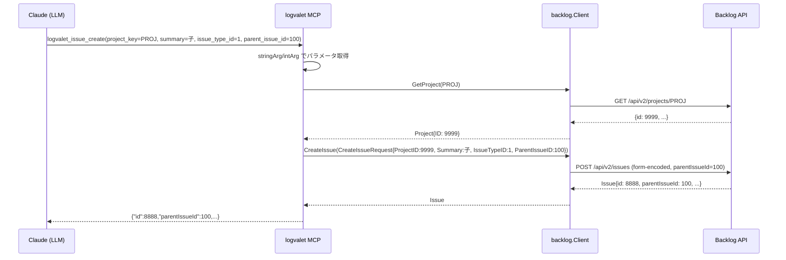
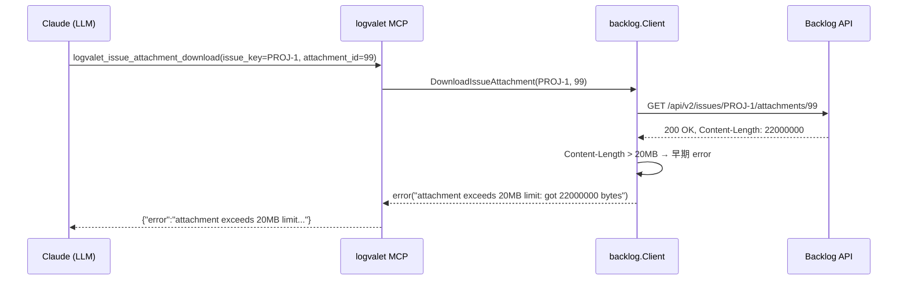

# CLI/MCP パラメータ統一計画

## Context

logvalet は Backlog 向け CLI + MCP サーバーを提供するが、現状 **MCP の方が CLI よりパラメータ・ツールが少なく、LLM 経由の操作が CLI より不便** な状態。発端は MCP の `logvalet_issue_create` に `parent_issue_id` が無く子課題を作成できない件。調査の結果、不足は issue_create に留まらず広範なツール群に存在することが判明。

**ユーザー要望:** CLI と MCP で指定できるオプションを揃える。全ツールで。MCP の方が不便ということがないように。

**狙い:** MCP 経由の LLM 操作が CLI と同等以上に可能な状態にし、Claude Code/Claude Desktop からの Backlog 運用体験を一等市民にする。

## スコープ

### 実装範囲
- カテゴリ A: 既存 MCP ツール 6 種へのパラメータ追加
- カテゴリ B: 未実装 MCP ツール 14 種の新規追加
- カテゴリ C: 命名・型の不整合解消
- カテゴリ D: MCP で不要と判断する CLI フラグの方針を明文化

### スコープ外
- Backlog API の新機能追加（API クライアント自体の拡張は既存実装で足りる範囲）
- CLI フラグ名の大規模な変更（例外: C4 の `--pull-request-id` 追加のみ）
- ユーザー認証・OAuth フローの変更
- パフォーマンス最適化・リファクタリング
- **`custom_fields` 対応**（CLI の `http_client.go` 側も送信未実装のため「MCP の不足」ではない。CLI/MCP 両対応として別タスクで扱う）
- **`--dry-run` の MCP 対応**（将来検討事項。当面は MCP 側では未実装として保留。annotation はツール単位の性質宣言であり、呼び出し単位のプレビューには別途 `dry_run` パラメータが必要になり得るが、本計画では先延ばしする）
- **MCP Resources API への移行**（バイナリダウンロードは本来 `resources/read` の BlobResourceContents が設計的に正しいが、今回は Tool + base64 で実装。将来の再設計は別タスク）
- **`WithArray` への移行**（既存 CSV パターンと整合性を取るため本計画は CSV 文字列方式で統一。将来のメジャーバージョンで別途検討）

---

## マイルストーン分割

| M | 見出し | 工数目安 | 依存 |
|---|--------|---------|------|
| M01 | 既存 MCP ツール 6 種のパラメータ充足 | 中 | なし |
| M02 | 未実装 MCP ツール 14 種の新規追加 | 大 | M01 |
| M03 | 命名・型統一（破壊的変更含む） | 小 | M02 |
| M04 | ドキュメント整備・E2E 動作確認 | 小 | M03 |

---

## M01: 既存 MCP ツール 6 種のパラメータ充足

### 設計ルール: 配列パラメータは CSV 文字列方式に統一

**決定:** 複数値パラメータは `WithString` + カンマ区切り文字列で表現する（例: `category_ids: "10,20,30"`）。

**理由:**
- 既存コードベース（`logvalet_issue_list.project_keys`, `exclude_status`, `logvalet_issue_stale.project_keys` 等）が全て CSV 方式で統一されている
- `mark3labs/mcp-go v0.46.0` は `WithArray` をサポートするが、既存ツールを巻き込むと破壊的変更 + スキーマ肥大化
- LLM は CSV 方式でも問題なく扱える（実運用で実績あり）
- テストヘルパ（`strings.Split` 系）が流用可能

**破棄案:** `WithArray("category_ids", WithNumberItems())` を採用すると既存パターンと二重化する。本計画では採用しない。将来のメジャーバージョンで統一する場合は別タスクとする。

### 対象ツールと追加パラメータ

#### A1. `logvalet_issue_create` (`internal/mcp/tools_issue.go`)

| parameter | type | required | description |
|-----------|------|----------|-------------|
| parent_issue_id | number | No | Parent issue ID (for creating a child issue) |
| category_ids | string | No | Comma-separated category IDs (e.g. "10,20") |
| version_ids | string | No | Comma-separated version IDs |
| milestone_ids | string | No | Comma-separated milestone IDs |
| due_date | string | No | Due date in YYYY-MM-DD format |
| start_date | string | No | Start date in YYYY-MM-DD format |
| notified_user_ids | string | No | Comma-separated user IDs to notify |

ハンドラ実装:
- `parent_issue_id` → `req.ParentIssueID`
- `category_ids` / `version_ids` / `milestone_ids` / `notified_user_ids` → `strings.Split` で `[]int` に変換して `req.CategoryIDs` 等に設定
- `due_date` / `start_date` → `time.Parse("2006-01-02", ...)` で `*time.Time` に変換
- 既存フィールドは全て `internal/backlog/types.go` に存在するため、クライアント側の追加実装は不要

CSV → `[]int` 変換は共通ヘルパ `parseIDList(s string) ([]int, error)` として `internal/mcp/util.go` に新規配置（既存なら流用）。

#### A2. `logvalet_issue_update` (`internal/mcp/tools_issue.go`)

| parameter | type | required | description |
|-----------|------|----------|-------------|
| issue_type_id | number | No | Issue type ID |
| category_ids | string | No | Comma-separated category IDs |
| version_ids | string | No | Comma-separated version IDs |
| milestone_ids | string | No | Comma-separated milestone IDs |
| due_date | string | No | Due date (YYYY-MM-DD) |
| start_date | string | No | Start date (YYYY-MM-DD) |
| notified_user_ids | string | No | Comma-separated user IDs to notify |

注意: `UpdateIssueRequest.IssueTypeID` は `*int` のため、未指定と 0 の扱いに注意（ポインタで nil = 変更なし）。

#### A3. `logvalet_issue_list` (`internal/mcp/tools_issue.go`)

| parameter | type | required | description |
|-----------|------|----------|-------------|
| start_date | string | No | Start date filter: today, this-week, this-month, YYYY-MM-DD, or YYYY-MM-DD:YYYY-MM-DD |
| updated_since | string | No | Updated since (YYYY-MM-DD) |
| updated_until | string | No | Updated until (YYYY-MM-DD) |

#### A4. `logvalet_issue_comment_add` (`internal/mcp/tools_issue.go`)

| parameter | type | required | description |
|-----------|------|----------|-------------|
| notified_user_ids | array\<number\> | No | User IDs to notify |

#### A5. `logvalet_activity_list` (`internal/mcp/tools_activity.go`)

| parameter | type | required | description |
|-----------|------|----------|-------------|
| offset | number | No | Offset for pagination |
| activity_type_ids | string | No | Comma-separated activity type IDs |
| order | string | No | Sort order: asc or desc (default desc) |

#### A6. `logvalet_team_list` (`internal/mcp/tools_team.go`)

| parameter | type | required | description |
|-----------|------|----------|-------------|
| count | number | No | Max number of teams (default 100) |
| offset | number | No | Offset for pagination |
| no_members | boolean | No | Exclude member information (default false) |

### TDD テスト設計

#### 正常系（必須項目）

| ID | 対象 | 入力 | 期待出力 |
|----|------|------|---------|
| A1-N1 | issue_create | project_key=PROJ, summary=子1, issue_type_id=1, parent_issue_id=100 | req.ParentIssueID=100 で client.CreateIssue 呼び出し |
| A1-N2 | issue_create | category_ids=[10,20] | req.CategoryIDs=[]int{10,20} |
| A1-N3 | issue_create | due_date="2026-05-01" | req.DueDate が time.Time(2026-05-01) |
| A2-N1 | issue_update | milestone_ids=[5] | req.MilestoneIDs=[]int{5} |
| A3-N1 | issue_list | start_date="this-week" | ListIssuesOptions.StartDateSince/Until が今週範囲 |
| A5-N1 | activity_list | offset=10, order="asc" | ListSpaceActivitiesOptions に反映 |
| A6-N1 | team_list | no_members=true | response からメンバー情報が除外される |

#### 異常系

| ID | 対象 | 入力 | 期待 |
|----|------|------|------|
| A1-E1 | issue_create | due_date="invalid" | error: "invalid date format for due_date" |
| A1-E2 | issue_create | category_ids="10,abc" | error: "invalid category_ids: must be comma-separated integers" |
| A3-E1 | issue_list | start_date="2026-13-99" | error: "invalid date format" |

#### エッジケース

| ID | 対象 | 入力 | 期待 |
|----|------|------|------|
| A1-G1 | issue_create | category_ids="" | req.CategoryIDs が nil（空文字列 = 未指定扱い） |
| A1-G2 | issue_create | parent_issue_id=0 | req.ParentIssueID=0（= 未指定扱い、http_client は送信しない） |
| A2-G1 | issue_update | 全パラメータ省略 + issue_key のみ | no-op エラー、または空更新として成功 |
| A1-G3 | issue_create | category_ids="10" | req.CategoryIDs=[]int{10}（単一要素でも正常） |

### 変更ファイル

- `internal/mcp/tools_issue.go` (A1〜A4)
- `internal/mcp/tools_issue_test.go` (A1〜A4 テスト追加)
- `internal/mcp/tools_activity.go` (A5)
- `internal/mcp/tools_activity_test.go` (A5 テスト追加)
- `internal/mcp/tools_team.go` (A6)
- `internal/mcp/tools_team_test.go` (A6 テスト追加、ファイル未存在なら新規)
- `internal/mcp/util.go` 等に日付パースヘルパが無ければ追加（CLI 側 `internal/cli/resolve.go` に `parseDateRange` 等があるか確認、あれば共通化）

### 実装ステップ

1. Red: A1〜A6 の正常系/異常系/エッジケーステストを先に書く（全て fail するはず）
2. Green: パラメータ定義追加 → ハンドラでの取得 → request 型への詰め替え
3. Refactor: 日付パース・配列パースを共通ヘルパに抽出

### リスク

| リスク | 重大度 | 対策 |
|--------|-------|------|
| 既存 MCP ユーザーのスキーマ期待値変更 | 低 | 全て additive（required を増やさない）なので後方互換 |
| custom_fields の型が map\<string,string\> で MCP JSON Schema と整合しない | 中 | M01 では custom_fields はスコープ外。CLI 側も MCP 側も未対応のため M04 で別途検討 |
| 日付パース仕様の揺れ | 中 | CLI 側の既存関数を再利用。新規実装しない |

---

## M02: 未実装 MCP ツール 14 種の新規追加

### 追加ツール一覧

| 新規ツール名 | 対応 CLI | 主なパラメータ | 配置ファイル |
|------------|---------|--------------|------------|
| `logvalet_user_me` | `user me` | なし | `tools_user.go` |
| `logvalet_user_activity` | `user activity` | user_id(req), since, until, limit, project, type | `tools_user.go` |
| `logvalet_digest_unified` | `digest unified` | project[], user[], team[], issue[], since(req), until, due_date, start_date | `tools_analysis.go` |
| `logvalet_activity_digest` | `activity digest` | since, until, limit, project | `tools_activity.go` |
| `logvalet_document_tree` | `document tree` | project_key(req) | `tools_document.go` |
| `logvalet_document_digest` | `document digest` | document_id(req), since, until, limit | `tools_document.go` |
| `logvalet_space_digest` | `space digest` | since, until, limit | `tools_space.go` |
| `logvalet_space_disk_usage` | `space disk-usage` | なし | `tools_space.go` |
| `logvalet_meta_version` | `meta version` | project_key(req) | `tools_meta.go` |
| `logvalet_meta_custom_field` | `meta custom-field` | project_key(req) | `tools_meta.go` |
| `logvalet_team_project` | `team project` | project_key(req) | `tools_team.go` |
| `logvalet_issue_attachment_delete` | `issue attachment delete` | issue_key(req), attachment_id(req) | `tools_issue.go` |
| `logvalet_issue_attachment_download` | `issue attachment download` | issue_key(req), attachment_id(req) | `tools_issue.go` |
| `logvalet_shared_file_download` | `shared-file download` | project_key(req), file_id(req) | `tools_shared_file.go` |

### 設計判断

- **バイナリダウンロード系** (`issue_attachment_download`, `shared_file_download`):
  - MCP のレスポンスは JSON なので、バイナリをそのまま返せない。Base64 エンコードし `{content_base64, filename, content_type, size_bytes}` で返却
  - **サイズ上限 20MB** を `internal/backlog/client.go` のダウンロードメソッド内（transport 層）で検査し、超過時は早期 error。MCP ハンドラ層では検査せず Client 層に単一責任化
  - Claude Desktop の MCP 制約に抵触する可能性があるため README に記載
- **削除系** (`issue_attachment_delete`): `writeAnnotation("添付削除", destructive=true)` を設定して LLM に破壊性を伝える
- **digest 系**: 既存の `internal/digest/` ビルダーを再利用。新規ロジックは書かない

### TDD テスト設計

各ツールに対し最低 1 正常系 + 1 異常系 + 1 エッジケースを用意。代表例のみ記載:

| ID | 対象 | 入力 | 期待出力 |
|----|------|------|---------|
| B1-N1 | user_me | (none) | client.GetMyself の結果を返す |
| B2-N1 | user_activity | user_id="12345", since="2026-04-01" | ListUserActivitiesOptions に since 反映 |
| B3-N1 | digest_unified | project=["PROJ"], since="this-week" | digest.BuildUnified を呼び出し |
| B13-N1 | issue_attachment_download | issue_key="PROJ-1", attachment_id=99 | base64 エンコードされた content を返却 |
| B13-E1 | issue_attachment_download | サイズ 21MB 想定 | error: "attachment exceeds 20MB limit" |
| B11-N1 | meta_custom_field | project_key="PROJ" | client.ListProjectCustomFields を呼び出し |

### 変更ファイル

- `internal/mcp/tools_*.go` 既存ファイル + 対応する `_test.go`
- `internal/mcp/registry.go` 相当（ツール登録先、既存ファイルで登録しているはず。要確認）
- `internal/backlog/http_client.go` のダウンロード系メソッドに Content-Length 検査を追加（transport 層でサイズ検査）

### 実装ステップ

1. Red: 各ツールのテストを先に書く
2. Green: ツール定義 → ハンドラ → 既存 `backlog.Client` / `digest.Builder` の呼び出し
3. Refactor: 共通パターンをヘルパに抽出（日付範囲パース、ダウンロード共通処理）

### リスク

| リスク | 重大度 | 対策 |
|--------|-------|------|
| バイナリダウンロードのメモリ消費 | 中 | サイズ上限 20MB を Client 層で強制、README に明記 |
| digest_unified の多様な入力の組み合わせ | 中 | CLI 実装 (`internal/cli/digest_cmd.go`) を参照してパターン踏襲 |
| ツール数増加による MCP initial handshake の肥大化 | 低 | MCP は `tools/list` で遅延配信可能。問題化すれば分類ベースのフィルタ導入 |
| ダウンロードサイズ検査の配置ミス | 中 | Client 層 (`internal/backlog/client.go`) で一元管理。ハンドラ層では検査しない |

---

## M03: 命名・型統一（破壊的変更を含む）

### 変更項目

| ID | 変更内容 | 対象ファイル |
|----|---------|-------------|
| C1 | ページネーション `limit` を `count` に統一（全 MCP ツール）。`issue_list`, `issue_comment_list`, `document_list`, `shared_file_list` の `limit` を `count` に改名 | `tools_issue.go`, `tools_document.go`, `tools_shared_file.go` |
| C2 | `logvalet_watching_list.user_id` を string に統一（`type: string`, `pattern: "^(me\|[0-9]+)$"`）。数値送信は reject（破壊的変更） | `tools_watching.go` |
| C3 | `logvalet_document_list.project_id` を `project_key` に変更（CLI と揃える） | `tools_document.go` |
| C4 | CLI 側の `star add --pr-id` を `--pull-request-id` に改名（MCP と揃える）。旧フラグは alias として残す | `internal/cli/star.go` |

### 後方互換方針

- **C1 (count 統一)**: 既存 `limit` を受けた場合は warning ログを出して `count` にフォールバック変換する暫定コードを v0.16.x で残し、v0.17 で削除。または一気に切り替えて CHANGELOG で明示 → **後者を推奨（logvalet はまだ 0.x で破壊的変更を許容）**
- **C2 (user_id string 化)**: `oneOf` で数値と文字列を両方受ける B 案も検討したが、LLM のスキーマ理解容易性を優先し A 案（string + pattern 強制）で統一。数値送信は reject
- **C3 (project_key 化)**: 完全置き換え。CHANGELOG に記載
- **C4 (CLI --pull-request-id)**: alias 対応で後方互換維持

### TDD テスト設計

| ID | 対象 | 入力 | 期待 |
|----|------|------|------|
| C1-N1 | issue_list | count=50 | limit=50 相当で動作 |
| C1-E1 | issue_list | limit=50 (旧パラメータ名) | error: "unknown parameter: limit" or warning + fallback |
| C2-N1 | watching_list | user_id="me" | GetMyself で解決 |
| C2-N2 | watching_list | user_id="12345" | user_id=12345 で API 呼び出し |
| C2-E1 | watching_list | user_id=12345 (number) | schema validation error |
| C3-N1 | document_list | project_key="PROJ" | client.ListDocuments(projectID) で呼び出し |
| C4-N1 | CLI: star add --pull-request-id=100 | 正常処理 |
| C4-N2 | CLI: star add --pr-id=100 | deprecation warning + 正常処理 |

### リスク

| リスク | 重大度 | 対策 |
|--------|-------|------|
| 既存 MCP ユーザーの破壊的変更 | 高 | CHANGELOG に明示、README の MCP セクション更新、v0.16.0 でメジャー級変更として明記 |
| skills/ サンプルコマンドの古い記法 | 中 | `/skills/**/*.md` 内の MCP ツール呼び出し例を全件 grep して更新 |

---

## M04: ドキュメント整備・E2E 動作確認

### ドキュメント更新

- `README.md`
  - MCP セクションに「CLI と同等のオプションをサポート」と明記
  - ダウンロード系ツールのサイズ上限 (20MB) を記載
  - v0.16.0 CHANGELOG で破壊的変更を記述
- `docs/specs/logvalet_full_design_spec_with_architecture.md`
  - MCP ツール一覧セクションを更新
- `docs/specs/logvalet_SKILL.md`
  - MCP 経由のツール呼び出し例を更新
- `skills/*.md`
  - 旧パラメータ名 (`limit`, `project_id`) の箇所を grep & 修正
- `plans/logvalet-roadmap.md`
  - このマイルストーンを追加

### E2E 動作確認

1. `go test ./...` で全パス
2. `go vet ./...` で警告ゼロ
3. MCP Inspector (`npx @modelcontextprotocol/inspector`) で各ツール呼び出しを手動検証
4. Claude Code 実環境で:
   - `mcp__logvalet-mcp__logvalet_issue_create` に `parent_issue_id` を指定して子課題が作成できる
   - `mcp__logvalet-mcp__logvalet_user_me` が動作
   - `mcp__logvalet-mcp__logvalet_digest_unified` が動作
   - `mcp__logvalet-mcp__logvalet_issue_attachment_download` が 20MB 以下で動作し、21MB で reject
5. CLI 側の `star add --pull-request-id` と `--pr-id` 両方で動作確認

---

## シーケンス図

### 正常系: 子課題作成 (M01 A1)

### 異常系: 添付ダウンロードサイズ超過 (M02 B13)

---

## リスク評価（全体）

| リスク | 重大度 | 対策 |
|--------|-------|------|
| パラメータ数の増加で LLM が誤った使い方をする | 中 | description を具体的に、example を README に明記 |
| 日付パース仕様の CLI/MCP 揺れ | 中 | CLI の既存ヘルパ (`internal/cli/resolve.go` 系) を MCP 側でも再利用 |
| バイナリダウンロードのメモリ消費 | 中 | 20MB 上限を `internal/backlog/client.go` で強制 |
| 破壊的変更の告知不足 | 高 | CHANGELOG・README・skills/ を網羅更新 |
| テストカバレッジ低下 | 中 | interface ベースのモックで全ハンドラに単体テストを付ける |
| custom_fields は本計画のスコープ外 | — | CLI の `http_client.go` も送信未実装のため「MCP の不足」ではない。別タスクで CLI/MCP 両対応として扱う |
| MCP initial handshake 肥大化 | 低 | 問題化すれば後続でツール分類ベースのフィルタ導入 |

---

## ロールバック計画

- マイルストーン単位でコミットを分け、問題発生時は `git revert` で戻せる構成にする
- 破壊的変更 (M03) は独立した PR にし、レビュー完了後にマージ
- リリースは v0.16.0（破壊的変更を含む）として切る

---

## チェックリスト

### 観点1: 実装実現可能性（5項目）
- [x] 手順の抜け漏れがないか
- [x] 各ステップが十分に具体的か
- [x] 依存関係が明示されているか（M01 → M02 → M03 → M04）
- [x] 変更対象ファイルが網羅されているか
- [x] 影響範囲が正確に特定されているか（MCP ユーザー、CLI ユーザー、skills）

### 観点2: TDDテスト設計（6項目）
- [x] 正常系テストケースが網羅されているか（各ツール最低1件）
- [x] 異常系テストケースが定義されているか（日付不正、サイズ超過、旧パラメータ名）
- [x] エッジケースが考慮されているか（空配列、0値、全省略）
- [x] 入出力が具体的に記述されているか
- [x] Red→Green→Refactorの順序が守られているか
- [x] モック/スタブの設計が適切か（既存 interface ベースモックを踏襲）

### 観点3: アーキテクチャ整合性（5項目）
- [x] 既存の命名規則に従っているか（snake_case, `logvalet_XXX`）
- [x] 設計パターンが一貫しているか（ハンドラ構造、annotation）
- [x] モジュール分割が適切か（`tools_*.go` の単位踏襲）
- [x] 依存方向が正しいか（mcp → backlog → http）
- [x] 類似機能との統一性があるか（digest, download パターン）

### 観点4: リスク評価と対策（6項目）
- [x] リスクが適切に特定されているか
- [x] 対策が具体的か
- [x] フェイルセーフが考慮されているか（サイズ上限、deprecation alias）
- [x] パフォーマンスへの影響が評価されているか（ダウンロード時メモリ）
- [x] セキュリティ観点が含まれているか（annotation の destructive フラグ）
- [x] ロールバック計画があるか

### 観点5: シーケンス図（5項目）
- [x] 正常フローが記述されているか
- [x] エラーフローが記述されているか
- [x] ユーザー・システム・外部API間の相互作用が明確か
- [x] タイミング・同期的な処理の制御が明記されているか
- [x] リトライ・タイムアウト等の例外ハンドリングが図に含まれているか（N/A: Backlog 側でのリトライ制御は既存実装範囲）

---

## 実装順序の推奨

1. **PR 1** (M01 + 部分 M04): カテゴリ A の 6 ツールへのパラメータ追加、CHANGELOG 冒頭に項目追加
2. **PR 2** (M02 前半): user_me, user_activity, meta_version, meta_custom_field, team_project（シンプルなツール群）
3. **PR 3** (M02 後半): digest_unified, activity_digest, document_tree, document_digest, space_digest, space_disk_usage
4. **PR 4** (M02 ダウンロード系): issue_attachment_delete, issue_attachment_download, shared_file_download + サイズ検査
5. **PR 5** (M03): 命名統一（破壊的変更）、v0.16.0 リリース準備
6. **PR 6** (M04 仕上げ): README, docs/specs, skills/ の網羅更新

---

## Next Action
> このプランを実装するには以下を実行してください:
> `/devflow:implement` — プランに基づく実装を開始
> `/devflow:cycle` — 自律ループで M01〜M04 を連続実行
