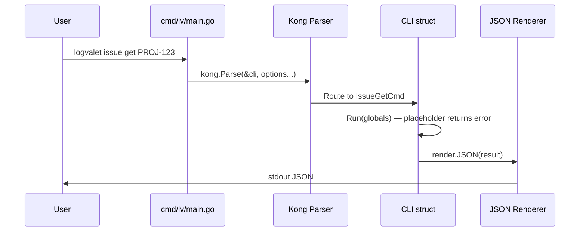

# Roadmap: logvalet

## Meta
| 項目 | 値 |
|------|---|
| ゴール | Backlog 向け LLM-first CLI の MVP 完成 |
| 成功基準 | 全 digest コマンドが安定 JSON スキーマで動作し、Homebrew tap 経由でインストール可能 |
| 制約 | Go 1.26.1 / Kong CLI / TDD 必須 / モックベーステスト / コード品質優先 |
| 対象リポジトリ | /Users/youyo/src/github.com/youyo/logvaret |
| 作成日 | 2026-03-13 |
| 最終更新 | 2026-03-13 09:30 |
| ステータス | 未着手 |

## Current Focus
- **マイルストーン**: M01 — Project scaffold & CLI foundation
- **直近の完了**: 設計仕様書の作成
- **次のアクション**: M01 の詳細計画を確定し実装を開始する

## Progress

### M01: Project scaffold & CLI foundation
- [ ] go.mod 初期化 (github.com/youyo/logvalet)
- [ ] ディレクトリ構造作成 (spec §16)
- [ ] cmd/lv/main.go — Kong エントリポイント
- [ ] GlobalFlags / DigestFlags / ListFlags / WriteFlags (spec §17.1-17.2)
- [ ] Root CLI struct — 全コマンドプレースホルダー (spec §17.3)
- [ ] Version package — ldflags 注入 (spec §23)
- [ ] Exit code 定義 (spec §8)
- [ ] JSON renderer (デフォルト出力)
- [ ] Completion commands — bash/zsh/fish + --short (spec §6)
- 📄 詳細: plans/logvalet-m01-scaffold.md

### M02: Config system
- [ ] config.toml スキーマ定義・ローダー (spec §5)
- [ ] Profile 解決ロジック
- [ ] 環境変数オーバーライド
- [ ] Boolean env parsing (1/true/yes/on)
- [ ] 設定値優先順位 (CLI flags > env > config > defaults)
- 📄 詳細: plans/logvalet-m02-config.md (着手時に生成)

### M03: Credential system & auth commands
- [ ] tokens.json スキーマ・ストア (spec §5)
- [ ] Credential resolver (優先順位付き)
- [ ] OAuth localhost callback フロー
- [ ] API key サポート
- [ ] auth login / logout / whoami / list (spec §5)
- 📄 詳細: plans/logvalet-m03-auth.md (着手時に生成)

### M04: Backlog API client core
- [ ] Client interface 定義 (spec §18.1 — 全メソッド)
- [ ] HTTP transport + auth header injection
- [ ] Request/Response option types (spec §18.2-18.3)
- [ ] Typed error handling (spec §18.4 — ErrNotFound 等)
- [ ] Exit code マッピング
- 📄 詳細: plans/logvalet-m04-api-client.md (着手時に生成)

### M05: Domain models & full rendering
- [ ] Domain types: issue, project, activity, user, document, team, space (spec §11-12)
- [ ] Warning / error envelope types (spec §9)
- [ ] Renderer interface (spec §20)
- [ ] JSON renderer (pretty-print 対応)
- [ ] YAML renderer
- [ ] Markdown renderer
- [ ] Text renderer
- 📄 詳細: plans/logvalet-m05-domain-render.md (着手時に生成)

### M06: Issue read & digest
- [ ] issue get コマンド (spec §14.1)
- [ ] issue list コマンド (spec §14.2)
- [ ] IssueDigestBuilder (spec §19)
- [ ] issue digest コマンド (spec §14.3, §13.1)
- [ ] Golden tests — digest JSON 出力
- 📄 詳細: plans/logvalet-m06-issue-read.md (着手時に生成)

### M07: Project & meta commands
- [ ] project get / list (spec §14.9-14.10)
- [ ] ProjectDigestBuilder
- [ ] project digest (spec §14.11, §13.2)
- [ ] meta status / category / version / custom-field (spec §14.23-14.26)
- 📄 詳細: plans/logvalet-m07-project-meta.md (着手時に生成)

### M08: Issue write operations
- [ ] issue create (spec §14.4)
- [ ] issue update (spec §14.5)
- [ ] issue comment list / add / update (spec §14.6-14.8)
- [ ] 排他フラグバリデーション (--content vs --content-file)
- [ ] --dry-run サポート
- 📄 詳細: plans/logvalet-m08-issue-write.md (着手時に生成)

### M09: Document commands
- [ ] document get / list / tree (spec §14.18-14.20)
- [ ] DocumentDigestBuilder (spec §13.5)
- [ ] document digest (spec §14.21)
- [ ] document create (spec §14.22)
- 📄 詳細: plans/logvalet-m09-document.md (着手時に生成)

### M10: Activity & user commands
- [ ] activity list (spec §14.12)
- [ ] ActivityDigestBuilder (spec §13.3)
- [ ] activity digest (spec §14.13)
- [ ] user list / get (spec §14.14-14.15)
- [ ] user activity (spec §14.16)
- [ ] UserDigestBuilder (spec §13.4)
- [ ] user digest (spec §14.17)
- 📄 詳細: plans/logvalet-m10-activity-user.md (着手時に生成)

### M11: Team & space commands
- [ ] team list / project (spec §14.27-14.28)
- [ ] TeamDigestBuilder (spec §13.6)
- [ ] team digest (spec §14.29)
- [ ] space info / disk-usage (spec §14.30-14.31)
- [ ] SpaceDigestBuilder (spec §13.7)
- [ ] space digest (spec §14.32)
- 📄 詳細: plans/logvalet-m11-team-space.md (着手時に生成)

### M12: Release pipeline & distribution
- [ ] .goreleaser.yaml (spec §21)
- [ ] .github/workflows/release.yml (spec §22)
- [ ] README.md / README.ja.md
- [ ] skills/SKILL.md (docs/specs からコピー・調整)
- 📄 詳細: plans/logvalet-m12-release.md (着手時に生成)

## Blockers
なし

## Architecture Decisions
| # | 決定 | 理由 | 日付 |
|---|------|------|------|
| 1 | TDD 必須 (Red→Green→Refactor) | CLAUDE.md ルール + コード品質優先の方針 | 2026-03-13 |
| 2 | Backlog API テストはモックのみ | interface ベースで Client を定義し、テストではモック実装を使用 | 2026-03-13 |
| 3 | 12 マイルストーン分割 | スペックの 5 フェーズをより細かい粒度に分割し、各マイルストーンを独立してデリバリー可能にする | 2026-03-13 |
| 4 | M2 以降の詳細計画は遅延生成 | 着手時に最新のコードベース状態を反映するため | 2026-03-13 |

## Changelog
| 日時 | 種別 | 内容 |
|------|------|------|
| 2026-03-13 09:30 | 作成 | ロードマップ初版作成。スペックの 5 フェーズを 12 マイルストーンに分割 |

---

# M01: Project scaffold & CLI foundation

## Overview
| 項目 | 値 |
|------|---|
| ステータス | 未着手 |
| 依存 | なし（最初のマイルストーン） |
| 対象ファイル | go.mod, cmd/lv/main.go, internal/cli/*.go, internal/version/version.go, internal/render/json.go, internal/render/render.go, internal/app/exitcode.go |

## Goal
logvalet CLI の骨格を構築する。`logvalet --help` が動作し、全サブコマンドのプレースホルダーが Kong で登録され、JSON 出力とシェル補完が機能する状態にする。

## Sequence Diagram

## TDD Test Design

| # | テストケース | テスト対象 | 入力 | 期待出力 |
|---|-------------|-----------|------|---------|
| 1 | Version パッケージのデフォルト値 | internal/version | — | Version="dev", Commit="none", Date="unknown" |
| 2 | Exit code 定数が正しい | internal/app/exitcode | — | Success=0, GenericError=1, ..., ConfigError=10 |
| 3 | JSON renderer で struct を出力 | internal/render | 任意の struct | 正しい JSON bytes |
| 4 | JSON renderer pretty-print | internal/render | struct + Pretty=true | インデント付き JSON |
| 5 | Kong root CLI が parse できる | internal/cli | `--help` | エラーなし |
| 6 | GlobalFlags が env から設定される | internal/cli | env LOGVALET_FORMAT=yaml | Format="yaml" |
| 7 | 未実装コマンドのプレースホルダー | internal/cli | `issue get PROJ-1` | "not implemented" エラー + exit 1 |
| 8 | Completion 出力に logvalet が含まれる | internal/cli | `completion zsh` | "logvalet" を含む出力 |
| 9 | --short で lv エイリアスも含む | internal/cli | `completion zsh --short` | "lv" を含む出力 |

## Implementation Steps (TDD: Red → Green → Refactor)

### Step 1: go.mod 初期化 & ディレクトリ構造
- [ ] `go mod init github.com/youyo/logvalet`
- [ ] ディレクトリ作成: cmd/lv/, internal/{app,cli,version,render}/
- [ ] 空の main.go を配置して `go build` が通ることを確認

### Step 2: Version package (Red → Green → Refactor)
- [ ] **Red**: `internal/version/version_test.go` — デフォルト値テスト
- [ ] **Green**: `internal/version/version.go` — var Version/Commit/Date
- [ ] **Refactor**: 不要なら省略

### Step 3: Exit code 定義 (Red → Green → Refactor)
- [ ] **Red**: `internal/app/exitcode_test.go` — 各コード値のテスト
- [ ] **Green**: `internal/app/exitcode.go` — const 定義 (0-10)
- [ ] **Refactor**: 不要なら省略

### Step 4: JSON renderer (Red → Green → Refactor)
- [ ] **Red**: `internal/render/json_test.go` — struct→JSON, pretty-print テスト
- [ ] **Green**: `internal/render/render.go` — Renderer interface 定義
- [ ] **Green**: `internal/render/json.go` — JSONRenderer 実装
- [ ] **Refactor**: 共通ヘルパー抽出があれば

### Step 5: GlobalFlags & shared option groups
- [ ] **Red**: `internal/cli/global_flags_test.go` — env タグのテスト、デフォルト値テスト
- [ ] **Green**: `internal/cli/global_flags.go` — GlobalFlags / DigestFlags / ListFlags / WriteFlags struct
- [ ] **Refactor**: 不要なら省略

### Step 6: Root CLI struct & Kong bootstrap
- [ ] **Red**: `internal/cli/root_test.go` — kong.Parse テスト、--help テスト
- [ ] **Green**: `internal/cli/root.go` — CLI struct with all command placeholders
- [ ] **Green**: 各コマンド stub ファイル (auth.go, issue.go, project.go, activity.go, user.go, document.go, meta.go, team.go, space.go) — 各 Run() は "not implemented" エラーを返す
- [ ] **Green**: `cmd/lv/main.go` — Kong エントリポイント
- [ ] **Refactor**: コマンド stub の共通パターン抽出

### Step 7: Completion commands (Red → Green → Refactor)
- [ ] **Red**: `internal/cli/completion_test.go` — zsh/bash/fish 出力テスト、--short テスト
- [ ] **Green**: `internal/cli/completion.go` — Kong の completion 機能を利用
- [ ] **Refactor**: 不要なら省略

### Step 8: 統合確認
- [ ] `go build ./cmd/lv/` が成功
- [ ] `go test ./...` が全パス
- [ ] `./lv --help` が全サブコマンドを表示
- [ ] `./lv completion zsh --short` が logvalet + lv の補完を出力
- [ ] `go vet ./...` がクリーン

## Key Files

| ファイル | 責務 |
|---------|------|
| `cmd/lv/main.go` | エントリポイント。Kong parse + version 注入 |
| `internal/cli/root.go` | CLI struct（全コマンドハブ） |
| `internal/cli/global_flags.go` | GlobalFlags / DigestFlags / ListFlags / WriteFlags |
| `internal/cli/completion.go` | シェル補完生成 |
| `internal/cli/auth.go` | auth コマンド stub |
| `internal/cli/issue.go` | issue コマンド stub (spec §17.4 のスケルトン) |
| `internal/cli/project.go` | project コマンド stub |
| `internal/cli/activity.go` | activity コマンド stub |
| `internal/cli/user.go` | user コマンド stub |
| `internal/cli/document.go` | document コマンド stub |
| `internal/cli/meta.go` | meta コマンド stub |
| `internal/cli/team.go` | team コマンド stub |
| `internal/cli/space.go` | space コマンド stub |
| `internal/version/version.go` | Version / Commit / Date 変数 |
| `internal/app/exitcode.go` | Exit code 定数 |
| `internal/render/render.go` | Renderer interface |
| `internal/render/json.go` | JSON renderer |

## Risks
| リスク | 影響度 | 対策 |
|--------|--------|------|
| Kong の Go 1.26.1 互換性 | 中 | 最新の Kong バージョンを確認し、互換性問題があれば pin |
| Completion の --short フラグ実装 | 低 | Kong 標準の completion に lv エイリアス用の追加処理が必要。カスタム completion handler で対応 |
| コマンド stub が多く手間がかかる | 低 | 共通の "not implemented" パターンで統一し、コピペを最小化 |

## Verification
1. `go test ./...` — 全テストパス
2. `go build -o lv ./cmd/lv/ && ./lv --help` — 全コマンドが表示される
3. `./lv --version` — "dev (none) unknown" 相当の出力
4. `./lv completion zsh --short | head -5` — 補完スクリプトが出力される
5. `./lv issue get PROJ-1` — "not implemented" エラーで exit 1
